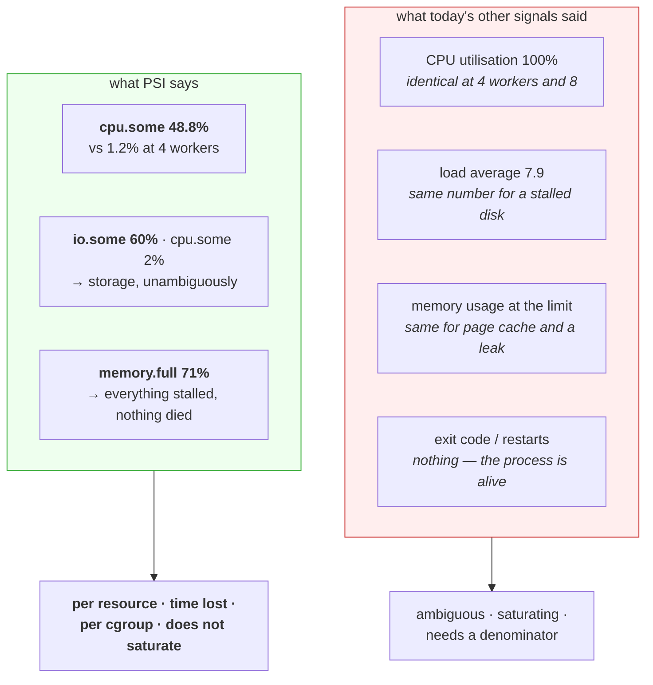

# 4.4 — Pressure — the signal that warns you first

## One-line answer

Pressure stall information is the kernel telling you what fraction of time your tasks spent *unable to
make progress* because of CPU, memory or I/O — separately, as three numbers — which is precisely the
question every other signal on this day answered ambiguously or not at all.

---

## The story

🎬 **The scene.** A small factory with a manager who wants to know how things are going.

For years she has had two instruments: a meter showing how much electricity the machines are drawing, and
a headcount of people on the floor. Both are always healthy. The machines draw power; the people are
there.

Then a supplier is late, and for three hours nobody can do anything. The power meter reads normal — the
machines idle at almost the same draw. The headcount is unchanged; everybody is standing by their station.
**Both instruments say the factory is fine, and nothing has been made since ten o'clock.**

😬 **The naive fix.** Buy a better power meter.

💥 **Why it fails.** No refinement of a utilisation measurement will ever detect *waiting*, because
waiting is the absence of the thing being measured. **The instrument answers "how much are we using" and
the question is "how much are we prevented from doing."**

💡 **The insight.** Utilisation and starvation are different quantities, and no amount of precision on the
first produces the second. **You have to measure the thing you actually care about — lost progress —
directly**, and it needs its own instrument.

---

## The idea in plain language

Every signal on this day has had the same weakness. CPU utilisation saturates and stops carrying
information ([2.1](../02-cpu/2.1-a-core-is-a-queue-not-a-speed.md)). Load average conflates two kinds of
waiting ([2.2](../02-cpu/2.2-load-average-and-what-it-is-not.md)). Memory usage includes reclaimable cache
([1.3](../01-memory/1.3-the-page-cache-that-looks-like-a-leak.md)). Throttling counters are per-resource
but only exist when a limit is set ([2.3](../02-cpu/2.3-throttling-the-slowdown-with-no-symptom.md)).

**Pressure stall information was designed to fix all of that.** Verified against
`docs.kernel.org/accounting/psi.html` on **2026-08-24**: *"When CPU, memory or IO devices are contended,
workloads experience latency spikes, throughput losses, and run the risk of OOM kills."* PSI identifies
and quantifies those disruptions.

It is exported as three files — `/proc/pressure/cpu`, `/proc/pressure/memory`, `/proc/pressure/io` — and
each contains two lines.

### `some` and `full`

Verbatim from the same page:

- **`some`** — *"the share of time in which at least some tasks are stalled on a given resource"*.
- **`full`** — *"the share of time in which all non-idle tasks are stalled on a given resource
  simultaneously"*, representing a thrashing state where actual work ceases.

**`some` is your early warning. `full` is your emergency.** A machine with `some` at 15% and `full` at 0%
is losing a little throughput and is fine. A machine with `full` above zero is one where **nothing is
happening at all** for that fraction of the time — every task, stalled, simultaneously.

`full` is not reported for CPU, and the reason is worth knowing: on a contended processor there is always
by definition at least one task running, so "all tasks stalled" cannot occur.

### The fields

Each line carries `avg10`, `avg60`, `avg300` and `total`. Also verbatim: the averages are *"percentages
tracked over ten, sixty, and three-hundred-second windows"*, and `total` is *"total absolute stall time
(in us)"*.

**The three windows serve the same purpose as load average's three numbers**
([2.2](../02-cpu/2.2-load-average-and-what-it-is-not.md)): comparing them tells you direction. Rising
means it is getting worse.

**`total` is the one to scrape.** It is a monotonic counter of microseconds, so a monitoring system can
compute a rate over whatever window it likes rather than being stuck with ten, sixty and three hundred
seconds — which is exactly the shape Prometheus wants (Day 62).

### Why this is the right shape

Three properties that none of today's other signals have together:

**It is per resource.** CPU, memory and I/O separately — so it answers the question load average could
not. A machine with `io.some` at 60% and `cpu.some` at 2% has a storage problem and nothing else, in one
reading.

**It is a percentage of time lost, not of capacity used.** So it does not saturate. There is no "100% and
then what" problem: 100% here means all the time, which is unambiguous.

**It is available per cgroup.** The same files exist inside each cgroup's directory
([3.1](../03-limits/3.1-cgroups-the-box-you-put-a-process-in.md)), so you can ask "is *this workload*
starved" rather than "is the machine busy" — which is the multi-tenant question, and the one that
identifies which tenant to act on.

### What it does not do

It measures *time lost*, not *why*. High memory pressure tells you the workload is stalling on reclaim; it
does not say whether that is a leak, a legitimate working set, or a cache under pressure. **It is a very
good smoke detector and it is not a diagnosis** — which is the same caveat as load average, honestly
stated, with the ambiguity removed.

---

## Why Kriya needs it

Day 62 exposes metrics and Day 63 writes PromQL. `node_pressure_memory_waiting_seconds_total` and its
siblings come straight from these files, and they are among the most useful node metrics there are.

Day 76 builds the first alert, and this part is the strongest available argument for what to alert on:
`full` above zero for a sustained period is unambiguous, actionable and rare, which is everything an alert
should be.

Day 50 pushes this four-core machine past its limit, where `cpu.some` is the number that says how much
throughput the contention actually cost.

Day 118 monitors a model server whose failure modes are memory pressure and I/O stalls, both of which
present as latency with no utilisation symptom.

---

## The mechanism

Read the three files, then make one of them move.

```bash
for r in cpu memory io; do echo "--- $r ---"; cat /proc/pressure/$r 2>/dev/null; done || echo "no PSI here — Windows; run in WSL2 from Day 21"
```

**Line by line:**

- A loop over the three resources so the output is one block you can read and paste into an incident
  record.
- `2>/dev/null` on the `cat` and a fallback message — **PSI needs Linux 4.20 or later and the kernel
  built with `CONFIG_PSI`**, so a missing file means "not available here" rather than "no pressure",
  and conflating those two would be a serious misreading.

On an idle Linux machine:

```text
--- cpu ---
some avg10=0.00 avg60=0.00 avg300=0.00 total=1284003
--- memory ---
some avg10=0.00 avg60=0.00 avg300=0.00 total=88214
full avg10=0.00 avg60=0.00 avg300=0.00 total=41008
--- io ---
some avg10=0.14 avg60=0.09 avg300=0.11 total=88412094
full avg10=0.11 avg60=0.07 avg300=0.09 total=71203881
```

**Read the shape rather than the values.** CPU has only a `some` line, for the reason above. Memory and
I/O have both. Everything is near zero except a little background I/O, which is a machine doing nothing
much — **and `total` is non-zero on all of them because it is cumulative since boot**, so a large `total`
on a machine with 89 days of uptime says nothing on its own. **Only the rate matters.**

### Making CPU pressure move

```bash
uv run python days/day-006-resources-and-the-oom-killer/lab/burn.py 8 30 &
sleep 15
cat /proc/pressure/cpu 2>/dev/null
uptime
```

**Line by line:**

- Eight workers on four cores — the over-subscription from
  [2.1](../02-cpu/2.1-a-core-is-a-queue-not-a-speed.md), which produced 100% utilisation and told you
  nothing about the queue.
- `sleep 15` — **long enough for `avg10` to reflect reality.** Reading it after two seconds shows you the
  previous state, the same mistake as measuring load average too early
  ([2.2](../02-cpu/2.2-load-average-and-what-it-is-not.md)).
- Printing `uptime` alongside so you can compare the two signals on the same moment.

```text
some avg10=48.82 avg60=17.40 avg300=3.91 total=8412990
 21:04:18 up 3 days,  3:36,  1 user,  load average: 7.91, 3.42, 1.51
```

**`cpu.some avg10=48.82` — tasks were stalled waiting for a processor 49% of the time.**

**Compare that with what the other two signals said about the same moment.** Utilisation was 100%, which
it also was when four workers ran on four cores and nobody waited
([2.1](../02-cpu/2.1-a-core-is-a-queue-not-a-speed.md)) — identical reading, completely different
situation. Load average was 7.91, which requires you to know the core count to interpret and would have
looked the same for a stalled disk.

**PSI says 49% of the time was lost.** That is a throughput statement, it needs no denominator, and it is
about the processor specifically.

Run the four-worker case for contrast:

```bash
uv run python days/day-006-resources-and-the-oom-killer/lab/burn.py 4 30 &
sleep 15
cat /proc/pressure/cpu 2>/dev/null
```

**Line by line:** exactly as many workers as cores — full utilisation, nobody queued.

```text
some avg10=1.24 avg60=9.10 avg300=4.02 total=8498112
```

**`avg10` of 1.24 against 48.82.** Utilisation was 100% in both cases and indistinguishable. **PSI
separated them by a factor of forty**, and that separation is precisely the information you needed.

### Making memory pressure move

```bash
# 🅿️ PARKED until Day 21 (WSL2). Confined to a cgroup so the machine is never at risk.
# sudo mkdir -p /sys/fs/cgroup/kriya-psi
# echo "256M" | sudo tee /sys/fs/cgroup/kriya-psi/memory.high    # the BRAKE, not the cliff
# echo "max"  | sudo tee /sys/fs/cgroup/kriya-psi/memory.max
#
# uv run python days/day-006-resources-and-the-oom-killer/lab/allocate.py 512 &
# PID=$!
# echo "$PID" | sudo tee /sys/fs/cgroup/kriya-psi/cgroup.procs
# sleep 15
# cat /sys/fs/cgroup/kriya-psi/memory.pressure
# cat /sys/fs/cgroup/kriya-psi/memory.events
# kill "$PID"; sudo rmdir /sys/fs/cgroup/kriya-psi
```

**Line by line:**

- **`memory.high` set and `memory.max` left at `max`** — deliberately the brake rather than the cliff
  ([3.2](../03-limits/3.2-memory-max-versus-memory-high.md)). This produces sustained reclaim pressure
  without a kill, which is exactly the state PSI exists to quantify. **Setting the cliff instead would
  kill the process and there would be nothing to measure.**
- `memory.pressure` — **the per-cgroup PSI file**, the same format as `/proc/pressure/memory` but scoped
  to this cgroup. This is the multi-tenant version and it is what makes PSI useful in a cluster.
- Reading `memory.events` alongside, so you see `high` climbing
  ([3.2](../03-limits/3.2-memory-max-versus-memory-high.md)) and the pressure percentage together — **two
  views of the same event**, one a count and one a fraction of time.

Expected:

```text
some avg10=88.41 avg60=42.10 avg300=9.88 total=41229880
full avg10=71.02 avg60=33.44 avg300=7.91 total=33018772
low 0
high 3812
max 0
oom 0
oom_kill 0
```

**`full avg10=71.02` is the alarming number.** For 71% of the last ten seconds, **every task in this
cgroup was stalled simultaneously** — the workload was doing essentially nothing, while being alive,
passing health checks, and reporting comfortable memory usage.

**This is the state part [3.2](../03-limits/3.2-memory-max-versus-memory-high.md) described as "alive and
useless", quantified.** And note `oom_kill 0`: nothing died, so exit codes, restart counts and termination
reasons would all show nothing at all.



Clean up:

```bash
pgrep -af burn.py || echo "no burners left"
```

**Line by line:** the burners exit on their deadline
([2.1](../02-cpu/2.1-a-core-is-a-queue-not-a-speed.md)), but confirm rather than assume — a forgotten
burner would keep `cpu.some` elevated and contaminate everything you measure afterwards.

---

## When it breaks

**The files do not exist.** The availability question:

```text
$ cat /proc/pressure/cpu
cat: /proc/pressure/cpu: No such file or directory
```

**What it says:** no such file.
**What it actually means:** either the kernel predates 4.20, or it was built without `CONFIG_PSI`, or PSI
is disabled at boot with `psi=0`. **It does not mean there is no pressure**, and treating a missing file
as a zero reading is a serious misreading that a monitoring agent can easily make.
**The smallest fix:** `grep CONFIG_PSI /boot/config-$(uname -r)` to see whether it is compiled in, and
check the kernel command line for `psi=0`. **On some distributions it is built in but off by default**,
requiring `psi=1`, precisely because the accounting has a small cost.

**High `total` on a healthy machine.** The cumulative-counter trap:

```text
$ cat /proc/pressure/io
some avg10=0.00 avg60=0.00 avg300=0.00 total=884120940221
```

**What it says:** 884 billion microseconds of stall — about ten days.
**What it actually means:** **`total` is cumulative since boot**, and this machine has been up for
months. Ten days of accumulated I/O stall across that period is unremarkable.
**The smallest fix:** ignore the absolute value and compute a **rate**. This is exactly why `total` is the
field to scrape: a monitoring system takes the derivative and gets "microseconds of stall per second",
which is comparable across machines and across uptimes. **The `avg` fields are for humans reading a
terminal; `total` is for machines.**

**`some` high and `full` zero, and everything is fine.** Reading the two lines correctly:

```text
some avg10=34.20 avg60=28.11 avg300=25.90
full avg10=0.00 avg60=0.00 avg300=0.00
```

**What it says:** a third of the time, some task was stalled.
**What it actually means:** the machine is busy and losing a little throughput, and **at no point were all
tasks stalled simultaneously** — so work was always progressing. On a machine running many workloads,
`some` in the tens of percent is often just what a fully-used machine looks like.
**The rule worth keeping:** **`some` is a capacity conversation; `full` is an incident.** Alerting on
`some` at a low threshold produces noise on any busy machine.

**Pressure inside a container that reports the host's numbers.** The namespacing question:

```text
$ kubectl exec api-5f8c -- cat /proc/pressure/cpu
some avg10=41.20 avg60=38.14 avg300=35.02
```

**What it says:** high CPU pressure inside the container.
**What it actually means:** possibly the host's, not yours — `/proc/pressure/*` is not namespaced any more
than `/proc/loadavg` is
([2.2](../02-cpu/2.2-load-average-and-what-it-is-not.md)). **Your neighbours' contention appears as
yours.**
**The smallest fix:** read the **cgroup's** pressure files instead — `/sys/fs/cgroup/cpu.pressure`,
`memory.pressure`, `io.pressure` — which are scoped to your workload. **This is the single most useful
thing to know about PSI in a container**, and it is the difference between "the node is busy" and "we are
being starved".

**Memory pressure with no memory problem.** The indirection:

```text
$ cat /proc/pressure/memory
some avg10=22.10 avg60=19.80 avg300=18.02
full avg10=8.40 avg60=7.11 avg300=6.90
$ free -h | head -2
               total        used        free      shared  buff/cache   available
Mem:            31Gi       6.2Gi       412Mi        88Mi        24Gi        24Gi
```

**What it says:** sustained memory pressure with 24 GiB available.
**What it actually means:** memory pressure counts stalls on **reclaim**, and reclaim happens when the
kernel is dropping and re-reading page cache
([1.3](../01-memory/1.3-the-page-cache-that-looks-like-a-leak.md)). A workload whose working set exceeds
what the cache can hold thrashes — reading a file, having it dropped, reading it again — and stalls on
every re-read. **The memory is "available" and the workload is starved of it.**
**The smallest fix:** more memory, or a smaller working set. **The reason this matters:** it is a
performance problem that `free` and `MemAvailable` are structurally unable to show, and PSI is the only
signal that does.

---

## In production

**What a professional writes instead of the teaching version.** They put PSI on the node dashboard next to
utilisation and read them together: utilisation says how much is being used, pressure says how much is
being lost. And in a cluster they use the **cgroup** pressure files rather than the host ones, because the
question is almost always "is this workload starved" rather than "is this machine busy". Where PSI is
available it replaces load average entirely as a triage signal, for the ambiguity reason in
[2.2](../02-cpu/2.2-load-average-and-what-it-is-not.md).

**What degrades at scale.** Nothing, which is unusual and is the point. PSI is per resource, per cgroup,
expressed as a fraction of time, and does not saturate — so it aggregates sensibly across a fleet in a way
that load average never has. A percentile of `memory.full` across nodes is a meaningful fleet health
number; a percentile of load average is not, because the values are not comparable between machines with
different core counts.

**The failure that only shows with real traffic.** The stall that is too short to see any other way. A
workload that stalls for 40 milliseconds in every second loses 4% of its throughput and shows *nothing* in
utilisation, load average, or memory usage — all of which are averages that absorb it completely. **PSI's
`total` counter accumulates every microsecond of it**, so the rate is visible even when the individual
stalls are far too short to catch by sampling. This is the class of problem that gets described as "it is
just a bit slow sometimes" and never diagnosed.

**The review comment a senior engineer leaves.** *"We are alerting on node memory utilisation at 90%,
which fires constantly because of page cache and has been muted for two months. Replace it with
`memory.full` above 10% for five minutes — that means every task on the node was stalled a tenth of the
time, which is never normal and is always worth waking someone for."*

**The signal you would alert on.** **`full` above a small threshold, sustained** — for memory and I/O.
It is unambiguous (all tasks stalled simultaneously), it is rare on a healthy system, and it means real
work has stopped. Something like 10% over five minutes is a defensible starting point, tightened from
observation. For CPU there is no `full`, so **`cpu.some` above a higher threshold** — 50% or so — sustained,
which says half your time is spent waiting for a processor. **Scrape `total` and compute rates**, never
alert on the `avg` fields directly, because their windows are fixed and your alerting window should not
be. And in containers, **always the cgroup files, never `/proc/pressure`** — the host's numbers include
your neighbours. You would **not** alert on `some` at a low threshold; on a busy machine that is the
normal state and the alert would be muted within a week, which is how the memory-utilisation alert in the
review comment above got where it is.

**Blast radius.** This part re-uses the burner from
[2.1](../02-cpu/2.1-a-core-is-a-queue-not-a-speed.md) and, in its parked half, drives a cgroup into
sustained reclaim. Worst case for the runnable half: the machine is unresponsive for thirty seconds and
recovers fully. **The parked half is the gentler of the two memory experiments in this day**, because it
uses `memory.high` rather than `memory.max` — the brake rather than the cliff — so nothing is killed and
the process can be stopped normally. Who can trigger it: you. What bounds it: the burner's deadline
argument, the cgroup confinement, and the fact that reading pressure files is entirely passive. ⚠️ The
usual rule still applies: **do not run the burner while measuring anything else**, and not with the
observability stack up (Addendum 02 §4).

**Cost.** `0` model calls, `0` tokens, `0` CI minutes, `0` disk. **Processor: all four cores for 30
seconds, twice. RAM: 512 MiB in the parked half, bounded by the cgroup.** Reading the pressure files is
free. **PSI accounting itself has a small permanent cost in the kernel** — which is why some
distributions ship it disabled and require `psi=1` — and it is worth paying, because it is the only signal
on this day that answers the question directly.

**The interview question.** *"What would you monitor to catch resource starvation before it causes an
incident?"* The answer that lands names PSI and says why the alternatives fail: *"Pressure stall
information, if the kernel has it. The problem with the usual signals is that they measure consumption
rather than loss — CPU utilisation saturates at 100% and reads identically whether one task is waiting or
forty, load average conflates runnable tasks with tasks blocked on disk so a failing disk and a busy
processor give the same number, and memory usage includes reclaimable page cache so it sits near the limit
on healthy machines. PSI reports the fraction of time tasks were stalled, separately for CPU, memory and
I/O, so it does not saturate and it does not need a denominator. The two lines matter: `some` means at
least one task was stalled, which is a capacity conversation; `full` means every task was stalled
simultaneously, which means work has stopped and is always worth paging on. And in a container I read the
cgroup's own pressure files, because `/proc/pressure` is not namespaced and would show me my neighbours'
contention."*

---

## Check yourself

```bash
for r in cpu memory io; do printf '%-7s ' "$r"; cat /proc/pressure/$r 2>/dev/null | head -1 || echo "(unavailable)"; done; echo "--- now with 2x cores busy ---"; uv run python days/day-006-resources-and-the-oom-killer/lab/burn.py "$(( $(nproc) * 2 ))" 25 & sleep 15; cat /proc/pressure/cpu 2>/dev/null | head -1 || echo "no PSI — Windows; run in WSL2 from Day 21"; wait
```

The three `some` lines at rest, then `cpu.some` under twice as many workers as cores. **The `avg10` figure
should go from near zero to somewhere around 50** — and the number to hold onto is that **CPU utilisation
was 100% in both readings.** One signal distinguished the two states; the other could not.

**Say out loud, without scrolling up:** *`some` and `full` measure different things. Define each, say which
one you would page on and why, and explain why CPU has no `full` line at all.*
