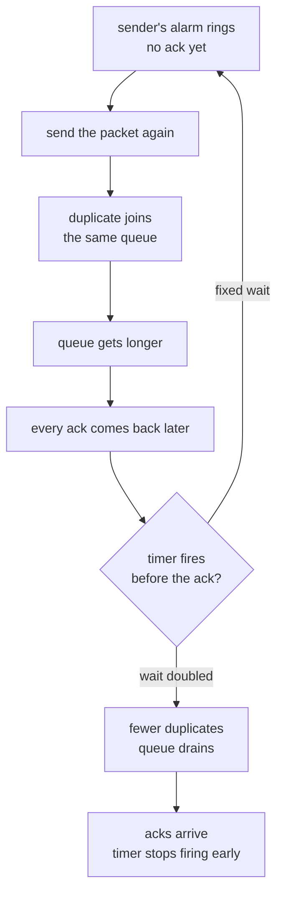

# 5.4 — Congestion Avoidance and Control

## One-line answer

The doubling wait you put in your retry ladder in
[5.2](5.2-retries-that-turn-a-blip-into-an-outage.md) is not a convention somebody picked because it
looked tidy — it comes from a 1988 paper that watched a link between two buildings four hundred yards
apart collapse from 32 Kbps to 40 bps, and argued that for senders who cannot see each other,
**exponential is the only backoff shape with any hope of working**.

---

## The citation

| | |
| --- | --- |
| **Title** | *Congestion Avoidance and Control* |
| **Year** | 1988 — presented at SIGCOMM '88; the linked copy is the slightly revised version dated November 1988 |
| **Venue** | Proceedings of ACM SIGCOMM 1988 |
| **Free to read** | `https://ee.lbl.gov/papers/congavoid.pdf` |
| **Read on** | **2026-08-25** — every quotation below was taken from that PDF on that date |
| **Slug** | `congestion-avoidance-and-control` — declare it in a part's `papers:` and link here |

The paper carries its own citation instruction, which is worth honouring: *"This is a very slightly
revised version of a paper originally presented at SIGCOMM '88."*

> **Why no names appear here.** This curriculum cites by title, year and venue and never by author
> (plan §18.4). It is not squeamishness: a citation is a *fact*, and the checkable facts about a
> paper are its title, where it appeared, when, and what it says. `./o depth` rejects "et al." for
> the same reason it rejects an invented flag.

---

## The story

🎬 **The scene.** October 1986. Two sites, four hundred yards apart — close enough to walk between
them in a minute-and-a-bit. They are joined by a link that has been moving data between them for
years at 32 Kbps.

One day it starts moving data at **40 bps**.

Not 40 kilobits. Forty bits per second. A thousandth of what it did the day before. Nothing was
unplugged, no cable was cut, no machine caught fire, and the little lights on both ends are still
blinking merrily. Every machine involved reports that it is working perfectly and trying its
hardest.

😬 **The naive fix.** Everything is slow, so everything gives up waiting sooner and sends its data
again. This is the obvious response and every machine on the link is already doing it — that is what
"trying its hardest" means.

💥 **Why it fails.** *That is the cause.* The link was never broken. It was **full**, and full means
things wait in a queue, and waiting is exactly what makes an impatient sender decide its data was
lost and send it again. The second copy joins the same queue behind the first, making the queue
longer, making everyone wait longer, making everyone more impatient. The link ends up spending
almost all of its capacity carrying **copies of things it has already delivered**.

A traffic jam where every driver, seeing they are late, decides the answer is to send a second car.

💡 **The insight.** The senders cannot see the queue and cannot ask about it. They cannot even tell
the difference between "my data was lost" and "my data is still waiting". So they cannot be fixed by
being told what is happening — they can only be fixed by **how they behave when they hear nothing**.
And what they do when they hear nothing has to get dramatically more patient each time, because a
network of impatient strangers, all reacting to the same silence at the same speed, is a system that
feeds its own failure.

---

## The idea in plain language

The paper's whole argument hangs off one sentence, which it calls the **conservation of packets**
principle: for a connection running steadily, *"a new packet isn't put into the network until an old
packet leaves."*

If that is true of everybody, the network is stable. So the paper asks the useful question: what are
the ways it can stop being true? It names exactly three:

> *"1. The connection doesn't get to equilibrium, or
> 2. A sender injects a new packet before an old packet has exited, or
> 3. The equilibrium can't be reached because of resource limits along the path."*

**Failure 2 is the one this part is about**, and the paper is blunt about whose fault it is:
*"Assuming that the protocol implementation is correct, (2) must represent a failure of sender's
retransmit timer."* A **retransmit timer** is the alarm clock a sender sets when it sends something:
if no acknowledgement comes back before the alarm rings, the sender assumes the data was lost and
sends it again.

That alarm clock is the whole problem, because **silence is ambiguous**. No acknowledgement can mean
the data was lost, or it can mean the data is sitting in a queue behind two hundred other things and
will arrive shortly. The sender cannot tell. And the paper points out that the ambiguity is worst
exactly when it matters: from queuing theory, as load rises towards capacity, both the round-trip
time and *its variability* blow up — at 75% load *"one should expect round-trip-time to vary by a
factor of sixteen"*.

So a sender with a fixed, confident timeout will start retransmitting things that were merely
delayed. The paper's verdict on that is one of the great sentences in systems literature:

> *"This forces the network to do useless work, wasting bandwidth on duplicates of packets that will
> eventually be delivered, at a time when it's known to be having trouble with useful work. I.e.,
> this is the network equivalent of pouring gasoline on a fire."*

**Why exponential, specifically?** The paper's answer is an argument about stability, not about
taste. A network, it says, is to a good approximation a *linear system* — built out of things that
delay, add and amplify. Linear system theory says that when such a system is stable, *"the stability
is exponential"*. So an unstable one can be stabilised by *"adding some exponential damping
(exponential timer backoff) to its primary excitation (senders, traffic sources)"*.

In plainer words: the thing making the mess grows exponentially, so the brake has to grow
exponentially too. A brake that grows linearly loses the race.

---

## Why Kriya needs it

You already built this, one part ago, without being told where it came from.

[5.2](5.2-retries-that-turn-a-blip-into-an-outage.md) had you write a client that waits 1 s, then
2 s, then 4 s. That is *exponential retransmit timer backoff*, which is item **(ii)** on this
paper's list of seven algorithms — put into Berkeley Unix's TCP in 1988 and, from there, into
everything.

It comes back, by name, on these days:

- **Day 125**, the first LLM call. Every free model endpoint answers `429 Too Many Requests` sooner
  or later, and Addendum 01 makes handling it non-negotiable: *every model call path handles HTTP 429
  with `retry-after` + backoff, then escalates honestly*. The ladder you write there is this paper.
- **Day 31 onward**, when a pod that will not start goes into `CrashLoopBackOff` — the same idea, in
  the scheduler's hands rather than the client's, and the reason a broken pod does not take the
  cluster's API server down with it.
- **Day 73 onward**, when you have to decide what to *page* a human about. "Retries are happening" is
  not a page. "Retries are not decaying" is.

And it is the intellectual ancestor of the thing [5.1](5.1-the-timeout-budget-down-the-request-path.md)
insisted on: a retry that is not bounded is not a retry, it is a load generator.

---

## The mechanism

The paper is a description of **seven** algorithms added to 4BSD TCP, quoted here as it lists them:

> *(i) round-trip-time variance estimation
> (ii) exponential retransmit timer backoff
> (iii) slow-start
> (iv) more aggressive receiver ack policy
> (v) dynamic window sizing on congestion
> (vi) [a] clamped retransmit backoff
> (vii) fast retransmit*

Item **(vi)** is credited in the original to another researcher by name; this curriculum names no
people, so it appears here by description only.

**The timer, before the paper.** The specification of the day suggested estimating the average
round-trip time with a low-pass filter — a running average that leans mostly on its own previous
value:

```text
R  <-  a*R + (1 - a)*M        a = 0.9 suggested
rto  =  b*R                   b = 2 suggested
```

`R` is the current estimate of the round trip, `M` is the newest measurement, and `rto` is how long
the sender will wait before deciding the packet is lost. The paper's objection is quantitative:

> *"The suggested β = 2 can adapt to loads of at most 30%. Above this point, a connection will
> respond to load increases by retransmitting packets that have only been delayed in transit."*

**Above thirty percent load, the timer itself becomes the attacker.** Algorithm (i) replaces the
fixed `b` with an estimate of the *variation* in round-trip time, so a network that has become erratic
automatically buys more patience.

**The backoff.** Then comes the question this part exists for — if a packet has to be retransmitted
more than once, how should those retransmits be spaced?

> *"For a transport endpoint embedded in a network of unknown topology and with an unknown,
> unknowable and constantly changing population of competing conversations, only one scheme has any
> hope of working — exponential backoff — but a proof of this is beyond the scope of this paper."*

Read that clause list again, because it is a specification of *when* you need this: **unknown
topology, unknowable population of competitors, constantly changing.** That is a description of your
service calling somebody else's API. It is not a description of your service calling a database it
owns on a link it can measure — which is why not every retry in a system needs the same ladder.

**The feedback loop the paper is breaking:**



**And the other half of the paper**, which you will meet again on any day that has to share a
resource: what a sender should do to its *sending rate*, as opposed to its *timer*. The paper's
answer is additive increase, multiplicative decrease — creep upward while things are fine, and cut
hard the moment they are not:

```text
on congestion:      W  =  d * W        (d < 1)   -- multiplicative decrease
on no congestion:   W  =  W + u        (u small) -- additive increase
```

**Line by line:**

- `W` is the **window**: how much the sender is allowed to have in flight at once. It is the sender's
  one and only control over how hard it is pushing.
- `d < 1` — a *multiplicative* decrease, which the paper notes *"becomes an exponential decrease over
  time if the congestion persists"*. Same shape as the timer, same reason.
- `W + u`, not `b*W` — the increase is deliberately **not** symmetric with the decrease. The paper
  rejects multiplicative increase explicitly: *"This is a mistake. The result will oscillate wildly
  and, on the average, deliver poor throughput"* — because it is easy to drive a network into
  saturation and slow for it to recover, so overestimating available capacity costs far more than
  underestimating it.
- **The asymmetry is the lesson.** Be quick to give up capacity and slow to take it back. That
  sentence describes a good TCP, a good autoscaler, a good retry policy and a good on-call engineer.

---

## The demo — one bottleneck, twelve senders, one line changed

This implements **only** the paper's algorithm (ii), and nothing else in the paper: no slow-start, no
window control, no variance estimator. One timer rule, two behaviours, so you can watch the
difference the paper's one idea makes and nothing else.

Type it into the day's scratch folder — `lab/` is gitignored, so nothing here reaches the repository:

```bash
mkdir -p days/day-007-networking-for-operators/lab/congestion-avoidance-and-control
cd days/day-007-networking-for-operators/lab/congestion-avoidance-and-control
```

**Line by line:**

- `mkdir -p` — `-p` creates the parents and does not complain if the folder already exists, so
  re-running this is safe. The folder is named for the paper's slug, which is how you will find it
  again when Day 125 makes you write a real retry ladder.
- The path is inside the day folder rather than the repository root because it is *this day's*
  scratch work; `days/*/lab/` is in `.gitignore` (Day 0, part 3.2), so none of it is committed.

Now the whole demo, in one file — the standard library only, nothing installed, no network:

```python
"""Congestion collapse in one file - the paper's algorithm (ii), and nothing else.

Twelve senders share one bottleneck. Each has a small file to push and keeps exactly one packet
in flight: send, wait for the ack, send the next. The bottleneck is a queue that drains
CAPACITY packets per tick, so when more arrive than that, the queue grows and every packet in it
waits longer.

That is the whole trap. A sender cannot see the queue. All it sees is an ack that has not come
back yet, and it cannot tell "lost" from "still waiting". If its retransmit timer fires while the
packet is merely queued, it sends the packet again - the duplicate joins the same queue, makes it
longer, makes every ack later, and fires more timers. The bottleneck ends up spending its capacity
carrying copies of packets it has already delivered.

The only difference between the two runs is the timer rule after a retransmit:

    fixed        wait RTO ticks, every time                (the pre-1988 behaviour)
    exponential  wait RTO * 2**retries, capped at CAP      (algorithm (ii) of the paper)

Usage:  python collapse.py fixed | exponential
"""

from __future__ import annotations

import sys
from dataclasses import dataclass, field

SENDERS = 12  # independent conversations sharing one link
FILE_PACKETS = 8  # packets each one has to deliver
CAPACITY = 2  # packets the bottleneck drains per tick
QUEUE_MAX = 40  # buffer at the bottleneck; beyond this, tail drop
ACK_TICKS = 2  # time for an ack to get back once a packet has been delivered
RTO = 6  # base retransmit timeout, in ticks
BACKOFF_CAP = 64  # ceiling on the doubling, in ticks
TICKS = 140  # how long we watch


@dataclass
class Sender:
    ident: int
    seq: int = 0  # the packet of the file it is currently pushing
    retries: int = 0  # consecutive retransmits of THIS packet
    timer: int = 0  # the tick its retransmit timer fires
    done: bool = False


@dataclass
class Stats:
    sent: int = 0  # every transmission, first tries and retransmits alike
    useful: int = 0  # departures the receiver had not already seen
    duplicate: int = 0  # departures of a packet already delivered - wasted capacity
    dropped: int = 0  # arrivals refused because the queue was full
    finished: int = 0
    queue_peak: int = 0
    per_window: list[int] = field(default_factory=list)


def run(mode: str) -> Stats:
    senders = [Sender(ident=i) for i in range(SENDERS)]
    queue: list[tuple[int, int]] = []  # (sender ident, seq) waiting at the bottleneck
    acks: list[tuple[int, int, int]] = []  # (arrival tick, sender ident, seq)
    seen: set[tuple[int, int]] = set()  # what the receiver has already got
    stats = Stats()
    window_useful = 0

    for tick in range(TICKS):
        # 1. acks that have finished their trip back: the sender moves to the next packet
        for _due, ident, seq in [a for a in acks if a[0] == tick]:
            sender = senders[ident]
            if sender.seq == seq and not sender.done:
                sender.seq += 1
                sender.retries = 0
                sender.timer = tick  # send the next one immediately
                if sender.seq >= FILE_PACKETS:
                    sender.done = True
                    stats.finished += 1
        acks = [a for a in acks if a[0] > tick]

        # 2. every sender whose timer has fired puts its packet on the wire again
        for sender in senders:
            if sender.done or sender.timer > tick:
                continue
            stats.sent += 1
            if len(queue) < QUEUE_MAX:
                queue.append((sender.ident, sender.seq))
            else:
                stats.dropped += 1
            wait = RTO if mode == "fixed" else min(RTO * 2**sender.retries, BACKOFF_CAP)
            sender.timer = tick + wait
            sender.retries += 1

        stats.queue_peak = max(stats.queue_peak, len(queue))

        # 3. the bottleneck drains
        for _ in range(min(CAPACITY, len(queue))):
            ident, seq = queue.pop(0)
            if (ident, seq) in seen:
                stats.duplicate += 1  # capacity spent on a packet already delivered
            else:
                seen.add((ident, seq))
                stats.useful += 1
                window_useful += 1
                acks.append((tick + ACK_TICKS, ident, seq))

        if tick % 20 == 19:
            stats.per_window.append(window_useful)
            window_useful = 0

    return stats


def main() -> int:
    mode = sys.argv[1] if len(sys.argv) > 1 else "fixed"
    if mode not in {"fixed", "exponential"}:
        print(f"usage: {sys.argv[0]} fixed|exponential")
        return 2

    s = run(mode)
    departures = s.useful + s.duplicate
    goodput = s.useful / departures if departures else 0.0
    tag = f"{mode:>11}"
    print(f"[{tag}] {SENDERS} senders x {FILE_PACKETS} packets, link drains {CAPACITY}/tick")
    print(
        f"[{tag}] transmissions {s.sent:>5}  tail-drops {s.dropped:>4}  peak queue {s.queue_peak}"
    )
    print(
        f"[{tag}] link carried  {departures:>5}  useful {s.useful:>4}  duplicates {s.duplicate:>4}"
    )
    print(f"[{tag}] goodput {goodput:6.1%}   files finished {s.finished}/{SENDERS}")
    for i, useful in enumerate(s.per_window):
        print(f"[{tag}] t={i * 20:>3}-{i * 20 + 19:<3} useful {useful:>3}  {'#' * useful}")
    return 0


if __name__ == "__main__":
    raise SystemExit(main())
```

**Line by line:**

- `SENDERS = 12`, `CAPACITY = 2` — **the offered load is deliberately six times the link.** The paper
  is about what happens when demand exceeds capacity; a demo that fits comfortably has nothing to
  show.
- `keeps exactly one packet in flight` — this is a *stop-and-wait* sender, the simplest thing that
  can have a retransmit timer at all. No window, no slow-start: the point is to isolate item (ii) so
  that the difference between the two runs cannot be credited to anything else.
- `queue: list[tuple[int, int]]` with `queue.pop(0)` — a first-in-first-out queue **is** the
  bottleneck. It is the thing neither sender can see, and it is where delay comes from. Everything
  in this demo that hurts comes out of this one list getting longer.
- `seen: set[tuple[int, int]]` — the receiver's memory. A departure whose `(sender, seq)` is already
  in `seen` is a **duplicate**: link capacity spent carrying something already delivered. This set is
  the only reason the demo can tell useful work from waste, which is the number the paper cares about.
- `sender.timer = tick` on ack — the sender sends the *next* packet immediately, so a healthy sender
  keeps the link busy. Without this the demo would be measuring idleness, not congestion.
- `wait = RTO if mode == "fixed" else min(RTO * 2**sender.retries, BACKOFF_CAP)` — **this is the
  whole paper, on one line.** `2**sender.retries` is the doubling; `min(..., BACKOFF_CAP)` is the
  ceiling that every real implementation adds and the paper does not discuss.
- `sender.retries = 0` on a successful ack — the ladder **resets on success**. A backoff that never
  resets is not backoff, it is a slow shutdown, and it is a real bug people ship.
- `stats.dropped` counts *tail drops*: arrivals refused because `QUEUE_MAX` was reached. Watch this
  number, because a queue that is pegged at its limit is a queue that is adding maximum delay to
  everything in it.
- No `random` anywhere — the run is **deterministic**, so your output will match the numbers below
  exactly. If it does not, you typed something differently, and that is worth finding.

**Run one — the pre-1988 timer.** A fixed wait after every loss:

```bash
python collapse.py fixed
```

**Line by line:** `fixed` selects the branch where the timer waits `RTO` ticks after every
retransmit, no matter how many times it has already fired. This is not a straw man — it is what the
specification of the day suggested, and it is what most people write the first time.

Observed on **2026-08-25**:

```text
[      fixed] 12 senders x 8 packets, link drains 2/tick
[      fixed] transmissions   250  tail-drops    8  peak queue 40
[      fixed] link carried    242  useful   96  duplicates  146
[      fixed] goodput  39.7%   files finished 12/12
[      fixed] t=  0-19  useful  34  ##################################
[      fixed] t= 20-39  useful  20  ####################
[      fixed] t= 40-59  useful  12  ############
[      fixed] t= 60-79  useful  14  ##############
[      fixed] t= 80-99  useful  10  ##########
[      fixed] t=100-119 useful   6  ######
[      fixed] t=120-139 useful   0
```

**Run two — algorithm (ii).** One line different:

```bash
python collapse.py exponential
```

**Line by line:** `exponential` selects `RTO * 2**retries` capped at `BACKOFF_CAP`. Nothing else in
the file changes — same senders, same link, same capacity, same base timeout, same amount of data to
deliver.

Observed on **2026-08-25**:

```text
[exponential] 12 senders x 8 packets, link drains 2/tick
[exponential] transmissions   172  tail-drops    0  peak queue 28
[exponential] link carried    172  useful   96  duplicates   76
[exponential] goodput  55.8%   files finished 12/12
[exponential] t=  0-19  useful  34  ##################################
[exponential] t= 20-39  useful  20  ####################
[exponential] t= 40-59  useful  20  ####################
[exponential] t= 60-79  useful  18  ##################
[exponential] t= 80-99  useful   4  ####
[exponential] t=100-119 useful   0
[exponential] t=120-139 useful   0
```

**What the two runs say, side by side:**

| | fixed timer | exponential backoff |
| --- | --- | --- |
| Useful packets delivered | 96 | 96 |
| Transmissions to deliver them | **250** | **172** |
| Duplicates the link carried | **146** | **76** |
| Goodput (useful ÷ carried) | **39.7%** | **55.8%** |
| Tail drops | 8 | **0** |
| Peak queue depth | **40** (pegged at the limit) | 28 |
| Last useful packet | in the `t=100-119` window | in the `t=80-99` window |

Read the first row before anything else: **the same work got done**. Nobody sent more data and nobody
sent less. The fixed timer spent 78 extra transmissions and forced the link to carry 70 extra copies
of things it had already delivered — and, because the queue stayed pegged at its limit, it *finished
later*. Being more impatient made everything slower, which is the sentence the whole paper is
compressing.

The queue depth row is the one an operator should keep: **40, pegged at maximum, is the collapse.**
Every packet in that queue is waiting the maximum possible time, which fires more timers, which
refills the queue. That is a system holding itself down.

---

## What it did not claim

This is the section that matters, because most of what this paper is quoted for is not in it.

**1 · It never says the word "jitter".** Search the text — the word does not appear. Exponential
backoff spaces out **one sender's** retries; it does nothing whatsoever to stop a *crowd* of
independent clients, all of whom failed at the same instant, from retrying in lockstep at 1 s, then
all at 2 s, then all at 4 s. That is exactly what
[5.2](5.2-retries-that-turn-a-blip-into-an-outage.md)'s third run measured, and randomisation is a
**later** idea from a different lineage. If you take one thing from this section: *backoff without
jitter is a synchronised herd with better manners.*

**2 · It explicitly declines to prove its central claim.** The sentence is *"only one scheme has any
hope of working — exponential backoff — but a proof of this is beyond the scope of this paper."* The
footnote is more candid still: backoffs slower than exponential can be stable *given finite
populations and knowledge of the global traffic*, and *"with an infinite user population even
exponential backoff won't guarantee stability (although it 'almost' does)"*. The paper's own summary
of its position is *"Fortunately, we don't (yet) have to deal with an infinite user population."*
That is an engineering judgement, honestly labelled — not a theorem, and it should not be quoted as
one.

**3 · It is about a retransmit timer inside one connection.** Not about an application retrying an
HTTP request. Not about a job runner restarting a container. Not about a client library's
`max_attempts`. Those inherited the *shape* of the idea and the inheritance is sound — but the
paper's argument is specifically about a sender whose packet may be sitting in a queue it cannot
see, and the further your situation is from that, the less its reasoning transfers. A retry against
a service that returned `400 Bad Request` is not covered by this paper at any distance.

**4 · "A timeout means congestion" is an assumption it states, not a law it proves.** The paper is
explicit: *"On most network paths, loss due to damage is rare (1%) so it is probable that a packet
loss is due to congestion in the network."* On the networks of 1988, sound. On a mobile connection
in a lift, wrong — the packet was corrupted, the path is not busy, and backing off is the exact
opposite of what helps. Every "TCP is bad on wireless" paper of the following two decades is an
argument with **this assumption**, not with the algorithm.

**5 · It never claimed the timer alone was enough.** Backoff is item (ii) of seven. The paper's
figures credit **slow-start** — item (iii) — with the throughput improvement people usually
attribute to "TCP congestion control", and its own comparison reports effective bandwidth going from
7 KBps to 16 KBps in one trace, rising toward 20 KBps as the trace lengthens. Quoting this paper as
"the backoff paper" is quoting a seventh of it.

---

## When it breaks

**The failure the demo can show you: backoff with no ceiling.** Take `BACKOFF_CAP` out of the
picture by raising it far above the run:

```bash
sed -i 's/^BACKOFF_CAP = 64/BACKOFF_CAP = 4096/' collapse.py
python collapse.py exponential
```

**Line by line:** `sed -i` edits the file in place; `BACKOFF_CAP = 4096` is larger than the whole
run, so `min(RTO * 2**retries, BACKOFF_CAP)` never clamps and the wait doubles without limit — 6,
12, 24, 48, 96, 192 ticks and onward.

Observed on **2026-08-25**:

```text
[exponential] 12 senders x 8 packets, link drains 2/tick
[exponential] transmissions   131  tail-drops    0  peak queue 21
[exponential] link carried    131  useful   88  duplicates   43
[exponential] goodput  67.2%   files finished 10/12
[exponential] t=  0-19  useful  34  ##################################
[exponential] t= 20-39  useful  20  ####################
[exponential] t= 40-59  useful  20  ####################
[exponential] t= 60-79  useful  12  ############
[exponential] t= 80-99  useful   2  ##
[exponential] t=100-119 useful   0
[exponential] t=120-139 useful   0
```

**What it actually means.** Goodput went *up* — 67.2%, the best of the three runs — and the run is a
failure. `files finished 10/12`: two senders backed off so far that they were still politely waiting
when the run ended, having delivered 88 of the 96 packets between them. **The metric improved
because the customers left.** A capped ladder is not a detail; without it, "exponential backoff" is
a slow-motion outage in which your dashboards look excellent.

Put it back before you continue:

```bash
sed -i 's/^BACKOFF_CAP = 4096/BACKOFF_CAP = 64/' collapse.py
```

**Line by line:** the same edit in reverse. The demo's numbers in the tables above assume the cap is
64, so leaving it at 4096 makes everything you compare afterwards meaningless.

**The three places the paper's result does not hold in a modern system:**

| Where | What breaks | What you do instead |
| --- | --- | --- |
| **Lossy links** (mobile, satellite, poor wifi) | The paper assumes loss ≈ congestion. When a packet was corrupted rather than queued, backing off cedes capacity that was never contended. | This is why the assumption is worth knowing: you cannot fix it from the sender, and modern stacks use extra signals to distinguish the two. Awareness-level here 🅿️. |
| **Very large buffers** ("bufferbloat") | The paper's congestion signal is a *dropped packet*. If a device in the path has an enormous buffer, packets are not dropped, they are just delayed — enormously — so the signal never arrives and the sender never backs off. | Newer congestion control uses delay and bandwidth estimation rather than loss alone. Named, not built, on this day 🅿️. |
| **An application retry against an error that is not congestion** | `400`, `401`, `404`, `422` will not become successes no matter how patiently you wait. | [5.2](5.2-retries-that-turn-a-blip-into-an-outage.md)'s rule: retry only what can plausibly succeed on a second attempt. |

---

## In production

**What survived, and where you can see it.** Item (ii) is in every TCP implementation running today
— your laptop is doing it while you read this. The shape reappears every time a system has to
re-attempt something against a resource it does not control: a pod restart that waits longer each
time it crashes, a message queue's redelivery, a client SDK's `retry` policy, a CI job's re-run.
When you meet `CrashLoopBackOff` on **Day 31**, look at the word in the middle of it.

**What never left the lab.** The specific constants. `a = 0.9`, `b = 2`, the exact retransmit-timer
arithmetic in the paper's appendix — these were tuned for a network whose bottleneck was measured in
kilobits, and they were superseded by later standards work. **The constants are the disposable part;
the shape is the durable part.** A senior engineer reading your retry code will not check whether you
used the paper's numbers. They will check three things:

1. **Is it capped?** An uncapped ladder is the failure above.
2. **Does it reset on success?** A ladder that only ever grows is a slow shutdown.
3. **Is it bounded in total?** Backoff limits the *rate* of retries; only a maximum attempt count or
   a deadline limits the *number*. [5.1](5.1-the-timeout-budget-down-the-request-path.md) is where
   that bound comes from.

**The blast radius of the thing this paper gives you.** A retry ladder is a *capability*: it lets one
user action become several requests without anyone approving it (5.2 measured 27 from a single
click). Worst case is a fleet of clients, all of which fail together and retry together, generating a
multiple of normal load against a service that is already unhealthy. **Who can trigger it:** anyone
who can cause a failure — including a deploy of yours. **What bounds it:** the cap, the attempt
limit, the deadline, and a retry budget that refuses to retry at all when the failure rate across the
whole client is already high.

**The signal you would alert on.** Not "retries happened" — retries are the system working. Alert on
**the ratio of attempts to user actions**, and on **retries that are not decaying**: a sustained,
flat retry rate means every ladder in the fleet is at its cap and nobody is recovering, which is this
paper's collapse with modern branding. A spike that decays is health.

**Cost of everything in this part:** `0` network requests, `0` model calls, no packages installed;
the demo is standard-library Python and uses a few megabytes of RAM and a folder you can delete.

**The interview question this comes back as.** *"Why exponential and not linear?"* — the answer that
shows you have used it is not "it's standard": it is that the queue you are contending for grows
exponentially under overload, so a brake that grows linearly loses the race — and then, unprompted,
that exponential alone does not decorrelate a herd, so you also want jitter, a cap and a budget.

---

## Check yourself

**Run this now** — predict the number before you press enter:

```bash
cd days/day-007-networking-for-operators/lab/congestion-avoidance-and-control
sed -i 's/^CAPACITY = 2/CAPACITY = 3/' collapse.py
python collapse.py fixed
python collapse.py exponential
sed -i 's/^CAPACITY = 3/CAPACITY = 2/' collapse.py
```

Widen the bottleneck by 50% and the gap between the two timers narrows sharply — the paper's
algorithm matters in proportion to how overloaded you are, and is nearly free when you are not. Which
is why you cannot test a retry policy on a healthy system.

**Say this out loud, without scrolling up:** the paper says exponential backoff is the only scheme
with *any hope* of working for senders who cannot see each other — so why is exponential backoff, on
its own, not enough for thirty of your users whose requests all failed at the same instant, and what
did that take that this paper never mentions?
