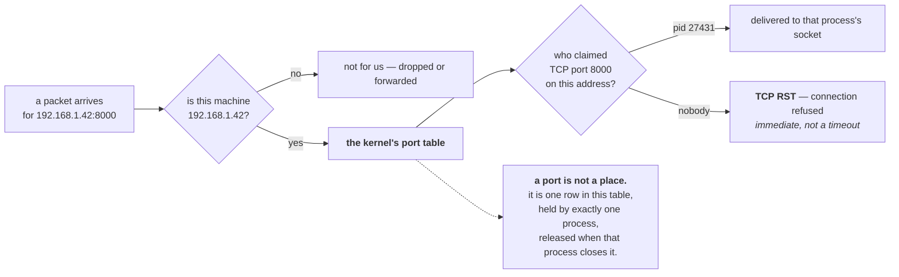

# 1.1 — A port is a doorway, not a place

## One-line answer

An address identifies a machine and a port identifies which program on it should receive the message — so
a port is not a location, it is a **claim one process makes on incoming traffic**, and only one process
can hold it at a time.

---

## The story

🎬 **The scene.** A large office building with one street address. The postman arrives with forty letters
and hands them all to the person on reception.

Each envelope has a floor and a room number written under the address. Reception sorts them into pigeonholes
and the letters find their way.

😬 **The naive fix.** A new tenant moves in and puts up a sign saying "all post for us goes to room 12" —
without checking. Room 12 is already occupied by the accountants.

💥 **Why it fails.** The building has one reception and one sorting rule per room number. Two tenants
claiming room 12 does not mean the post gets split fairly; it means the sorter has an ambiguous
instruction, and the sensible thing — which is what actually happens — is to refuse the second claim
outright. **The second tenant's post has nowhere to go**, and the failure happens at the moment they put
the sign up, not later when a letter arrives.

💡 **The insight.** The street address gets you to the building; the room number gets you to the right
desk. **Neither is optional and they are answering different questions.** And the room number is not a
place you can walk into — it is an entry in a sorting table that exactly one occupant may hold.

---

## The idea in plain language

Two numbers are needed to deliver a message to a program on another machine.

**The IP address identifies the machine.** `127.0.0.1` is this machine, always, from its own point of
view — the *loopback* address. `192.168.1.42` might be your laptop on a home network. `0.0.0.0` is
special and is part [1.3](1.3-binding-127-0-0-1-versus-0-0-0-0.md).

**The port identifies which program on that machine.** It is a 16-bit number, so 0 to 65535. It is not a
physical thing, not a socket in a wall, and not a location — **it is an index into a table the kernel
keeps of which process wants which incoming traffic.**

When you ran `uvicorn --port 8000`
([Day 4, part 1.1](../../../day-004-linux-for-operators-i/parts/01-the-process/1.1-a-process-is-not-a-program.md)),
the process asked the kernel: *"anything arriving for TCP port 8000 on this address is mine."* The kernel
wrote that down. From then on, packets arriving for 8000 are delivered to that process and nowhere else.

### Three consequences

**Only one process may hold a given port on a given address.** The kernel refuses the second claim, which
is where `address already in use` comes from — the error you have already met twice
([Day 4, part 1.1](../../../day-004-linux-for-operators-i/parts/01-the-process/1.1-a-process-is-not-a-program.md))
and which part [1.4](1.4-the-port-that-was-already-in-use.md) takes apart properly.

**The claim belongs to a process, not to a program.** Kill the process and the port is released
immediately — usually. Part [3.3](../03-tcp/3.3-time-wait-and-the-ports-you-ran-out-of.md) covers the
case where it is not.

**Ports below 1024 are privileged.** Binding one traditionally requires root, which is why web servers
historically started as root, bound port 80, and then dropped privileges. **This is one of the strongest
practical arguments for containers**: a container can map its port 8000 to the host's port 80 without
anything ever running as root, which is Day 25.

### The numbers worth knowing

| Port | Service | You will meet it on |
| --- | --- | --- |
| 22 | SSH | any remote machine |
| 53 | DNS | section [2](../02-dns/2.1-what-resolution-actually-does.md) |
| 80 | HTTP | Day 8, Day 37 |
| 443 | HTTPS | Day 8, Day 37 |
| 5432 | PostgreSQL | Day 25 |
| 6379 | Redis | Day 46 |
| 8000 | `pulse`, by convention | today |
| 9090 | Prometheus | Day 62 |
| 3000 | Grafana | Day 64 |

**None of these are enforced.** They are conventions, registered with a numbering authority, and nothing
stops you running a database on port 80. What the convention buys you is that a stranger reading
`:5432` in a log knows what it probably is — which is worth more than it sounds at three in the morning.

### The ephemeral range

When your machine makes an *outgoing* connection, it also needs a port — the return address. The kernel
picks one automatically from a high range, conventionally 32768–60999 on Linux. These are **ephemeral
ports**: allocated per connection, released afterwards.

**You have a finite number of them**, which is why a machine making very many outgoing connections can run
out — a real production failure with a distinctive signature, and the subject of part
[3.3](../03-tcp/3.3-time-wait-and-the-ports-you-ran-out-of.md).

---

## Why Kriya needs it

Day 25 runs `pulse` in a container and publishes a port, which is a mapping between two port numbers in
two different network namespaces. Day 30's failure lab includes a container that is running and
unreachable, and half the causes are port-shaped.

Day 35 introduces Kubernetes Services, where a Service has a port, a target port and possibly a node port
— **three port numbers for one service**, and understanding them requires this part.

Day 37 puts an Ingress in front, terminating TLS on 443 and forwarding to `pulse` on 8000.

Day 62 scrapes metrics from a port, Day 64 serves dashboards on another, and Addendum 02's profile table
is partly a list of which ports each profile occupies.

---

## The mechanism

Ask the kernel what it currently has written down.

```bash
netstat -ano | grep LISTENING | head -12
```

**Line by line:**

- `netstat` — the traditional tool for showing network endpoints. On Linux, `ss` has replaced it and is
  faster ([1.4](1.4-the-port-that-was-already-in-use.md)); on Git Bash under Windows, `netstat` is what
  exists.
- `-a` — all sockets, including listening ones. **Without it you see only established connections**, which
  is the commonest reason people conclude nothing is listening.
- `-n` — **numeric.** Do not resolve addresses to names or ports to service names. This matters for two
  reasons: name resolution can hang for seconds if DNS is unhealthy (section
  [2](../02-dns/2.3-the-dns-failure-that-looks-like-a-timeout.md)), and `http` is less useful than `80`
  when you are comparing against a config file.
- `-o` — the owning process identifier. **The flag that turns "port 8000 is busy" into "process 27431 is
  holding it"**, which is the only form of that fact you can act on.
- `grep LISTENING` — filter to sockets waiting for incoming connections, as opposed to established ones.

Observed on **2026-08-24**:

```text
  TCP    0.0.0.0:135            0.0.0.0:0              LISTENING       1204
  TCP    0.0.0.0:445            0.0.0.0:0              LISTENING       4
  TCP    127.0.0.1:8000         0.0.0.0:0              LISTENING       27431
  TCP    [::]:135               [::]:0                 LISTENING       1204
```

**Read the third row as a sentence.** On address `127.0.0.1`, port `8000`, a socket is listening, and
process `27431` owns it. The `0.0.0.0:0` in the foreign-address column means "no remote end" — a listening
socket has not been connected to anything yet
([1.2](1.2-the-socket-and-the-four-tuple.md)).

**And note the first two rows bind `0.0.0.0` while yours binds `127.0.0.1`.** That difference decides who
in the world can reach it, and it is part [1.3](1.3-binding-127-0-0-1-versus-0-0-0-0.md).

The Linux equivalent, which you will use from Day 21:

```bash
ss -ltnp 2>/dev/null || echo "no ss here — Git Bash; use netstat -ano as above"
```

**Line by line:**

- `-l` listening sockets only — replaces the `grep`.
- `-t` TCP only. `-u` would be UDP; without either you get both plus Unix sockets, which is noisy.
- `-n` numeric, for the same reasons as above.
- `-p` show the owning process. **Requires privilege to see other users' processes**, so without `sudo`
  you see your own and blanks for the rest — which is a permissions fact
  ([Day 5, part 2.1](../../../day-005-linux-for-operators-ii/parts/02-permissions/2.1-user-group-other-and-three-bits.md)),
  not a broken command.

```text
State   Recv-Q  Send-Q  Local Address:Port   Peer Address:Port  Process
LISTEN  0       2048    127.0.0.1:8000       0.0.0.0:*          users:(("python",pid=27431,fd=3))
LISTEN  0       4096    0.0.0.0:22           0.0.0.0:*          users:(("sshd",pid=894,fd=3))
```

**`Send-Q` on a listening socket is the accept queue's maximum length** — 2048 here, which is uvicorn's
`--backlog` default ([Day 4, part 4.1](../../../day-004-linux-for-operators-i/parts/04-the-service-died/4.1-graceful-shutdown-for-pulse.md)
noted the flag). `Recv-Q` is how many connections are waiting in it right now. **Those two numbers are
part [3.2](../03-tcp/3.2-the-accept-queue-and-the-backlog.md)**, and `ss` shows them for free.

### Claiming a port by hand

**Principle 4 — build the mechanism before adopting the tool.** Uvicorn does this for you; doing it once
in twelve lines means the flag is a convenience rather than a mystery.

```python
# days/day-007-networking-for-operators/lab/claim_port.py
"""Claim a port with nothing but the standard library, and hold it."""

import socket
import sys
import time

HOST = sys.argv[1] if len(sys.argv) > 1 else "127.0.0.1"
PORT = int(sys.argv[2]) if len(sys.argv) > 2 else 8001

sock = socket.socket(socket.AF_INET, socket.SOCK_STREAM)
sock.bind((HOST, PORT))
sock.listen(128)

print(f"[claim] holding {HOST}:{PORT}  fd={sock.fileno()}", flush=True)
print("[claim] netstat/ss will now show this. Ctrl-C to release.", flush=True)
time.sleep(120)
sock.close()
```

**Line by line:**

- `socket.AF_INET` — the IPv4 address family. `AF_INET6` would be IPv6; the distinction matters in
  [1.3](1.3-binding-127-0-0-1-versus-0-0-0-0.md) and in the `[::]` rows you saw in `netstat`.
- `socket.SOCK_STREAM` — **TCP**, a reliable ordered byte stream (section
  [3](../03-tcp/3.1-the-handshake-and-the-connection-states.md)). `SOCK_DGRAM` would be UDP, which DNS
  uses (section [2](../02-dns/2.1-what-resolution-actually-does.md)).
- `sock.bind((HOST, PORT))` — **this is the claim.** One system call, and from this instant the kernel
  associates that address and port with this process. **This is the line that fails with `address already
  in use`.**
- `sock.listen(128)` — mark the socket as accepting incoming connections, with an accept queue of up to
  128. **Binding alone does not make you reachable**; `listen` is what turns a claimed port into a
  listening one, and the two being separate calls is why `netstat` has a `State` column at all.
- `sock.fileno()` — the file descriptor, so you can find it in `/proc/<pid>/fd`
  ([Day 5, part 3.2](../../../day-005-linux-for-operators-ii/parts/03-the-disk-that-fills/3.2-the-deleted-file-that-still-costs-you-a-gigabyte.md)).
  **A socket is a file descriptor**, which is why everything you learned about descriptors on Day 5
  applies here.
- No `accept()` call — this program claims the port and never serves anything. **That is deliberate**: it
  isolates "holding a port" from "answering requests", and part
  [3.2](../03-tcp/3.2-the-accept-queue-and-the-backlog.md) uses exactly this to show connections piling up
  in a queue nobody empties.
- `time.sleep(120)` then `sock.close()` — hold it, then release. **Closing is what frees the port**, and
  the process exiting closes it too, because the kernel closes every descriptor at exit
  ([Day 5, part 3.2](../../../day-005-linux-for-operators-ii/parts/03-the-disk-that-fills/3.2-the-deleted-file-that-still-costs-you-a-gigabyte.md)).

Run it and look:

```bash
uv run python days/day-007-networking-for-operators/lab/claim_port.py 127.0.0.1 8001 &
CLAIM=$!
sleep 2
netstat -ano | grep ':8001'
```

**Line by line:** background it, capture the pid
([Day 4, part 1.2](../../../day-004-linux-for-operators-i/parts/01-the-process/1.2-pid-parent-and-the-process-tree.md)),
pause for startup, then ask the kernel what it now believes.

```text
[claim] holding 127.0.0.1:8001  fd=3
[claim] netstat/ss will now show this. Ctrl-C to release.
  TCP    127.0.0.1:8001         0.0.0.0:0              LISTENING       45102
```

**Twelve lines of Python produced exactly the same row `uvicorn` produces.** The port claim has nothing to
do with HTTP, with a framework, or with serving — it is one `bind` and one `listen`.

Now try to claim it twice:

```bash
uv run python days/day-007-networking-for-operators/lab/claim_port.py 127.0.0.1 8001
echo "exit code: $?"
```

**Line by line:** the same command again, in the foreground so you see the error, with the exit code
captured immediately
([Day 4, part 3.1](../../../day-004-linux-for-operators-i/parts/03-exit-codes/3.1-the-exit-code-is-the-whole-return-value.md)).

```text
Traceback (most recent call last):
  File "days/day-007-networking-for-operators/lab/claim_port.py", line 11, in <module>
    sock.bind((HOST, PORT))
OSError: [Errno 10048] Only one usage of each socket address (protocol/network address/port) is normally permitted
exit code: 1
```

**On Linux the same condition reads `[Errno 98] Address already in use`.** Different number, different
wording, identical cause — and part [1.4](1.4-the-port-that-was-already-in-use.md) is about diagnosing it.

Clean up:

```bash
kill "$CLAIM"; wait "$CLAIM" 2>/dev/null; netstat -ano | grep ':8001' || echo "port 8001 released"
```

**Line by line:** kill the holder, collect it, and **confirm the port is actually free** rather than
assuming — the same discipline as confirming a disk reclaim
([Day 5, part 3.2](../../../day-005-linux-for-operators-ii/parts/03-the-disk-that-fills/3.2-the-deleted-file-that-still-costs-you-a-gigabyte.md)),
and for the same reason: sometimes it is not.



---

## When it breaks

**`Connection refused` versus a hang.** The single most useful distinction in network debugging:

```text
$ curl -sS -m 5 http://127.0.0.1:8002/
curl: (7) Failed to connect to 127.0.0.1 port 8002 after 0 ms: Could not connect to server
```

**What it says:** could not connect, **after 0 ms**.
**What it actually means:** the machine was reached and **nothing is listening on that port**, so the
kernel replied immediately with a refusal. The zero duration is the tell.
**Contrast with a hang:**

```text
$ curl -sS -m 5 http://10.0.0.99:8002/
curl: (28) Connection timed out after 5001 milliseconds
```

**What that means instead:** nothing answered at all — the address is unreachable, a firewall dropped the
packet silently, or the machine is down. **Refused is a fast, informative "no"; timed out is silence**, and
the two send you to completely different places. Part
[4.1](../04-timeouts/4.1-a-timeout-is-a-decision-not-a-safety-net.md) builds on this.

**A service that is running and unreachable.** The bind-address mistake, previewed:

```text
$ pgrep -af 'uvicorn pulse.api'
27431 python .venv/Scripts/uvicorn pulse.api:app --host 127.0.0.1 --port 8000
$ curl -sS -m 5 http://192.168.1.42:8000/healthz
curl: (7) Failed to connect to 192.168.1.42 port 8000 after 2 ms: Could not connect to server
```

**What it says:** the process is running and the connection is refused.
**What it actually means:** it claimed port 8000 **on `127.0.0.1` only**. A claim is per address as well
as per port, so nothing on any other address is listening. **This is the single most common "it works on
my machine" networking failure**, and part [1.3](1.3-binding-127-0-0-1-versus-0-0-0-0.md) is entirely
about it.

**`Permission denied` binding a low port.** The privileged range:

```text
$ uv run uvicorn pulse.api:app --host 127.0.0.1 --port 80
ERROR:    [Errno 13] error while attempting to bind on address ('127.0.0.1', 80): permission denied
```

**What it says:** permission denied.
**What it actually means:** ports below 1024 are privileged and this process is not root.
**The smallest fix:** use a high port, which is what every example in this curriculum does.
**Why it matters later:** the historical fix was to start as root and drop privileges, which means a
window where your web server runs as root. **Containers make the problem vanish** — the container's
port 8000 is published as the host's 80 by the runtime, and nothing inside ever needs privilege (Day 25,
Day 28).

**Nothing shows in `netstat` and the service is definitely running.** The missing flag:

```text
$ netstat -n | grep 8000
$ echo $?
1
```

**What it says:** no output.
**What it actually means:** **`-a` is missing**, so `netstat` printed only *established* connections and
your listening socket is not one. A server with no clients has nothing established.
**The smallest fix:** `netstat -ano`. **The general lesson:** an empty result from a network tool is not
evidence of absence until you know what the tool was including — the same shape as `pgrep` without `-f`
([Day 4, part 1.3](../../../day-004-linux-for-operators-i/parts/01-the-process/1.3-reading-ps-and-finding-your-service.md)).

---

## In production

**What a professional writes instead of the teaching version.** They never hard-code a port in
application code. It comes from configuration — an environment variable, Day 9 — because the same image
runs in several places and the port it should occupy is a deployment decision rather than a code one.
And they document which ports a service listens on in the same place as everything else about it, because
**an undocumented port is a firewall rule nobody knows to write and a security finding nobody knows to
close.**

**What degrades at scale.** Port allocation becomes a coordination problem. On one machine you pick 8000
and remember it. On a machine running thirty services, two of them will eventually want the same number,
and the failure happens at start-up with an error that names the port and not the other claimant. **This
is one of the strongest arguments for containers**: each container gets its own network namespace, so every
service can bind port 8000 inside itself and the collision simply cannot occur. Day 25 is where that stops
being an abstraction.

**The failure that only shows with real traffic.** Ephemeral port exhaustion. A service making outgoing
connections consumes a port per connection from a range of roughly 28,000. At low rates they are released
faster than they are consumed and you never think about it. At high rates, with connections that linger in
`TIME_WAIT` ([3.3](../03-tcp/3.3-time-wait-and-the-ports-you-ran-out-of.md)), the range exhausts and new
outgoing connections fail with `Cannot assign requested address` — **on a machine with no visible resource
problem at all.**

**The review comment a senior engineer leaves.** *"The health check connects to `127.0.0.1:8000`, which
works in the container but not from the Kubernetes probe, because the probe connects from outside the
Pod's network namespace to the Pod IP. Bind to `0.0.0.0` inside the container — the network policy is what
restricts who can reach it, not the bind address."*

**The signal you would alert on.** Not "is the port open", which is a weak signal — a listening socket
proves a process claimed a port, not that it can serve anything (you produced exactly that state on
[Day 4, part 1.4](../../../day-004-linux-for-operators-i/parts/01-the-process/1.4-process-states-and-the-d-that-will-not-die.md),
where a `SIGSTOP`ped process held port 8000 and answered nothing). What you alert on is **whether a real
request succeeds**, which is Day 73's SLO. Two port-related signals *are* worth having: **ephemeral port
utilisation** on any machine making many outgoing connections, because exhaustion is sudden and its error
message is obscure; and **listening socket count**, as a cheap check that a deploy actually started
everything it was supposed to.

**Blast radius.** This part binds ports on loopback — the narrowest possible exposure, reachable only from
this machine. Worst case: a `claim_port.py` left running holds a port for two minutes and then releases
it, or holds it indefinitely if you raise the sleep, which would make a later `uvicorn` fail to start with
an error naming the port. Who can trigger it: you. What bounds it: **binding to `127.0.0.1` rather than
`0.0.0.0`**, which is the difference between "only this machine" and "anyone who can route to me" — a
choice part [1.3](1.3-binding-127-0-0-1-versus-0-0-0-0.md) makes explicit, and the reason every example in
this curriculum uses loopback until a container provides a real boundary.

**Cost.** `0` model calls, `0` tokens, `0` CI minutes, `0` disk, negligible RAM and processor. **A
listening socket costs a small kernel structure and an entry in a table.** The only finite resource here
is the port number space itself — 65,535 per address, of which roughly 28,000 are the ephemeral range —
and that is the one that runs out.

**The interview question.** *"What is the difference between connection refused and a connection
timeout?"* The answer that lands maps each to a cause: *"Refused means the packet reached the machine and
nothing was listening on that port, so the kernel sent back a reset — it is immediate, and it tells me the
host is up and routable and the service is not there. A timeout means nothing came back at all, which is
usually a firewall dropping the packet silently, a wrong address, or a host that is down. So refused sends
me to look at the process and its bind address; timed out sends me to look at routing and firewalls. The
one that catches people out is a service that is definitely running and still refuses — that is almost
always bound to `127.0.0.1` when the client is coming from somewhere else."*

---

## Check yourself

```bash
uv run python days/day-007-networking-for-operators/lab/claim_port.py 127.0.0.1 8001 & C=$!; sleep 2; netstat -ano | grep ':8001'; curl -sS -m 3 -o /dev/null -w 'connect to claimed port: exit=%{exitcode} after %{time_total}s\n' http://127.0.0.1:8001/ ; curl -sS -m 3 -o /dev/null -w 'connect to free port:    exit=%{exitcode} after %{time_total}s\n' http://127.0.0.1:8002/ ; kill "$C" 2>/dev/null; wait "$C" 2>/dev/null; netstat -ano | grep ':8001' || echo "released"
```

A claimed port and a free one, connected to in turn. **The claimed one accepts the connection and then
hangs** — because `claim_port.py` never calls `accept()` — and the free one refuses instantly. Those two
behaviours are the difference between "something is listening but not serving" and "nothing is there", and
telling them apart from the client side is most of network triage.

**Say out loud, without scrolling up:** *your service is definitely running and a colleague on the same
network gets "connection refused". Name the most likely cause, and say which single field of `netstat`
output would confirm it.*
