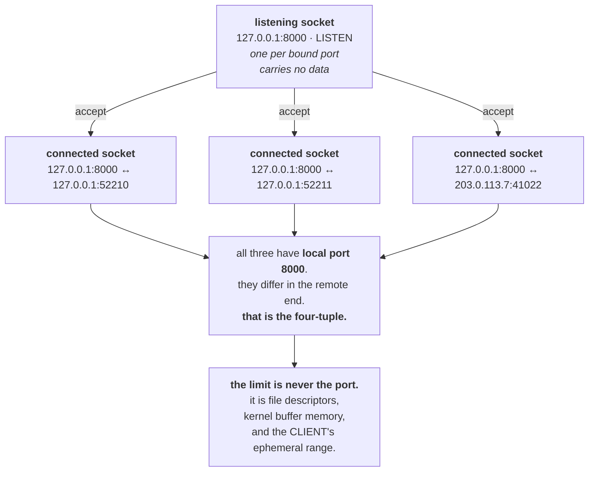

# 1.2 — The socket and the four-tuple

## One-line answer

A connection is identified by four values — source address, source port, destination address,
destination port — which is why one listening port can serve thousands of simultaneous clients without
any of them getting each other's data.

---

## The story

🎬 **The scene.** A busy restaurant with one telephone number. Fifty people ring it every evening.

The number never changes and nobody is ever connected to the wrong caller. The exchange does not need
fifty numbers; it needs to keep track of **which line each call is on**, and a call is identified by both
ends together — who rang, and from where.

😬 **The naive fix.** A new manager, worried about capacity, proposes buying fifty phone numbers so each
caller can have their own.

💥 **Why it fails.** It solves a problem that does not exist and creates one that does. Fifty numbers means
fifty things to publish, fifty things to keep working, and fifty ways for a customer to reach the wrong
one. **The single number was never the constraint** — the exchange was already distinguishing calls by
something richer than the number dialled, and nobody had noticed because it works.

💡 **The insight.** A published address and a live conversation are different things. **The address is
what you dial; the conversation is identified by both ends together** — and confusing the two makes people
think they need far more addresses than they do.

---

## The idea in plain language

Part [1.1](1.1-a-port-is-a-doorway-not-a-place.md) said a port is a claim on incoming traffic. That
explains how a packet finds the right *process*. It does not explain how one process keeps a thousand
simultaneous clients apart.

The answer is that a TCP connection is identified by **four values**, together:

| | |
| --- | --- |
| source address | the client's IP |
| source port | the client's ephemeral port ([1.1](1.1-a-port-is-a-doorway-not-a-place.md)) |
| destination address | the server's IP |
| destination port | the server's listening port |

This is the **four-tuple**, and it is unique per connection. Two clients connecting to `pulse` on
`127.0.0.1:8000` differ in their source ports — the kernel picked a different ephemeral one for each — so
the tuples differ and the kernel can route each byte to the right conversation.

**One listening port; as many connections as there are distinct tuples.**

### Two kinds of socket, and this is the part people miss

There are two different objects, and both are called sockets:

**The listening socket.** One per bound port. It is not connected to anything and never carries data. Its
only job is to accept new connections — it is the thing `bind` and `listen` created in
[1.1](1.1-a-port-is-a-doorway-not-a-place.md).

**The connected socket.** One per accepted connection, created by `accept()`. **This is what actually
carries bytes.** Its four-tuple is filled in; its local port is the *same* listening port, and what makes
it distinct is the remote end.

So a server with 500 concurrent clients has **501 sockets**: one listening, 500 connected. All 501 have
local port 8000. That is not a conflict, because the conflict rule from
[1.1](1.1-a-port-is-a-doorway-not-a-place.md) is about *listening* sockets — only one process may listen
on a given address and port.

### Why this is the answer to "how many connections can we handle"

The four-tuple space is enormous, so the limit is never the tuple. The real limits are:

- **File descriptors.** Every socket is a file descriptor
  ([Day 5, part 3.2](../../../day-005-linux-for-operators-ii/parts/03-the-disk-that-fills/3.2-the-deleted-file-that-still-costs-you-a-gigabyte.md)),
  and a process has a limit on how many it may hold — often 1024 by default, which is very low.
- **Memory per connection.** Each socket has send and receive buffers in kernel memory.
- **Ephemeral ports on the *client* side.** A client connecting repeatedly to one server exhausts *its*
  port range ([3.3](../03-tcp/3.3-time-wait-and-the-ports-you-ran-out-of.md)) — note this is a client
  problem, not a server one.

**None of those is "the port".** People say "we ran out of ports" and mean one of the three above.

### The states a socket is in

`netstat` and `ss` show a `State` column, and the values come from TCP's state machine
([3.1](../03-tcp/3.1-the-handshake-and-the-connection-states.md)). Today, two matter:

- **`LISTEN`** — a listening socket, waiting.
- **`ESTABLISHED`** — a connected socket, carrying data.

A machine with one `LISTEN` on port 8000 and 500 `ESTABLISHED` rows also on port 8000 is a server with
500 clients, and that shape is what a healthy busy service looks like from the outside.

---

## Why Kriya needs it

Day 35 introduces Kubernetes Services, which load-balance by rewriting destination addresses — a
transformation on the four-tuple, and one that makes no sense if you think a connection is identified by a
port.

Day 50 is capacity work, where "how many concurrent connections" becomes a real number bounded by
descriptors and memory rather than by ports.

Day 8 covers keep-alive, which is entirely about reusing a connected socket for several requests instead
of creating a new tuple each time — and the reason that matters is the cost enumerated above.

Day 71 introduces tracing, where a request is followed across several connections. Knowing that a
connection is a four-tuple and a request is something carried *over* one is the distinction that makes
tracing legible.

---

## The mechanism

Make several connections to one port and watch the tuples.

Start `pulse`, then open connections that stay open:

```python
# days/day-007-networking-for-operators/lab/hold_conns.py
"""Open N connections to a host:port and hold them, so they show as ESTABLISHED."""

import socket
import sys
import time

HOST = sys.argv[1] if len(sys.argv) > 1 else "127.0.0.1"
PORT = int(sys.argv[2]) if len(sys.argv) > 2 else 8000
N = int(sys.argv[3]) if len(sys.argv) > 3 else 5

conns = []
for i in range(N):
    s = socket.create_connection((HOST, PORT), timeout=5)
    conns.append(s)
    local_addr, local_port = s.getsockname()
    peer_addr, peer_port = s.getpeername()
    print(f"[conn {i}] {local_addr}:{local_port} -> {peer_addr}:{peer_port}", flush=True)

print(f"[hold] {len(conns)} connections open. Look at netstat/ss now.", flush=True)
time.sleep(45)
for s in conns:
    s.close()
```

**Line by line:**

- `socket.create_connection((HOST, PORT), timeout=5)` — the convenience wrapper that creates a socket,
  resolves the name and connects. **The `timeout=5` is not optional in real code**: without it a connect
  to an unreachable address waits for the operating system's default, which can be over a minute, and part
  [4.1](../04-timeouts/4.1-a-timeout-is-a-decision-not-a-safety-net.md) is about exactly that discipline.
- `s.getsockname()` — **the local end of the four-tuple**: this machine's address and the ephemeral port
  the kernel picked ([1.1](1.1-a-port-is-a-doorway-not-a-place.md)).
- `s.getpeername()` — **the remote end.** Together these two calls print the whole tuple, which is the
  point of the script.
- `conns.append(s)` — **retain the sockets.** A socket that goes out of scope is closed by garbage
  collection, and the connection would vanish before you could look at it. The list is what holds them
  open, the same retention trick as the ballast list on
  [Day 6, part 4.3](../../../day-006-resources-and-the-oom-killer/parts/04-the-oom-killer/4.3-oom-killing-pulse-on-purpose.md).
- `time.sleep(45)` — a window to inspect from another terminal.
- `s.close()` at the end — release them explicitly rather than relying on process exit, so the script
  demonstrates the full lifecycle.

Run it against `pulse`:

```bash
uv run uvicorn pulse.api:app --host 127.0.0.1 --port 8000 &
PULSE=$!
sleep 3
uv run python days/day-007-networking-for-operators/lab/hold_conns.py 127.0.0.1 8000 5 &
sleep 3
netstat -ano | grep ':8000'
```

**Line by line:** start the server, wait for it to bind, open five connections, wait for them to be
established, then ask the kernel what it sees. **The two `sleep`s matter** — measuring before the state
exists is the commonest way to conclude a mechanism does not work.

Observed on **2026-08-24**:

```text
[conn 0] 127.0.0.1:52210 -> 127.0.0.1:8000
[conn 1] 127.0.0.1:52211 -> 127.0.0.1:8000
[conn 2] 127.0.0.1:52212 -> 127.0.0.1:8000
[conn 3] 127.0.0.1:52213 -> 127.0.0.1:8000
[conn 4] 127.0.0.1:52214 -> 127.0.0.1:8000
[hold] 5 connections open. Look at netstat/ss now.
  TCP    127.0.0.1:8000         0.0.0.0:0              LISTENING       27431
  TCP    127.0.0.1:8000         127.0.0.1:52210        ESTABLISHED     27431
  TCP    127.0.0.1:8000         127.0.0.1:52211        ESTABLISHED     27431
  TCP    127.0.0.1:8000         127.0.0.1:52212        ESTABLISHED     27431
  TCP    127.0.0.1:8000         127.0.0.1:52213        ESTABLISHED     27431
  TCP    127.0.0.1:8000         127.0.0.1:52214        ESTABLISHED     27431
  TCP    127.0.0.1:52210        127.0.0.1:8000         ESTABLISHED     45880
  TCP    127.0.0.1:52211        127.0.0.1:8000         ESTABLISHED     45880
```

**Read the shape.** Six rows for the server process 27431: one `LISTENING` with no peer, and five
`ESTABLISHED` — **all with local port 8000**, distinguished entirely by the peer's port. That is the
four-tuple doing its job.

**And note the last two rows belong to the client, process 45880**, showing the same connections from the
other side with source and destination swapped. **The same connection appears twice in this listing**,
because both ends are on this machine, which is a nice accident of using loopback and would not happen
across a network.

The client's ports — 52210 to 52214 — are consecutive, which is the kernel handing out ephemeral ports
in order ([1.1](1.1-a-port-is-a-doorway-not-a-place.md)).

### Counting, which is what you actually do in an incident

```bash
netstat -ano | grep ':8000' | awk '{print $4}' | sort | uniq -c | sort -rn | head
```

**Line by line:**

- `awk '{print $4}'` — the state column in Windows `netstat` output. **Check which column it is on your
  system before relying on this**; it differs between implementations, and getting it wrong silently
  counts the wrong field.
- `sort | uniq -c | sort -rn` — the census idiom from
  [Day 4, part 1.4](../../../day-004-linux-for-operators-i/parts/01-the-process/1.4-process-states-and-the-d-that-will-not-die.md),
  applied to socket states instead of process states.

```text
      5 ESTABLISHED
      1 LISTENING
```

**One line per state with a count.** On a real server this is the shape you want: a large `ESTABLISHED`
count is a busy server, a large `TIME_WAIT` count is
[3.3](../03-tcp/3.3-time-wait-and-the-ports-you-ran-out-of.md), and a large `SYN_RECV` count is
[3.2](../03-tcp/3.2-the-accept-queue-and-the-backlog.md) or an attack.

The Linux form, which gives you more:

```bash
ss -tn state established '( sport = :8000 or dport = :8000 )' 2>/dev/null | head || echo "no ss here — Git Bash"
```

**Line by line:**

- `ss -tn state established` — TCP, numeric, filtered to one state. **`ss` filters at the source** rather
  than making you `grep`, which matters on a machine with a hundred thousand sockets where `grep` over the
  full listing is genuinely slow.
- `'( sport = :8000 or dport = :8000 )'` — **`ss`'s filter language**, matching either end. The
  parentheses and spacing are required and the syntax is unforgiving; getting it slightly wrong produces a
  parse error rather than a wrong answer, which is at least honest.

Clean up:

```bash
kill "$PULSE" 2>/dev/null; wait "$PULSE" 2>/dev/null; pkill -f hold_conns.py 2>/dev/null; netstat -ano | grep ':8000' || echo "all sockets on 8000 gone"
```

**Line by line:** stop both, then **confirm** rather than assume — and note that this may show
`TIME_WAIT` rows for a while even after both processes are gone, which is not a leak and is
[3.3](../03-tcp/3.3-time-wait-and-the-ports-you-ran-out-of.md).



---

## When it breaks

**`Too many open files` on a busy server.** The real connection limit:

```text
ERROR:    error while attempting to accept connection: [Errno 24] Too many open files
```

**What it says:** the process cannot open another file.
**What it actually means:** **a socket is a file descriptor**, and the process hit its descriptor limit —
often 1024 by default, which is embarrassingly low for a server. It is not a port problem, a memory
problem or a network problem.
**The smallest fix:** raise the limit — `ulimit -n` in a shell, `LimitNOFILE` in a systemd unit, or the
container runtime's equivalent.
**The diagnostic:**

```bash
cat /proc/"$PULSE"/limits 2>/dev/null | grep -i 'open files' || ulimit -n
```

**Line by line:** `/proc/<pid>/limits` shows the **running process's** limits, which is what matters — your
shell's `ulimit` may be entirely different from what the service inherited
([Day 4, part 1.1](../../../day-004-linux-for-operators-i/parts/01-the-process/1.1-a-process-is-not-a-program.md):
limits are copied at creation). **Checking your own shell and concluding the service is fine is a real
mistake.**

**`Cannot assign requested address` from a client.** Ephemeral exhaustion, previewed:

```text
$ python -c "import socket; [socket.create_connection(('127.0.0.1',8000)) for _ in range(40000)]"
OSError: [Errno 99] Cannot assign requested address
```

**What it says:** an address could not be assigned.
**What it actually means:** the **client** ran out of ephemeral ports
([1.1](1.1-a-port-is-a-doorway-not-a-place.md)) — roughly 28,000 available, and connections in
`TIME_WAIT` still hold theirs.
**The smallest fix:** reuse connections instead of creating new ones, which is keep-alive (Day 8) and
connection pooling.
**Why the error is confusing:** it names an *address* problem on a machine whose addressing is fine, and
it appears on the client while everyone is looking at the server.

**Thousands of `ESTABLISHED` connections to a service with no traffic.** The leak:

```text
$ ss -tn state established '( dport = :5432 )' | wc -l
4812
```

**What it says:** nearly five thousand open connections to a database.
**What it actually means:** something is opening connections and not closing them — a pool with no
maximum, or code that creates a client per request and never releases it. **Each one costs a descriptor on
both ends and kernel buffer memory on both ends.**
**The smallest fix:** bound the pool. **The reason it goes unnoticed:** nothing errors until a limit is
hit, and the limit might be on the database rather than on you, so the failure appears in a different
service.

**A connection that is `ESTABLISHED` on one side only.** The half-open case:

```text
# on the client
$ ss -tn '( dport = :8000 )'
ESTAB  0  0  10.0.0.5:52210   10.0.0.9:8000
# on the server — nothing
```

**What it says:** the client believes it is connected and the server has no such socket.
**What it actually means:** the server's side went away without a proper close — the process was killed
([Day 4, part 2.4](../../../day-004-linux-for-operators-i/parts/02-signals/2.4-the-signals-you-cannot-catch.md)),
the machine rebooted, or a firewall silently dropped the state. **TCP does not notice on its own**: an
idle connection sends nothing, so neither end learns anything until the next write.
**The smallest fix:** keep-alive probes or an application-level heartbeat.
**Why it matters:** the client will hang on its next request until a timeout it may not have set, which is
section [4](../04-timeouts/4.1-a-timeout-is-a-decision-not-a-safety-net.md) and part
[3.4](../03-tcp/3.4-the-connection-that-is-open-and-dead.md).

---

## In production

**What a professional writes instead of the teaching version.** They reuse connections rather than
creating them, everywhere: an HTTP client with a connection pool, a database pool with a bounded maximum,
a gRPC channel held for the process's lifetime. The reason is the enumeration above — every new connection
costs a handshake ([3.1](../03-tcp/3.1-the-handshake-and-the-connection-states.md)), two descriptors, two
sets of kernel buffers, and an ephemeral port that lingers after close. **Reuse turns all of those from
per-request costs into per-process ones.**

**What degrades at scale.** Descriptor limits and buffer memory, in that order. A server holding 50,000
concurrent connections needs 50,000 descriptors and the kernel memory for 100,000 buffers, which is real
and is usually the first hard wall. The classic remedies — raising `LimitNOFILE`, tuning buffer sizes,
using an event-driven server rather than thread-per-connection — are all responses to the arithmetic in
this part.

**The failure that only shows with real traffic.** Connection accumulation under partial failure. When a
downstream is slow, requests take longer, so more are in flight, so more connections are open
simultaneously — and a pool with no maximum grows to meet the demand and exhausts descriptors. **The
service falls over from connection count while its CPU and memory look fine**, and the trigger was
somebody else's latency. Day 7's part [5.2](../05-the-two-together/5.2-retries-that-turn-a-blip-into-an-outage.md)
is the same dynamic seen from the retry side.

**The review comment a senior engineer leaves.** *"This creates a new `httpx.Client` inside the request
handler, so every request does a fresh TCP handshake and leaves a socket in `TIME_WAIT`. At our rate we
will exhaust ephemeral ports within the hour. Create one client at startup and reuse it — that is what the
pool is for."*

**The signal you would alert on.** **Open file descriptors as a fraction of the process's limit** — it is
cheap, it is available from `/proc/<pid>/limits` and the descriptor count, and hitting it produces a
failure (`Too many open files`) that looks like nothing else. Also **connection count by state**, because
the *shape* of the distribution is diagnostic: rising `ESTABLISHED` with flat traffic is a leak, a large
`TIME_WAIT` is [3.3](../03-tcp/3.3-time-wait-and-the-ports-you-ran-out-of.md), and a large `SYN_RECV` is
[3.2](../03-tcp/3.2-the-accept-queue-and-the-backlog.md) or something hostile. You would **not** alert on
connection count alone without a limit to compare it against — the same mistake as alerting on memory
without a limit ([Day 6, part 3.1](../../../day-006-resources-and-the-oom-killer/parts/03-limits/3.1-cgroups-the-box-you-put-a-process-in.md)).

**Blast radius.** This part opens connections to a local service. Worst case: `hold_conns.py` run with a
large `N` — the third argument — opens thousands of connections and can exhaust **this process's**
descriptor limit or the server's, producing `Too many open files` on either side, and leaving sockets in
`TIME_WAIT` for a while after
([3.3](../03-tcp/3.3-time-wait-and-the-ports-you-ran-out-of.md)). Who can trigger it: you, by changing one
number. What bounds it: the default of 5, the loopback address so nothing leaves this machine, and the
`close()` at the end. ⚠️ **Do not point this at anything you did not start** — opening thousands of
connections to a service someone else is running is indistinguishable from an attack, and on a shared
network it will be treated as one.

**Cost.** `0` model calls, `0` tokens, `0` CI minutes, `0` disk. **RAM: a few kilobytes of kernel buffers
per connection**, so five connections is negligible and fifty thousand is gigabytes — which is the whole
point of the scaling discussion. `pulse` at about 60 MB while running.

**The interview question.** *"How does one server handle ten thousand connections on a single port?"* The
answer that lands names the tuple: *"A TCP connection is identified by four values — source address,
source port, destination address, destination port — not by the port alone. Every client's kernel picks a
different ephemeral source port, so every connection has a distinct tuple and the server can keep them
apart. The listening socket is a separate object from the connected ones: one `LISTEN` socket and ten
thousand `ESTABLISHED` sockets, all with local port 8000. So the port is never the limit. What actually
limits you is file descriptors — every socket is one, and the default is often 1024 — kernel buffer memory
per connection, and on the client side the ephemeral port range, which is where 'cannot assign requested
address' comes from."*

---

## Check yourself

```bash
uv run uvicorn pulse.api:app --host 127.0.0.1 --port 8000 & P=$!; sleep 3; uv run python days/day-007-networking-for-operators/lab/hold_conns.py 127.0.0.1 8000 5 & sleep 3; netstat -ano | grep ':8000' | awk '{print $4}' | sort | uniq -c; kill "$P" 2>/dev/null; pkill -f hold_conns.py 2>/dev/null; wait 2>/dev/null
```

A census of socket states on one port. **You should see one `LISTENING` and ten `ESTABLISHED`** — five
connections, each appearing twice because both ends are on this machine. That doubling is an artefact of
loopback, and noticing it is a good sign that you are reading the tuple rather than counting rows.

**Say out loud, without scrolling up:** *a server has one listening socket on port 8000 and five hundred
clients. Say how many sockets exist, what distinguishes them, and name the three things that will run out
before the port does.*
