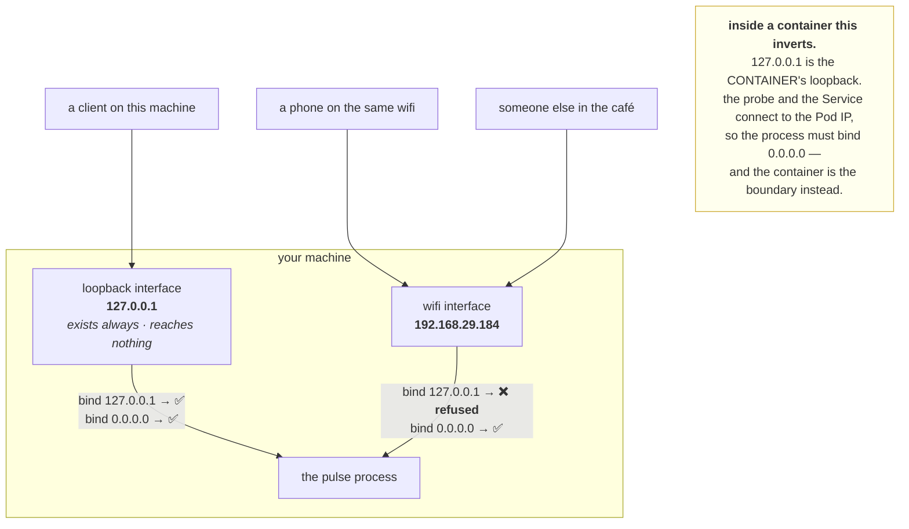

# 1.3 — Binding `127.0.0.1` versus `0.0.0.0`

## One-line answer

The address you bind to decides **which network interfaces the kernel will accept connections on** —
`127.0.0.1` means only this machine can reach you and `0.0.0.0` means anything that can route to you can —
and it is a security boundary, an availability decision, and the single most common "works on my machine"
failure, all at once.

---

## The story

🎬 **The scene.** A shop with two doors: one onto the street, one into a private courtyard behind, shared
with the flats above.

The shopkeeper unlocks the courtyard door in the morning so the residents can come and buy milk. The street
door stays bolted. The shop is open and, to anyone walking past on the street, closed.

😬 **The naive fix.** A resident tells a friend the shop is open. The friend arrives from the street,
finds the door bolted, and reports that the shop is shut.

💥 **Why it fails.** Both people are telling the truth about their own door, and neither is describing the
shop. **"Open" is not a property of the shop — it is a property of a door**, and the shop has two with
different states. The argument about whether the shop is open cannot be settled without asking *which way
in*.

💡 **The insight.** Reachability is never a property of a service on its own. **It is a property of the
pair — this service, from that direction** — and every confusing "it works for me" conversation is two
people describing different doors.

---

## The idea in plain language

A machine has more than one network interface. Even a laptop with nothing plugged in has at least two:

- **the loopback interface**, address `127.0.0.1`, which exists on every machine, is never connected to
  anything, and can only be used by the machine itself;
- **a real interface** — wifi or ethernet — with an address like `192.168.1.42`, reachable by other
  machines.

A container adds more; a Kubernetes node adds several.

When a process binds a port ([1.1](1.1-a-port-is-a-doorway-not-a-place.md)), it also names an address, and
that address selects **which interfaces the claim applies to**:

| Bind address | Accepts connections arriving on | Reachable from |
| --- | --- | --- |
| `127.0.0.1` | the loopback interface only | **this machine only** |
| `192.168.1.42` | that one specific interface | anything that can route to that address |
| `0.0.0.0` | **all IPv4 interfaces**, including ones added later | anything that can route to any of them |
| `::` | all IPv6 interfaces, and often all IPv4 too | as above |

**`0.0.0.0` is not an address.** Nothing has it, nothing routes to it, and you cannot connect to it as a
destination. In a `bind` call it is a **wildcard** meaning "any local address" — a fact that is obvious
once stated and confusing forever if not.

### Why the default is `127.0.0.1` and why that is right

Every example in this curriculum so far has used `--host 127.0.0.1`, and uvicorn's own default is the
same (verified against the project's settings documentation on **2026-08-24**: *"Bind socket to this host.
Use `--host 0.0.0.0` to make the application available on your local network."*).

The reason is Principle 13 — blast radius before capability. **A development service bound to `0.0.0.0` on
a laptop in a café is a service anyone on that network can reach**, with no authentication, possibly with
a debug endpoint, possibly with your data. Binding to loopback makes that impossible by construction
rather than by hoping the network is friendly.

### And why production does the opposite

A container's process must bind `0.0.0.0`, and this catches everybody once.

Inside a container, `127.0.0.1` is the *container's* loopback — a private interface that only processes in
that container share. A Kubernetes probe, a Service, or another Pod connects to the container's **Pod IP**,
which is a different interface entirely. **A container bound to `127.0.0.1` accepts nothing from
outside itself**, and the symptom is a healthy-looking container that fails every readiness check.

**So the rule inverts at the container boundary**, and the reason it is safe to invert is that the
container *is* the boundary: what may reach the Pod IP is decided by network policy (Day 39), not by the
bind address.

| Where | Bind to | Because |
| --- | --- | --- |
| your laptop, development | `127.0.0.1` | nothing else should be able to reach it |
| inside a container | `0.0.0.0` | the probe and the Service come from outside the container |
| a process on a shared server | a specific interface | be deliberate about which network |

---

## Why Kriya needs it

Day 23 writes `pulse`'s Dockerfile and Day 25 runs it. **The `--host` flag has to change on that day**,
and knowing why beforehand turns a mysterious failure into an expected one.

Day 26 adds a container healthcheck and Day 41 a Kubernetes probe. Both connect from outside the process's
own loopback, and both fail against a loopback-bound service.

Day 30's failure lab includes "the container is running and unreachable", and this is one of its two
causes.

Day 39 writes the first network policy, which is the control that replaces the bind address as the
boundary — and you cannot reason about that replacement without knowing what the bind address was doing.

---

## The mechanism

Bind each way and try to reach it from both directions.

First, find out what interfaces this machine has:

```bash
ipconfig 2>/dev/null | grep -A2 'IPv4' | head -12 || ip -4 addr show 2>/dev/null | grep -E 'inet |^[0-9]' | head -12
```

**Line by line:**

- `ipconfig` on Windows, `ip -4 addr show` on Linux — the `||` fallback covers both without you having to
  know which machine you are on.
- `-4` restricts to IPv4, because IPv6 doubles the output and adds nothing to this lesson.
- `grep -A2 'IPv4'` / `grep -E 'inet |^[0-9]'` — pull out just the addresses. **Both forms are noisy by
  default**, and trimming to the lines that matter is what makes this a usable command rather than a wall.

Observed on **2026-08-24**:

```text
   IPv4 Address. . . . . . . . . . . : 192.168.29.184
   Subnet Mask . . . . . . . . . . . : 255.255.255.0
   Default Gateway . . . . . . . . . : 192.168.29.1
```

**`192.168.29.184` is this machine's address on the local network.** Note it down — the rest of this part
uses it, and yours will differ.

### Bound to loopback

```bash
uv run uvicorn pulse.api:app --host 127.0.0.1 --port 8000 &
PULSE=$!
sleep 3
netstat -ano | grep ':8000.*LISTENING'
curl -sS -m 3 -o /dev/null -w 'via 127.0.0.1      : exit=%{exitcode} http=%{http_code}\n' http://127.0.0.1:8000/healthz
curl -sS -m 3 -o /dev/null -w 'via 192.168.29.184 : exit=%{exitcode} http=%{http_code}\n' http://192.168.29.184:8000/healthz
```

**Line by line:**

- The `netstat` first, so you can see **what address the kernel recorded** before you test reachability.
  The claim is visible; the consequence follows from it.
- Two `curl`s to **the same port on the same machine**, differing only in which address they go to. That
  is the controlled comparison, and it is the whole experiment.
- `-m 3` caps each attempt so a hang does not stall the demonstration
  ([4.1](../04-timeouts/4.1-a-timeout-is-a-decision-not-a-safety-net.md)).
- `%{exitcode}` alongside `%{http_code}` — **the two together distinguish the three outcomes**: connected
  and answered, connected and nothing, or never connected
  ([1.1](1.1-a-port-is-a-doorway-not-a-place.md)).

```text
  TCP    127.0.0.1:8000         0.0.0.0:0              LISTENING       27431
via 127.0.0.1      : exit=0 http=200
via 192.168.29.184 : exit=7 http=000
```

**Same process, same port, two different answers.** `exit=7` is curl's *"failed to connect"*, and it came
back immediately — a refusal, not a timeout
([1.1](1.1-a-port-is-a-doorway-not-a-place.md)).

**The `netstat` row already told you.** `127.0.0.1:8000` in the local-address column is the whole
explanation: the claim was made on loopback and nothing else.

### Bound to the wildcard

```bash
kill "$PULSE"; wait "$PULSE" 2>/dev/null
uv run uvicorn pulse.api:app --host 0.0.0.0 --port 8000 &
PULSE=$!
sleep 3
netstat -ano | grep ':8000.*LISTENING'
curl -sS -m 3 -o /dev/null -w 'via 127.0.0.1      : exit=%{exitcode} http=%{http_code}\n' http://127.0.0.1:8000/healthz
curl -sS -m 3 -o /dev/null -w 'via 192.168.29.184 : exit=%{exitcode} http=%{http_code}\n' http://192.168.29.184:8000/healthz
```

**Line by line:** kill the previous server first — **the port cannot be claimed twice**
([1.1](1.1-a-port-is-a-doorway-not-a-place.md)) — then the identical commands with one flag changed.

```text
  TCP    0.0.0.0:8000           0.0.0.0:0              LISTENING       46220
via 127.0.0.1      : exit=0 http=200
via 192.168.29.184 : exit=0 http=200
```

**Both work now**, and the `netstat` row says `0.0.0.0:8000` instead of `127.0.0.1:8000`. **One flag, and
the service went from reachable-by-nobody-else to reachable by every device on the network you are
attached to.**

⚠️ **Stop it now.** That is the point of the next paragraph, not a formality:

```bash
kill "$PULSE"; wait "$PULSE" 2>/dev/null; netstat -ano | grep ':8000' || echo "8000 released"
```

**Line by line:** kill, collect, and confirm. **A `0.0.0.0`-bound development service left running on a
network you do not control is a genuine exposure** — `pulse` has no authentication of any kind, and its
`/predict` endpoint accepts arbitrary input from anyone who can reach it.

### Seeing it from the other side

If you have a second device on the same network — a phone, a second laptop — the demonstration is much
more convincing:

```bash
# 🅿️ Only if you control the network you are on. Never on a café or hotel network.
# From the OTHER device:
#   curl -sS -m 3 http://192.168.29.184:8000/healthz
```

**Line by line:** the same request, from a machine that is not this one. **With `0.0.0.0` it returns
`{"status":"ok"}`; with `127.0.0.1` it fails to connect.** The parked marker is because the safety of doing
this depends entirely on whose network you are on, which is a judgement no instruction can make for you.



---

## When it breaks

**A container that starts, logs happily, and fails every probe.** The inversion, in its natural habitat:

```text
$ kubectl get pods
NAME                    READY   STATUS    RESTARTS   AGE
pulse-6d4f8b9c7-mn2xk   0/1     Running   4          3m
$ kubectl logs pulse-6d4f8b9c7-mn2xk | tail -2
INFO:     Uvicorn running on http://127.0.0.1:8000 (Press CTRL+C to quit)
$ kubectl describe pod pulse-6d4f8b9c7-mn2xk | grep -A2 Warning
  Warning  Unhealthy  2m (x12 over 3m)  kubelet  Readiness probe failed: dial tcp 10.244.1.7:8000: connect: connection refused
```

**What it says:** the container is running, uvicorn started, and the probe cannot connect to
`10.244.1.7:8000`.
**What it actually means:** the log line contains the whole answer — **`http://127.0.0.1:8000`**. The
process bound the container's loopback; the probe connects to the Pod IP, which is a different interface.
**The smallest fix:** `--host 0.0.0.0`.
**Why it is worth recognising instantly:** the log looks completely healthy and the container never
crashes, so the instinct is to suspect the probe configuration. **The startup log line is the diagnosis
and people read past it every time.**

**A service reachable from the world that should not have been.** The exposure:

```text
$ ss -ltn
State   Recv-Q  Send-Q  Local Address:Port
LISTEN  0       2048    0.0.0.0:8000
LISTEN  0       128     0.0.0.0:5432
```

**What it says:** two services listening on all interfaces, one of them a database.
**What it actually means:** if this machine has a public address and no firewall, **the database is
reachable from the internet.** This is not hypothetical; it is one of the commonest ways databases are
compromised, and it is a single default in a configuration file.
**The smallest fix:** bind the database to loopback or a private interface, and put the firewall rule in
place regardless — **defence in depth, because the bind address and the firewall are two independent
controls and each can be wrong.**
**How to check what is actually exposed:** `ss -ltn` and read the `Local Address` column for every row.
`0.0.0.0` and `::` mean "everywhere"; anything else is specific.

**`Cannot assign requested address` when binding.** The address that is not yours:

```text
$ uv run uvicorn pulse.api:app --host 192.168.29.99 --port 8000
ERROR:    [Errno 99] error while attempting to bind on address ('192.168.29.99', 8000): cannot assign requested address
```

**What it says:** the address cannot be assigned.
**What it actually means:** **you can only bind an address this machine actually has.** `192.168.29.99` is
on the network but belongs to something else, or to nothing.
**The smallest fix:** check with `ipconfig` or `ip addr` and use an address that appears there, or use
`0.0.0.0` to mean "whatever I have".
**Where this bites for real:** a machine whose address is assigned by DHCP after the service starts — the
service binds a specific address at boot, the address is not there yet, and the service fails to start.
**Binding `0.0.0.0` is immune to that**, because the wildcard covers interfaces that appear later.

**It works from the same machine and not from another, and the bind address is `0.0.0.0`.** The layer
below:

```text
$ ss -ltn | grep 8000
LISTEN  0  2048  0.0.0.0:8000
# from another machine:
$ curl -m 5 http://192.168.29.184:8000/healthz
curl: (28) Connection timed out after 5001 milliseconds
```

**What it says:** bound to everything, and a **timeout** rather than a refusal.
**What it actually means:** the bind is fine and something between the two machines is dropping the
packets — a host firewall, a security group, a network policy. **The timeout rather than a refusal is the
tell** ([1.1](1.1-a-port-is-a-doorway-not-a-place.md)): a refusal comes from the destination kernel, so
getting one means you reached it; silence means you did not.
**The smallest fix:** open the firewall, or on Windows allow the application through when prompted.
**The general rule:** **bind address explains refusals; firewalls explain timeouts.** That one sentence
resolves most of these arguments.

---

## In production

**What a professional writes instead of the teaching version.** They make the bind address configuration
rather than a constant — an environment variable with a safe default (Day 9) — so the same image binds
loopback on a developer's machine and `0.0.0.0` in a container without a code change. And they treat the
bind address as one layer of several: **the container is a boundary, the network policy is a boundary, the
firewall is a boundary, and authentication is a boundary.** Relying on the bind address alone is how a
service ends up exposed the first time it is deployed somewhere slightly different.

**What degrades at scale.** The number of interfaces, and therefore the number of ways to be wrong. A
laptop has two. A Kubernetes node has a host interface, a bridge, a virtual interface per Pod, and
possibly an overlay — and "which interface did I bind" becomes a question with a dozen answers, most of
which are wrong in a way that produces silence rather than an error. **This is why `0.0.0.0` inside a
container is not laziness but the correct answer**: the container's namespace makes the wildcard narrow.

**The failure that only shows with real traffic.** Nothing here degrades with traffic — which is worth
saying, because it makes this class of bug distinctive. **A bind-address problem is deterministic**: it
works or it does not, from a given direction, always. If a reachability problem is intermittent, it is not
this; look at DNS (section [2](../02-dns/2.3-the-dns-failure-that-looks-like-a-timeout.md)), at a load
balancer with a stale endpoint, or at connection state
([3.4](../03-tcp/3.4-the-connection-that-is-open-and-dead.md)).

**The review comment a senior engineer leaves.** *"The service binds `0.0.0.0` on the host network, so it
is reachable on every interface this node has, including the management one. Either bind the pod network
specifically or add a network policy — right now the only thing stopping traffic from the management VLAN
is that nobody has tried."*

**The signal you would alert on.** Not a metric — a **scheduled check**. The correct value here is a
constant, so what you want is an inventory: **every listening socket on every host, with its bind address,
compared against an expected list.** Anything binding `0.0.0.0` that should not be is a finding, and the
result should be zero. `ss -ltnH | awk '{print $4}'` produces the list in one line. This is the same shape
as the permission scan from
[Day 5, part 2.2](../../../day-005-linux-for-operators-ii/parts/02-permissions/2.2-reading-and-changing-a-mode.md):
a violation count that should always be zero, gathered on a schedule rather than continuously. You would
**not** alert on bind addresses changing at runtime, because they do not.

**Blast radius.** ⚠️ **This part deliberately exposes a service to the local network**, and it is the
first time this curriculum has done so. `pulse` has **no authentication of any kind** — its `/predict`
endpoint accepts arbitrary JSON from anyone who can reach it, and its `/version` endpoint reports what is
running. Worst case on a home network: a housemate's device can reach it. **Worst case on a café, hotel or
conference network: everyone on that network can**, and they can also see it in a port scan. Who can
trigger it: one flag. What bounds it: **the `kill` immediately after the demonstration**, which is why it
appears in the commands rather than as advice, and the rule that follows. ⚠️ **Never leave a
`0.0.0.0`-bound development service running on a network you do not control**, and prefer doing this
experiment at home.

**Cost.** `0` model calls, `0` tokens, `0` CI minutes, `0` disk. **RAM: `pulse` at about 60 MB.** The bind
address itself costs nothing — it is one field in the socket. **The cost of getting it wrong is measured
in exposure, which has no unit**, and in the case of the container inversion, in a deploy that fails every
probe until somebody reads the startup log line.

**The interview question.** *"Your container starts fine and every readiness probe fails. First thing you
check?"* The answer that lands names the log line: *"The address it bound to, which uvicorn prints on
startup. If it says `127.0.0.1` that is the whole answer — inside a container that is the container's own
loopback, and the kubelet's probe connects to the Pod IP, which is a different interface, so it gets
connection refused. It has to bind `0.0.0.0`. The reason people hesitate is that binding the wildcard
feels insecure, and on a laptop it is — but inside a container the namespace is the boundary, and what may
actually reach the Pod IP is decided by network policy rather than by the bind address. The general rule I
use is that a refusal points at the bind address and a timeout points at a firewall, because a refusal has
to come from the destination kernel and therefore proves you reached it."*

---

## Check yourself

```bash
for H in 127.0.0.1 0.0.0.0; do uv run uvicorn pulse.api:app --host "$H" --port 8000 >/dev/null 2>&1 & P=$!; sleep 3; printf 'bound %-9s -> ' "$H"; netstat -ano | grep ':8000.*LISTENING' | awk '{printf "%s  ", $2}'; curl -sS -m 2 -o /dev/null -w 'loopback=%{exitcode} ' http://127.0.0.1:8000/healthz; curl -sS -m 2 -o /dev/null -w 'lan=%{exitcode}\n' "http://$(ipconfig 2>/dev/null | grep -m1 'IPv4' | awk '{print $NF}' | tr -d '\r'):8000/healthz"; kill "$P" 2>/dev/null; wait "$P" 2>/dev/null; done
```

Both bind addresses, back to back, showing what `netstat` recorded and whether each of the two routes in
works. **`loopback=0 lan=7` for the first and `loopback=0 lan=0` for the second** — one flag, and the
second row is reachable by every device on your network. **Confirm the server is stopped afterwards.**

**Say out loud, without scrolling up:** *binding `127.0.0.1` is the safe default on your laptop and the
wrong answer inside a container. Explain both halves, and name what replaces the bind address as the
security boundary in the container case.*
