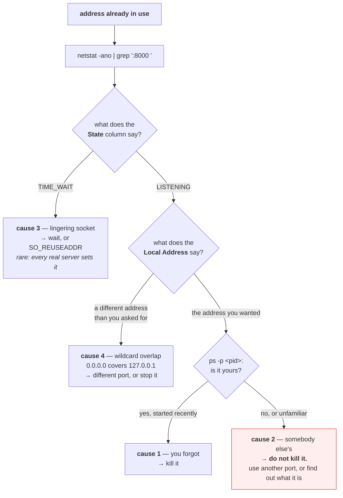

# 1.4 — The port that was already in use

## One-line answer

`address already in use` has four distinct causes with four different fixes — a forgotten process, a
different bind address, a socket in `TIME_WAIT`, and a port claimed by something you did not start — and
the whole skill is going from the error to the owner in one command instead of guessing.

---

## The story

🎬 **The scene.** A car park with numbered bays. You have bay 14 on your permit and there is a car in it.

😬 **The naive fix.** Wait for a bit, then complain to the office, then start looking for a different bay.

💥 **Why it fails.** All three responses assume the same cause — somebody parked wrongly — and there are
four possibilities. The car might be yours, from yesterday, forgotten. It might be in bay 14 of the
*other* car park, and you are in the wrong building. The bay might have been vacated ten minutes ago and
still have a cone on it while the paint dries. Or a delivery van might have a standing arrangement nobody
told you about.

Each one has a different remedy and **only the first is fixed by waiting**. The person who checks the
registration plate before deciding is faster than the person who starts problem-solving immediately.

💡 **The insight.** An error message tells you a *state* and almost never a *cause*. **The first move is
always to identify the occupant**, because the four possible occupants need four different actions, and
three of them are made worse by the response the first one deserves.

---

## The idea in plain language

You have met this error three times already
([Day 4, part 1.1](../../../day-004-linux-for-operators-i/parts/01-the-process/1.1-a-process-is-not-a-program.md),
[1.1](1.1-a-port-is-a-doorway-not-a-place.md)). This part is about diagnosing it properly, because it is
the most common local failure in this entire curriculum and the reflex people develop — kill something and
try again — is right a quarter of the time.

**The error text differs by platform, and both mean the same thing:**

| Platform | Text |
| --- | --- |
| Linux | `[Errno 98] Address already in use` |
| Windows | `[Errno 10048] Only one usage of each socket address (protocol/network address/port) is normally permitted` |

### The four causes

**1 — a process you forgot about.** Overwhelmingly the commonest. You started `pulse` in another terminal,
or backgrounded it and lost track, or a previous run did not exit. **Fix: find it and stop it.**

**2 — a *different* process, deliberately using that port.** Some other service claimed it — a system
daemon, a database, something a previous exercise started. **Fix: use a different port, or find out what
that is and decide.** Killing it blindly is how people take down something that mattered.

**3 — a socket in `TIME_WAIT`.** The previous holder has exited and the kernel is still holding the
address for a period after close, to protect against stray packets from the old connection
([3.3](../03-tcp/3.3-time-wait-and-the-ports-you-ran-out-of.md)). **Fix: wait, or set `SO_REUSEADDR`** —
and the second is what every server does, which is why you rarely see this one.

**4 — a bind-address overlap you did not expect.** Something bound `0.0.0.0:8000` and you are trying to
bind `127.0.0.1:8000` ([1.3](1.3-binding-127-0-0-1-versus-0-0-0-0.md)). The wildcard covers loopback, so
the specific bind collides with it. **The reverse also fails.** Fix: look at the *address* column, not
just the port.

### The one command that distinguishes them

Every one of the four is identified by the same lookup, and it is worth making a reflex:

```
netstat -ano | grep ':8000'        (then: ps -p <that pid>)
ss -ltnp 'sport = :8000'           (Linux, gives the process directly)
```

**Read three fields:** the **state** (`LISTENING` versus `TIME_WAIT` separates cause 3), the **local
address** (`0.0.0.0` versus `127.0.0.1` separates cause 4), and the **pid** (which, fed to `ps`,
separates causes 1 and 2 — is it yours, and did you mean to start it?).

**Three fields, four causes, one command.** That is the whole part.

---

## Why Kriya needs it

Day 25 runs several containers with published ports, and Addendum 02's profile table is partly a list of
which ports each profile occupies — `core` on 8000 and 5432, `obs` on 9090 and 3000, and so on. **Profile
collisions are this error**, and they are the routine cost of the "one profile per concern" rule.

Day 30's failure lab includes a container that will not start, and a port collision with something on the
host is one of the causes.

Day 32 creates a `kind` cluster, which claims ports on your machine, and Day 37 adds an ingress
controller that wants 80 and 443.

Day 62 starts Prometheus on 9090 and Day 64 Grafana on 3000. **On a four-gigabyte-of-headroom laptop
running several profiles, the port map becomes something you actually maintain.**

---

## The mechanism

Produce each cause and diagnose it with the same command.

### Cause 1 — a forgotten process

```bash
uv run uvicorn pulse.api:app --host 127.0.0.1 --port 8000 >/dev/null 2>&1 &
sleep 3
uv run uvicorn pulse.api:app --host 127.0.0.1 --port 8000
echo "exit code: $?"
```

**Line by line:** start one, then try to start a second with identical arguments. `>/dev/null 2>&1` on the
first so its log does not interleave with the second's error
([Day 5, part 4.1](../../../day-005-linux-for-operators-ii/parts/04-logs-that-rotate/4.1-why-a-log-file-is-an-operational-liability.md)
covers the redirect ordering).

Observed on **2026-08-24**:

```text
ERROR:    [Errno 10048] error while attempting to bind on address ('127.0.0.1', 8000): only one usage of each socket address (protocol/network address/port) is normally permitted
exit code: 1
```

**The diagnosis, in one command:**

```bash
netstat -ano | grep ':8000'
```

**Line by line:** no `grep LISTENING` this time — **you want every state**, because `TIME_WAIT` rows are
cause 3 and filtering them out would hide it.

```text
  TCP    127.0.0.1:8000         0.0.0.0:0              LISTENING       46880
```

Then identify the owner:

```bash
ps -o pid,lstart,args -p 46880
```

**Line by line:** `lstart` — **the wall-clock start time**, which is the field that answers "is this mine
and did I mean to start it?"
([Day 4, part 1.3](../../../day-004-linux-for-operators-i/parts/01-the-process/1.3-reading-ps-and-finding-your-service.md)).
A process started four seconds ago is the one you just launched; one from Tuesday is a forgotten orphan
([Day 4, part 1.2](../../../day-004-linux-for-operators-i/parts/01-the-process/1.2-pid-parent-and-the-process-tree.md)).

```text
    PID                  STARTED COMMAND
  46880 Mon Aug 24 22:04:11 2026 python .venv/Scripts/uvicorn pulse.api:app --host 127.0.0.1 --port 8000
```

**Started seconds ago, running the command you recognise, in this repository.** Cause 1, confirmed rather
than assumed. **Fix:**

```bash
kill 46880 && sleep 1 && netstat -ano | grep ':8000' || echo "8000 free"
```

**Line by line:** kill it, wait a moment for the socket to close, **and confirm the port is actually free**
— because if it now shows `TIME_WAIT` you have moved from cause 1 to cause 3 and the next start may still
fail.

### Cause 4 — the bind-address overlap

```bash
uv run uvicorn pulse.api:app --host 0.0.0.0 --port 8000 >/dev/null 2>&1 &
WIDE=$!
sleep 3
netstat -ano | grep ':8000.*LISTENING'
uv run python days/day-007-networking-for-operators/lab/claim_port.py 127.0.0.1 8000
echo "exit code: $?"
```

**Line by line:**

- The first server binds the **wildcard** ([1.3](1.3-binding-127-0-0-1-versus-0-0-0-0.md)).
- The second tries to bind **loopback specifically** — a narrower address, which feels like it should be
  allowed and is not.
- The `netstat` between them shows the recorded address, so the collision is explicable before it happens
  rather than after.

```text
  TCP    0.0.0.0:8000           0.0.0.0:0              LISTENING       47102
Traceback (most recent call last):
  File "days/day-007-networking-for-operators/lab/claim_port.py", line 11, in <module>
    sock.bind((HOST, PORT))
OSError: [Errno 10048] Only one usage of each socket address ...
exit code: 1
```

**The local address column says `0.0.0.0` and you asked for `127.0.0.1`.** The wildcard already covers
loopback, so there is nothing left to claim. **This is the cause people find hardest**, because the two
addresses look different and the conflict is not obvious from the error, which mentions neither.

**The fix is to read that column**, and then either use a different port or stop the wildcard-bound
process.

```bash
kill "$WIDE"; wait "$WIDE" 2>/dev/null
```

**Line by line:** stop it — and note this is the `0.0.0.0` bind from
[1.3](1.3-binding-127-0-0-1-versus-0-0-0-0.md), exposed to the local network, so stopping it is a safety
step rather than tidiness.

### Cause 3 — `TIME_WAIT`, and why you rarely see it

```python
# days/day-007-networking-for-operators/lab/no_reuse.py
"""Bind WITHOUT SO_REUSEADDR, so a recently-closed socket blocks the rebind."""

import socket
import sys

PORT = int(sys.argv[1]) if len(sys.argv) > 1 else 8003
REUSE = "--reuse" in sys.argv

sock = socket.socket(socket.AF_INET, socket.SOCK_STREAM)
if REUSE:
    sock.setsockopt(socket.SOL_SOCKET, socket.SO_REUSEADDR, 1)

sock.bind(("127.0.0.1", PORT))
sock.listen(8)
print(f"[bind] {'with' if REUSE else 'without'} SO_REUSEADDR on 127.0.0.1:{PORT} -> ok", flush=True)
sock.close()
```

**Line by line:**

- `sock.setsockopt(socket.SOL_SOCKET, socket.SO_REUSEADDR, 1)` — **the option every real server sets.**
  It tells the kernel "allow me to bind this address even if there are lingering sockets from a previous
  incarnation in `TIME_WAIT`".
- Guarded by a flag so **one script demonstrates both behaviours**, which is what makes the comparison a
  measurement rather than two anecdotes.
- `SOL_SOCKET` is the option *level* — socket-level rather than protocol-level. The three-argument shape
  is the same for every socket option and is worth recognising.
- `sock.close()` immediately — the point is the bind, not serving anything.
- ⚠️ **`SO_REUSEADDR` does not let two live listeners share a port.** It only forgives lingering
  `TIME_WAIT` state. The option that genuinely shares is `SO_REUSEPORT`, which is a different thing and is
  how some servers run several worker processes on one port.

```bash
for i in 1 2; do uv run python days/day-007-networking-for-operators/lab/no_reuse.py 8003; done
echo "--- now with the option ---"
for i in 1 2; do uv run python days/day-007-networking-for-operators/lab/no_reuse.py 8003 --reuse; done
```

**Line by line:** twice in quick succession each way. **The second run of each pair is the test** — it
happens while the first run's socket may still be lingering.

```text
[bind] without SO_REUSEADDR on 127.0.0.1:8003 -> ok
[bind] without SO_REUSEADDR on 127.0.0.1:8003 -> ok
--- now with the option ---
[bind] with SO_REUSEADDR on 127.0.0.1:8003 -> ok
[bind] with SO_REUSEADDR on 127.0.0.1:8003 -> ok
```

⚠️ **All four succeeded**, because this socket was never *connected* — `TIME_WAIT` applies to connections
that carried data, not to a listening socket that was opened and closed
([3.3](../03-tcp/3.3-time-wait-and-the-ports-you-ran-out-of.md)). **That is itself the finding**: cause 3
needs a server that had live clients, which is why you meet it after a real service restarts and not in a
toy.

**The realistic version:** restart `pulse` immediately after a client has been connected to it, and watch
for `TIME_WAIT` rows on port 8000 in `netstat`. Uvicorn sets `SO_REUSEADDR`, so it will start anyway —
**which is why you almost never see this cause and should still recognise the state when it appears in a
listing.**

### The one-liner worth keeping

```bash
port_owner() { netstat -ano | grep ":$1 " | while read -r _ local foreign state pid; do printf '%-22s %-22s %-12s %s\n' "$local" "$foreign" "$state" "$(ps -o args= -p "$pid" 2>/dev/null | cut -c1-45)"; done; }
port_owner 8000
```

**Line by line:**

- A shell function so it is reusable rather than retyped. `port_owner 8000`, `port_owner 5432`.
- `grep ":$1 "` — **the trailing space matters.** Without it, searching for `:80` also matches `:8000`,
  `:8080` and `:8001`, which is a genuinely confusing way to diagnose the wrong port.
- `while read -r _ local foreign state pid` — split each line into named fields. `-r` stops backslashes
  being interpreted; `_` discards the protocol column.
- `ps -o args= -p "$pid"` — **the join.** This is the step that turns a number into a name, and it is the
  one people skip.
- `cut -c1-45` keeps the table readable
  ([Day 4, part 1.3](../../../day-004-linux-for-operators-i/parts/01-the-process/1.3-reading-ps-and-finding-your-service.md)).

```text
127.0.0.1:8000         0.0.0.0:0              LISTENING    python .venv/Scripts/uvicorn pulse.api:app
```

**Address, peer, state and owner on one line** — the three fields that separate the four causes, plus the
name that tells you whether to kill it.



Clean up:

```bash
pkill -f 'uvicorn pulse.api' 2>/dev/null; pkill -f claim_port.py 2>/dev/null; sleep 1; netstat -ano | grep -E ':800[0-3]' || echo "8000-8003 all free"
```

**Line by line:** stop everything this part started, then **confirm across the whole range** rather than
checking one port — this part used four, and a forgotten one on 8001 will confuse the next part.

---

## When it breaks

**You killed the wrong thing.** Cause 2, mishandled:

```text
$ netstat -ano | grep ':5432'
  TCP    0.0.0.0:5432    0.0.0.0:0    LISTENING    1882
$ kill 1882
$ # ...and the database everyone was using is now down
```

**What it says:** nothing. `kill` succeeds silently.
**What it actually means:** you removed a process you did not identify. **The reflex "port busy → kill the
pid" is right for cause 1 and catastrophic for cause 2**, and the two are indistinguishable without the
`ps` lookup.
**The smallest fix:** there is none afterwards. **The prevention is one command before the kill** —
`ps -o pid,lstart,user,args -p <pid>` — and the two fields that decide are `lstart` (recent means it is
probably yours) and `user` (a system user means it is not).

**The pid column is empty or wrong.** A permissions gap:

```text
$ ss -ltnp 'sport = :5432'
State  Recv-Q Send-Q Local Address:Port Peer Address:Port Process
LISTEN 0      128    0.0.0.0:5432       0.0.0.0:*
```

**What it says:** a listening socket with no process shown.
**What it actually means:** **`ss -p` only shows processes you own** unless you are root
([Day 5, part 2.1](../../../day-005-linux-for-operators-ii/parts/02-permissions/2.1-user-group-other-and-three-bits.md)).
The blank is a permission result, not a missing owner.
**The smallest fix:** `sudo ss -ltnp`. **Worth knowing because** an empty Process column looks like a
kernel-owned socket and people conclude something exotic is happening.

**The port is free and the bind still fails.** Cause 4's subtler form:

```text
$ netstat -ano | grep ':8000'
$ uv run uvicorn pulse.api:app --host 0.0.0.0 --port 8000
ERROR:    [Errno 10013] error while attempting to bind on address ('0.0.0.0', 8000): an attempt was made to access a socket in a way forbidden by its access permissions
```

**What it says:** access forbidden — **a different errno from "already in use"**.
**What it actually means:** on Windows, a range of ports can be reserved by the operating system (Hyper-V
and WSL2 reserve blocks dynamically), and a reserved port is neither in use nor available. **This machine
will hit it**, which is why it is here rather than in a footnote.
**The smallest fix:** `netsh interface ipv4 show excludedportrange protocol=tcp` lists the reserved
ranges. Pick a port outside them. **This is a real Windows-specific trap** and it produces an error that
mentions permissions when nothing is wrong with your permissions.

**Restarting immediately after a load test fails to bind.** Cause 3, in the one place you meet it:

```text
$ netstat -ano | grep ':8000' | awk '{print $4}' | sort | uniq -c
   3841 TIME_WAIT
      0 LISTENING
```

**What it says:** thousands of lingering sockets and nothing listening.
**What it actually means:** a load test just finished. Every one of those connections was closed by this
side, so each is holding its four-tuple for a protection period
([3.3](../03-tcp/3.3-time-wait-and-the-ports-you-ran-out-of.md)).
**Why the bind usually succeeds anyway:** `SO_REUSEADDR`, which uvicorn sets. **When it does not:** a
server that does not set it, which is worth checking in anything you write yourself.
**The thing to take away:** a large `TIME_WAIT` count is normal after heavy traffic and is only a problem
when it exhausts the ephemeral range on the *client* side.

---

## In production

**What a professional writes instead of the teaching version.** They keep a port map — a document listing
which service owns which port on which host — and treat a collision as a planning failure rather than an
incident. And they make ports configurable (Day 9) so a collision is resolved by changing a variable
rather than by killing something. **The habit that matters most is the lookup**: nobody who has taken down
a database by killing a pid they did not identify ever skips the `ps` step again.

**What degrades at scale.** Port allocation becomes a shared namespace with no owner. On one machine you
remember. On a fleet of hosts running mixed workloads, two teams will eventually choose the same number,
and the collision surfaces at deploy time on one host in a way that looks like a bad node. **This is one of
the strongest arguments for containers** ([1.1](1.1-a-port-is-a-doorway-not-a-place.md)): a network
namespace per container means every service can bind 8000 inside itself and the shared namespace shrinks
to just the published ports, which are far fewer and are chosen by the platform.

**The failure that only shows with real traffic.** `TIME_WAIT` accumulation, which is invisible until a
service restarts under load. A deploy during a quiet period rebinds instantly; the same deploy at peak
leaves tens of thousands of lingering sockets, and if the server does not set `SO_REUSEADDR` the new
instance cannot start — **so the rollout stalls precisely when the service is busiest**, which is the worst
possible time for a deploy to fail.

**The review comment a senior engineer leaves.** *"The startup script does `kill $(lsof -ti:8000)` before
starting. On a developer laptop that is fine; on a shared host it will kill whatever happens to be on 8000,
which last month was the metrics agent. Make the port configurable and fail loudly on a collision instead
of clearing it."*

**The signal you would alert on.** Not "port in use", which is a start-up-time failure and surfaces as the
process exiting non-zero
([Day 4, part 3.1](../../../day-004-linux-for-operators-i/parts/03-exit-codes/3.1-the-exit-code-is-the-whole-return-value.md))
— that is already visible as a restart loop. What is worth having is **an inventory check**: listening
sockets per host compared against an expected map, which catches both collisions and the exposure problem
from [1.3](1.3-binding-127-0-0-1-versus-0-0-0-0.md) in one scan. And **`TIME_WAIT` count as a fraction of
the ephemeral range**, because that is the one that produces a sudden, obscure failure
([3.3](../03-tcp/3.3-time-wait-and-the-ports-you-ran-out-of.md)). You would **not** alert on individual
bind failures, which are a deploy-time problem with an obvious owner.

**Blast radius.** ⚠️ **This part teaches a command that can take down a service you did not start.** The
diagnosis itself is read-only, and the remedy for cause 1 is `kill` — which, applied to cause 2, is
destructive and irreversible. Worst case: killing a database, a metrics agent, or another person's work on
a shared machine, silently, because `kill` succeeds without comment. Who can trigger it: anyone who reads
the pid and acts on it without the `ps` lookup. What bounds it: **the lookup, which is the entire safety
mechanism** — `ps -o pid,lstart,user,args -p <pid>` before every kill, and `pgrep -af <pattern>` before
every `pkill`
([Day 4, part 2.2](../../../day-004-linux-for-operators-i/parts/02-signals/2.2-sigterm-and-sigkill-the-request-and-the-order.md)).
On this machine everything is yours and the risk is low; the habit is worth forming here precisely because
it is cheap here.

**Cost.** `0` model calls, `0` tokens, `0` CI minutes, `0` disk. **RAM: `pulse` at about 60 MB while
running.** `netstat` and `ss` cost one read of kernel tables; on a machine with a hundred thousand sockets
`netstat` is noticeably slow and `ss` is not, which is the practical reason `ss` replaced it.

**The interview question.** *"You get 'address already in use' on deploy. Walk me through it."* The answer
that lands enumerates rather than jumps: *"There are four causes and they need different actions, so the
first thing is one command — `ss -ltnp` or `netstat -ano` filtered to the port — and I read three fields.
The state: `TIME_WAIT` means lingering sockets from a previous instance, which `SO_REUSEADDR` normally
forgives and which mostly appears after a restart under load. The local address: if something bound
`0.0.0.0` and I am asking for `127.0.0.1`, the wildcard already covers it, and the error mentions neither
address so that one catches people. And the pid, fed to `ps` for the start time and the user — because if
it is a process I started seconds ago I kill it, and if it is something I do not recognise I absolutely do
not. The reflex of 'port busy, kill the pid' is right about a quarter of the time and I have seen it take
down a database."*

---

## Check yourself

```bash
port_owner() { netstat -ano | grep ":$1 " | while read -r _ l f s p; do printf '%-22s %-12s %s\n' "$l" "$s" "$(ps -o args= -p "$p" 2>/dev/null | cut -c1-45)"; done; }; uv run uvicorn pulse.api:app --host 127.0.0.1 --port 8000 >/dev/null 2>&1 & sleep 3; port_owner 8000; pkill -f 'uvicorn pulse.api'; sleep 1; port_owner 8000 || echo "8000 free"
```

The function that goes from a port number to **address, state and owning command in one line** — define it
once, use it for the rest of this curriculum. **The three fields it prints are exactly the three that
separate the four causes**, which is why it is worth having as a function rather than retyping a pipeline
under pressure.

**Say out loud, without scrolling up:** *name the four causes of "address already in use", say which single
field of `netstat` output identifies each, and say which cause makes "kill the pid" the wrong response.*
