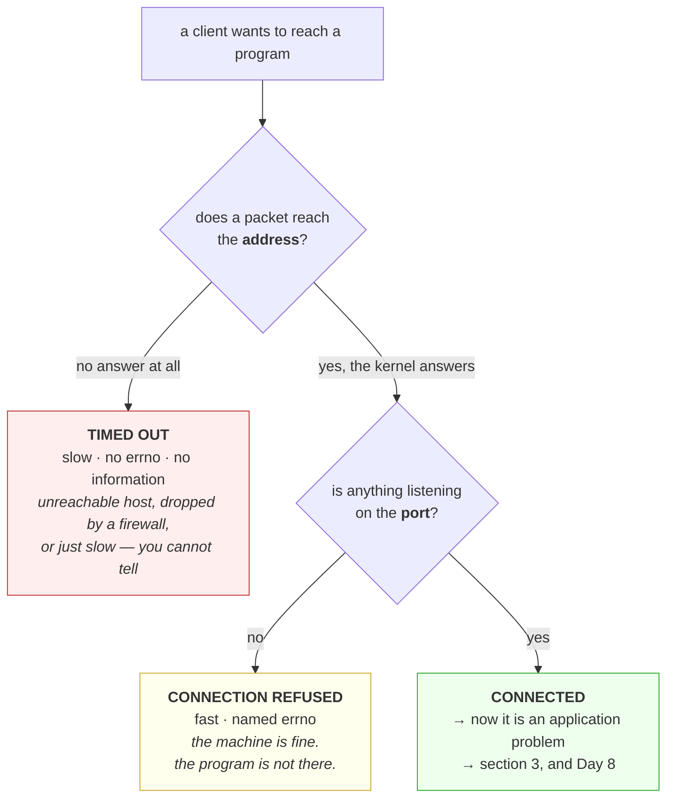

# 1.1 — An address and a port are two different questions

## One-line answer

An address says which machine, and a port says which program on it, so every network failure starts by
being one of two completely different problems, and the error messages barely distinguish them.

---

## The story

🎬 **The scene.** A parcel arrives at a large block of flats. The address on the label is right: the
street, the number, the postcode all match the building the driver is standing outside.

There is no flat number.

😬 **The naive fix.** The driver leaves it in the entrance hall, where somebody will surely sort it out.

💥 **Why it fails.** Forty flats share that hall. The parcel sits there for two days, and then somebody
takes it upstairs to the wrong door because the name on it is similar to theirs. The delivery company's
tracking says "delivered", and it is not wrong: the parcel reached the building.

**The building was never the hard part.** The hard part was the last twenty metres, and the label carried
nothing about it.

💡 **The insight.** Getting to the right place and getting to the right *recipient in* that place are two
separate questions, and a system that answers only the first will report success while nothing useful has
happened. **The failures of the two look almost identical from outside**, which is why people spend hours
checking the street name.

---

## The idea in plain language

Two numbers are involved in reaching a program over a network, and they answer different questions.

**The IP address says which machine.** It is a number that identifies a network interface, written as
four numbers for IPv4, such as `10.175.225.7`, or as hexadecimal groups for IPv6, such as
`2606:4700:10::6814:179a`. Getting a packet to that address is the internet's job, and it involves routers,
switches and cables that this curriculum treats as given.

**The port says which program on that machine.** It is a number from 1 to 65535, carried in the TCP or
UDP header. One machine runs many programs that want network traffic, and the port is how the kernel
decides which one gets a given packet.

**Both are needed, and they fail differently.**

| Symptom | Usually means |
| --- | --- |
| the connection hangs, then times out | the **address** is unreachable, or a firewall is dropping packets silently |
| the connection is refused immediately | the **address** is reachable and **nothing is listening** on that port |
| it connects and then nothing sensible happens | the address and port are right and **the wrong program** is listening |

**The second row is the one worth memorising.** A refusal is good news dressed as bad news: it proves the
machine is there, the route works, and the kernel answered. Only the last hop failed.

### Where the numbers come from

You do not usually type an address. You type a name, and something turns the name into an address, which
is section [2](../02-names/2.1-what-resolving-a-name-actually-does.md).

Ports are more often typed, and there are conventions rather than rules.

| Range | Called | Convention |
| --- | --- | --- |
| 1–1023 | well-known | historically requires privilege to bind on Unix. 80 is HTTP, 443 is HTTPS, 22 is SSH, 53 is DNS |
| 1024–49151 | registered | applications claim these by convention. 5432 is Postgres, 6379 is Redis, 9090 is Prometheus |
| 49152–65535 | ephemeral | **the kernel hands these out to clients automatically**, and part [1.2](1.2-the-socket-and-the-four-tuple.md) is about why that matters |

**`pulse` listens on 8000**, which is in the registered range and claimed by nobody official, which is
exactly why it is the default in so many frameworks.

### The part that surprises people: clients have ports too

A conversation has two ends, and both ends have an address and a port. The server's port is the one you
chose. **The client's port is chosen by the kernel, from the ephemeral range, and you never see it unless
you look.**

That fact does no work at all until the day you run out of them, which is part
[3.3](../03-the-connection/3.3-time-wait-and-the-ports-you-ran-out-of.md).

---

## Why Kriya needs it

Day 25 puts `pulse` in a container and publishes a port. Container port and host port are two different
numbers with a mapping between them, and every "I cannot reach it" on that day is one of the three rows in
the table above.

Day 33 puts `pulse` in Kubernetes, where a Service adds a third address that is not any machine's address
at all, and part [1.3](1.3-binding-127-0-0-1-versus-0-0-0-0.md)'s binding rule is what makes it reachable
or not.

Day 45 configures an ingress, which is one address and port fronting many services, distinguished by name
rather than by number.

Day 62 scrapes metrics from `pulse`, which is Prometheus making exactly this kind of connection to exactly
this kind of address and port, on a schedule, and reporting a target as `down` when it cannot.

---

## The mechanism

Look at what is listening on this machine, then reach one of them deliberately.

```bash
netstat -ano 2>/dev/null | head -8 || echo "no netstat here"
```

**Line by line:** `netstat` lists network connections and listening sockets. On Windows, `-a` shows all
sockets including listening ones, `-n` prints numbers rather than resolving names, and `-o` adds the
owning process id. **`-n` is the one that matters for operators**, because name resolution on a listing of
two hundred sockets is slow and can itself hang, and you almost always want the number anyway.

Observed on **2026-08-26**:

```text
Active Connections

  Proto  Local Address          Foreign Address        State           PID
  TCP    0.0.0.0:135            0.0.0.0:0              LISTENING       1308
  TCP    0.0.0.0:445            0.0.0.0:0              LISTENING       4
```

**Read the `Local Address` column as two fields separated by a colon.** `0.0.0.0` is the address and `135`
is the port. `State LISTENING` means a program has claimed that port and is waiting. `Foreign Address` is
`0.0.0.0:0` because a listening socket has no peer yet, which part
[1.2](1.2-the-socket-and-the-four-tuple.md) explains.

⚠️ **On Linux the tool is `ss` rather than `netstat`**, and the equivalent is `ss -ltnp`, where `-l` is
listening, `-t` is TCP, `-n` is numeric and `-p` shows the process. `ss` is not installed here. **This is
the fifth consecutive day with a tool gap on this machine**, and it closes with WSL2 on Day 21, which by
now is a documented pattern rather than an inconvenience.

### The three failures, produced deliberately

```python
# days/day-007-networking-for-operators/lab/reach.py
"""Try to reach three destinations and report exactly how each one fails."""

import socket
import time

TARGETS = [
    ("127.0.0.1", 8099, "nothing listening on this machine"),
    ("10.255.255.1", 80, "an address on this network that no machine answers for"),
    ("127.0.0.1", 8000, "pulse, if you started it"),
]


def probe(host: str, port: int, note: str, timeout: float = 3.0) -> None:
    """Attempt one TCP connection and print the outcome with its errno and duration."""
    sock = socket.socket(socket.AF_INET, socket.SOCK_STREAM)
    sock.settimeout(timeout)
    started = time.monotonic()
    try:
        sock.connect((host, port))
        outcome = "CONNECTED"
    except socket.timeout:
        outcome = "TIMED OUT — no answer at all"
    except OSError as exc:
        outcome = f"{type(exc).__name__} errno={exc.errno} {exc.strerror}"
    finally:
        sock.close()
    print(f"{host}:{port:<6} {time.monotonic() - started:5.2f}s  {outcome}")
    print(f"{'':13} ({note})")


for host, port, note in TARGETS:
    probe(host, port, note)
```

**Line by line:**

- `socket.socket(socket.AF_INET, socket.SOCK_STREAM)` creates a TCP socket over IPv4. `AF_INET` is the
  address family, meaning IPv4, and `SOCK_STREAM` is the type, meaning a reliable ordered byte stream,
  which is TCP. **Naming both explicitly is worth the extra words**, because `AF_INET6` and `SOCK_DGRAM`
  are the two you will meet next and the difference is invisible if you rely on defaults.
- `sock.settimeout(timeout)` bounds the attempt. **Without it, `connect` uses the operating system's own
  retry behaviour**, which on some systems is over two minutes, and part
  [4.1](../04-timeouts/4.1-a-timeout-is-a-decision-not-a-safety-net.md) is entirely about why that
  default is never the number you want.
- `except socket.timeout` comes **before** `except OSError`, because `socket.timeout` is a subclass of
  `OSError` and a broader handler placed first would swallow it. **Order matters in an except chain**, and
  getting it wrong here would report every timeout as an unnamed error.
- `except OSError as exc` catches the specific family rather than using a bare `except`, as `CLAUDE.md`
  requires, and printing `exc.errno` alongside `exc.strerror` matters because **the number is portable and
  the message is not**, which the output below demonstrates.
- `time.monotonic()` rather than `time.time()` gives a clock that cannot jump backwards, which is the same
  choice as [Day 6, part 2.1](../../../day-006-resources-and-the-oom-killer/parts/02-cpu/2.1-a-core-is-a-queue-not-a-speed.md).
- **Printing the duration next to the outcome is the point of the whole script.** A refusal is fast and a
  drop is slow, and that difference is the diagnosis.

```bash
uv run python days/day-007-networking-for-operators/lab/reach.py
```

**Line by line:** run it from the repository root, which is where `uv run` anchors, so the path in the
command matches the path in the file's header comment. **No arguments**, because the three targets are in
the script where you can read them rather than in your shell history where you cannot.

Observed on **2026-08-26**, with `pulse` not running:

```text
127.0.0.1:8099    2.05s  ConnectionRefusedError errno=10061 No connection could be made because the target machine actively refused it
              (nothing listening on this machine)
10.255.255.1:80      3.02s  TIMED OUT — no answer at all
              (an address on this network that no machine answers for)
127.0.0.1:8000    2.03s  ConnectionRefusedError errno=10061 No connection could be made because the target machine actively refused it
              (pulse, if you started it)
```

**Three destinations, two completely different failures.** The refusals came back in about two seconds
with a named error and an errno. The unreachable address consumed the entire three-second budget and
produced nothing at all.

**Errno 10061 is Windows' number for "connection refused".** On Linux the same condition is errno 111 with
the message `Connection refused`, and on both it means the same thing: **a machine answered, and it said
no.** Compare that with the timeout, where nothing answered and you cannot tell whether the machine
exists, whether a firewall ate the packet, or whether the network is simply slow today.

⚠️ **The two-second delay before the refusal is a Windows behaviour**, not a universal one. Windows retries
the initial connection attempt before giving up on a local address; on Linux a refusal on `127.0.0.1`
comes back in well under a millisecond. **Do not read "two seconds" as meaningful** — read "it returned an
error rather than nothing".

### Now with something listening

```bash
uv run uvicorn pulse.api:app --host 127.0.0.1 --port 8000 &
PULSE=$!
sleep 3
uv run python days/day-007-networking-for-operators/lab/reach.py
kill "$PULSE"; wait "$PULSE" 2>/dev/null
```

**Line by line:** start `pulse`, wait for it to bind, and run the identical probe. **The only thing that
changed in the system is that one program is now listening on one port.**

```text
127.0.0.1:8099    2.04s  ConnectionRefusedError errno=10061 No connection could be made because the target machine actively refused it
              (nothing listening on this machine)
10.255.255.1:80      3.02s  TIMED OUT — no answer at all
              (an address on this network that no machine answers for)
127.0.0.1:8000    0.00s  CONNECTED
              (pulse, if you started it)
```

**Same address, different port, opposite result.** `127.0.0.1:8099` is still refused and
`127.0.0.1:8000` connects instantly. The machine was always reachable, and the only question was whether
anything had claimed that particular number.



---

## When it breaks

**`Connection refused` on a service you can see running.** The commonest first-hour confusion.

```text
$ curl -sS http://localhost:8000/healthz
curl: (7) Failed to connect to localhost port 8000 after 2054 ms: Could not connect to server
$ ps -ef | grep '[u]vicorn'
nisha   41220  38102  0 11:02 ?  00:00:01 python .venv/bin/uvicorn pulse.api:app --host 127.0.0.1 --port 8001
```

**What it says:** could not connect on port 8000.

**What it actually means:** the process is running and listening on **8001**. The refusal is correct and
the diagnosis is one column of `ps` away.

**The smallest fix:** read the port the process actually bound, from its own command line or its startup
output, rather than the port you meant to use.

**Why this is worth naming:** `curl: (7)` is the refusal code, and it is the *good* failure. It proves the
address resolved, the route worked, and a kernel answered. **Every one of those is a thing you no longer
have to check.**

**A connection that hangs for over a minute on a typo.** The unreachable address.

```text
$ curl -sS http://10.0.0.99:8000/healthz
curl: (28) Failed to connect to 10.0.0.99 port 8000 after 130004 ms: Connection timed out
```

**What it says:** it gave up after 130 seconds.

**What it actually means:** nothing answered, and curl used **the operating system's default connect
behaviour** because no `--connect-timeout` was given. Two minutes is the kind of number that turns a typo
into a coffee break, and worse, a service doing this to a dependency holds a worker for two minutes per
request.

**The smallest fix:** always pass `--connect-timeout`. **The design lesson is part
[4.1](../04-timeouts/4.1-a-timeout-is-a-decision-not-a-safety-net.md)**, and this is the concrete reason it
exists.

**`Permission denied` binding a port under 1024.** The privileged range.

```text
$ uv run uvicorn pulse.api:app --host 0.0.0.0 --port 80
ERROR:    [Errno 13] error while attempting to bind on address ('0.0.0.0', 80): permission denied
```

**What it says:** permission denied on a bind.

**What it actually means:** ports below 1024 are privileged on Unix, and an unprivileged process may not
claim one. This is a deliberate rule from an era when a port number was a claim about identity, and it
survives because it still prevents any user on a shared machine from impersonating the mail server.

**The smallest fix:** bind a high port and put something in front of it. **Do not run the service as
root** to fix this, which is the tempting answer and the wrong one, for the reason in
[Day 5, part 2.4](../../../day-005-linux-for-operators-ii/parts/02-permissions/2.4-the-container-user-you-will-meet-on-day-28.md).

**Worth knowing:** inside a container, the container's own port numbering is separate from the host's, so a
container may bind 80 internally and be published on 8080 outside. Day 25 is where that stops being
theoretical.

**`localhost` and `127.0.0.1` behaving differently.** The name that is not one address.

```text
$ curl -sS -m 5 http://localhost:8000/healthz
curl: (7) Failed to connect to localhost port 8000 after 2071 ms: Could not connect to server
$ curl -sS -m 5 http://127.0.0.1:8000/healthz
{"status":"ok"}
```

**What it says:** the name fails and the address works.

**What it actually means:** `localhost` resolves to both `127.0.0.1` and the IPv6 address `::1` on most
systems, and the client tried the IPv6 one first. **If the server bound only IPv4, the IPv6 attempt is
refused**, and depending on the client it may or may not fall back.

**The smallest fix:** use `127.0.0.1` explicitly while debugging, so that the name resolution step is
removed from the problem entirely.

**The general habit worth forming:** when something does not connect, **take one variable out at a time**,
and the name is the cheapest one to remove.

---

## In production

**What a professional writes instead of the teaching version.** They read a refusal as information rather
than as an error. `Connection refused` narrows the problem to one machine and one port in a single round
trip, and it is the fastest signal in networking. A timeout narrows nothing, so the first move on a
timeout is to make it a refusal if possible, by testing a port you know is closed on the same host, which
tells you whether packets are reaching that machine at all.

**What degrades at scale.** The number of places an address can come from. On one machine, an address is
what you typed. In a cluster, it comes from a Service, which comes from DNS, which comes from an
endpoints list, which is maintained by a controller watching pod readiness. **A connection refused in
that world may mean a pod is genuinely down, or that the endpoints list is stale by two seconds**, and
distinguishing them requires knowing which layer produced the address. Day 39 is where that becomes real.

**The failure that only shows with real traffic.** Port exhaustion on the client side. Every outbound
connection consumes an ephemeral port, and a service making many short-lived connections to one
destination can run out, at which point new connections fail with an address-in-use error that looks like
a server problem and is entirely local. Part
[3.3](../03-the-connection/3.3-time-wait-and-the-ports-you-ran-out-of.md) is that failure in full, and it
never appears in testing because testing does not sustain thousands of connections a second.

**The review comment a senior engineer leaves.** *"The health check hits `localhost:8000`. Inside the
container that resolves to both `::1` and `127.0.0.1`, and we bind IPv4 only, so on some base images the
probe fails intermittently depending on which address the resolver returns first. Use `127.0.0.1`
explicitly in probes: name resolution is a dependency and a health check should have as few as
possible."*

**The signal you would alert on.** Not addresses or ports themselves, which are configuration rather than
state. **Connection failures by kind, as separate counters**, because refused and timed out need different
responses: refused means the target is not there and is usually a deployment or discovery problem, and
timed out means packets are disappearing and is usually a network or firewall problem. Merging them into
one "connection errors" metric throws away the most valuable bit of information you have. Secondarily,
**time to establish a connection as a distribution**, because a connection time that climbs while success
stays at 100% is the earliest warning of a network problem that is going to become an outage.

**Blast radius.** This part only makes outbound connections to addresses on this machine and one
unroutable address, which changes nothing anywhere. **The capability it introduces is binding a port**,
and that has a real bound worth naming: **a process that binds a port claims it exclusively for as long as
it lives**, so a forgotten server from an experiment silently prevents the next one from starting, and the
error it produces names the port rather than the culprit. You can trigger it by not cleaning up. What
bounds it is the habit of capturing the pid and killing it, plus part
[1.4](1.4-the-port-that-was-already-in-use.md), which is that failure produced deliberately so that you
recognise it. ⚠️ **Do not probe addresses you do not own.** Scanning ports on machines that are not yours
is, depending on where you are, a disciplinary matter or a criminal one, and the fact that it is one line
of Python does not change that. Every target in this day is `127.0.0.1`, an unroutable address, or a
public site's documented example domain.

**Cost.** `0` model calls, `0` tokens, `0` CI minutes, `0` disk, negligible RAM. **Network: three TCP
attempts, two of which never leave the machine.** The unroutable probe sends a handful of SYN packets to
an address in a private range that nothing routes, which costs nothing and reaches nobody.

**The interview question.** *"A service cannot reach its database. How do you narrow it down?"* The answer
that lands starts by splitting the question in two: *"First I find out whether it is an address problem or
a port problem, because they need different people. If I get connection refused, the machine is there and
answered, the route works, and nothing is listening on that port, so it is a deployment or configuration
question and I go and look at what the database actually bound. If I get a timeout, nothing answered at
all, and that is a network or firewall question, because the packet may not even be arriving. The fastest
way to tell them apart is that a refusal comes back immediately with an errno and a timeout consumes
whatever budget I gave it. And I always give it a budget, because the operating system's default connect
timeout is around two minutes, which turns a typo into a coffee break and, in a service, holds a worker
for two minutes per request."*

---

## Check yourself

```bash
uv run python days/day-007-networking-for-operators/lab/reach.py
```

Three destinations and three outcomes. **The number to look at is the duration column**: the refusals
return with an error and the unreachable address consumes the whole budget and returns nothing. Start
`pulse` and run it again, and exactly one line changes.

**Say out loud, without scrolling up:** *you get `Connection refused` from a service and a colleague says
"the network is broken". Say what the refusal already proves about the network, and name the one thing it
tells you is wrong.*
