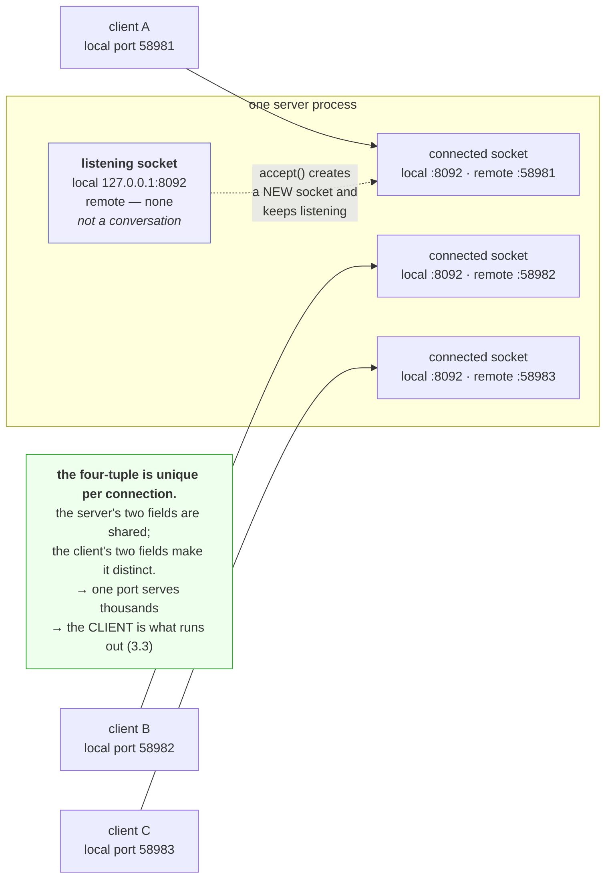

# 1.2 — The socket and the four-tuple

## One-line answer

A connection is identified by four numbers together, being the local address, the local port, the remote
address and the remote port, which is why one server port can hold ten thousand simultaneous connections
without any of them being confused for another.

---

## The story

🎬 **The scene.** A family of five shares one phone number at home. All day, calls come in for different
people.

Somebody answers, listens for a second, and says "it's for you".

😬 **The naive fix.** A visitor, told the house has one number, assumes the house can only be having one
conversation at a time and asks why they do not get more lines.

💥 **Why it fails.** They are having four conversations already. One person is on the landline in the
hall, one is on a mobile in the kitchen, and two are on video calls. **The number on the door is shared
and the conversations are not**, because each conversation is identified by who is on both ends, not by
the number that was dialled.

The visitor was counting doorways and the family was counting conversations, and those are different
things.

💡 **The insight.** A shared entrance does not mean a shared conversation. **What makes two exchanges
distinct is the full pairing of both ends**, not the thing they have in common, and a system that
identifies conversations by the shared part alone can only ever hold one.

---

## The idea in plain language

A **socket** is the operating system's handle on one end of a network conversation. It is a file
descriptor, exactly like the ones from
[Day 5, part 3.2](../../../day-005-linux-for-operators-ii/parts/03-the-disk-that-fills/3.2-the-deleted-file-that-still-costs-you-a-gigabyte.md),
and `read` and `write` work on it the same way. That is not an analogy: on Unix it is literally a file
descriptor, which is why a process's socket count and its open-file limit are the same budget.

An **established TCP connection** is identified by four values together, usually called the four-tuple.

| Field | Example | Chosen by |
| --- | --- | --- |
| local address | `127.0.0.1` | the machine's configuration |
| local port | `58972` | **the kernel**, from the ephemeral range, for a client |
| remote address | `127.0.0.1` | you, or DNS |
| remote port | `8000` | you |

**No two live connections on one machine may have the same four values.** That is the uniqueness rule, and
everything else in this part follows from it.

### Why one server port serves thousands of clients

The server's address and port are the same for every client. The **client's** address and port are not.
So ten thousand connections to `pulse` on port 8000 are ten thousand different four-tuples, differing in
the last two fields, and the kernel routes every packet to the right socket without ambiguity.

**This is why "we need more ports for more users" is a misunderstanding.** One listening port is enough
for as many connections as the machine has memory and file descriptors for. What limits concurrency is
the descriptor limit and the memory per connection, never the port count on the server side.

**The client side is a different story**, and it is the one that runs out. A client connecting repeatedly
to one destination varies only its own port, and there are about 28,000 ephemeral ports by default. Part
[3.3](../03-the-connection/3.3-time-wait-and-the-ports-you-ran-out-of.md) is what happens when they are
gone.

### Listening sockets and connected sockets are different objects

This is the distinction that makes `netstat` output readable.

A **listening socket** has a local address and port and **no remote end at all**. It is not a
conversation, it is a willingness to have one. Listings show its remote address as `0.0.0.0:0` or `*:*`,
which means "unset" rather than "everybody".

A **connected socket** has all four fields. When a client connects, the server's listening socket is not
consumed: the kernel creates a *new* socket with the full four-tuple and hands it to the program, and the
listening socket carries on listening.

**So a busy server has one listening socket and thousands of connected ones**, all sharing the same local
port, which is the fact the story is about.

---

## Why Kriya needs it

Day 8's keep-alive discussion is entirely about whether a client reuses one four-tuple for many requests
or creates a new one each time, and the cost difference is a TCP handshake per request.

Day 25 publishes a container port, which is a mapping that rewrites two of the four fields in flight, and
the reason a container sees a different remote address than the real client is exactly this.

Day 33's Kubernetes Service is an address that no machine owns, and the kernel rewrites the destination
fields on the way through. Understanding the four-tuple is what makes that comprehensible rather than
magic.

Day 44 configures horizontal scaling, where "how many connections can one replica hold" is the capacity
question, and the answer is bounded by descriptors and memory rather than by ports.

---

## The mechanism

Build both ends of one connection and print the four numbers from both sides.

```python
# days/day-007-networking-for-operators/lab/fourtuple.py
"""Open one TCP connection to ourselves and print the four-tuple from both ends."""

import socket
import threading
import time

PORT = 8091


def client() -> None:
    """Connect, print our own end and the peer's, then close."""
    time.sleep(0.3)
    conn = socket.socket(socket.AF_INET, socket.SOCK_STREAM)
    conn.connect(("127.0.0.1", PORT))
    print(f"client sees : local={conn.getsockname()}  remote={conn.getpeername()}")
    time.sleep(0.5)
    conn.close()


server = socket.socket(socket.AF_INET, socket.SOCK_STREAM)
server.setsockopt(socket.SOL_SOCKET, socket.SO_REUSEADDR, 1)
server.bind(("127.0.0.1", PORT))
server.listen(5)
print(f"listening   : local={server.getsockname()}  remote=(none — a listening socket has no peer)")

threading.Thread(target=client, daemon=True).start()
accepted, _ = server.accept()
print(f"server sees : local={accepted.getsockname()}  remote={accepted.getpeername()}")

time.sleep(0.8)
accepted.close()
server.close()
```

**Line by line:**

- `server.setsockopt(socket.SOL_SOCKET, socket.SO_REUSEADDR, 1)` sets the option the `socket(7)` manual
  page, checked on **2026-08-26**, describes as *"Indicates that the rules used in validating addresses
  supplied in a bind(2) call should allow reuse of local addresses."* **Without it, re-running this script
  within a couple of minutes fails**, for the reason in part
  [3.3](../03-the-connection/3.3-time-wait-and-the-ports-you-ran-out-of.md), and it is the single most
  copied line in network code precisely because everybody hits that first.
- `server.bind(("127.0.0.1", PORT))` claims the local address and port. **Binding is the claim, and
  listening is separate**, which the next line shows.
- `server.listen(5)` marks the socket passive. The `listen(2)` manual page, checked on **2026-08-26**,
  says it *"marks the socket referred to by sockfd as a passive socket, that is, as a socket that will be
  used to accept incoming connection requests."* The `5` is the backlog, which is part
  [3.2](../03-the-connection/3.2-the-accept-queue-and-the-backlog.md) and is deliberately left alone here.
- `server.getsockname()` returns this socket's own local end, and there is **no `getpeername()` call on
  the listening socket** because it would raise: a listening socket has no peer, and that absence is the
  thing being demonstrated.
- `threading.Thread(..., daemon=True)` runs the client alongside, because `accept` blocks and something
  has to connect. `daemon=True` means the thread does not keep the process alive on its own, which
  prevents a hung client from turning this into a script you have to kill.
- `server.accept()` returns **a new socket** plus the peer's address. **The name `accepted` rather than
  reusing `server` is deliberate**, because the whole point is that these are two different objects.
- Printing `getsockname()` and `getpeername()` from both ends is the measurement: **four numbers, seen
  twice, swapped.**

```bash
uv run python days/day-007-networking-for-operators/lab/fourtuple.py
```

**Line by line:** one command, no arguments, and it exits on its own after about a second. **Nothing needs
cleaning up afterwards**, because every socket is closed explicitly and the process ends, which is worth
noticing given how many of this curriculum's scripts so far have not been like that.

Observed on **2026-08-26**:

```text
listening   : local=('127.0.0.1', 8091)  remote=(none — a listening socket has no peer)
client sees : local=('127.0.0.1', 58972)  remote=('127.0.0.1', 8091)
server sees : local=('127.0.0.1', 8091)  remote=('127.0.0.1', 58972)
```

**Read the last two lines against each other.** They are the same four numbers with local and remote
exchanged, which is what "both ends of one conversation" means literally.

**`58972` is the interesting number.** Nothing in the script chose it. The kernel allocated it from the
ephemeral range when `connect` was called, and it exists purely to make this connection distinguishable
from every other connection to port 8091. **Run the script again and it will be a different number**,
which is the clearest possible demonstration that the client port carries no meaning of its own.

**And the listening socket is still there.** It has no peer, it was not consumed by the connection, and it
would accept another one immediately.

### Many connections, one server port

```python
# days/day-007-networking-for-operators/lab/many.py
"""Open several connections to one server port and show that each gets its own local port."""

import socket
import threading
import time

PORT = 8092
HOW_MANY = 5

server = socket.socket(socket.AF_INET, socket.SOCK_STREAM)
server.setsockopt(socket.SOL_SOCKET, socket.SO_REUSEADDR, 1)
server.bind(("127.0.0.1", PORT))
server.listen(16)

accepted: list[socket.socket] = []


def accept_loop() -> None:
    """Accept everything that arrives and keep each socket open."""
    for _ in range(HOW_MANY):
        conn, _peer = server.accept()
        accepted.append(conn)


threading.Thread(target=accept_loop, daemon=True).start()

clients = []
for _ in range(HOW_MANY):
    sock = socket.socket(socket.AF_INET, socket.SOCK_STREAM)
    sock.connect(("127.0.0.1", PORT))
    clients.append(sock)

time.sleep(0.5)
print(f"one listening socket on port {PORT}, and {len(accepted)} connected sockets:")
for conn in accepted:
    print(f"  server local={conn.getsockname()}  <- client {conn.getpeername()}")

for sock in clients + accepted:
    sock.close()
server.close()
```

**Line by line:**

- `server.listen(16)` gives a backlog comfortably larger than the five connections, so that the queue
  never fills and this measures the four-tuple rather than the backlog.
- `accepted: list[socket.socket] = []` holds every accepted socket. **Keeping them is essential**, because
  a socket that goes out of scope is closed by garbage collection and the connection would disappear
  before it could be printed.
- The accept loop runs in a thread while the main thread connects, because both sides of five connections
  cannot be driven from one sequential flow.
- `_peer` with a leading underscore marks a value deliberately discarded, since `getpeername()` on the
  accepted socket gives the same information more clearly.
- Closing **both lists** at the end matters: five client sockets and five server sockets is ten
  descriptors, and leaking them is how a long-running process reaches its open-file limit.

Observed on **2026-08-26**:

```text
one listening socket on port 8092, and 5 connected sockets:
  server local=('127.0.0.1', 8092)  <- client ('127.0.0.1', 52357)
  server local=('127.0.0.1', 8092)  <- client ('127.0.0.1', 52358)
  server local=('127.0.0.1', 8092)  <- client ('127.0.0.1', 52359)
  server local=('127.0.0.1', 8092)  <- client ('127.0.0.1', 52360)
  server local=('127.0.0.1', 8092)  <- client ('127.0.0.1', 52361)
```

**Five connections, one server port, five distinct client ports.** The left column is identical on every
row and the right column is unique on every row, and that is the entire uniqueness rule made visible.



---

## When it breaks

**`Too many open files` on a busy server.** The descriptor budget, not the port budget.

```text
$ tail -2 /var/log/pulse/app.log
ERROR:    error while accepting connection: [Errno 24] Too many open files
$ ls /proc/41220/fd | wc -l
1024
```

**What it says:** errno 24, and the process holds exactly 1024 descriptors.

**What it actually means:** every connection is a file descriptor, and this process hit its limit. **The
port count is irrelevant** and there is nothing wrong with the network: this is the same resource that
Day 5's open files consumed, being spent on sockets instead.

**The smallest fix:** raise the limit, with `ulimit -n` for a shell or `LimitNOFILE` in a systemd unit.

**The real question to ask first:** are these connections that should have been closed? A descriptor
count that only ever rises is a leak, and raising the limit converts a fast failure into a slow one.
**Check whether the count plateaus under steady load before raising anything**, which is the same
discriminator as the memory version in
[Day 6, part 1.2](../../../day-006-resources-and-the-oom-killer/parts/01-memory/1.2-rss-vss-and-shared-pages.md).

**The server sees every client as the same address.** A proxy, working correctly.

```text
$ tail -2 /var/log/pulse/access.log
127.0.0.1:41022 - "GET /predict HTTP/1.1" 200
127.0.0.1:41023 - "GET /predict HTTP/1.1" 200
```

That is with real users on the public internet.

**What it says:** every request appears to come from the local machine.

**What it actually means:** something in front of `pulse` terminated the client's connection and made its
own, so **the four-tuple `pulse` sees is the proxy's, not the user's.** The client's real address is not
lost, but it is now in an HTTP header rather than in the connection, which is Day 8's subject.

**The smallest fix:** read the forwarded-for header instead, and configure the server to trust it **only
from known proxy addresses**, because a header is client-supplied data and trusting it from anywhere lets
anybody claim any address.

**Why this matters beyond logging:** rate limiting by connection address stops working entirely behind a
proxy, since every request has the same source. That is a security control silently reduced to nothing,
and it is worth checking rather than assuming.

**Connections in `netstat` that no process owns.** Sockets outliving their program.

```text
  TCP    127.0.0.1:8000         127.0.0.1:58991        TIME_WAIT       0
```

**What it says:** a connection with process id 0.

**What it actually means:** the program has exited and the kernel is still holding the connection's
identity so that late packets are not misdelivered. This is the `TIME_WAIT` state, and it is the kernel's
bookkeeping rather than a leak. Part
[3.3](../03-the-connection/3.3-time-wait-and-the-ports-you-ran-out-of.md) is entirely about it.

**Worth knowing now:** a `netstat` listing full of `TIME_WAIT` entries alarms people who assume every line
is a live connection using resources. Most of them are memories of connections, and the state column is
what tells you which is which.

**`getpeername()` raising on a socket you just created.** The listening-socket distinction, as an error.

```text
Traceback (most recent call last):
  File "probe.py", line 8, in <module>
    print(server.getpeername())
OSError: [WinError 10057] A request to send or receive data was disallowed because the socket is not
connected and (when sending on a datagram socket using a sendto call) no address was supplied
```

**What it says:** the socket is not connected.

**What it actually means:** you called `getpeername()` on a **listening** socket, which by definition has
no peer. On Linux the same call raises `OSError: [Errno 107] Transport endpoint is not connected`.

**The smallest fix:** call it on the socket that `accept()` returned, not on the one you called `listen()`
on. **The error is precise and the confusion is conceptual**, which is why this part separates the two
objects so insistently.

---

## In production

**What a professional writes instead of the teaching version.** They never write raw socket code for an
application. The value of having written it once is that every higher-level abstraction stops being
mysterious: a connection pool is a collection of four-tuples held open, a load balancer is a thing that
terminates one four-tuple and originates another, and a "connection leak" is a set of descriptors nobody
closed. **The socket layer is the vocabulary the higher layers are described in**, and a person who has
never seen it reads those descriptions as jargon.

**What degrades at scale.** The bookkeeping. One machine with ten thousand connections holds ten thousand
socket structures in kernel memory plus whatever the application attaches to each, and the per-connection
memory becomes the capacity limit long before anything about ports does. **This is why connection counts
appear on capacity dashboards and port counts do not**, and why a service that holds connections open
idly, which is what a poorly configured keep-alive does, costs memory for nothing.

**The failure that only shows with real traffic.** Descriptor exhaustion under a burst. At steady load the
descriptor count is comfortable, and during a burst it is concurrency times connections-per-request, which
can be several times higher. **The limit is hit at the peak, connections start failing to be accepted, and
the errors look like a network problem** while the network is fine. The discriminator is that the errno is
24 rather than anything network-related, and the fix is a limit chosen from peak concurrency rather than
from average.

**The review comment a senior engineer leaves.** *"We are rate limiting on the connection's source
address, but every request comes through the ingress so they all share one. That control has been doing
nothing since the day we put a proxy in front, and the dashboard showing zero rate-limit rejections is
consistent both with 'nobody is abusing us' and with 'the limiter cannot see anybody'. Use the forwarded
header, and only trust it from the ingress's own addresses."*

**The signal you would alert on.** **Open file descriptors as a fraction of the limit**, which catches
descriptor exhaustion before it happens rather than after, and is one cheap read of `/proc/<pid>/fd`.
Secondarily, **established connection count per instance**, as a gauge, because a count that rises without
matching traffic is a leak and a count that collapses is a client going away. You would **not** alert on
the number of sockets in `TIME_WAIT`, which is normal and often large, nor on port usage as such, because
the server side cannot exhaust ports and the client side's exhaustion shows up as a bind error that is
worth alerting on directly.

**Blast radius.** This part opens sockets on the loopback address and closes them. The worst case is
leaving the script running and holding ten descriptors and a bound port, which prevents the next run from
binding and produces the confusing error that part [1.4](1.4-the-port-that-was-already-in-use.md) is
about. Anybody running the script can trigger it. What bounds it is that both scripts close every socket
explicitly and exit on their own. **The wider capability worth naming is that binding a port is exclusive**,
so an experiment that does not clean up denies that port to everything else until the process ends.

**Cost.** `0` model calls, `0` tokens, `0` CI minutes, `0` disk. **Network: ten loopback connections that
never leave the machine.** RAM is a few kilobytes of kernel socket structures. Every one of the ten
descriptors is closed by the script, and confirming that is one `netstat` away.

**The interview question.** *"How can one server port handle ten thousand simultaneous connections?"* The
answer that lands names the identifier: *"Because a connection is identified by four values together, the
local address and port and the remote address and port, not by the port alone. The server's two fields are
the same for everybody and the client's two are different for every connection, so ten thousand
conversations on port 443 are ten thousand distinct four-tuples and the kernel routes every packet
unambiguously. What actually limits concurrency is file descriptors and memory per connection, because
each connection is an open descriptor. The side that can genuinely run out of ports is the client, when
one machine makes many short-lived connections to a single destination, because then only its own
ephemeral port varies and there are about twenty-eight thousand of those."*

---

## Check yourself

```bash
uv run python days/day-007-networking-for-operators/lab/fourtuple.py && uv run python days/day-007-networking-for-operators/lab/fourtuple.py
```

The same script twice. **Three of the four numbers are identical across both runs and one is not.** The
one that changes is the client's ephemeral port, chosen by the kernel, meaningless on its own, and the
only reason two otherwise identical conversations can coexist.

**Say out loud, without scrolling up:** *a server has one listening socket on port 443 and eight thousand
established connections. Say how many of those sockets share a local port, what makes each connection
distinguishable, and which resource actually runs out first.*
