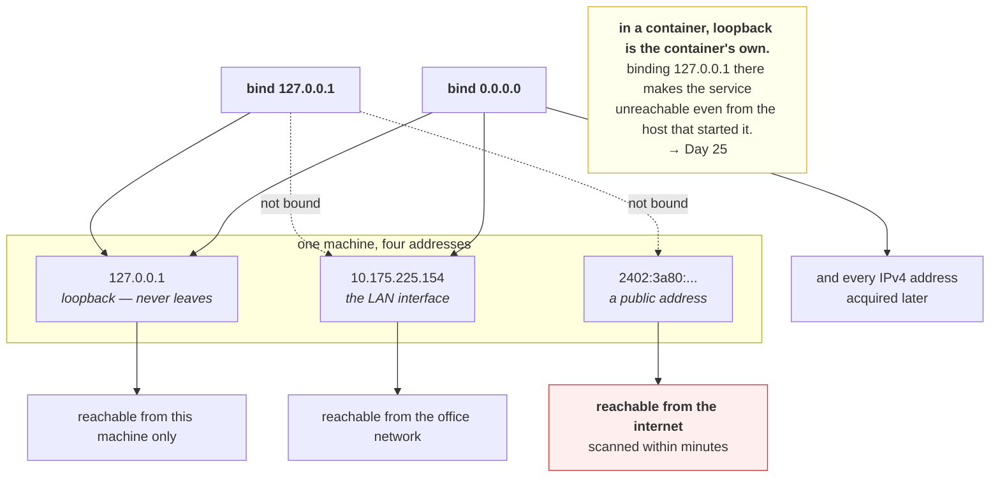

# 1.3 — Binding `127.0.0.1` versus `0.0.0.0`

## One-line answer

The address a server binds to decides **who can reach it**, so `127.0.0.1` means "only this machine" and
`0.0.0.0` means "any network this machine is on", and choosing the wrong one produces either a service
nobody can reach or a service everybody can.

---

## The story

🎬 **The scene.** A woman runs a small business from home. She has a desk in the back room and a sign in
the front window.

For the first year there is no sign. Customers are people she already knows, who phone first. It works
perfectly and nobody random ever knocks.

😬 **The naive fix.** Business is slow, so she puts a large sign on the street. More customers arrive,
which is what she wanted.

💥 **Why it fails.** The sign does not distinguish between customers and everybody else. Within a month
she has people knocking to sell things, people asking to use the toilet, and somebody trying the door
handle at eleven at night. **She did not open the business to more customers. She opened the house to the
street**, and those turned out to be the same action.

💡 **The insight.** Reachability is not a property of the thing you are offering. It is a property of
where you put the door, and **widening it admits everything, not just the traffic you had in mind.** The
decision looks like a convenience setting and is actually a security boundary.

---

## The idea in plain language

A machine usually has more than one address. This one has four.

| Address | Called | Reaches |
| --- | --- | --- |
| `127.0.0.1` | loopback | **only this machine.** Packets never touch a network card |
| `10.175.225.154` | the LAN address | this machine, from other machines on the same network |
| `2402:3a80:...` | a public IPv6 address | this machine, potentially from anywhere |
| `::1` | IPv6 loopback | only this machine, over IPv6 |

**When a server binds, it picks which of these it will answer on.** That is what the `--host` argument to
`uvicorn` is, and it is not a formality.

| Bind to | Means |
| --- | --- |
| `127.0.0.1` | **loopback only.** Nothing outside this machine can reach it, whatever the firewall says |
| `10.175.225.154` | that one interface only |
| `0.0.0.0` | **every IPv4 address this machine has**, including ones it acquires later |
| `::` | every IPv6 address, and on many systems every IPv4 one too |

**`0.0.0.0` is not an address.** It is a wildcard meaning "all of them", which is why it appears in the
`Local Address` column of `netstat` output for most system services and why part
[1.1](1.1-an-address-and-a-port-are-two-questions.md) showed `0.0.0.0:135` there.

### Why the default matters so much

Development tools default to `127.0.0.1` because a service you are writing should not be exposed to a
coffee shop network by accident. Container images default to `0.0.0.0` because a container's loopback is
private to that container, so binding loopback inside a container makes the service unreachable **even
from the host that started it.**

**So the same setting is right in one place and wrong in the other**, and moving code from a laptop to a
container is exactly the moment it changes. Day 25 is where you make that change deliberately rather than
by copying an error message into a search engine.

### The one that is genuinely dangerous

Binding `0.0.0.0` on a machine with a public address puts the service on the internet. Not "makes it
available to the team". On the internet, where it will be found: automated scanning finds a newly exposed
port in minutes, not days.

**Binding is not the only control** — a firewall, a security group or a network policy can still refuse
the packet — but it is the one control that is entirely in your program's hands, and the one that is
still there when somebody else's firewall rule changes. **Bind narrowly and let the network widen it, not
the other way round.**

---

## Why Kriya needs it

Day 25 runs `pulse` in a container and it must bind `0.0.0.0` to be reachable at all, for the reason
above. That is the day this part exists for, and getting it wrong there produces a container that starts
successfully and refuses every connection.

Day 26 adds a container health check, which connects from inside the container, so it works against
loopback while the outside world cannot reach the service. **A health check passing is not evidence that
the bind address is right.**

Day 36 gives `pulse` a Kubernetes Service, whose whole job is to route to a pod's address, and a pod that
bound loopback is a pod that is `Running`, `Ready` and unreachable.

Day 58 mounts secrets and Day 211 writes admission policy, both of which treat "what is exposed" as a
reviewable property rather than an accident.

---

## The mechanism

Bind two servers, one narrowly and one widely, and try to reach both from two directions.

First, find out what addresses this machine actually has.

```bash
python -c "
import socket
for family, _t, _p, _c, sockaddr in socket.getaddrinfo(socket.gethostname(), None):
    print(f'{family.name:<9} {sockaddr[0]}')
"
```

**Line by line:**

- `socket.getaddrinfo(socket.gethostname(), None)` asks the resolver for every address this machine's own
  name maps to. **`None` as the port means "no particular service"**, which returns addresses without
  filtering by protocol.
- `family.name` prints `AF_INET` for IPv4 and `AF_INET6` for IPv6, so the two are visibly separated
  rather than distinguished by whether the string has colons in it.
- `sockaddr[0]` is the address itself, because the tuple also carries a port, a flow label and a scope id
  that are not the point here.

Observed on **2026-08-26**, and **yours will differ**:

```text
AF_INET6  fe80::52e9:157f:6db1:7e96
AF_INET6  2402:3a80:43aa:9010:6db3:4c49:2bca:c6d4
AF_INET6  2402:3a80:43aa:9010:71cc:db1b:7be7:b1e6
AF_INET   10.175.225.154
```

**Four addresses, and `127.0.0.1` is not among them**, because loopback is not tied to the machine's name.
`10.175.225.154` is the LAN address, and it is the one that makes this experiment meaningful: it is a real
address that other machines could use.

### The experiment

```python
# days/day-007-networking-for-operators/lab/bindwhere.py
"""Bind two servers - one to loopback, one to every address - and probe both from both directions."""

import socket
import threading
import time

LAN = "10.175.225.154"  # TODO(me): replace with YOUR AF_INET address from the command above


def serve(bind_addr: str, port: int) -> None:
    """Accept and immediately close, forever. The point is that it answers at all."""
    server = socket.socket(socket.AF_INET, socket.SOCK_STREAM)
    server.setsockopt(socket.SOL_SOCKET, socket.SO_REUSEADDR, 1)
    server.bind((bind_addr, port))
    server.listen(4)
    while True:
        try:
            conn, _peer = server.accept()
            conn.close()
        except OSError:
            return


def try_connect(addr: str, port: int, timeout: float = 2.0) -> str:
    """One connection attempt, reported as a short string."""
    sock = socket.socket(socket.AF_INET, socket.SOCK_STREAM)
    sock.settimeout(timeout)
    try:
        sock.connect((addr, port))
        return "CONNECTED"
    except OSError as exc:
        return f"{type(exc).__name__} errno={exc.errno}"
    finally:
        sock.close()


for bind_addr, port in (("127.0.0.1", 8101), ("0.0.0.0", 8102)):
    threading.Thread(target=serve, args=(bind_addr, port), daemon=True).start()
time.sleep(0.5)

for bind_addr, port in (("127.0.0.1", 8101), ("0.0.0.0", 8102)):
    print(f"bound to {bind_addr}:{port}")
    print(f"   via 127.0.0.1  -> {try_connect('127.0.0.1', port)}")
    print(f"   via {LAN} -> {try_connect(LAN, port)}")
```

**Line by line:**

- `LAN = "10.175.225.154"` carries a `TODO(me)` because **this value is specific to one machine on one
  network** and will be wrong on yours, and probably wrong on this one tomorrow. Hard-coding it with a
  visible marker is more honest than deriving it silently and having the experiment quietly measure
  nothing.
- Two servers on **two different ports** so that both can run at once and be compared in one output. Using
  one port would mean running the script twice and trusting your memory of the first half.
- `while True` with `except OSError: return` in `serve` is the accept loop's exit condition: when the
  process ends the socket is closed and `accept` raises, and returning quietly is correct here because the
  thread is a daemon and the failure is the intended shutdown rather than an error worth surfacing.
- `conn.close()` immediately after accepting, because **this experiment measures reachability, not
  conversation.** Whether a connection is possible is the entire question.
- `try_connect` returns a string rather than raising, so that four probes produce four readable lines
  instead of stopping at the first failure.
- `finally: sock.close()` on every path, including the successful one, because a leaked descriptor per
  probe is exactly the leak described in
  [1.2](1.2-the-socket-and-the-four-tuple.md)'s *When it breaks*.

```bash
uv run python days/day-007-networking-for-operators/lab/bindwhere.py
```

**Line by line:** **edit the `LAN` line first**, or this measures nothing. The script binds two ports,
makes four connections and exits, and the two server threads die with the process because they are
daemons, so there is nothing to stop afterwards.

Observed on **2026-08-26**:

```text
bound to 127.0.0.1:8101
   via 127.0.0.1  -> CONNECTED
   via 10.175.225.154 -> TimeoutError errno=None
bound to 0.0.0.0:8102
   via 127.0.0.1  -> CONNECTED
   via 10.175.225.154 -> CONNECTED
```

**Four probes, and one of them fails.** The server bound to `127.0.0.1` is reachable through loopback and
not through the machine's own LAN address, **even though both probes came from this same machine.** The
server bound to `0.0.0.0` is reachable through both.

**That third line is the whole part.** The client and server are the same machine, the same process, and
the same script. The only thing that differed was which address the client dialled, and the bind address
decided the outcome.

⚠️ **`TimeoutError` rather than a refusal is a firewall.** A packet arriving on the LAN interface for port
8101 finds nothing bound to that interface, so the kernel would normally refuse it, and Windows Defender
Firewall dropped it silently instead. **On a Linux machine with no firewall this line reads
`ConnectionRefusedError errno=111`.** The distinction is exactly the one from part
[1.1](1.1-an-address-and-a-port-are-two-questions.md), and seeing both on the same day is worth the two
seconds it costs.



---

## When it breaks

**A container that starts perfectly and refuses every connection.** The single commonest containerisation
error.

```text
$ docker run -p 8000:8000 pulse:latest
INFO:     Uvicorn running on http://127.0.0.1:8000 (Press CTRL+C to quit)
$ curl -sS http://localhost:8000/healthz
curl: (56) Recv failure: Connection reset by peer
```

**What it says:** the server is running, and the connection is reset.

**What it actually means:** the server bound the **container's** loopback. `-p 8000:8000` forwards
traffic to the container's IP address, not to its loopback, so the forwarded packet arrives at an
interface nothing is listening on.

**The smallest fix:** `--host 0.0.0.0`. **And read the startup line as the diagnosis**, because
`Uvicorn running on http://127.0.0.1:8000` is the server telling you, correctly and in advance, exactly
what is wrong.

**Why this is safe to do inside a container and not on a laptop:** the container's `0.0.0.0` covers only
the container's own interfaces, and what the outside world can reach is decided separately by the `-p`
mapping. **The container is the boundary**, so binding widely inside it is the correct default rather
than a relaxation.

**A service exposed to the internet by a one-word change.** The dangerous direction.

```text
$ netstat -ano | grep 8000
  TCP    0.0.0.0:8000           0.0.0.0:0              LISTENING       41220
$ tail -3 /var/log/pulse/access.log
185.191.171.12 - "GET /.env HTTP/1.1" 404
185.191.171.12 - "GET /admin/config.php HTTP/1.1" 404
89.248.165.44  - "GET /actuator/health HTTP/1.1" 404
```

**What it says:** the service is bound to every address, and strangers are probing it.

**What it actually means:** it is on the public internet and has been found. **Those three paths are
scanners looking for a leaked environment file, an unprotected admin panel and an unauthenticated metrics
endpoint** — the same `.env` that Day 9 creates and
[Day 0](../../../day-000-toolchain-skeleton-driver/LESSON.md) put in `.gitignore` before it existed.

**The smallest fix:** bind loopback and reach it through a tunnel, or put it behind something that
authenticates.

**The lesson worth carrying:** the 404s are the good outcome, and they are only 404s because those files
do not exist. **The scan happens regardless of whether you are ready for it**, so "we will secure it
before anyone finds it" is not a plan, because finding it is automated and takes minutes.

**A health check that passes while nothing can reach the service.** The false green.

```text
$ docker inspect pulse --format '{{.State.Health.Status}}'
healthy
$ curl -sS -m 3 http://localhost:8000/healthz
curl: (56) Recv failure: Connection reset by peer
```

**What it says:** healthy, and unreachable.

**What it actually means:** the health check runs **inside** the container and connects to loopback, where
the service is listening. It is telling the truth about the process and nothing about reachability.

**The smallest fix:** bind `0.0.0.0`.

**The design point, which outlives this bug:** a health check that shares the failure it is supposed to
detect cannot detect it. This is the same shape as
[Day 6, part 4.3](../../../day-006-resources-and-the-oom-killer/parts/04-the-oom-killer/4.3-oom-killing-pulse-on-purpose.md),
where the process could not log its own death, and it is why Day 41 distinguishes what a probe proves from
what it is assumed to prove.

**`Cannot assign requested address` binding a specific address.** The address that is not here.

```text
$ uv run uvicorn pulse.api:app --host 10.0.0.55 --port 8000
ERROR:    [Errno 99] error while attempting to bind on address ('10.0.0.55', 8000): cannot assign
requested address
```

**What it says:** errno 99, cannot assign.

**What it actually means:** you may only bind an address **this machine actually has**. `10.0.0.55` belongs
to some other machine, or to none.

**The smallest fix:** list the machine's addresses, as the mechanism above does, and bind one of those or
use `0.0.0.0`.

**Where this bites in practice:** a machine that gets its address from DHCP after the service starts. The
address does not exist at bind time and the service fails to start, which is why `0.0.0.0` is the right
answer for anything that must survive a reboot in an unpredictable order.

---

## In production

**What a professional writes instead of the teaching version.** They make the bind address configuration
rather than a literal, defaulting to loopback, so that the safe value is what you get when nobody thinks
about it and the wide value is a deliberate act recorded in a config file. Inside a container they bind
`0.0.0.0` without hesitation, because the container is the boundary and the published port is the
control. **The rule they follow is that the narrower control should be the one that fails closed**, and
between "the code binds loopback" and "a firewall rule blocks the port", the code is the one that travels
with the service.

**What degrades at scale.** The number of places exposure is decided. On one machine it is one flag. In a
cluster it is the bind address, plus the Service type, plus the ingress, plus a network policy, plus a
cloud firewall, and a service is reachable if **any** path through that stack is open. **The failure mode
is a service that somebody believes is internal because one of those five layers says so**, while another
was changed last quarter. This is why Day 211's admission policy checks exposure as a property rather than
trusting each team's intent.

**The failure that only shows with real traffic.** Nothing about binding is load-dependent, and that is
worth saying plainly rather than inventing a story. **The failure this part causes shows up on the first
request from the first client that is not you**, which in a container is immediately and on a laptop may
be weeks later when a colleague tries. The reason it survives so long is that every test the author runs
comes from the same machine, where loopback works.

**The review comment a senior engineer leaves.** *"`--host 0.0.0.0` is hard-coded in the entrypoint. That
is right for the container and it also means that if anyone runs this on a bare VM for debugging, it is on
the internet from the moment it starts. Make it an environment variable defaulting to `127.0.0.1`, and set
it explicitly in the container image where we know the boundary is the published port."*

**The signal you would alert on.** Not a runtime metric, because a bind address does not change while a
process runs. This belongs in the pipeline and in periodic audit: **a check that no service binds a
wildcard address outside a container**, and **an external scan of your own public addresses** comparing
open ports against an expected list, where the correct answer is a fixed set and anything else is a
finding. At runtime the closest useful signal is **requests from source addresses outside your expected
ranges**, which is how you learn you are exposed before the scanners learn it. You would **not** alert on
the bind address itself, which is configuration to review rather than state to page on.

**Blast radius.** ⚠️ **This part is the first in the curriculum whose blast radius is other people's
machines.** The worst case is binding `0.0.0.0` on a machine with a public address and leaving it, which
puts an unauthenticated service on the internet within minutes, and the consequence is not a lesson but a
disclosure. Anybody who types `--host 0.0.0.0` can trigger it. What bounds it today is that the experiment
binds ports 8101 and 8102, connects to them only from this machine, and the process exits when the script
does. **What bounds it in general is defaulting to loopback and treating the wildcard as a decision that
gets written down.** Before running anything that binds widely, know whether the machine you are on has a
public address, which the mechanism's first command answers.

**Cost.** `0` model calls, `0` tokens, `0` CI minutes, `0` disk, negligible RAM. **Network: four
connections, all originating and terminating on this machine.** The LAN probe leaves the loopback
interface and comes back through the network stack without reaching another device.

**The interview question.** *"What is the difference between binding `127.0.0.1` and `0.0.0.0`, and which
would you use?"* The answer that lands separates the two contexts: *"`127.0.0.1` binds the loopback
interface, so only that machine can reach it and no firewall change can expose it. `0.0.0.0` is a wildcard
for every IPv4 address the machine has, including ones it gets later, so on a host with a public address
that puts the service on the internet, and automated scanners find a new open port in minutes. On a laptop
or a bare VM I default to loopback and reach it through a tunnel. Inside a container I bind `0.0.0.0`
without hesitation, because the container's loopback is private to the container, so binding it there
makes the service unreachable even from the host, and what the outside world can reach is decided by the
published port instead. The general rule I follow is bind narrowly and let the network widen it, because
the bind address is the one control that travels with the service."*

---

## Check yourself

```bash
uv run python days/day-007-networking-for-operators/lab/bindwhere.py
```

Four probes against two servers. **Exactly one line should fail**, and it should be the LAN probe against
the loopback-bound server. If all four connect, you replaced `LAN` with `127.0.0.1` and the experiment
measured nothing; if three fail, a firewall is blocking the LAN interface entirely, which is itself worth
knowing before Day 25.

**Say out loud, without scrolling up:** *your container starts, logs "Uvicorn running on
http://127.0.0.1:8000", and every request from the host is reset. Say what is wrong in one sentence, and
say why the same setting is correct on your laptop.*
