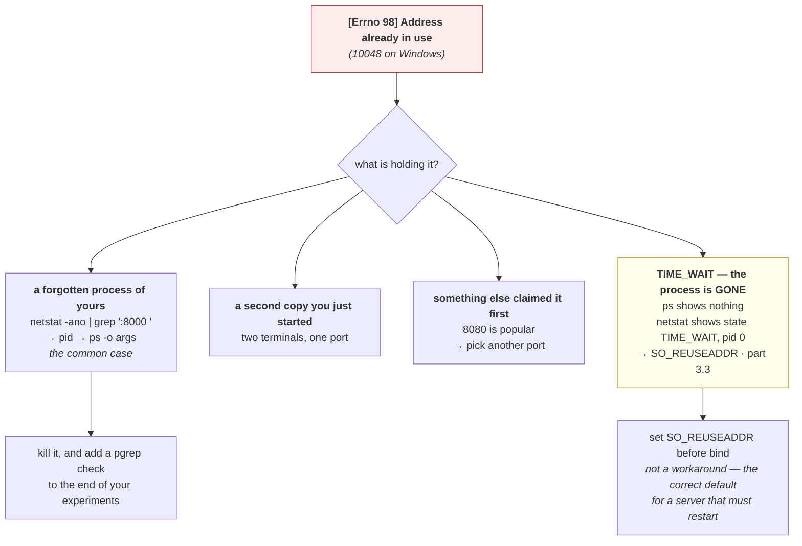

# 1.4 — The port that was already in use

## One-line answer

Today's first deliberate failure: bind a port twice, read the error, and discover that it names the port
and never the process holding it, which is why "address already in use" costs people ten minutes every
time instead of ten seconds.

---

## The story

🎬 **The scene.** A shared flat with one washing machine. Somebody puts a load on at nine in the morning
and goes out.

At eleven, a flatmate comes down with a basket, finds the door locked shut mid-cycle, and cannot start
anything.

😬 **The naive fix.** She waits. Then she waits some more. Then she assumes the machine is broken and
looks up repair numbers.

💥 **Why it fails.** The machine is fine and there is a load in it. **The machine cannot tell her whose
load it is, when it went in, or when it will finish** — it just refuses to open. So she spends forty
minutes on the wrong problem, when the actual question was "who put this on and are they coming back",
which nothing in the situation answers and one message to the group chat would have.

💡 **The insight.** A resource that can only be held by one user at a time will tell you it is busy, and
**almost never tells you who is holding it.** The gap between "it is occupied" and "here is who is
occupying it" is where the time goes, and closing that gap is a habit rather than a tool.

---

## The idea in plain language

A TCP port on one address may be bound by one socket at a time. When a second program tries, the bind
fails, and the `listen(2)` manual page, checked on **2026-08-26**, lists the error as **`EADDRINUSE`**,
described as *"Another socket already listens on the same port, or all ephemeral ports are in use."*

**Note that the manual page gives two causes for one error**, and they are completely different problems.
The first is the everyday one this part is about. The second is client-side port exhaustion, which is part
[3.3](../03-the-connection/3.3-time-wait-and-the-ports-you-ran-out-of.md), and it is a genuinely nasty
surprise that the same errno covers both.

### The four things that produce it

**A forgotten process from your last experiment.** By far the most common, and the reason every day in
this curriculum ends with a `pgrep` check.

**A second copy of the same service.** Two terminals, two `uvicorn` commands, one port.

**Something else on the machine that claimed the port first.** Ports in the registered range are claimed
by convention, and conventions collide. 8080 is claimed by a great many things.

**A socket in `TIME_WAIT` from a process that has already exited.** The confusing one, because
`ps` shows nothing and the port is still unavailable. `SO_REUSEADDR` exists for exactly this and part
[3.3](../03-the-connection/3.3-time-wait-and-the-ports-you-ran-out-of.md) explains why.

### Why the error cannot name the culprit

The kernel knows perfectly well which socket holds the port. It does not tell you, because the program
receiving the error has no right to know what other programs on the machine are doing — that is
information about another user's processes, and leaking it through a routine error would be an
information disclosure.

**So the error is deliberately unhelpful**, and the fix is a second command rather than a better message.

---

## Why Kriya needs it

Day 25 runs `pulse` in a container while `pulse` may still be running on the host, on the same port. That
collision is the first thing that happens on that day for most people.

Day 30's failure lab includes a container that will not start, and a port collision with something on the
host is one of the causes.

Day 61 starts Prometheus on 9090 and Grafana on 3000, and Day 71 adds a collector, each claiming ports on
a machine that already has a service and a database. Addendum 02 §4's profiles exist partly because of
memory and partly because of exactly this.

Day 84's incident lab hands you a service that will not start, and reading `EADDRINUSE` correctly is the
difference between a minute and an afternoon.

---

## The mechanism

**This is a deliberate failure.** Produce it, read it, and then find the culprit.

```python
# days/day-007-networking-for-operators/lab/bindtwice.py
"""Bind a port, then bind it again, and print the second error exactly as the kernel gives it."""

import socket

PORT = 8092

first = socket.socket(socket.AF_INET, socket.SOCK_STREAM)
first.bind(("127.0.0.1", PORT))
first.listen(1)
print(f"first bind ok : {first.getsockname()}")

second = socket.socket(socket.AF_INET, socket.SOCK_STREAM)
try:
    second.bind(("127.0.0.1", PORT))
    print("second bind ok — this should not happen")
except OSError as exc:
    print(f"second bind   : {type(exc).__name__}: [Errno {exc.errno}] {exc.strerror}")
finally:
    second.close()

first.close()
```

**Line by line:**

- **No `SO_REUSEADDR` anywhere in this script.** That is deliberate: the option is the fix, and setting it
  here would prevent the failure this part exists to show. Both other scripts in this section set it, and
  this one does not, and the contrast is the teaching.
- `first.listen(1)` is needed because a socket that is bound but not listening still holds the port on
  most systems, but making it listen removes any ambiguity about whether the port is genuinely claimed.
- `except OSError as exc` prints **three things**: the exception class, the numeric errno, and the
  operating system's message. **The errno is the portable part** and the message is not, which the
  observed output makes obvious.
- `finally: second.close()` runs even though the bind failed, because the socket object was created
  successfully and holds a descriptor whether or not it was ever bound.

```bash
uv run python days/day-007-networking-for-operators/lab/bindtwice.py
```

**Line by line:** the script is expected to print an error and exit zero, because **the failure is the
result rather than a fault**. If it prints "second bind ok", your platform allowed the duplicate bind,
which means something set `SO_REUSEPORT` by default and the rest of this part reads differently for you.

Observed on **2026-08-26**:

```text
first bind ok : ('127.0.0.1', 8092)
second bind   : OSError: [Errno 10048] Only one usage of each socket address (protocol/network address/port) is normally permitted
```

**Errno 10048 is Windows' `EADDRINUSE`.** On Linux the identical condition prints:

```text
second bind   : OSError: [Errno 98] Address already in use
```

**Two numbers, two messages, one condition.** This is why operators learn the errno rather than the
sentence: `98` and `10048` are searchable and unambiguous, and "only one usage of each socket address" is
neither.

**And notice what the error does not contain.** It does not say which process. It does not say since when.
It names the thing you already knew — the port you just asked for — and stops.

### Finding the culprit

```bash
netstat -ano 2>/dev/null | grep -E ':8000\s' || echo "nothing on 8000"
```

**Line by line:**

- `grep -E ':8000\s'` matches the port **followed by whitespace**, which is the detail that matters.
  A bare `grep 8000` also matches `18000`, `80001` and any client whose ephemeral port happens to contain
  those digits, and on a busy machine that is a screen of noise.
- `-a -n -o` from part [1.1](1.1-an-address-and-a-port-are-two-questions.md), where `-o` is the flag that
  makes this useful, because **it prints the owning process id.**

With `pulse` running, observed on **2026-08-26**:

```text
  TCP    127.0.0.1:8000         0.0.0.0:0              LISTENING       41220
```

**`41220` is the answer**, and it is the only new information in the whole exercise. Now name it:

```bash
ps -o pid,args -p 41220 2>/dev/null || tasklist //FI "PID eq 41220" 2>/dev/null
```

**Line by line:** `ps -o pid,args` prints the command line, which is what tells you whether this is your
forgotten experiment or something you need. The `||` fallback to `tasklist` covers Windows, where
`//FI` is a filter and **the doubled slash is Git Bash's escape** so that the path-conversion layer does
not turn `/FI` into a file path, which is a Windows-specific trap worth meeting once.

```text
    PID COMMAND
  41220 python .venv/Scripts/uvicorn pulse.api:app --host 127.0.0.1 --port 8000
```

**Now you know.** It is a `uvicorn` from an earlier experiment, it is yours, and it can be stopped.

**On Linux there is a single command that does all of this**, and it is worth knowing even though it is
not installed here:

```bash
# 🅿️ PARKED until Day 21 (WSL2) — ss is not installed on this machine.
# ss -ltnp 'sport = :8000'
```

**Line by line:** `-l` listening, `-t` TCP, `-n` numeric, `-p` process, and the filter expression
`sport = :8000` means source port equals 8000. **This is one command instead of two** and it prints the
process name and pid directly next to the socket.



---

## When it breaks

**`Address already in use` and `ps` shows nothing.** The one that wastes the most time.

```text
$ uv run uvicorn pulse.api:app --port 8000
ERROR:    [Errno 98] error while attempting to bind on address ('127.0.0.1', 8000): address already in use
$ pgrep -af uvicorn
$ echo $?
1
```

**What it says:** the port is taken, and no `uvicorn` is running.

**What it actually means:** almost certainly a socket in `TIME_WAIT` left by the previous run, which the
kernel holds for a couple of minutes after the process exits so that late packets from the old connection
are not delivered to a new one. **`netstat` shows it with a process id of 0**, because there is no process.

**The smallest fix:** wait, or set `SO_REUSEADDR` before binding, which is what every production server
does and what part [3.3](../03-the-connection/3.3-time-wait-and-the-ports-you-ran-out-of.md) explains in
full.

**Why waiting is the wrong habit:** a service that cannot restart immediately after stopping is a service
whose deploys are two minutes slower than they need to be, and whose crash recovery has a built-in delay
at exactly the moment you want it back.

**A container that will not start, on a machine where the port is free.** The mapping, not the port.

```text
$ docker run -p 8000:8000 pulse:latest
docker: Error response from daemon: driver failed programming external connectivity on endpoint
pulse: Bind for 0.0.0.0:8000 failed: port is already allocated.
```

**What it says:** the port is already allocated.

**What it actually means:** the **host** side of the mapping collided, not anything inside the container.
Something on the host has 8000, which on this machine is very likely a `uvicorn` from an earlier
experiment.

**The smallest fix:** stop the host process, or map a different host port with `-p 8001:8000`, which
changes only the left-hand number.

**The distinction worth holding:** `-p HOST:CONTAINER`, and only the left number can collide with the
host. Reading the error as a container problem sends you into the image, which is the wrong place
entirely.

**Two replicas that both bind, and half the traffic disappears.** `SO_REUSEPORT`, misused.

```text
$ netstat -ano | grep ':8000 '
  TCP    0.0.0.0:8000           0.0.0.0:0              LISTENING       41220
  TCP    0.0.0.0:8000           0.0.0.0:0              LISTENING       41880
```

**What it says:** two processes are listening on the same port, and neither failed.

**What it actually means:** something set `SO_REUSEPORT`, which is a **different option from
`SO_REUSEADDR`** and genuinely allows several sockets to bind one port, with the kernel distributing
incoming connections between them. That is a real and useful feature for multi-process servers.

**Why it appears here as a failure:** if the two processes are *different versions* of your service, half
the requests go to each, and the symptom is that a deploy appears to have half worked. **There is no
error anywhere**, because nothing is wrong from the kernel's point of view.

**The smallest fix:** find both and stop the one you did not mean to start. **The lesson:** `SO_REUSEADDR`
lets you rebind a port nobody is using, and `SO_REUSEPORT` lets several processes share one that is in
use. Confusing them turns a loud failure into a silent one.

**`EACCES` rather than `EADDRINUSE`.** A different refusal that reads the same at a glance.

```text
ERROR:    [Errno 13] error while attempting to bind on address ('0.0.0.0', 443): permission denied
```

**What it says:** permission denied.

**What it actually means:** this is not a collision. Port 443 is in the privileged range and this process
is not privileged, from part [1.1](1.1-an-address-and-a-port-are-two-questions.md). Nothing else holds
the port.

**The smallest fix:** use a high port.

**Why it is in this part:** under time pressure, "the server would not bind" collapses into one memory,
and the two errors need opposite responses — one is "find and stop something", the other is "you were
never allowed". **Read the errno**, which is 13 here and 98 or 10048 there.

---

## In production

**What a professional writes instead of the teaching version.** They set `SO_REUSEADDR` on every listening
socket, which every mainstream server framework already does for them, and they never treat a port
collision as mysterious, because the two-command diagnosis is muscle memory. More importantly, they design
so that collisions cannot happen: **one service per container**, with the container's own network
namespace giving it a private set of ports, so the only place two things can collide is the host's
published-port map, which is a small explicit list somebody reviews.

**What degrades at scale.** Port allocation becomes something that has to be managed rather than chosen.
On one machine you pick 8000 and remember it. On a host running twenty containers, port assignment is a
registry, and two teams picking 8080 independently is an outage at deploy time. **The answer the industry
settled on is not better coordination but namespaces**: give every workload its own port space and map
only what must be exposed, which is what containers and Kubernetes Services do, and it converts a
coordination problem into a configuration one.

**The failure that only shows with real traffic.** The `TIME_WAIT` variant, at deploy speed. A service
restarted once by hand rebinds fine because a minute passed while you typed. A service restarted by an
orchestrator restarts in under a second, repeatedly, and hits the leftover socket every time. **So the
bug appears when deploys get fast**, and it appears as a `CrashLoopBackOff` whose logs say "address
already in use" on a port that nothing is using, which reads as impossible.

**The review comment a senior engineer leaves.** *"The entrypoint retries the bind in a loop with a sleep,
which means every restart takes an extra thirty seconds and we have accepted that as normal. The reason
the first bind fails is a `TIME_WAIT` socket from the previous instance. Set `SO_REUSEADDR` and delete the
retry loop — we are working around a two-line fix with a thirty-second tax on every deploy."*

**The signal you would alert on.** **Service start failures, by reason**, which requires the start script
to exit with a distinguishable code or to log the errno rather than swallowing it. A bind failure is
categorically different from a configuration error or a missing dependency, and merging them into "failed
to start" loses the fastest diagnosis you have. In a cluster, **container restart count with the exit
reason** already carries this, from
[Day 6, part 4.2](../../../day-006-resources-and-the-oom-killer/parts/04-the-oom-killer/4.2-exit-137-and-the-message-that-is-not-in-your-log.md).
You would **not** alert on port usage as a metric, and you would **not** alert on `TIME_WAIT` socket
counts, which are normal and often in the thousands.

**Blast radius.** This part binds two ports on loopback and fails on purpose, which affects nothing. **The
capability worth bounding is the fix rather than the failure**: finding a process id and killing it is
correct when the process is your forgotten experiment and destructive when it is not. The worst case is
killing something that mattered because it happened to hold a port you wanted, with no confirmation step
in between. Anybody who reads a pid out of `netstat` and pipes it to `kill` can trigger it. What bounds it
is **reading the command line before killing**, which is the second command in the mechanism and exists
precisely so that the pid is never the last thing you look at. ⚠️ **Never kill a pid you have not
identified**, and on a shared machine never kill one that is not yours, however inconvenient the port
collision is.

**Cost.** `0` model calls, `0` tokens, `0` CI minutes, `0` disk, negligible RAM. **Network: nothing
leaves the machine**, because both binds are on loopback and no connection is made at all. The only
resource consumed is one port for the lifetime of a script that runs in under a second.

**The interview question.** *"A service fails to start with 'address already in use' and nothing is
running on that port. What is happening?"* The answer that lands names the state and the fix: *"Almost
certainly a socket in `TIME_WAIT` left by the previous instance. When a connection is closed actively, the
kernel keeps the four-tuple reserved for twice the maximum segment lifetime so that delayed packets from
the old connection are not delivered to a new one with the same identity, and the process that owned it is
long gone, so `ps` shows nothing while `netstat` shows the socket with no owning process. The fix is
`SO_REUSEADDR` before the bind, which every production server sets, and which is not a workaround — it is
the correct default for anything that has to restart. The reason it matters more now than it used to is
deploy speed: restarting by hand takes long enough that the state expires, and an orchestrator restarting
in under a second hits it every time and produces a crash loop on an error that reads as impossible."*

---

## Check yourself

```bash
uv run python days/day-007-networking-for-operators/lab/bindtwice.py && netstat -ano 2>/dev/null | grep -E ':8092\s' || echo "port 8092 is free again"
```

The failure, and then proof that the port was released when the script exited. **The errno is the thing to
remember** — 98 on Linux, 10048 on Windows — because it is the same condition under two unrecognisably
different sentences, and it is what you will actually search for at three in the morning.

**Say out loud, without scrolling up:** *you get "address already in use" on port 8000. Give the two
commands you would run, in order, and say what each one tells you that the error message did not.*
