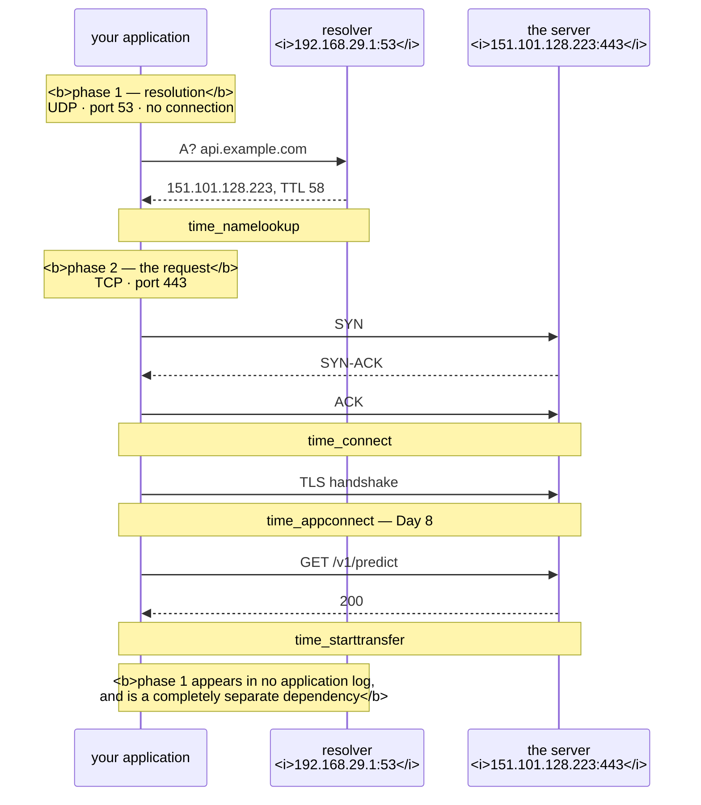

# 2.1 — What resolution actually does

## One-line answer

Before a single byte of your request can be sent, the name in the URL has to become an IP address — a
separate network round trip to a separate service, over a separate protocol, that most people forget
exists until it is the thing that is broken.

---

## The story

🎬 **The scene.** Someone gives you a business card. *"Come and see us — we're at Hartley & Sons."*

You cannot drive to "Hartley & Sons". You need a street address. So before you go anywhere, you look it
up: a directory, a phone call, a map. That lookup is a separate errand with its own failure modes — the
directory might be out of date, the office might have moved, the line might be engaged.

😬 **The naive fix.** Somebody asks why you are late and you say the traffic was bad.

💥 **Why it fails.** You were not in traffic. You spent the whole time on hold to directory enquiries and
never started driving. **The journey has two phases and only one of them looks like a journey**, so every
description of what went wrong points at the wrong phase.

And the person you complain to — the one who owns the road — cannot help you at all.

💡 **The insight.** A named destination hides a lookup, and the lookup is a completely separate system
with its own availability. **When the whole thing is slow, the first question is which of the two phases
you were in** — and the instinct is always to blame the visible one.

---

## The idea in plain language

`https://api.example.com/v1/predict` contains a name, not an address. TCP
([3.1](../03-tcp/3.1-the-handshake-and-the-connection-states.md)) connects to addresses. So something has
to translate, and that something is the **Domain Name System**.

**Resolution happens before the connection.** Your program calls something like `getaddrinfo()`, which
sends a query, waits for an answer, and returns one or more IP addresses. Only then does the connect
begin.

That means **every network call is at least two network operations**, and the first one is invisible in
almost every log you will ever read.

### The shape of the system

DNS is a distributed hierarchy, and the query walks down it:

1. Your program asks a **resolver** — usually configured by DHCP, often your router or a public one.
2. If the resolver does not know, it asks a **root server**: *"who handles `.com`?"*
3. Then the `.com` **top-level domain server**: *"who handles `example.com`?"*
4. Then `example.com`'s **authoritative server**: *"what is `api.example.com`?"*
5. The answer comes back and the resolver **caches** it
   ([2.2](2.2-records-ttl-and-the-cache-you-do-not-control.md)).

**In practice steps 2 to 4 almost never happen for you**, because the resolver has cached the answer from
someone else's query. That caching is why DNS is fast and why
[2.2](2.2-records-ttl-and-the-cache-you-do-not-control.md) exists.

### The protocol facts that matter operationally

Verified against RFC 1035 on **2026-08-24**:

**It runs over UDP, and messages are small.** Verbatim: *"Messages carried by UDP are restricted to 512
bytes (not counting the IP or UDP headers). Longer messages are truncated and the TC bit is set in the
header."* When truncation happens, the client is expected to retry over TCP.

**UDP has no connection and no retransmission.** So a lost DNS query is simply lost, and the client waits
for a timeout and retries. **This is why DNS failures so often present as latency rather than as errors** —
part [2.3](2.3-the-dns-failure-that-looks-like-a-timeout.md).

**The response carries a result code.** RFC 1035's `RCODE` values:

| RCODE | Name | Means |
| --- | --- | --- |
| 0 | — | *"No error condition"* |
| 1 | FORMERR | *"Format error"* — the server could not interpret the query |
| 2 | SERVFAIL | *"Server failure"* — a processing problem |
| 3 | NXDOMAIN | *"Name Error"* — **the domain does not exist** (authoritative only) |
| 4 | NOTIMP | *"Not Implemented"* |
| 5 | REFUSED | *"Refused"* — policy prevents the operation |

**`NXDOMAIN` and `SERVFAIL` are the two you will meet**, and confusing them wastes hours: `NXDOMAIN` means
the name genuinely does not exist and retrying will not help; `SERVFAIL` means something in the resolution
path is broken and retrying might.

### Where the answer comes from before DNS is even asked

Two things are consulted first, and both are common sources of confusion:

**The hosts file** — `/etc/hosts` on Unix, `C:\Windows\System32\drivers\etc\hosts` on Windows. A plain text
file mapping names to addresses. **It wins over DNS**, it is invisible to every DNS tool, and it is why
`dig` can return one answer while your application connects somewhere else
([2.3](2.3-the-dns-failure-that-looks-like-a-timeout.md)).

**A local cache.** The operating system, the resolver library, or the application may cache. **Java is
notorious** for caching DNS answers for the lifetime of the process by default, which means a JVM can keep
connecting to a decommissioned address for days.

---

## Why Kriya needs it

Day 35 introduces cluster DNS. Inside Kubernetes, `pulse` reaches Postgres by the name `postgres`, and
that resolution is done by an in-cluster DNS service — **so cluster DNS becomes a hard dependency of every
service-to-service call you make** (Day 2's dependency map, revisited).

Day 30's failure lab includes a container that cannot reach a dependency, and DNS is one of the two
causes.

Day 25 uses `compose`, where service names resolve to container addresses — the same mechanism at a
smaller scale, and the first time `pulse` will connect to something by name rather than by address.

Day 8 covers TLS, where the certificate is validated against **the name you asked for**, not the address
you reached — so name resolution and certificate validation are coupled in a way that produces confusing
errors.

Day 118 monitors a model server whose upstream is named, and Day 179's agents call named APIs.

---

## The mechanism

Watch the two phases separately.

```bash
nslookup pypi.org
```

**Line by line:** `nslookup` is the tool that exists on every platform including Windows. It sends a DNS
query and prints the answer — **and nothing else.** No connection is made; this is phase one in isolation.

Observed on **2026-08-24**:

```text
Server:  UnKnown
Address:  192.168.29.1

Non-authoritative answer:
Name:    pypi.org
Addresses:  151.101.128.223
          151.101.0.223
          151.101.64.223
          151.101.192.223
```

**Read three things.** `Server: 192.168.29.1` is **the resolver you are using** — your router — which is
the first thing to check when resolution misbehaves. `Non-authoritative answer` means this came from a
cache rather than from the domain's own servers. And **four addresses**, because a name can map to many,
which is part [2.2](2.2-records-ttl-and-the-cache-you-do-not-control.md) and is how simple load
distribution has been done since before load balancers existed.

The better tool, where it exists:

```bash
dig +noall +answer +stats pypi.org 2>/dev/null || echo "no dig here — Git Bash ships nslookup; see the note"
```

**Line by line:**

- `dig` gives far more detail than `nslookup` and is the tool every runbook assumes. **Git Bash does not
  ship it**, hence the fallback.
- `+noall +answer` — suppress everything, then add back only the answer section. **`dig`'s default output
  is five sections and mostly noise**; this pair is the idiom for "just tell me the answer".
- `+stats` — add the timing and the server used, which is the operationally interesting part.

```text
pypi.org.               58      IN      A       151.101.128.223
pypi.org.               58      IN      A       151.101.0.223
;; Query time: 4 msec
;; SERVER: 192.168.29.1#53(192.168.29.1) (UDP)
;; WHEN: Mon Aug 24 22:31:04 IST 2026
```

**Five fields per answer row:** the name, **the TTL in seconds** (`58` — how much longer this may be
cached, part [2.2](2.2-records-ttl-and-the-cache-you-do-not-control.md)), the class `IN` for internet, the
**type** `A` for an IPv4 address, and the address.

**`Query time: 4 msec` is phase one's cost**, and `#53` confirms the port
([1.1](../01-addresses-and-ports/1.1-a-port-is-a-doorway-not-a-place.md)).

### Separating the two phases with `curl`

This is the measurement worth making a habit, because it answers "was it DNS?" in one command:

```bash
curl -sS -o /dev/null -w 'dns=%{time_namelookup}s  connect=%{time_connect}s  tls=%{time_appconnect}s  first_byte=%{time_starttransfer}s  total=%{time_total}s\n' https://pypi.org/
```

**Line by line:**

- `%{time_namelookup}` — **time until name resolution completed.** Phase one, on its own.
- `%{time_connect}` — until the TCP connection was established. **This is cumulative from the start**, so
  the connect phase alone is `time_connect - time_namelookup`. Every one of these is cumulative, which
  catches people out.
- `%{time_appconnect}` — until the TLS handshake finished (Day 8). Zero for plain HTTP.
- `%{time_starttransfer}` — until the first byte of the response arrived. **The gap between this and
  `appconnect` is the server thinking.**
- `%{time_total}` — the whole thing.

**Read them as a ladder**: each number minus the previous one is the cost of that phase.

```text
dns=0.004s  connect=0.219s  tls=0.481s  first_byte=0.702s  total=0.702s
```

**DNS took 4 milliseconds of 702.** Now compare with an uncached name — one you have not looked up
recently:

```bash
for h in example.com iana.org rfc-editor.org; do
  curl -sS -o /dev/null -w "$h  dns=%{time_namelookup}s total=%{time_total}s\n" "https://$h/"
done
for h in example.com iana.org rfc-editor.org; do
  curl -sS -o /dev/null -w "$h  dns=%{time_namelookup}s total=%{time_total}s (cached)\n" "https://$h/"
done
```

**Line by line:** the same three names twice. **The first loop populates the cache and the second reads
it**, which makes the caching visible without any special tooling.

```text
example.com  dns=0.184s total=0.612s
iana.org  dns=0.211s total=0.688s
rfc-editor.org  dns=0.198s total=0.702s
example.com  dns=0.001s total=0.402s (cached)
iana.org  dns=0.001s total=0.441s (cached)
rfc-editor.org  dns=0.001s total=0.399s (cached)
```

**From ~200 ms to ~1 ms.** That two-hundred-fold difference is the entire reason caching exists — and it
is also why **a cold cache after a restart produces a latency spike that looks like the application being
slow** ([2.2](2.2-records-ttl-and-the-cache-you-do-not-control.md)).

### Watching a resolution that fails

```bash
curl -sS -m 5 -o /dev/null -w 'exit=%{exitcode} dns=%{time_namelookup}s total=%{time_total}s\n' https://this-name-does-not-exist-kriya.invalid/ || true
nslookup this-name-does-not-exist-kriya.invalid 2>&1 | tail -3
```

**Line by line:**

- `.invalid` is a **reserved top-level domain guaranteed never to resolve** (RFC 2606), so this test is
  reliable and bothers nobody's real servers.
- `|| true` so a non-zero exit does not stop the line
  ([Day 4, part 3.1](../../../day-004-linux-for-operators-i/parts/03-exit-codes/3.1-the-exit-code-is-the-whole-return-value.md)).
- The `nslookup` afterwards to see **the DNS-level answer** rather than curl's summary of it.

```text
exit=6 dns=0.052s total=0.052s
*** UnKnown can't find this-name-does-not-exist-kriya.invalid: Non-existent domain
```

**`exit=6` is curl's *"couldn't resolve host"*.** Note the total time equals the DNS time — **nothing else
ever happened.** No connection was attempted, so no firewall, no port and no server was involved.

**And the failure was fast**, because `NXDOMAIN` is a definite answer. Contrast that with
[2.3](2.3-the-dns-failure-that-looks-like-a-timeout.md), where the resolver does not answer at all.



---

## When it breaks

**`Could not resolve host`, and the service is fine.** The wrong-phase diagnosis:

```text
$ curl -sS https://api.example.com/health
curl: (6) Could not resolve host: api.example.com
```

**What it says:** the name could not be turned into an address.
**What it actually means:** **nothing was ever sent to `api.example.com`.** The service could be perfectly
healthy; you never reached the point of trying. **exit 6, not 7 or 28** — and those three codes are the
whole triage:

| curl exit | Means | Where the problem is |
| --- | --- | --- |
| 6 | could not resolve host | **DNS** |
| 7 | failed to connect | the port, the bind address, or a firewall refusing |
| 28 | timed out | packets going nowhere — firewall dropping, or a slow server |

**The smallest fix:** `nslookup` the name and see what the resolver says. **The lesson:** exit 6 means stop
looking at the service.

**A name that resolves everywhere except from one machine.** The hosts file:

```text
$ nslookup api.example.com
Addresses:  203.0.113.40
$ curl -sS https://api.example.com/health
curl: (7) Failed to connect to api.example.com port 443 after 2 ms: Could not connect to server
$ grep example /etc/hosts
10.0.0.99  api.example.com
```

**What it says:** DNS returns one address and the connection goes to a different one.
**What it actually means:** **the hosts file wins**, and it is invisible to every DNS tool. `nslookup` and
`dig` query DNS directly; your application uses the system resolver, which consults the hosts file first.
**The smallest fix:** read the hosts file. **The reason this is worth knowing:** somebody added that line
during an incident three months ago and never removed it, and it is the single most common cause of "it
works everywhere except on that one box".
**The tool that would have shown it:** `getent hosts api.example.com` on Linux, which uses the same
resolution path an application does rather than querying DNS directly.

**`SERVFAIL` versus `NXDOMAIN`.** Two answers that need opposite responses:

```text
$ dig +short api.internal.example.com
$ dig api.internal.example.com | grep status
;; ->>HEADER<<- opcode: QUERY, status: SERVFAIL, id: 41882
```

**What it says:** an empty answer and a status of `SERVFAIL`.
**What it actually means:** **something in the resolution path is broken** — an authoritative server is
down, a DNSSEC validation failed, the resolver could not reach the next hop. **The name may well exist.**
**Contrast with `NXDOMAIN`**, which is authoritative and definite: the name does not exist and no amount of
retrying will change that.
**The smallest fix for `SERVFAIL`:** try a different resolver — `dig @1.1.1.1 api.internal.example.com` —
which immediately tells you whether the problem is your resolver or the domain.
**Why the distinction matters:** a client that retries on `NXDOMAIN` wastes its budget on a certainty; a
client that gives up on `SERVFAIL` abandons something transient.

**Resolution that takes seconds.** The search-domain trap:

```text
$ curl -sS -o /dev/null -w 'dns=%{time_namelookup}s\n' http://postgres:5432/
dns=5.021s
```

**What it says:** name resolution took five seconds.
**What it actually means:** the name has no dots, so the resolver appends each configured **search
domain** in turn — `postgres.default.svc.cluster.local`, then `postgres.svc.cluster.local`, then
`postgres.cluster.local`, and so on — and each failed attempt costs a query and possibly a timeout.
**In Kubernetes the default `ndots:5` makes this dramatic**, because any name with fewer than five dots
goes through the search list first.
**The smallest fix:** use a fully-qualified name with a trailing dot — `postgres.default.svc.cluster.local.`
— which skips the search list entirely. **This is a real and well-known Kubernetes latency problem** and
Day 35 meets it properly.

---

## In production

**What a professional writes instead of the teaching version.** They treat DNS as a **hard dependency**
with its own availability, appearing on the dependency map alongside the database
([Day 2, part 2.1](../../../day-002-shape-of-production-system/parts/02-dependencies/2.1-hard-and-soft-dependencies.md)).
Concretely: they set a timeout on resolution as well as on the request
([4.2](../04-timeouts/4.2-the-four-timeouts-of-one-http-call.md)), they emit `time_namelookup` as a
separate metric rather than burying it in total latency, and they know what their client library caches
and for how long.

**What degrades at scale.** DNS becomes a shared single point of failure. Every service-to-service call in
a cluster resolves a name, so cluster DNS handles a query for every connection every service makes — and
if it is slow, **every service in the cluster is slow simultaneously**, which looks like a total platform
failure rather than one component's. This is why cluster DNS runs as several replicas with a node-local
cache in front, and why Day 35 spends time on it.

**The failure that only shows with real traffic.** Cache stampedes. A popular name's TTL expires and every
instance re-resolves at once, so the resolver sees a burst rather than a trickle — and if the resolver is
marginal, the burst is what tips it over. **The signature is a latency spike at regular intervals matching
a TTL**, which is one of the more satisfying things to diagnose because the periodicity is the clue.

**The review comment a senior engineer leaves.** *"The client is constructed per request, so every call
does a fresh DNS lookup — and our client library does not cache, it relies on the system resolver. At our
rate that is thousands of queries a second to cluster DNS for one address that has not changed in months.
Reuse the client, or at minimum resolve once at startup and handle the case where the address changes."*

**The signal you would alert on.** **DNS resolution time as a separate metric** — `time_namelookup`, or the
equivalent from your client — because burying it in total latency makes a DNS problem look like an
application problem and sends everybody to the wrong place. Alert on a high percentile, not the mean,
since resolution is normally a millisecond and the interesting case is the tail. And **DNS query failure
rate split by response code**, because `NXDOMAIN` and `SERVFAIL` mean different things: a rise in
`SERVFAIL` is an infrastructure problem worth paging on, and a rise in `NXDOMAIN` is usually a
configuration error someone just deployed. You would **not** alert on query volume alone, which tracks
traffic.

**Blast radius.** This part sends DNS queries to public names — read-only, tiny, and unremarkable. Worst
case: a loop of lookups against someone else's authoritative servers, which at any volume you would
generate by hand is negligible and at scale would look like abuse. Who can trigger it: you, by putting a
lookup in a tight loop. What bounds it: the handful of names used here, all of them either reserved
(`.invalid`) or operated by organisations whose infrastructure exists to answer exactly this. ⚠️ **Do not
put DNS lookups in a loop against a name you do not own** — it is indistinguishable from a
reflection-attack rehearsal and will be treated as one.

**Cost.** `0` model calls, `0` tokens, `0` CI minutes, `0` disk, negligible RAM. **Network: a few dozen
DNS queries at well under 512 bytes each**, plus a handful of HTTPS requests to fetch nothing (`-o
/dev/null`). The whole part costs a few kilobytes.

**The interview question.** *"A request is slow. How do you tell whether it is DNS?"* The answer that lands
names the measurement: *"`curl -w` with the timing fields — `time_namelookup`, `time_connect`,
`time_appconnect`, `time_starttransfer`, `time_total`. They are cumulative, so each one minus the previous
is the cost of that phase, and if `time_namelookup` is most of the total then resolution is the problem
and the service is irrelevant. The reason it catches people is that DNS happens before anything an
application log records — the log line starts when the request starts, and resolution is already over. The
other tell is curl's exit code: 6 is could-not-resolve, 7 is connection refused, 28 is timeout, and those
three send you to three completely different places. In a cluster the usual culprit is the search-domain
list with `ndots:5`, where an unqualified name is tried against five suffixes before the real one."*

---

## Check yourself

```bash
for h in pypi.org example.com this-name-does-not-exist-kriya.invalid; do curl -sS -m 5 -o /dev/null -w "%-45s exit=%{exitcode} dns=%{time_namelookup}s connect=%{time_connect}s total=%{time_total}s\n" "https://$h/" 2>/dev/null || printf '%-45s FAILED\n' "$h"; done
```

Three names — one that resolves and connects, one that resolves and connects, and one that cannot resolve
at all. **On the third row `dns` and `total` are equal and `connect` is zero**, which is the signature of a
failure that happened entirely in phase one. Recognising that shape means never again debugging a service
that was never contacted.

**Say out loud, without scrolling up:** *`curl` returns exit 6 for one host and exit 7 for another. Say
which phase each failed in, and name one cause for each that has nothing to do with the destination
service.*
