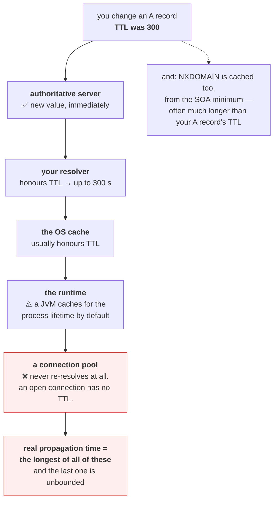

# 2.2 — Records, TTL, and the cache you do not control

## One-line answer

A DNS answer comes with a time-to-live saying how long it may be cached, and that number is the **minimum
delay before a change you make reaches everyone** — except that caches you have never heard of can ignore
it, so the real answer is always longer than the TTL and sometimes unbounded.

---

## The story

🎬 **The scene.** A village noticeboard with a printed card: *"Dr Ellis — surgery hours, Tuesday and
Thursday."* Underneath, in small print: *"correct until the end of the month."*

People read it, memorise the hours, and go about their lives.

Dr Ellis changes her hours on the 3rd and puts up a new card.

😬 **The naive fix.** She assumes everyone will read the new card.

💥 **Why it fails.** Nobody re-reads a noticeboard they already read. Some people wrote the hours in a
diary and will use that until the diary runs out. The parish newsletter reprinted the old hours and comes
out monthly. And one family wrote them on the kitchen wall in 2019 and has never looked at the
noticeboard since.

**The "correct until the end of the month" was a promise about the card, not about anybody's memory.** She
controls the card. She controls nothing else.

💡 **The insight.** When you publish a value with an expiry, you are making a request of everyone who
copies it — and copies you did not authorise do not honour requests. **The expiry bounds how long a
well-behaved cache holds it, and there is no mechanism at all for the others.** So "how long until my
change takes effect" is never the number you set.

---

## The idea in plain language

Part [2.1](2.1-what-resolution-actually-does.md) showed a `dig` answer with a number in it:

```
pypi.org.               58      IN      A       151.101.128.223
```

That `58` is the **TTL** — time to live, in seconds. Verified against RFC 1035 on **2026-08-24**, it is
*"a 32 bit signed integer that specifies the time interval that the resource record may be cached before
the source of the information should again be consulted"*.

**Read "may be cached" carefully.** It is permission with an upper bound, not an instruction. A resolver
may cache for less. Nothing in the protocol forces anyone to stop at the limit, and plenty of software
does not.

### The record types worth knowing

Also from RFC 1035:

| Type | Holds | You will meet it |
| --- | --- | --- |
| `A` | *"Host address"* — an IPv4 address | everywhere |
| `AAAA` | an IPv6 address | as soon as anything is dual-stack |
| `CNAME` | *"Canonical name for an alias"* — another name to look up | in front of most managed services |
| `NS` | *"Authoritative name server"* — who answers for this zone | when delegation is wrong |
| `SOA` | *"Marks start of zone authority"* — includes the negative-caching TTL | when `NXDOMAIN` sticks |
| `MX` | *"Mail exchange"* | mail, which this curriculum does not do |
| `TXT` | *"Text strings"* — arbitrary text | domain verification, SPF, ACME challenges (Day 8) |
| `PTR` | *"Domain name pointer"* — reverse lookup | in logs that resolve addresses to names |
| `SRV` | a service's host and port | service discovery, including in Kubernetes (Day 35) |

**`CNAME` is the one with an operational catch.** It is an alias, so resolving it means a *second* lookup —
and the TTL that governs your change might be on either record. A `CNAME` with a five-minute TTL pointing
at a target with a day-long TTL means the target's address change takes a day to propagate, whatever your
five minutes said.

### Negative caching, which people forget entirely

An `NXDOMAIN` is cached too. The duration comes from the zone's `SOA` record — its minimum field — and it
is frequently much longer than the positive TTLs in the same zone.

**The practical consequence:** you create a new DNS record after something has already looked the name up
and got `NXDOMAIN`, and the name stays broken for that resolver long after the record exists. **"I created
it and it still says it does not exist" is negative caching**, and the fix is to wait, not to create it
again.

### Why the TTL is a design decision with a real trade-off

| TTL | Change propagates in | Query load on your DNS | Failure blast radius |
| --- | --- | --- | --- |
| 30 s | fast | **high** — every cache re-asks constantly | small: a bad record self-corrects quickly |
| 300 s | a few minutes | moderate | moderate |
| 86400 s | a day | very low | **large: a bad record persists for a day** |

**Low TTL buys agility and costs query volume.** High TTL is cheap and slow to change.

The standard practice: **lower the TTL well before a planned change**, wait for the old high TTL to
expire, make the change, then raise it again. **Which means the plan has to start further ahead than the
change itself**, and forgetting that is why a "quick DNS cutover" is neither.

### The caches you do not control

This is the part that makes TTL a floor rather than a ceiling:

- **Your resolver** honours TTL. Usually.
- **The operating system** may cache — `systemd-resolved`, the Windows DNS Client service.
- **The application runtime.** **Java caches DNS for the lifetime of the JVM by default** unless
  `networkaddress.cache.ttl` is set. This is not obscure; it has caused real, long outages.
- **Connection pools** hold *established connections*, which never re-resolve at all. A pooled connection
  to an old address survives every DNS change until the connection itself closes
  ([1.2](../01-addresses-and-ports/1.2-the-socket-and-the-four-tuple.md)).
- **Somebody's laptop**, with a stale entry from before you started.

**The last two are the ones that bite.** A connection pool is not a DNS cache and does not think of itself
as one, and it is completely immune to your TTL.

---

## Why Kriya needs it

Day 10 is environments and promotion, where cutting traffic from one environment to another is frequently
a DNS change — and the propagation delay is a property of the rollback plan, not a detail.

Day 18 chooses a deployment strategy and Day 19 rehearses rollback. **A rollback that depends on DNS is a
rollback whose speed you do not control**, which is a strong argument for making the load balancer the
switching point instead.

Day 35 introduces cluster DNS, where Service records have short TTLs and Pod addresses change constantly.
Day 39's network policy and Day 37's ingress both depend on names resolving to the right things.

Day 8 covers certificates, whose issuance uses a `TXT` record for the ACME DNS-01 challenge — and whose
validation is against the name, so a stale cached address serving the wrong certificate produces a
confusing error.

---

## The mechanism

Read the TTL, watch it count down, and see what it governs.

```bash
nslookup -type=A -debug pypi.org 2>/dev/null | grep -iE 'ttl|internet address' | head -6 || nslookup pypi.org
```

**Line by line:**

- `-type=A` — ask for address records specifically rather than whatever the default is.
- `-debug` — **`nslookup`'s only way to show the TTL**, which it hides by default. This is one of several
  reasons `dig` is preferred where it exists.
- `grep -iE 'ttl|internet address'` — pull out the two interesting lines from a very verbose output.

Observed on **2026-08-24**:

```text
        ttl = 41 (41 secs)
        internet address = 151.101.128.223
        ttl = 41 (41 secs)
        internet address = 151.101.0.223
```

**Forty-one seconds left.** Ask again immediately and watch it fall:

```bash
for i in 1 2 3; do
  printf 'attempt %d: ' "$i"
  nslookup -type=A -debug pypi.org 2>/dev/null | grep -m1 -i 'ttl' || echo '(no ttl shown)'
  sleep 4
done
```

**Line by line:**

- Three queries four seconds apart, printing only the first TTL each time.
- `-m1` on the `grep` — stop after the first match, since all the records share a TTL here.
- **The countdown is the demonstration.** Each query is answered from the same cache entry, and the
  resolver reports the remaining lifetime rather than the original value.

```text
attempt 1: ttl = 39 (39 secs)
attempt 2: ttl = 35 (35 secs)
attempt 3: ttl = 31 (31 secs)
```

**The number falls by four each time**, matching the sleep. **You are watching a cache expire**, and when
it reaches zero the next query goes back to the authoritative servers and the TTL resets to its full
value.

Keep querying past zero and you will see it jump back up — that jump is the moment a real lookup happened.

### Seeing a `CNAME` chain

```bash
nslookup www.github.com 2>/dev/null | head -8
```

**Line by line:** many well-known names are aliases. `nslookup` shows the chain, and **the number of hops
is the number of lookups your application makes** before it has an address.

```text
Non-authoritative answer:
Name:    github.com
Address:  140.82.112.4
Aliases:  www.github.com
```

**`Aliases: www.github.com` means you asked for one name and got an answer about another.** The `A` record
belongs to `github.com`; `www.github.com` is a `CNAME` pointing at it. **Two records, two TTLs, and your
change propagates at the speed of whichever is longer.**

### Measuring the cost of a cache miss

```bash
for h in rfc-editor.org iana.org; do
  printf '%-18s cold: ' "$h"
  curl -sS -o /dev/null -w '%{time_namelookup}s   ' "https://$h/"
  printf 'warm: '
  curl -sS -o /dev/null -w '%{time_namelookup}s\n' "https://$h/"
done
```

**Line by line:** two requests to each name, back to back. **The first populates the cache and the second
reads it**, so the pair measures exactly what caching buys
([2.1](2.1-what-resolution-actually-does.md) did this across a loop; this is the tighter version).

```text
rfc-editor.org     cold: 0.198000s   warm: 0.000041s
iana.org           cold: 0.184000s   warm: 0.000038s
```

**Two hundred milliseconds versus forty microseconds — a factor of five thousand.** That is the value of
the cache, and it is also **the size of the latency cliff your service falls off after a restart**, when
every name it uses is cold at once.

### The cache that ignores your TTL entirely

The connection pool case, demonstrated with what you already have:

```bash
uv run python days/day-007-networking-for-operators/lab/hold_conns.py 127.0.0.1 8000 3 &
sleep 3
netstat -ano | grep ':8000.*ESTABLISHED' | head -3
```

**Line by line:** open three connections and hold them
([1.2](../01-addresses-and-ports/1.2-the-socket-and-the-four-tuple.md)). **These connections resolved a
name — or in this case used an address — once, at creation.** From that moment they carry bytes to a fixed
four-tuple and consult DNS never again.

```text
  TCP    127.0.0.1:52310        127.0.0.1:8000         ESTABLISHED     48210
  TCP    127.0.0.1:52311        127.0.0.1:8000         ESTABLISHED     48210
  TCP    127.0.0.1:52312        127.0.0.1:8000         ESTABLISHED     48210
```

**If the name these were opened with changed its address right now, nothing would happen.** The
connections persist, pointed at the old address, until something closes them. **A pool with a long idle
timeout is a DNS cache with no TTL at all**, and it is the reason DNS-based failover so often does not
work as advertised.

Clean up:

```bash
pkill -f hold_conns.py 2>/dev/null; sleep 1; netstat -ano | grep ':8000' || echo "clean"
```

**Line by line:** stop the holder and confirm — and note that closing the connections is exactly what
would have been needed for a DNS change to take effect, which is the point.



---

## When it breaks

**"I changed the DNS and it has not taken effect."** The everyday one:

```text
$ dig +short api.example.com @8.8.8.8
203.0.113.50
$ dig +short api.example.com
203.0.113.40
```

**What it says:** a public resolver has the new address and yours has the old one.
**What it actually means:** **your resolver's cached copy has not expired.** Querying an authoritative
server or a different resolver shows the truth and proves the change was published correctly.
**The smallest fix:** wait for the TTL, or flush the local cache — `ipconfig /flushdns` on Windows,
`resolvectl flush-caches` on systemd — **which only fixes your machine and nobody else's.**
**The diagnostic worth knowing:** `dig @<a resolver you did not use before>` isolates "the change is
wrong" from "the change is cached", and those are completely different problems.

**A record you just created still says it does not exist.** Negative caching:

```text
$ dig +short new-service.example.com
$ dig new-service.example.com | grep -E 'status|SOA'
;; ->>HEADER<<- opcode: QUERY, status: NXDOMAIN, id: 12882
example.com. 900 IN SOA ns1.example.com. admin.example.com. 2026082401 7200 3600 1209600 900
```

**What it says:** `NXDOMAIN`, and an `SOA` record in the response.
**What it actually means:** the negative answer is cached, and **the last field of the `SOA` — `900` here —
is the negative-caching TTL.** Something looked this name up before you created it and the "does not
exist" was remembered.
**The smallest fix:** wait. **Creating the record again does nothing**, which is the trap: the natural
response to "it does not exist" is to check that you created it, and you did.
**Worth knowing because** the negative TTL is often much longer than the zone's positive TTLs, so the
delay is worse than you would predict from the record you created.

**A failover that did not fail over.** The connection pool:

```text
# DNS updated to the standby address at 14:02. At 14:40:
$ ss -tn '( dport = :5432 )' | awk '{print $5}' | sort | uniq -c
     18 203.0.113.40:5432
```

**What it says:** eighteen connections, all to the old address, forty minutes after the change.
**What it actually means:** **the pool established those connections before the change and never
re-resolves.** DNS failover moved the name; it did not move the connections.
**The smallest fix:** restart the client, or set a maximum connection lifetime so the pool recycles.
**The design lesson:** **DNS-based failover only works for clients that make new connections**, and any
long-lived pooled client is exempt. This is the strongest practical argument for putting failover in a
load balancer instead, where the switching point is inside the request path rather than in front of it.

**A change that took a day when the TTL said five minutes.** The `CNAME` chain:

```text
$ dig api.example.com | grep -E 'IN\s+(CNAME|A)'
api.example.com.        300     IN      CNAME   lb-prod.example.net.
lb-prod.example.net.    86400   IN      A       203.0.113.40
```

**What it says:** a five-minute alias pointing at a record with a day-long TTL.
**What it actually means:** **your five-minute TTL governs the alias, not the address.** Changing the `A`
record at the end of the chain propagates at 86400 seconds regardless.
**The smallest fix:** lower the TTL on the record that actually holds the address, and remember that you
may not control it — if the target belongs to a managed service, its TTL is their decision.
**The general rule:** **the propagation time is the maximum along the whole chain**, and reading only the
first record gives you a number that is confidently wrong.

**Query volume that tripled after a "small" change.** The other direction:

```text
# TTL lowered from 3600 to 30 in preparation for a migration, and left there
# DNS queries/sec: 400 -> 12,000
```

**What it says:** thirty times the query load.
**What it actually means:** exactly what the arithmetic predicts — every cache now re-asks every 30
seconds instead of every hour. **The lowered TTL was correct for the migration and wrong as a permanent
state**, and nobody raised it again.
**The smallest fix:** raise it back. **The reason it persists:** lowering a TTL has no visible downside on
the day, and the cost shows up on the DNS bill or as resolver load weeks later.

---

## In production

**What a professional writes instead of the teaching version.** They plan TTL changes **before** the
change that needs them: lower the TTL, wait longer than the *old* TTL for it to propagate, then make the
change, then raise it back. And they know which of their clients ignore TTL entirely — **the connection
pools and the runtimes with their own caches** — because those clients need a different mechanism
altogether, usually a maximum connection lifetime or a restart.

**What degrades at scale.** The number of independent caches. One service and one resolver is
predictable. A fleet with per-node caches, per-runtime caches, per-application caches and long-lived pools
has a propagation time that is the maximum over dozens of layers, most of which nobody has inventoried.
**This is why mature systems stop using DNS as a control plane**: they move the switching point to a load
balancer or a service mesh, where the change is applied at request time and the propagation delay is
bounded by something they own.

**The failure that only shows with real traffic.** The cold-cache cliff. After a deploy, every instance
has an empty resolver cache, so the first request to each distinct name pays a full resolution — and with
enough distinct upstreams that is a visible latency spike on every rollout. **It looks like slow start-up
and is actually DNS**, and the giveaway is that `time_namelookup` is elevated only in the first moments
after a restart.

**The review comment a senior engineer leaves.** *"The runbook for the failover says 'update DNS and wait
five minutes'. Our TTL is 300 but the CNAME target is a managed endpoint with a day-long TTL, and the
service's connection pool has no maximum lifetime, so the existing connections will never move. Either
put the failover behind the load balancer or add a `max_lifetime` to the pool and test it."*

**The signal you would alert on.** Not TTL, which is configuration rather than a time series. What is
worth watching is **DNS query rate from your services**, because a sudden rise usually means somebody
lowered a TTL and forgot, or a client stopped caching — and both are cheap to fix early and expensive to
discover from a bill. And, for anything doing DNS-based failover, **the distribution of remote addresses
across your open connections**, which is the only signal that would have caught the pool case above:
connections still pointing at an address you decommissioned. You would **not** alert on cache hit rates,
which are not exposed by most resolvers and vary legitimately.

**Blast radius.** This part only reads DNS and opens local connections. Worst case: a loop of lookups
against a public name, which at hand-typed volume is nothing. **The blast radius worth naming is the one
this part is about**: changing a TTL is a change to how long every cache in the world may hold your data,
and lowering it multiplies query load against your own DNS infrastructure — a self-inflicted load
amplification with no error message. Who can trigger it: anyone who can edit a zone. What bounds it: the
plan-first discipline above, and knowing that a lowered TTL is a temporary state with a return step.

**Cost.** `0` model calls, `0` tokens, `0` CI minutes, `0` disk, negligible RAM. **Network: a few dozen
DNS queries, each well under 512 bytes** ([2.1](2.1-what-resolution-actually-does.md)), plus a handful of
HTTPS requests fetching nothing. **The interesting cost is the one you inflict on others** — a low TTL
means every cache in the world re-asks your servers on that schedule, forever.

**The interview question.** *"You changed a DNS record with a 300-second TTL. When is the change fully in
effect?"* The answer that lands refuses the number: *"Later than 300 seconds, and possibly never for some
clients. The TTL bounds how long a well-behaved resolver caches it, but there are layers underneath — the
operating system cache, the runtime's own cache, and the one that actually causes outages, connection
pools, which hold established connections and never re-resolve at all. A pooled client keeps talking to
the old address until the connection closes, regardless of any TTL. And if the name is a CNAME, my TTL
governs the alias while the address is governed by the target's TTL, which I may not control. So for a
planned change I lower the TTL well in advance, wait out the *old* TTL, then change; and for failover I
would rather not use DNS at all — put the switch in the load balancer where the propagation time is
something I own."*

---

## Check yourself

```bash
for i in 1 2 3; do printf 'query %d  ' "$i"; nslookup -type=A -debug pypi.org 2>/dev/null | grep -m1 -i 'ttl' || echo '(none)'; sleep 5; done; echo "--- cold vs warm ---"; curl -sS -o /dev/null -w 'cold dns=%{time_namelookup}s\n' https://rfc-editor.org/; curl -sS -o /dev/null -w 'warm dns=%{time_namelookup}s\n' https://rfc-editor.org/
```

A TTL counting down five seconds at a time, then the cost of a cache miss against a cache hit. **The
countdown proves you are reading a cached entry rather than asking the authoritative server**, and the
cold-versus-warm pair is the number that explains why every service has a latency spike immediately after
a restart.

**Say out loud, without scrolling up:** *your A record has a 60-second TTL and you changed it an hour ago,
and one client is still connecting to the old address. Name the layer responsible, explain why the TTL has
no effect on it, and say what you would change so it does.*
