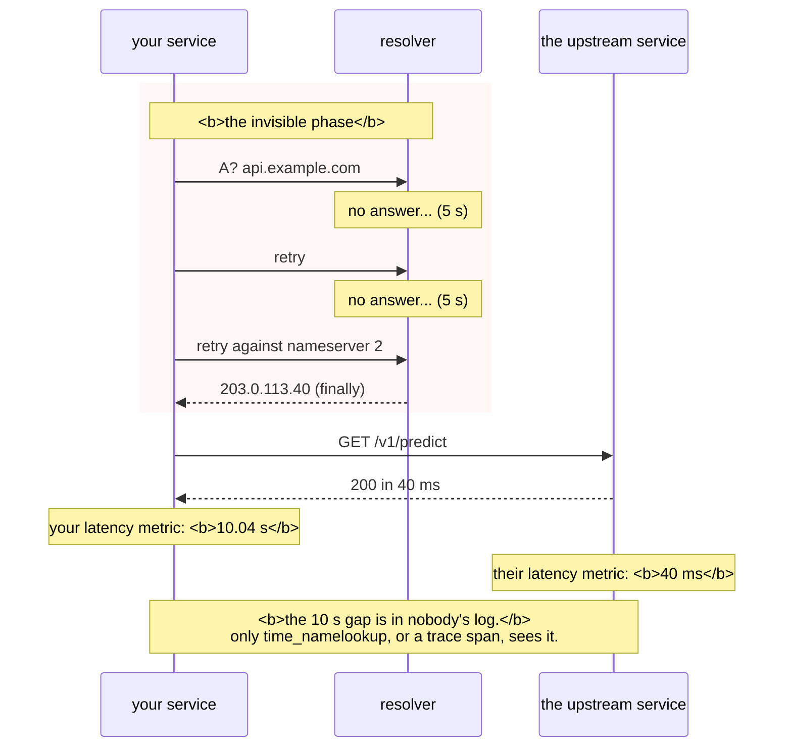

# 2.3 — The DNS failure that looks like a timeout

## One-line answer

A resolver that answers wrongly fails fast and obviously; a resolver that does not answer at all makes
every request in your system slow by exactly the resolver's timeout — and because that delay lands before
any application log line is written, it looks like the *destination* being slow.

---

## The story

🎬 **The scene.** A hotel switchboard. Guests ring reception to be connected to a room.

One evening the switchboard operator steps out. The phone in reception rings and rings.

😬 **The naive fix.** Guests trying to reach room 412 report that "room 412 is not answering", and the
manager sends someone up to knock on the door.

💥 **Why it fails.** The person in room 412 is sitting by their phone. It has not rung once. **The call
never left reception** — and every guest's description of the problem points at the room, because from
where they are standing the call and the connection are one action.

The manager sends people to a dozen rooms before anyone thinks to look at the desk.

💡 **The insight.** When a lookup and a delivery are chained, a failure in the lookup is described by
everyone as a failure of the delivery. **The symptom names the second phase because the second phase is
the one people can see**, and the diagnosis only starts moving when somebody asks whether the first phase
completed at all.

---

## The idea in plain language

Part [2.1](2.1-what-resolution-actually-does.md) established that DNS runs over UDP, which has no
connection and no retransmission. That has a consequence worth stating on its own:

**A lost DNS query produces no error. It produces a wait.**

The client sends a query and waits. If nothing comes back within its timeout, it retries — possibly
against a second configured resolver — and waits again. Only after exhausting its attempts does it report
failure.

**The default is slower than anyone expects.** The traditional `resolv.conf` defaults are a **5-second
timeout and 2 attempts**, across however many nameservers are listed. With two nameservers that is up to
**20 seconds before any error is reported**, and the caller sees nothing at all during that time.

### Why this is worse than a wrong answer

| Failure | What the client sees | How fast | How obvious |
| --- | --- | --- | --- |
| `NXDOMAIN` | "could not resolve host", curl exit 6 | **immediate** | very — it names DNS |
| `SERVFAIL` | same, usually | immediate | fairly |
| **resolver does not respond** | **a long pause, then a timeout** | **seconds to tens of seconds** | **not at all** |
| resolver responds slowly | everything is slow, no errors | proportional | **not at all** |

**The bottom two rows are the subject of this part.** They produce latency rather than errors, and latency
with no error is the hardest thing in operations to attribute, because every dashboard shows the symptom
and nothing shows the cause.

### Why it lands before your logs

An application's request log line is written when the request completes, or when it starts — and "starts"
means *after* the client library has resolved the name and connected. **Resolution happens before the
first thing your code would log.**

So the shape is: your service's own latency metric shows a slow request, the *upstream's* latency metric
shows a fast one, and the difference is time nobody recorded. That gap is where DNS lives, and
`time_namelookup` ([2.1](2.1-what-resolution-actually-does.md)) is the only cheap way to see it.

### The two shapes it takes on a real system

**Everything is slow by a constant.** The resolver is answering but slowly, or the first of two
nameservers is dead and every query pays a timeout before falling through to the second. **The signature is
a fixed amount added to every request** — suspiciously round, like exactly 5 seconds — which is a very
strong hint that a timeout rather than a workload is responsible.

**Some things are slow, at random.** A resolver behind a load balancer where one instance is unhealthy, or
UDP packets being dropped under load. **The signature is a bimodal latency distribution**: most requests
fast, a minority slow by exactly the timeout, and nothing in between. **Bimodal latency with a round
number is almost always a timeout somewhere.**

---

## Why Kriya needs it

Day 35 makes cluster DNS a dependency of every service-to-service call. A degraded cluster DNS makes the
entire platform slow simultaneously, which presents as "everything is broken" and is one component.

Day 76 builds the first alert, and Day 84's incident lab hands you a symptom with no cause — "everything
got slower by five seconds at 14:00" is exactly this shape.

Day 71 introduces tracing, which is the tool that finally makes this visible: a span for the DNS lookup
turns invisible latency into a labelled bar on a diagram.

Day 4's lesson applies directly: a failure that produces no error and no log line is the dangerous kind
([Day 4, part 4.2](../../../day-004-linux-for-operators-i/parts/04-the-service-died/4.2-the-shutdown-that-dropped-requests.md)),
and this is the same category arriving from the network side.

---

## The mechanism

Produce a resolver that does not answer, and measure what it costs.

**The safe way to do this is to point one client at a resolver you know is unreachable**, rather than
breaking your machine's resolution. `192.0.2.1` is in a range reserved for documentation (RFC 5737) and is
guaranteed not to be a real host, which makes it a perfect black hole.

```bash
nslookup pypi.org 192.0.2.1
echo "exit code: $?"
```

**Line by line:**

- `nslookup <name> <server>` — **the second argument overrides which resolver to ask.** This is the whole
  trick: one command uses the broken resolver and nothing else on the machine is affected.
- `192.0.2.1` — reserved for documentation, so it is not somebody's real machine and no packets bother
  anyone. **Using a random address here would be pointing an experiment at a stranger.**
- The exit code immediately afterwards
  ([Day 4, part 3.1](../../../day-004-linux-for-operators-i/parts/03-exit-codes/3.1-the-exit-code-is-the-whole-return-value.md)).

Observed on **2026-08-24**:

```text
DNS request timed out.
    timeout was 2 seconds.
DNS request timed out.
    timeout was 2 seconds.
*** Request to 192.0.2.1 timed-out
exit code: 1
```

**Two attempts, two seconds each, and then a failure.** Note what did *not* happen: no "host unreachable",
no refusal, no immediate error. **Silence, twice, and then a conclusion drawn by the client.**

Time it properly:

```bash
time nslookup pypi.org 192.0.2.1 >/dev/null 2>&1
echo "---"
time nslookup pypi.org >/dev/null 2>&1
```

**Line by line:** the same query twice — once at the black hole, once at your normal resolver — with
output discarded so only the timing shows. **This is the controlled comparison** and the difference is the
cost of the failure.

```text
real    0m4.089s
---
real    0m0.031s
```

**Four seconds versus thirty-one milliseconds.** And on a Linux machine with two nameservers configured
and the traditional defaults, the first figure would be closer to twenty.

### What it costs a real request

```bash
curl -sS -m 30 --dns-servers 192.0.2.1 -o /dev/null \
  -w 'broken resolver: exit=%{exitcode} dns=%{time_namelookup}s total=%{time_total}s\n' \
  https://pypi.org/ 2>/dev/null || echo "curl here lacks --dns-servers; see the note below"

curl -sS -m 30 -o /dev/null \
  -w 'normal resolver: exit=%{exitcode} dns=%{time_namelookup}s total=%{time_total}s\n' \
  https://pypi.org/
```

**Line by line:**

- `--dns-servers` — **overrides the resolver for this request only**, leaving the machine untouched. It
  requires a curl built with `c-ares`, which not every build has, hence the fallback message.
- `-m 30` — a generous cap so the DNS timeout completes rather than being cut short by curl's own limit.
  **Setting this too low would measure your timeout instead of the resolver's**, which is a subtle way to
  get a wrong answer.
- The same request twice, with only the resolver differing.

```text
broken resolver: exit=6 dns=5.008s total=5.008s
normal resolver: exit=0 dns=0.002s total=0.481s
```

**Read the first row's two timings.** `dns` and `total` are **identical** — the entire five seconds was
resolution, and no connection was ever attempted. `exit=6` is *could not resolve*
([2.1](2.1-what-resolution-actually-does.md)).

**Now imagine the resolver is slow rather than dead**, answering in four seconds instead of never. The
exit code would be `0`, the request would **succeed**, and every request would take four seconds longer
than it should — **with no error anywhere and nothing in any application log.** That is the failure this
part exists for.

### Simulating the slow case

```python
# days/day-007-networking-for-operators/lab/slow_resolver.py
"""A DNS server that answers correctly, but slowly. Demonstrates latency with no errors."""

import socket
import sys
import time

DELAY = float(sys.argv[1]) if len(sys.argv) > 1 else 3.0
PORT = int(sys.argv[2]) if len(sys.argv) > 2 else 5354
UPSTREAM = ("1.1.1.1", 53)

sock = socket.socket(socket.AF_INET, socket.SOCK_DGRAM)
sock.bind(("127.0.0.1", PORT))
print(f"[slow-dns] on 127.0.0.1:{PORT}, adding {DELAY}s to every answer", flush=True)

while True:
    query, client = sock.recvfrom(512)
    time.sleep(DELAY)
    up = socket.socket(socket.AF_INET, socket.SOCK_DGRAM)
    up.settimeout(5)
    try:
        up.sendto(query, UPSTREAM)
        answer, _ = up.recvfrom(512)
        sock.sendto(answer, client)
        print(f"[slow-dns] answered {client} after {DELAY}s", flush=True)
    except OSError as exc:
        print(f"[slow-dns] upstream failed: {exc}", flush=True)
    finally:
        up.close()
```

**Line by line:**

- `socket.SOCK_DGRAM` — **UDP**, not TCP. DNS queries arrive as single datagrams with no connection
  ([2.1](2.1-what-resolution-actually-does.md)), which is why this server needs no `listen` or `accept`
  ([1.2](../01-addresses-and-ports/1.2-the-socket-and-the-four-tuple.md)).
- `sock.recvfrom(512)` — **512 bytes**, the UDP message limit from RFC 1035. Anything larger would be
  truncated with the TC bit set, and a real resolver would retry over TCP; this toy does not handle that
  and says so by construction.
- `PORT = 5354` — **not 53.** Port 53 is privileged
  ([1.1](../01-addresses-and-ports/1.1-a-port-is-a-doorway-not-a-place.md)) and may already be claimed by
  a system resolver. A high port avoids both problems.
- `time.sleep(DELAY)` — **the whole experiment.** Everything else is a plain forwarder; this one line
  turns it into a slow resolver.
- `UPSTREAM = ("1.1.1.1", 53)` — a well-known public resolver, used so the answers are correct. **The
  point is a *correct* answer that is late**, because a wrong answer would be the easy failure.
- `up.settimeout(5)` — **a timeout on the upstream query**, because a forwarder with no timeout hangs
  forever if the upstream is unreachable — the exact failure mode this part is about, which it would be
  embarrassing to build into the demonstration
  ([4.1](../04-timeouts/4.1-a-timeout-is-a-decision-not-a-safety-net.md)).
- `except OSError` specifically rather than bare `except` (`CLAUDE.md`), and `finally: up.close()` so a
  failure does not leak a descriptor per query
  ([Day 5, part 3.2](../../../day-005-linux-for-operators-ii/parts/03-the-disk-that-fills/3.2-the-deleted-file-that-still-costs-you-a-gigabyte.md)).

Run it and point one lookup at it:

```bash
uv run python days/day-007-networking-for-operators/lab/slow_resolver.py 3 5354 &
SLOW=$!
sleep 2
time nslookup -port=5354 pypi.org 127.0.0.1 2>&1 | tail -3
```

**Line by line:**

- `-port=5354` — `nslookup`'s flag for a non-standard port. **Without it the query goes to 53 and misses
  your server entirely**, which produces a confusing success.
- `time` around it, because the duration *is* the result.
- `tail -3` to trim the verbose output to the answer.

```text
[slow-dns] on 127.0.0.1:5354, adding 3.0s to every answer
[slow-dns] answered ('127.0.0.1', 61402) after 3.0s
Name:    pypi.org
Addresses:  151.101.128.223

real    0m3.071s
```

**A correct answer, three seconds late, with no error of any kind.** Every request through a resolver
behaving like this is three seconds slower, the answers are all right, nothing logs anything, and the
service you are calling is entirely innocent.

Clean up:

```bash
kill "$SLOW" 2>/dev/null; wait "$SLOW" 2>/dev/null; netstat -ano | grep ':5354' || echo "5354 released"
```

**Line by line:** stop it and confirm the port is free
([1.4](../01-addresses-and-ports/1.4-the-port-that-was-already-in-use.md)).



---

## When it breaks

**Everything got slower by exactly five seconds.** The round number:

```text
# p50 latency, by service, after 14:02
api        : 0.06s -> 5.06s
worker     : 0.12s -> 5.12s
ingest     : 1.80s -> 6.80s
```

**What it says:** every service slowed by the same constant.
**What it actually means:** **a constant addition across unrelated services is not a workload change.** It
is a shared dependency with a timeout, and the roundness of the number is the tell — real work does not
take exactly five seconds. The candidates are DNS, a health check, or a connection attempt to something
dead.
**The smallest fix for diagnosis:** measure `time_namelookup` from any one of them. **If DNS is the
cause, that field alone will show 5 seconds and everything else will be normal.**
**Why it is worth recognising:** the instinct on "everything is slow" is to look for a resource problem
(Day 6), and a constant offset rules that out immediately — resource contention scales things, it does not
add to them.

**One of two nameservers is dead and nobody noticed for weeks.** The fallback tax:

```text
$ cat /etc/resolv.conf
nameserver 10.0.0.53
nameserver 10.0.0.54
options timeout:5 attempts:2
$ dig @10.0.0.53 +short pypi.org
;; connection timed out; no servers could be reached
$ dig @10.0.0.54 +short pypi.org
151.101.128.223
```

**What it says:** the first nameserver is dead, the second works.
**What it actually means:** **resolution still succeeds**, so nothing errors — every query just pays the
first server's timeout before falling through. **The system is fully functional and uniformly slow**,
which is the failure mode most likely to survive for months.
**The smallest fix:** remove or repair the dead nameserver.
**The reason it survives:** every functional test passes. Only a latency measurement of the resolution
phase specifically would show it, and almost nobody has one.

**Bimodal latency with nothing in between.** UDP packet loss:

```text
# request duration histogram
  0-100ms   : ############################ 94%
  100ms-5s  :                              0%
  5-5.1s    : ##                            6%
```

**What it says:** most requests fast, a few slow by exactly five seconds, and **nothing in the middle.**
**What it actually means:** a timeout, not a slowdown. **Real slowness produces a spread; a timeout
produces a spike at a fixed value.** Here 6% of DNS queries are being lost — UDP has no retransmission
([2.1](2.1-what-resolution-actually-does.md)) — and each loss costs the full timeout.
**The smallest fix:** find why packets are being dropped. In a cluster this is frequently a known
conntrack race on UDP, which is one reason node-local DNS caches exist.
**The shape to remember:** **a gap in the histogram is diagnostic.** Anything with a bimodal distribution
and a round upper mode has a timeout in it somewhere.

**`dig` works and the application does not.** The path difference, from
[2.1](2.1-what-resolution-actually-does.md), now with a timing flavour:

```text
$ dig +short api.internal
10.0.0.42
$ curl -sS -o /dev/null -w 'dns=%{time_namelookup}s exit=%{exitcode}\n' http://api.internal/health
dns=10.021s exit=6
```

**What it says:** `dig` resolves instantly and the application takes ten seconds and fails.
**What it actually means:** **they use different paths.** `dig` queries a nameserver directly; the
application uses the system resolver, which consults the hosts file, then `nsswitch.conf` ordering, then
the search domains ([2.1](2.1-what-resolution-actually-does.md)), then DNS. **Any of those can be slow or
broken while a direct query is fine.**
**The smallest fix for diagnosis:** `getent hosts api.internal` on Linux, which follows the same path an
application does. **The mismatch between `dig` and `getent` is one of the most useful signals there is**,
because it tells you the problem is in the resolution *stack* rather than in DNS itself.

---

## In production

**What a professional writes instead of the teaching version.** They put an explicit, short timeout on
resolution rather than accepting a five-second default, and they run a **node-local DNS cache** so that
most queries never leave the machine — which converts a shared, remote, UDP-based dependency into a local
one for the common case. And they emit resolution time as its own metric, because it is the only cheap way
to distinguish "the upstream is slow" from "finding the upstream is slow", and those go to different
teams.

**What degrades at scale.** DNS becomes a correlated failure across everything at once. Every
service-to-service call resolves a name, so a degraded resolver adds its timeout to **every request in the
platform simultaneously** — which looks like a total outage and is one component. The remedies are all
about reducing the blast radius: caching locally, keeping connections open so resolution happens rarely
([2.2](2.2-records-ttl-and-the-cache-you-do-not-control.md)), and running the resolver as several
replicas.

**The failure that only shows with real traffic.** UDP loss under load. At low query rates the loss rate
is low enough that nobody sees a timeout. At high rates — and DNS query volume scales with connection
volume, which scales with traffic — the loss rate rises, and each loss costs a full timeout. **So the
system degrades non-linearly**: twice the traffic produces more than twice the tail latency, and the cause
is a protocol with no retransmission being pushed past the point where the network is lossless.

**The review comment a senior engineer leaves.** *"The client has a 30-second request timeout and nothing
on DNS, so a dead resolver costs us the full resolver timeout on every call before the request timeout is
even relevant. Set a resolution timeout explicitly — one second is generous for a cache that should answer
in microseconds — and emit `time_namelookup` so we can see it next time rather than spending a day on the
upstream."*

**The signal you would alert on.** **DNS resolution time at a high percentile**, as a metric distinct from
total request latency. That single separation is what turns this from an invisible failure into an obvious
one, and it is cheap — every HTTP client can report it. Alert on the p99 rather than the mean, because
resolution is normally microseconds from cache and the whole story is in the tail. Secondarily, **the
proportion of requests whose resolution exceeded some small threshold**, which is a cleaner signal than a
percentile when the distribution is bimodal. You would **not** alert on DNS query rate or on total latency
alone — the first tracks traffic and the second is exactly the metric that hides this.

**Blast radius.** This part runs a small UDP forwarder on a high loopback port and sends queries to a
documentation-reserved address. Worst case: the forwarder left running holds port 5354 and forwards
queries to a public resolver, which is harmless and slightly rude if left indefinitely. Who can trigger
it: you. What bounds it: the loopback bind ([1.3](../01-addresses-and-ports/1.3-binding-127-0-0-1-versus-0-0-0-0.md)),
the high port, and the cleanup step. ⚠️ **Do not point the black-hole test at a real address you do not
own** — sending queries into somebody else's network and waiting for timeouts is low-volume scanning, and
`192.0.2.1` exists precisely so you do not have to.

**Cost.** `0` model calls, `0` tokens, `0` CI minutes, `0` disk, negligible RAM. **Network: a few dozen
DNS queries under 512 bytes each**, some of which are deliberately sent nowhere. The forwarder relays a
handful of queries to `1.1.1.1`, which is a public resolver whose entire purpose is answering them.

**The interview question.** *"Every service got 5 seconds slower at the same moment and nothing is
erroring. Where do you look?"* The answer that lands leads with the shape of the number: *"A constant
added to everything, rather than everything scaling, means a shared dependency with a timeout — resource
contention multiplies latency, it does not add a fixed amount. And five seconds is suspiciously round,
which points at a default timeout rather than at work. My first check is `time_namelookup` from any one
service, because DNS resolution happens before anything the application logs, so a resolver problem shows
up as unexplained latency in every service at once and appears in no log. The classic version is two
nameservers configured where the first is dead: resolution still succeeds after falling through, so
nothing errors and everything is uniformly slower, and it can survive for months. I would also look for a
bimodal latency histogram — a spike at exactly the timeout with a gap below it is a timeout, never a
slowdown."*

---

## Check yourself

```bash
time nslookup pypi.org 192.0.2.1 >/dev/null 2>&1; echo "--- versus your real resolver ---"; time nslookup pypi.org >/dev/null 2>&1
```

The same query against a black hole and against your resolver. **The first takes seconds and reports
nothing useful; the second takes milliseconds.** That difference — with no error, no log line and no
involvement from the destination — is what a DNS problem costs, and it is the number that would appear in
your service's latency and nowhere else.

**Say out loud, without scrolling up:** *your service's latency graph shows every request 5 seconds slower
and the upstream's graph is unchanged. Explain where the 5 seconds went, why neither service logged it,
and the one field you would add to make it visible.*
