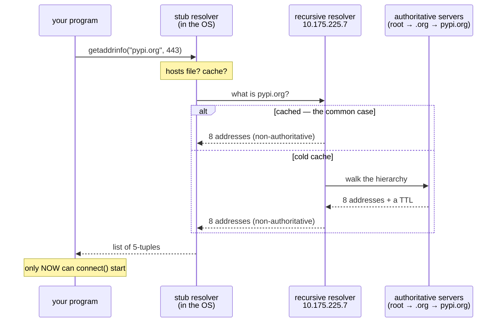

# 2.1 — What resolving a name actually does

## One-line answer

A name is not an address, so before any connection is attempted there is a **separate lookup step**, run by
a different system, which can be slow on its own, fail on its own, and hand two clients two different
answers — and none of that appears in the code you wrote.

---

## The story

🎬 **The scene.** A school sends a message to the parents' group chat: *the trip leaves from the leisure
centre at the weekend, please drop off there.*

Twelve families read the same sentence.

😬 **The naive fix.** Somebody worries it was not clear enough, so they send it again with more emphasis:
*the leisure centre — you know the one.*

💥 **Why it fails.** There are two leisure centres in the town, and a third that closed last year which
half the parents still think of as *the* leisure centre. Four cars go to the right building. Three go to
the one across town. Two drive to a boarded-up car park and phone somebody who does not answer, because
they are already on the bus. **The message was identical for everybody and the destinations were not**,
because each family turned that phrase into a place using their own memory, and their memories were formed
at different times.

💡 **The insight.** A name has to be turned into a location before anyone can travel, **that step happens
separately in each traveller's head**, and it can be stale, ambiguous or simply fail — while the message
that started it all looks perfectly correct.

---

## The idea in plain language

Part [1.1](../01-the-address/1.1-an-address-and-a-port-are-two-questions.md) established that a connection
needs an address and a port. But almost nothing you type is an address. You type `pypi.org`,
`api.groq.com`, `pulse.default.svc.cluster.local`. Those are **names**, and the system call that opens a
connection does not accept names.

So there is a step in between, and it is a genuinely separate piece of machinery.

**Resolution** is the act of turning a name into one or more addresses. **DNS** — the Domain Name System —
is the distributed database that most of that machinery consults. They are not the same thing, and the
difference matters on the day the answer comes from somewhere else entirely, which is part
[2.2](2.2-the-resolver-order-and-the-file-that-wins.md).

### The three parties

**Your program** asks a single question: *what addresses does this name have?* It calls one function and
waits.

**The stub resolver** is the small piece of code inside your operating system that receives that question.
It knows almost nothing. It checks a local file, checks a cache, and if neither answers, it sends the
question over the network to a resolver whose address it was configured with.

**The recursive resolver** is a real server, usually run by your network or your internet provider, whose
job is to go and find out. It walks down the naming hierarchy — the root, then `.org`, then `pypi.org` —
asking authoritative servers along the way, and it caches everything it learns.

**The whole conversation is invisible from your code.** You call one function; a file is read, a cache is
consulted, and possibly several round trips happen across the internet, and then a list comes back.

### The function that does it

Python exposes the standard system interface directly. The `socket` module documentation at
`docs.python.org/3.12/library/socket.html`, checked on **2026-08-26**, gives the signature as
`socket.getaddrinfo(host, port, family=AF_UNSPEC, type=0, proto=0, flags=0)` and says it returns *"a list
of 5-tuples"* of the form `(family, type, proto, canonname, sockaddr)`, where `sockaddr` is *"a
`(address, port)` 2-tuple for `AF_INET`, a `(address, port, flowinfo, scope_id)` 4-tuple for
`AF_INET6`"*.

Read that return type slowly, because three things in it surprise people.

**It is a list, not a single answer.** One name routinely has many addresses. A name is not a machine.

**It carries the port you passed in**, not a port from DNS. **DNS does not know about your port.** You
supplied it, the function threaded it through, and the tuple that comes back is ready to hand to
`connect()`. The two questions from part 1.1 stay separate right to the end.

**It carries a family**, because some of those addresses are IPv4 and some are IPv6, and a socket has to be
created for the right one. The order of that list is not accidental, and part
[2.2](2.2-the-resolver-order-and-the-file-that-wins.md) is about who decides it.

---

## Why Kriya needs it

Day 9 configures `pulse` with the base URL of a free model provider, and that URL is a name. Every request
`pulse` ever makes to a model begins with a resolution you did not write and cannot see.

Day 25 puts `pulse` in a container, where the resolver configuration is **not the one on your machine** —
it is one the container runtime wrote — and the first genuine "it works on my laptop" of this curriculum is
usually a name that resolves differently inside.

Day 41 onward runs `pulse` in Kubernetes, where `pulse` reaches its dependencies by names that exist
nowhere on the public internet and are served by a resolver inside the cluster. Everything in this section
is the foundation of that, and Day 47's most common failure is a name.

Day 61's Prometheus finds what to scrape by name. Day 71's collector ships traces to a name. Day 84's
incident lab includes a service that is up, healthy and unreachable, because of a name.

---

## The mechanism

Ask the question directly, and print exactly what comes back.

```python
# days/day-007-networking-for-operators/lab/resolve.py
"""Resolve a name the way a program does, and show every answer in the order it was given."""

import socket
import sys
import time

name = sys.argv[1] if len(sys.argv) > 1 else "pypi.org"
port = int(sys.argv[2]) if len(sys.argv) > 2 else 443

started = time.monotonic()
try:
    answers = socket.getaddrinfo(name, port, proto=socket.IPPROTO_TCP)
except socket.gaierror as exc:
    print(f"{name}: gaierror [Errno {exc.errno}] {exc.strerror}")
    raise SystemExit(1)
elapsed = time.monotonic() - started

print(f"{name}:{port} -> {len(answers)} answers in {elapsed * 1000:.1f} ms")
for family, _type, _proto, _canon, sockaddr in answers:
    print(f"  {family.name:<10} {sockaddr[0]}")
```

**Line by line:**

- `proto=socket.IPPROTO_TCP` is the argument that stops the list being three times too long. Without it the
  function answers for TCP, UDP **and** raw sockets, so every address appears three times and the output
  suggests the name has far more addresses than it does. **This is the most common misreading of
  `getaddrinfo` output**, and one argument removes it.
- **No `family=` argument**, which leaves the default `AF_UNSPEC` in place, meaning *give me both IPv4 and
  IPv6*. Pinning it to `AF_INET` would hide half of what this part is about.
- `time.monotonic()` rather than the wall clock, because a resolution can take long enough to care about
  and a clock that can be adjusted backwards would occasionally report a negative duration.
- `socket.gaierror` is caught **separately from every other error**, because it is the one that means *the
  name step failed*. The `socket` documentation, checked on **2026-08-26**, describes it as *"a subclass of
  `OSError` … raised for address-related errors by `getaddrinfo()`"*. Catching plain `OSError` here would
  merge a name failure into everything else, which is exactly the confusion this day exists to remove.
- `raise SystemExit(1)` gives a **non-zero exit code**, so a shell can tell a failed lookup from a
  successful one without reading the text.
- `sockaddr[0]` is the address, and taking element zero works for both families even though the IPv6 tuple
  has four elements and the IPv4 tuple has two — the address is first in both.

```bash
uv run python days/day-007-networking-for-operators/lab/resolve.py pypi.org 443
```

**Line by line:** the name and the port are separate arguments, exactly as they are separate questions. The
port never reaches the network; it is only threaded through so the returned tuples are ready to connect
with.

Observed on **2026-08-26**:

```text
pypi.org:443 -> 8 answers in 14.6 ms
  AF_INET6   2a04:4e42:400::223
  AF_INET6   2a04:4e42:600::223
  AF_INET6   2a04:4e42:200::223
  AF_INET6   2a04:4e42::223
  AF_INET    151.101.128.223
  AF_INET    151.101.64.223
  AF_INET    151.101.192.223
  AF_INET    151.101.0.223
```

**Eight answers for one name**, and **the IPv6 ones came first**. Both facts do real work later: the count
is why a single failing address does not mean a failing service, and the ordering is why a machine with
broken IPv6 can be slow to reach a service that is completely healthy.

### The same question, asked as an operator

`nslookup` asks DNS directly rather than going through your program's resolver, which makes it a different
instrument rather than a nicer one.

```bash
nslookup pypi.org
```

**Line by line:** no flags, because the default behaviour is the one you want — ask the configured resolver
for the address records of this name. `nslookup` is the instrument available on this machine; `dig`, which
most operators reach for and which prints far more, is **not installed here** and is 🅿️ parked until Day 21
brings WSL2.

Observed on **2026-08-26**:

```text
Non-authoritative answer:
Server:  UnKnown
Address:  10.175.225.7

Name:    pypi.org
Addresses:  2a04:4e42:400::223
	  2a04:4e42::223
	  2a04:4e42:200::223
	  2a04:4e42:600::223
	  151.101.128.223
	  151.101.0.223
	  151.101.192.223
	  151.101.64.223
```

**Three lines here are worth more than the addresses.**

`Server: UnKnown` and `Address: 10.175.225.7` name **the resolver that answered**. That address is a
private one, so the resolver sits on this local network rather than on the internet — a home router, most
likely, forwarding onward. **You have just discovered a dependency you did not know you had**, and it is on
the critical path of every outbound request this machine ever makes.

`Non-authoritative answer` means **this came from a cache**, not from the servers that own the name. That
single word is the whole of part [2.3](2.3-ttl-and-the-change-that-has-not-happened-yet.md) in advance: the
answer you got is a copy of an answer somebody else received earlier.



---

## When it breaks

**The name does not exist.** The clean failure, and the only one of the three that is honest.

```text
$ uv run python days/day-007-networking-for-operators/lab/resolve.py no-such-host-kriya-day7.invalid 80
no-such-host-kriya-day7.invalid: gaierror [Errno 11001] getaddrinfo failed
```

**What it says:** `getaddrinfo failed`, which is almost content-free.

**What it actually means:** the resolver was reached, understood the question, and reported that no such
name exists. **Errno 11001 is Windows' `WSAHOST_NOT_FOUND`.** On Linux the same condition prints
`[Errno -2] Name or service not known`, and the negative number is not a typo — the `EAI_*` codes are a
separate numbering space from ordinary errnos, which is why they are negative and why searching for
"errno -2" finds nothing useful.

**The smallest fix:** check the spelling, then check whether you are on the network that can see this name
at all. A name internal to a company or a cluster does not exist from outside it, and produces this exact
error.

**Why the message is so poor:** the function reports *the lookup failed*, and the reason lives in a
separate value that Python folds into one string. Part
[2.4](2.4-when-a-name-fails-nxdomain-servfail-and-silence.md) is entirely about pulling those reasons
apart, because *does not exist*, *the resolver is broken* and *nobody answered* need three different
responses and produce nearly the same message.

**The name resolves and the connection still fails.** The distinction that saves the most time.

```text
$ curl -sS -o /dev/null http://no-such-host-kriya-day7.invalid/ ; echo "exit=$?"
curl: (6) Could not resolve host: no-such-host-kriya-day7.invalid
exit=6
$ curl -sS -o /dev/null http://127.0.0.1:8099/ ; echo "exit=$?"
curl: (7) Failed to connect to 127.0.0.1 port 8099 after 2045 ms: Could not connect to server
exit=7
```

**What it says:** two failures, two sentences.

**What it actually means:** **exit 6 is a name failure and exit 7 is a connection failure**, and they are
not adjacent problems. Six means nothing was ever attempted, because there was no address to attempt
against. Seven means an address was found, a connection was tried, and something refused it. The official
list at `everything.curl.dev/cmdline/exitcode.html`, checked on **2026-08-26**, describes 7 as *"curl
managed to get an IP address to the machine and it tried to set up a TCP connection to the host but
failed."*

**The smallest fix:** read the exit code before the sentence. Part
[3.4](../03-the-connection/3.4-connection-refused-versus-connection-timed-out.md) completes this into the
three-way test the whole day builds towards.

**Resolution is slow and everything reports success.** The failure with no error in it at all.

```text
pypi.org:443 -> 8 answers in 5021.4 ms
```

**What it says:** success.

**What it actually means:** the first resolver in the list did not answer, the stub resolver waited out its
own timeout, and a second one answered. **Your request took five seconds and every single component
reports success** — DNS worked, the connection worked, the server returned 200, and somebody waited five
seconds for a page that renders in a tenth of one.

**The smallest fix:** there is none inside your program, which is the point. The repair is in the resolver
configuration, and the *diagnosis* is having measured the lookup separately from the request — which is why
`resolve.py` prints a duration, and why part
[4.2](../04-timeouts/4.2-the-four-timeouts-of-one-request.md) splits one request into four measurable
phases.

**Why it is so often missed:** almost nobody instruments name resolution, because it is not in the code.
There is no line to put a timer around; the whole thing happens inside one function call that has always
been fast.

**Half the addresses do not work.** The one that gets logged as flakiness.

```text
pypi.org:443 -> 8 answers in 14.6 ms
  AF_INET6   2a04:4e42:400::223
  AF_INET6   2a04:4e42:600::223
```

**What it says:** eight healthy answers.

**What it actually means:** on a machine or network with no working IPv6 route, the four `AF_INET6`
addresses are unreachable, and they are **first in the list**. A client that tries them strictly in order
stalls on each one until it gives up. The symptom is a service that is *intermittently slow to connect* and
perfectly healthy from everywhere else.

**The smallest fix:** the industry answer is not to remove IPv6 but to stop trying addresses strictly in
order — start a second attempt on the other family after a short delay, and keep whichever connects first.
That is what browsers and modern client libraries do, and it turns a stall into an imperceptible pause.
`curl` will tell you which family actually won: `--write-out '%{remote_ip}'` reported
`2a04:4e42:400::223` here, meaning IPv6 was used and works on this machine.

**Why it belongs in a networking day rather than a client-library day:** the failure is created by the
resolver's ordering and repaired by the connection logic, so anybody who owns only one of those two will
conclude the other one is broken.

---

## In production

**What a professional writes instead of the teaching version.** They do not call `getaddrinfo` at all —
their HTTP client does it — but they **treat name resolution as a dependency with a latency and an error
rate**, exactly like a database. Concretely: a connection pool, so a name is resolved once and the
connection reused for thousands of requests rather than resolved per request; a client library whose
timeout covers the resolution phase and not merely the transfer; and, in a cluster, an awareness of which
resolver is on the path, because it is a shared single point of failure that no service owner believes they
depend on.

**What degrades at scale.** Resolution cost is invisible at one request per second and dominant at ten
thousand. A service that resolves its dependency's name on every outbound call generates a DNS query per
call, and at fleet scale that is a denial of service aimed at your own resolver — which then answers slowly
for everything, including the services that were behaving. **The failure is superlinear**: the slow
resolver causes retries, the retries cause more queries, and the queue grows faster than it drains. This is
a real and repeated cause of cluster-wide outages, and the fix is always the same shape — cache, pool, and
stop asking.

**The failure that only shows with real traffic.** The ordering problem above. With one client on one
laptop, a stalled IPv6 attempt is a pause somebody shrugs at. With real traffic, a fraction of every
request pays it, and that fraction lands entirely in the tail: the median is untouched, the ninety-ninth
percentile is seconds, and the graph looks like an intermittent network fault rather than a resolution
ordering decision. **You cannot find this in the median**, which is why Day 65's histograms exist.

**The review comment a senior engineer leaves.** *"This client is constructed inside the request handler,
so we resolve the name and open a new connection for every call. Move it to module scope so the pool is
shared. Right now our dependency's resolver sees one query per request from us, and we are one of forty
services doing that."*

**The signal you would alert on.** **Resolution failures and resolution latency, as their own series** —
not folded into request errors, because the response is different: a name failure is a configuration or
infrastructure problem, and a connection failure is a capacity or health problem. Concretely, a counter of
lookups by outcome and a histogram of lookup duration, both labelled by the name being resolved. You would
alert on **the failure rate crossing zero at all** for a name your service depends on, because healthy
resolution failure is not a thing. You would **not** alert on lookup latency directly — it is far too
noisy, it is shared with every other tenant of that resolver, and its variance is not yours to control.
Alert on the request latency it feeds, and use the lookup histogram to explain it.

**Blast radius.** This part only reads. It sends a DNS query for a name you type and prints the answer,
which changes nothing, anywhere. **The capability worth naming is the dependency it reveals rather than
anything it does**: every outbound call your service makes passes through a resolver you did not choose,
did not configure and cannot see, and the worst case is that this resolver becomes unavailable — at which
point every dependency of your service appears to be down simultaneously, including the ones that are
perfectly healthy. Anybody who can change that resolver's configuration, or the records it serves, can
redirect your traffic without touching your service at all. What bounds it here is that resolution is a
**read**: nothing in this part writes a record, changes a resolver, or edits a name in any way.

**Cost.** `0` model calls, `0` tokens, `0` CI minutes, `0` disk, negligible RAM. **Network: a handful of
DNS queries, each a few hundred bytes**, which is the first outbound traffic in this curriculum and is
free. No account, key or card is involved.

**The interview question.** *"A user reports that your service is slow. Traces show your handler spent four
seconds on one outbound HTTP call. The dependency's own logs show that request took twelve milliseconds.
Where did the four seconds go?"* The answer that lands does not start with the network: *"Almost certainly
before the request existed. That span probably covers name resolution, connection setup and TLS as well as
the exchange, and the dependency can only see the part after it received bytes. The first thing I would do
is split the measurement into phases — lookup, connect, TLS, first byte, total — which `curl --write-out`
gives you for free on a single request. The two usual causes are a resolver timing out on its first
configured address before a second one answers, and an address list that puts an unreachable family first
so the client stalls before falling back. Both look like a slow dependency and neither is one. The
structural fix is a shared connection pool, because it makes the whole lookup-and-connect phase happen once
instead of per request."*

---

## Check yourself

```bash
uv run python days/day-007-networking-for-operators/lab/resolve.py pypi.org 443 && uv run python days/day-007-networking-for-operators/lab/resolve.py no-such-host-kriya-day7.invalid 80; echo "exit=$?"
```

A success and a failure back to back, with the exit code proving the second one failed. **The two numbers
to carry forward are the answer count and the duration** — one name gave eight addresses, and the lookup
was a measurable step that happened before anything connected.

**Say out loud, without scrolling up:** *name the three parties involved in turning `pypi.org` into an
address, say which of them your program actually talks to, and say what `Non-authoritative answer` tells
you about where your answer came from.*
