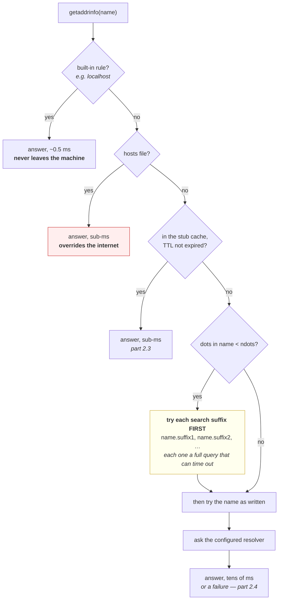

# 2.2 — The resolver's order, and the file that wins before DNS

## One-line answer

Resolution is a **list of places consulted in a fixed order**, and a local file, a search suffix or a
built-in rule can answer before DNS is ever asked — which is why a name can behave differently on two
machines that query the identical DNS server.

---

## The story

🎬 **The scene.** A shared flat keeps a paper list of takeaway numbers stuck to the fridge door. Four
people, one list, built up over about two years.

😬 **The naive fix.** The pizza place moves and changes its number. One flatmate updates the entry in her
phone and tells everybody in the group chat.

💥 **Why it fails.** Nobody edits the fridge. Three of the four never open the group chat before ordering —
they walk into the kitchen, read the door, and dial. **The list on the door is not consulted after the
phone; it is consulted instead of it**, because it is the thing physically in front of you. Two of them
reach a disconnected number and decide the pizza place has closed down.

💡 **The insight.** When several sources can answer the same question, **the one that answers first wins
outright**, and it does not matter how correct or how recent the others are. Changing the authoritative
answer does nothing for anybody whose lookup never reaches it.

---

## The idea in plain language

Part [2.1](2.1-what-resolving-a-name-actually-does.md) drew resolution as one function call reaching a
resolver. That was true and incomplete. Inside that call is an **ordered list of sources**, and the first
one to produce an answer ends the search.

### The order, in the sequence it is consulted

**A built-in rule.** Some names never leave the machine. `localhost` is the famous one, and on some systems
it is answered by code rather than by any file or server.

**The hosts file.** A plain text file mapping addresses to names, which predates DNS entirely and still
outranks it. On this machine it is at `C:\WINDOWS\System32\drivers\etc\hosts`; on Linux it is
`/etc/hosts`. **One line in it silently overrides the entire internet for that name.**

**The stub resolver's own cache.** An answer received recently, held for as long as its TTL allows, which
is part [2.3](2.3-ttl-and-the-change-that-has-not-happened-yet.md).

**Search suffixes.** If the name you asked for looks *incomplete*, the resolver may try appending domains
to it before, or as well as, trying it as written. This is the source of the most expensive surprise in
this part.

**DNS itself**, at last, to the configured resolver.

### Why "looks incomplete" is a real rule with a number attached

A resolver has to decide whether `api` means the literal name `api` or a short form of
`api.something.internal`. The rule used on Unix-like systems is called **`ndots`**: if the name contains
**fewer than `ndots` dots**, try the search suffixes first, and only try the name as given afterwards.

The default is `ndots:1`, which means a name with no dots gets the suffix treatment. **Kubernetes sets
`ndots:5`**, which is a much bigger deal than it sounds: every name with fewer than five dots — which is
essentially every name a human types, including `pypi.org` and `api.groq.com` — gets every search suffix
tried before the name itself. Part [2.4](2.4-when-a-name-fails-nxdomain-servfail-and-silence.md) shows what
that costs when the suffixes fail slowly.

**The end of a name matters too.** A name ending in a dot — `pypi.org.` — is **fully qualified**: the
trailing dot says *this is complete, do not append anything*. It looks like a typo and it is a control
character.

---

## Why Kriya needs it

Day 25 runs `pulse` in a container. A container gets its own resolver configuration file, written by the
runtime — so the resolver, the search suffixes and `ndots` are all different from your machine's, and a
name that worked outside may not work inside, or may work far more slowly.

Day 41 onward is Kubernetes, where `ndots:5` is the default and where every pod's resolver configuration
carries a search list of cluster suffixes. **A large fraction of "DNS is slow in our cluster" reports are
this setting**, and knowing it before you meet it is the difference between a morning and a week.

Day 47 debugs a service that cannot reach another service by name. The first question is whether the name
was ever sent as written.

Day 84's incident lab includes a machine where one name resolves to the wrong address, and the cause is a
line somebody added to a hosts file during an earlier incident and never removed.

---

## The mechanism

Ask for a name that everybody assumes is trivial, and look at what actually comes back.

```bash
uv run python days/day-007-networking-for-operators/lab/resolve.py localhost 80
```

**Line by line:** the same script from part [2.1](2.1-what-resolving-a-name-actually-does.md), unchanged.
The interesting thing here is not the tool but the name: `localhost` is the one name every developer types
daily and nobody has ever looked up.

Observed on **2026-08-26**:

```text
localhost:80 -> 2 answers in 0.5 ms
  AF_INET6   ::1
  AF_INET    127.0.0.1
```

**Two answers, and the IPv6 one is first.** Sit with that, because it is a bug waiting to happen: part
[1.3](../01-the-address/1.3-binding-127-0-0-1-versus-0-0-0-0.md) had you bind a server to `127.0.0.1`, and
a client that connects to `localhost` will try **`::1` first** — a different address, which that server is
not listening on.

**And the sub-millisecond duration says no network was involved.** Compare it with the fourteen
milliseconds `pypi.org` took. This answer came from inside the machine.

### Where did it come from, then?

```bash
grep -v '^\s*#' /c/WINDOWS/System32/drivers/etc/hosts | grep -v '^\s*$'
```

**Line by line:**

- `grep -v '^\s*#'` drops every comment line, because the file ships almost entirely as documentation and
  reading it raw teaches you nothing about what is active.
- The second `grep -v '^\s*$'` drops blank lines, leaving **only the entries that are actually in force**.
- The two filters together are the habit worth keeping: **read a configuration file as the machine reads
  it**, not as the person who wrote the comments intended.

Observed on **2026-08-26**:

```text
```

**Nothing. The file has no active entries at all.** Every line in it, including the two for `localhost`, is
commented out — this version of the file even says so in prose: *"localhost name resolution is handled
within DNS itself."*

So `localhost` was answered by a **built-in rule**, before the hosts file, before the cache, before DNS.
That is source one in the list above, demonstrated: a name that never leaves the machine and cannot be
changed by editing anything.

### The suffix rule, measured

This is the observation that changes how you read a slow cluster.

```python
# days/day-007-networking-for-operators/lab/order.py
"""Time three lookups that all fail, and show that the shape of the name decides the cost."""

import socket
import time

NAMES = [
    "kriyanosuchhost",  # no dots at all — the search list applies
    "kriyanosuchhost.invalid",  # one dot — treated as written
    "no-such-host-kriya-day7.invalid",  # one dot, different name — the control
]

for name in NAMES:
    started = time.monotonic()
    try:
        socket.getaddrinfo(name, 80, proto=socket.IPPROTO_TCP)
        outcome = "OK"
    except socket.gaierror as exc:
        outcome = f"gaierror {exc.errno}"
    print(f"{name:<34} {outcome:<16} {(time.monotonic() - started) * 1000:7.0f} ms")
```

**Line by line:**

- **Every name in the list is guaranteed to fail**, and that is the design. `.invalid` is a reserved
  top-level domain that is guaranteed never to exist, so the comparison is between three *identical
  outcomes* and the only variable left is the shape of the name.
- The first name has **no dots**, so the search list applies to it.
- The second is the same string with `.invalid` appended, so it has one dot and is treated as written.
- The third is a completely different name with one dot, present as a **control**: if names two and three
  take similar times, the difference in name one is about dots and not about that particular string.
- `time.monotonic()` around each call individually, because the whole point is the per-name cost.
- The failure is caught and **printed rather than raised**, because a script that stops at the first
  failure cannot compare three failures.

```bash
uv run python days/day-007-networking-for-operators/lab/order.py
```

**Line by line:** no arguments — the three names are the experiment, and putting them in the file rather
than on the command line means the measurement is reproducible by running the same thing again.

Observed on **2026-08-26**:

```text
kriyanosuchhost                    gaierror 11001      2718 ms
kriyanosuchhost.invalid            gaierror 11001        32 ms
no-such-host-kriya-day7.invalid    gaierror 11001        15 ms
```

**Two thousand seven hundred milliseconds against thirty-two.** Same outcome, same machine, same resolver,
same instant. The only difference is that the first name has no dot in it, so the resolver tried it with
each configured suffix attached before trying it bare — and every one of those attempts had to fail and
time out first.

**Almost a factor of a hundred, for a name that does not exist either way.** If that name were on a request
path, the request would have taken nearly three seconds to fail, and nothing in the application would have
any idea why.



### Reading your own configuration

```bash
ipconfig /all | grep -iE 'DNS Servers|Search|Suffix'
```

**Line by line:**

- `ipconfig /all` is the Windows instrument for this; the Linux equivalent is reading `/etc/resolv.conf`
  directly, and inside a container that file is the **only** thing worth reading.
- `grep -iE` with the three terms narrows a very long output to the three facts that matter: which
  resolvers will be asked, in what order, and what suffixes get appended.
- **Do not paste this output into a public repository.** It names your network. Read it, write down the
  count of resolvers and the count of suffixes, and leave the values on your screen. ⚠️ Principle 9 is
  about secrets in git, and network topology is the same category of thing.

**What to look for:** more than one DNS server means a failover path with a timeout on it, which is the
five-second lookup from part [2.1](2.1-what-resolving-a-name-actually-does.md). More than one search suffix
means the multiplier you just measured.

**The Linux and container version**, 🅿️ parked until Day 21 and Day 25 because neither exists here yet:

```bash
# 🅿️ PARKED — Linux / inside a container. This machine has no /etc/resolv.conf.
# cat /etc/resolv.conf
```

**Line by line:** `nameserver` lines are the resolvers, in order. `search` is the suffix list. `options
ndots:N` is the number from the rule above, and in a Kubernetes pod it will say `ndots:5`. **Three lines
explain most cluster DNS behaviour**, and this is the file to open first on Day 47.

---

## When it breaks

**A hosts entry somebody added during an incident and never removed.** The longest-lived bug in this part.

```text
$ uv run python days/day-007-networking-for-operators/lab/resolve.py api.example.com 443
api.example.com:443 -> 1 answers in 0.3 ms
  AF_INET    10.0.0.42
```

**What it says:** one address, resolved instantly.

**What it actually means:** **the sub-millisecond duration is the tell.** A real DNS answer costs tens of
milliseconds; this cost nothing, so it came from inside the machine. Somebody pinned this name to a fixed
address in the hosts file — probably to test against a staging box during an outage — and the entry
outlived the incident by months. Every other machine in the world resolves this name correctly and this one
does not.

**The smallest fix:** open the hosts file, delete the line.

**Why it is so hard to find:** every DNS diagnostic you reach for is wrong here. `nslookup` **does not read
the hosts file** — it queries DNS directly — so `nslookup` returns the correct public address while your
program keeps using the wrong one, and the two disagree with total confidence. **The tool that tells the
truth is the one that goes through the same path your program does**, which is why `resolve.py` calls
`getaddrinfo` rather than doing DNS itself.

**Everything in the cluster is slow, and DNS looks fine.** The `ndots` trap, at scale.

```text
kriyanosuchhost                    gaierror 11001      2718 ms
```

**What it says:** a failed lookup took nearly three seconds.

**What it actually means:** in a Kubernetes pod with `ndots:5` and a search list of several suffixes, a
name like `api.groq.com` — which has two dots, fewer than five — is tried as
`api.groq.com.default.svc.cluster.local`, then `api.groq.com.svc.cluster.local`, then
`api.groq.com.cluster.local`, and only then as `api.groq.com`. **Four queries where you expected one**, and
for an external name the first three are guaranteed failures. Multiply by every pod and every request and
the cluster's DNS service is doing four times the work it should for no benefit whatsoever.

**The smallest fix:** end the external name with a dot — `api.groq.com.` — which marks it fully qualified
so no suffix is appended, and turns four queries into one. The heavier fix is a pod-level `dnsConfig` that
lowers `ndots`, which is Day 47's material.

**Why it is not obvious:** the queries all succeed eventually, so error rates are clean. The only visible
symptom is latency, and it is spread evenly across everything, so it reads as "the network is slow today".

**A name works on the host and not in the container.** The first containers surprise, on Day 25.

```text
$ docker run --rm pulse:latest curl -sS https://api.groq.com/ ; echo "exit=$?"
curl: (6) Could not resolve host: api.groq.com
exit=6
```

**What it says:** the name does not resolve.

**What it actually means:** the container has its **own** `/etc/resolv.conf`, written by the container
runtime, pointing at a resolver that may not be the one your host uses and may not be reachable from the
container's network. Nothing is wrong with the name; the machinery underneath it was replaced.

**The smallest fix:** read `/etc/resolv.conf` **inside the container**, not on the host, and confirm the
resolver it names is reachable from there.

**The distinction worth holding:** exit 6 again — a name failure, not a connection failure. If it were
exit 7, the name resolved and the container's *network* is the problem, which is a completely different
investigation.

**`nslookup` says the name is fine and the application disagrees.** The one that makes people doubt
themselves.

```text
$ nslookup api.example.com
Name:    api.example.com
Address: 93.184.216.34
$ uv run python days/day-007-networking-for-operators/lab/resolve.py api.example.com 443
api.example.com:443 -> 1 answers in 0.3 ms
  AF_INET    10.0.0.42
```

**What it says:** two different addresses for one name, from two commands run one after the other.

**What it actually means:** neither tool is lying. They consult **different lists**. `nslookup` speaks DNS
and only DNS; `getaddrinfo` consults the built-in rules, the hosts file and the cache first. When they
disagree, **the application is right about what it will do and `nslookup` is right about what DNS holds**,
and the gap between them is exactly the set of sources that sit in front of DNS.

**The smallest fix:** trust the tool that shares your program's path. On Linux, `getent hosts <name>` is the
one that does; it is 🅿️ parked here because it does not exist on this machine, which is precisely why
`resolve.py` was written in the first place.

---

## In production

**What a professional writes instead of the teaching version.** They do not edit hosts files on servers at
all — a hosts entry is an untracked, unreviewable, machine-local override with no expiry, and it is the
single worst place to put a routing decision. When a temporary override is genuinely needed during an
incident, it goes in with a comment naming the incident and a task to remove it, because **the hosts file
has no TTL and nothing will ever expire it for you**. In a cluster, the equivalent lever is a `hostAliases`
entry in a pod spec, which at least lives in version control and disappears with the pod.

**What degrades at scale.** The `ndots` multiplier. One pod making one call per second with three useless
search-suffix queries in front of it is invisible. A thousand pods doing the same is four thousand queries
per second against a cluster DNS service sized for one thousand, and when that service starts shedding
load, **every service in the cluster degrades simultaneously and none of them changed**. This is one of the
most common cluster-wide incidents there is, and the trigger is usually just growth: the setting was always
wrong and the traffic finally made it matter.

**The failure that only shows with real traffic.** The resolver failover timeout. With two resolvers
configured, a healthy first resolver means the second is never used and the configuration is never tested.
When the first one goes slow rather than down — the worst failure mode, because it does not trigger any
health check — **every lookup pays the full timeout before falling back**, and the service's latency jumps
by whole seconds with no error, no restart and no deploy to correlate against.

**The review comment a senior engineer leaves.** *"This chart hardcodes the external API's hostname without
a trailing dot, and our pods run with `ndots:5`. Every call makes three failing cluster-DNS queries before
the real one. Add the trailing dot, or set `dnsConfig.options.ndots` on this deployment. It is one
character and it removes three-quarters of our DNS traffic."*

**The signal you would alert on.** **Queries by response code, per resolver**, which surfaces the useless
ones directly: a sustained non-zero rate of *name does not exist* answers is nearly always a search-suffix
multiplier or a typo in a configuration, and both are worth fixing. You would also record **which resolver
answered**, so a failover becomes visible as a step change in a graph rather than as unexplained latency.
You would **not** alert on hosts-file contents — there is nothing to sample, it changes rarely, and the
right control is configuration management rather than monitoring. ⚠️ And you would **not** put resolved
names or addresses into logs indiscriminately: the set of names a service resolves is a fairly complete map
of its dependencies, which is exactly what an attacker wants first.

**Blast radius.** The reading in this part changes nothing. **The capability this part introduces and
deliberately does not exercise is editing the hosts file**, and it is worth naming precisely because it
looks trivial. Worst case: one line redirects a name — any name, including your identity provider or your
package registry — to an address of somebody's choosing, for every program on that machine, silently, with
no certificate warning if the attacker also controls a certificate, and with every DNS diagnostic
continuing to report the correct public answer. Who can trigger it: anybody with administrator rights on
the machine, which on a laptop is the person using it. What bounds it: the file is not readable-writable by
ordinary users, changes to it should come from configuration management rather than hands, and on a server
it should be a **reviewed, version-controlled file** like any other configuration. ⚠️ **This part
deliberately does not have you edit it**, because the experiment requires administrator rights and its
failure mode is a machine that cannot reach something you need — and no lesson is worth that.

**Cost.** `0` model calls, `0` tokens, `0` CI minutes, `0` disk, negligible RAM. **Network: three failing
DNS queries plus whatever the search suffixes multiplied them into** — the largest of which took under
three seconds and sent a few kilobytes. Free.

**The interview question.** *"A name resolves correctly with `nslookup` but your application connects to
the wrong address. What is happening, and how would you confirm it?"* The answer that lands names the
mechanism rather than guessing: *"They are consulting different lists. `nslookup` speaks DNS directly,
while the application goes through `getaddrinfo`, which checks built-in rules, the hosts file and the local
cache before DNS is ever asked. So the most likely cause is a hosts entry — usually one somebody added
during an incident and never removed. I would confirm it with a lookup that goes through the same path the
application does, `getent hosts` on Linux or a two-line `getaddrinfo` call, and I would check the *duration*
as well as the answer: a sub-millisecond result means nothing left the machine, which is the tell. The
related version of this in a cluster is `ndots:5`, where the search suffixes are tried before the name as
written — same shape of surprise, which is that the name you typed is not necessarily the name that got
asked."*

---

## Check yourself

```bash
uv run python days/day-007-networking-for-operators/lab/order.py && uv run python days/day-007-networking-for-operators/lab/resolve.py localhost 80
```

The suffix multiplier and the built-in answer, in one run. **The two numbers to remember are the ratio —
roughly eighty to one between a dotless name and a dotted one on this machine — and the sub-millisecond
`localhost` lookup that proves some answers never reach the network at all.**

**Say out loud, without scrolling up:** *list the sources consulted before DNS, in order; say what a
trailing dot on a name does and why it matters in Kubernetes; and explain why `nslookup` and your
application can disagree about the same name without either being broken.*
