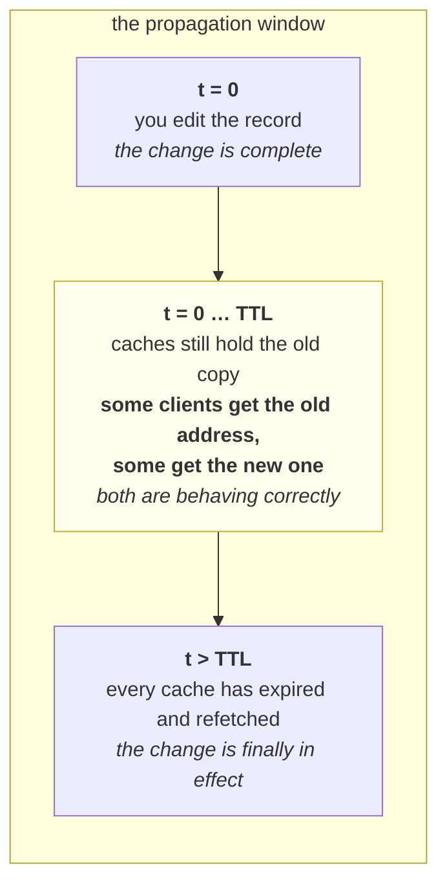

# 2.3 — TTL, and the change that has not happened yet

## One-line answer

Every DNS answer arrives with a **lifetime attached**, so a name change does not take effect when you make
it — it takes effect gradually, as each cache along the way expires its own copy, and during that window
different clients get different answers and all of them are behaving correctly.

---

## The story

🎬 **The scene.** A small café puts its opening times on a chalkboard outside, and a neighbour photographs
it and posts the photo in the local community group.

😬 **The naive fix.** The café decides to open an hour earlier from Monday. They wipe the chalkboard and
write the new times on it that morning.

💥 **Why it fails.** For the next fortnight, people keep arriving at the old time. The photo in the group is
still there, four people have screenshotted it, one has it saved in a note, and somebody printed it and
stuck it in a shop window down the road. **The café changed the original and every copy carried on being
correct-looking and wrong.** Nobody involved did anything careless: they all read a copy that nobody told
them had expired, because copies do not come with expiry dates unless somebody puts one on.

💡 **The insight.** Once an answer has been copied, changing the source is not the same as changing the
answer. **The only thing that determines when a copy stops being used is how long its holder was told to
keep it** — and that decision was made before anybody knew a change was coming.

---

## The idea in plain language

Part [2.1](2.1-what-resolving-a-name-actually-does.md) noted that `nslookup` prefixed its answer with
*Non-authoritative answer*, meaning the answer came from a cache. This part is about what that costs.

Every DNS record carries a **TTL** — time to live — which is a number of seconds. It is not a timestamp and
not an expiry date; it is a **budget handed to whoever receives the record**, saying *you may reuse this
answer for up to this many seconds, then ask again*.

### There is not one cache; there are several, in a line

**The application's own cache**, if its runtime or its HTTP client keeps one. Some do, some do not, and
some keep one *forever* — which is a real and famous hazard.

**The stub resolver's cache**, inside the operating system.

**The recursive resolver's cache**, which is shared by everybody on that network and is usually the biggest
one.

**And the record itself**, at the authoritative server, which is the only copy you can actually edit.

A change you make at the bottom of that list becomes visible at the top **only as each layer's budget runs
out**, and the layers expire independently. So the propagation of a DNS change is not an event. It is a
window, and its width is roughly the largest TTL involved.

### The two numbers people confuse

**The configured TTL** is what the record's owner set — say three hundred seconds.

**The remaining TTL** is what a cache reports: how much of that budget is left on *this copy*. It counts
down, hits zero, and the next query refetches and resets it.

Reading a remaining TTL and treating it as the configured value is a common mistake, and it makes changes
look faster or slower than they will be.

---

## Why Kriya needs it

Day 9 pins the base URL of a free model provider. If that provider moves an endpoint, your service follows
on the provider's TTL schedule, not on yours — and knowing that is the difference between "our integration
broke" and "we are in the propagation window".

Day 41 onward runs in Kubernetes, where a Service's address changes whenever the Service is recreated and
where every pod's DNS answers are cached. **A cached address for a pod that no longer exists is one of the
two or three most common cluster failures**, and it produces a connection error rather than a name error,
which sends people looking in entirely the wrong place.

Day 105's blue-green and Day 106's canary both need to move traffic between two running versions. If the
switch is implemented by changing a name, **the TTL is the rollback time** — the slowest part of your
emergency response is a number somebody set months earlier.

Day 84's incident lab includes a change that was made correctly and has not taken effect, and the whole
skill is recognising that shape before you make things worse by changing something else.

---

## The mechanism

First, prove the cache exists by measuring it.

```python
# days/day-007-networking-for-operators/lab/cached.py
"""Resolve the same name five times in a row and print each duration."""

import socket
import time

NAME = "docs.python.org"

for attempt in range(1, 6):
    started = time.monotonic()
    socket.getaddrinfo(NAME, 443, proto=socket.IPPROTO_TCP)
    print(f"lookup {attempt}: {(time.monotonic() - started) * 1000:7.2f} ms")
```

**Line by line:**

- **The same name, five times, with nothing in between.** The experiment is deliberately boring: if
  resolution were a network operation every time, all five durations would be similar.
- `range(1, 6)` starts at one so the printed attempt numbers read as attempts rather than as indices — a
  small thing that matters when you paste output into an incident note.
- **No error handling at all**, and that is deliberate: this name is expected to resolve, and if it does
  not, the traceback is more informative than any message I would write. Principle 10 — let the unexpected
  surface.
- `docs.python.org` rather than a name from earlier parts, so this measurement starts with a **cold** cache
  rather than one part 2.1 already warmed.

```bash
uv run python days/day-007-networking-for-operators/lab/cached.py
```

**Line by line:** run it once, then run it again immediately, and notice that the second run has no slow
first line — the cache outlives the process, because it does not belong to the process.

Observed on **2026-08-26**:

```text
lookup 1:   79.00 ms
lookup 2:    0.00 ms
lookup 3:    0.00 ms
lookup 4:    0.00 ms
lookup 5:    0.00 ms
```

**Seventy-nine milliseconds, then nothing at all.** Not "faster" — below the resolution of the clock. The
first lookup crossed a network and the other four did not leave the machine, and that is the entire
argument for why DNS caching exists: without it, every request everywhere would pay that seventy-nine
milliseconds.

**It is also the entire argument for why DNS changes are slow**, because those are the same fact.

### Now read the budget itself

```bash
nslookup -debug -type=A example.com 2>&1 | grep -iE "ttl|internet address"
```

**Line by line:**

- `-debug` is the flag that makes `nslookup` print the record fields rather than a tidied summary. **The
  TTL is not in the normal output at all**, which is why most people have never seen one.
- `-type=A` asks specifically for IPv4 address records, so the output is one record type rather than a
  mixture, and the TTLs are comparable to each other.
- `2>&1` because `nslookup` writes some of its detail to standard error, and a pipe that only carries
  standard output silently loses half of it.
- `grep -iE "ttl|internet address"` keeps the address and its lifetime side by side, which is the pairing
  that matters — a TTL with no record attached tells you nothing.

Observed on **2026-08-26**, run once and then again a few seconds later:

```text
	ttl = 2 (2 secs)
	ttl = 2 (2 secs)
--- six seconds later ---
	ttl = 109 (1 min 49 secs)
	ttl = 109 (1 min 49 secs)
```

**This is the whole idea in four lines, and it is worth reading twice.**

The first pair says this cached copy has two seconds of life left. Six seconds later the number is not
negative and it is not zero — it is **larger**. The budget ran out, the cached copy was discarded, the
resolver went and fetched a fresh one, and the fresh copy arrived with its own full remaining lifetime.

**So the number you see is a countdown on a copy, not a property of the name.** Ask at the wrong moment and
you will conclude the TTL is two seconds when it is nothing of the sort.



**The operational consequence is the middle box.** During the window, your system is running two answers at
once, and no amount of correctness at either end changes that. Every deployment strategy that moves traffic
by changing a name has this box in it.

### The lever nobody pulls in time

The way to make a change fast is to **lower the TTL before you make it**, not while you are making it. Drop
it to something small, wait longer than the *old* TTL so every cache has picked up the small one, then make
the change, then put the TTL back up.

**That preparation has to happen before the change.** Lowering the TTL at the moment you need speed does
nothing, because the caches holding the old answer are also holding the old TTL — you are changing a number
that the machines you care about will not read until they have already expired the thing you were trying to
hurry. ⚠️ **This is the single most valuable paragraph in this part**, and it is entirely about sequence.

---

## When it breaks

**The change is correct and nothing happened.** The one people escalate too early.

```text
$ nslookup -debug -type=A api.example.com | grep -iE "ttl|internet address"
	internet address = 203.0.113.10
	ttl = 271 (4 mins 31 secs)
```

**What it says:** the old address, with four and a half minutes left.

**What it actually means:** you are in the propagation window and everything is working. The record was
changed; this cache has not expired its copy yet, and it is not obliged to.

**The smallest fix:** wait out the remaining TTL, and check again — against the authoritative server rather
than a cache, so you are looking at the source instead of a copy.

**Why the wrong response is expensive:** the instinct is to change something else — edit another record,
restart something, roll back — and now two changes are in flight with overlapping windows, and nobody can
attribute anything. **Recognising this shape is the skill**; the correct action is to do nothing for a
measured period, which is genuinely hard under pressure.

**A client that never expires anything.** The nastiest one, because time does not fix it.

```text
$ curl -sS -o /dev/null -w '%{remote_ip}\n' https://api.example.com/
203.0.113.99
# ... every other client on the machine now uses 203.0.113.10
```

**What it says:** one process is using an address that nothing else is using.

**What it actually means:** the process resolved the name once at startup and cached the result **for its
own lifetime**, ignoring the TTL entirely. Some runtimes and some HTTP clients do this by default. The
window here is not the TTL; **it is however long the process runs**, which for a server is potentially
months.

**The smallest fix:** restart the process, which is a workaround rather than a fix. The actual fix is
configuring the client to honour TTLs, or using a connection pool that re-resolves.

**Why it is worth knowing before you meet it:** every other layer expires correctly, so all your
diagnostics say the change has propagated. The only observation that reveals it is **which address that
particular process is connecting to**, which is why `%{remote_ip}` is a variable worth remembering.

**A cached address for something that no longer exists.** The cluster classic.

```text
$ curl -sS -o /dev/null --connect-timeout 3 http://10.244.1.17:8000/ ; echo "exit=$?"
curl: (28) Connection timed out after 3014 milliseconds
exit=28
```

**What it says:** a connection timed out.

**What it actually means:** the name resolved perfectly — to the address of a pod that has since been
replaced. **The name step succeeded and the thing it named is gone.** This is why it presents as exit 28
rather than exit 6, and why people spend the first twenty minutes investigating the network.

**The smallest fix:** re-resolve, which usually means the caller's client needs to stop pinning an address.
Structurally, this is what a cluster Service exists to prevent — a stable name and address in front of pods
that come and go — and Day 45 is where that is built.

**The distinction worth holding:** **a name failure and a stale name are opposite symptoms.** A name that
does not exist fails instantly and loudly. A name that resolves to something dead fails slowly and looks
like a network problem. Part
[3.4](../03-the-connection/3.4-connection-refused-versus-connection-timed-out.md) is the tool for telling
them apart.

**A TTL of zero, or a TTL of a week.** The two ends, and both are decisions.

```text
	ttl = 0 (0 secs)
```

**What it says:** do not cache this at all.

**What it actually means:** every single lookup goes all the way to the authoritative server. That gives
instant propagation and makes the DNS servers a hard dependency on your request path with no buffer in
front of them — if they go slow, everything goes slow immediately. The opposite choice, a TTL of days,
gives you resilience and makes any change effectively irreversible within a working day.

**The smallest fix:** there is no fix, because this is a trade-off rather than an error. What is a mistake
is **not knowing which one you have**, and discovering the number during an incident.

---

## In production

**What a professional writes instead of the teaching version.** They know the TTL of every name their
service depends on **before** an incident, because during one there is no time to discover it, and they
lower the TTL as a *preparation step* days ahead of any planned change that moves traffic by name. They
also avoid making DNS the switching mechanism where something faster exists: a load balancer or a service
mesh moves traffic in seconds and can be reverted in seconds, whereas a DNS change is a one-way door until
the window closes.

**What degrades at scale.** The window widens with the number of caches, and large systems have many:
per-application caches, per-node caches, per-cluster caches and provider caches, each expiring
independently. **The observable effect is that a change goes out and the traffic split drifts for a long
time**, so a canary judged in the first few minutes is being judged on a sample that is not what you think
it is. The mitigation is to stop believing a change is atomic and to measure the split rather than assume
it.

**The failure that only shows with real traffic.** The mixed window. With one client, you either get the
old answer or the new one, you see which, and it is unremarkable. With real traffic, **a fraction of
requests goes to each side for the whole window**, so if the new side is broken, your error rate rises to a
strange fraction — eleven percent, thirty-eight percent — rather than to a hundred, and the number drifts
upward as caches expire. That signature is worth recognising instantly: **a partial error rate that grows
smoothly over minutes is a propagation, not a bug.**

**The review comment a senior engineer leaves.** *"This runbook says 'update the DNS record and verify'.
Add the step that has to happen first: lower the TTL and wait out the old one, then make the change.
Otherwise our documented rollback takes as long as the TTL we set eight months ago, and nobody in this
room knows what that number is."*

**The signal you would alert on.** **Which address your clients are actually connecting to**, exported as a
label on outbound request metrics, so a propagation is visible as a shifting ratio rather than inferred.
That single series turns the mixed window from a theory into a graph. You would also alert on
**resolution failures for names you depend on**, from part
[2.1](2.1-what-resolving-a-name-actually-does.md). You would **not** alert on TTL values — they are static
configuration, and a check that reads them belongs in a periodic audit, not in a pager rotation. ⚠️ Take
care with the address label: it is low-cardinality for a stable dependency and **unbounded for a name that
resolves to many rotating addresses**, which is how a well-intentioned metric takes down a metrics system.
Day 63 is where cardinality gets its own treatment.

**Blast radius.** This part only reads: five lookups and two `nslookup` calls, changing nothing. **The
capability it describes and does not exercise is editing a DNS record**, and that deserves naming plainly.
Worst case: one edit redirects every client of a name to an address of somebody's choosing, and **the
change cannot be recalled** — you can publish a correction, but the old answer stays live in every cache
until its budget runs out, so the blast radius has a *duration* baked into it that no rollback can shorten.
Who can trigger it: anybody with write access to the zone, which is often a broader group than people
assume, and often a provider account rather than an engineer. What bounds it: a low TTL set in advance, a
change process with review, and — the structural one — **not using DNS as the switch** for anything you
might need to reverse quickly.

**Cost.** `0` model calls, `0` tokens, `0` CI minutes, `0` disk, negligible RAM. **Network: seven DNS
queries, a few kilobytes in total.** Free.

**The interview question.** *"You updated a DNS record fifteen minutes ago to point at a new load balancer.
Half your traffic is still hitting the old one. What is going on and what do you do?"* The answer that
lands is calm and refuses to add changes: *"That is the propagation window, and it is expected rather than
broken. The record changed at the authoritative server, but every cache between me and my users — the
recursive resolvers, the operating systems, and possibly the applications themselves — is entitled to keep
its copy until its TTL expires, and those expire independently. So a mixed answer is the correct behaviour
of a correct system. What I would do is nothing that adds a second change: confirm the new record is right
by querying the authoritative server rather than a cache, check the remaining TTL to know how long the
window is, and watch the ratio shift. The mistake I would be watching for in myself is deciding it has
failed and rolling back mid-window, which just starts a second overlapping window. And the real lesson is
earlier: the TTL should have been lowered days before the change, because doing it at the moment you need
speed is too late — the caches holding the old address are holding the old TTL too."*

---

## Check yourself

```bash
uv run python days/day-007-networking-for-operators/lab/cached.py && nslookup -debug -type=A example.com 2>&1 | grep -i ttl | head -2
```

The cache proved by measurement, and then the budget it is spending. **The observation to carry forward is
that the first lookup and the second differ by roughly eighty milliseconds and zero network traffic** — the
same fact that makes DNS fast is the fact that makes DNS changes slow.

**Say out loud, without scrolling up:** *explain why a DNS change is a window rather than an event, say what
you must do before a planned change if you need it to take effect quickly, and say why doing it at the
moment of the change does not help.*
