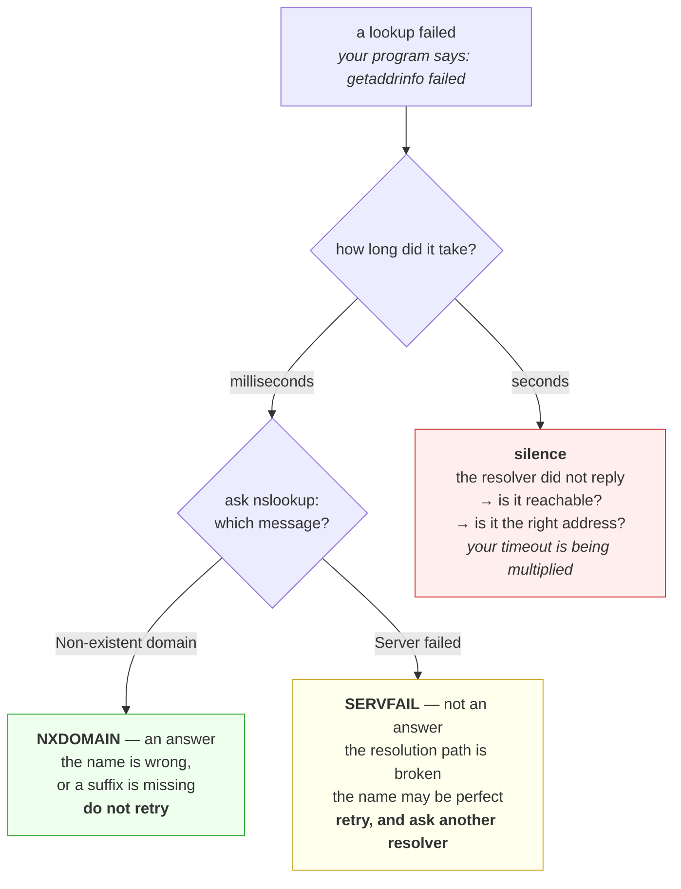

# 2.4 — When a name fails — NXDOMAIN, SERVFAIL and silence

## One-line answer

Today's second deliberate failure: break a name three different ways and discover that *this name does not
exist*, *the resolver is broken* and *nobody answered at all* need three different responses — while your
program collapses all three into one message that says `getaddrinfo failed`.

---

## The story

🎬 **The scene.** Somebody is trying to reach a friend to confirm a lift to the airport. They call, and it
does not connect.

😬 **The naive fix.** They call again. Then again, six times over the next half hour, each time getting the
same nothing, each time getting slightly more worried.

💥 **Why it fails.** *Nothing happened* is not one situation. The number could be disconnected, which means
stop calling and find another way. The friend's phone could be off, which means keep trying and also send a
message. Or the friend could be driving and simply not picking up, which means everything is fine and the
lift is happening. **Three completely different situations produced the same experience**, so the caller
spent half an hour repeating the one action that was useless in two cases out of three.

💡 **The insight.** The absence of a result is not a single fact, and a system that reports every kind of
absence the same way has thrown away the information that decides what to do next. **Getting nothing is
cheap to observe and expensive to interpret**, and the interpretation is where the whole decision lives.

---

## The idea in plain language

DNS has response codes, exactly like HTTP has status codes, and the three that matter to an operator carry
opposite instructions.

**`NXDOMAIN` — the name does not exist.** This is an *answer*. A server that is authoritative for the zone
looked, found nothing, and said so with confidence. It is fast, it is cacheable — *negative caching* is the
term, and yes, a failure has a TTL too — and it means **stop and check the name**, because retrying will
give the same answer until something changes.

**`SERVFAIL` — the resolver could not complete the lookup.** This is *not* an answer about the name. It
says the machinery broke: an upstream server was unreachable, a validation check failed, a zone was
misconfigured. The name may exist perfectly well. It means **the fault is in the resolution path, not in
your configuration**, and a retry is reasonable because the condition may be transient.

**Silence — no response at all.** The resolver did not reply. There is no code, because there is no
message. Your stub resolver waits out its timeout, retries, possibly tries another resolver, and only then
gives up. **This is the expensive one**, because it costs time rather than producing an error, and the time
is multiplied by every retry and every resolver in the list.

### Why your program cannot tell you which one happened

Part [2.1](2.1-what-resolving-a-name-actually-does.md) showed `getaddrinfo` raising `gaierror` with the
message `getaddrinfo failed`. That message is the same for all three. The standard interface collapses
them, because it was designed to answer one question — *what are the addresses* — and every way of not
answering it looks alike from the caller's side.

**So the distinction has to be recovered with a second tool**, one that speaks DNS directly. That is the
whole reason an operator learns `nslookup` or `dig` even though no program uses them.

### The one clue you get for free

**Duration.** `NXDOMAIN` is fast, because it is an answer. `SERVFAIL` is usually fast, because the resolver
knows quickly that it has failed. Silence is slow by definition, because waiting is the only way to detect
it. **A failed lookup that took several seconds is almost certainly the third case**, and you knew that
before running anything else.

---

## Why Kriya needs it

Day 9 gives `pulse` a model provider's hostname. When a call to it fails, the first fork in the road is
whether the name resolved — and if it did not, which of these three happened, because one is a typo in your
configuration and the others are not your fault at all.

Day 25 and Day 47 both include a container or a pod that cannot resolve something. `NXDOMAIN` there means
the name is wrong or the search suffix is wrong; silence means the cluster's DNS service itself is
unreachable, which is a completely different escalation.

Day 79 writes runbooks — one per alert — and *DNS resolution failing* is an alert whose runbook is worthless
unless it branches on these three, because the actions are *fix the name*, *check the resolver* and *check
whether anything can reach the resolver at all*.

Day 84's incident lab includes a resolver that answers slowly rather than failing, which is the worst of
the three and the one this part measures.

---

## The mechanism

**This is a deliberate failure.** Produce all three, read what each one says, and notice that only one of
them was slow.

### One: the name does not exist

```bash
nslookup no-such-host-kriya-day7.invalid
```

**Line by line:** `.invalid` is reserved by specification precisely so that it can never exist, which makes
it the correct name to use for a test like this. Using somebody's real domain to generate a deliberate
failure sends real queries about a real name to real servers, and it is both rude and unreliable.

Observed on **2026-08-26**:

```text
*** UnKnown can't find no-such-host-kriya-day7.invalid: Non-existent domain
Server:  UnKnown
Address:  10.175.225.7
```

**`Non-existent domain` is `NXDOMAIN` in words.** The resolver answered, and the answer was *no*.

### Two: the resolver could not answer

```bash
nslookup dnssec-failed.org
```

**Line by line:** this name is published deliberately with a broken signature chain, so a resolver that
validates signatures will refuse to return an answer for it. It is a **test name that exists for this
purpose**, which is what makes it safe and repeatable — the failure is the point of the name.

Observed on **2026-08-26**:

```text
*** UnKnown can't find dnssec-failed.org: Server failed
Server:  UnKnown
Address:  10.175.225.7
```

**`Server failed` is `SERVFAIL`.** Read the difference from case one carefully, because it is one word and a
world of meaning: the previous answer was *this name does not exist*; this one is *I could not find out*.
**The name is fine.** The resolver is telling you the lookup itself failed, and no amount of correcting the
name will help.

### Three: nobody answers at all

```bash
nslookup -timeout=2 -retry=1 example.com 203.0.113.53
```

**Line by line:**

- The final argument is **the server to ask**, which is how `nslookup` is pointed at a specific resolver
  instead of the configured one. This is the flag worth remembering: it lets you ask a *different* resolver
  the same question and compare, which is the fastest way to work out whether a problem is the name or the
  resolver.
- `203.0.113.53` is in `203.0.113.0/24`, a range reserved by RFC 5737 for documentation and guaranteed
  never to be routed. **Nothing is there, and nothing ever will be**, so the query goes out and no answer
  comes back — which is exactly the condition being demonstrated. Pointing this experiment at a real
  address that happens to be quiet would be sending unsolicited traffic to somebody else's machine.
- `-timeout=2` and `-retry=1` are an attempt to bound the wait. **Watch what they actually achieve.**

Observed on **2026-08-26**:

```text
*** Request to UnKnown timed-out
DNS request timed out.
    timeout was 2 seconds.
Server:  UnKnown
Address:  203.0.113.53

real	0m10.122s
```

**Read those two numbers together, because this is the point of the whole part.**

The tool reports `timeout was 2 seconds`. The command took **ten seconds**. Nothing lied: the *per-attempt*
timeout was two seconds, and the tool made several attempts — retries, and separate attempts for each
address family — each of which waited out its own two seconds. **A bound on one attempt is not a bound on
the operation**, and the ratio here happens to be five to one.

That gap is not a quirk of `nslookup`. It is the shape of nearly every timeout in this curriculum, and
section [04](../04-timeouts/4.1-a-timeout-is-a-decision-not-a-safety-net.md) is entirely about it. Meeting
it here, in DNS, where it costs ten seconds before a single connection has been attempted, is the reason
this part sits before that section rather than after it.

### The three side by side

| What happened | `nslookup` says | Fast or slow | Retry? | What to do |
| --- | --- | --- | --- | --- |
| Name does not exist | `Non-existent domain` | fast | **no** — it will say the same thing | check the name and the search suffixes |
| Resolver could not answer | `Server failed` | fast | **yes** — may be transient | check the resolver, and ask a different one |
| No response | `DNS request timed out` | **slow — this is the cost** | it already did, several times | check whether the resolver is reachable at all |

**The three-column reading is `Fast or slow` and `Retry?`**, because those two decide what you do in the
first thirty seconds of an incident, and you can often establish both before you have read a single log
line.



---

## When it breaks

**`NXDOMAIN` that is cached, for a name you just created.** Negative caching, meeting you at the worst
moment.

```text
$ nslookup api.example.com
*** UnKnown can't find api.example.com: Non-existent domain
# ... the record was created two minutes ago and is definitely there
```

**What it says:** the name does not exist.

**What it actually means:** somebody — possibly you, possibly a health check — asked for this name *before*
it was created, got a legitimate `NXDOMAIN`, and **the resolver cached that failure**. Negative answers have
a TTL exactly like positive ones. So the name exists and the cache remembers that it did not.

**The smallest fix:** wait out the negative TTL, or query the authoritative server directly to confirm the
record is really there.

**Why it catches people:** it inverts the usual advice. Part
[2.3](2.3-ttl-and-the-change-that-has-not-happened-yet.md) taught that caching delays a *change*; this is
caching delaying a *creation*, and the instinct — create it again, more carefully — changes nothing. **Do
not query a name before you create it**, which sounds absurd until it costs you an hour.

**`SERVFAIL` on everything, all at once.** The one that looks like the internet broke.

```text
$ nslookup pypi.org
*** UnKnown can't find pypi.org: Server failed
$ nslookup docs.python.org
*** UnKnown can't find docs.python.org: Server failed
```

**What it says:** two unrelated names both failed.

**What it actually means:** the common element is the resolver, so the resolver is the fault. Two unrelated
names failing simultaneously is nearly conclusive — the probability that two zones broke at the same
instant is negligible compared with the probability that the one thing they share broke.

**The smallest fix:** ask a different resolver, using the final-argument form from the mechanism above. If
the other resolver answers, you have both diagnosed it and worked around it in a single command.

**The habit worth building:** when several things fail together, **find what they share** rather than
investigating them individually. It is the fastest reasoning tool in this entire curriculum and it costs
nothing.

**A lookup that succeeds slowly, forever.** The failure that never fails.

```text
$ uv run python days/day-007-networking-for-operators/lab/resolve.py pypi.org 443
pypi.org:443 -> 8 answers in 5021.4 ms
```

**What it says:** eight answers. Success.

**What it actually means:** the first configured resolver is silent, every lookup waits out its timeout,
and the second resolver answers correctly. **Your error rate is zero and your latency is destroyed.** From
the application's point of view nothing whatsoever is wrong.

**The smallest fix:** remove or repair the first resolver, which requires knowing it is there — and the only
observation that reveals it is the duration.

**Why it is the worst of the four:** every other failure in this part produces an error somebody can alert
on. This one produces a **successful, slow result**, and success is not something anybody pages on. It will
sit in a system for months.

**A short timeout that is not short.** The one measured above, in a real client.

```text
$ curl -sS --max-time 3 -o /dev/null https://api.example.com/ ; echo "exit=$?"
curl: (28) Operation timed out after 3001 milliseconds with 0 bytes received
exit=28
```

**What it says:** the timeout worked, at three seconds.

**What it actually means:** it worked here **because `--max-time` bounds the whole operation**, unlike the
per-attempt bound that let `nslookup` take ten seconds. If the same request had been made by a client whose
only timeout was per-connection, the DNS phase would have run first and unbounded, and the "three second
timeout" would have been a three-second budget starting after an arbitrarily long wait.

**The distinction worth holding, and it is the day's spine:** **a timeout that covers one attempt and a
timeout that covers the operation are different things wearing the same word.** Part
[4.2](../04-timeouts/4.2-the-four-timeouts-of-one-request.md) takes it apart properly.

---

## In production

**What a professional writes instead of the teaching version.** They do not run `nslookup` in production
code; they make sure the *failure* is classifiable after the fact. Concretely, that means catching
resolution errors separately from connection errors at the client boundary and recording which happened,
because the three cases above lead to three different runbook branches and a log line that says
`getaddrinfo failed` supports none of them. They also **never retry an `NXDOMAIN`**, since retrying a
definitive negative answer is pure load with a guaranteed outcome.

**What degrades at scale.** Silence, multiplied. One client waiting out a resolver timeout is a slow
request. A thousand clients doing it simultaneously are a thousand threads or connections **held open doing
nothing**, and the pool that holds them is finite. **The service runs out of capacity while consuming no
CPU and producing no errors**, which is a signature worth memorising — it is section
[05](../05-when-it-adds-up/5.1-hanging-pulse-on-purpose.md)'s whole subject, and DNS is one of the most
common ways to arrive at it.

**The failure that only shows with real traffic.** Negative caching under load. A deploy creates a new name
and the readiness probe starts checking before the record has propagated; the probe's `NXDOMAIN` gets
cached; every subsequent probe reads the cached negative and fails; the deployment never becomes ready and
rolls back. **The record was correct the entire time.** With one manual check you would have seen it work;
it is the automation, checking early and often, that pins the failure in place.

**The review comment a senior engineer leaves.** *"This retry wrapper catches `OSError` and retries five
times with backoff. `gaierror` is a subclass of `OSError`, so we are retrying `NXDOMAIN` — a definitive
answer that will never change — five times per call. Catch resolution errors separately, and only retry the
ones that can succeed on a second attempt."*

**The signal you would alert on.** **Lookups by response code**, as three separate series rather than one
error count, because the response differs per code. You would page on a sustained `SERVFAIL` or timeout
rate against a resolver you depend on, since neither has a healthy baseline above zero. You would **not**
page on `NXDOMAIN` rate, because a busy system produces some legitimately — probes for names that do not
exist yet, misconfigured clients, scanning — but you would **graph** it, because a step change in it after
a deploy is a configuration mistake with a timestamp on it. And you would alert on **lookup duration at a
high percentile**, which is the only signal that catches the succeeds-slowly case that produces no errors
at all.

**Blast radius.** This part sends four DNS queries and reads the answers. It changes nothing, creates
nothing and touches no record. **The one thing to be careful about is the target**: two of the three
experiments deliberately use reserved names and reserved addresses — `.invalid` and `203.0.113.0/24` — so
that the deliberate failure is generated entirely against space set aside for it. ⚠️ **Never point a
failure experiment at somebody else's real name or address.** A timeout test aimed at a stranger's server
is unsolicited traffic, it may look like probing to whoever owns it, and its results are unreliable because
you do not control the thing you are measuring. The reserved ranges exist precisely so that this class of
test has a safe home; use them, and say in the document that you did.

**Cost.** `0` model calls, `0` tokens, `0` CI minutes, `0` disk, negligible RAM. **Network: four DNS
queries and a handful of retries, a few kilobytes**, of which the deliberate timeout accounts for about ten
seconds of waiting and almost no traffic. Free.

**The interview question.** *"Your service starts failing to reach one of its dependencies. How do you tell
in the first minute whether it is DNS, and what do you look at?"* The answer that lands is a decision
procedure rather than a list of tools: *"The first split is whether the name resolved at all, because a
name failure and a connection failure are different investigations — with `curl` that is exit 6 versus exit
7, and in code it is `gaierror` versus `ConnectionError`. If it is a name failure, the second split is
which kind, and I get most of it from the duration before I run anything: a fast failure is an answer, so
either the name does not exist or the resolver refused to complete the lookup, and `NXDOMAIN` versus
`SERVFAIL` tells me whether to fix my configuration or go and look at the resolver. A slow failure means
nobody replied, which means the resolver is unreachable rather than unhappy, and that is a network or
infrastructure escalation rather than anything I can fix in my service. The single most useful command is
querying a second, unrelated resolver for the same name: if it answers, the name is fine and the resolver
is the fault, which is both the diagnosis and the workaround."*

---

## Check yourself

```bash
nslookup no-such-host-kriya-day7.invalid ; nslookup dnssec-failed.org ; time nslookup -timeout=2 -retry=1 example.com 203.0.113.53
```

Three failures, three messages, and one of them takes about five times longer than the bound it printed.
**The number to write down is that ratio** — the per-attempt timeout you set and the wall-clock time the
operation actually took — because it is the same arithmetic that will hurt you in every client library on
Day 9 and every probe on Day 43.

**Say out loud, without scrolling up:** *give the three ways a lookup can fail, say which one you must never
retry and why, and say which one you can identify from the duration alone before running any tool.*
