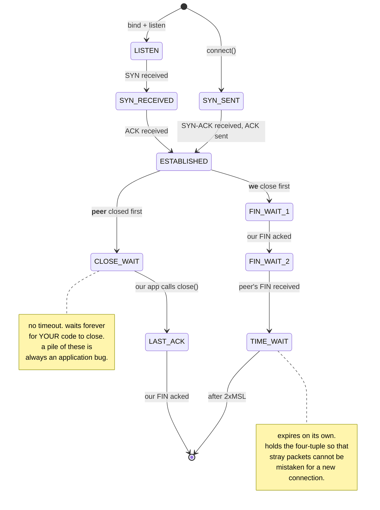

# 3.1 — The handshake and the connection states

## One-line answer

TCP is a state machine with eleven states, and every socket you will ever debug is sitting in one of them
— so reading the `State` column is not trivia, it is the fastest available answer to "what is this
connection actually doing".

---

## The story

🎬 **The scene.** Two people meeting to hand over a package, having never spoken.

The first says: *"Is that you? I'm here."* The second says: *"Yes — and are you there?"* The first says:
*"I am."* Only then does anything get handed over.

It sounds absurdly formal for three sentences, and every clause is doing work. The first message proves
somebody is there. The second proves they heard it **and** that they exist independently. The third proves
the second was heard. **After three messages, both parties know that both parties can hear.**

😬 **The naive fix.** Somebody proposes cutting it to two: *"I'm here"* — *"So am I"*.

💥 **Why it fails.** The first person now knows the second exists. **The second has no idea whether their
reply arrived.** So they hand over the package into what might be an empty room, and if the reply was lost
they will never find out. The third message is not politeness; it is the only thing that makes the
knowledge mutual.

💡 **The insight.** Establishing that two parties can communicate takes one more exchange than it feels
like it should, and **the extra one is what converts "I heard you" into "we both know we heard each
other".** Every reliable protocol pays that cost, and every attempt to save it reintroduces the ambiguity
it was there to remove.

---

## The idea in plain language

TCP gives you an ordered, reliable byte stream over a network that provides none of those things. To do
that it maintains **state** at both ends — sequence numbers, buffers, what has been acknowledged — and a
connection therefore has a lifecycle.

Verified against RFC 9293 on **2026-08-24**, the states are: *"LISTEN, SYN-SENT, SYN-RECEIVED,
ESTABLISHED, FIN-WAIT-1, FIN-WAIT-2, CLOSE-WAIT, CLOSING, LAST-ACK, TIME-WAIT, and the fictional state
CLOSED."*

**Eleven, and you will meet six of them regularly.**

### Opening: the three-way handshake

RFC 9293 describes it as *"the procedure used to establish a connection"*, where each side must *"send its
own initial sequence number and to receive a confirmation of it in acknowledgment from the remote TCP
peer."*

| Step | Message | Client state | Server state |
| --- | --- | --- | --- |
| 0 | — | CLOSED | **LISTEN** |
| 1 | client → `SYN` | **SYN-SENT** | LISTEN |
| 2 | server → `SYN, ACK` | SYN-SENT | **SYN-RECEIVED** |
| 3 | client → `ACK` | **ESTABLISHED** | **ESTABLISHED** |

**The cost is one round trip before a single byte of your request is sent.** On a local network that is
under a millisecond; across continents it is a couple of hundred. **This is why connection reuse matters
so much** ([1.2](../01-addresses-and-ports/1.2-the-socket-and-the-four-tuple.md), and Day 8's keep-alive):
every new connection pays this toll again.

### Closing: four messages, and an asymmetry

Closing is not symmetric, and the asymmetry is where all the interesting states live. Each side closes
its own direction independently:

| Step | Message | Closer's state | Peer's state |
| --- | --- | --- | --- |
| 1 | closer → `FIN` | **FIN-WAIT-1** | ESTABLISHED |
| 2 | peer → `ACK` | **FIN-WAIT-2** | **CLOSE-WAIT** |
| 3 | peer → `FIN` | FIN-WAIT-2 | **LAST-ACK** |
| 4 | closer → `ACK` | **TIME-WAIT** | CLOSED |

**Two states here are diagnostic gold.**

**`CLOSE-WAIT` on your side means the peer closed and your application has not.** The kernel has done its
part and is waiting for your code to call `close()`. **A pile of `CLOSE-WAIT` sockets is always an
application bug** — a descriptor leak — and it is one of the very few socket states that points
unambiguously at your own code.

**`TIME-WAIT` is on whichever side closed first**, and it lingers. RFC 9293: *"When a connection is closed
actively, it MUST linger in the TIME-WAIT state for a time 2xMSL (Maximum Segment Lifetime)."* And it
defines that Maximum Segment Lifetime verbatim as:

```text
For this specification the MSL is taken to be 2 minutes.
```

So the canonical linger is twice that, though most implementations use less. Part
[3.3](3.3-time-wait-and-the-ports-you-ran-out-of.md) is about what that costs.

### Why `TIME-WAIT` exists at all

Two reasons, and both are about a network that can deliver things late:

**Stray packets from the old connection.** A packet delayed in the network could arrive after the
connection closed and be accepted by a *new* connection reusing the same four-tuple
([1.2](../01-addresses-and-ports/1.2-the-socket-and-the-four-tuple.md)). Holding the tuple for twice the
maximum packet lifetime guarantees any stragglers have expired.

**The final `ACK` might be lost.** If it is, the peer retransmits its `FIN` and needs someone still there
to answer. A side that vanished immediately would leave the peer stuck.

**So `TIME-WAIT` is correctness, not sloppiness** — which is worth knowing before you go looking for a way
to turn it off.

### The other letters you will see

**`RST`** — reset. An abrupt refusal or abort. **This is what "connection refused" is**
([1.1](../01-addresses-and-ports/1.1-a-port-is-a-doorway-not-a-place.md)): a `SYN` to a port nobody claimed
gets an `RST` back immediately. A reset mid-connection means the peer gave up hard — often because the
process died ([Day 6, part 4.3](../../../day-006-resources-and-the-oom-killer/parts/04-the-oom-killer/4.3-oom-killing-pulse-on-purpose.md)).

**`SYN-RECEIVED` piling up** — the server received handshakes it has not completed, which is part
[3.2](3.2-the-accept-queue-and-the-backlog.md) or a SYN flood.

---

## Why Kriya needs it

Day 8 is HTTP and TLS, where keep-alive exists entirely to avoid repeating the handshake and the TLS
handshake adds another round trip on top of it.

Day 26 adds a container healthcheck and Day 41 a Kubernetes probe. **A probe that connects and closes
generates a `TIME-WAIT` socket every few seconds, forever** — a small, permanent, entirely normal cost that
surprises people the first time they count sockets.

Day 30's failure lab includes a container that accepts connections and never answers, which is
`ESTABLISHED` with nothing happening — a state you already produced on
[Day 4, part 1.4](../../../day-004-linux-for-operators-i/parts/01-the-process/1.4-process-states-and-the-d-that-will-not-die.md)
by stopping the process.

Day 50 is capacity work, where connection state counts are the raw material.

---

## The mechanism

Watch a connection move through the states.

```bash
uv run uvicorn pulse.api:app --host 127.0.0.1 --port 8000 >/dev/null 2>&1 &
PULSE=$!
sleep 3
netstat -ano | grep ':8000'
```

**Line by line:** start the server and look before anything connects. **The baseline is one row.**

Observed on **2026-08-24**:

```text
  TCP    127.0.0.1:8000         0.0.0.0:0              LISTENING       49220
```

**State `LISTENING`, no peer.** That is step 0 of the table — the server is in `LISTEN` and nothing else
exists.

Now make a request and watch what is left behind:

```bash
curl -sS -o /dev/null http://127.0.0.1:8000/healthz
netstat -ano | grep ':8000'
```

**Line by line:** one request, completed, then immediately look. **The timing matters** — wait too long and
the interesting state has expired.

```text
  TCP    127.0.0.1:8000         0.0.0.0:0              LISTENING       49220
  TCP    127.0.0.1:52488        127.0.0.1:8000         TIME_WAIT       0
```

**A `TIME_WAIT` socket that belongs to nobody.** Process id `0`, because the process that owned it —
`curl` — has already exited. **The connection outlives the process**, which is the first genuinely
surprising thing about this state.

**And notice which side has it.** The local address is `52488`, the client's ephemeral port
([1.1](../01-addresses-and-ports/1.1-a-port-is-a-doorway-not-a-place.md)) — so it is the **client** in
`TIME_WAIT`, because curl closed first. Part [3.3](3.3-time-wait-and-the-ports-you-ran-out-of.md) is about
why that side matters enormously.

### Watching the handshake itself

The states change in microseconds, so catching them needs either a packet capture or a deliberately slow
connection. The simplest honest demonstration is a connection you hold open
([1.2](../01-addresses-and-ports/1.2-the-socket-and-the-four-tuple.md)):

```bash
uv run python days/day-007-networking-for-operators/lab/hold_conns.py 127.0.0.1 8000 3 &
HOLD=$!
sleep 3
netstat -ano | grep ':8000' | awk '{print $4}' | sort | uniq -c
```

**Line by line:** three held connections, then a census of states
([1.2](../01-addresses-and-ports/1.2-the-socket-and-the-four-tuple.md)) rather than the raw rows, because
the counts are what you read in an incident.

```text
      6 ESTABLISHED
      1 LISTENING
      1 TIME_WAIT
```

**Six `ESTABLISHED` for three connections** — both ends are on this machine, so each appears twice
([1.2](../01-addresses-and-ports/1.2-the-socket-and-the-four-tuple.md)). Plus the `TIME_WAIT` left over
from the earlier curl, which is still counting down.

Now close them and watch the transition:

```bash
kill "$HOLD"; sleep 1
netstat -ano | grep ':8000' | awk '{print $4}' | sort | uniq -c
sleep 30
netstat -ano | grep ':8000' | awk '{print $4}' | sort | uniq -c
```

**Line by line:** kill the holder — which closes its sockets, because the kernel closes every descriptor at
exit ([Day 5, part 3.2](../../../day-005-linux-for-operators-ii/parts/03-the-disk-that-fills/3.2-the-deleted-file-that-still-costs-you-a-gigabyte.md))
— then census immediately and again after half a minute. **The two censuses are the experiment.**

```text
      4 TIME_WAIT
      1 LISTENING
--- 30 seconds later ---
      1 LISTENING
```

**Four `TIME_WAIT` immediately after, and none half a minute later.** The state is real, it costs a
four-tuple, and it expires on its own. **Nothing was leaked and nothing needed fixing** — which is the
main thing to understand about `TIME_WAIT` before part
[3.3](3.3-time-wait-and-the-ports-you-ran-out-of.md) shows you when it does become a problem.

### Producing `CLOSE_WAIT` — the state that is always your bug

```python
# days/day-007-networking-for-operators/lab/no_close.py
"""Accept connections and never close them. Produces CLOSE_WAIT when the client goes away."""

import socket
import sys
import time

PORT = int(sys.argv[1]) if len(sys.argv) > 1 else 8004

srv = socket.socket(socket.AF_INET, socket.SOCK_STREAM)
srv.setsockopt(socket.SOL_SOCKET, socket.SO_REUSEADDR, 1)
srv.bind(("127.0.0.1", PORT))
srv.listen(16)
print(f"[leaky] listening on 127.0.0.1:{PORT}; will accept and NEVER close", flush=True)

accepted = []
srv.settimeout(1.0)
deadline = time.monotonic() + 60
while time.monotonic() < deadline:
    try:
        conn, peer = srv.accept()
        accepted.append(conn)
        print(f"[leaky] accepted {peer} — holding fd {conn.fileno()} forever", flush=True)
    except socket.timeout:
        continue
print(f"[leaky] done. held {len(accepted)} connections.", flush=True)
```

**Line by line:**

- `SO_REUSEADDR` — set, so repeated runs are not blocked by lingering state
  ([1.4](../01-addresses-and-ports/1.4-the-port-that-was-already-in-use.md)).
- `srv.accept()` — **this is the call that creates a connected socket**
  ([1.2](../01-addresses-and-ports/1.2-the-socket-and-the-four-tuple.md)). Note the listening socket and
  the accepted one are different objects.
- `accepted.append(conn)` and **never `conn.close()`** — the bug, deliberately. This is exactly what a
  real application does when a code path forgets to close, or an exception skips a cleanup.
- `srv.settimeout(1.0)` with `except socket.timeout: continue` — so the loop can check its deadline
  rather than blocking in `accept` forever. **A server that blocks indefinitely in `accept` cannot notice
  a shutdown signal**, which is Day 4's lesson
  ([Day 4, part 2.3](../../../day-004-linux-for-operators-i/parts/02-signals/2.3-catching-a-signal-in-python.md))
  appearing in network code.
- `deadline` with `time.monotonic()` — a clock that cannot go backwards
  ([Day 6, part 2.1](../../../day-006-resources-and-the-oom-killer/parts/02-cpu/2.1-a-core-is-a-queue-not-a-speed.md)).

```bash
uv run python days/day-007-networking-for-operators/lab/no_close.py 8004 &
LEAKY=$!
sleep 2
uv run python days/day-007-networking-for-operators/lab/hold_conns.py 127.0.0.1 8004 3 &
sleep 3
pkill -f 'hold_conns.py 127.0.0.1 8004'
sleep 2
netstat -ano | grep ':8004' | awk '{print $4}' | sort | uniq -c
```

**Line by line:**

- Start the leaky server, connect three clients, then **kill the clients** — so the *peer* closes and the
  server does not.
- The census afterwards is the measurement. **Killing the client is what triggers the state**: the client
  sends `FIN`, the server's kernel acknowledges it, and then waits for the application to call `close()`,
  which never comes.

```text
      3 CLOSE_WAIT
      1 LISTENING
```

**Three sockets in `CLOSE_WAIT`, and they will stay there.** Unlike `TIME_WAIT`, this state has **no
timeout** — it persists until the application closes the socket or the process exits. **Each one holds a
file descriptor** ([1.2](../01-addresses-and-ports/1.2-the-socket-and-the-four-tuple.md)), and a service
doing this under real traffic exhausts its descriptor limit and starts failing to accept anything.

Wait for the server's deadline and confirm they vanish when the process exits:

```bash
wait "$LEAKY" 2>/dev/null; netstat -ano | grep ':8004' || echo "8004 clean"
```

**Line by line:** the process ends, the kernel closes every descriptor it held, and the sockets go. **The
fix for `CLOSE_WAIT` is always in the application**, and "restart it" is the crude version of exactly
that.



Clean up:

```bash
kill "$PULSE" 2>/dev/null; pkill -f no_close.py 2>/dev/null; pkill -f hold_conns.py 2>/dev/null; sleep 1; netstat -ano | grep -E ':800[0-4]' | awk '{print $4}' | sort | uniq -c || echo "all clean"
```

**Line by line:** stop everything and take a final census across the range this part used. **`TIME_WAIT`
rows may remain and that is correct** — they expire on their own, and treating them as leftovers to be
hunted is the misunderstanding part [3.3](3.3-time-wait-and-the-ports-you-ran-out-of.md) exists to fix.

---

## When it breaks

**A rising `CLOSE_WAIT` count on a healthy-looking service.** The descriptor leak:

```text
$ ss -tan state close-wait | wc -l
1842
$ ss -tan state established | wc -l
41
```

**What it says:** 1,842 half-closed sockets and 41 live ones.
**What it actually means:** **the application is not closing connections its peers have already closed.**
Every one holds a file descriptor, and the process will eventually hit its limit and fail to accept
anything with `Too many open files`
([1.2](../01-addresses-and-ports/1.2-the-socket-and-the-four-tuple.md)).
**The smallest fix:** restart, which closes everything — **and it will come back**, because the cause is a
code path that does not close.
**Why this state is so valuable diagnostically:** `CLOSE_WAIT` is the kernel saying *"I have done my half
and I am waiting for your application"*. It cannot be a network problem, a peer problem or a
configuration problem. **It is always your code**, which is a rare and welcome certainty.

**Connection refused, immediately, on a port that is definitely listening.** The reset:

```text
$ curl -sS -m 5 http://127.0.0.1:8000/healthz
curl: (56) Recv failure: Connection reset by peer
```

**What it says:** the connection was reset rather than refused.
**What it actually means:** **this is different from "could not connect"**. The connection was
established and then the peer sent `RST` — it gave up hard, mid-conversation. Usual causes: the server
process died ([Day 6](../../../day-006-resources-and-the-oom-killer/parts/04-the-oom-killer/4.3-oom-killing-pulse-on-purpose.md)),
or the server closed with unread data pending, or something in between injected a reset.
**The smallest fix:** check whether the server process is still alive — `pgrep`
([Day 4, part 1.3](../../../day-004-linux-for-operators-i/parts/01-the-process/1.3-reading-ps-and-finding-your-service.md)).
**The distinction to keep:** exit 7 is "nobody was there", exit 56 is "somebody was there and quit".

**Thousands of `SYN_RECV` sockets.** The half-open handshake:

```text
$ ss -tan state syn-recv | wc -l
4102
```

**What it says:** four thousand handshakes started and not completed.
**What it actually means:** either the accept queue is full and connections are stalling
([3.2](3.2-the-accept-queue-and-the-backlog.md)), or something is sending `SYN` packets and never
completing the handshake — a SYN flood, which is a classic denial-of-service technique precisely because
each half-open connection costs the server state and costs the attacker almost nothing.
**The smallest fix for the first cause:** raise the backlog, or make the application accept faster.
**For the second:** SYN cookies, which most kernels enable by default and which is why this attack is
mostly historical.

**A connection stuck in `FIN_WAIT_2` for a long time.** The peer that never finished:

```text
$ ss -tan state fin-wait-2
State      Recv-Q Send-Q Local Address:Port  Peer Address:Port
FIN-WAIT-2 0      0      10.0.0.5:52210      10.0.0.9:8000
```

**What it says:** we closed, the peer acknowledged, and the peer has not closed its own direction.
**What it actually means:** **the peer is in `CLOSE_WAIT`** — its application has not called `close()`.
So the two states are two views of the same bug, one on each machine.
**The smallest fix:** fix the peer. **The useful part:** if you see `FIN_WAIT_2` on your side and you do
not own the peer, you now know exactly what to tell them — *"your application is not closing sockets"* —
which is a much better bug report than "connections are hanging".

---

## In production

**What a professional writes instead of the teaching version.** They keep connections open and reuse them
rather than opening one per request, because the handshake is a round trip and a round trip is the most
expensive thing in a fast request. And they read the state census before anything else when a service is
misbehaving on the network, because **the distribution of states is a diagnosis rather than a
measurement**: heavy `ESTABLISHED` is a busy server, heavy `TIME_WAIT` is churn, heavy `CLOSE_WAIT` is
your bug, heavy `SYN_RECV` is a queue or an attack.

**What degrades at scale.** State, at both ends. Every connection is kernel memory on the server and a
four-tuple plus a descriptor on the client, and every open and close is a round trip plus a lingering
`TIME_WAIT`. **At small scale none of this is visible; at large scale the connection lifecycle is a
material fraction of the work the machine does**, which is why HTTP/1.1 keep-alive, HTTP/2 multiplexing
and connection pools all exist and all solve the same problem.

**The failure that only shows with real traffic.** `CLOSE_WAIT` accumulation. A code path that forgets to
close runs rarely in testing — it is usually an error path — and constantly under real traffic where
errors are a steady percentage. **So the leak rate is proportional to your error rate**, and the service
runs for days and then abruptly cannot accept connections, having looked completely healthy throughout.

**The review comment a senior engineer leaves.** *"The client is closed in the happy path but not in the
`except` branch, so every failed upstream call leaks a socket into `CLOSE_WAIT`. At our error rate that is
a few hundred a day and the descriptor limit is 1024 — we will fall over about twice a week and it will
look random. Use a context manager so the close happens on both paths."*

**The signal you would alert on.** **`CLOSE_WAIT` count**, because it is unambiguous — it should be near
zero and any sustained value is an application bug with no other possible cause. That specificity makes it
one of the best network signals there is. Also **file descriptors as a fraction of the limit**
([1.2](../01-addresses-and-ports/1.2-the-socket-and-the-four-tuple.md)), which catches the same leak from
the other side and also catches leaks that are not sockets. **`SYN_RECV` count** is worth watching on
anything internet-facing. You would **not** alert on `TIME_WAIT` count on its own — it is normal, it is
proportional to legitimate churn, and alerting on it teaches people that a healthy state is an alarm
([3.3](3.3-time-wait-and-the-ports-you-ran-out-of.md) has the version that *is* worth alerting on).

**Blast radius.** This part opens and closes local connections and deliberately leaks a few. Worst case:
`no_close.py` left running with many clients pointed at it accumulates `CLOSE_WAIT` sockets until the
process hits its descriptor limit — bounded here by the 60-second deadline built into the script, which is
why the deadline is there rather than a `while True`. Who can trigger it: you. What bounds it: the
deadline, the loopback bind
([1.3](../01-addresses-and-ports/1.3-binding-127-0-0-1-versus-0-0-0-0.md)), and the small client counts.
⚠️ **Do not point `hold_conns.py` with a large count at anything you did not start** — many simultaneous
half-open connections against somebody else's service is indistinguishable from a SYN flood.

**Cost.** `0` model calls, `0` tokens, `0` CI minutes, `0` disk. **RAM: a few kilobytes of kernel buffers
per connection**, so a handful is nothing. `pulse` at about 60 MB. The only lingering cost is `TIME_WAIT`
sockets, which hold a four-tuple each and expire on their own.

**The interview question.** *"What does a large number of `CLOSE_WAIT` sockets tell you?"* The answer that
lands is confident because the state is unambiguous: *"That the application is not closing sockets whose
peers have already closed. The kernel has done its half — it received the peer's `FIN` and acknowledged it
— and it is waiting for the application to call `close()`. Unlike `TIME_WAIT` there is no timeout on it,
so those sockets sit there holding file descriptors until the process exits, and eventually the service
cannot accept anything with 'too many open files'. It cannot be a network problem or the peer's problem;
it is always a missing close in our code, usually on an error path, which is why it appears in production
and not in testing. The mirror image on the other machine is `FIN_WAIT_2`, so if I see that on my side
against someone else's service I know exactly what to tell them."*

---

## Check yourself

```bash
uv run uvicorn pulse.api:app --host 127.0.0.1 --port 8000 >/dev/null 2>&1 & P=$!; sleep 3; for i in 1 2 3 4 5; do curl -sS -o /dev/null http://127.0.0.1:8000/healthz; done; netstat -ano | grep ':8000' | awk '{print $4}' | sort | uniq -c; echo "--- 30s later ---"; sleep 30; netstat -ano | grep ':8000' | awk '{print $4}' | sort | uniq -c; kill "$P" 2>/dev/null; wait "$P" 2>/dev/null
```

Five completed requests, then a state census immediately and again after half a minute. **You should see
five `TIME_WAIT` that become zero** — proof that the state is real, is created by ordinary successful
requests, and cleans itself up. **A health check polling every few seconds produces exactly this, forever**,
which is worth knowing before you count sockets on a production host and worry.

**Say out loud, without scrolling up:** *`TIME_WAIT` and `CLOSE_WAIT` sound similar and mean opposite
things. Say which side of the connection each is on, which one expires by itself, and which one is
guaranteed to be your own bug.*
