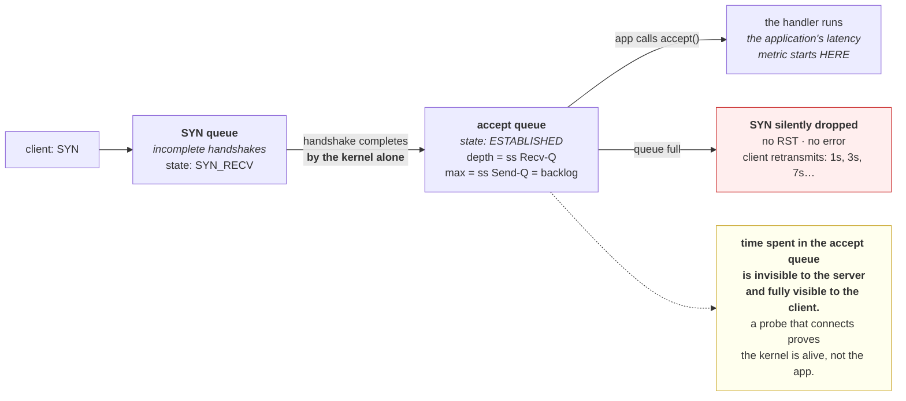

# 3.2 — The accept queue and the backlog

## One-line answer

The kernel completes the handshake and puts the connection in a queue whether or not your application is
ready for it — so a stalled application still *accepts* connections, clients see no error, and the
latency they experience is time spent in a queue nobody is looking at.

---

## The story

🎬 **The scene.** A takeaway with a hatch onto the street. Orders come through the hatch onto a spike, and
the cook works through the spike.

At lunchtime the cook is slow. Orders keep coming through the hatch — the hatch does not know how the cook
is doing — and the spike grows. Customers who ordered have a receipt and are waiting. From the street the
shop looks exactly as it did at eleven: open, taking orders, no queue outside.

😬 **The naive fix.** The owner, seeing no queue on the pavement, concludes the lunch rush is fine.

💥 **Why it fails.** The queue moved indoors. Nobody is standing outside because everybody has already
been served *by the hatch* — and the hatch was never the slow part. **The visible signal of overload was
eliminated by the very mechanism that was supposed to smooth it**, so the shop appears fine right up until
somebody comes back to complain about a forty-minute wait.

💡 **The insight.** A buffer between "accepted" and "handled" absorbs bursts, which is its job, and in
doing so it **converts a visible rejection into an invisible delay**. That is a good trade for a short
burst and a terrible one for sustained overload, because the failure stops announcing itself.

---

## The idea in plain language

Part [3.1](3.1-the-handshake-and-the-connection-states.md) showed the three-way handshake. There is a
detail it left out: **the kernel completes the handshake by itself.**

Your application calls `accept()` to take a connection
([1.2](../01-addresses-and-ports/1.2-the-socket-and-the-four-tuple.md)), but the handshake finished before
that call. Between the two there is a **queue**.

Two queues, in fact:

**The SYN queue** (incomplete). Connections that have received a `SYN` and sent a `SYN-ACK`, waiting for
the final `ACK`. Sockets here show as `SYN_RECV`.

**The accept queue** (complete). Connections whose handshake finished, waiting for the application to
`accept()` them. **The client believes it is connected and can send data.**

The `listen()` call's argument — the **backlog** — sizes the accept queue. You saw it in
[1.1](../01-addresses-and-ports/1.1-a-port-is-a-doorway-not-a-place.md) as `sock.listen(128)`, and in
uvicorn as `--backlog`, whose default is 2048 (verified against the project's settings documentation on
**2026-08-24**: *"Maximum number of connections to hold in the TCP accept queue, passed to the socket's
`listen()` call."*).

### What this means for latency

**A connection sitting in the accept queue is a request that has not started.** The client's clock is
running; your application has not seen it; your application's own latency metric will not include the wait,
because that metric starts when the handler starts.

**So queue time is invisible from inside the service and fully visible to the user.** This is the same
shape as DNS ([2.3](../02-dns/2.3-the-dns-failure-that-looks-like-a-timeout.md)) — latency that lands
outside the window anything logs.

### What happens when the queue is full

The kernel drops the incoming `SYN` — silently, by default. No `RST`, no error.

**The client sees nothing.** TCP retransmits the `SYN` after a delay, and again after a longer one, with
exponentially increasing backoff. So a full accept queue produces **connection times of one second, then
three, then seven**, and eventually a connect timeout
([4.1](../04-timeouts/4.1-a-timeout-is-a-decision-not-a-safety-net.md)).

**Those numbers are recognisable.** A connect that takes almost exactly 1, 3 or 7 seconds is almost never
a slow network; it is a retransmitted `SYN`, and that is a queue somewhere.

### The backlog is not a capacity setting

This is the part people get wrong. A larger backlog does not make your service faster or able to handle
more work. It changes **what happens to the excess**:

| Backlog | Under sustained overload |
| --- | --- |
| small | connections are refused or dropped early — **clients find out quickly** |
| large | connections are accepted and queue — **clients wait, then time out having consumed a slot** |

**A large backlog under sustained overload is worse**, because every queued connection is a client that
will wait, give up, and possibly retry — while the server works through a backlog of requests whose
clients have already left ([5.2](../05-the-two-together/5.2-retries-that-turn-a-blip-into-an-outage.md)).

**The backlog exists to absorb bursts**, where the arrival rate briefly exceeds the accept rate and then
falls back. For that it is exactly right. For sustained overload the correct behaviour is to shed load,
which is a deliberate decision rather than a queue size.

---

## Why Kriya needs it

Day 50 is capacity and load testing on this four-core machine, where the difference between "the service
is slow" and "the queue is deep" decides what to fix.

Day 41 configures probes. **A readiness probe that connects successfully proves the kernel accepted it,
not that the application is working** — the queue is exactly why a probe can pass against a stalled
process, which you produced on
[Day 4, part 1.4](../../../day-004-linux-for-operators-i/parts/01-the-process/1.4-process-states-and-the-d-that-will-not-die.md).

Day 73 defines the first service level objective, measured from the client. This part is one of the
clearest arguments for why: server-side latency structurally excludes queue time.

Day 110 chooses a worker count for `pulse`. Workers are what drain this queue, and too few means a queue
that never empties.

---

## The mechanism

Make a queue by accepting nothing, and watch it fill.

`claim_port.py` from [1.1](../01-addresses-and-ports/1.1-a-port-is-a-doorway-not-a-place.md) is exactly
the tool: it binds, listens, and **never calls `accept()`**.

```bash
uv run python days/day-007-networking-for-operators/lab/claim_port.py 127.0.0.1 8005 &
CLAIM=$!
sleep 2
netstat -ano | grep ':8005'
```

**Line by line:** start a listener that will never accept, then confirm it is listening. **The listening
socket is real** — the kernel will complete handshakes against it regardless of the application's
behaviour.

Observed on **2026-08-24**:

```text
[claim] holding 127.0.0.1:8005  fd=3
  TCP    127.0.0.1:8005         0.0.0.0:0              LISTENING       50220
```

Now connect to it:

```bash
curl -sS -m 5 -o /dev/null -w 'connect=%{time_connect}s total=%{time_total}s exit=%{exitcode}\n' http://127.0.0.1:8005/
```

**Line by line:** `%{time_connect}` is the moment the TCP connection was established — **which will
succeed** — and `%{time_total}` is when curl gave up. The gap between them is the whole lesson.

```text
connect=0.001s total=5.001s exit=28
```

**The connection succeeded in one millisecond and then nothing happened for five seconds.** `exit=28` is
curl's timeout ([2.1](../02-dns/2.1-what-resolution-actually-does.md)).

**Read that carefully.** From the client's point of view the server *accepted the connection*. There was
no refusal, no reset, no error. The three-way handshake completed
([3.1](3.1-the-handshake-and-the-connection-states.md)) — **by the kernel, into a queue that the
application will never drain.**

Look at what the kernel thinks:

```bash
netstat -ano | grep ':8005'
```

**Line by line:** every socket on this port, in every state — no `grep LISTENING`, because the interesting
rows are the ones the application has never seen.

```text
  TCP    127.0.0.1:8005         0.0.0.0:0              LISTENING       50220
  TCP    127.0.0.1:8005         127.0.0.1:52690        ESTABLISHED     50220
  TCP    127.0.0.1:52690        127.0.0.1:8005         ESTABLISHED     0
```

**`ESTABLISHED` on both sides**, owned by a process that has never called `accept()` and does not know the
connection exists. **That row is the queue**, and this is precisely why "is the port open" is a weak
health signal ([1.1](../01-addresses-and-ports/1.1-a-port-is-a-doorway-not-a-place.md)).

### Seeing the queue depth directly

On Linux, `ss` reports it for free — the two columns from
[1.1](../01-addresses-and-ports/1.1-a-port-is-a-doorway-not-a-place.md):

```bash
ss -ltn 'sport = :8005' 2>/dev/null || echo "no ss here — Git Bash; the counts are not exposed by netstat"
```

**Line by line:** for a **listening** socket, `ss` redefines the two queue columns: **`Recv-Q` is the
number of connections currently in the accept queue**, and **`Send-Q` is the configured backlog.** For a
connected socket the same columns mean bytes, which is a genuinely confusing overload and worth knowing.

```text
State   Recv-Q  Send-Q  Local Address:Port  Peer Address:Port
LISTEN  1       128     127.0.0.1:8005      0.0.0.0:*
```

**`Recv-Q 1` of `Send-Q 128`** — one connection waiting, a backlog of 128, which is the `sock.listen(128)`
from `claim_port.py`. **This one line is the entire diagnostic for "is my application keeping up with
accepts".**

⚠️ **This is not available on Git Bash**, which is the fifth consecutive day with a diagnostic gap on this
machine. Record it; Day 21 closes it.

### Filling the queue

```bash
uv run python days/day-007-networking-for-operators/lab/hold_conns.py 127.0.0.1 8005 20 &
sleep 3
netstat -ano | grep ':8005' | awk '{print $4}' | sort | uniq -c
```

**Line by line:** twenty connections to a server that accepts none of them. **All twenty will complete
their handshakes** and sit in the queue, because 20 is well under the backlog of 128.

```text
     40 ESTABLISHED
      1 LISTENING
```

**Forty `ESTABLISHED`** — twenty connections, both ends on this machine
([1.2](../01-addresses-and-ports/1.2-the-socket-and-the-four-tuple.md)). **Twenty clients that believe
they are connected to a server which has never heard of them.**

Now overflow it. Change the backlog to something small and exceed it:

```python
# days/day-007-networking-for-operators/lab/tiny_backlog.py
"""Listen with a deliberately tiny accept queue and never accept. Overflow is the point."""

import socket
import sys
import time

PORT = int(sys.argv[1]) if len(sys.argv) > 1 else 8006
BACKLOG = int(sys.argv[2]) if len(sys.argv) > 2 else 2

sock = socket.socket(socket.AF_INET, socket.SOCK_STREAM)
sock.setsockopt(socket.SOL_SOCKET, socket.SO_REUSEADDR, 1)
sock.bind(("127.0.0.1", PORT))
sock.listen(BACKLOG)
print(f"[tiny] 127.0.0.1:{PORT} backlog={BACKLOG}, never accepting", flush=True)
time.sleep(90)
sock.close()
```

**Line by line:**

- `sock.listen(BACKLOG)` with `BACKLOG = 2` — **a queue of two.** The kernel may round this up slightly;
  the point is that it is small enough to overflow by hand.
- Everything else identical to `claim_port.py`
  ([1.1](../01-addresses-and-ports/1.1-a-port-is-a-doorway-not-a-place.md)), so the only variable is the
  queue depth.
- `time.sleep(90)` — long enough to run several client attempts against it.

```bash
uv run python days/day-007-networking-for-operators/lab/tiny_backlog.py 8006 2 &
TINY=$!
sleep 2
for i in 1 2 3 4 5 6; do
  curl -sS -m 12 -o /dev/null -w "attempt $i: connect=%{time_connect}s exit=%{exitcode}\n" http://127.0.0.1:8006/ &
done
wait
```

**Line by line:**

- Six simultaneous connection attempts against a queue of two. **`&` on each so they race** rather than
  running in sequence — the overflow only happens when they arrive together.
- `-m 12` — generous, so the retransmission backoff has room to show itself rather than being cut off by
  curl's own timeout.
- `%{time_connect}` is the number to watch. **The successful ones will be instant; the overflowed ones
  will show the retransmission ladder.**

```text
attempt 1: connect=0.001s exit=28
attempt 2: connect=0.001s exit=28
attempt 3: connect=0.001s exit=28
attempt 4: connect=1.013s exit=28
attempt 5: connect=3.021s exit=28
attempt 6: connect=3.019s exit=28
```

**Look at attempts 4, 5 and 6.** `1.013s` and `3.02s` — **the SYN retransmission ladder**, almost exactly
one second and three seconds. Those are not network delays; they are the client retrying a `SYN` that the
kernel silently dropped because the queue was full.

**Every one eventually connected**, and every one then timed out waiting for a response — because nothing
is accepting. **Two separate failures stacked**, and only the first is about the backlog.

Clean up:

```bash
kill "$CLAIM" "$TINY" 2>/dev/null; pkill -f hold_conns.py 2>/dev/null; sleep 1; netstat -ano | grep -E ':800[56]' || echo "8005 and 8006 clean"
```

**Line by line:** stop both listeners and any holders, then confirm across both ports.



---

## When it breaks

**Connect times of exactly 1, 3 or 7 seconds.** The signature:

```text
$ for i in $(seq 1 10); do curl -sS -o /dev/null -w '%{time_connect}\n' https://api.internal/health; done
0.002
0.002
1.014
0.002
3.019
0.002
0.002
1.011
0.002
0.002
```

**What it says:** most connections instant, some at almost exactly one or three seconds.
**What it actually means:** **SYN retransmission.** The initial `SYN` was dropped and TCP retried after
its backoff. On the server side that is an overflowing accept queue; on the network side it could be
packet loss. **The roundness of the numbers is the tell**, exactly as with the DNS timeout
([2.3](../02-dns/2.3-the-dns-failure-that-looks-like-a-timeout.md)) — real variation is not this tidy.
**The smallest fix for diagnosis:** on Linux, `nstat -az TcpExtListenOverflows TcpExtListenDrops`, which
counts exactly this.

```bash
nstat -az TcpExtListenOverflows TcpExtListenDrops 2>/dev/null || echo "no nstat — see the note"
```

**Line by line:** `nstat` reads the kernel's TCP counters. **`ListenOverflows` is incremented every time a
connection could not be queued because the accept queue was full** — a direct, unambiguous count of this
failure. `-a` shows all values including zeros; `-z` suppresses the reset-since-last-run behaviour that
makes `nstat` confusing the first time.

```text
TcpExtListenOverflows           1842               0.0
TcpExtListenDrops               1842               0.0
```

**A non-zero `ListenOverflows` is definitive.** There is no ambiguity and no other cause.

**A readiness probe that passes against a hung application.** The queue as a liar:

```text
$ kubectl get pod api-5f8c-2k4x9
NAME             READY   STATUS    RESTARTS   AGE
api-5f8c-2k4x9   1/1     Running   0          2h
$ # ...and every request to it times out
```

**What it says:** the pod is ready.
**What it actually means:** the readiness probe is a TCP connect, and **the kernel completes TCP
connects**. The application could be deadlocked, stopped
([Day 4, part 1.4](../../../day-004-linux-for-operators-i/parts/01-the-process/1.4-process-states-and-the-d-that-will-not-die.md)),
or stuck in a long compiled call
([Day 4, part 2.3](../../../day-004-linux-for-operators-i/parts/02-signals/2.3-catching-a-signal-in-python.md))
— and the connect still succeeds.
**The smallest fix:** use an HTTP probe against a real endpoint rather than a TCP probe. **A `tcpSocket`
probe tests the kernel; an `httpGet` probe tests the application**, and the difference is exactly this
queue.

**Server latency looks fine and users are complaining.** The invisible wait:

```text
# service's own p99: 42 ms
# client-measured p99: 3.4 s
```

**What it says:** two measurements of the same requests differing by two orders of magnitude.
**What it actually means:** the difference is time the request spent **before the application saw it** —
in the accept queue, plus DNS ([2.3](../02-dns/2.3-the-dns-failure-that-looks-like-a-timeout.md)), plus
connect. **Every one of those lands outside the window the server times.**
**The smallest fix for diagnosis:** measure from the client, which is Day 73's whole argument. **The
number that would localise it:** `ss -ltn`'s `Recv-Q` on the listening socket — if it is persistently
non-zero, the queue is the answer.

**Raising the backlog made it worse.** The counter-intuitive one:

```text
# backlog 128 -> 8192, under sustained overload
# error rate: 12% -> 4%
# p99 latency: 2.1s -> 28s
# and: throughput unchanged
```

**What it says:** fewer errors, catastrophically worse latency, no more work done.
**What it actually means:** **the backlog changed what happens to the excess, not the capacity.** Requests
that used to be refused quickly now wait in a queue for half a minute before timing out — and the server
spends its time working on requests whose clients gave up long ago.
**The smallest fix:** put the backlog back, and shed load deliberately instead. **The principle:** under
sustained overload, **failing fast is kinder than queueing**, because a client that is refused can retry
elsewhere or degrade, and a client that waits 28 seconds has lost 28 seconds either way.

---

## In production

**What a professional writes instead of the teaching version.** They leave the backlog at a sensible
default and treat a persistently non-empty accept queue as a capacity signal rather than something to
configure away. And they use HTTP-level health checks rather than TCP-level ones, precisely because the
kernel will complete a TCP connect for an application that is dead — which makes a `tcpSocket` probe a
test of the wrong thing.

**What degrades at scale.** The queue becomes a hidden latency reservoir. With one instance you can
correlate a slow client with a deep queue by looking. Across a fleet, a subset of instances with deep
queues produces a bimodal client-side latency distribution
([2.3](../02-dns/2.3-the-dns-failure-that-looks-like-a-timeout.md) has the same shape from DNS) while every
instance's own metrics look fine — because **the queue is per instance and the metric is per request that
started.** The fix is a load balancer that measures its own upstream latency, which sees the wait.

**The failure that only shows with real traffic.** Bursts. The accept queue exists for exactly this, so
under smooth synthetic load it is always empty and the backlog is irrelevant. Real arrivals are bursty, so
the queue fills and drains constantly, and a burst that exceeds the backlog drops `SYN`s — producing the
1/3/7-second connect times that appear only in the tail and only under real arrival patterns. **A constant-
rate load test cannot find this**, which is the same limitation Day 50 confronts for CPU.

**The review comment a senior engineer leaves.** *"The readiness probe is `tcpSocket` on 8000. The kernel
completes TCP handshakes whether or not the app is alive, so this probe cannot fail unless the process is
gone entirely — which is what the liveness probe is for. Use `httpGet` on `/healthz` so we are testing the
application rather than the network stack."*

**The signal you would alert on.** **`ListenOverflows`, on any increase.** It is a kernel counter, it is
unambiguous, and it means connections were dropped without the client being told — there is no benign
cause. That specificity puts it in the same category as `CLOSE_WAIT`
([3.1](3.1-the-handshake-and-the-connection-states.md)) and `oom_kill`
([Day 6, part 3.2](../../../day-006-resources-and-the-oom-killer/parts/03-limits/3.2-memory-max-versus-memory-high.md)):
a counter whose correct value is zero. Secondarily, **accept queue depth** (`ss`'s `Recv-Q` on listening
sockets) as a gauge, because a persistently non-empty queue is a capacity warning before it becomes an
overflow. You would **not** alert on backlog size, which is configuration, nor on connect latency alone
without knowing whether it is retransmission or genuine network distance.

**Blast radius.** This part opens listeners that never serve and points clients at them. Worst case:
`claim_port.py` or `tiny_backlog.py` left running holds a port and accepts connections into a queue that
never drains — which on this machine wastes a port and a few kilobytes. **The genuinely dangerous version
is the production one**: raising a backlog in response to overload, which converts fast failures into long
waits and makes an incident worse while appearing to improve the error rate. Who can trigger it: anyone
tuning a server under pressure. What bounds it: the sleep deadlines in both scripts, the loopback bind
([1.3](../01-addresses-and-ports/1.3-binding-127-0-0-1-versus-0-0-0-0.md)), and — for the production case
— the discipline of watching latency alongside error rate rather than either alone.

**Cost.** `0` model calls, `0` tokens, `0` CI minutes, `0` disk. **RAM: a few kilobytes of kernel buffers
per queued connection**, so twenty is nothing and a full 2048-deep queue is a few megabytes. The real cost
here is measured in **client-side seconds**, which is the point.

**The interview question.** *"A TCP health check passes and the service is completely unresponsive. How?"*
The answer that lands names the queue: *"Because the kernel completes the three-way handshake on the
application's behalf and puts the connection in the accept queue. The application calls `accept()` to take
it, but the handshake is already done by then — so a process that is deadlocked, stopped, or stuck in a
long compiled call still 'accepts' connections from the client's point of view. A `tcpSocket` probe tests
that the kernel is alive and the port is bound; it cannot test the application. That is why probes should
be `httpGet` against a real endpoint. The same mechanism is why server-side latency metrics understate
what users experience — time in the accept queue is before anything the handler measures — and why a full
queue produces connect times of about one and three seconds, which is the SYN retransmission ladder rather
than a slow network."*

---

## Check yourself

```bash
uv run python days/day-007-networking-for-operators/lab/claim_port.py 127.0.0.1 8005 & C=$!; sleep 2; curl -sS -m 5 -o /dev/null -w 'connect=%{time_connect}s  total=%{time_total}s  exit=%{exitcode}\n' http://127.0.0.1:8005/; netstat -ano | grep ':8005' | awk '{print $4}' | sort | uniq -c; kill "$C" 2>/dev/null; wait "$C" 2>/dev/null
```

A connection that succeeds in a millisecond against a server that will never look at it. **`connect` is
tiny, `total` is your full timeout, and `netstat` shows `ESTABLISHED`** — three facts that together mean
"the kernel said yes and the application never heard about it". That is the state every TCP health check
in the world is unable to distinguish from health.

**Say out loud, without scrolling up:** *your service's own latency metric says 40 ms and your users
measure 3 seconds. Name two places the missing time could be, say why neither appears in the server's
metric, and name the one command that would show you the queue.*
