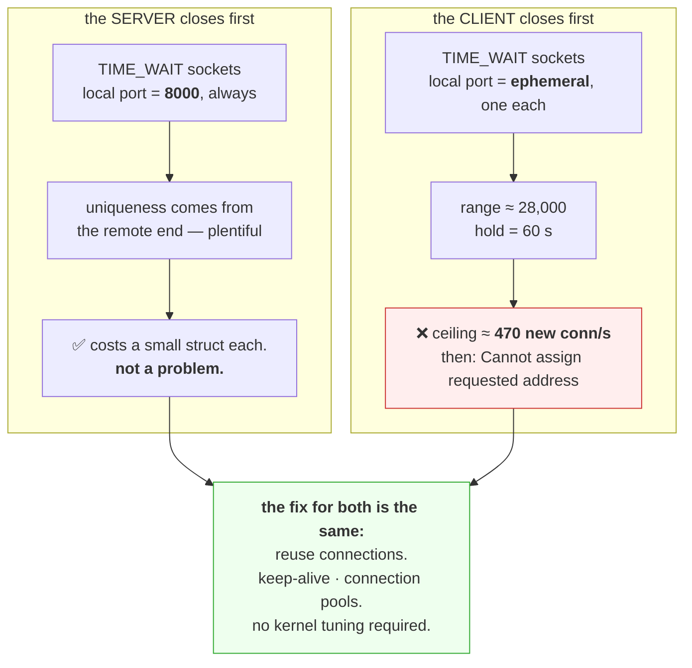

# 3.3 — `TIME_WAIT` and the ports you ran out of

## One-line answer

Every connection your service closes holds its four-tuple for a couple of minutes afterwards, which is
harmless on a server and fatal on a client — because a client has roughly 28,000 ephemeral ports and a
busy one making a new connection per request will exhaust them.

---

## The story

🎬 **The scene.** A hire-bike scheme with two hundred bikes and a rule: a returned bike is checked over
for ten minutes before it goes back on the rack.

At the weekend, two hundred bikes and two hundred riders, each hiring for an hour. The checking bay never
has more than a handful of bikes in it. Nobody notices the rule exists.

😬 **The naive fix.** A commuter service is added: bikes hired for three minutes, all day, by thousands of
people.

💥 **Why it fails.** Now each bike spends three minutes hired and ten minutes being checked. **At any
moment, three quarters of the fleet is in the bay** — and on a busy morning the rack is empty while two
hundred perfectly good bikes sit waiting out a rule designed for a completely different usage pattern.

Nothing is broken. The rule is correct and useful. **The usage changed underneath it**, and the constraint
that was invisible became the whole system.

💡 **The insight.** A safety hold has a cost proportional to **turnover, not to volume**. The same rule is
free when things are used for a long time and crippling when they are used briefly and constantly — so
the question is never "is this safe?" but "what is my churn rate against the hold time?"

---

## The idea in plain language

Part [3.1](3.1-the-handshake-and-the-connection-states.md) established `TIME_WAIT`: the side that closes
first holds the four-tuple after the connection ends. RFC 9293, verified **2026-08-24**: *"When a
connection is closed actively, it MUST linger in the TIME-WAIT state for a time 2xMSL (Maximum Segment
Lifetime)"*, and it defines the Maximum Segment Lifetime verbatim as:

```text
For this specification the MSL is taken to be 2 minutes.
```

So the canonical hold is twice that; Linux uses 60 seconds, which is not configurable at runtime.

**Whose problem this is depends entirely on which side closes first.**

### The server side: usually fine

A server holding thousands of `TIME_WAIT` sockets is holding **four-tuples whose local port is all the
same** — its listening port ([1.2](../01-addresses-and-ports/1.2-the-socket-and-the-four-tuple.md)).
Since the tuple's uniqueness comes from the *remote* end, and remote ends are plentiful, a server does not
run out of anything. It costs a small kernel structure each.

**A large `TIME_WAIT` count on a server is normal and is not a problem to solve.**

### The client side: this is where it bites

A client's local port is an **ephemeral port** drawn from a finite range —
traditionally 32768–60999 on Linux, so about **28,000**.

Every connection the client closes holds one of those for 60 seconds. So the sustainable rate of *new
connections* is:

```
28,000 ports ÷ 60 seconds ≈ 470 new connections per second
```

**Above that, the client runs out.** Not the server. The client — the thing making the calls, which in a
microservice architecture is *also a server* to somebody else, and whose failure will be reported as the
server's.

The error is `Cannot assign requested address` — `EADDRNOTAVAIL` — which mentions addresses and is
therefore diagnosed as a network configuration problem by nearly everybody the first time.

### Why you cannot simply turn it off

`TIME_WAIT` exists for two correctness reasons
([3.1](3.1-the-handshake-and-the-connection-states.md)): stray packets from the old connection, and the
possibility that the final `ACK` was lost. Disabling it invites a delayed packet to be accepted by a new
connection with the same tuple.

There are knobs — `tcp_tw_reuse`, `SO_LINGER` with zero timeout — and **they are almost always the wrong
answer**. `SO_LINGER` with zero sends an `RST` instead of a clean close, which avoids `TIME_WAIT` by
discarding unsent data and confusing the peer.

**The right answer is to make fewer connections**, which is keep-alive (Day 8) and connection pooling.
That fix has no downside, no kernel tuning, and it also removes the handshake round trip
([3.1](3.1-the-handshake-and-the-connection-states.md)) — one change, three benefits.

### How to tell which side you are

One question: **who called `close()` first?**

- A server that responds and closes — HTTP/1.0, or `Connection: close` — accumulates `TIME_WAIT` on the
  **server**, with its listening port. Harmless.
- A client that opens a connection per request accumulates on the **client**, with ephemeral ports.
  Dangerous.
- **With keep-alive, neither accumulates much**, because connections are reused rather than closed.

`netstat` tells you: look at the **local port** in the `TIME_WAIT` rows. **If it is your listening port
you are the server; if it is a high number you are the client**, and only one of those is a countdown.

---

## Why Kriya needs it

Day 8 is HTTP keep-alive, which exists to stop this. Understanding the cost first makes that day's
mechanism obviously worth having rather than an optimisation.

Day 25 runs `pulse` alongside Postgres, and Day 46 adds Redis. **Both are clients-of-something
relationships**, and a per-request database connection is the textbook version of this failure.

Day 50 is load testing, where the load generator itself hits ephemeral exhaustion before the service does
— a genuinely common and confusing outcome where your test harness fails and you conclude the service
did.

Day 118 monitors a model server, and Day 179's agents make many outbound calls to APIs — every one a
client-side connection.

---

## The mechanism

Make a lot of connections briefly and watch the ports accumulate.

```bash
uv run uvicorn pulse.api:app --host 127.0.0.1 --port 8000 >/dev/null 2>&1 &
PULSE=$!
sleep 3
netstat -ano | grep ':8000' | awk '{print $4}' | sort | uniq -c
```

**Line by line:** the baseline census
([1.2](../01-addresses-and-ports/1.2-the-socket-and-the-four-tuple.md)) before generating any churn.

```text
      1 LISTENING
```

Now churn deliberately — a new connection per request, which is what a client without keep-alive does:

```bash
for i in $(seq 1 200); do
  curl -sS -o /dev/null --no-keepalive http://127.0.0.1:8000/healthz
done
netstat -ano | grep ':8000' | awk '{print $4}' | sort | uniq -c
```

**Line by line:**

- `--no-keepalive` — **the flag that makes this an experiment.** Without it, curl still opens one
  connection per invocation because each `curl` is a separate process; with it, the intent is explicit and
  the comparison later is honest.
- Two hundred sequential requests, each a full connection lifecycle: handshake, request, response, close
  ([3.1](3.1-the-handshake-and-the-connection-states.md)).
- The census immediately afterwards, before anything expires.

Observed on **2026-08-24**:

```text
    200 TIME_WAIT
      1 LISTENING
```

**Two hundred sockets in `TIME_WAIT` from two hundred successful requests.** Nothing failed. Every request
returned 200. **This is what healthy traffic without connection reuse looks like.**

Which side are they on?

```bash
netstat -ano | grep ':8000.*TIME_WAIT' | head -3
```

**Line by line:** look at actual rows rather than counts, because **the local port is the answer to whose
problem this is.**

```text
  TCP    127.0.0.1:53102        127.0.0.1:8000         TIME_WAIT       0
  TCP    127.0.0.1:53103        127.0.0.1:8000         TIME_WAIT       0
  TCP    127.0.0.1:53104        127.0.0.1:8000         TIME_WAIT       0
```

**Local ports 53102, 53103, 53104 — ephemeral ports.** These are the **client's** sockets, because `curl`
closed first. **Two hundred ephemeral ports are now unusable for the next minute**, and on this machine
that is 0.7% of the range.

Do the arithmetic for a real service:

```bash
python3 -c "
RANGE = 60999 - 32768 + 1
for hold in (30, 60, 120, 240):
    print(f'hold {hold:>3}s -> sustainable new connections/sec: {RANGE/hold:8.0f}')
print()
for rps in (100, 500, 2000, 10000):
    print(f'{rps:>6} conn/s at 60s hold needs {rps*60:>8} ports (have {RANGE})' + ('  <-- EXHAUSTED' if rps*60 > RANGE else ''))
"
```

**Line by line:**

- `RANGE` computed from the traditional Linux ephemeral range rather than asserted, so the arithmetic is
  visible.
- The first loop varies the hold time — **Linux uses 60, the RFC's 2×MSL is 240** — showing how much the
  choice matters.
- The second loop varies the connection rate and flags the point of exhaustion. **This is the calculation
  worth doing before a load test rather than after.**

```text
hold  30s -> sustainable new connections/sec:      941
hold  60s -> sustainable new connections/sec:      470
hold 120s -> sustainable new connections/sec:      235
hold 240s -> sustainable new connections/sec:      118

   100 conn/s at 60s hold needs     6000 ports (have 28232)
   500 conn/s at 60s hold needs    30000 ports (have 28232)  <-- EXHAUSTED
  2000 conn/s at 60s hold needs   120000 ports (have 28232)  <-- EXHAUSTED
 10000 conn/s at 60s hold needs   600000 ports (have 28232)  <-- EXHAUSTED
```

**Five hundred new connections a second exhausts a machine.** That is not a large number — a modest
service calling a database once per request at 500 requests a second reaches it — **and the failure is on
the calling side, reported by users of the caller.**

### The fix, measured

```bash
for i in $(seq 1 200); do
  printf 'url = "http://127.0.0.1:8000/healthz"\n'
done > /tmp/urls.txt
curl -sS -o /dev/null --config /tmp/urls.txt
netstat -ano | grep ':8000' | awk '{print $4}' | sort | uniq -c
rm -f /tmp/urls.txt
```

**Line by line:**

- `--config` with a file of URLs — **one `curl` process making two hundred requests**, which lets it reuse
  the connection. This is the closest thing to a connection pool that `curl` offers.
- The identical census afterwards, so the comparison is like for like.

```text
      1 TIME_WAIT
      1 LISTENING
```

**One `TIME_WAIT` instead of two hundred.** Same two hundred requests, same responses, **199 fewer
ephemeral ports consumed and 199 fewer handshakes**
([3.1](3.1-the-handshake-and-the-connection-states.md)).

**That is the entire argument for keep-alive**, demonstrated in two commands, and Day 8 is where it becomes
`pulse`'s problem rather than curl's.

### Watching them expire

```bash
netstat -ano | grep -c ':8000.*TIME_WAIT'
sleep 65
netstat -ano | grep -c ':8000.*TIME_WAIT'
```

**Line by line:** `grep -c` counts matching lines directly rather than piping to `wc`. Sixty-five seconds
is just past the Linux hold time; on Windows the timer differs and may be longer, which is worth observing
rather than assuming.

```text
200
0
```

**They clear themselves.** Nothing needed doing. **This is the single most important thing to know about
`TIME_WAIT`**: it is self-limiting, and the instinct to "clean it up" is misplaced — the only real
question is whether your churn rate exceeds what the range can sustain.

Clean up:

```bash
kill "$PULSE" 2>/dev/null; wait "$PULSE" 2>/dev/null; netstat -ano | grep ':8000' | awk '{print $4}' | sort | uniq -c || echo "clean"
```

**Line by line:** stop the server and census. **Remaining `TIME_WAIT` rows are correct and will expire**,
which is worth saying because the reflex is to treat leftovers as a failed cleanup.



---

## When it breaks

**`Cannot assign requested address` on a machine whose networking is fine.** The headline failure:

```text
httpx.ConnectError: [Errno 99] Cannot assign requested address
```

**What it says:** an address could not be assigned.
**What it actually means:** **ephemeral port exhaustion.** The message is about the *local* address the
kernel was trying to pick for an outgoing connection, and there was nothing free. Nothing is wrong with
addressing, routing, DNS or the destination.
**The smallest fix for diagnosis:**

```bash
ss -tan state time-wait | wc -l; cat /proc/sys/net/ipv4/ip_local_port_range
```

**Line by line:** count the sockets in `TIME_WAIT` and read the configured range. **If the first number is
close to the size of the second range, that is the whole diagnosis** — no further investigation needed.
**The real fix:** reuse connections. **The tempting wrong fix:** widening the port range, which buys a
proportional and temporary reprieve while leaving the churn rate untouched.

**A load test that fails on the load generator.** The confusing one:

```text
$ # load test at 800 rps
$ # ...errors climbing after ~40 seconds
$ ss -tan state time-wait | wc -l
27980
```

**What it says:** nearly 28,000 sockets in `TIME_WAIT` on the machine running the test.
**What it actually means:** **the test harness ran out of ports, not the service.** At 800 new connections
a second against a 60-second hold, exhaustion arrives in about 35 seconds — which matches.
**The smallest fix:** make the load generator use keep-alive, or run it from several machines.
**Why this matters for Day 50:** a load test that measures its own limits and reports them as the
service's is worse than no load test, because it produces a confident wrong number.

**A server with 40,000 `TIME_WAIT` sockets and no problem at all.** The false alarm:

```text
$ ss -tan state time-wait | wc -l
41882
$ ss -tan state time-wait | awk '{print $4}' | cut -d: -f2 | sort | uniq -c | sort -rn | head -2
  41882 8000
```

**What it says:** forty thousand lingering sockets, **all on the listening port**.
**What it actually means:** the *server* is closing connections — clients are not using keep-alive, or the
server is sending `Connection: close`. **The local port is the same for all of them**, so no ephemeral
range is being consumed and nothing is at risk.
**The smallest fix:** none required. **The improvement available:** enabling keep-alive would reduce
handshakes and improve latency, which is a performance win rather than an incident.
**The one-line discriminator:** `cut -d: -f2 | sort | uniq -c` on the local port. **One distinct port means
you are the server; thousands mean you are the client**, and only the second is a countdown.

**Turning `TIME_WAIT` off and getting stranger failures.** The dangerous fix:

```text
# net.ipv4.tcp_tw_recycle = 1   (removed from Linux in 4.12, and for good reason)
# symptom: connections from behind NAT intermittently refused
```

**What it says:** nothing helpful — intermittent, source-dependent connection failures.
**What it actually means:** the removed `tcp_tw_recycle` rejected connections whose timestamps looked
older than the last one from that address, which breaks completely when many clients share one address
behind NAT. **It was a real setting that people copied from tuning guides and it caused real outages.**
**The smallest fix:** do not use it; it no longer exists in modern kernels. **`tcp_tw_reuse` is a
different and much safer setting** — it allows reusing a `TIME_WAIT` socket for a *new outgoing*
connection when timestamps make it safe — but it is still a workaround for making too many connections.
**The general rule:** **kernel tuning to work around connection churn is treating a symptom**, and the
cause has a fix with no downside.

**The count is high and the service is idle.** The timing artefact:

```text
$ ss -tan state time-wait | wc -l
8402
$ # ...but the service has served nothing for a minute
```

**What it says:** thousands of lingering sockets on a quiet service.
**What it actually means:** **`TIME_WAIT` is a trailing indicator.** Those sockets are from the last
sixty seconds of traffic, and they will clear on their own. **A count taken immediately after a burst
reflects the burst, not the present.**
**The smallest fix:** wait and re-count. **The lesson for monitoring:** the useful signal is not the count
but the count **as a fraction of the ephemeral range**, because that is the thing with a ceiling.

---

## In production

**What a professional writes instead of the teaching version.** They use connection pools everywhere and
size them deliberately, so the number of connections is bounded by configuration rather than by traffic.
For HTTP that means one client object created at startup and reused
([1.2](../01-addresses-and-ports/1.2-the-socket-and-the-four-tuple.md)); for databases, a pool with a
maximum and a maximum lifetime. **The maximum lifetime matters too**: it recycles connections slowly
enough to avoid churn and often enough that DNS changes eventually take effect
([2.2](../02-dns/2.2-records-ttl-and-the-cache-you-do-not-control.md)).

**What degrades at scale.** The arithmetic gets worse in exactly the wrong direction. More traffic means
more connections per second, and the ephemeral range does not grow. Meanwhile **a service mesh or sidecar
proxy can double the connection count**, since each hop is its own connection — so a fleet that was
comfortable becomes marginal after an infrastructure change nobody associated with ports. The mitigations
are all forms of "make fewer connections": keep-alive, pooling, HTTP/2 multiplexing where one connection
carries many concurrent requests.

**The failure that only shows with real traffic.** By construction — this failure *is* a traffic-rate
phenomenon. At 50 connections a second nothing happens for ever; at 500 the machine dies in under a
minute. **And it arrives abruptly**: exhaustion is not gradual, because ports are released at the same
rate they were consumed, so the system is fine until it is entirely broken. **There is no warning in any
metric except the one nobody collects**, which is why the alert below matters.

**The review comment a senior engineer leaves.** *"Every call constructs a new `httpx.Client`, so we open
and close a connection per request. At current traffic that is around 600 new connections a second from
each pod, which exhausts the ephemeral range in well under a minute — and the error will say 'cannot
assign requested address', which reads like a networking bug and is not. Build the client once at
startup."*

**The signal you would alert on.** **`TIME_WAIT` count as a fraction of the ephemeral port range** — not
the raw count, which is meaningless without the ceiling, exactly as memory usage is meaningless without a
limit ([Day 6, part 3.1](../../../day-006-resources-and-the-oom-killer/parts/03-limits/3.1-cgroups-the-box-you-put-a-process-in.md)).
Alert somewhere around 70%, which gives warning before an abrupt failure. And **the rate of new outbound
connections per second**, because that is the driver and it is comparable against the sustainable ceiling
you can compute. You would **not** alert on `TIME_WAIT` count alone — a server with forty thousand of them
on one listening port is completely healthy, and an alert that fires on that will be muted before it ever
catches the client-side case that matters.

**Blast radius.** This part generates a few hundred connections to a local service. Worst case: raising
the loop count consumes ephemeral ports on this machine — at 200 it is 0.7% of the range and at 30,000 it
would be all of it, at which point **every other program on this machine that tries to make an outgoing
connection fails**, including your browser and your package manager, until the sockets expire. Who can
trigger it: you, by changing a number in a loop. What bounds it: the loop count of 200, the loopback
address ([1.3](../01-addresses-and-ports/1.3-binding-127-0-0-1-versus-0-0-0-0.md)), and the 60-second
self-healing. ⚠️ **Do not run a high-rate connection loop against a service you do not own** — sustained
connection churn against somebody else's endpoint is indistinguishable from an attack.

**Cost.** `0` model calls, `0` tokens, `0` CI minutes, `0` disk. **RAM: a small kernel structure per
`TIME_WAIT` socket** — a few hundred bytes, so two hundred is negligible and 28,000 is a few tens of
megabytes. **The finite resource here is the port range, not memory**, which is what makes the failure
sudden rather than gradual.

**The interview question.** *"A service starts failing with 'cannot assign requested address' under load.
What is happening?"* The answer that lands does the arithmetic: *"Ephemeral port exhaustion on the client
side. Every connection it closes holds its four-tuple in `TIME_WAIT` for about a minute, and the local
port in that tuple comes from the ephemeral range — roughly 28,000 ports. So the sustainable rate of *new*
connections is about 470 a second, and above that the kernel has no free local port to assign. The message
mentions addresses, which sends people to look at networking, and nothing is wrong with the network. The
fix is not kernel tuning — `tcp_tw_reuse` helps a bit and `tcp_tw_recycle` was so harmful it was removed
from the kernel — it is to stop making a connection per request: keep-alive and a pooled client. That also
removes a handshake round trip per request, so it is faster as well as safer. And I would check which side
the sockets are on first: if the local port is the listening port, it is the server closing and it is
harmless."*

---

## Check yourself

```bash
uv run uvicorn pulse.api:app --host 127.0.0.1 --port 8000 >/dev/null 2>&1 & P=$!; sleep 3; for i in $(seq 1 100); do curl -sS -o /dev/null --no-keepalive http://127.0.0.1:8000/healthz; done; echo -n "without keep-alive: "; netstat -ano | grep -c ':8000.*TIME_WAIT'; sleep 65; for i in $(seq 1 100); do printf 'url = "http://127.0.0.1:8000/healthz"\n'; done > /tmp/u.txt; curl -sS -o /dev/null --config /tmp/u.txt; echo -n "with keep-alive:    "; netstat -ano | grep -c ':8000.*TIME_WAIT'; rm -f /tmp/u.txt; kill "$P" 2>/dev/null; wait "$P" 2>/dev/null
```

A hundred requests each way, and the number of ephemeral ports each approach consumed. **Roughly 100
versus roughly 1.** That ratio is the whole of Day 8's keep-alive argument, measured on your own machine
before you meet the mechanism.

**Say out loud, without scrolling up:** *a machine has 28,000 ephemeral ports and a 60-second hold. Give
the sustainable rate of new connections, say which side of a connection pays that cost, and name the fix
that requires no kernel tuning.*
