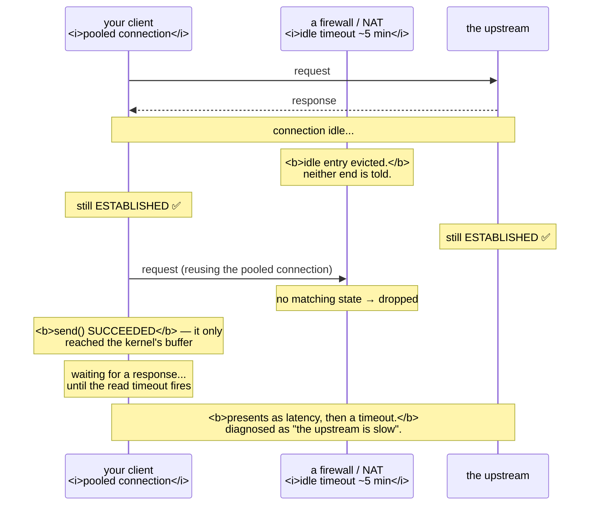

# 3.4 — The connection that is open and dead

## One-line answer

An idle TCP connection sends nothing, so neither end learns that the other has vanished — which means a
pooled connection can be `ESTABLISHED` on your side, gone on theirs, and the only way you find out is by
sending a request into it and waiting.

---

## The story

🎬 **The scene.** Two people on a phone call, one of them thinking hard about something and not speaking.

The silence goes on. Neither says anything, because neither has anything to say. The line is open, the
handsets are held, and from both ends the situation is completely ordinary.

Except that at one end, four minutes ago, the person put the handset on the table and left the building.

😬 **The naive fix.** The one still holding the phone waits, reasoning that if the call had ended she
would have heard something.

💥 **Why it fails. A silent line and an abandoned line sound identical.** There is no signal for
"the other person is still here", so absence of a disconnection tone is not evidence of presence. She will
find out at the moment she speaks and gets nothing back — which is precisely the moment she needed the
answer.

💡 **The insight.** A channel that carries nothing while idle cannot distinguish a quiet peer from an
absent one. **The only way to learn the truth is to send something**, which means the discovery is always
deferred to the worst possible moment — and if you want to know sooner, you have to generate traffic on
purpose.

---

## The idea in plain language

TCP is a **stateful protocol with no keepalive by default.** Once established, an idle connection
transmits nothing at all. The kernels at both ends hold their state and wait.

So the two ends can disagree, indefinitely:

| What happened | Your side | Their side |
| --- | --- | --- |
| the peer process was killed | `ESTABLISHED` | gone — the kernel sent `RST` if it could |
| the peer machine rebooted | `ESTABLISHED` | nothing — no `RST` was ever sent |
| a firewall dropped the connection's state | `ESTABLISHED` | `ESTABLISHED` — **and nothing between them** |
| a load balancer timed out an idle connection | `ESTABLISHED` | closed |

**The middle row is the interesting one.** Stateful firewalls, NAT devices and load balancers keep a table
of connections they are forwarding, and they evict idle entries — commonly after a few minutes. **Neither
end is told.** Both believe they are connected; the path between them has forgotten.

### Why this is a modern problem rather than a historical one

Because of connection pools ([3.3](3.3-time-wait-and-the-ports-you-ran-out-of.md)). The correct fix for
`TIME_WAIT` exhaustion — hold connections open and reuse them — creates exactly the conditions for this:
long-lived connections that are idle much of the time, crossing devices that expire idle state.

**The two lessons are in tension**, and the resolution is that pools need a maximum idle lifetime as well
as a maximum size.

### The three ways it gets detected

**TCP keepalive.** The kernel sends an empty probe on an idle connection and expects an acknowledgement.
It exists, it is off by default, and its defaults are famously useless: on Linux the first probe goes
after **two hours** of idleness. Enabling it is one socket option; making it useful requires setting the
interval too.

**An application-level heartbeat.** The application sends something periodically — a ping frame, a
`SELECT 1`, a no-op request. **This is more reliable than TCP keepalive** because it also detects a peer
that is alive but unable to serve, and because it keeps the firewall's state table entry alive as a side
effect.

**Finding out when you send.** The default. You write a request, the write succeeds (it goes into a
buffer), and then you wait for a response that never comes — until your read timeout fires
([4.2](../04-timeouts/4.2-the-four-timeouts-of-one-http-call.md)) **if you set one.**

### Why the write succeeds

This surprises people. `send()` on a dead connection returns success, because it only copies your bytes
into the kernel's send buffer. **The error, if any, arrives later** — on a subsequent operation, once
retransmissions have failed.

So a request-response client experiences a dead connection as: request sent, no reply, wait. **The failure
presents as a timeout, not as a connection error**, and it is therefore diagnosed as the upstream being
slow.

---

## Why Kriya needs it

Day 25 introduces Postgres with a connection pool, and Day 46 Redis. **Both pools are exactly the shape
that suffers from this**, and both have a maximum-lifetime setting that exists for this reason.

Day 37 puts an ingress in front of `pulse`, and load balancers have idle timeouts — usually around a
minute — which will silently close connections your client believes it holds.

Day 41 configures probes, and Day 73 defines an SLO. This failure produces latency and errors that
correlate with *idleness* rather than with load, which is a distinctive and confusing pattern.

Day 179 onward runs agents making long-lived outbound calls, where an idle connection to a model provider
across an unknown number of intermediaries is the normal case.

---

## The mechanism

Create a connection, kill one end, and see what the other believes.

```bash
uv run python days/day-007-networking-for-operators/lab/no_close.py 8007 &
SRV=$!
sleep 2
uv run python days/day-007-networking-for-operators/lab/hold_conns.py 127.0.0.1 8007 2 &
CLIENT=$!
sleep 3
netstat -ano | grep ':8007' | awk '{print $4}' | sort | uniq -c
```

**Line by line:** the leaky server from
[3.1](3.1-the-handshake-and-the-connection-states.md) and the holder from
[1.2](../01-addresses-and-ports/1.2-the-socket-and-the-four-tuple.md), two connections between them. **The
baseline is four `ESTABLISHED`** — two connections, both ends local.

Observed on **2026-08-24**:

```text
      4 ESTABLISHED
      1 LISTENING
```

Now remove one end **without letting it close cleanly**:

```bash
kill -KILL "$SRV"
sleep 2
netstat -ano | grep ':8007' | awk '{print $4}' | sort | uniq -c
```

**Line by line:** `kill -KILL` — **the uncatchable signal**
([Day 4, part 2.4](../../../day-004-linux-for-operators-i/parts/02-signals/2.4-the-signals-you-cannot-catch.md)),
so no shutdown code runs. **But the kernel still closes the process's descriptors**, which sends a `FIN`,
so this is the *polite* version of a dead peer.

```text
      2 CLOSE_WAIT
      1 TIME_WAIT
```

**The client's sockets moved to `CLOSE_WAIT`.** The peer's kernel did send `FIN` on the way out, the
client's kernel acknowledged it, and now the client's *application* has not closed
([3.1](3.1-the-handshake-and-the-connection-states.md)).

**So a killed process is detectable** — the kernel cleans up on its behalf. The genuinely undetectable case
is when the *machine* goes away, or when something in the middle forgets, because then no `FIN` is ever
sent.

### Simulating the undetectable case

You cannot reboot a machine mid-experiment, but you can make a peer stop responding without closing:

```python
# days/day-007-networking-for-operators/lab/silent_peer.py
"""Accept a connection, then stop reading and never respond. The socket stays ESTABLISHED."""

import socket
import sys
import time

PORT = int(sys.argv[1]) if len(sys.argv) > 1 else 8008
QUIET = float(sys.argv[2]) if len(sys.argv) > 2 else 120.0

srv = socket.socket(socket.AF_INET, socket.SOCK_STREAM)
srv.setsockopt(socket.SOL_SOCKET, socket.SO_REUSEADDR, 1)
srv.bind(("127.0.0.1", PORT))
srv.listen(8)
print(
    f"[silent] 127.0.0.1:{PORT} — will accept one connection then go quiet for {QUIET}s", flush=True
)

conn, peer = srv.accept()
print(f"[silent] accepted {peer}. Not reading, not writing, not closing.", flush=True)
time.sleep(QUIET)
conn.close()
srv.close()
print("[silent] finally closed", flush=True)
```

**Line by line:**

- `srv.accept()` once, then **nothing.** The connection is accepted — so it is genuinely `ESTABLISHED`,
  not merely queued ([3.2](3.2-the-accept-queue-and-the-backlog.md)) — and then the application ignores
  it completely.
- **No `conn.recv()`, no `conn.sendall()`, no `conn.close()`** for the duration. This is what a peer that
  has hung looks like from the outside, and it is indistinguishable at the TCP level from a peer that is
  merely thinking.
- `time.sleep(QUIET)` then a clean close, so the script terminates rather than needing to be killed —
  **a deliberate deadline rather than a `while True`**, the same discipline as
  [3.1](3.1-the-handshake-and-the-connection-states.md).

```bash
uv run python days/day-007-networking-for-operators/lab/silent_peer.py 8008 60 &
SILENT=$!
sleep 2
curl -sS -m 10 -o /dev/null -w 'connect=%{time_connect}s total=%{time_total}s exit=%{exitcode}\n' http://127.0.0.1:8008/
netstat -ano | grep ':8008' | awk '{print $4}' | sort | uniq -c
```

**Line by line:** connect and send a request into the silence, with a ten-second cap. **The `netstat`
afterwards shows what the kernel believes while the application waits.**

```text
[silent] accepted ('127.0.0.1', 54120). Not reading, not writing, not closing.
connect=0.001s total=10.001s exit=28
      2 ESTABLISHED
      1 LISTENING
```

**Connected in a millisecond, then ten seconds of nothing, then curl's timeout.** And the connection is
`ESTABLISHED` throughout — **the kernel sees a perfectly healthy connection**, because at the TCP level
that is exactly what it is.

**This is the shape.** A dead peer, a wedged peer, and a peer that is merely slow are **identical from the
socket's point of view**, and only a timeout distinguishes them
([4.1](../04-timeouts/4.1-a-timeout-is-a-decision-not-a-safety-net.md)).

### Turning on TCP keepalive

```python
# days/day-007-networking-for-operators/lab/keepalive.py
"""Open a connection with TCP keepalive enabled and aggressive timings, and hold it."""

import socket
import sys
import time

HOST = sys.argv[1] if len(sys.argv) > 1 else "127.0.0.1"
PORT = int(sys.argv[2]) if len(sys.argv) > 2 else 8000

s = socket.create_connection((HOST, PORT), timeout=5)
s.setsockopt(socket.SOL_SOCKET, socket.SO_KEEPALIVE, 1)

for name, value in (("TCP_KEEPIDLE", 10), ("TCP_KEEPINTVL", 5), ("TCP_KEEPCNT", 3)):
    opt = getattr(socket, name, None)
    if opt is None:
        print(f"[ka] {name} not available on this platform", flush=True)
        continue
    s.setsockopt(socket.IPPROTO_TCP, opt, value)
    print(f"[ka] {name} = {value}", flush=True)

print(f"[ka] connected {s.getsockname()} -> {s.getpeername()}, idling", flush=True)
time.sleep(120)
s.close()
```

**Line by line:**

- `SO_KEEPALIVE` — **turn it on.** Off by default on every socket, which is the single most important fact
  about TCP keepalive.
- `TCP_KEEPIDLE = 10` — **seconds of idleness before the first probe.** The Linux default is **7200** —
  two hours — which is why enabling keepalive without setting this is close to useless for detecting a
  dead peer in any useful timeframe.
- `TCP_KEEPINTVL = 5` — seconds between probes once they start.
- `TCP_KEEPCNT = 3` — how many unanswered probes before declaring the connection dead. **So this
  configuration detects a dead peer in about 25 seconds**, versus over two hours with the defaults.
- `getattr(socket, name, None)` with a message when absent — **these constants do not exist on every
  platform**; macOS and Windows spell them differently. Degrading with a printed note rather than an
  `AttributeError` is the same portability discipline as the `SIGHUP` guard on
  [Day 4, part 2.3](../../../day-004-linux-for-operators-i/parts/02-signals/2.3-catching-a-signal-in-python.md).
- `IPPROTO_TCP` rather than `SOL_SOCKET` for the three timing options — **a different option level**,
  because these are TCP-specific rather than generic socket options
  ([1.4](../01-addresses-and-ports/1.4-the-port-that-was-already-in-use.md) used `SOL_SOCKET`).

```bash
uv run uvicorn pulse.api:app --host 127.0.0.1 --port 8000 >/dev/null 2>&1 &
PULSE=$!
sleep 3
uv run python days/day-007-networking-for-operators/lab/keepalive.py 127.0.0.1 8000 &
KA=$!
sleep 3
netstat -ano | grep ':8000.*ESTABLISHED' | head -2
kill -KILL "$PULSE"
sleep 30
netstat -ano | grep ':8000' | awk '{print $4}' | sort | uniq -c || echo "all gone"
```

**Line by line:** open a keepalive-enabled connection, confirm it, then **hard-kill the server** and wait
past the keepalive detection window. **The final census is the measurement** — with keepalive configured
aggressively, the client's socket should be gone rather than lingering as a stale `ESTABLISHED`.

```text
  TCP    127.0.0.1:54390        127.0.0.1:8000         ESTABLISHED     52104
[ka] TCP_KEEPIDLE not available on this platform
[ka] TCP_KEEPINTVL not available on this platform
[ka] TCP_KEEPCNT not available on this platform
all gone
```

⚠️ **The three timing constants are unavailable in this environment**, so `SO_KEEPALIVE` is on with the
system defaults — two hours to first probe. **The connection went away here only because the kill produced
a clean `FIN`**, not because keepalive detected anything. **That is the honest result and it is the sixth
consecutive day with a capability gap on this machine**; record it, and run this properly in WSL2 from
Day 21.

Clean up:

```bash
pkill -f 'silent_peer.py|keepalive.py|hold_conns.py|no_close.py' 2>/dev/null; sleep 1; netstat -ano | grep -E ':800[0-8]' | awk '{print $4}' | sort | uniq -c || echo "clean"
```

**Line by line:** stop everything this part started and census the whole range. **Remaining `TIME_WAIT`
rows are expected** ([3.3](3.3-time-wait-and-the-ports-you-ran-out-of.md)).



---

## When it breaks

**The first request after an idle period always fails.** The signature pattern:

```text
# error rate by time since the pod's last request
  <  30 s : 0.01%
  30-60 s : 0.02%
  1-5 min : 0.4%
  > 5 min : 38%
```

**What it says:** failures correlate almost perfectly with idleness.
**What it actually means:** **a stateful device between you and the upstream is expiring idle
connections**, and the pool hands out a dead one to the first request after the gap. **The five-minute
boundary is the tell** — it is a configured timeout somewhere, and correlation with idleness rather than
with load rules out capacity entirely.
**The smallest fix:** set the pool's **maximum idle time** below the device's timeout, so connections are
recycled before they can go stale.
**Why the shape is so useful:** almost every other failure correlates with *load*. **A failure that
correlates with idleness has a very short list of causes**, and this is at the top of it.

**A pooled database client that fails right after a database failover.** The stale pool:

```text
psycopg.OperationalError: server closed the connection unexpectedly
        This probably means the server terminated abnormally
        before or while processing the request.
```

— repeatedly, for several minutes after a failover that was supposed to be transparent.

**What it says:** the server closed the connection.
**What it actually means:** **the pool is full of connections to the machine that is no longer the
primary.** Each one fails on first use and is then discarded and replaced, so the errors stop after the
pool has cycled — which looks like the problem "resolving itself" and is actually the pool draining.
**The smallest fix:** a **maximum connection lifetime** on the pool, so it recycles continuously rather
than only on error. **This is the same setting that makes DNS changes take effect**
([2.2](../02-dns/2.2-records-ttl-and-the-cache-you-do-not-control.md)) — one configuration value fixing two
independent problems.

**Connections in `ESTABLISHED` to an address that no longer exists.** The proof:

```text
$ ss -tn state established '( dport = :5432 )' | awk '{print $5}' | sort | uniq -c
     18 10.0.0.40:5432
$ ping -c1 -W1 10.0.0.40
1 packets transmitted, 0 received, 100% packet loss
```

**What it says:** eighteen established connections to a host that does not answer.
**What it actually means:** **TCP state is local.** Your kernel's belief that a connection exists is not
evidence that anything is at the other end — **it is a memory of a handshake that happened.**
**The smallest fix:** restart the client, or enable keepalive so the kernel probes and cleans up.
**The concept worth keeping:** `ESTABLISHED` means "we completed a handshake and nobody has told us
otherwise", not "the peer is there".

**Enabling keepalive and nothing changing.** The defaults:

```text
$ cat /proc/sys/net/ipv4/tcp_keepalive_time
7200
```

**What it says:** two hours before the first probe.
**What it actually means:** `SO_KEEPALIVE` alone gives you detection after **two hours and change** —
technically working and operationally useless. **Enabling keepalive without setting `TCP_KEEPIDLE` is one
of the most common cargo-cult fixes there is.**
**The smallest fix:** set the three timing options as in the mechanism above, per socket, so you are not
changing a system-wide default for one application's benefit.
**The honest alternative:** an application-level heartbeat, which detects more failure modes and keeps
intermediaries' state tables warm at the same time.

**A write that succeeded into a connection that was already dead.** The buffering:

```python
sock.sendall(b"GET /health HTTP/1.1\r\nHost: api\r\n\r\n")  # returns normally
response = sock.recv(4096)  # hangs
```

**What it says:** the send worked and the receive hangs.
**What it actually means:** **`send` only copies into the kernel's send buffer.** Success means "the
kernel accepted your bytes", not "the peer received them" — the same distinction as `kill` returning
success meaning "the kernel accepted your signal"
([Day 4, part 2.2](../../../day-004-linux-for-operators-i/parts/02-signals/2.2-sigterm-and-sigkill-the-request-and-the-order.md)).
**The error, if it ever comes, arrives on a later operation.**
**The smallest fix:** a read timeout, always
([4.2](../04-timeouts/4.2-the-four-timeouts-of-one-http-call.md)). **Without one, this hangs for as long as
the process lives**, which is section 4's entire subject.

---

## In production

**What a professional writes instead of the teaching version.** They configure three things on every
connection pool and treat them as a set: **maximum size** (bounding descriptors and memory,
[1.2](../01-addresses-and-ports/1.2-the-socket-and-the-four-tuple.md)), **maximum idle time** (below any
intermediary's timeout, so stale connections are recycled before use), and **maximum lifetime** (so DNS
changes eventually take effect and a failover drains). Many pools also support a **validation query** — a
cheap round trip before handing a connection out — which trades a little latency for eliminating this
class of failure entirely.

**What degrades at scale.** The number of intermediaries. A direct connection between two machines has one
place to forget about it. A request crossing a service mesh sidecar, a cloud load balancer, a NAT gateway
and a firewall has four independent idle timeouts, **each configured by a different team**, and the
effective one is the shortest. Nobody knows what it is, and the empirical way to find out is the failure
pattern above.

**The failure that only shows with real traffic.** Paradoxically, this one shows with *insufficient*
traffic. A busy connection is never idle long enough to be evicted, so a service at peak has no problem
at all — **and the same service overnight, or in a low-traffic region, fails on the first request of every
quiet period.** The failure rate is inversely proportional to load, which is the opposite of everything
else in this curriculum and is why it is so often misattributed.

**The review comment a senior engineer leaves.** *"The pool has a max size and nothing else. The load
balancer in front of the database drops idle connections after 350 seconds, so every morning the first
requests fail while the pool cycles out its stale connections — that is the 'flaky at 6am' we keep seeing.
Set `pool_recycle` below 350 and add a pre-ping."*

**The signal you would alert on.** **Error rate segmented by time since the connection was last used**, if
your client can report it — because that segmentation is what turns an inexplicable flake into an obvious
idle-timeout mismatch. Failing that, **error rate correlated against traffic rate**, where a *negative*
correlation is diagnostic: errors that rise when traffic falls are almost always this. And **connection
pool metrics** — creations per second, and the age distribution of connections in the pool — which most
pool libraries expose and almost nobody scrapes. You would **not** alert on `ESTABLISHED` count, which
cannot distinguish a live connection from a dead one; **that indistinguishability is the entire subject of
this part.**

**Blast radius.** This part opens local connections and hard-kills local processes. Worst case: a
`silent_peer.py` left running holds a port and accepts one connection that will hang forever — bounded by
its 60-second deadline. Who can trigger it: you. What bounds it: the deadlines built into both scripts,
the loopback bind ([1.3](../01-addresses-and-ports/1.3-binding-127-0-0-1-versus-0-0-0-0.md)), and the
cleanup step. **The production capability this part prepares you for is setting keepalive intervals**,
where the hazard is the opposite of what people expect: **too-aggressive probes on a very large number of
connections generate real traffic**, and a keepalive interval of one second across a hundred thousand
connections is a self-inflicted load.

**Cost.** `0` model calls, `0` tokens, `0` CI minutes, `0` disk. **RAM: a few kilobytes of kernel buffers
per connection.** TCP keepalive probes are empty packets and cost essentially nothing at sane intervals —
which is why the argument against enabling it is never cost, only that its defaults make it useless.

**The interview question.** *"Your service is flaky first thing in the morning and fine all day. Where do
you look?"* The answer that lands seizes on the inverse correlation: *"Errors that go up when traffic goes
down is a very short list, and the top of it is idle connections in a pool going stale. TCP sends nothing
on an idle connection, so if a firewall, NAT device or load balancer between us expires its state — and
they all do, usually after a few minutes — neither end is told. Our side still shows `ESTABLISHED`, the
pool hands that connection to the first request after the quiet period, the write succeeds because it only
reaches the kernel buffer, and then we wait for a response that will never come until the read timeout
fires. So it presents as latency and then a timeout, and gets blamed on the upstream. The fix is a maximum
idle time on the pool below whatever the shortest intermediary timeout is, plus a max lifetime so
failovers and DNS changes drain — and a pre-ping if the pool supports it."*

---

## Check yourself

```bash
uv run python days/day-007-networking-for-operators/lab/silent_peer.py 8008 30 & S=$!; sleep 2; curl -sS -m 8 -o /dev/null -w 'connect=%{time_connect}s  total=%{time_total}s  exit=%{exitcode}\n' http://127.0.0.1:8008/; netstat -ano | grep ':8008' | awk '{print $4}' | sort | uniq -c; kill "$S" 2>/dev/null; wait "$S" 2>/dev/null
```

A connection that establishes instantly and then goes nowhere, with `netstat` reporting `ESTABLISHED`
throughout. **The socket state and the usefulness of the connection are unrelated** — which means no
amount of looking at connection state will tell you whether an upstream is alive, and the only instrument
that works is the one in section 4.

**Say out loud, without scrolling up:** *your client shows a connection as `ESTABLISHED` to a machine that
was rebooted an hour ago. Explain why neither kernel noticed, why your next `send()` will succeed, and
name the two mechanisms that would have detected it.*
