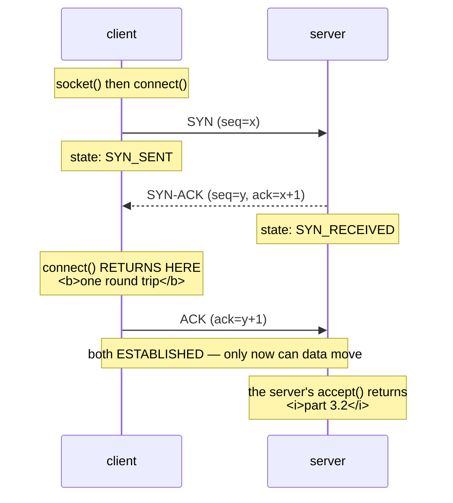

# 3.1 — The handshake, and what `connect()` actually waits for

## One-line answer

Before a single byte of your request exists, both machines exchange three small packets to agree that they
are talking to each other — so **every connection costs at least one round trip**, and the time that costs
belongs to the distance between the machines, not to the speed of either one.

---

## The story

🎬 **The scene.** Two people are trying to arrange a swap: one has a spare cot, one wants it, and they have
never met. They agree on a car park at the weekend.

😬 **The naive fix.** The first one arrives, sees a car with somebody in it, and starts loading the cot into
the boot.

💥 **Why it fails.** It is the wrong car. The driver is waiting for a completely different person, is now
extremely confused, and the cot is halfway into a stranger's boot. **Being in the right place at the right
time is not the same as having established that you are dealing with the right person.** The fix everyone
uses without thinking about it is three sentences: *are you here for the cot?* — *yes, are you the one who
messaged me?* — *yes, that is me.* Only then does anything get loaded.

💡 **The insight.** Two parties who cannot see each other need **a short exchange whose only content is
confirming each other's presence**, before any real business happens. It feels like overhead, it carries no
payload at all, and skipping it means doing the real work with somebody who is not listening.

---

## The idea in plain language

Part [1.2](../01-the-address/1.2-the-socket-and-the-four-tuple.md) established that a connection is
identified by four numbers. This part is about how those four numbers get agreed.

TCP is a **connection-oriented** protocol, meaning the two ends establish shared state before any data
moves. That establishment is the **three-way handshake**, and it is exactly three packets.

**SYN.** The client sends a packet with the synchronise flag set. It says *I would like to open a
connection, and here is the sequence number I will start counting from.* The client's socket is now in the
state `SYN_SENT`.

**SYN-ACK.** The server replies with both flags: *I acknowledge yours, and here is mine.* The server's
socket is in `SYN_RECEIVED`.

**ACK.** The client acknowledges the server's half. Both ends are now `ESTABLISHED`, and data may flow.

### What this means for the `connect()` call in your code

`connect()` returns when the client has received the **SYN-ACK** — that is, after one full round trip:
out and back. The third packet is on its way but nobody waits for it.

So the cost of establishing a connection is **one round-trip time**, and a round-trip time is a property of
the *distance and the path*, not of how fast either machine is. A server that responds in a microsecond and
sits on another continent still costs you the better part of a fifth of a second before your request has
left. **You cannot optimise your way out of it; you can only avoid paying it repeatedly**, which is what a
connection pool is for and why part [3.3](3.3-time-wait-and-the-ports-you-ran-out-of.md) matters.

### The three ways it can end

**It completes**, in about one round trip.

**It is refused.** Something at the other end sent a `RST` — a reset — meaning *there is nothing listening
here*. This is an **answer**: fast, definite, and it tells you the machine is up and the port is empty.

**Nothing comes back at all.** No `SYN-ACK` and no `RST`. The client's operating system retransmits the
`SYN` a few times, waiting longer between attempts, and eventually gives up. This is **slow by
construction**, and it means something swallowed the packet without replying — a firewall, a routing
black hole, or a machine that is simply not there.

Those three outcomes are the entire subject of part
[3.4](3.4-connection-refused-versus-connection-timed-out.md), and everything in this day's diagnosis hangs
off telling them apart.

---

## Why Kriya needs it

Day 8 adds TLS, which is **more round trips on top of this one** — the handshake you learn here is the
first of several, and understanding why the first one costs a round trip is what makes the TLS cost
predictable rather than mysterious.

Day 9 calls a model provider over the internet. The round-trip cost is a floor under every call `pulse`
makes, and it is the reason a client is built once and reused rather than created per request.

Day 25's container and Day 41's cluster both add hops, and each hop is a place where a `SYN` can be dropped
rather than answered — which converts a fast failure into a slow one.

Day 43 writes readiness probes. A probe is a connection plus a request, and knowing that the connection
alone costs a round trip is what stops you setting a probe timeout that cannot succeed.

Day 65's latency histograms have this round trip inside every bucket. If you do not know it is there, you
will look for it in your code.

---

## The mechanism

Measure the same operation against four different destinations and let the numbers separate the cases.

```python
# days/day-007-networking-for-operators/lab/handshake.py
"""Time connect() against four destinations that fail and succeed in different ways."""

import socket
import time

LISTEN_PORT = 8093

server = socket.socket()
server.setsockopt(socket.SOL_SOCKET, socket.SO_REUSEADDR, 1)
server.bind(("127.0.0.1", LISTEN_PORT))
server.listen(1)


def timed_connect(host: str, port: int, label: str) -> socket.socket:
    """Connect with a bounded wait, and report what happened and how long it took."""
    sock = socket.socket()
    sock.settimeout(5)
    started = time.monotonic()
    try:
        sock.connect((host, port))
        outcome = "connected"
    except OSError as exc:
        outcome = f"{type(exc).__name__} errno={exc.errno}"
    print(f"{label:<28} {outcome:<34} {(time.monotonic() - started) * 1000:8.2f} ms")
    return sock


targets = [
    ("127.0.0.1", LISTEN_PORT, "loopback, listener present"),
    ("127.0.0.1", 8099, "loopback, nothing there"),
    ("151.101.128.223", 443, "pypi.org over the internet"),
    ("203.0.113.1", 80, "reserved, unrouted"),
]

opened = [timed_connect(host, port, label) for host, port, label in targets]
for sock in opened:
    sock.close()
server.close()
```

**Line by line:**

- `server.listen(1)` before any client runs, so the **first** target has a real listener behind it. Without
  this the first row would be indistinguishable from the second and the comparison would collapse.
- `SO_REUSEADDR` is set here — unlike in part
  [1.4](../01-the-address/1.4-the-port-that-was-already-in-use.md), where its absence was the whole
  lesson — because this script is meant to be run repeatedly and a leftover socket from the previous run
  would stop it before it started.
- `sock.settimeout(5)` is the **most important line in the file**. The `socket` documentation, checked on
  **2026-08-26**, says a timeout means *"subsequent socket operations will raise a `timeout` exception if
  the timeout period value has elapsed before the operation has completed"*. Without it the fourth target
  would use the operating system's own connect timeout, which on Windows is around twenty-one seconds and
  on Linux longer still. **Five seconds is a decision, and this is the whole of section
  [04](../04-timeouts/4.1-a-timeout-is-a-decision-not-a-safety-net.md) in one argument.**
- `151.101.128.223` is a literal address taken from the resolution in part
  [2.1](../02-names/2.1-what-resolving-a-name-actually-does.md), **deliberately not a name**, so that this
  measurement contains no DNS at all and the number is a pure connect cost. Mixing the two is how people
  end up blaming the network for a resolver.
- `203.0.113.1` is in the range RFC 5737 reserves for documentation, which is never routed. **The target
  is chosen so the packet has nowhere to go**, rather than pointed at a stranger's machine that happens to
  be quiet.
- `except OSError` catches both the refusal and the timeout, and the printed `errno` is what separates
  them — the class names differ too, but the errno is the portable, searchable part.
- The connections are collected and closed at the end rather than inside the loop, so that all four sockets
  exist simultaneously and you can look at them with `netstat` while the script is paused if you want to.

```bash
uv run python days/day-007-networking-for-operators/lab/handshake.py
```

**Line by line:** no arguments — the four destinations *are* the experiment, and hardcoding them means the
run is reproducible rather than dependent on what you typed.

Observed on **2026-08-26**:

```text
loopback, listener present   connected                              0.00 ms
loopback, nothing there      ConnectionRefusedError errno=10061  2016.00 ms
pypi.org over the internet   connected                             62.00 ms
reserved, unrouted           TimeoutError errno=None             5000.00 ms
```

**Four rows, and every one of them teaches something different.**

**Row one: zero milliseconds.** Loopback never leaves the machine, so there is no distance to cross. The
handshake still happened — all three packets — it just cost less than the clock can measure. **This is why
local testing hides connection cost entirely.**

**Row three: sixty-two milliseconds.** The same three packets, across the internet. **Nothing about the
server is in this number** — it had no request to process yet. Sixty-two milliseconds is the path.

**Row four: exactly five thousand milliseconds**, which is exactly the timeout we set. That precision is
the tell: the operation did not fail, it was **stopped**. Nothing came back at all, and the number reports
our decision rather than anything about the network.

**Row two is the surprising one, and it is worth being careful about.** A refusal on loopback took two
seconds. A refusal is supposed to be instant — the machine is right here and there is nothing on the port.
What happened is that this machine's TCP stack **retransmitted the `SYN` before reporting the refusal**,
which is a Windows behaviour. ⚠️ **On Linux the identical case returns in well under a millisecond**,
because the kernel replies with a `RST` immediately and the client reports it immediately. **This is
recorded as a platform difference rather than a general truth**, and it is worth carrying: on this machine
you cannot use *speed* alone to tell a refusal from a timeout, and on a Linux host you can. Day 21's WSL2
setup is where you get to see the fast version.



**Read the note in the middle.** `connect()` returns after the second packet, not the third. That is why
the cost is one round trip and not one and a half.

### Watching the states

```bash
netstat -an | grep -E ':8093|:443' | head -5
```

**Line by line:**

- `-a` shows all connections rather than only listening sockets, and `-n` keeps everything numeric, from
  part [1.1](../01-the-address/1.1-an-address-and-a-port-are-two-questions.md). **`-o` is deliberately
  absent** here because the owning process is not the question; the state is.
- `grep -E ':8093|:443'` narrows to the two ports this experiment used, because a real machine has dozens
  of connections and the interesting ones would be lost.
- Run this **while** the script is holding its sockets open. Once the script exits, the state you wanted to
  see is a `TIME_WAIT`, which is part [3.3](3.3-time-wait-and-the-ports-you-ran-out-of.md)'s subject.

**What you are looking for** is the word `ESTABLISHED` next to a socket with two real endpoints, beside a
`LISTENING` socket whose remote end is `0.0.0.0:0` — the four-tuple from part
[1.2](../01-the-address/1.2-the-socket-and-the-four-tuple.md), with the listening socket's half of it
empty because it is not a connection at all.

---

## When it breaks

**A connection that succeeds and takes far too long.** The one people blame on the server.

```text
pypi.org over the internet   connected                            412.00 ms
```

**What it says:** connected.

**What it actually means:** the round trip is four hundred milliseconds, so this path is long — a different
continent, a congested link, or a route that has changed. **The server contributed nothing to this number**
because it had not been asked for anything yet.

**The smallest fix:** none, at the application layer. The response is architectural: put the connection in
a pool so the cost is paid once instead of per request, or move the work closer.

**Why it matters more than it looks:** a request that makes three sequential outbound calls, each on a
fresh connection, pays this three times before doing any work at all. **Connection setup is a hidden
multiplier on any code that calls dependencies in sequence**, and it is invisible in every profiler that
only measures your own process.

**Connect returns instantly and the request still hangs.** The trap this part exists to prevent.

```text
connected                              0.00 ms
# ... and then nothing, for as long as you are willing to wait
```

**What it says:** the connection succeeded.

**What it actually means:** **a successful handshake proves almost nothing about the server.** The three
packets are handled by the operating system's TCP stack. The application behind the port may be
deadlocked, out of memory, stuck on a lock, or an entirely different program from the one you expected —
none of that prevents a handshake. Part [3.2](3.2-the-accept-queue-and-the-backlog.md) shows the exact
mechanism by which a connection completes with no application involved at all.

**The smallest fix:** never treat "the port is open" as a health check. A check that connects and
disconnects tests the kernel, and Day 3's
[`/healthz`](../../../day-003-pulse-v0/parts/02-the-service/2.2-healthz-the-endpoint-that-must-not-lie.md)
exists precisely because that is not enough.

**Why this is the most valuable paragraph in the part:** an enormous amount of monitoring in the world is a
TCP connect check, and it goes green against a completely dead application.

**The same failure reported two different ways on two machines.** The portability trap.

```text
# on this machine (Windows)
loopback, nothing there      ConnectionRefusedError errno=10061  2016.00 ms
# the same code on Linux
loopback, nothing there      ConnectionRefusedError errno=111       0.21 ms
```

**What it says:** the same error class, two errnos, and a ten-thousand-fold difference in duration.

**What it actually means:** the **outcome** is portable and the **timing** is not. Both stacks eventually
report a refusal; this one retransmits first and Linux does not.

**The smallest fix:** write diagnostics that branch on the error, never on how long it took.

**Why it is worth stating explicitly:** a rule of thumb like "refusals are instant, timeouts are slow" is
excellent on Linux and actively wrong here, and rules of thumb learned on one platform are carried to
others silently.

**A timeout that is not yours.** The number that tells you who decided.

```text
reserved, unrouted           TimeoutError errno=None             5000.00 ms
reserved, unrouted           TimeoutError errno=None            21000.00 ms
```

**What it says:** two timeouts, at five seconds and at twenty-one.

**What it actually means:** the first is the `settimeout(5)` in the script. The second is what happens when
that line is removed and **the operating system's default takes over** — around twenty-one seconds on
Windows, from its own `SYN` retransmission schedule. `TimeoutError` with `errno=None` is the tell that this
came from Python's timeout machinery rather than from the operating system, which would have supplied a
number.

**The smallest fix:** set the timeout, always, and then the duration reports a decision you made.

**The distinction worth holding:** **a round number is a policy and a ragged number is a measurement.**
Exactly `5000.00` is somebody's configuration. `62.00` is the world.

---

## In production

**What a professional writes instead of the teaching version.** They almost never call `connect()`. They
configure an HTTP client with a connection pool and a connect timeout, and the pool means the handshake
happens once per connection rather than once per request — which for a busy service is a ratio of thousands
to one. They also **separate the connect timeout from the read timeout**, because the two bound completely
different risks: connect bounds *can I reach it*, read bounds *is it answering*, and a single number for
both is always wrong for one of them. Part
[4.2](../04-timeouts/4.2-the-four-timeouts-of-one-request.md) builds that properly.

**What degrades at scale.** Connection establishment becomes a resource rather than a detail. Every
handshake consumes an ephemeral port on the client, a slot in the server's accept queue, and memory for
socket state on both ends. At low volume none of these are visible. At high volume **the client runs out of
ports** — part [3.3](3.3-time-wait-and-the-ports-you-ran-out-of.md) — and **the server runs out of queue**
— part [3.2](3.2-the-accept-queue-and-the-backlog.md). Both present as connection failures on a system
where every process is healthy, and both are caused by connecting too often rather than by anything being
broken.

**The failure that only shows with real traffic.** The round trip, multiplied by the fan-out. A request
that touches five dependencies on fresh connections pays five round trips *before* any of them start
working. On a laptop, where every dependency is loopback, that is zero. In production, where each is a
network hop, it is the majority of the response time — and the code did not change between the two
environments. **This is the single most common reason a service is fast in development and slow in
production**, and no amount of profiling application code will reveal it, because the time is not spent in
application code.

**The review comment a senior engineer leaves.** *"This creates a new client inside the loop, so we do a
DNS lookup and a TCP handshake per iteration — a round trip each, against a service in another region.
Hoist the client out of the loop. The change is one line and it removes about ninety-five percent of the
wall-clock time of this function."*

**The signal you would alert on.** **Connection establishment time as its own histogram**, separate from
request duration, because the two have different causes and different owners: connect time is the network
and the dependency's capacity to accept, request time is the dependency's capacity to work. Also
**connection error rate split by outcome** — refused against timed out — since those two are different
incidents, as part [3.4](3.4-connection-refused-versus-connection-timed-out.md) argues. You would **not**
alert on connect time in absolute terms, because it is dominated by geography you have already accepted;
alert on a *change* in it, which means a route changed or a dependency moved. And you would **not** use a
TCP connect as a health check, for the reason two sections above — it goes green against a dead
application, so alerting on it is worse than not alerting at all.

**Blast radius.** This part opens four outbound connections and closes them. Two are to loopback, one is a
single connection to a public host that serves millions per day, and one goes to a reserved address and
never arrives. Nothing is written, nothing is sent — **not one byte of application data crosses any of
these sockets** — and every one is closed before the script exits. ⚠️ The capability worth bounding is the
loop that is not here: a script that opens connections is one edit away from opening thousands, which is
indistinguishable from an attack from the receiving end's point of view. **Never point a connection loop at
a host you do not own.** Against loopback it is a lesson; against somebody else's service it is abuse, and
part [3.3](3.3-time-wait-and-the-ports-you-ran-out-of.md), which does open hundreds of connections
deliberately, is aimed entirely at this machine for exactly that reason.

**Cost.** `0` model calls, `0` tokens, `0` CI minutes, `0` disk, negligible RAM. **Network: three packets
to a public host and three more that go nowhere** — a few hundred bytes in total. The only meaningful
resource consumed is five seconds of waiting, on purpose.

**The interview question.** *"Your service calls a dependency and the p99 is much worse than the
dependency's own reported p99. You have ruled out DNS. What else is between them?"* The answer that lands
walks the path: *"Connection setup, most likely. The dependency measures from the moment it receives a
request, so a TCP handshake — and a TLS handshake on top of it — happens entirely before its clock starts.
Each of those is at least one round trip, and the round trip is a property of the path rather than of
either machine, so it does not appear in anybody's CPU or latency graphs. The diagnostic is to split my
client-side measurement into phases and compare connect time against total; `curl --write-out` does it for
one request and a client-side histogram does it continuously. The usual cause is not pooling — a client
constructed per request, or a pool too small for the concurrency so connections are constantly being
created and discarded. It shows up in the tail rather than the median precisely because the pool covers
most requests and the overflow pays full price, which is what makes it a p99 problem rather than an
everything problem."*

---

## Check yourself

```bash
uv run python days/day-007-networking-for-operators/lab/handshake.py
```

Four destinations, four outcomes. **The two numbers to write down are the internet round trip and the
loopback one** — roughly sixty milliseconds against roughly zero — because the gap between them is the
entire difference between how your service behaves on this machine and how it behaves in production, and it
is a cost you will pay once per connection for the rest of this curriculum.

**Say out loud, without scrolling up:** *name the three packets in order, say which one `connect()` returns
after and therefore what a connection costs in round trips, and say why a successful handshake tells you
almost nothing about whether the application behind the port is alive.*
