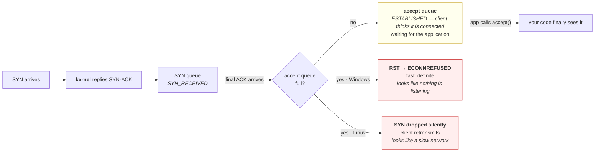

# 3.2 — The accept queue and the backlog

## One-line answer

The kernel completes handshakes and **parks the finished connections in a queue** that your application
drains at its own pace — so a connection can be fully established while your code is doing nothing at all,
and when that queue fills, new arrivals are either refused or silently dropped depending on the platform.

---

## The story

🎬 **The scene.** A small bakery with one person behind the counter. There is a ticket machine by the door,
and a rail of about six ticket slots by the till.

😬 **The naive fix.** On a Saturday, the queue goes out of the door, so the owner props the door open and
lets everybody take a ticket. More people can come in, which feels like progress.

💥 **Why it fails.** There is still one person serving. Twenty people now hold tickets, and the twentieth
will be standing there for a long time holding a piece of paper that promised nothing. Worse, the ticket
machine ran out of paper at number six, so people after that got nothing at all and had no idea whether
they were in the queue. **Taking a ticket was never the slow part**, and making it easier to take one
simply moved the waiting to a place where nobody could see it.

💡 **The insight.** There are two separate capacities: **how many people can be admitted to wait**, and
**how fast they can actually be served.** Raising the first without raising the second does not serve
anyone faster — it converts a visible refusal at the door into an invisible wait inside, and hides the
problem from exactly the people who need to see it.

---

## The idea in plain language

Part [3.1](3.1-the-handshake-and-what-connect-waits-for.md) showed the three-packet handshake. Here is the
detail that part left out, and it changes how you read every connection failure.

**The handshake is performed by the kernel, not by your application.** Your code called `listen()` once and
then went off to do whatever it does. When a `SYN` arrives, the operating system replies with a `SYN-ACK`
by itself, receives the `ACK` by itself, marks the connection `ESTABLISHED` by itself, and **puts it in a
queue**. Your application's `accept()` call does not perform a handshake; it takes an already-finished
connection off that queue.

### There are two queues, and confusing them is common

**The SYN queue** holds half-finished handshakes — a `SYN` arrived, a `SYN-ACK` went out, the final `ACK`
has not come back yet. These are in state `SYN_RECEIVED`.

**The accept queue** holds finished handshakes waiting for the application to collect them. These are
`ESTABLISHED` already, and the client believes — correctly — that it is connected.

The `backlog` number you pass to `listen()` governs the second one. The `listen(2)` manual page, checked on
**2026-08-26**, says: *"The `backlog` argument defines the maximum length to which the queue of pending
connections for `sockfd` may grow."*

### What happens when it fills

The same manual page is unusually explicit, and the sentence contains the whole of this part's diagnostic
value:

> *"If a connection request arrives when the queue is full, the client may receive an error with an
> indication of **ECONNREFUSED** or, if the underlying protocol supports retransmission, the request may be
> ignored so that a later reattempt at connection succeeds."*

**Two completely different behaviours, described in one sentence, and which one you get depends on the
platform.** TCP does support retransmission, so a Linux server usually takes the second branch: it **drops
the `SYN` silently**, the client retransmits, and if the queue drains in the meantime the connection
eventually succeeds. Windows, as measured below, takes the first: it **refuses**.

That difference matters enormously, because it decides whether an overloaded server looks *refused* or
*slow* — and those two send an operator to completely different places.

### The cap nobody knows about

The manual also notes: *"If the `backlog` argument is greater than the value in
`/proc/sys/net/core/somaxconn`, then it is silently capped to that value."*

**Silently.** You can ask for a backlog of ten thousand, be given one hundred and twenty-eight, and receive
no indication whatsoever. Every framework's `backlog=2048` setting is subject to this, and a great many
tuning attempts have consisted of raising a number that was already being ignored.

---

## Why Kriya needs it

Day 3's `pulse` runs under `uvicorn`, which passes a backlog to `listen()` on your behalf. You have already
used this queue without knowing the number.

Day 43 writes readiness probes. A probe that only opens a TCP connection **is answered by the kernel from
this queue**, so it goes green while the application is completely stuck — which is the single most
important reason `/healthz` is an HTTP endpoint and not a port check.

Day 44 and Day 46 scale `pulse` behind a Service and an Ingress. Every layer in front of your pods has its
own accept queue, so an overload can be absorbed — or refused — at any one of them, and knowing where the
queue is tells you which component's metrics are worth reading.

Day 84's incident lab includes a service that accepts connections and never answers. This queue is the
mechanism that makes that state possible.

Day 175 onward runs agents that make many concurrent calls, and the accept queue is the first thing that
saturates when concurrency is raised without measuring.

---

## The mechanism

**This is a deliberate failure.** Start a listener with a backlog of one, refuse to accept anything, and
watch what happens to arriving clients.

```python
# days/day-007-networking-for-operators/lab/backlog.py
"""Listen with a backlog of one, accept nothing, and connect eight times."""

import socket
import time

PORT = 8095

server = socket.socket()
server.setsockopt(socket.SOL_SOCKET, socket.SO_REUSEADDR, 1)
server.bind(("127.0.0.1", PORT))
server.listen(1)
print("listening with backlog=1, accepting nothing")

held = []
for attempt in range(1, 9):
    client = socket.socket()
    client.settimeout(3)
    started = time.monotonic()
    try:
        client.connect(("127.0.0.1", PORT))
        outcome = "connected"
    except OSError as exc:
        outcome = f"{type(exc).__name__} errno={exc.errno}"
    print(f"  connect {attempt}: {outcome:<34} {(time.monotonic() - started) * 1000:8.1f} ms")
    held.append(client)
```

**Line by line:**

- `server.listen(1)` sets the accept queue to one entry. This is the experiment: everything else is
  scaffolding.
- **There is no `accept()` anywhere in this file.** That is the point — the application never collects a
  connection, which simulates a server whose worker threads are all busy, whose event loop is blocked, or
  which is simply wedged. **A stuck application looks exactly like this to the network.**
- `client.settimeout(3)` bounds each attempt so that a platform which *drops* rather than refuses does not
  hang the script for the operating system's full retry schedule.
- `held.append(client)` keeps every client socket alive to the end of the script. If they were closed
  inside the loop, each one would free the queue slot it was occupying and the queue would never fill —
  **the leak is the experiment.**
- Eight attempts against a queue of one, so the boundary is crossed early and the remaining seven show
  whether the behaviour is consistent.

```bash
uv run python days/day-007-networking-for-operators/lab/backlog.py
```

**Line by line:** run it and watch the *first* line differ from the rest. The transition between attempt
one and attempt two is the entire result.

Observed on **2026-08-26**:

```text
listening with backlog=1, accepting nothing
  connect 1: connected                               0.0 ms
  connect 2: ConnectionRefusedError errno=10061   2047.0 ms
  connect 3: ConnectionRefusedError errno=10061   2031.0 ms
  connect 4: ConnectionRefusedError errno=10061   2032.0 ms
  connect 5: ConnectionRefusedError errno=10061   2031.0 ms
  connect 6: ConnectionRefusedError errno=10061   2031.0 ms
  connect 7: ConnectionRefusedError errno=10061   2047.0 ms
  connect 8: ConnectionRefusedError errno=10061   2031.0 ms
```

**Attempt one connected against a server that will never accept it.** Read that again, because it is the
most important sentence in this part. The client's `connect()` returned successfully. From the client's
point of view it holds an established connection to a working server. **No application code ran.** The
kernel did the handshake and put the result in the queue, where it will sit until the process exits.

**Attempts two through eight were refused**, because the queue of one was full. This machine takes the
manual's first branch — `ECONNREFUSED`, which surfaces here as errno 10061, Windows' `WSAECONNREFUSED`.

⚠️ **On Linux the same script behaves differently**, and the difference is the manual's second branch: the
`SYN` is dropped silently, the client retransmits on its own schedule, and the attempt ends in a
**timeout** rather than a refusal. **The same overload, on the same code, reports two opposite-looking
errors on two platforms.** Recording that here is more useful than pretending one of them is the truth —
and Day 21's WSL2 setup is where you can run this script again and see the other branch.

**The two-second delay is the platform behaviour from part
[3.1](3.1-the-handshake-and-what-connect-waits-for.md)** — this stack retransmits the `SYN` before
reporting the refusal — and it is not related to the backlog.



**The yellow box is where a healthy-looking system hides an unhealthy one.** Everything to its left is the
kernel and works perfectly; everything to its right is your application and may be entirely dead.

### Proving the application was never involved

```bash
netstat -an | grep ':8095' | awk '{print $4}' | sort | uniq -c
```

**Line by line:**

- `awk '{print $4}'` takes the **state** column from `netstat -an` output, which is where `ESTABLISHED`,
  `LISTENING` and `TIME_WAIT` appear.
- `sort | uniq -c` turns a list of sockets into a **census** — how many are in each state — which is the
  form you actually want. Reading forty individual lines to count them is how people miss things.
- Run this **while the script is still running**; add an input prompt at the end of the file if you need it
  to hold still. Once the process exits, every socket it held is gone.

**What you are looking for:** an `ESTABLISHED` pair on port 8095 belonging to a process that has never
called `accept()`. That census is the evidence that the connection's existence and the application's
awareness of it are two separate facts.

---

## When it breaks

**A TCP health check that is green against a dead service.** The most expensive consequence in this part.

```text
$ curl -sS -o /dev/null --max-time 5 http://127.0.0.1:8095/ ; echo "exit=$?"
curl: (28) Operation timed out after 5001 milliseconds with 0 bytes received
exit=28
# ... while a TCP connect check against the same port succeeds instantly
```

**What it says:** the port accepts connections and the service never answers.

**What it actually means:** the load balancer's port check is being satisfied by the kernel from the accept
queue, so the instance stays in rotation, and every request routed to it hangs. **The health check is
measuring the operating system, and the operating system is fine.**

**The smallest fix:** make the check an HTTP request against an endpoint the application must execute to
answer — Day 3's
[`/healthz`](../../../day-003-pulse-v0/parts/02-the-service/2.2-healthz-the-endpoint-that-must-not-lie.md).

**Why it is worth being angry about:** this is the default configuration in a great deal of monitoring, and
it produces the worst possible failure — a dead instance that every dashboard reports as healthy, receiving
its full share of traffic.

**Raising the backlog "fixed" the errors and made things worse.** The bakery's propped-open door.

```text
# before: backlog 128
connection refused, ~40 per minute during peak
# after: backlog 8192
no connection errors at all — and p99 latency went from 400 ms to 30 s
```

**What it says:** the errors stopped.

**What it actually means:** the arrival rate still exceeds the service rate. Previously the excess was
refused quickly, which is a fast, honest failure the client could retry elsewhere. Now the excess is
**admitted and made to wait**, so instead of errors you have a queue thousands deep and requests that
complete long after the person who made them has given up. **Nothing was fixed; the failure was converted
from visible to invisible.**

**The smallest fix:** a backlog large enough to absorb bursts and small enough to refuse a genuine overload
— and then fix the service rate, which is the actual problem.

**The principle worth carrying:** **a queue does not add capacity, it adds delay.** Queues are for
smoothing bursts, never for absorbing a sustained mismatch, because a queue fed faster than it drains grows
without bound and every item in it gets slower.

**A backlog setting that does nothing at all.** The silent cap.

```text
# the application asks for
listen(fd, 8192)
# and the kernel gives it
$ cat /proc/sys/net/core/somaxconn
128
```

**What it says:** two numbers, sixty-four times apart.

**What it actually means:** the manual's word is *"silently capped"*. No error, no warning, no log line.
The configuration says 8192 and the reality is 128, and every subsequent tuning conversation is based on a
number that was never in effect. ⚠️ This file does not exist on this machine — there is no
`/proc/sys/net/core/somaxconn` on Windows — so this is 🅿️ **parked as reading until Day 21**, and the
Windows equivalent is a registry setting rather than a file.

**The smallest fix:** read the effective value rather than the configured one, always. Anywhere a setting
can be silently clamped, the configured value is a request and not a fact.

**Connections accepted in a burst after a pause.** The Linux branch, seen from the client.

```text
  connect 2: connected                            1013.0 ms
  connect 3: connected                            3021.0 ms
```

**What it says:** connections succeeding, slowly, at suspiciously round-ish intervals.

**What it actually means:** on a platform that drops rather than refuses, the client's `SYN`
retransmissions are landing during moments when the queue briefly had room. **The one-second and
three-second steps are the retransmission schedule**, not the server's behaviour. The server never reported
anything at all.

**The distinction worth holding:** **a refusal is information and a drop is the absence of information.**
When an overloaded server drops, every symptom you see is generated by the client's own retry machinery,
which is why the numbers look so tidy and why they tell you nothing about the server.

---

## In production

**What a professional writes instead of the teaching version.** They do not tune the backlog first. They
measure whether the queue is being *used* — a persistently non-empty accept queue means the application is
not keeping up, and that is a scaling or a blocking-code problem, not a queue-size problem. When they do
set it, they set it deliberately small enough that a genuine overload produces fast refusals, because **a
fast refusal is a gift to the client**: it can retry another instance immediately, whereas a slow queue
holds the client hostage. The structural answer at scale is not a bigger queue but **load shedding** — the
server deciding to reject work it cannot do in time — which Day 87 builds.

**What degrades at scale.** The queue's depth becomes a latency multiplier that no application metric can
see. A request waiting in the accept queue has not been received by your framework, so it is not in your
request duration histogram, not in your traces, and not in your logs. **Your p99 looks fine while your
users wait**, because your measurement starts after the wait ends. This is one of the classic gaps between
server-measured and client-measured latency, and it is the argument for measuring from the client's side as
well — which is what Day 65 and Day 92's service level objectives are about.

**The failure that only shows with real traffic.** The thundering restart. When a service restarts, every
client reconnects at once. A backlog sized for steady state fills instantly, connections are refused or
dropped, clients retry, and the retries arrive together because they all backed off by the same amount —
which is exactly the storm part [5.2](../05-when-it-adds-up/5.2-retries-backoff-and-the-storm-you-caused.md)
is about. The service is healthy and cannot get started, and the only thing that was different from a
normal Tuesday is that everybody arrived at the same instant.

**The review comment a senior engineer leaves.** *"The readiness probe here is a TCP socket check. That is
answered by the kernel out of the accept queue, so it will pass while the worker pool is completely
deadlocked and we will keep routing traffic to a dead pod. Make it an HTTP GET on `/healthz` that touches
something the application actually has to execute."*

**The signal you would alert on.** **The accept queue's depth and its overflow count**, which on Linux are
exposed by the socket statistics tooling and by counters for connections dropped due to a full queue. A
non-zero overflow counter is the cleanest possible statement that arrivals exceeded the application's
ability to accept them, and unlike latency it has **no healthy baseline above zero**, so it is alertable
directly rather than by threshold guessing. You would also alert on **the gap between client-observed and
server-observed latency**, because that gap is where this queue lives. You would **not** alert on the
backlog setting itself — it is configuration, so it belongs in a review, and given the silent cap the
configured number may not even be true. ⚠️ These queue statistics do not exist on this machine; they are
🅿️ parked with everything else awaiting Day 21.

**Blast radius.** This part opens eight loopback connections against a listener it started itself, and
leaks all of them deliberately until the process exits. Nothing leaves the machine. **The capability worth
naming is the shape rather than the scale**: this is a script that opens connections faster than a server
accepts them, which is the exact mechanism of a connection-exhaustion attack. At eight connections against
your own loopback it is a demonstration; at eight thousand against a service you do not own it is an
offence, and the code is the same code. ⚠️ **The bound is the target, not the number** — keep experiments
of this shape on `127.0.0.1`, and never raise the loop count against anything you did not start yourself.
What also bounds it here: every socket is closed when the process exits, and the listener is created and
destroyed within the same script, so nothing survives the run.

**Cost.** `0` model calls, `0` tokens, `0` CI minutes, `0` disk, negligible RAM. **Network: nothing leaves
the machine** — all nine sockets are on loopback. Roughly fourteen seconds of deliberate waiting, and nine
file descriptors held briefly.

**The interview question.** *"A service is up, its port accepts connections, and every request times out.
Where do you look?"* The answer that lands separates the layers immediately: *"The fact that the port
accepts connections tells me the kernel is fine and says almost nothing about the application, because the
three-way handshake is completed by the operating system and the finished connection is parked in the
accept queue until the application calls `accept()`. So a service whose worker pool is deadlocked, or whose
event loop is blocked on something synchronous, will keep 'accepting' connections that no application code
ever sees. The two things I would look at are the accept queue depth — if it is full and static, the
application has stopped draining it — and a thread or task dump to find what the workers are blocked on,
which in my experience is usually a call to a dependency with no timeout. The related lesson is that this
is exactly why a TCP port check is a worthless health check: it goes green against a completely dead
application, so the load balancer keeps sending it traffic."*

---

## Check yourself

```bash
uv run python days/day-007-networking-for-operators/lab/backlog.py
```

One connection succeeds against a server that will never accept it, and seven fail. **The observation to
carry is the first line** — `connect 1: connected` — because it is proof that a client can hold a genuinely
established connection to an application that has not run a single instruction on its behalf.

**Say out loud, without scrolling up:** *say who performs the three-way handshake and what `accept()`
actually does, explain why a TCP port check can be green against a dead application, and give the two
things that can happen when the accept queue is full and why they look like opposite problems.*
