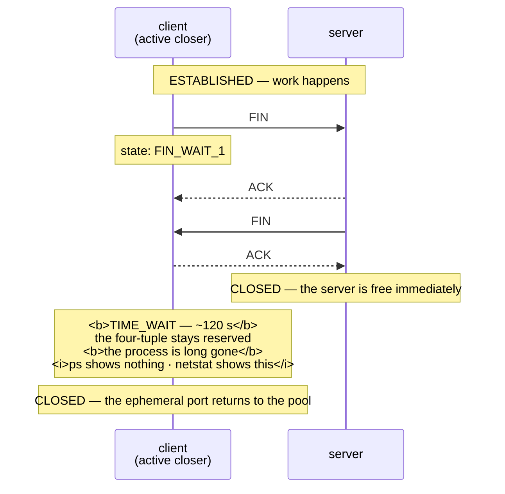

# 3.3 — `TIME_WAIT`, and the ports you ran out of

## One-line answer

Whichever end closes a connection first keeps its half of the four-tuple **reserved for about two minutes
after the connection is over** — so a client that opens and closes connections quickly accumulates
thousands of dead reservations and eventually cannot open any more, on a machine where nothing is running
and nothing is broken.

---

## The story

🎬 **The scene.** A block of flats with a communal bin store. It has twelve bins, and the collection comes
once a week.

😬 **The naive fix.** A family moving out fills a bin, and the bin is now full but not collected. They put
the next bag beside it. Then the next. Everybody else does the ordinary thing and finds nowhere to put
anything.

💥 **Why it fails. The bins are not the constraint and neither is the rubbish** — it is the gap between
finishing with a bin and the bin becoming available again. Twelve bins that empty weekly can absorb a
week's rubbish and no more, however tidy everybody is, and a household clearing a flat produces a month's
worth in an afternoon. **Nothing is broken, nobody did anything wrong, and there is nowhere to put the
bag.**

💡 **The insight.** A resource that is released *slowly* behaves like a much smaller resource when it is
used *quickly*. The number that matters is not how many there are — it is how many there are **divided by
how long each one stays unavailable after use.**

---

## The idea in plain language

When a TCP connection closes, it does not vanish. The end that closes **first** — the *active closer* —
puts its socket into a state called `TIME_WAIT` and holds it there.

### Why the state exists

Two reasons, and both are about correctness rather than tidiness.

**Delayed packets from the old connection must not be delivered to a new one.** A packet can wander around
a network and arrive late. If the four-tuple from part
[1.2](../01-the-address/1.2-the-socket-and-the-four-tuple.md) were reused immediately, a straggler from the
dead connection would be accepted as part of the new one, and one connection's data would appear in the
middle of another's. Holding the tuple reserved for long enough that any straggler has certainly expired
makes that impossible.

**The final acknowledgement has to be retransmittable.** The closing exchange ends with an `ACK`. If it is
lost, the other end retransmits its `FIN` and expects the `ACK` again — which requires the closing side to
still have the connection's state. An end that forgot immediately would answer with a `RST`, and the other
side would record an error on a connection that closed perfectly.

**So `TIME_WAIT` is not a leak, a bug or a tuning failure. It is the protocol working.** Every piece of
advice that begins "disable `TIME_WAIT`" is advice to break one of those two guarantees.

### How long, and why that number is the whole problem

The state lasts twice the maximum time a packet is assumed to survive in the network. On this machine that
works out at **about 120 seconds**, measured below.

### The arithmetic that catches people

The active closer is usually the **client**, and a client's half of the tuple uses an *ephemeral* port —
one the operating system picks from a fixed range. On this machine the range starts at 49152 and holds
16384 ports, verified below.

So, for connections to **one** destination address and port:

**16384 ports ÷ 120 seconds ≈ 136 new connections per second, sustained.**

Above that, you run out. Not slowly, not with a warning — the port allocator has nothing left to give, and
the error you get is the second cause named in the `listen(2)` manual page and quoted in part
[1.4](../01-the-address/1.4-the-port-that-was-already-in-use.md): *"all ephemeral port numbers are in
use"*, reported as the same `EADDRINUSE` you saw for a port collision. **The identical error for two
unrelated problems**, which is precisely why part 1.4 flagged it forward to here.

A hundred and thirty-six connections per second is not a large number. A moderately busy service that
opens a fresh connection per request passes it easily.

---

## Why Kriya needs it

Day 9 makes `pulse` call a model provider. If the client is created per request, every call is a new
connection, and the arithmetic above is the ceiling on your throughput — reached long before the provider's
rate limit.

Day 13's CI runs a test suite that hammers a local service. A suite that opens thousands of connections
quickly is one of the most common places to meet this, and the failure looks like flaky tests.

Day 25 onward, `pulse` in a container, has a **smaller** ephemeral range in some configurations, so the
ceiling is lower than it is here.

Day 41 onward in Kubernetes puts network address translation between pods and the outside world, and NAT
has its own connection table with its own `TIME_WAIT` entries — so the limit can be reached by a *node*
rather than by your process, and your service is a victim of a neighbour.

Day 87 builds load shedding, and Day 92 sets service level objectives against a throughput number that this
arithmetic can silently cap.

---

## The mechanism

**This is a deliberate failure in miniature.** Open two hundred connections, close them from the client
side, and count what is left behind.

```python
# days/day-007-networking-for-operators/lab/timewait.py
"""Open and close 200 short-lived connections, then count what the kernel is still holding."""

import socket
import threading
import time

PORT = 8094
COUNT = 200

server = socket.socket()
server.setsockopt(socket.SOL_SOCKET, socket.SO_REUSEADDR, 1)
server.bind(("127.0.0.1", PORT))
server.listen(128)

stop = False


def serve() -> None:
    """Accept and immediately forget, so the client is always the one that closes first."""
    while not stop:
        try:
            server.accept()
        except OSError:
            return


threading.Thread(target=serve, daemon=True).start()

started = time.monotonic()
for _ in range(COUNT):
    client = socket.create_connection(("127.0.0.1", PORT))
    client.close()
print(f"{COUNT} connections in {(time.monotonic() - started) * 1000:.0f} ms")
time.sleep(1)
stop = True
server.close()
```

**Line by line:**

- `client.close()` **inside** the loop, immediately after connecting. This is what makes the client the
  active closer, and the active closer is the one that pays. Reverse it — have the server close first — and
  the `TIME_WAIT` sockets pile up on the server instead, which is a different and usually worse problem.
- `server.listen(128)` with a generous backlog, deliberately unlike part
  [3.2](3.2-the-accept-queue-and-the-backlog.md), because here the queue must **not** be the constraint;
  the only thing being measured is what closing leaves behind.
- The accept loop runs in a **daemon thread** so that the main thread can drive the connections. It calls
  `server.accept()` and discards the result, which is enough to complete each connection without the server
  ever closing one.
- `time.sleep(1)` before shutdown, so the sockets are still in their post-close state when you look at
  them from another terminal.
- `COUNT = 200` against an ephemeral range of 16384 is deliberately about one percent of the space — enough
  to be unmistakable in a census and nowhere near enough to disturb the machine.

```bash
netstat -an | grep -c TIME_WAIT && uv run python days/day-007-networking-for-operators/lab/timewait.py && netstat -an | grep -c TIME_WAIT
```

**Line by line:**

- `grep -c` counts matching lines instead of printing them, which turns a wall of sockets into one number
  — and a before-and-after pair of numbers is the entire measurement.
- The **before** count matters as much as the after. Without it you cannot tell your two hundred from the
  machine's normal background, which on an ordinary desktop is a handful.

Observed on **2026-08-26**:

```text
6
200 connections in 62 ms
208
```

**Six before, two hundred and eight after.** Two hundred connections, opened and closed in sixty-two
milliseconds, left two hundred reservations behind. The work took a sixteenth of a second and its residue
lasts two minutes.

**That ratio is the whole subject.** The connections were finished with almost instantly and their
addresses were not.

### Confirming who is holding what

```bash
netstat -an | grep ':8094' | awk '{print $4}' | sort | uniq -c
```

**Line by line:** the same state census as part [3.2](3.2-the-accept-queue-and-the-backlog.md), narrowed to
this experiment's port. `awk '{print $4}'` takes the state column; `sort | uniq -c` counts each state.

Observed on **2026-08-26**:

```text
    202 TIME_WAIT
```

**No `ESTABLISHED`, no process, nothing running.** The script has exited. These two hundred and two entries
belong to no program at all — they are kernel state, waiting out a timer, and `ps` will never show them.
This is exactly the situation part
[1.4](../01-the-address/1.4-the-port-that-was-already-in-use.md) described as the one that wastes the most
time: *the port is taken and `ps` shows nothing*.

### How long, actually

The number is quoted everywhere and differs by platform, so measure it.

```python
# days/day-007-networking-for-operators/lab/twdur.py
"""Make 50 short connections, then poll until the kernel releases the last one."""

import socket
import subprocess
import threading
import time

PORT = 8096


def count() -> int:
    """How many sockets on PORT are still in TIME_WAIT, according to netstat."""
    out = subprocess.run(["netstat", "-an"], capture_output=True, text=True).stdout
    return sum(1 for line in out.splitlines() if f":{PORT}" in line and "TIME_WAIT" in line)


# ... server setup and 50 connect/close pairs as in timewait.py ...

started = time.monotonic()
while True:
    remaining = count()
    print(f"t+{time.monotonic() - started:6.1f}s  TIME_WAIT on {PORT}: {remaining}", flush=True)
    if remaining == 0 and time.monotonic() - started > 5:
        break
    time.sleep(10)
```

**Line by line:**

- `subprocess.run([...], capture_output=True, text=True)` runs `netstat` as a **list of arguments rather
  than a shell string**, so nothing is interpreted by a shell and there is no quoting to get wrong.
- The filter requires **both** the port and the word `TIME_WAIT` on the same line, because a port number
  can appear in the remote column of unrelated sockets and would inflate the count.
- `flush=True` so each line appears as it happens rather than sitting in a buffer — a polling loop whose
  output arrives all at once at the end has told you nothing about timing.
- `and time.monotonic() - started > 5` guards the exit condition, because the count is briefly zero in the
  instant before the connections are made, and without the guard the loop would exit immediately having
  measured nothing.
- `time.sleep(10)` gives a resolution of ten seconds, which is plenty for a value in the region of two
  minutes and keeps the output short enough to read.

Observed on **2026-08-26**, abbreviated:

```text
t+   0.1s  TIME_WAIT on 8096: 49
t+  50.7s  TIME_WAIT on 8096: 49
t+ 101.0s  TIME_WAIT on 8096: 49
t+ 111.0s  TIME_WAIT on 8096: 49
t+ 121.2s  TIME_WAIT on 8096: 0
```

**Flat at forty-nine, then zero.** They do not drain gradually, because they were all created at the same
instant and each holds for the same fixed duration. **About 120 seconds on this machine**, which is the
number the arithmetic at the top of this part uses.

### And the size of the pool

```bash
netsh int ipv4 show dynamicport tcp
```

**Line by line:** `netsh` is the Windows network configuration tool and this subcommand prints the
*dynamic*, or ephemeral, port range — the ports the operating system hands out to clients that did not ask
for a specific one. On Linux the equivalent is reading `/proc/sys/net/ipv4/ip_local_port_range`, which is
🅿️ parked until Day 21.

Observed on **2026-08-26**:

```text
Protocol tcp Dynamic Port Range
---------------------------------
Start Port      : 49152
Number of Ports : 16384
```

**16384 ports, 120 seconds, about 136 connections per second.** Three numbers you measured, and a ceiling
you can now calculate for any machine you are handed.



**Look at which side pays.** The server was free the moment it sent its `ACK`. The client — the one that
closed first — holds the reservation. **Being polite about closing costs you the port.**

---

## When it breaks

**`EADDRINUSE` from a client that is not binding anything.** The confusing face of the same error.

```text
OSError: [Errno 98] Address already in use
# ... in code that only calls connect(), never bind()
```

**What it says:** address already in use, from a program that never chose an address.

**What it actually means:** the ephemeral port pool is exhausted. `connect()` performs an implicit bind to
a port the kernel picks, and there are none left to pick — every one is in `TIME_WAIT` to this destination.
This is the second cause in the `listen(2)` manual's `EADDRINUSE` entry, and it is the one nobody expects.

**The smallest fix:** stop opening connections. Reuse them, which is what a connection pool does.

**Why the error is so misleading:** it is the same message as the part 1.4 collision, which sends you
hunting for a process holding a port. **There is no process and no port to find.** The tell is that your
program never called `bind()`, and the census — thousands of `TIME_WAIT` entries — confirms it in one
command.

**A load test that gets slower and then fails, on a machine doing nothing.** The classic first encounter.

```text
$ netstat -an | grep -c TIME_WAIT
28417
```

**What it says:** twenty-eight thousand sockets in `TIME_WAIT`.

**What it actually means:** the load generator is opening a connection per request. It is not measuring the
service; **it is measuring how fast the operating system can allocate and retire ports**, and it will hit a
wall that has nothing to do with the thing under test. Every number produced by that run is about the
client.

**The smallest fix:** turn on keep-alive in the load generator, so connections are reused. The results
change completely, and they change because the test was wrong rather than because the service improved.

**The habit worth building:** ⚠️ **before believing any load test, check what the client machine is doing.**
A benchmark that saturates its own generator measures the generator.

**Somebody "fixed" it by allowing immediate reuse.** The dangerous advice.

```text
# advice found on the internet, do not apply blindly
net.ipv4.tcp_tw_recycle = 1
```

**What it says:** recycle `TIME_WAIT` sockets aggressively.

**What it actually means:** it breaks connections from clients behind network address translation, because
the mechanism relies on timestamps being monotonic per source address, and many clients sharing one
translated address violate that. The symptom is a fraction of clients unable to connect at all, at random,
with nothing in any log. **This option caused enough damage that it was removed from Linux entirely.**

**The smallest fix:** do not. The safe adjustments are widening the ephemeral range and — the real one —
**reusing connections so the rate never approaches the ceiling.**

**Why it is here:** this is the single most confidently repeated piece of bad networking advice, and the
version of it that is safe (`tcp_tw_reuse`, for outbound connections only) has a name one character
different. **Read what you paste into a kernel setting.**

**The ceiling reached by a neighbour.** The cluster version, and the hardest to diagnose.

```text
# your pod, doing 20 requests per second, gets:
OSError: [Errno 99] Cannot assign requested address
```

**What it says:** cannot assign an address, in a service that is barely busy.

**What it actually means:** on a node where outbound traffic is translated through a shared address, the
translation table's ephemeral ports are **shared by every pod on that node**. A different workload's
connection churn consumed them and your service is the one that noticed. **Your metrics are innocent and
your dashboards will prove it**, which is exactly why this takes so long to find.

**The smallest fix:** none available to you. The finding is *which node*, and the escalation is to whoever
owns the node's networking.

**The distinction worth holding:** a limit reached by your own behaviour and a limit reached by a
neighbour's look identical from inside the process. **The first question for any resource exhaustion in a
shared environment is whose consumption it was**, and answering it requires looking outside the container —
which is why Day 6's parts on cgroup accounting and this one keep pointing at the same lesson.

---

## In production

**What a professional writes instead of the teaching version.** They reuse connections, and that is
essentially the whole answer. A pooled HTTP client with keep-alive turns a hundred thousand connections
into a few dozen, and the entire subject of this part stops applying. They also make sure that where a
connection *must* be closed, **the server closes it rather than the client** where that is a choice, so the
reservation lands on the side with a single well-known port rather than on the side spending a finite
ephemeral pool. And they know their ephemeral range and their `TIME_WAIT` duration for any host under load,
because the ceiling is arithmetic and arithmetic can be done in advance rather than during an incident.

**What degrades at scale.** The ceiling is **per destination**, not per machine, which is either a relief
or a trap depending on your architecture. Talking to many different backends multiplies your headroom,
because the four-tuple differs in the remote address. Talking to **one** load balancer address — which is
exactly what a service mesh, an ingress or a database proxy gives you — concentrates every connection into
a single tuple space, and the ceiling arrives at a hundred and thirty-six connections per second on a
machine with a hundred cores idle. **Consolidating your egress through one address concentrates this limit
along with it**, and nobody thinks about ports when drawing that diagram.

**The failure that only shows with real traffic.** The cliff. Consumption is invisible until the pool is
nearly empty and then failures arrive all at once, because until the last port is gone every connection
succeeds normally. **There is no gradual degradation to notice** — the graph is flat and then vertical —
which means a threshold alert on error rate fires simultaneously with the outage rather than before it. The
signal that gives warning is the one nobody collects: the count of sockets in `TIME_WAIT` as a fraction of
the ephemeral range.

**The review comment a senior engineer leaves.** *"We construct the HTTP client inside the handler, so
every request opens and closes a connection to the same backend address. That caps this service at roughly
a hundred and thirty requests per second per instance regardless of how much CPU we give it, and the
failure mode when we hit it is `EADDRINUSE` in code that never binds anything, which is going to cost
somebody a very long afternoon. Move the client to module scope."*

**The signal you would alert on.** **Sockets in `TIME_WAIT` as a proportion of the ephemeral port range**,
which is the only signal that gives warning before the cliff. Alert at a fraction — half the range, say —
rather than an absolute count, because the count is meaningless without the range beside it. Also
**connection establishment failures by errno**, so `EADDRINUSE` and `EADDRNOTAVAIL` are distinguishable
from a refused connection, which is a completely different incident. You would **not** alert on the raw
`TIME_WAIT` count: tens of thousands is entirely healthy on a busy machine, an alert on it is guaranteed to
fire on a well-behaved system, and the resulting habit of ignoring it is worse than having no alert at all.
⚠️ On this machine none of the per-socket statistics exist in a scrapeable form; this is 🅿️ parked with the
rest until Day 21.

**Blast radius.** This part opens two hundred and fifty loopback connections against listeners it starts
itself, and leaves roughly two hundred and fifty kernel reservations behind for about two minutes.
Consumption is about one and a half percent of this machine's ephemeral range, against a background of six.
Nothing leaves the machine, nothing is written, and the state expires by itself with no cleanup required —
**which is the one resource in this curriculum that genuinely does tidy itself up.** ⚠️ The capability
worth bounding is the loop count and the target together: this exact script with `COUNT = 200000` aimed at
a public host is a connection-flood attack, and the difference between the lesson and the offence is two
edits. **Keep it on `127.0.0.1`, and keep the count in the hundreds** — the effect is already unmistakable
at two hundred, and a larger number teaches nothing further while risking a machine you have to work on.

**Cost.** `0` model calls, `0` tokens, `0` CI minutes, `0` disk, negligible RAM. **Network: nothing leaves
the machine.** About two hundred and fifty ephemeral ports held for two minutes each, and roughly two
minutes of deliberate waiting in the duration measurement.

**The interview question.** *"A service that makes outbound HTTP calls starts failing with 'address already
in use', but it never binds a port. What is happening?"* The answer that lands names the state, the
arithmetic and the fix: *"Ephemeral port exhaustion. `connect()` binds implicitly to a port the kernel
picks, and every connection the client closes actively holds its four-tuple in `TIME_WAIT` for twice the
maximum segment lifetime — around two minutes typically — so the effective capacity is the size of the
ephemeral range divided by that duration, per destination. With a sixteen-thousand port range that is
roughly a hundred and thirty new connections per second to a single backend, which a moderately busy
service passes easily if it opens a connection per request. The confusing part is that it is the same
`EADDRINUSE` you get from a port collision, so people go looking for a process holding a port and there
isn't one — the sockets belong to the kernel and `ps` shows nothing. The fix is a pooled client with
keep-alive, not a kernel setting; `TIME_WAIT` exists to stop delayed packets being delivered into a new
connection with the same identity and to allow the final `ACK` to be retransmitted, so shortening it trades
correctness for headroom I did not need if I had just reused the connection."*

---

## Check yourself

```bash
netstat -an | grep -c TIME_WAIT && uv run python days/day-007-networking-for-operators/lab/timewait.py && netstat -an | grep -c TIME_WAIT
```

The before, the burst, and the residue. **The three numbers to write into `docs/PACKAGES.md` are your
ephemeral range size, your measured `TIME_WAIT` duration, and their quotient** — because that quotient is
this machine's outbound connection ceiling per destination, and Day 9 will be the first time it matters.

**Say out loud, without scrolling up:** *say which end of a connection enters `TIME_WAIT` and why the state
exists at all, give the arithmetic that turns a port range and a duration into a connections-per-second
ceiling, and say why the fix is a connection pool rather than a kernel setting.*
