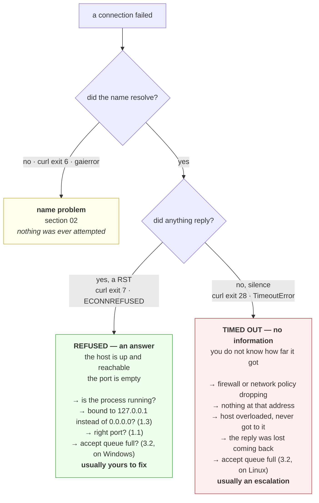

# 3.4 — Connection refused versus connection timed out

## One-line answer

*Refused* means something replied *no*, and *timed out* means nothing replied at all — so the first tells
you the machine is reachable and the port is empty, the second tells you the packet never got there or
never got back, and confusing them sends you to entirely the wrong team.

---

## The story

🎬 **The scene.** Somebody orders a phone case online and it does not arrive. The tracking has said *out for
delivery* for three days.

😬 **The naive fix.** They message the seller, who says it was dispatched. They message again. They leave a
review. They wait another two days.

💥 **Why it fails.** There were two possible situations and they treated both as one. If the courier had
knocked and found nobody home, there would be a card through the door and a *we missed you* status — an
answer, and one that tells you exactly what to do next. What actually happened is that the parcel fell off
the round somewhere between the depot and the van, and **nothing about that produces a message**. The
absence of a card was the most informative thing in the whole situation and they never looked for it,
because they were busy re-asking somebody who had already answered.

💡 **The insight.** *Told no* and *told nothing* are different states, and the second one is not a weaker
version of the first. **A refusal names the place that refused you.** Silence does not even tell you how
far the thing got, which is why the first useful question is never *why did it fail* but *did anything
answer at all.*

---

## The idea in plain language

Part [3.1](3.1-the-handshake-and-what-connect-waits-for.md) listed three outcomes of a handshake. Two of
them are failures, and everything an operator does in the first minutes of a connectivity incident depends
on telling those two apart.

### Refused

Your `SYN` arrived. The machine at that address is up, its network stack is working, and **it replied with
a `RST`** — a reset — because nothing is listening on that port. The reply came back to you.

So a refusal proves an enormous amount:

- the name resolved to an address that is real;
- packets reach that address, and replies come back;
- the machine is up and its operating system is running;
- **the application is not listening there.**

It is a *fast, definite answer* and it points squarely at one thing: **the process is not running, or is
listening somewhere else.** Part [1.3](../01-the-address/1.3-binding-127-0-0-1-versus-0-0-0-0.md)'s
`127.0.0.1` versus `0.0.0.0` decision is the most common cause of the "somewhere else" version.

### Timed out

Your `SYN` went out and **nothing came back.** No `SYN-ACK`, no `RST`, nothing. Your operating system
retransmits a few times with increasing gaps, and eventually gives up.

A timeout proves very little, and its causes are a list rather than a fact:

- a firewall or security group is dropping the packet, deliberately and silently;
- the address is routable in principle but nothing is there;
- the machine is up and so overloaded it never got to the packet;
- the packet arrived, the reply was sent, and **the reply was lost on the way back**;
- the accept queue was full, on a platform that drops rather than refuses — part
  [3.2](3.2-the-accept-queue-and-the-backlog.md).

**Every one of those is somebody else's system**, which is why a timeout is usually an escalation and a
refusal is usually yours to fix.

### Why the silence is deliberate

A firewall configured to *reject* sends a refusal; a firewall configured to *drop* sends nothing. Dropping
is the common choice, and the reason is that a refusal confirms the address exists. **Silence is a security
decision**, taken by somebody who wanted a scanner to learn nothing — and the price is that your legitimate
connection also learns nothing, slowly.

---

## Why Kriya needs it

Day 9's first call to a model provider will fail for somebody reading this, and the split between exit 6,
exit 7 and exit 28 decides whether the problem is the base URL, the port or the network.

Day 25's containerised `pulse` fails to reach the host and the host fails to reach the container, and each
direction produces one of these two errors — which tells you whether the port mapping is wrong (refused) or
the network mode is wrong (timed out).

Day 41 onward, in a cluster, this is the primary diagnostic. A refused connection to a Service means the
pods are not listening or the target port is wrong. A timeout means a network policy, which is Day 51, and
those are two different days of work.

Day 84's incident lab hands you a service that is unreachable and does not tell you which. Day 79's
runbooks branch on it, because *restart the process* and *escalate to networking* cannot be the same
instruction.

---

## The mechanism

Produce both, side by side, and read the four things that differ.

```python
# days/day-007-networking-for-operators/lab/refused_or_dropped.py
"""Connect to something that refuses and something that is silent, and compare the evidence."""

import socket
import time

TARGETS = [
    ("127.0.0.1", 8099, "nothing listening — a reply is possible"),
    ("203.0.113.1", 80, "reserved and unrouted — no reply possible"),
]

for host, port, label in TARGETS:
    sock = socket.socket()
    sock.settimeout(5)
    started = time.monotonic()
    try:
        sock.connect((host, port))
        outcome = "connected"
    except OSError as exc:
        outcome = f"{type(exc).__name__} errno={exc.errno}"
    finally:
        sock.close()
    print(f"{label:<40} {outcome:<36} {(time.monotonic() - started) * 1000:8.1f} ms")
```

**Line by line:**

- The two targets are chosen so that **only one variable differs**: whether a reply can come back.
  `127.0.0.1` is certainly reachable and certainly has nothing on port 8099; `203.0.113.1` is in the range
  RFC 5737 reserves for documentation and is guaranteed not to be routed anywhere.
- `sock.settimeout(5)` bounds the silent case. Without it the second target would take the operating
  system's full retransmission schedule — about twenty-one seconds here — and the script would look
  broken rather than instructive.
- `finally: sock.close()` because the socket object exists and holds a descriptor whether or not the
  connection ever succeeded, exactly as in part
  [1.4](../01-the-address/1.4-the-port-that-was-already-in-use.md).
- The printed `errno` is the portable, searchable identity of the failure; **the class name and the message
  are not.** `ConnectionRefusedError` and `TimeoutError` happen to be clear in Python, and the equivalent
  in most other runtimes is not.

```bash
uv run python days/day-007-networking-for-operators/lab/refused_or_dropped.py
```

**Line by line:** nothing to configure. Both targets are safe by construction — one is this machine and the
other is an address reserved so that packets sent to it bother nobody.

Observed on **2026-08-26**:

```text
nothing listening — a reply is possible    ConnectionRefusedError errno=10061   2016.0 ms
reserved and unrouted — no reply possible  TimeoutError errno=None              5000.0 ms
```

**Three things separate these two lines, and only two of them are portable.**

**The error class differs**, and this is the reliable one. A refusal is a refusal on every platform.

**The errno differs.** `10061` is Windows' `WSAECONNREFUSED`; on Linux the same condition is `111`. The
timeout carries `errno=None` because it came from Python's own timeout machinery rather than from the
operating system — **that `None` is itself a useful signal**: it means *we stopped waiting*, not *something
told us no*.

**The duration differs — but not the way the textbooks say.** The timeout took exactly 5000 ms, which is
exactly the value we set: a round number, and therefore a policy rather than a measurement. The refusal
took two seconds, which on most systems would be absurd. ⚠️ **This is the Windows retransmission behaviour
from part [3.1](3.1-the-handshake-and-what-connect-waits-for.md)**; on Linux this same refusal returns in
well under a millisecond. **So on this machine, duration alone does not separate the two cases** — the
error class does. Recording that honestly is more useful than repeating a rule of thumb that is wrong here.

### The same test with the tool you will actually have

```bash
curl -sS -o /dev/null http://no-such-host-kriya-day7.invalid/ ; echo "exit=$?"
curl -sS -o /dev/null http://127.0.0.1:8099/ ; echo "exit=$?"
curl -sS -o /dev/null --connect-timeout 3 http://203.0.113.1/ ; echo "exit=$?"
```

**Line by line:**

- `-sS` is the pairing worth memorising: `-s` silences the progress meter, and `-S` puts error messages
  back, so you get a clean line of diagnosis instead of either a progress bar or nothing at all. `-s`
  alone is the mistake — it hides the error too.
- `-o /dev/null` discards the body, because the question is whether the connection happened, not what was
  returned.
- `--connect-timeout 3` bounds **only the connection phase**, which the curl manual, checked on
  **2026-08-26**, describes as *"Maximum time in seconds that you allow curl's connection to take. This
  only limits the connection phase, so if curl connects within the given period it continues"*. That word
  *only* is the seed of section [04](../04-timeouts/4.2-the-four-timeouts-of-one-request.md).
- `echo "exit=$?"` after each, because **the exit code is the diagnosis** and the sentence is decoration.

Observed on **2026-08-26**:

```text
curl: (6) Could not resolve host: no-such-host-kriya-day7.invalid
exit=6
curl: (7) Failed to connect to 127.0.0.1 port 8099 after 2045 ms: Could not connect to server
exit=7
curl: (28) Connection timed out after 3014 milliseconds
exit=28
```

**Three numbers, and this is the day's most reusable single fact.**

| Exit | Meaning | What is proven | Where to look first |
| --- | --- | --- | --- |
| **6** | could not resolve host | nothing was attempted | the name, the resolver, the search suffixes — section [02](../02-names/2.1-what-resolving-a-name-actually-does.md) |
| **7** | failed to connect | **the machine answered** — it is up and reachable | the process: is it running, and is it bound to the address you are using? |
| **28** | timed out | nothing answered — **you do not know how far it got** | the path: firewall, network policy, routing, or a host that is not there |

The official descriptions come from `everything.curl.dev/cmdline/exitcode.html`, checked on **2026-08-26**;
7 is *"curl managed to get an IP address to the machine and it tried to set up a TCP connection to the host
but failed"* and 28 is *"Operation timeout. The specified time-out period was reached according to the
conditions."*

**Learn these three numbers.** They will resolve more incidents in this curriculum than any other single
piece of knowledge, and they cost nothing to check.



**The green box is good news** — counter-intuitively, a refusal is the outcome you would rather have,
because it is an answer and it narrows the search to one machine you can log into.

---

## When it breaks

**Refused from outside, works fine locally.** The most common connectivity bug in this curriculum.

```text
$ curl -sS http://127.0.0.1:8000/healthz          # on the server itself
{"status":"ok"}
$ curl -sS http://192.168.1.40:8000/healthz       # from another machine
curl: (7) Failed to connect to 192.168.1.40 port 8000: Could not connect to server
```

**What it says:** the service works and is unreachable.

**What it actually means:** it is bound to `127.0.0.1`, so it is listening on the loopback interface only,
and a packet arriving on the real network interface finds nothing listening there and is reset. **It is not
a firewall** — a firewall would drop, and you would see exit 28.

**The smallest fix:** bind `0.0.0.0`, with part
[1.3](../01-the-address/1.3-binding-127-0-0-1-versus-0-0-0-0.md)'s warning firmly in mind about what that
opens.

**How you knew in one step:** the refusal proved the machine was reachable. If the firewall were the
problem, there would have been no reply at all.

**Timed out from outside, refused from the machine itself.** The same shape, the other answer.

```text
$ curl -sS --connect-timeout 5 http://192.168.1.40:8000/healthz
curl: (28) Connection timed out after 5003 milliseconds
```

**What it says:** silence.

**What it actually means:** something between you and the service is dropping packets — a host firewall, a
security group, or in a cluster a network policy. **The service may be perfectly healthy and correctly
bound.**

**The smallest fix:** find the filter, not the service. In a cluster that means Day 51's network policies;
on a host it means the local firewall rules.

**The distinction worth holding, stated once more because it is the point of the part:** exit 7 sends you
to the process, exit 28 sends you to the path. **Getting this backwards costs hours**, because
investigating a healthy process is unbounded work and it always turns something up.

**Refused, intermittently, under load only.** The one that hides as flakiness.

```text
curl: (7) Failed to connect to 10.0.0.5 port 8080: Could not connect to server
# ... on roughly one request in fifty, and only at peak
```

**What it says:** the port is sometimes empty.

**What it actually means:** the process is running the whole time. The accept queue is full and this
platform refuses rather than drops — part [3.2](3.2-the-accept-queue-and-the-backlog.md). **A refusal does
not always mean nothing is listening**; it can also mean *listening and unable to take any more*.

**The smallest fix:** look at the accept queue and the application's ability to drain it, not at whether
the process is up. It is up.

**Why this is the exception worth remembering:** it is the one case where exit 7 is *not* about the
process's existence, and it is distinguishable by being **intermittent and load-correlated**. A process
that is not running produces a refusal on every single attempt.

**Timed out because the reply was lost, not the request.** The asymmetric case nobody checks.

```text
# your side
curl: (28) Connection timed out after 5001 milliseconds
# the server's side, at the same moment
netstat -an | grep 203.0.113.77
  TCP    10.0.0.5:8080     203.0.113.77:51002    SYN_RECEIVED
```

**What it says:** you saw nothing; the server saw your `SYN` and answered it.

**What it actually means:** the request arrived and the reply did not come back. Routing is asymmetric,
or a stateful device on the return path dropped the `SYN-ACK`. **Both ends are working and the conversation
still fails.**

**The smallest fix:** none locally — this is a network escalation, and the evidence above is what makes it
credible rather than a guess.

**Why it is worth knowing this exists:** it destroys the assumption that a timeout means *your packet never
arrived*. `SYN_RECEIVED` on the far end is the proof, and it is the single most useful thing to ask for when
you escalate.

---

## In production

**What a professional writes instead of the teaching version.** They make the distinction survive into the
logs and the metrics. A client that catches every network error into one `except` and logs `connection
failed` has thrown away the answer at the exact moment it was free to keep. Concretely, that means catching
refusal and timeout separately, giving them different log fields and different metric labels, and letting
the runbook branch on the label rather than on somebody's memory. It is a handful of lines and it converts
a diagnostic conversation into a dashboard.

**What degrades at scale.** Refusals are cheap and timeouts are expensive, and at scale that asymmetry
dominates everything. A refused connection returns a resource immediately; a timing-out connection holds a
socket, a thread or a task, and a slot in a pool **for the entire timeout duration**. So a dependency that
starts refusing causes a spike of fast errors, and a dependency that starts dropping causes your service to
run out of capacity — same dependency, same outage, opposite symptoms in your own service. **The one that
takes you down with it is the silent one**, which is section
[05](../05-when-it-adds-up/5.1-hanging-pulse-on-purpose.md)'s entire subject.

**The failure that only shows with real traffic.** The retry difference. A refusal is safe to retry
immediately — nothing was consumed and nothing was started. A timeout is **not**, because you do not know
whether the request arrived; retrying it may be doing the work twice, which for anything that writes is a
correctness problem rather than a performance one. With one client this never comes up. At real traffic
volumes, a client that retries timeouts blindly against a write endpoint produces duplicates at exactly the
moment the system is least able to reconcile them, and Day 88's idempotency work exists for this.

**The review comment a senior engineer leaves.** *"This catches `OSError` and logs 'upstream unreachable'.
We lose the only piece of information that matters here: a refusal means the pod is not listening and I
should look at the deployment; a timeout means something is dropping and I should look at the network
policy. Split the handler and put the reason in the metric label, or the next person on call is going to
guess."*

**The signal you would alert on.** **Connection failures by reason**, as separate series — refused, timed
out, name failed — because they route to three different responses. A jump in refusals after a deploy is
almost always a process that did not start or bound the wrong address, and it deserves to page immediately.
A jump in timeouts is a network or capacity event and often warrants a different escalation path. You would
**not** merge them into a single "connectivity errors" counter, however tidy that looks on a dashboard,
because the merged series cannot answer the only question anybody will ask about it. You would also alert
on **timeout count specifically**, even at a low rate, since timeouts consume capacity for their full
duration and a small rate of them is a leading indicator of the exhaustion in section 05.

**Blast radius.** This part opens two connections that both fail, and one `curl` to a name that does not
resolve. Nothing is written and no application data is sent anywhere. **The targets are the bound**: one is
this machine's loopback, and the other is a documentation-reserved address chosen so that the silent case
can be demonstrated without sending unsolicited packets to a stranger. ⚠️ **The natural next step —
scanning a range of ports or addresses to see which refuse and which drop — is exactly what a port scanner
does**, and against infrastructure you do not own it is at best unwelcome and in many places unlawful.
Refusal and silence are the two signals a scanner is built to collect, so the technique in this part is the
technique; what makes it legitimate is the target and the authorisation, and neither is a technical
control. **Keep it on machines you own or have written permission to test.**

**Cost.** `0` model calls, `0` tokens, `0` CI minutes, `0` disk, negligible RAM. **Network: two `SYN`
packets to a reserved address that go nowhere, and a DNS query for a name that does not exist.** A few
hundred bytes, and about eight seconds of deliberate waiting.

**The interview question.** *"You get 'connection refused' from one service and 'connection timed out' from
another. What do each of those tell you, and which would you rather have?"* The answer that lands prefers
the refusal and says why: *"Refused means something replied — the host sent a `RST`, which proves the
address is real, the machine is up, packets get there and replies come back, and nothing is listening on
that port. That narrows it to one machine I can log into: is the process running, and is it bound to the
interface I am using rather than to loopback? Timed out means nothing replied at all, so I know almost
nothing — the packet may have been dropped by a firewall, the reply may have been lost on the way back, or
the host may be too overloaded to answer, and those are different owners. So I would much rather have the
refusal, which surprises people because it sounds worse. Operationally the other difference that matters is
cost: a refusal returns the connection slot immediately, while a timeout holds a socket and a thread for
its full duration, so a dependency that goes silent exhausts my capacity in a way that one refusing me
never will. And a refusal is safe to retry; a timeout is not necessarily, because I do not know whether the
request arrived."*

---

## Check yourself

```bash
curl -sS -o /dev/null http://no-such-host-kriya-day7.invalid/ ; echo "exit=$?" ; curl -sS -o /dev/null http://127.0.0.1:8099/ ; echo "exit=$?" ; curl -sS -o /dev/null --connect-timeout 3 http://203.0.113.1/ ; echo "exit=$?"
```

Six, seven, twenty-eight. **These three numbers are the day's most portable takeaway** — a name that never
resolved, a machine that answered *no*, and a silence — and you can get all three in one line before you
have opened a single log.

**Say out loud, without scrolling up:** *say what a refusal proves that a timeout does not, name the place
each one sends you to look first, and say which of the two is more dangerous to your own service's capacity
and why.*
