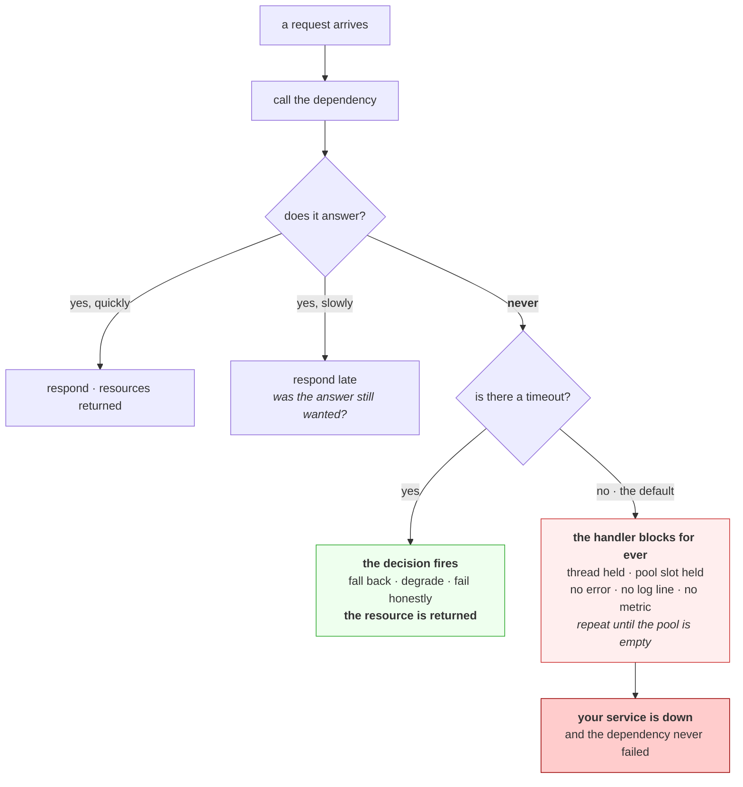

# 4.1 — A timeout is a decision, not a safety net

## One-line answer

A timeout is you deciding **how long this is worth waiting for and what to do instead** — and if you do not
make that decision, the default in most libraries is to wait forever, which is not a safe fallback but the
most dangerous setting available.

---

## The story

🎬 **The scene.** Four flatmates share one bathroom and one of them is in it. Everybody else needs to leave
for work.

😬 **The naive fix.** The others wait outside the door. Nobody knocks, because knocking feels rude, and
anyway the person will surely be out in a moment.

💥 **Why it fails.** He is not out in a moment. He has fallen back asleep in the bath. Three people stand in
a corridor for the better part of an hour, and by the time anybody knocks, all four are late rather than
one — **and each of the three could have used the kitchen sink, gone to the gym, or simply left.** The cost
was never the bathroom being occupied. It was three people committing an unbounded amount of time to an
outcome they never checked on, with no plan for what to do if it did not arrive.

💡 **The insight.** Waiting is a choice that spends something, and *waiting indefinitely* is a choice
nobody makes on purpose — it is what happens when nobody decides. **The useful question is never "how long
will this take"; it is "how long is it worth waiting, and what do I do at that point instead."**

---

## The idea in plain language

Every part of this day so far has ended in the same place. Part
[2.4](../02-names/2.4-when-a-name-fails-nxdomain-servfail-and-silence.md): a silent resolver costs time
rather than producing an error. Part [3.2](../03-the-connection/3.2-the-accept-queue-and-the-backlog.md): a
full accept queue on Linux drops rather than refuses. Part
[3.4](../03-the-connection/3.4-connection-refused-versus-connection-timed-out.md): a dropped packet
produces silence, and silence is bounded only by whoever decided to stop waiting.

**In every one of those, the failure is not an error. It is a wait.** And a wait has to be ended by
somebody.

### The default is worse than you expect

The `socket` documentation, checked on **2026-08-26**, is unambiguous: *"Return the default timeout in
seconds (float) for new socket objects. A value of `None` indicates that new socket objects have no
timeout. When the socket module is first imported, the default is `None`."*

**No timeout.** Not a long one. Not a sensible one chosen by somebody who thought about it. **None**, which
means a read that never returns blocks that thread until the process is killed.

The same is true, with variations, across nearly every language's standard networking library, and it is
true for a defensible reason: the library cannot know what your deadline is. **But the consequence is that
the safe-sounding option — leaving it alone — is the unbounded one.**

### What a timeout actually is

It is three decisions wearing one number.

**How long the result is still worth having.** A response that arrives after the person who asked has given
up is not a success. It is work you did for nobody, and you paid for it with a resource somebody else
needed.

**What happens when the time is up.** This is the half that is nearly always missing. A timeout that raises
an exception nobody handles has converted a hang into a crash, which is *better* but is not a plan.
Fallback, cached answer, degraded response, honest error — one of those has to be chosen.

**What you are protecting.** Not the dependency. **Yourself.** A timeout does nothing to help the slow
service, and it does not make your response faster. What it does is put a **bound on the resources you
commit to a request**, so that a dependency going slow cannot consume all of them. That is the entire
purpose, and section [05](../05-when-it-adds-up/5.1-hanging-pulse-on-purpose.md) is where you watch it fail
to happen.

### Why "safety net" is the wrong metaphor

A safety net catches you after a fall you did not plan. **A timeout is not that**: it is a scheduled
decision that fires on time, every time, whether or not anything is wrong. Set it too low and you convert
healthy-but-slow requests into failures. Set it too high and it never fires when you need it. Leave it
unset and it never fires at all.

**So a timeout has a cost in both directions**, and choosing one is engineering rather than defensive
boilerplate.

---

## Why Kriya needs it

Day 9 gives `pulse` a model provider. That call goes over the internet to a free-tier service under load
from strangers, and it is **the least predictable thing in this entire system**. It is also the first place
a missing timeout can hang a request handler.

Day 13's CI has a job timeout, and Day 14's gates fail rather than warn — the same idea one level up.

Day 43's readiness probes carry timeouts that decide whether a slow pod is restarted or left alone, and
getting that number wrong causes restarts under load, which is the worst possible time.

Day 87 builds load shedding and circuit breakers, both of which are **decisions about giving up**, and both
of which are meaningless without a timeout underneath them.

Day 92's service level objectives put a number on how long a response may take. **A timeout is that number,
enforced.** Without it, the objective is an aspiration.

---

## The mechanism

Prove the default first, because most people do not believe it.

```python
# days/day-007-networking-for-operators/lab/nodeadline.py
"""Show that a fresh socket has no timeout at all, and that recv() will wait indefinitely."""

import socket
import time

print("socket.getdefaulttimeout() =", socket.getdefaulttimeout())

sock = socket.create_connection(("127.0.0.1", 8097))
print("connected, timeout on this socket =", sock.gettimeout())
sock.sendall(b"GET / HTTP/1.0\r\nHost: x\r\n\r\n")

started = time.monotonic()
print("calling recv() with no timeout — this blocks until the server replies", flush=True)
try:
    sock.settimeout(6)  # a watchdog ONLY so this demonstration terminates
    sock.recv(4096)
except OSError as exc:
    print(
        f"stopped by our own watchdog after {time.monotonic() - started:.1f}s: {type(exc).__name__}"
    )
sock.close()
```

**Line by line:**

- `socket.getdefaulttimeout()` before anything else, because the whole argument rests on what it returns
  and reading it takes one line.
- `socket.create_connection(...)` is the convenience wrapper most code uses. The documentation, checked on
  **2026-08-26**, says of its timeout parameter: *"If no timeout is supplied, the global default timeout
  setting returned by `getdefaulttimeout()` is used."* — and that default is `None`. **The convenient
  function inherits the dangerous default**, which is exactly how this reaches production code.
- `sock.gettimeout()` **after** connecting, printed deliberately, so you see that the socket you are
  holding really has no deadline rather than taking my word for it.
- `sock.settimeout(6)` is labelled a **watchdog** in the comment because it is not the lesson — it exists
  so this script terminates. ⚠️ Without it the process hangs until you kill it, which is precisely the
  behaviour being demonstrated and a nuisance in a document you are working through.
- `flush=True` on the message before the blocking call, because a buffered `print` would appear *after* the
  wait and the output would read backwards.
- **`8097` is the port of a deliberately unresponsive server**, which part
  [5.1](../05-when-it-adds-up/5.1-hanging-pulse-on-purpose.md) builds. Run that first, or this script gets
  a refusal instead of a hang.

```bash
uv run python days/day-007-networking-for-operators/lab/nodeadline.py
```

**Line by line:** run it with the slow server up. The interesting output is the two `None` values at the
top; everything after is the consequence.

Observed on **2026-08-26**:

```text
socket.getdefaulttimeout() = None
connected, timeout on this socket = None
calling recv() with no timeout — this blocks until the server replies
stopped by our own watchdog after 6.0s: TimeoutError
```

**Two `None`s, and the second one is the important one.** It is easy to assume the global default is `None`
but that some sensible per-connection default is applied by the helper. It is not. **The socket you got
back from the convenience function will wait for ever**, and the only reason this script finished is a line
that exists to make the demonstration terminate.

**Now imagine that line is not there**, which is the situation in a great deal of real code, and the thread
is a request handler.



**Follow the red path.** Nothing on it is an error. There is no exception, no non-zero exit, nothing to log
and nothing to count — which is why this failure mode reaches production so reliably. **The absence of a
timeout produces the absence of evidence.**

### Choosing the number

There is a genuine method, and it is not "pick something round".

```bash
curl -sS -o /dev/null -w 'total=%{time_total}s\n' https://pypi.org/
```

**Line by line:**

- `-w 'total=%{time_total}s\n'` prints curl's own measurement of the whole operation. **Measure before you
  choose**, because a timeout picked without a baseline is a guess with a config file around it.
- Run it several times rather than once. One sample tells you nothing about the spread, and the spread is
  what the timeout has to accommodate.

Observed on **2026-08-26**: `total=0.233288s`.

**The method:** measure the normal distribution of the call, take a high percentile — the ninety-ninth, say
— and set the timeout somewhat above it. That way healthy-but-slow requests survive and genuinely stuck
ones are cut. **A timeout below your own p99 is a decision to fail a percent of healthy traffic**, which is
sometimes right and must never be accidental.

**And the constraint from above:** your timeout can never sensibly exceed the deadline of whatever called
you. If your caller gives up after two seconds, a five-second timeout on your dependency is a guarantee
that you will do two seconds of work for nobody every time it fires. That constraint is part
[5.3](../05-when-it-adds-up/5.3-the-deadline-that-travels.md).

---

## When it breaks

**A timeout set too low, and the dependency is fine.** The self-inflicted outage.

```text
$ curl -sS -o /dev/null --max-time 0.2 https://pypi.org/ ; echo "exit=$?"
curl: (28) Operation timed out after 201 milliseconds with 0 bytes received
exit=28
```

**What it says:** timed out.

**What it actually means:** nothing is wrong with the far end. The measured normal time is 233 ms, so a
200 ms budget fails a healthy request every time. **You have built a service that reports its dependency as
broken while the dependency is healthy**, and worse, the retries this triggers add load that makes the real
latency climb towards the threshold you set.

**The smallest fix:** measure, then set above the observed high percentile.

**Why it is worth naming as a failure mode:** aggressive timeouts feel responsible. They are not
automatically safer — they move the failure from *sometimes too slow* to *reliably broken*, and the second
one is your fault rather than the network's.

**A timeout that fires and nothing handles it.** A hang converted into a crash.

```text
Traceback (most recent call last):
  File "handler.py", line 41, in get_prediction
    response = client.get(MODEL_URL)
TimeoutError: timed out
```

**What it says:** a timeout, unhandled, taking the request down.

**What it actually means:** half the decision was made. The wait is bounded, which is real progress, and
there is still no answer to *what do we do instead*. The caller gets a 500 where it might have got a cached
answer, a degraded response or an honest 503 with a retry hint.

**The smallest fix:** catch it and decide. Even `raise HTTPException(503, "model unavailable")` is a
decision, and it is enormously better than a stack trace, because 503 tells the caller to retry later and
500 tells it that you are broken.

**The distinction worth holding:** ⚠️ **bounding the wait and handling the expiry are two separate pieces of
work**, and shipping only the first is the common half-finished state.

**A timeout on the wrong phase.** Measured in part
[4.2](4.2-the-four-timeouts-of-one-request.md), previewed here.

```text
$ curl -sS -o /dev/null --connect-timeout 3 --max-time 8 -w 'connect=%{time_connect}s total=%{time_total}s\n' http://127.0.0.1:8097/
curl: (28) Operation timed out after 8004 milliseconds with 0 bytes received
connect=0.002481s total=8.004620s
```

**What it says:** a three-second connect timeout, and an eight-second operation.

**What it actually means:** **the connect timeout was satisfied.** The connection was established in two
and a half milliseconds, comfortably inside its budget, and then the server never replied. A timeout that
bounds connection establishment does nothing whatsoever about a server that accepts and goes quiet — which,
from part [3.2](../03-the-connection/3.2-the-accept-queue-and-the-backlog.md), is exactly what a wedged
application looks like.

**The smallest fix:** set the one that bounds the whole operation as well.

**Why this is the trap rather than an edge case:** `--connect-timeout` and `timeout=` in most client
libraries default to bounding connection setup, which is the phase that almost never hangs. **The phase
that hangs is the one that is left unbounded**, and part 4.2 takes it apart properly.

**A retry loop that multiplies the timeout you set.** Met already, in DNS.

```text
$ time nslookup -timeout=2 -retry=1 example.com 203.0.113.53
    timeout was 2 seconds.
real	0m10.122s
```

**What it says:** a two-second timeout, and ten seconds of wall clock.

**What it actually means:** the two seconds bounded **one attempt**, and several attempts were made. From
part [2.4](../02-names/2.4-when-a-name-fails-nxdomain-servfail-and-silence.md), where this was first
measured — the number you configure and the number your caller experiences differ by the retry count, and
nothing warns you.

**The smallest fix:** know which kind of timeout you are setting, and put a bound on the whole operation
somewhere.

**Why it is here again:** it is the same mistake in a different layer, and meeting it twice in one day is
deliberate. **Per-attempt and per-operation are different bounds with the same name**, and section 05 shows
what happens when the multiplication runs down a chain of services.

---

## In production

**What a professional writes instead of the teaching version.** Every outbound call has an explicit
timeout, set from a measured baseline rather than a habit, and every timeout has a handler that does
something more useful than re-raising. They also make the timeout **configurable without a deploy**,
because the right value changes when the dependency changes and you find that out during an incident. And
they treat "no timeout specified" as a review failure in the same category as an unhandled exception — it
is not a style preference, it is an unbounded resource commitment.

**What degrades at scale.** The relationship between timeout and capacity becomes arithmetic. A service
with two hundred worker threads and a five-second timeout can absorb a completely dead dependency at forty
requests per second before every worker is blocked — and at forty-one it stops serving anything, including
requests that never touch that dependency. **The timeout is what makes that number finite.** With no
timeout, the capacity is not forty per second, it is zero: every request that touches the dead dependency
is permanently lost, and the pool drains until nothing is left. Section
[05](../05-when-it-adds-up/5.1-hanging-pulse-on-purpose.md) does this drill.

**The failure that only shows with real traffic.** The timeout that was never exercised. A value set two
years ago against a dependency that has never once been slow is untested configuration, and untested
configuration is usually wrong — the number was picked before the dependency existed in its current form,
and the handler underneath it has never run. **The first time it fires is during an incident**, which is
the worst moment to discover that the fallback path throws its own exception. Day 84's failure drills exist
so the handler runs at least once on a day you chose.

**The review comment a senior engineer leaves.** *"There is no timeout on this call. That means one slow
response from this dependency holds a worker for ever, and enough of them take the whole service down
without the dependency ever returning an error. Add a timeout with a number you can defend from the
latency graph, and add the `except` that says what we serve when it fires — the second half is the part
people forget."*

**The signal you would alert on.** **Timeout expiries as their own counter**, separate from other errors,
labelled by which dependency and which phase. That series is the only direct evidence that your deadline
decisions are firing, and its healthy value is a small non-zero number rather than zero — **a timeout that
never fires is either far too generous or protecting nothing.** You would alert on a sharp increase, since
that means a dependency's behaviour changed. You would also graph **request duration against the timeout
value on the same axes**, because the day the p99 approaches the threshold is the day you are about to
start failing healthy traffic, and that is visible in advance. You would **not** alert on the timeout
*setting* — it is configuration, and it belongs in review — and you would **not** fold timeouts into a
general error count, because the response is different: an error means the dependency answered badly, a
timeout means it did not answer, and section
[3.4](../03-the-connection/3.4-connection-refused-versus-connection-timed-out.md) argued why those separate.

**Blast radius.** This part opens one loopback connection to a server it does not start, and one HTTPS
request to a public host. **The capability it introduces is the timeout itself, and it cuts both ways**:
setting one too low is a decision to fail healthy requests, and that decision is deployed to every caller
at once. Worst case for a badly chosen value is a self-inflicted outage in which your dependency is
perfectly healthy, your dashboards show it as broken, and your retries make the real latency worse — an
outage caused entirely by a number. Who can trigger it: anybody who can change that configuration, which
should be a reviewed change and often is not, because it looks like a tuning knob. What bounds it: choosing
the number from a measured percentile rather than a habit, making it configurable so it can be corrected
without a deploy, and **exercising the expiry path deliberately** so the handler has run at least once.

**Cost.** `0` model calls, `0` tokens, `0` CI minutes, `0` disk, negligible RAM. **Network: one HTTPS
request to a public host, a few kilobytes**, plus loopback traffic that does not leave the machine. About
six seconds of deliberate waiting.

**The interview question.** *"What timeout would you put on a call to a service you have never operated,
and how would you decide?"* The answer that lands refuses to give a number first: *"I would not pick one
from memory — I would measure the call's latency distribution and set the timeout somewhat above a high
percentile, so healthy-but-slow requests survive and stuck ones are cut. Then I would check it against the
constraint from above: my timeout cannot sensibly exceed the deadline my own caller gives me, or I spend
time producing an answer nobody is waiting for any more. The part I would insist on is the other half of
the decision — what we serve when it fires. A timeout with no handler turns a hang into a 500, which is
better but still not a plan; a cached value, a degraded response or an honest 503 with a retry hint are all
plans. And I would want to know which phase I am bounding, because a connect timeout does nothing about a
server that accepts the connection and then goes silent, and that is the failure that actually happens. The
reason I care so much is that the timeout is not protecting the dependency, it is protecting my own
capacity: with a bound, a dead dependency costs me a calculable number of concurrent requests; without one,
it costs me all of them."*

---

## Check yourself

```bash
uv run python -c "import socket; print(socket.getdefaulttimeout())" && curl -sS -o /dev/null -w 'total=%{time_total}s\n' https://pypi.org/
```

The default, and a baseline to choose against. **The two things to carry are the word `None` and a
measured number** — because the first is what you get if you decide nothing, and the second is the only
honest way to decide something.

**Say out loud, without scrolling up:** *say what a timeout protects and what it does not, give the two
halves of the decision and name the one people ship without, and say why leaving the timeout unset is more
dangerous than setting it badly.*
