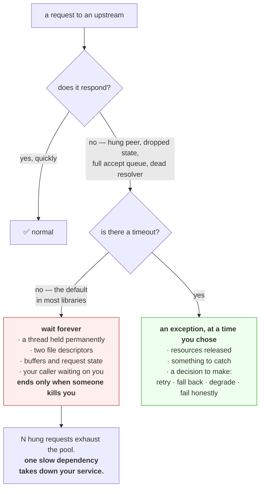

# 4.1 — A timeout is a decision, not a safety net

## One-line answer

Waiting is not free — a request in flight holds a thread, a connection and a client's attention — so a
timeout is you choosing **how much you are willing to spend before giving up**, and the default in most
libraries is "everything, forever".

---

## The story

🎬 **The scene.** A restaurant kitchen. An order goes to the fish supplier's phone line: *"do you have
turbot?"*

The supplier does not pick up. The chef holds the phone to his ear and waits, because the answer matters —
the whole menu depends on it.

He is still holding it twenty minutes later. Meanwhile forty covers are seated, three other suppliers need
calling, and the one phone in the kitchen is occupied by a call that was never answered.

😬 **The naive fix.** Somebody suggests he needs a better supplier.

💥 **Why it fails.** The supplier is not the problem, or at least not the *interesting* one. **The problem
is that nobody decided how long a phone call is worth**, so a supplier's bad afternoon became the
kitchen's bad evening. A second phone would help; a rule saying "ring for a minute, then move on" would
help more, and costs nothing.

**And notice what the waiting bought: nothing.** Twenty minutes of holding produced exactly the same
information as thirty seconds of holding — none — at forty times the cost.

💡 **The insight.** Waiting consumes a resource you are not thinking about, and past a certain point it
buys nothing. **Deciding when to stop is not an admission of failure; it is the only way to bound what
somebody else's problem can cost you.** A system with no such rule has implicitly chosen the largest
possible number.

---

## The idea in plain language

Every network operation can hang. Not fail — **hang**, indefinitely, because of everything section 3
established: a peer that vanished without a `FIN`
([3.4](../03-tcp/3.4-the-connection-that-is-open-and-dead.md)), a firewall that dropped the state, an
accept queue nobody is draining ([3.2](../03-tcp/3.2-the-accept-queue-and-the-backlog.md)), a resolver
that never answers ([2.3](../02-dns/2.3-the-dns-failure-that-looks-like-a-timeout.md)).

**A timeout is the only defence**, and it is a decision you make rather than a protection you get.

### What a hanging request actually costs

The instinct is that waiting is free — nothing is being computed. It is not:

- **A thread or a task.** In a thread-per-request server, a hung request holds a thread permanently. With
  a pool of 50 threads, 50 hung requests is a completely unresponsive service.
- **A connection.** Both a socket to the upstream and the client's socket to you
  ([1.2](../01-addresses-and-ports/1.2-the-socket-and-the-four-tuple.md)), each a file descriptor at both
  ends.
- **Memory.** Buffers, the request body, whatever the handler has allocated so far.
- **Your caller's patience.** They are waiting on you, holding *their* resources — which is
  [5.1](../05-the-two-together/5.1-the-timeout-budget-down-the-request-path.md).

**So one slow upstream can exhaust your service** without your service having any fault of its own. The
technical term is resource exhaustion by a dependency, and a timeout is the containment.

### The defaults are the problem

| Library | Default timeout |
| --- | --- |
| Python `requests` | **none** |
| Python `socket` | **none** — blocking forever |
| Python `httpx` | **5 seconds**, verified against `python-httpx.org/advanced/timeouts/` on 2026-08-24 |
| `curl` | **none** for the whole transfer; 300 s connect |
| most database drivers | none, or extremely long |

**`httpx` is the outlier**, and it is worth quoting its documentation directly: *"The default behavior is
to raise a `TimeoutException` after 5 seconds of network inactivity."* Most libraries in most languages do
not do this, and the shape of the failure they produce is a service that stops responding rather than one
that errors.

### Why "no timeout" is a choice with a value

Saying "we did not set a timeout" sounds like an omission. It is a decision, and the decision is:
**we are willing to wait forever**.

Written out like that, nobody would agree to it. **The default agrees to it on your behalf**, quietly, in
every library where the default is none.

### Choosing the number

A timeout should be:

**Longer than the legitimate slow case.** If your p99 upstream response is 800 ms, a 500 ms timeout fails
one percent of good requests. **Timing out a request that would have succeeded is a self-inflicted
error.**

**Shorter than your own deadline.** If your caller gives up after 3 seconds, waiting 10 for an upstream is
work nobody will collect
([5.1](../05-the-two-together/5.1-the-timeout-budget-down-the-request-path.md)).

**Chosen from measurement, not from a round number.** "30 seconds" is almost always somebody's guess. The
right basis is the upstream's actual latency distribution plus headroom.

**Different for different operations.** A health check and a report generation do not deserve the same
number, and giving them the same one means the health check is too slow or the report is cut off.

---

## Why Kriya needs it

Day 25 connects `pulse` to Postgres, and Day 109 to a model. **Both are network calls with a default of
"wait forever"** unless configured otherwise.

Day 41 configures probes with their own timeouts, and Day 73's SLO is a statement about latency — which
means an unbounded operation makes the objective unmeasurable as well as unmet.

Day 126 calls a local model and Day 147 evaluates one; Addendum 01 requires every model call path to
handle HTTP 429 with backoff, which is impossible without a timeout to bound the attempt.

Day 179's agents call tools, and an agent step with no timeout is an agent that can hang forever holding a
budget ([5.2](../05-the-two-together/5.2-retries-that-turn-a-blip-into-an-outage.md)).

---

## The mechanism

Make something hang, and watch what a timeout is worth.

`silent_peer.py` from [3.4](../03-tcp/3.4-the-connection-that-is-open-and-dead.md) is the tool: it accepts
a connection and then does nothing at all.

```bash
uv run python days/day-007-networking-for-operators/lab/silent_peer.py 8008 90 &
SILENT=$!
sleep 2
```

**Line by line:** a peer that will accept one connection and ignore it for ninety seconds. **This is a
perfectly healthy TCP connection to a completely unresponsive application** — the state from
[3.4](../03-tcp/3.4-the-connection-that-is-open-and-dead.md).

### Without a timeout

```python
# days/day-007-networking-for-operators/lab/no_timeout.py
"""Connect and read with no timeout. Demonstrates 'wait forever' as a default."""

import socket
import sys
import time

PORT = int(sys.argv[1]) if len(sys.argv) > 1 else 8008

start = time.monotonic()
s = socket.create_connection(("127.0.0.1", PORT))
print(f"[no-timeout] connected after {time.monotonic() - start:.3f}s", flush=True)

s.sendall(b"GET / HTTP/1.1\r\nHost: localhost\r\n\r\n")
print("[no-timeout] request sent; now reading with NO timeout set", flush=True)
print("[no-timeout] this will block until the peer says something, or forever.", flush=True)

data = s.recv(4096)
print(f"[no-timeout] got {len(data)} bytes after {time.monotonic() - start:.3f}s", flush=True)
s.close()
```

**Line by line:**

- `socket.create_connection(("127.0.0.1", PORT))` — **no `timeout=` argument**, which is the whole point.
  Compare with [1.2](../01-addresses-and-ports/1.2-the-socket-and-the-four-tuple.md), where it was set.
- `s.sendall(...)` — **this will succeed**, because it only reaches the kernel's send buffer
  ([3.4](../03-tcp/3.4-the-connection-that-is-open-and-dead.md)). The success proves nothing about the
  peer.
- `s.recv(4096)` — **this is the line that blocks.** With no timeout on the socket, it blocks until data
  arrives or the connection is closed. Neither will happen.
- `time.monotonic()` throughout — a clock that cannot go backwards
  ([Day 6, part 2.1](../../../day-006-resources-and-the-oom-killer/parts/02-cpu/2.1-a-core-is-a-queue-not-a-speed.md)).

```bash
timeout 20 uv run python days/day-007-networking-for-operators/lab/no_timeout.py 8008
echo "shell had to kill it: exit=$?"
```

**Line by line:** `timeout 20` — **the shell's own timeout command**, wrapping a program that has none.
Note what this means: **the only reason this experiment ends is that something outside the program
imposed a limit**, which is exactly the situation a service with no timeouts is in — dependent on somebody
else eventually killing it.

Observed on **2026-08-24**:

```text
[no-timeout] connected after 0.001s
[no-timeout] request sent; now reading with NO timeout set
[no-timeout] this will block until the peer says something, or forever.
shell had to kill it: exit=124
```

**Twenty seconds and no progress, ended by an external kill.** Exit `124` is `timeout`'s convention for
"the command was killed for exceeding the limit"
([Day 4, part 3.1](../../../day-004-linux-for-operators-i/parts/03-exit-codes/3.1-the-exit-code-is-the-whole-return-value.md)).

**Without that wrapper this program runs until the machine reboots.** No error, no log line, no CPU use —
[Day 4's state `S`](../../../day-004-linux-for-operators-i/parts/01-the-process/1.4-process-states-and-the-d-that-will-not-die.md),
sleeping, forever.

### With a timeout

```python
# days/day-007-networking-for-operators/lab/with_timeout.py
"""The same operation with a read timeout. The failure is fast, explicit and catchable."""

import socket
import sys
import time

PORT = int(sys.argv[1]) if len(sys.argv) > 1 else 8008
TIMEOUT = float(sys.argv[2]) if len(sys.argv) > 2 else 3.0

start = time.monotonic()
s = socket.create_connection(("127.0.0.1", PORT), timeout=TIMEOUT)
s.settimeout(TIMEOUT)
print(f"[timeout] connected after {time.monotonic() - start:.3f}s, timeout={TIMEOUT}s", flush=True)

s.sendall(b"GET / HTTP/1.1\r\nHost: localhost\r\n\r\n")
try:
    data = s.recv(4096)
    print(f"[timeout] got {len(data)} bytes after {time.monotonic() - start:.3f}s", flush=True)
except TimeoutError as exc:
    print(
        f"[timeout] gave up after {time.monotonic() - start:.3f}s: {type(exc).__name__}: {exc}",
        flush=True,
    )
finally:
    s.close()
```

**Line by line:**

- `create_connection(..., timeout=TIMEOUT)` — **bounds the connect**. This is a *different* timeout from
  the read one, which is [4.2](4.2-the-four-timeouts-of-one-http-call.md)'s subject.
- `s.settimeout(TIMEOUT)` — **and this bounds every subsequent operation on the socket.** The argument to
  `create_connection` applies to the connect only; forgetting the second call is a genuinely common bug
  that produces a bounded connect and an unbounded read.
- `except TimeoutError` — the specific exception rather than a bare `except`
  (`CLAUDE.md`). In Python 3.10 and later `socket.timeout` is an alias for the builtin `TimeoutError`,
  which is what makes this readable.
- Printing `type(exc).__name__` — **so the program reports what it actually caught** rather than you
  inferring it, the same honesty as
  [Day 6, part 4.1](../../../day-006-resources-and-the-oom-killer/parts/04-the-oom-killer/4.1-what-the-oom-killer-actually-does.md).
- `finally: s.close()` — the descriptor is released on both paths
  ([3.1](../03-tcp/3.1-the-handshake-and-the-connection-states.md): a socket not closed becomes
  `CLOSE_WAIT` on the peer).

```bash
uv run python days/day-007-networking-for-operators/lab/with_timeout.py 8008 3
echo "exit=$?"
```

**Line by line:** the same peer, the same silence, and **no `timeout 20` wrapper this time** — nothing
outside the program is imposing a limit. `echo "exit=$?"` prints the exit status
([Day 4, part 3.1](../../../day-004-linux-for-operators-i/parts/03-exit-codes/3.1-the-exit-code-is-the-whole-return-value.md)),
which is the number that shows the difference: a program that ended on its own terms, not one that was
killed.

```text
[timeout] connected after 0.001s, timeout=3.0s
[timeout] gave up after 3.003s: TimeoutError: timed out
```

**Three seconds, an exception, a normal exit.** Compare the two outputs:

| | no timeout | timeout=3 |
| --- | --- | --- |
| how it ended | killed from outside | **decided by itself** |
| duration | unbounded | 3.003 s |
| exit code | 124 (killed) | 0 |
| an error to handle | none — it never got that far | **`TimeoutError`, catchable** |
| resources held | until killed | 3 seconds |

**The second one is not "better error handling". It is a different category of program**: one that has an
opinion about how long it is prepared to wait, and can therefore do something else afterwards — retry,
fall back, degrade, or return an honest error to its own caller.

### The one that catches everybody

```bash
uv run python -c "
import socket, time
s = socket.create_connection(('127.0.0.1', 8008), timeout=3)
print('[partial] connect was bounded by timeout=3')
s.sendall(b'GET / HTTP/1.1\r\n\r\n')
start = time.monotonic()
try:
    s.recv(4096)
except Exception as e:
    print(f'[partial] recv ended after {time.monotonic()-start:.1f}s with {type(e).__name__}')
"
```

**Line by line:**

- `create_connection(..., timeout=3)` **and no `settimeout` afterwards.**
- The point of the experiment is whether the read is bounded. **On Python this one is** — `create_connection`
  leaves the socket in timeout mode — **but the equivalent mistake in other libraries is not**, and the
  general principle stands: **a connect timeout and a read timeout are different settings, and setting one
  is not setting the other.** [4.2](4.2-the-four-timeouts-of-one-http-call.md) enumerates all four.

```text
[partial] connect was bounded by timeout=3
[partial] recv ended after 3.0s with TimeoutError
```

Clean up:

```bash
kill "$SILENT" 2>/dev/null; wait "$SILENT" 2>/dev/null; netstat -ano | grep ':8008' || echo "8008 clean"
```

**Line by line:** stop the silent peer and confirm the port is released
([1.4](../01-addresses-and-ports/1.4-the-port-that-was-already-in-use.md)).



---

## When it breaks

**A service that stops responding entirely, with no errors and no CPU use.** The exhaustion:

```text
$ curl -m 5 https://api.internal/health
curl: (28) Operation timed out after 5001 milliseconds
$ # on the host:
$ ps -o pid,stat,%cpu,rss -p 4102
    PID STAT %CPU   RSS
   4102 Sl    0.1 412880
```

**What it says:** the service answers nothing and is using no processor.
**What it actually means:** **every worker is blocked on a network read with no timeout.** The process is
alive, its memory is stable, and it is doing nothing at all — state `S`
([Day 4, part 1.4](../../../day-004-linux-for-operators-i/parts/01-the-process/1.4-process-states-and-the-d-that-will-not-die.md)),
sleeping on I/O, exactly as designed.
**The smallest fix in the moment:** restart, which frees everything and will happen again.
**The real fix:** timeouts on every outbound call. **The tell that distinguishes this from a deadlock or a
crash:** flat processor, stable memory, and connections in `ESTABLISHED` to one particular upstream
([3.4](../03-tcp/3.4-the-connection-that-is-open-and-dead.md)).

**The timeout that was set and did nothing.** Setting the wrong one:

```python
client = httpx.Client(timeout=httpx.Timeout(connect=2.0))
```

**What it says:** a timeout is configured.
**What it actually means:** **only the connect is bounded.** Read, write and pool acquisition are
unbounded ([4.2](4.2-the-four-timeouts-of-one-http-call.md)) — and the hang you are trying to prevent is
almost always in the read, because connecting to a hung server succeeds instantly
([3.2](../03-tcp/3.2-the-accept-queue-and-the-backlog.md)).
**The smallest fix:** set a total, or set all four. **Why this is so common:** "connect timeout" is the
phrase people know, and it protects against the least likely failure.

**A timeout that made the error rate worse.** Too aggressive:

```text
# timeout lowered from 10s to 500ms
# upstream p99 = 800ms
# error rate: 0.1% -> 12%
```

**What it says:** a twelvefold increase in errors after tightening a timeout.
**What it actually means:** **you are now failing requests that would have succeeded.** Twelve percent of
calls legitimately take longer than 500 ms, and you are cutting them off — a self-inflicted error rate
with no upstream fault at all.
**The smallest fix:** set it above the upstream's p99 with headroom, and measure rather than guess.
**The principle:** **a timeout below your dependency's legitimate latency converts their good day into
your bad one.**

**A timeout that fires and leaves things worse.** The incomplete operation:

```text
POST /v1/charge  -> timed out after 5s
# retried
POST /v1/charge  -> 200 OK
# the customer was charged twice
```

**What it says:** a timeout, a retry, and a duplicate.
**What it actually means:** **a timeout tells you that you stopped waiting. It does not tell you the
operation did not happen.** The first request may well have succeeded upstream after you gave up.
**The smallest fix:** make the operation idempotent — an idempotency key — so a retry is safe.
**The rule worth carving in:** **a timeout on a non-idempotent write is a decision to accept an unknown
outcome**, and this is exactly the same lesson as
[Day 4's uncatchable signals](../../../day-004-linux-for-operators-i/parts/02-signals/2.4-the-signals-you-cannot-catch.md):
never acknowledge work before it is durable, and assume you can be cut off between any two steps.
[5.2](../05-the-two-together/5.2-retries-that-turn-a-blip-into-an-outage.md) is the full version.

**A `timeout` that only wraps part of the work.** The scoping mistake:

```python
with timeout(5):
    response = client.get(url)  # bounded
data = response.json()  # NOT bounded — streams the body
```

**What it says:** the call is inside a timeout.
**What it actually means:** in a streaming client, `get()` may return once headers arrive and the body is
read later — **outside the guarded block.** A server that sends headers immediately and then dribbles the
body evades the timeout entirely.
**The smallest fix:** use the client's own timeout configuration rather than an external wrapper, since it
knows about the phases. **The general warning:** an external timeout wrapper only bounds what is
syntactically inside it, and network operations frequently are not where they appear to be.

---

## In production

**What a professional writes instead of the teaching version.** They set timeouts at the client
construction site, once, so every call inherits them — and they treat a call site without one as a defect
in review, in the same category as an unclosed file. The number comes from the upstream's measured
latency distribution rather than from a round figure, and different classes of call get different numbers.
**The habit that matters is that "no timeout" is never the answer to "what timeout should this have?"**

**What degrades at scale.** The exhaustion arrives faster and spreads further. One hung call is nothing;
with a worker pool of 50 and an upstream that hangs, you are fully exhausted after 50 requests — which at
any real traffic rate is a second or two. **And your callers then hang on you**, so the failure propagates
upward through every service that depends on you, which is
[5.1](../05-the-two-together/5.1-the-timeout-budget-down-the-request-path.md) and is how one slow
dependency becomes a platform outage.

**The failure that only shows with real traffic.** The unbounded call that is fast in testing. In
development the upstream is local and answers in a millisecond, so the missing timeout is invisible — you
cannot even tell it is missing. In production the upstream occasionally hangs, and the first time it does,
the missing timeout converts a dependency's incident into yours. **The defect is present from the first
day and only observable on the worst one.**

**The review comment a senior engineer leaves.** *"This `requests.get` has no timeout, which in `requests`
means it can block forever. We run 40 gunicorn workers, so 40 slow calls to this upstream and the whole
service is unresponsive with zero CPU and nothing in the logs. Set a timeout — and put it on the session
so nobody has to remember at each call site."*

**The signal you would alert on.** **The count of in-flight requests, and their age.** A rising number of
requests that have been open for longer than your timeout should be impossible — if it is happening, some
path is unbounded, and this is the only signal that detects a missing timeout *before* it exhausts you.
Also **timeout errors as a distinct category from other errors**, because a rising timeout rate means the
upstream is degrading while a rising 5xx rate means something else, and they need different responses. You
would **not** alert on latency alone here: **an unbounded call does not raise your latency average, it
removes the request from the average entirely**, because it never completes and never gets recorded.

**Blast radius.** This part deliberately runs a program that blocks forever. Worst case on this machine: a
`no_timeout.py` left running holds a thread, a socket and a few megabytes indefinitely, invisible and
harmless — but **it will never exit on its own**, which is why the command that runs it is wrapped in
`timeout 20`. Who can trigger it: you, by running it unwrapped. What bounds it: that wrapper, the
`silent_peer.py` deadline, and the cleanup step. **The production blast radius is much larger and is the
subject of the part**: an unbounded call in a service is a permanent, silent capacity liability that
converts any dependency's outage into your own.

**Cost.** `0` model calls, `0` tokens, `0` CI minutes, `0` disk, negligible RAM and processor. **Waiting
costs nothing measurable and everything operationally**, which is precisely why it is so easy to leave
unbounded — there is no resource graph anywhere that shows "seconds spent waiting for nothing".

**The interview question.** *"Why does a service with no timeouts fall over when a dependency gets slow?"*
The answer that lands names the resource: *"Because waiting holds a worker. Every request blocked on an
upstream read occupies a thread or a task, a socket at both ends, and whatever the handler allocated — so
with a pool of 50 workers, 50 slow calls make the service completely unresponsive, with flat CPU and
nothing in the logs, because from the process's point of view it is doing exactly what it was told. The
default in most client libraries is no timeout at all, which is really a decision to wait forever that
nobody would agree to if it were written down. And the number matters in both directions: too long and you
exhaust yourself, too short and you fail requests that would have succeeded, so it comes from the
upstream's latency distribution rather than from a round number. The thing people forget is that a timeout
does not tell you the operation did not happen upstream — so any retry after one has to be idempotent."*

---

## Check yourself

```bash
uv run python days/day-007-networking-for-operators/lab/silent_peer.py 8008 30 & S=$!; sleep 2; echo "--- with a 3s timeout ---"; uv run python days/day-007-networking-for-operators/lab/with_timeout.py 8008 3; echo "--- with none, killed from outside after 10s ---"; timeout 10 uv run python days/day-007-networking-for-operators/lab/no_timeout.py 8008; echo "shell had to intervene: exit=$?"; kill "$S" 2>/dev/null; wait "$S" 2>/dev/null
```

The same unresponsive peer, approached twice. **One program decides to stop; the other has to be stopped.**
The exit codes say it plainly — `0` for a program that handled its own failure, `124` for one that was
killed for exceeding a limit imposed from outside.

**Say out loud, without scrolling up:** *"we did not set a timeout" is a decision, not an omission. State
what that decision actually commits you to, and name the resource it spends.*
