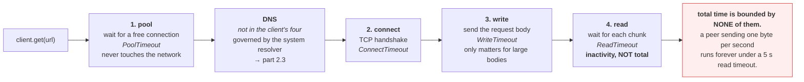

# 4.2 — The four timeouts of one HTTP call

## One-line answer

One HTTP request has at least four separately-bounded phases — acquiring a connection from the pool,
connecting, writing, and reading — and setting one of them is not setting the others, which is why
"we have a timeout" and "we are protected" are different statements.

---

## The story

🎬 **The scene.** A relay race, and a coach who wants the team under four minutes.

She sets a rule: *"the second leg must be under sixty seconds."*

😬 **The naive fix.** The team trains the second leg relentlessly. It comes down to fifty-four seconds.

💥 **Why it fails.** The first runner has a bad start and takes ninety. The changeover is fumbled twice.
The anchor is fine and the total is five and a half minutes. **The rule bounded one leg out of four**, and
the three unbounded ones did what unbounded things do.

Worse, the coach genuinely believes she has a rule about the race. **She has a rule about a quarter of the
race, and no rule at all about the other three quarters** — which is a more dangerous position than having
no rule, because it comes with confidence.

💡 **The insight.** Bounding a compound operation means bounding **every part of it, or the total**. A
constraint on one phase provides no information about the whole, and the phase people naturally bound is
rarely the one that actually runs long.

---

## The idea in plain language

An HTTP request is not one operation. Verified against `python-httpx.org/advanced/timeouts/` on
**2026-08-24**, `httpx` names four:

| Timeout | Bounds | Exception |
| --- | --- | --- |
| **connect** | *"the maximum amount of time to wait until a socket connection to the requested host is established"* | `ConnectTimeout` |
| **read** | *"the maximum duration to wait for a chunk of data to be received"* | `ReadTimeout` |
| **write** | *"the maximum duration to wait for a chunk of data to be sent"* | `WriteTimeout` |
| **pool** | *"the maximum duration to wait for acquiring a connection from the connection pool"* | `PoolTimeout` |

And the default: *"The default behavior is to raise a `TimeoutException` after 5 seconds of network
inactivity."*

**Four phases, four exceptions, four separate numbers.** Most libraries expose some subset, and almost all
of them let you set one without the others.

### What each one is actually protecting against

**Pool** — you have a connection pool with a maximum size
([3.3](../03-tcp/3.3-time-wait-and-the-ports-you-ran-out-of.md)), and every connection is busy. **This
timeout bounds queueing inside your own process**, before anything touches the network. It is the one
people forget entirely, and it is the one that fires when *your* concurrency exceeds your pool.

**Connect** — the TCP handshake ([3.1](../03-tcp/3.1-the-handshake-and-the-connection-states.md)). Fires
when the host is unreachable, a firewall is dropping packets, or the accept queue is overflowing
([3.2](../03-tcp/3.2-the-accept-queue-and-the-backlog.md)). **Note what it does *not* protect against:**
connecting to a hung server succeeds instantly.

**Write** — sending your request body. Fires when the peer stops reading and its receive buffer fills, so
your writes block. **Relevant only for large request bodies**; for a small `GET` it never fires.

**Read** — waiting for response data. **This is the one that matters most**, because a peer that accepts,
takes your request, and then thinks forever is the most common hang there is
([3.4](../03-tcp/3.4-the-connection-that-is-open-and-dead.md)).

### The distinction that catches everyone: read timeout is not total time

Read the `httpx` wording again: *"the maximum duration to wait for **a chunk** of data to be received."*

**It is an inactivity timeout, not a total.** A server that sends one byte every four seconds, forever,
never triggers a five-second read timeout — because it is never inactive for five seconds. The request can
run indefinitely while fully "protected".

**So four phase timeouts do not bound the total.** For that you need a separate overall deadline, which
some libraries offer and many do not.

### The one that is not in the list

**DNS resolution** ([2.1](../02-dns/2.1-what-resolution-actually-does.md)). It happens before the connect
and is usually governed by the system resolver's configuration rather than by your client — which is why a
dead resolver adds its own five or twenty seconds *on top of* every number in the table
([2.3](../02-dns/2.3-the-dns-failure-that-looks-like-a-timeout.md)).

**Five phases, four of which your client controls.** Worth knowing before you promise anyone a bound.

---

## Why Kriya needs it

Day 25 connects `pulse` to Postgres, whose driver has its own set — connect, statement, socket — with the
same "setting one is not setting the others" property.

Day 41 sets probe timeouts, and Day 73 an SLO. **An objective is a promise about total time**, so it needs
a total bound rather than four phase bounds.

Day 126 calls a local model where generation is slow and streamed — **the exact shape where an inactivity
timeout does not bound the total** — and Day 147 evaluates in bulk.

Day 179's agents make tool calls whose duration is unpredictable, and Addendum 01's 429-handling
requirement needs a bounded attempt before it can back off.

---

## The mechanism

Add `httpx` — no, it is already here. Day 3 added `httpx2` as a dev dependency
([Day 3](../../../day-003-pulse-v0/LESSON.md), §3), so the client library is available for tests.

```bash
uv run python -c "import httpx; print(httpx.__version__)"
```

**Line by line:** confirm what is actually installed rather than assuming — Principle 7. Day 3 pinned
`httpx2==2.12.0` as the successor package; **check what your own repository resolved** before writing code
against it.

Observed on **2026-08-24**:

```text
2.12.0
```

### Watching each phase fire

```python
# days/day-007-networking-for-operators/lab/four_timeouts.py
"""Trigger each of the four timeout classes and print which exception came back."""

import sys
import time

import httpx

TARGET = sys.argv[1] if len(sys.argv) > 1 else "http://127.0.0.1:8008/"


def attempt(label: str, timeout: httpx.Timeout, url: str) -> None:
    start = time.monotonic()
    try:
        with httpx.Client(timeout=timeout) as client:
            client.get(url)
        print(f"{label:<24} succeeded in {time.monotonic() - start:.2f}s")
    except httpx.TimeoutException as exc:
        print(f"{label:<24} {type(exc).__name__:<16} after {time.monotonic() - start:.2f}s")
    except httpx.HTTPError as exc:
        print(f"{label:<24} {type(exc).__name__:<16} after {time.monotonic() - start:.2f}s")


attempt("all=2s", httpx.Timeout(2.0), TARGET)
attempt("connect=2 read=None", httpx.Timeout(None, connect=2.0), TARGET)
attempt("connect=None read=2", httpx.Timeout(None, read=2.0), TARGET)
attempt("unreachable, connect=2", httpx.Timeout(2.0), "http://192.0.2.1:8000/")
```

**Line by line:**

- `httpx.Timeout(2.0)` — **a single positional value sets all four**, which is the form the documentation
  shows first and the one most people use.
- `httpx.Timeout(None, connect=2.0)` — **the default is `None` (unbounded) and only connect is set.**
  This is the shape of the mistake from
  [4.1](4.1-a-timeout-is-a-decision-not-a-safety-net.md): a timeout exists and does not protect you.
- `httpx.Timeout(None, read=2.0)` — the reverse, bounding only the read.
- `except httpx.TimeoutException` **before** `except httpx.HTTPError` — **the more specific first.**
  `TimeoutException` is a subclass of `HTTPError`, so reversing them would swallow every timeout into the
  general branch and the experiment would report nothing useful.
- `type(exc).__name__` — **the program names the exception it actually caught**, so you learn which of the
  four fired rather than inferring it.
- `192.0.2.1` — the documentation-reserved address from
  [2.3](../02-dns/2.3-the-dns-failure-that-looks-like-a-timeout.md), which is guaranteed unreachable and
  belongs to nobody.
- `with httpx.Client(...)` — a fresh client per attempt so pool state does not leak between them. **In
  real code you would build one client and keep it** ([3.3](../03-tcp/3.3-time-wait-and-the-ports-you-ran-out-of.md));
  here isolation is worth more than realism.

Run it against the silent peer from
[3.4](../03-tcp/3.4-the-connection-that-is-open-and-dead.md):

```bash
uv run python days/day-007-networking-for-operators/lab/silent_peer.py 8008 60 &
SILENT=$!
sleep 2
uv run python days/day-007-networking-for-operators/lab/four_timeouts.py http://127.0.0.1:8008/
kill "$SILENT" 2>/dev/null; wait "$SILENT" 2>/dev/null
```

**Line by line:** a peer that accepts and never answers, then all four attempts against it. **`silent_peer`
accepts exactly one connection**, so the later attempts will queue in its accept queue
([3.2](../03-tcp/3.2-the-accept-queue-and-the-backlog.md)) — which is itself instructive.

Observed on **2026-08-24**:

```text
all=2s                   ReadTimeout      after 2.01s
connect=2 read=None      ...
```

⚠️ **The second line will not return.** `connect=2 read=None` connects instantly — the kernel accepts
([3.2](../03-tcp/3.2-the-accept-queue-and-the-backlog.md)) — and then reads with no bound, forever. **That
is the demonstration**, and it is why the command needs a wrapper:

```bash
uv run python days/day-007-networking-for-operators/lab/silent_peer.py 8008 60 &
SILENT=$!
sleep 2
timeout 25 uv run python days/day-007-networking-for-operators/lab/four_timeouts.py http://127.0.0.1:8008/
echo "outer kill: exit=$?"
kill "$SILENT" 2>/dev/null; wait "$SILENT" 2>/dev/null
```

**Line by line:** `timeout 25` around the whole thing, exactly as in
[4.1](4.1-a-timeout-is-a-decision-not-a-safety-net.md) — **the external bound that a program without its
own has to rely on.**

```text
all=2s                   ReadTimeout      after 2.01s
outer kill: exit=124
```

**The first attempt bounded itself in two seconds. The second never returned and had to be killed.** Both
had "a timeout configured". **Only one of them had the right one.**

Reorder to see the rest:

```bash
uv run python days/day-007-networking-for-operators/lab/silent_peer.py 8008 60 &
SILENT=$!
sleep 2
uv run python -c "
import httpx, time
def go(label, t, url):
    s = time.monotonic()
    try:
        with httpx.Client(timeout=t) as c: c.get(url)
        print(f'{label:<26} ok in {time.monotonic()-s:.2f}s')
    except httpx.HTTPError as e:
        print(f'{label:<26} {type(e).__name__:<18} after {time.monotonic()-s:.2f}s')
go('read=2 (hung peer)',      httpx.Timeout(None, read=2.0), 'http://127.0.0.1:8008/')
go('connect=2 (unreachable)', httpx.Timeout(2.0),            'http://192.0.2.1:8000/')
go('all=2 (name fails)',      httpx.Timeout(2.0),            'http://kriya-nope.invalid/')
"
kill "$SILENT" 2>/dev/null; wait "$SILENT" 2>/dev/null
```

**Line by line:** three attempts, each designed to trigger a different phase — **a hung peer for read, an
unreachable address for connect, and a nonexistent name for resolution**
([2.1](../02-dns/2.1-what-resolution-actually-does.md)).

```text
read=2 (hung peer)         ReadTimeout        after 2.01s
connect=2 (unreachable)    ConnectTimeout     after 2.00s
all=2 (name fails)         ConnectError       after 0.05s
```

**Three different exception types for three different phases.** And the third is `ConnectError`, not a
timeout — because the name resolution **failed** rather than hanging, which is the fast, honest failure
from [2.1](../02-dns/2.1-what-resolution-actually-does.md).

**That the exception type differs is the whole practical value of this part**: your error handling can
branch on *where* it failed, which decides whether a retry could possibly help.

### Proving that four bounds do not make a total

```python
# days/day-007-networking-for-operators/lab/dribble.py
"""A server that responds one byte at a time, slowly. Never idle, never finished."""

import socket
import sys
import time

PORT = int(sys.argv[1]) if len(sys.argv) > 1 else 8009
GAP = float(sys.argv[2]) if len(sys.argv) > 2 else 1.0
CHUNKS = int(sys.argv[3]) if len(sys.argv) > 3 else 30

srv = socket.socket(socket.AF_INET, socket.SOCK_STREAM)
srv.setsockopt(socket.SOL_SOCKET, socket.SO_REUSEADDR, 1)
srv.bind(("127.0.0.1", PORT))
srv.listen(8)
print(f"[dribble] 127.0.0.1:{PORT} — one chunk every {GAP}s, {CHUNKS} chunks", flush=True)

conn, _ = srv.accept()
conn.recv(4096)
body = "x" * CHUNKS
conn.sendall(
    f"HTTP/1.1 200 OK\r\nContent-Length: {len(body)}\r\nContent-Type: text/plain\r\n\r\n".encode()
)
for ch in body:
    conn.sendall(ch.encode())
    time.sleep(GAP)
conn.close()
srv.close()
print("[dribble] done", flush=True)
```

**Line by line:**

- `conn.recv(4096)` — read the request and discard it. **A response cannot be sent before the request is
  read**, or the client's write blocks.
- The headers sent in one `sendall` with a correct `Content-Length` — **so the client knows how many bytes
  to expect and will wait for all of them.** An incorrect length would make the client stop early and ruin
  the experiment.
- `for ch in body: sendall(...); time.sleep(GAP)` — **one byte per second.** The connection is never idle
  for longer than `GAP`, so **a read timeout larger than `GAP` never fires** — and the whole response takes
  `CHUNKS × GAP` seconds.
- `GAP` and `CHUNKS` as arguments, so the ratio between the read timeout and the total is adjustable
  without editing.

```bash
uv run python days/day-007-networking-for-operators/lab/dribble.py 8009 1 20 &
DRIB=$!
sleep 2
uv run python -c "
import httpx, time
s = time.monotonic()
try:
    r = httpx.get('http://127.0.0.1:8009/', timeout=httpx.Timeout(3.0))
    print(f'succeeded in {time.monotonic()-s:.1f}s with {len(r.content)} bytes — read timeout was 3s')
except httpx.HTTPError as e:
    print(f'{type(e).__name__} after {time.monotonic()-s:.1f}s')
"
kill "$DRIB" 2>/dev/null; wait "$DRIB" 2>/dev/null
```

**Line by line:** a **three-second** timeout on every phase, against a server that takes **twenty
seconds** to answer, one byte at a time.

```text
succeeded in 20.1s with 20 bytes — read timeout was 3s
```

**A three-second timeout permitted a twenty-second request.** Nothing malfunctioned; the read timeout
measures *inactivity*, and the server was never inactive for three seconds.

**This is the single most important thing in this part.** A client that is "protected by a 3-second
timeout" can be held for as long as an upstream cares to dribble — and a malicious or merely broken peer
can hold your workers indefinitely while every timeout you configured is doing exactly what it says.

Clean up:

```bash
pkill -f 'silent_peer.py|dribble.py' 2>/dev/null; sleep 1; netstat -ano | grep -E ':800[89]' || echo "8008 and 8009 clean"
```

**Line by line:** `pkill -f` matches against the whole command line rather than the process name, which
is how one pattern reaches two Python programs. The `netstat` afterwards is the confirmation
([1.4](../01-addresses-and-ports/1.4-the-port-that-was-already-in-use.md)) — **on Windows `pkill -f` does
not always reach a process started from Git Bash**, so if either port is still listed, fall back to
`taskkill //F //IM python.exe` after checking you have nothing else in Python running.



---

## When it breaks

**A timeout is set and requests still hang.** The wrong phase:

```python
httpx.Client(timeout=httpx.Timeout(None, connect=5.0))
```

**What it says:** a five-second timeout.
**What it actually means:** **only the connect is bounded**, and connecting to a hung server takes a
millisecond ([3.2](../03-tcp/3.2-the-accept-queue-and-the-backlog.md)). The read is unbounded, which is
where every interesting hang lives.
**The smallest fix:** `httpx.Timeout(5.0)` — one positional argument sets all four.
**Why the mistake is so natural:** "connection timeout" is the phrase in common use, and it names the
phase least likely to hang.

**`PoolTimeout` on a service whose upstream is perfectly healthy.** Your own queueing:

```text
httpx.PoolTimeout
```

**What it says:** a connection could not be acquired from the pool.
**What it actually means:** **all your pooled connections are in use** and this request waited its turn
without getting one. The upstream is fine; **your concurrency exceeds your pool size.**
**The smallest fix:** raise the pool limit, or reduce concurrency.
**Why it is diagnostically valuable:** `PoolTimeout` is the only one of the four that **cannot** be the
upstream's fault. It is a statement about your own configuration, which makes it as unambiguous as
`CLOSE_WAIT` ([3.1](../03-tcp/3.1-the-handshake-and-the-connection-states.md)).

**Requests that take far longer than the configured timeout.** The dribble:

```text
# timeout configured: 5s
# observed p99: 47s
```

**What it says:** requests nine times over the timeout.
**What it actually means:** **the read timeout is per chunk, not per request.** A slow-streaming upstream
— or one under load sending data in dribs — never trips it.
**The smallest fix:** an overall deadline in addition to the phase timeouts. In `httpx` that is a
cancellation scope around the call; other clients expose a `total` or `deadline` setting directly.
**The security angle worth knowing:** this is the basis of the *slowloris* class of attack — a client that
dribbles a request body holds a server worker indefinitely while violating no timeout, which is why real
servers have request-level deadlines as well as socket-level ones.

**A write timeout nobody has ever seen fire.** The phase that rarely matters:

```text
# WriteTimeout: 0 occurrences in a year
```

**What it says:** it never fires.
**What it actually means:** **your requests are small.** A write blocks only when the peer's receive
buffer is full and it has stopped reading, which needs a body larger than the buffers — so a `GET` or a
small `POST` can never trigger it.
**When it does matter:** uploading files, streaming a large body, or pushing to a peer that has stalled.
**Why it is still worth setting:** because the day you add a file upload, an unbounded write becomes the
new hang, and nobody will connect it to a change that had nothing to do with timeouts.

**Different exception types where you expected one.** Catching too narrowly:

```python
try:
    response = client.get(url)
except httpx.ReadTimeout:
    ...  # everything else propagates
```

**What it says:** timeouts are handled.
**What it actually means:** **only read timeouts.** A `ConnectTimeout`, `PoolTimeout`, `WriteTimeout` or
`ConnectError` propagates as an unhandled exception — so the code is protected against the failure you
thought of and not the other four.
**The smallest fix:** catch `httpx.TimeoutException` for all four timeout types, or `httpx.HTTPError` for
everything transport-related. **And branch inside it if the responses differ**, which is
[5.2](../05-the-two-together/5.2-retries-that-turn-a-blip-into-an-outage.md)'s subject — because a connect
timeout and a read timeout justify different retry decisions.

---

## In production

**What a professional writes instead of the teaching version.** They configure the client once, at
construction, with all four phases set and an overall deadline on top — and they treat the overall
deadline as the primary one, because it is the only number that corresponds to a promise anyone makes to a
user. The phase timeouts then exist to fail *faster* than the deadline in the cases where waiting is
clearly pointless.

**What degrades at scale.** Pool timeouts become the dominant failure. With modest concurrency the pool is
never contended and `PoolTimeout` is theoretical; at real concurrency the pool size is the binding
constraint, and requests start failing on **your own** queueing while every upstream is healthy. **The
signature is a `PoolTimeout` rate that correlates with your traffic rather than with anything upstream**,
and it is fixed by sizing rather than by anything to do with the network.

**The failure that only shows with real traffic.** The dribble, from a peer that is not malicious but
merely overloaded. Under normal conditions the upstream sends its response in one burst and the read
timeout is never near firing. Under load it sends the same response in fragments as its own buffers drain
slowly — **so your effective timeout silently becomes the number of chunks times the gap**, and your p99
detaches from your configuration exactly when you need it most.

**The review comment a senior engineer leaves.** *"We set a 10-second read timeout and call it our SLA
budget, but read timeout is per chunk — a streaming upstream can hold us for minutes without ever tripping
it. Add an overall deadline around the call. And catch `TimeoutException` rather than `ReadTimeout`, or
the three other kinds propagate as 500s."*

**The signal you would alert on.** **Timeout errors split by type.** `ConnectTimeout` means the upstream
is unreachable and a retry might find a different instance; `ReadTimeout` means it accepted and did not
answer, so it is alive and struggling; `PoolTimeout` means the problem is entirely yours. **Three
different owners, three different actions, one metric with a label.** Also **request duration against the
configured deadline** as a ratio, because that catches the dribble case where the timeout is set and not
binding. You would **not** alert on total timeout count without the type — it collapses three unrelated
problems into one unactionable number.

**Blast radius.** This part runs local servers that hang and dribble, and a client that can block
indefinitely. Worst case: `four_timeouts.py` run without the `timeout 25` wrapper never returns and holds a
socket and a thread until killed — **which is precisely the failure being demonstrated**, and is why the
wrapper appears in the command. Who can trigger it: you. What bounds it: the wrapper, the deadlines built
into `silent_peer.py` and `dribble.py`, and the loopback bind
([1.3](../01-addresses-and-ports/1.3-binding-127-0-0-1-versus-0-0-0-0.md)). ⚠️ **Do not point the dribble
server at anything but your own client** — a service that holds connections open slowly is a denial of
service by construction, and running one against somebody else's client is an attack whatever you intended.

**Cost.** `0` model calls, `0` tokens, `0` CI minutes, `0` disk, negligible RAM. **No new packages** —
`httpx2` arrived on Day 3 as a dev dependency. The dribble experiment costs twenty seconds of wall clock
per run, which is the measurement rather than an overhead.

**The interview question.** *"You have set a 5-second timeout on your HTTP client. What is still
unbounded?"* The answer that lands enumerates: *"Potentially quite a lot. There are at least four separate
timeouts — pool acquisition, connect, write and read — and setting one is not setting the others, so if I
only set connect then a hung upstream still holds me forever, because connecting to a hung server succeeds
instantly. Then the read timeout is per chunk rather than per request: it measures inactivity, so a peer
sending one byte a second never trips a five-second read timeout and can hold a worker indefinitely — that
is the slowloris shape. So the total time is bounded by none of the four and needs its own deadline. And
DNS is not in the client's set at all; it is the system resolver's configuration, so a dead resolver adds
its own timeout on top of everything I configured."*

---

## Check yourself

```bash
uv run python days/day-007-networking-for-operators/lab/dribble.py 8009 1 15 & D=$!; sleep 2; uv run python -c "
import httpx, time
s=time.monotonic()
try:
    r=httpx.get('http://127.0.0.1:8009/', timeout=httpx.Timeout(3.0))
    print(f'read timeout was 3s; request took {time.monotonic()-s:.1f}s and SUCCEEDED')
except httpx.HTTPError as e:
    print(f'{type(e).__name__} after {time.monotonic()-s:.1f}s')
"; kill "$D" 2>/dev/null; wait "$D" 2>/dev/null
```

A three-second timeout that permits a fifteen-second request. **Nothing is broken and nothing is
misconfigured** — the timeout is doing exactly what its documentation says, which is to bound inactivity.
Holding that distinction is what stops you promising a caller a bound you do not actually have.

**Say out loud, without scrolling up:** *name the four phases of an HTTP call that can be separately
bounded, say which one a hung upstream actually trips, and explain why setting all four still does not
bound the total.*
