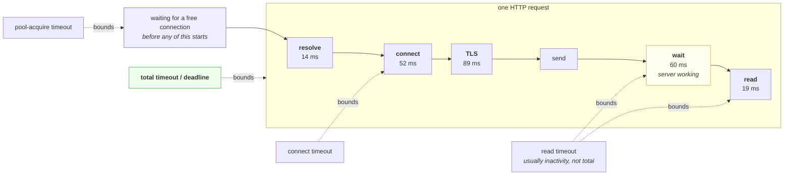

# 4.2 — The four timeouts of one request

## One-line answer

One HTTP request is **four or five separate waits in sequence** — resolve, connect, secure, wait for an
answer, read it — each of which can hang independently, so a single number called "timeout" always leaves
some of them unbounded.

---

## The story

🎬 **The scene.** Somebody has ninety minutes between finishing work and a train, and needs to collect a
prescription, buy a birthday card and get to the station.

😬 **The naive fix.** They give themselves ninety minutes for "the errands" and set off.

💥 **Why it fails.** The pharmacy queue is nine people deep. They stand in it for fifty minutes, because
they have a ninety-minute budget and are still inside it, and each individual moment of waiting seems
reasonable. **They never gave the pharmacy its own limit**, so by the time they get out there is no time
for the card and barely time for the train. If they had decided in advance that the pharmacy was worth
twenty minutes, they would have left the queue, bought the card, and come back tomorrow — one errand lost
instead of two and a train nearly missed.

💡 **The insight.** A budget for the whole is not a budget for the parts. **Without per-step limits, the
first slow step consumes everything**, and it does so while every individual decision looks defensible —
you cannot notice you have overspent when the only number you are tracking is the total.

---

## The idea in plain language

Part [4.1](4.1-a-timeout-is-a-decision-not-a-safety-net.md) argued that a timeout is a decision. This part
is about *which* decision, because a request is not one wait.

### The phases, in order

**Resolve.** Turn the name into addresses. Section
[02](../02-names/2.1-what-resolving-a-name-actually-does.md) — can be slow, can hang, and is frequently
bounded by nothing at all.

**Connect.** The three-way handshake from part
[3.1](../03-the-connection/3.1-the-handshake-and-what-connect-waits-for.md). Costs one round trip when
healthy, and hangs indefinitely when a packet is dropped.

**Secure.** For HTTPS, the TLS handshake — more round trips, plus certificate validation which may itself
make a network call. Day 8's subject.

**Send.** Write the request. Rarely slow for a small request, and genuinely slow for a large upload against
a receiver that has stopped reading.

**Wait.** The gap between the last byte sent and the first byte received — the server thinking. **This is
where a wedged application hangs**, and it is the phase most single-number timeouts fail to cover.

**Read.** Receive the rest of the body. A server that sends one byte every so often can keep this phase
alive indefinitely without ever being idle long enough to trip an inactivity timeout.

### The timeouts that map onto them

**Connect timeout** — bounds the connect phase, sometimes resolve too, usually not.

**Read timeout** — usually bounds *inactivity*: the longest gap between bytes, not the total duration.
**This distinction matters** and it is the subject of the drip-feed failure below.

**Write timeout** — the same for sending.

**Total timeout**, sometimes called a deadline — bounds the whole operation regardless of phase. **This is
the one that is always correct to have and is most often absent.**

**And the fifth, which is not a network wait at all:** the time spent waiting to be handed a connection
from a pool. If the pool is exhausted because every connection is stuck in some other request's `Wait`
phase, this is where your request sits — and it sits there before any of the other four timeouts apply,
because nothing has started yet. Section
[05](../05-when-it-adds-up/5.1-hanging-pulse-on-purpose.md) is where that becomes an outage.

---

## Why Kriya needs it

Day 8 adds TLS, which inserts a whole phase between connect and send — one that can fail for reasons
neither side controls, such as a certificate that expired on a Sunday.

Day 9 calls a model provider whose *Wait* phase is genuinely long, because generating text takes time. **A
model call is the one dependency in this system where a slow response is normal**, which makes choosing
these numbers harder rather than easier, and makes the distinction between "slow" and "stuck" essential.

Day 65 builds latency histograms. A histogram of total duration hides which phase moved; the phase
breakdown is what turns "we got slower" into a sentence with a subject.

Day 71's traces put spans around these phases, and the spans are only useful if you know what the phases
are.

Day 84's incident lab includes a dependency that is slow in exactly one phase, and the diagnosis is the
breakdown below.

---

## The mechanism

`curl` will report every phase of a real request, which makes it the cheapest instrument in this section.

```bash
curl -sS -o /dev/null -w 'dns=%{time_namelookup}s connect=%{time_connect}s tls=%{time_appconnect}s ttfb=%{time_starttransfer}s total=%{time_total}s code=%{http_code} ip=%{remote_ip}\n' https://pypi.org/
```

**Line by line:**

- `-w` prints a template after the transfer, and each `%{...}` is a variable curl fills in. This is the
  single most useful `curl` flag for an operator and almost nobody knows it.
- **The five time variables are cumulative, not durations.** Every one is measured from the start of the
  request, so `time_connect` includes the DNS lookup and `time_total` includes everything.
  **You get the phase durations by subtracting adjacent values**, which is the step people miss when they
  read these numbers for the first time.
- `time_appconnect` is the TLS handshake's completion point. On a plain HTTP request it is `0.000000`,
  which is a useful sanity check that you are measuring what you think you are.
- `time_starttransfer` is **time to first byte** — the moment the server's answer begins arriving. The gap
  between it and `time_appconnect` is the server thinking.
- `%{remote_ip}` names which of the eight addresses from part
  [2.1](../02-names/2.1-what-resolving-a-name-actually-does.md) actually got used, which matters when only
  some of them work.
- `-o /dev/null` discards the body so the output is the measurement and nothing else.

Observed on **2026-08-26**:

```text
dns=0.013818s connect=0.065663s tls=0.154605s ttfb=0.214354s total=0.233288s code=200 ip=2a04:4e42:400::223
```

**Subtract to get the phases**, which is where the story is:

| Phase | Arithmetic | Duration | What it is |
| --- | --- | --- | --- |
| Resolve | `0.013818` | **14 ms** | the name lookup — section [02](../02-names/2.1-what-resolving-a-name-actually-does.md) |
| Connect | `0.065663 − 0.013818` | **52 ms** | one round trip — part [3.1](../03-the-connection/3.1-the-handshake-and-what-connect-waits-for.md) |
| TLS | `0.154605 − 0.065663` | **89 ms** | the secure handshake — Day 8 |
| Wait | `0.214354 − 0.154605` | **60 ms** | the server actually working |
| Read | `0.233288 − 0.214354` | **19 ms** | receiving the body |

**Look at what dominates. The server's own work is sixty milliseconds out of two hundred and thirty-three
— about a quarter.** Three-quarters of this request was spent getting to the point where the server could
begin, and every bit of that is invisible to the server's own metrics, which start when the request
arrives.

**That table is the argument for connection pooling in one image.** Resolve, connect and TLS total 155 ms
and are paid **once per connection**. On a reused connection this same request costs about 79 ms. The
difference is not an optimisation, it is three-quarters of the latency.

### What each timeout would actually have bounded

```bash
curl -sS -o /dev/null --connect-timeout 3 --max-time 8 -w 'connect=%{time_connect}s total=%{time_total}s\n' http://127.0.0.1:8097/ ; echo "exit=$?"
```

**Line by line:**

- `--connect-timeout 3` bounds the connection phase. The curl manual, checked on **2026-08-26**, says it
  *"only limits the connection phase, so if curl connects within the given period it continues"* — read the
  word **only**, because it is the whole point of the experiment.
- `--max-time 8` bounds the entire operation, and is the flag whose absence causes the failure below.
- `127.0.0.1:8097` is the deliberately unresponsive server from part
  [5.1](../05-when-it-adds-up/5.1-hanging-pulse-on-purpose.md): it accepts, reads the request, and then
  never replies. **It hangs in the `Wait` phase**, which is the phase a wedged application hangs in.
- Printing `connect` alongside `total` is what makes the result legible — one number shows the phase that
  was bounded and the other shows the phase that was not.

Observed on **2026-08-26**:

```text
curl: (28) Operation timed out after 8004 milliseconds with 0 bytes received
connect=0.002481s total=8.004620s
exit=28
```

**The connect timeout was satisfied and it bounded nothing.** The connection completed in two and a half
milliseconds, well inside its three-second budget, and then the request sat in the `Wait` phase until
`--max-time` cut it at eight seconds. **`with 0 bytes received` is the phrase that names the phase** — the
server never began answering.

Remove `--max-time` and this command **never returns**. That is not an exaggeration or a long wait; it is
the default behaviour of a request whose only bound is on connection setup.



**The green box is the one to insist on.** Every other bound covers a phase; only the deadline covers the
request. **The yellow box is where things actually hang**, and the blue box is the wait that happens before
any timeout in your client configuration is even consulted.

---

## When it breaks

**A generous read timeout defeated by a drip.** The one that surprises people who did everything right.

```text
$ curl -sS -o /dev/null --max-time 30 http://slow-drip.internal/report
curl: (28) Operation timed out after 30001 milliseconds with 4096 bytes received
```

**What it says:** thirty seconds, four kilobytes.

**What it actually means:** the server is sending a small amount of data at intervals shorter than the
inactivity timeout. **A read timeout of ten seconds is never tripped by a server that sends one byte every
nine.** The connection is never idle long enough, so an inactivity-based bound can be defeated
indefinitely by a sender that is slow rather than stuck.

**The smallest fix:** `--max-time`, or its equivalent — a bound on the operation rather than on the gaps
within it.

**Why it matters beyond the curiosity:** this is a deliberate attack technique as well as an accident. A
client that trickles a request body holds a server's worker for as long as it likes while consuming almost
no bandwidth, and servers defend against it with exactly this kind of total limit. **An inactivity timeout
is not a duration limit**, and the two are constantly confused.

**A timeout that does not cover DNS.** The unbounded phase at the front.

```text
$ curl -sS -o /dev/null --connect-timeout 2 --max-time 5 https://slow-resolver.example/ ; echo "exit=$?"
curl: (28) Operation timed out after 5002 milliseconds with 0 bytes received
exit=28
# ... and in a client library where the timeout only covers connect and read:
# the same call takes 20 s, spent entirely in getaddrinfo
```

**What it says:** curl behaved; a library did not.

**What it actually means:** `--max-time` covers everything including resolution, so curl is fine. **Many
client libraries do not**, because resolution happens inside a system call the library does not control,
and their `timeout=` parameter covers only the socket operations. The resolver's own timeout — which you
did not set and probably cannot see — governs instead.

**The smallest fix:** where the library supports a total deadline, use it. Where it does not, bound the
whole call from outside, with whatever cancellation the runtime offers.

**The distinction worth holding:** ⚠️ **"the timeout covers the request" is a claim to verify, not an
assumption.** Part [2.4](../02-names/2.4-when-a-name-fails-nxdomain-servfail-and-silence.md) measured DNS
taking ten seconds against a two-second setting; if that happens in front of a five-second request timeout,
the caller waits fifteen.

**One number for everything, set to the slowest thing.** The compromise that protects nothing.

```text
timeout = 60  # covers connect, read, everything
```

**What it says:** one setting, generously chosen.

**What it actually means:** sixty seconds is right for the one endpoint that streams a long report, and
catastrophically wrong for the health check that normally answers in five milliseconds. **A connection that
should have been abandoned in a second is held for a minute**, and the capacity arithmetic from part
[4.1](4.1-a-timeout-is-a-decision-not-a-safety-net.md) gets sixty times worse.

**The smallest fix:** different deadlines for different calls. A per-client default is fine; a per-call
override for the outliers is the part that is missing.

**Why the single number is so tempting:** it is one line of configuration and it makes the errors stop.
**It makes the errors stop by waiting longer**, which is the same non-fix as raising the backlog in part
[3.2](../03-the-connection/3.2-the-accept-queue-and-the-backlog.md).

**The pool-acquire wait that no timeout covered.** The fifth phase, unbounded.

```text
# p99 latency: 30 s. Dependency's own p99: 40 ms.
# Traces show 29.9 s in a span called "acquire connection"
```

**What it says:** the time is spent before the request starts.

**What it actually means:** the pool is exhausted. Every connection is held by some other request stuck in
its `Wait` phase, and new requests queue for one. **None of the network timeouts apply**, because no
network operation has begun. The request has not resolved, connected or sent anything; it is standing in a
queue inside your own process.

**The smallest fix:** a pool-acquire timeout, so a request that cannot get a connection fails quickly
instead of waiting — and then the real fix, which is bounding the `Wait` phase so connections come back.

**Why it belongs in this part rather than in section 05:** because it is the phase people do not know
exists, and a diagram of "the timeouts of a request" that omits it explains why every one of your timeouts
can be set correctly while requests still take thirty seconds.

---

## In production

**What a professional writes instead of the teaching version.** They set a **total deadline** on every
outbound call, and treat the phase timeouts as refinements on top of it rather than as substitutes for it.
They also record the phase breakdown continuously rather than reaching for `curl` during an incident:
client-side spans or histograms for resolve, connect, TLS, wait and read, so that "the dependency got
slower" can be answered with *which part of it*. That single split is what lets you tell a network problem
from a dependency problem without asking anybody.

**What degrades at scale.** The phases stop being independent. Under load, the `Wait` phase lengthens
first; longer waits hold connections; held connections exhaust the pool; an exhausted pool adds
pool-acquire time to every request including the ones that would have been fast. **A small increase in one
phase becomes a large increase in total latency through a feedback loop**, and the graph of total duration
gives no hint that this is what happened. The phase breakdown does, immediately: `Wait` up slightly and
`acquire` up enormously is a completely different story from both going up together.

**The failure that only shows with real traffic.** The pool boundary. With low concurrency the pool is
never exhausted, so the fifth wait is always zero and every timeout you set appears to work perfectly.
**The behaviour changes discontinuously at the concurrency where the pool saturates**, and everything you
learned about the system below that point stops being true above it. This is why load tests that ramp
concurrency find things that load tests at a fixed rate never do.

**The review comment a senior engineer leaves.** *"We set a connect timeout and call it done. Connect is
the phase that basically never hangs — the far end either answers the handshake or the packet is dropped
and the OS gives up. The phase that hangs is the wait for a response, because that is where a wedged
application sits, and nothing here bounds it. Add a total deadline. While you are there, give the streaming
endpoint its own longer one rather than raising this for everybody."*

**The signal you would alert on.** **The phase breakdown as separate histograms** — resolve, connect, TLS,
wait, read, and pool-acquire — because each has a different owner and a different fix. You would alert on
**pool-acquire time above roughly zero**, since a healthy pool hands out a connection immediately and any
sustained queueing there means saturation is already happening. You would alert on **TLS handshake failures
specifically**, which is Day 8's expiring-certificate story and has no healthy baseline. You would **not**
alert on each phase's duration with its own threshold — that is five alerts that all fire together during
any real incident and teach the team to ignore the lot; alert on the total against the service level
objective, and use the phases to explain it. ⚠️ Beware the cardinality of a per-phase histogram multiplied
by a per-destination label, which is Day 63's subject and a genuine way to overwhelm a metrics system.

**Blast radius.** This part makes one HTTPS request to a public host that serves millions per day, and two
loopback requests to a server it does not start. Nothing is written and no state changes anywhere. **The
capability worth naming is the deadline that this part tells you to add**, because it is a change that
affects every caller simultaneously: a total timeout set below a legitimate slow endpoint's normal duration
converts a working feature into a reliable failure the moment it deploys. Worst case is exactly the
self-inflicted outage from part [4.1](4.1-a-timeout-is-a-decision-not-a-safety-net.md), and the fact that
it looks like a safety improvement is what gets it approved without measurement. What bounds it: derive
every deadline from that call's own observed distribution, give slow endpoints their own value rather than
raising everybody's, and roll the change out where you can watch its effect.

**Cost.** `0` model calls, `0` tokens, `0` CI minutes, `0` disk, negligible RAM. **Network: one HTTPS
request to a public host, a few kilobytes**, plus loopback traffic. About eight seconds of deliberate
waiting.

**The interview question.** *"Your client has a five-second timeout and you are seeing requests take thirty
seconds. How is that possible?"* The answer that lands enumerates the gaps: *"Because 'timeout' usually
names one phase rather than the operation. A request is a sequence of waits — resolving the name,
connecting, the TLS handshake, sending, waiting for the first byte, reading the body — and a client's
`timeout` parameter often covers only connect, or only socket inactivity. So three things can produce
thirty seconds against a five-second setting. One, the phase that hangs is not the phase that is bounded —
a connect timeout does nothing about a server that accepts and never replies. Two, a read timeout is
usually an inactivity limit rather than a duration limit, so a server sending a trickle of bytes resets it
indefinitely. Three, and this is the one people miss, the time may be spent before any network operation
starts, queueing for a connection from an exhausted pool, where none of the network timeouts apply at all.
The fix is a total deadline covering the whole operation, plus a pool-acquire timeout, and the diagnosis is
to break the measurement into phases — `curl --write-out` does it for one request and client-side
histograms do it continuously."*

---

## Check yourself

```bash
curl -sS -o /dev/null -w 'dns=%{time_namelookup}s connect=%{time_connect}s tls=%{time_appconnect}s ttfb=%{time_starttransfer}s total=%{time_total}s\n' https://pypi.org/
```

Five cumulative numbers. **Subtract them into phases and write the five durations into
`docs/PACKAGES.md`** — because that breakdown is the baseline you will choose Day 9's model-call timeouts
against, and because the ratio between setup and work is the number that justifies every connection pool
you will ever configure.

**Say out loud, without scrolling up:** *name the phases of one HTTP request in order, say which phase a
connect timeout bounds and which phase a wedged server hangs in, and name the wait that happens before any
of your network timeouts apply.*
