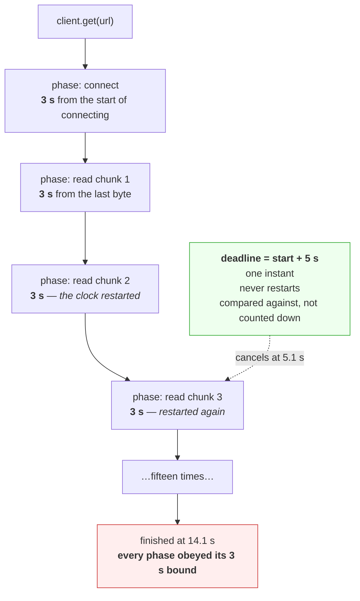

# 4.3 — The deadline that bounds the whole call

## One-line answer

A timeout is a **duration** that each phase gets to itself and that restarts every time something makes
progress; a deadline is a **point in time** that the whole operation must finish before — and only the
second one is a promise you can make to a caller.

---

## The story

🎬 **The scene.** Someone has a flight at six forty in the evening.

They give themselves rules for the journey. Pack in under twenty. Shower in under fifteen. Taxi ride under
thirty. Every rule is obeyed exactly. The bags are packed, they are clean, the taxi is quick.

They arrive at the gate at seven twenty and the aircraft has gone.

😬 **The naive fix.** Tighten the rules. Pack in ten instead of twenty.

💥 **Why it fails.** Every individual rule was already being kept. The rules were about **how long each
step took**, and the aeroplane cared about **what time it was**. Those are different kinds of statement,
and no amount of tightening the first kind produces the second. Notice what actually went wrong: they
never once looked at a clock. They looked at a stopwatch, reset it at every step, and each reading was
reassuring.

💡 **The insight.** *"Each step must be quick"* and *"the whole thing must be done by six forty"* are not
the same promise, and only one of them is the one anybody wants. **A duration you restart is not a bound
on anything.** The moment you write down an actual time on an actual clock, every step downstream
inherits it and nobody has to add anything up.

---

## The idea in plain language

Two words that get used interchangeably and should not be.

**A timeout is a duration.** *"Wait no more than three seconds."* Three seconds from when? From the start
of whatever operation it is attached to — and if the operation has phases, from the start of each phase.
That is what [4.2](4.2-the-four-timeouts-of-one-http-call.md) showed: `httpx2`'s read timeout is *"the
maximum duration to wait for a chunk of data to be received"*, so every chunk that arrives resets the
clock and a three-second timeout permitted a fifteen-second request.

**A deadline is an instant.** *"Be finished by 14:32:07.500."* Not a length — a point. It does not restart,
because there is nothing to restart; it is a fact about the world that every piece of code can compare
itself against.

The gRPC documentation draws exactly this line, verified against `grpc.io/docs/guides/deadlines/` on
**2026-08-24**:

```text
When an API asks for a deadline, you provide a point in time which the call should not go past.
A timeout is the max duration of time that the call can take.
```

**Term, on first use: *instant* versus *duration*.** An instant is a reading on a clock — "twenty past
two". A duration is a length — "ten seconds". You can add a duration to an instant and get another
instant. You cannot meaningfully compare two durations that were measured from different starting points,
which is the whole problem: four phase timeouts are four durations measured from four different starts.

### Why this is not pedantry

Three things follow from the difference, and each of them is a production incident somebody has had.

**A deadline composes and a timeout does not.** If your caller gives you a deadline of 14:32:07 and you
call an upstream, you hand the upstream *the same instant*. It needs no arithmetic and no trust. Hand it
a duration instead and each hop starts its own clock from scratch, so a chain of four services each
"bounded by five seconds" is bounded by twenty. That is
[5.1](../05-the-two-together/5.1-the-timeout-budget-down-the-request-path.md).

**A deadline survives a retry and a timeout does not.** Retrying an operation with a three-second timeout
gives you another three seconds. Retrying it against a deadline gives you whatever is left, which is the
only sane behaviour and which is [5.2](../05-the-two-together/5.2-retries-that-turn-a-blip-into-an-outage.md).

**A deadline is the thing an SLO is written in.** *"99% of requests complete within 300 ms"* is a
statement about instants. There is no way to derive it from a set of per-phase durations, because as
[4.2](4.2-the-four-timeouts-of-one-http-call.md) proved, the phases do not add up to the total.

### The awkward part

Almost no client library gives you one.

`httpx2` has four timeouts and no total. `requests` has a connect and a read and no total. Most database
drivers have a connect and a statement timeout and no total. **You have to build the deadline yourself,
on top of the phase timeouts, and the phase timeouts remain necessary** — they are what stops a single
phase from consuming the entire budget before the others get a turn.

So the production shape is *both*: phase timeouts so no single phase hogs the budget, and one deadline so
the total is a promise.

---

## Why Kriya needs it

Day 73 writes the first SLO for `pulse` — a statement of the form *"this fraction of requests finish
within this long"*. That is a deadline claim, and
[4.2](4.2-the-four-timeouts-of-one-http-call.md) established that no combination of phase timeouts
produces one, so an SLO written over an unbounded operation is unmeasurable as well as unmet.

Day 126 calls a local model, and generation is **streamed** — the exact shape from
[4.2](4.2-the-four-timeouts-of-one-http-call.md) where an inactivity timeout never fires. A model that
emits one token at a time slowly is a well-behaved peer that will hold your worker for as long as it feels
like unless there is a deadline over the whole generation.

Day 147 evaluates models in bulk, where one unbounded generation stalls an entire evaluation run.

Day 179's agents take steps whose count is not known in advance. **An agent is a loop with no natural
end**, so the only thing that bounds it is a deadline it checks between steps — and that is the same
mechanism as this part, applied to a sequence rather than to one call.

---

## The mechanism

Start with the failure from the end of [4.2](4.2-the-four-timeouts-of-one-http-call.md), then bound it.

`dribble.py` from [4.2](4.2-the-four-timeouts-of-one-http-call.md) is the tool: a server that sends one
byte at a time, forever, and is never idle long enough to trip a read timeout.

### First, the name of the library

```bash
uv run python -c "import httpx2; print(httpx2.__version__)"
```

**Line by line:**

- **`import httpx2`, not `import httpx`.** Day 3 installed the distribution `httpx2`
  ([Day 3](../../../day-003-pulse-v0/LESSON.md), §3), and it imports under its own name. A plain
  `import httpx` in an environment that has only `httpx2` raises `ModuleNotFoundError: No module named
  'httpx'` — the distribution name and the module name happen to agree here, and it is the module name
  that `import` cares about.
- `__version__` rather than a guess — Principle 7. **Check what your own repository resolved**, because
  the number below is what mine resolved on one day.

Observed on **2026-08-24**:

```text
2.12.0
```

### The two bounds, side by side

```python
# days/day-007-networking-for-operators/lab/deadline.py
"""One request, two bounds: four phase timeouts, and a single deadline over the whole call."""

import asyncio
import sys
import time

import httpx2

URL = sys.argv[1] if len(sys.argv) > 1 else "http://127.0.0.1:8009/"
BUDGET = float(sys.argv[2]) if len(sys.argv) > 2 else 5.0


async def phases_only(url: str) -> None:
    start = time.monotonic()
    async with httpx2.AsyncClient(timeout=httpx2.Timeout(3.0)) as client:
        try:
            r = await client.get(url)
            print(
                f"phase timeouts only  OK   {len(r.content)}B after {time.monotonic() - start:5.1f}s"
            )
        except httpx2.HTTPError as exc:
            print(
                f"phase timeouts only  {type(exc).__name__} after {time.monotonic() - start:5.1f}s"
            )


async def with_deadline(url: str, budget: float) -> None:
    start = time.monotonic()
    async with httpx2.AsyncClient(timeout=httpx2.Timeout(3.0)) as client:
        try:
            async with asyncio.timeout(budget):
                r = await client.get(url)
            print(
                f"deadline {budget}s        OK   {len(r.content)}B after {time.monotonic() - start:5.1f}s"
            )
        except TimeoutError:
            print(
                f"deadline {budget}s        TimeoutError     after {time.monotonic() - start:5.1f}s"
            )
        except httpx2.HTTPError as exc:
            print(
                f"deadline {budget}s        {type(exc).__name__} after {time.monotonic() - start:5.1f}s"
            )


async def main() -> None:
    which = sys.argv[3] if len(sys.argv) > 3 else "phases"
    if which == "phases":
        await phases_only(URL)
    else:
        await with_deadline(URL, BUDGET)


asyncio.run(main())
```

**Line by line:**

- `httpx2.Timeout(3.0)` in **both** functions — the phase timeouts are identical. **The only difference
  between the two runs is the deadline**, which is what makes this a controlled comparison rather than
  two anecdotes.
- `asyncio.timeout(budget)` — **the deadline.** It is an async context manager: on entry it schedules a
  cancellation at `now + budget`, and when that moment arrives it cancels whatever is running inside the
  block. Verified against `docs.python.org/3.12/library/asyncio-task.html#asyncio.timeout` on
  **2026-08-24**. It is available from Python 3.11; this repository is on 3.12
  (`docs/PACKAGES.md`, Day 0).
- **`AsyncClient`, not `Client`.** This is the constraint that matters and it is easy to miss:
  `asyncio.timeout` cancels a *task*, and cancellation only takes effect at an `await`. A synchronous
  `httpx2.Client` blocking inside `recv` never reaches one, so the deadline could not interrupt it —
  which is the first entry under **When it breaks** below.
- `except TimeoutError` — since Python 3.11 `asyncio.TimeoutError` is an alias of the builtin
  `TimeoutError`, so this one name catches it. Note it is a *different* exception from
  `httpx2.TimeoutException`: one came from your deadline, the other from a phase, and telling them apart
  in a log is how you know which bound fired.
- `except httpx2.HTTPError` **after** it — the specific before the general, the same ordering rule as
  [4.2](4.2-the-four-timeouts-of-one-http-call.md).
- **One attempt per invocation, selected by `sys.argv[3]`.** It is tempting to run both from one process,
  and it silently does not work: `dribble.py` accepts **one** connection and then exits
  ([4.2](4.2-the-four-timeouts-of-one-http-call.md)), so the second attempt would meet a closed port and
  report a `ReadError` after a second — a plausible-looking result that measures nothing about deadlines.
  **Each attempt gets its own server**, which is why the commands below start `dribble.py` twice.
- `time.monotonic()` for every measurement — a clock that cannot go backwards
  ([Day 6, part 2.1](../../../day-006-resources-and-the-oom-killer/parts/02-cpu/2.1-a-core-is-a-queue-not-a-speed.md)).
  **A deadline computed from wall-clock time is wrong the moment NTP steps the clock**; more on that
  under **When it breaks**.

Run it against a server that will take fifteen seconds to answer, one byte at a time:

```bash
cd days/day-007-networking-for-operators
uv run python lab/dribble.py 8009 1 15 & DRIB=$!
sleep 2
uv run python lab/deadline.py http://127.0.0.1:8009/ 5 phases
kill "$DRIB" 2>/dev/null; wait "$DRIB" 2>/dev/null

uv run python lab/dribble.py 8009 1 15 & DRIB=$!
sleep 2
uv run python lab/deadline.py http://127.0.0.1:8009/ 5 deadline
kill "$DRIB" 2>/dev/null; wait "$DRIB" 2>/dev/null
```

**Line by line:**

- `dribble.py 8009 1 15` — port 8009, one byte per second, fifteen bytes, so a request that takes about
  fifteen seconds while never pausing for more than one.
- **Started twice, once per attempt**, for the reason in the walkthrough above. Both attempts therefore
  face an identical server in an identical state; the second one simply also knows what time it is.
- The `kill` and `wait` between them — **the port must actually be released before the second `bind`**
  ([1.4](../01-addresses-and-ports/1.4-the-port-that-was-already-in-use.md)), and `dribble.py` sets
  `SO_REUSEADDR` so a lingering `TIME_WAIT` does not block it
  ([3.3](../03-tcp/3.3-time-wait-and-the-ports-you-ran-out-of.md)).

Observed on **2026-08-24**:

```text
phase timeouts only  OK   15B after  14.1s
deadline 5.0s        TimeoutError     after   5.1s
```

**Read those two lines as a pair.** The first is a request that succeeded, took just over fourteen
seconds, and was "protected by a three-second timeout" the entire time. The second is the same request
against the same server with the same three-second phase timeouts, stopped at five seconds because five
seconds was the promise.

| | phase timeouts only | phase timeouts + deadline |
| --- | --- | --- |
| connect bound | 3 s | 3 s |
| read bound | 3 s | 3 s |
| **total bound** | **none** | **5 s** |
| what happened | succeeded at 14.1 s | stopped at 5.1 s |
| what you can promise a caller | **nothing** | *"five seconds or an error"* |

**The last row is the part worth keeping.** The first column is not a weaker promise than the second; it
is not a promise at all.



### The deadline as an instant you can hand onwards

The version above is still a duration in disguise — `asyncio.timeout(5.0)` means "five seconds from now".
The form that composes is the absolute one:

```python
import asyncio
import time

deadline = time.monotonic() + 5.0  # an instant, decided once

async with asyncio.timeout_at(deadline):  # everything inside must finish before it
    a = await call_upstream_one()
    b = await call_upstream_two()
```

**Line by line:**

- `deadline = time.monotonic() + 5.0` — **computed once, at the top of the request.** Every later
  comparison is against this one number, so nothing accumulates and nothing restarts.
- `asyncio.timeout_at(deadline)` rather than `asyncio.timeout(5.0)` — takes an **absolute** value on the
  event loop's clock. Verified against `docs.python.org/3.12/library/asyncio-task.html#asyncio.timeout_at`
  on **2026-08-24**.
- **Two awaits inside one block.** This is the whole point: the bound is over *the request*, not over
  each call. If `call_upstream_one` takes four and a half seconds, `call_upstream_two` gets half a second
  and not a fresh five. Under phase timeouts it would get a fresh five, and the request would take nine
  and a half.
- `time.monotonic()` and the loop clock — `asyncio`'s default event loop clock is `time.monotonic`, which
  is why these two agree. **Do not pass a `time.time()` value here**; see **When it breaks**.

---

## When it breaks

**The deadline that could not interrupt anything.** A synchronous client inside a wrapper:

```text
caller gave up after 5.0s (future.result timed out)
but the worker thread is still alive: 1 extra thread(s)
waiting to see when it actually finishes...
the request finally completed at 19.2s with 20 bytes
```

**What it says:** the caller was bounded at five seconds.
**What it actually means:** **only the caller was.** That output is from a `concurrent.futures` thread
pool running a synchronous `httpx2.get`, with `future.result(timeout=5)`. `result()` gives up waiting and
raises — but there is no mechanism in Python to interrupt a thread blocked in `recv`, so the worker
carried on and finished the request at **19.2 seconds**, fourteen seconds after anybody cared.
**The smallest fix:** put the deadline where the I/O is, not around it — an async client with
`asyncio.timeout_at`, or the client's own configuration.
**Why this matters more than it looks:** the thread is *held* for those fourteen seconds. Wrap enough
calls like this and you have the exhaustion from
[4.1](4.1-a-timeout-is-a-decision-not-a-safety-net.md) with a timeout apparently configured, which is the
worst of both — the symptom of no bound and the confidence of one.

**`signal.alarm`, the fix that is not portable.** The other classic wrapper:

```text
$ uv run python -c "import signal; print('has SIGALRM:', hasattr(signal,'SIGALRM'))"
has SIGALRM: False
```

**What it says:** this platform has no `SIGALRM`.
**What it actually means:** the `signal.alarm` deadline pattern **does not exist on Windows at all**
(`docs.python.org/3.12/library/signal.html` notes the availability restriction), and where it does exist
it only works on the main thread of the main interpreter — so it is unusable inside a web server, which
is exactly where you wanted it. **This is the fifth environmental gap this week**
([Day 6, part 4.4](../../../day-006-resources-and-the-oom-killer/parts/04-the-oom-killer/4.4-pressure-the-signal-that-warns-you-first.md)),
and unlike the others it does not close under WSL2 on Day 21 — the main-thread restriction is in the
design, not in the platform.
**The smallest fix:** there is no fix; it is the wrong tool. Use the client's own timeouts and an async
deadline.

**The deadline that moved.** Wall-clock arithmetic:

```python
deadline = time.time() + 5.0
```

**What it says:** five seconds from now.
**What it actually means:** five seconds from now *unless the clock changes*. `time.time()` is the wall
clock, and NTP can step it forwards or backwards. A backwards step of thirty seconds turns your
five-second deadline into a thirty-five-second one; a forwards step makes it fire immediately, and every
request in flight fails at once with no upstream fault at all.
**The smallest fix:** `time.monotonic()` for anything you are measuring, exactly as on
[Day 6](../../../day-006-resources-and-the-oom-killer/parts/02-cpu/2.1-a-core-is-a-queue-not-a-speed.md).
**The one exception:** when the deadline crosses a process boundary — sent in a header to another machine
— it *has* to be wall-clock, because two machines share no monotonic clock. That is
[5.1](../05-the-two-together/5.1-the-timeout-budget-down-the-request-path.md)'s problem and it is why
gRPC transmits a *remaining duration* rather than an instant.

**The deadline that was never checked.** Silence:

```text
# request deadline: 500ms
# handler: 5 sequential upstream calls, each with a 400ms phase timeout
# observed p99: 2.1s
```

**What it says:** a deadline exists and is being exceeded fourfold.
**What it actually means:** **a deadline is not enforcement.** Storing it on a request object does
nothing; something has to compare against it. Five calls at 400 ms each are individually inside their
phase bounds and collectively four times the promise, and nothing raised, because nothing looked.
**The smallest fix:** derive each call's timeout from the remaining budget rather than configuring it
independently — `min(configured, deadline - now)`.
**The tell:** a p99 that is a small multiple of your deadline rather than a random number. **Multiples
mean phases; noise means one slow thing.**

---

## In production

**What a professional writes instead of the teaching version.** The deadline is established once, at the
edge — the moment the request arrives — and stored on whatever context object travels with the request.
Every outbound call derives its timeout from `remaining = deadline - now` rather than from a constant, so
the numbers in the configuration are *ceilings* and the budget is what actually binds. The phase timeouts
stay: they stop one phase eating the whole budget before the others start. **What disappears is the idea
that a number in a config file is a promise.**

**What degrades at scale.** Streaming. Everything in this part gets sharper the moment responses arrive
in chunks, because that is precisely the shape an inactivity timeout cannot bound — and streaming is the
normal case for the two most expensive things this curriculum will do, model generation on Day 126 and
bulk evaluation on Day 147. **A slow token stream is indistinguishable from a healthy one to every phase
timeout you own.** At one request it is a curiosity; at a thousand concurrent it is your entire worker
pool held by peers that are all behaving correctly.

**The failure that only shows with real traffic.** The dependency that got slower rather than broken. A
dependency that dies trips connect timeouts immediately and is obvious. A dependency that degrades — p50
unchanged, p99 from 200 ms to 4 s — trips nothing at all, because every phase is still active and every
phase timeout is generous. **You find out from your own callers**, which is the worst possible detector,
and the reason the deadline has to exist before the degradation does.

**The review comment a senior engineer leaves.** *"This handler makes four upstream calls, each with a
two-second timeout, and the endpoint's documented latency budget is three seconds. Those two facts cannot
both be true. Set the deadline once when the request arrives and pass the remaining budget into each
call — otherwise the configured numbers are describing a request that takes eight seconds and we have
just written down that it takes three."*

**The signal you would alert on.** **The ratio of elapsed time to remaining budget at the moment each
request finishes** — sometimes called budget utilisation. If requests routinely complete at ninety
percent of their deadline, you are one upstream hiccup away from mass timeouts, and no other signal shows
that: latency looks fine, the error rate is zero, and the deadline has not fired yet. Also **deadline
exceedances as a separate error class from phase timeouts**, because they mean different things — a phase
timeout says one upstream is slow, a deadline exceedance says the *composition* is too slow, and the
second is usually your own design rather than somebody else's outage. What you would **not** alert on is
the count of `TimeoutError`s alone, because it cannot distinguish those two cases and they have different
owners.

**Blast radius.** The capability this part adds is cancellation: code that stops other code mid-operation.
Worst case on this machine, `asyncio.timeout_at` cancels a task at an `await` point and the enclosing
`async with` closes the client, so a socket is released and nothing is left behind — bounded by the fact
that a single process is involved and the connection count is one. Who can trigger it: any request whose
budget runs out. **The bound worth naming explicitly is the one from
[4.1](4.1-a-timeout-is-a-decision-not-a-safety-net.md): cancelling your side does not cancel the
upstream's side.** The remote server keeps working, and if the operation was a write, it may complete
after you gave up. A deadline over a non-idempotent write leaves an unknown outcome, and
[5.2](../05-the-two-together/5.2-retries-that-turn-a-blip-into-an-outage.md) is where that gets handled.

**Cost.** `0` model calls, `0` tokens, `0` CI minutes, `0` network beyond localhost, `0` disk. RAM: two
short-lived Python processes, a few tens of megabytes, returned at exit. **Processor: effectively zero —
both runs are spent asleep**, which is the point of the whole section.

**The interview question.** *"What is the difference between a timeout and a deadline?"* The answer that
lands is concrete: *"A timeout is a duration attached to a phase and it restarts whenever the phase makes
progress. A deadline is a single instant that the whole operation has to finish before. It matters
because phase timeouts do not compose — a client with a three-second read timeout will happily let a
request run for fifteen seconds against a server sending one byte a second, because it is never inactive
for three. I have watched that happen: same server, same three-second phase timeouts, and the only
difference was an `asyncio.timeout` of five seconds around the call. Deadlines are also the only form
that survives crossing a service boundary or a retry — you hand the remaining budget onward instead of
each hop starting a fresh clock, so four services 'bounded by five seconds' aren't bounded by twenty. The
practical catch is that a deadline has to sit where the I/O is. Wrapping a blocking call in a thread and
timing out on the future bounds the caller and not the work — the thread carries on holding a worker
after everyone has stopped waiting."*

---

## Check yourself

```bash
cd days/day-007-networking-for-operators && for mode in phases deadline; do uv run python lab/dribble.py 8009 1 15 & D=$!; sleep 2; uv run python lab/deadline.py http://127.0.0.1:8009/ 5 "$mode"; kill "$D" 2>/dev/null; wait "$D" 2>/dev/null; done; netstat -ano | grep ':8009' | grep LISTENING || echo "8009 clean"
```

Two attempts, identical phase timeouts, one extra bound. **The first line is a fourteen-second request
that was never once in violation of any timeout it had.** Then raise the budget to `20` and run it again:
both lines succeed, and the deadline that fires is not the interesting one — **the interesting one is the
deadline that does not fire and still bounds you**, because it is the difference between a system whose
worst case you know and a system whose worst case you find out.

**Say out loud, without scrolling up:** *state the difference between a timeout and a deadline in one
sentence, then explain why wrapping a blocking call in a thread and timing out on the future does not
bound the work.*
