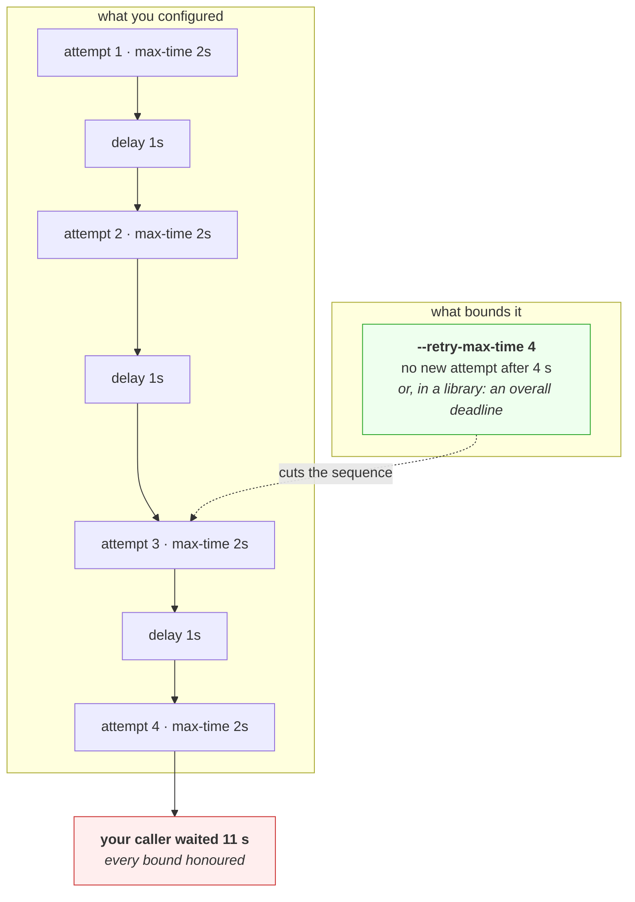

# 4.3 — The timeout that bounded nothing

## One-line answer

Today's third deliberate failure: set a two-second timeout, watch the operation take eleven seconds, and
discover that almost every timeout you configure bounds **one attempt** while your caller experiences
**attempts × addresses × layers** — a number nothing in the configuration mentions.

---

## The story

🎬 **The scene.** A family agrees a rule for the school run: if the bus has not come within ten minutes,
walk.

😬 **The naive fix.** They apply it faithfully. Ten minutes at the stop, no bus, so they walk to the next
stop along and start again — because a different bus goes from there, and the rule says ten minutes at a
stop.

💥 **Why it fails.** Three stops later they have spent half an hour standing at bus stops, obeying a
ten-minute rule the entire time, and they are further from school than when they started. **Every single
wait was inside the limit.** The rule bounded the wrong thing: it capped each wait and said nothing about
how many waits there could be, and nobody noticed because at no point was anybody breaking it.

💡 **The insight.** A limit on a repeated action is not a limit on the total. **If the rule does not say
"and no more than once", the rule has a multiplier in it that nobody wrote down** — and the person who set
the limit and the person who feels the delay are measuring completely different quantities.

---

## The idea in plain language

Part [4.2](4.2-the-four-timeouts-of-one-request.md) established that a timeout names a phase. This part is
about the second gap: even a correctly placed timeout usually bounds **one attempt**, and something above
it makes several attempts.

### The three multipliers

**Retries.** The obvious one, and often the largest. A client configured to retry three times with a
two-second timeout can take eight seconds plus the delays between attempts. **The retry count is usually
configured somewhere different from the timeout**, frequently by a different person, and neither
configuration mentions the other.

**Addresses.** Part [2.1](../02-names/2.1-what-resolving-a-name-actually-does.md) resolved one name to
eight addresses. A client that tries them in order, and gives each one the full connect timeout, can spend
eight times the configured value before reporting a single failure. **The name looked like one destination
and was eight.**

**Layers.** Your client retries; the library underneath it retries; the sidecar proxy retries; the load
balancer retries. Each layer honours its own timeout perfectly, and the multipliers compose. **Four layers
each retrying three times is eighty-one attempts** at the bottom of the stack for one request at the top,
which is section [5.2](../05-when-it-adds-up/5.2-retries-backoff-and-the-storm-you-caused.md)'s subject
from the load side and this part's from the latency side.

### Why the tools do not warn you

Because each layer is behaving correctly. The message `Connection timed out after 2016 milliseconds` is
true — that attempt took two seconds. **Nothing in the system has a name for the quantity you care about**,
which is the wall-clock time from your caller's point of view, and so nothing reports it. You have to
measure it from outside.

### The bound that actually bounds

Almost every retrying client has a second setting that limits the *whole sequence* rather than each
attempt: `--retry-max-time` in curl, a deadline or an overall budget in most libraries. **It is the setting
nobody sets**, and it is the one that makes the configured number mean what people think it means.

---

## Why Kriya needs it

Day 9's model provider is a free tier, which means HTTP 429 and retries are routine rather than
exceptional. **A retry policy is going into `pulse` on that day**, and its interaction with the timeout is
decided here.

Day 43's readiness probe has a timeout and a failure threshold, which is exactly a per-attempt bound and a
count — and the product of the two is how long a pod stays in rotation while broken.

Day 46's ingress and Day 50's service mesh both retry on your behalf, invisibly, and each adds a
multiplier to whatever your application already does.

Day 87 builds circuit breakers, which exist largely because retrying is so easy to configure and so hard to
bound.

Day 92's service level objectives are stated in wall-clock time from the user's side — **the one quantity
none of these settings measures**.

---

## The mechanism

**This is a deliberate failure.** Set a two-second timeout, ask for retries, and time the whole thing from
outside.

```bash
time curl -sS -o /dev/null --max-time 2 http://203.0.113.1/
```

**Line by line:**

- `--max-time 2` is the *strongest* timeout curl has — the whole-operation bound from part
  [4.2](4.2-the-four-timeouts-of-one-request.md), not the connect-phase one. **We are deliberately using
  the good flag**, so that what follows cannot be dismissed as having chosen the wrong setting.
- `203.0.113.1` is the RFC 5737 documentation address that is never routed, so the request goes nowhere and
  the failure is silence rather than a refusal — part
  [3.4](../03-the-connection/3.4-connection-refused-versus-connection-timed-out.md).
- `time` in front, because **the number that matters is not the one curl prints.** curl reports what curl
  did; `time` reports what your caller experienced, and this part exists because those differ.

Observed on **2026-08-26**:

```text
curl: (28) Connection timed out after 2013 milliseconds
real	0m2.126s
```

**The baseline behaves exactly as documented.** Two seconds configured, two point one seconds elapsed. The
extra hundred milliseconds is process startup. **This is a timeout working perfectly**, and it is the
control for the next command.

### Now add the thing everybody adds

```bash
time curl -sS -o /dev/null --max-time 2 --retry 3 --retry-delay 1 http://203.0.113.1/
```

**Line by line:**

- `--retry 3` is the flag people reach for when a dependency is flaky, and it is usually a good idea. **It
  is not being criticised here**; the point is what it does to the other number.
- `--retry-delay 1` puts a fixed second between attempts, which makes the arithmetic legible. Without it
  curl uses an increasing delay and the total is harder to attribute.
- **`--max-time` is unchanged at two seconds.** The only difference between this command and the previous
  one is the retry policy, so any difference in the total is caused by that alone.

Observed on **2026-08-26**:

```text
curl: (28) Connection timed out after 2016 milliseconds
curl: (28) Connection timed out after 2009 milliseconds

real	0m11.165s
```

**Eleven seconds, from a two-second timeout.** Read the two error lines: each attempt reports about two
thousand milliseconds, and each is telling the truth. **Every individual bound was honoured and the
operation took five and a half times the configured limit.**

**And notice that curl printed only two error lines for four attempts**, which is a small lesson of its
own: the output is not a reliable count of what happened, and the only trustworthy number in this
experiment is the one measured from outside by `time`.

**This is the same arithmetic already seen twice today.** Part
[2.4](../02-names/2.4-when-a-name-fails-nxdomain-servfail-and-silence.md) measured `nslookup -timeout=2`
taking ten seconds. **Three tools, three layers, one mistake**, and it is a mistake of vocabulary rather
than of engineering: the word *timeout* is used for two different quantities and only one of them is what
anybody means.

### The flag that fixes it

```bash
time curl -sS -o /dev/null --max-time 2 --retry 3 --retry-delay 1 --retry-max-time 4 http://203.0.113.1/
```

**Line by line:**

- `--retry-max-time 4` bounds the **whole retry sequence**. The local manual, checked on **2026-08-26**,
  describes it as *"Retry only within this period"* — so once four seconds have passed, no further attempt
  is started regardless of how many remain in the budget.
- **This is the setting that makes the other numbers mean something**, and it is the one missing from
  almost every configuration you will inherit.
- The value is chosen as roughly twice `--max-time`, which permits one retry and refuses the rest. **The
  right relationship is that the sequence bound is a small multiple of the attempt bound**, chosen
  deliberately rather than left to emerge from a multiplication.



**The multiplication is in the top row and there is no number in it that is eleven.** That is the whole
difficulty: the quantity that hurt you is not written down anywhere in the configuration, and can only be
obtained by multiplying settings that live in different places.

---

## When it breaks

**A probe whose real budget is a multiple of its timeout.** The one that keeps a broken pod in rotation.

```text
readinessProbe:
  timeoutSeconds: 5
  periodSeconds: 10
  failureThreshold: 3
```

**What it says:** a five-second timeout.

**What it actually means:** a pod that has stopped responding stays *Ready* for the period times the
threshold — around **thirty seconds** — because readiness requires three consecutive failures ten seconds
apart. Every request routed there in that window is lost. **The five is the least important number in the
block** and it is the only one most people read.

**The smallest fix:** choose the threshold and period against how long you are willing to send traffic to a
dead instance, and treat the product as the real setting.

**Why it is the same bug:** a per-attempt bound plus a count, presented as if the per-attempt bound were
the answer. Day 43 sets these properly.

**Eight addresses, one timeout, eight times the wait.** The multiplier hiding in a name.

```text
$ curl -sS -o /dev/null --connect-timeout 5 https://a-name-with-many-addresses.example/
# ... 40 seconds later
curl: (28) Connection timed out after 40011 milliseconds
```

**What it says:** forty seconds from a five-second setting.

**What it actually means:** the name resolved to eight addresses — part
[2.1](../02-names/2.1-what-resolving-a-name-actually-does.md) got exactly eight for `pypi.org` — and the
client tried each in turn, giving each the full five seconds. **The connect timeout is per address**, and
the number of addresses is decided by DNS, which is to say by somebody else, and can change without any
change to your configuration.

**The smallest fix:** a total deadline above the per-address bound, so the sequence is cut.

**The distinction worth holding:** ⚠️ **the multiplier is not always in your configuration.** Retries you
chose; the address count you did not. A timeout that is safe today can become eight times longer because a
dependency added redundancy, which is a change that improves their reliability and degrades yours.

**Layers of retries composing into a flood.** The multiplier nobody owns.

```text
# application: 3 attempts
# sidecar proxy: 3 attempts
# ingress: 3 attempts
# = 27 requests reaching the backend for one user request
```

**What it says:** three, three and three.

**What it actually means:** twenty-seven. Each layer was configured by somebody who reasonably chose three,
and **no layer can see the others**. During an incident, when the backend is already struggling, the
amplification is at its worst precisely when it can least be afforded.

**The smallest fix:** retry at **one** layer, deliberately chosen, and configure the others not to.

**Why this is the argument for a deadline rather than a retry count:** a deadline **composes correctly**.
If each layer passes down the remaining time rather than its own count, no layer can retry past the point
where the answer is still wanted, and the multiplication stops. That is part
[5.3](../05-when-it-adds-up/5.3-the-deadline-that-travels.md), and this failure is why it exists.

**A timeout defeated by the layer below it.** The unbounded phase, once more.

```text
$ time nslookup -timeout=2 -retry=1 example.com 203.0.113.53
    timeout was 2 seconds.
real	0m10.122s
```

**What it says:** the tool's own configured bound, and five times that in reality.

**What it actually means:** the same thing as the curl experiment, in the resolver. This was first measured
in part [2.4](../02-names/2.4-when-a-name-fails-nxdomain-servfail-and-silence.md), and it is repeated here
because the two together make the point that this is not a curl quirk: **it is the normal relationship
between a configured timeout and an observed duration**, across tools that share no code.

**The smallest fix:** measure the operation from outside whenever you set a timeout, and compare it with
what you configured. **The gap is the multiplier**, and it takes one `time` to find.

---

## In production

**What a professional writes instead of the teaching version.** They configure a **deadline for the
operation** and derive everything else from it, rather than configuring a per-attempt timeout and hoping.
Concretely: an overall budget, a per-attempt timeout comfortably inside it, and a retry policy that checks
the remaining budget before starting another attempt rather than counting attempts. They also **measure
from the caller's side** — the only place the multiplied number exists — and treat any gap between
configured and observed as a bug rather than as an interesting fact.

**What degrades at scale.** The multiplication turns a latency problem into a load problem. At low volume,
eleven seconds instead of two is an annoyance. At scale, each of those extra attempts is a **request
arriving at a dependency that is already failing**, which is why retry amplification is such a reliable way
to convert a partial outage into a total one. **The latency multiplier and the load multiplier are the same
number**, seen from the two ends, and section
[5.2](../05-when-it-adds-up/5.2-retries-backoff-and-the-storm-you-caused.md) takes the other view of it.

**The failure that only shows with real traffic.** The multipliers only compose when things are failing.
With a healthy dependency, no attempt is retried, no address after the first is tried, and every layer's
retry configuration is dead code that has never executed. **The whole multiplicative structure is invisible
until the day it all runs at once**, which is the day you least want to discover it. This is why deliberate
failure drills are the only way to know your real timeout — the configured one is a hypothesis.

**The review comment a senior engineer leaves.** *"We set a two-second timeout and a retry count of three,
in two different files, and nothing anywhere bounds the sequence. Our real worst case is over ten seconds,
which is longer than the deadline our own caller gives us, so those retries produce answers nobody is
waiting for while holding a connection each. Add an overall budget and check it before each attempt."*

**The signal you would alert on.** **Attempt count per logical request**, exported by the client, because
it is the direct measurement of the multiplier and it does not otherwise exist anywhere. Its healthy value
is very close to one, and any sustained rise means either a dependency is degrading or a retry policy is
firing more than intended. You would also alert on the **gap between the configured deadline and the
observed p99** — if requests routinely exceed the number you configured, some layer is multiplying it and
you want to know which. You would **not** alert on per-attempt timeouts alone, since that is the number
that is already honoured and it will look healthy throughout exactly the incident you are trying to catch.
⚠️ And when a proxy or a mesh is retrying on your behalf, **its** attempt count is a separate series you do
not own but must be able to see, because your application's metrics cannot observe it at all.

**Blast radius.** This part sends about six `SYN` packets to an unrouted documentation address and waits.
Nothing is written and nothing arrives anywhere. **The capability being demonstrated is retry
configuration, and it deserves a plain warning**: a retry policy is the easiest change in this entire
curriculum to make and one of the most dangerous, because its cost is zero while everything is healthy and
multiplicative exactly when it is not. Worst case is a client that turns one user request into dozens
against a dependency that is already failing, and that behaviour ships in a configuration file with no
code review attention because it is "just a number". Who can trigger it: anybody who edits that file, or
who enables retries at a proxy layer on behalf of every service at once. What bounds it: a bound on the
sequence rather than on the attempt, retrying at **one** layer only, and ⚠️ **never retrying a request that
is not safe to repeat** — a timeout does not tell you whether the work happened, so retrying a write can
duplicate it, which Day 88's idempotency work addresses.

**Cost.** `0` model calls, `0` tokens, `0` CI minutes, `0` disk, negligible RAM. **Network: a handful of
`SYN` packets to a reserved address, a few hundred bytes**, and about fifteen seconds of deliberate
waiting.

**The interview question.** *"You set a two-second timeout on a call and your users see eleven-second
requests. Nothing is misconfigured. What is happening?"* The answer that lands names the multiplier: *"The
timeout almost certainly bounds one attempt and something above it is making several. The three usual
multipliers are retries, addresses and layers. Retries are the obvious one — a two-second timeout with
three retries and a delay between them is eleven seconds, and every individual attempt honours the bound
perfectly, which is why nothing reports a violation. Addresses are the sneaky one: a connect timeout is
generally per address, and a name that resolves to eight of them multiplies it by eight without any change
on my side. And layers compose, because my client, the sidecar and the ingress may each be retrying
independently and none of them can see the others. The fix is to stop configuring per-attempt limits as if
they were operation limits: set an overall deadline, check the remaining budget before starting another
attempt, and retry at exactly one layer. The diagnostic is trivially cheap — put `time` in front of the
call and compare it with what you configured; the gap is the multiplier."*

---

## Check yourself

```bash
time curl -sS -o /dev/null --max-time 2 http://203.0.113.1/ ; time curl -sS -o /dev/null --max-time 2 --retry 3 --retry-delay 1 http://203.0.113.1/
```

The same timeout, twice, differing only in a retry policy. **The number to write into `docs/INCIDENTS.md`
is the ratio** — about two seconds against about eleven — because it is the gap between what you configured
and what your caller experienced, and finding that gap costs one word at the front of a command.

**Say out loud, without scrolling up:** *name the three things that multiply a per-attempt timeout, say
which of them is not in your own configuration, and give the setting that bounds the sequence rather than
the attempt.*
