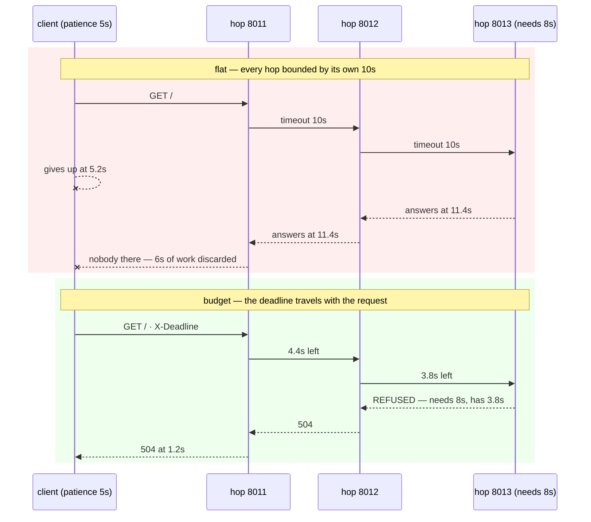

# 5.1 — The timeout budget down the request path

## One-line answer

When a request passes through several services, each one's timeout must be **smaller than what its caller
has left**, not a number chosen locally — otherwise every service downstream of the first one to give up
keeps working on an answer nobody is waiting for.

---

## The story

🎬 **The scene.** A customer at a paint shop asks whether a particular shade is in stock. The assistant
says *"give me two minutes"* and phones the warehouse. The warehouse says *"give me two minutes"* and
phones the depot. The depot says *"give me two minutes"* and goes to look on the shelves.

The customer waits ninety seconds, decides this is silly, and leaves.

At the four-minute mark the depot finds the tin and phones the warehouse. The warehouse phones the
assistant. The assistant turns round to tell the customer the good news and is looking at an empty shop.

😬 **The naive fix.** Everyone agrees to be faster. Two minutes becomes ninety seconds, everywhere.

💥 **Why it fails.** Nothing about the shape has changed. Three people each promising ninety seconds still
add up to four and a half minutes, and the customer still leaves first. And note who did the most useless
work: **the person furthest from the customer**, who had no idea anybody had left, walked the shelves for
the longest, and was the only one actually doing anything.

💡 **The insight.** The assistant knew something nobody downstream knew — **how long the customer would
actually stay**. That fact was never passed on. If the depot had been told *"there is no point after two
o'clock"*, it would not have walked the shelves at all. **The information that bounds the work exists at
the top and the work happens at the bottom, and unless somebody carries it down, everyone below the first
person to give up is working for nothing.**

---

## The idea in plain language

A request in a real system is rarely one hop. Your service calls another, which calls a database, which
calls a replica. **Term, on first use: the *request path* is the whole chain of calls that one incoming
request causes** — sometimes called the call graph, or the fan-out when one call becomes several.

Every service on that path has a timeout for its own outbound calls. The question this part answers is
where those numbers should come from.

### The wrong answer, which is also the usual one

Each team picks a number that seems reasonable for their own dependency. Ten seconds is a common choice
because it sounds cautious. Nobody is being careless; each number is defensible in isolation.

The result is that **the deepest service has the loosest bound and the most work to do**, and the user at
the top gave up before any of it mattered.

### The rule

**Each hop gets less than its caller has left.** Written out:

```text
budget(hop N) = budget(hop N-1) − time already spent at hop N-1 − a margin
```

Three consequences fall straight out of that line, and they are the whole part.

**A timeout is not a property of a dependency; it is a property of a request.** The same database call
deserves eight seconds when it is serving a batch job and 200 ms when it is serving a page load. A single
number configured against the dependency cannot express that, which is why the number has to come from
the caller.

**The deepest hop is the most constrained, not the least.** This is exactly backwards from how the
numbers usually end up, and it is the single most common shape of this bug.

**A hop that cannot finish in the time remaining should refuse immediately.** Doing the work anyway is
not conservative and it is not "best effort" — it is spending capacity on an answer that has nowhere to
go, at precisely the moment the system is short of capacity. This is the idea usually called *fail fast*.

### How the budget actually travels

It has to cross a process boundary, so it goes in the request — a header, a gRPC deadline, a field in
the message. And here is the wrinkle from
[4.3](../04-timeouts/4.3-the-deadline-that-bounds-the-whole-call.md): **two machines do not share a
monotonic clock**, so you cannot send a `time.monotonic()` value and expect it to mean anything at the
other end.

There are two workable forms:

| Form | What travels | Depends on | Used by |
| --- | --- | --- | --- |
| **remaining duration** | *"you have 3.8 seconds"* | nothing shared | gRPC |
| **absolute wall-clock instant** | *"be done by 14:32:07.500 UTC"* | clocks agreeing between machines | many HTTP conventions |

gRPC deliberately chose the first, and says why — verified against `grpc.io/docs/guides/deadlines/` on
**2026-08-24**:

```text
gRPC converts the deadline to a timeout from which the already elapsed time is already deducted.
This shields your system from any clock skew issues.
```

**Term, on first use: *clock skew* is two machines disagreeing about what time it is.** Ordinary skew
between NTP-synchronised machines is small, but it is not zero, and a deadline expressed as an absolute
instant is wrong by exactly the skew. The lab below uses the absolute form because it is the simplest
thing to read in a log — **and that choice is a bug waiting for a second machine**, which is stated again
under **When it breaks** rather than hidden.

---

## Why Kriya needs it

Day 25 puts Postgres behind `pulse`, so `pulse` becomes a hop rather than an endpoint, and the query
timeout it configures is the first number in this repository that should be derived rather than chosen.

Day 41's readiness probe and Day 73's SLO are both statements about the *total*, which is the quantity
this part is about distributing.

Day 109 loads a model and Day 126 calls one; generation is the slowest hop in any path it sits on, so it
is the hop where an inherited budget is worth the most and a locally chosen one hurts the most.

Day 179's agents are the extreme case. **An agent step is itself a request path** — the agent calls a
tool, which calls a service, which calls a model — and an agent with no budget to spend down is a loop
with no bound, which is the containment story that day has to tell.

---

## The mechanism

Three services in a line, and the same request twice.

### One hop, reusable

```python
# days/day-007-networking-for-operators/lab/hop.py
"""One hop in a request chain. Waits, optionally calls the next hop, and logs what it did.

Usage: python hop.py <port> <own_work_seconds> <next_url|-> <timeout_seconds> <budget|flat>
"""

import http.server
import socketserver
import sys
import time
import urllib.error
import urllib.request

PORT = int(sys.argv[1])
WORK = float(sys.argv[2])
NEXT = None if sys.argv[3] == "-" else sys.argv[3]
TIMEOUT = float(sys.argv[4])
MODE = sys.argv[5] if len(sys.argv) > 5 else "flat"
NAME = f"hop:{PORT}"


def log(msg: str) -> None:
    print(f"{time.monotonic() - T0:6.1f}s  {NAME:<10} {msg}", flush=True)


class Handler(http.server.BaseHTTPRequestHandler):
    protocol_version = "HTTP/1.1"

    def log_message(self, *args: object) -> None:
        pass

    def do_GET(self) -> None:
        started = time.monotonic()
        header = self.headers.get("X-Deadline")
        remaining = float(header) - time.time() if header else None
        log(f"received  budget={'none' if remaining is None else f'{remaining:.1f}s'}")

        if MODE == "budget" and remaining is not None and remaining < WORK:
            log(f"REFUSED   needs {WORK}s, has {remaining:.1f}s - no work done")
            self.send_error(504, "insufficient budget")
            return

        time.sleep(WORK)

        if NEXT:
            allowed = TIMEOUT
            if MODE == "budget" and remaining is not None:
                allowed = min(TIMEOUT, remaining - (time.monotonic() - started))
            if MODE == "budget" and allowed <= 0:
                log("REFUSED   no budget left for the next hop")
                self.send_error(504, "deadline exceeded")
                return
            req = urllib.request.Request(NEXT)
            if header:
                req.add_header("X-Deadline", header)
            log(f"calling   {NEXT} with timeout={allowed:.1f}s")
            try:
                with urllib.request.urlopen(req, timeout=allowed) as resp:
                    resp.read()
            except (urllib.error.URLError, TimeoutError, OSError) as exc:
                log(f"GAVE UP   after {time.monotonic() - started:.1f}s: {type(exc).__name__}")
                try:
                    self.send_error(504, "upstream timed out")
                except OSError:
                    pass
                return

        log(f"ANSWERED  after {time.monotonic() - started:.1f}s of its own")
        body = f"{NAME} ok\n".encode()
        try:
            self.send_response(200)
            self.send_header("Content-Length", str(len(body)))
            self.end_headers()
            self.wfile.write(body)
        except OSError:
            log("client had already gone - the answer went nowhere")


T0 = time.monotonic()
with socketserver.ThreadingTCPServer(("127.0.0.1", PORT), Handler) as srv:
    srv.allow_reuse_address = True
    log(f"listening  work={WORK}s next={NEXT} timeout={TIMEOUT}s mode={MODE}")
    srv.serve_forever()
```

**Line by line:**

- `MODE` is `flat` or `budget` — **one program, two policies**, so the comparison below changes exactly
  one variable and nothing else.
- `remaining = float(header) - time.time() if header else None` — the incoming deadline is an absolute
  wall-clock instant, and `remaining` converts it to *how long I have*. **`time.time()` and not
  `time.monotonic()` here, deliberately**, because the number came from another process; see **When it
  breaks**.
- `if MODE == "budget" and remaining is not None and remaining < WORK` — **the fail-fast rule.** This hop
  knows how long its own work takes, compares it against what is left, and declines rather than starting
  something it cannot finish. This is the single most valuable line in the file.
- `allowed = min(TIMEOUT, remaining - (time.monotonic() - started))` — **the budget rule.** The
  configured timeout is a *ceiling*, and the remaining budget minus the time this hop has already burned
  is the real bound. `min` is what makes the configured number a ceiling rather than a promise.
- `req.add_header("X-Deadline", header)` — **the same instant, unchanged, passed onward.** Not
  recomputed, not decremented: an instant needs no arithmetic, which is exactly why
  [4.3](../04-timeouts/4.3-the-deadline-that-bounds-the-whole-call.md) argued for instants over durations.
- `except OSError: log("client had already gone...")` — writing a response onto a socket the client has
  abandoned raises. **Catching it here is how the experiment can show you the wasted work**, which is
  otherwise invisible: normally the answer just vanishes.
- `ThreadingTCPServer` — one thread per connection, so a hop waiting on the next hop does not block the
  others. Without this the experiment would measure the server's concurrency model instead of the budget.
- `protocol_version = "HTTP/1.1"` — otherwise Python's default `HTTP/1.0` closes the connection after
  every response, which would confuse the socket states from
  [3.3](../03-tcp/3.3-time-wait-and-the-ports-you-ran-out-of.md) into the reading.
- `log_message` overridden to do nothing — the default handler prints its own access log to stderr and
  would bury the four lines that matter.

### Run one — flat timeouts, the usual arrangement

Three hops. The two shallow ones do a little work; the deep one takes eight seconds. Every hop is
"protected" by a ten-second timeout. The client will wait five.

```bash
cd days/day-007-networking-for-operators
uv run python lab/hop.py 8013 8   -                        10 flat > /tmp/c.log 2>&1 &
uv run python lab/hop.py 8012 0.5 http://127.0.0.1:8013/   10 flat > /tmp/b.log 2>&1 &
uv run python lab/hop.py 8011 0.5 http://127.0.0.1:8012/   10 flat > /tmp/a.log 2>&1 &
sleep 2
uv run python -c "
import time, httpx2
s = time.monotonic()
try:
    httpx2.get('http://127.0.0.1:8011/', timeout=httpx2.Timeout(5.0))
except httpx2.HTTPError as e:
    print(f'client   gave up after {time.monotonic()-s:.1f}s: {type(e).__name__}')
"
sleep 8
cat /tmp/a.log /tmp/b.log /tmp/c.log
```

**Line by line:**

- The three hops are started **deepest first** so that each one's target exists before anything calls it.
- `8` seconds of work at the deepest hop against a client that waits `5` — **the mismatch is the
  experiment.** Everything else is decoration.
- `10 flat` on all three — every hop's timeout chosen locally, generously, and with no reference to the
  caller. This is not a strawman; it is what a system looks like when three teams each pick a sensible
  number.
- `sleep 8` **after** the client has already given up — because the whole point is what happens next, and
  if you read the logs immediately you see nothing and conclude everything is fine.
- `httpx2.Timeout(5.0)` at the client — the user's actual patience, and the only number in the system
  that reflects it.

Observed on **2026-08-24**:

```text
client   gave up after 5.2s: ReadTimeout
```

```text
   0.0s  hop:8011   listening  work=0.5s next=http://127.0.0.1:8012/ timeout=10.0s mode=flat
   2.3s  hop:8011   received  budget=none
   2.8s  hop:8011   calling   http://127.0.0.1:8012/ with timeout=10.0s
  11.4s  hop:8011   ANSWERED  after 9.1s of its own
  11.4s  hop:8011   client had already gone - the answer went nowhere
   0.0s  hop:8012   listening  work=0.5s next=http://127.0.0.1:8013/ timeout=10.0s mode=flat
   2.8s  hop:8012   received  budget=none
   3.3s  hop:8012   calling   http://127.0.0.1:8013/ with timeout=10.0s
  11.4s  hop:8012   ANSWERED  after 8.5s of its own
   0.0s  hop:8013   listening  work=8.0s next=None timeout=10.0s mode=flat
   3.3s  hop:8013   received  budget=none
  11.4s  hop:8013   ANSWERED  after 8.0s of its own
```

**Read the last line of `hop:8011` again.** The chain completed successfully — three green services, no
errors anywhere, every timeout respected — and *the answer went nowhere*, because the only participant
who mattered had left six seconds earlier.

Now count what it cost. The client stopped at **5.2 s**; the chain stopped at **11.4 s**. That is
**six seconds of work across three services, performed entirely after the deadline**, and every one of
those services will report a successful request. `budget=none` on all three lines is the cause: nobody
was ever told when the answer stopped being worth having.

### Run two — the same chain, told what time it is

Identical services, identical work, one word changed and one header added.

```bash
cd days/day-007-networking-for-operators
uv run python lab/hop.py 8013 8   -                        10 budget > /tmp/c.log 2>&1 &
uv run python lab/hop.py 8012 0.5 http://127.0.0.1:8013/   10 budget > /tmp/b.log 2>&1 &
uv run python lab/hop.py 8011 0.5 http://127.0.0.1:8012/   10 budget > /tmp/a.log 2>&1 &
sleep 2
uv run python -c "
import time, httpx2
s = time.monotonic()
r = httpx2.get('http://127.0.0.1:8011/', timeout=httpx2.Timeout(5.0),
               headers={'X-Deadline': str(time.time() + 5)})
print(f'client   got {r.status_code} after {time.monotonic()-s:.1f}s')
"
sleep 3
cat /tmp/a.log /tmp/b.log /tmp/c.log
```

**Line by line:**

- `budget` instead of `flat` — the only change to the services. **The work, the timeouts and the topology
  are untouched**, which is what makes the comparison worth anything.
- `headers={'X-Deadline': str(time.time() + 5)}` — **the client writes down the instant its patience
  expires** and sends it. `time.time()` and not `monotonic` because it is crossing a process boundary.
  `+ 5` matches the client's own `Timeout(5.0)`; those two numbers agreeing is not automatic, and them
  disagreeing is a bug that is very hard to see.
- `sleep 3` rather than `8` — the run is expected to be over quickly, and if it is not, that is the
  result.

Observed on **2026-08-24**:

```text
client   got 504 after 1.2s
```

```text
   0.0s  hop:8011   listening  work=0.5s next=http://127.0.0.1:8012/ timeout=10.0s mode=budget
   2.2s  hop:8011   received  budget=4.9s
   2.8s  hop:8011   calling   http://127.0.0.1:8012/ with timeout=4.4s
   3.3s  hop:8011   GAVE UP   after 1.1s: HTTPError
   0.0s  hop:8012   listening  work=0.5s next=http://127.0.0.1:8013/ timeout=10.0s mode=budget
   2.8s  hop:8012   received  budget=4.3s
   3.3s  hop:8012   calling   http://127.0.0.1:8013/ with timeout=3.8s
   3.3s  hop:8012   GAVE UP   after 0.5s: HTTPError
   0.0s  hop:8013   listening  work=8.0s next=None timeout=10.0s mode=budget
   3.3s  hop:8013   received  budget=3.8s
   3.3s  hop:8013   REFUSED   needs 8.0s, has 3.8s - no work done
```

**Follow the budget down the column: `4.9s`, then `4.3s`, then `3.8s`.** It shrinks at every hop, by
exactly what the hop above spent, without anybody configuring anything. And look at the timeouts
actually used — `4.4s` and `3.8s` — against the `10.0s` each service has configured. **The configured
number never bound anything; it was a ceiling the budget stayed under.**

Then the line the whole part exists for:

```text
REFUSED   needs 8.0s, has 3.8s - no work done
```

The deepest service **did not start**. It knew its own cost, it was told what was left, and it declined
in microseconds instead of spending eight seconds producing something with nowhere to go.

| | flat | budget |
| --- | --- | --- |
| when the client learned the outcome | 5.2 s, as a timeout | **1.2 s, as a `504`** |
| what the client got | no status code at all | **an answer it can act on** |
| when the chain stopped working | 11.4 s | **3.3 s** |
| work performed after the deadline | **≈6 s across 3 services** | **none** |
| work performed by the deepest hop | 8 s, discarded | **none** |
| what each service reports | three successes | one refusal, two propagated failures |

**The second column is not merely faster.** It is the difference between a system that discovers overload
by falling over and one that sheds it deliberately — and note that the client hears *sooner* and hears
something *truer*.



Clean up:

```bash
pkill -f 'hop.py' 2>/dev/null; sleep 1; rm -f /tmp/a.log /tmp/b.log /tmp/c.log; netstat -ano | grep -E ':801[123]' | grep LISTENING || echo "8011-8013 clean"
```

**Line by line:** stop all three hops and confirm the ports are released
([1.4](../01-addresses-and-ports/1.4-the-port-that-was-already-in-use.md)). **On Windows `pkill -f` does
not always reach a process started from Git Bash** — if the `netstat` line still shows a listener, use
`taskkill //F //IM python.exe`, and check first that you have nothing else in Python running.

---

## When it breaks

**The inverted budget — the shape this part exists to prevent.** Read the numbers, not the words:

```text
gateway       timeout to api:       3s
api           timeout to search:    10s
search        timeout to index:     30s
```

**What it says:** three services with timeouts.
**What it actually means:** **the budget grows as you go deeper**, which is exactly backwards. Nothing
below the gateway can produce a useful answer after three seconds, and the index is permitted to spend
ten times that. Every second past three is capacity spent on results that will be discarded — and it is
spent hardest during an incident, when the index is already the bottleneck.
**The smallest fix:** make each number smaller than its caller's, as a stopgap. **The real fix:** derive
them from the incoming budget so nobody has to keep three config files in agreement.
**How to spot it without reading configs:** find the deepest service's timeout and compare it with the
edge's. If the deep one is larger, you have this.

**The budget that was passed on unchanged.** A subtle version that looks correct:

```text
   2.2s  hop:8011   received  budget=4.9s
   2.8s  hop:8011   calling   http://127.0.0.1:8012/ with timeout=4.9s
```

**What it says:** the budget is being propagated.
**What it actually means:** **the hop forwarded what it received instead of what is left.** It spent
0.6 s of its own and passed on the full 4.9 s, so the chain's total is now 5.5 s against a 5 s promise.
With three hops each doing this, the overrun compounds.
**The smallest fix:** the `min(TIMEOUT, remaining - elapsed)` line above — subtract *your own* elapsed
time before passing it down.
**Why the absolute-instant form avoids this entirely:** an instant cannot be forwarded wrongly, because
there is no arithmetic to get wrong. Each hop recomputes `remaining` from the same fixed point.

**The clock skew that eats the budget.** The cost of the absolute form:

```text
# client machine clock:  14:32:00.000
# hop machine clock:     14:32:00.900   (0.9s ahead)
# client sends X-Deadline = 14:32:05.000  (a 5s budget)
# hop computes remaining = 5.000 - 0.900 = 4.1s
```

**What it says:** a hop with 4.1 s of budget.
**What it actually means:** **the hop silently lost 0.9 s to a disagreement about the time.** Skew the
other way is worse: a hop whose clock is behind believes it has *more* budget than exists and overruns
the promise. Both are invisible — there is no error and nothing in a log.
**The smallest fix:** send the remaining duration rather than the instant, which is what gRPC does and
why. **The trade-off you are accepting when you do:** each hop must now subtract correctly, which is the
previous failure. Pick your bug: skew, or arithmetic.

**Every hop refusing at once.** The failure mode of fail-fast:

```text
504 insufficient budget
504 insufficient budget
504 insufficient budget    ← 100% of requests, instantly
```

**What it says:** total failure.
**What it actually means:** the budget at the edge is smaller than the path's genuine cost, so **every**
request is refused before any work happens — a self-inflicted outage with no upstream fault, and the
[4.1](../04-timeouts/4.1-a-timeout-is-a-decision-not-a-safety-net.md) trap ("a timeout below your
dependency's legitimate latency") reappearing at the scale of a whole path.
**The smallest fix:** measure the path's real p99 before setting the edge budget, and make sure the sum
of the hops' genuine costs fits inside it with headroom.
**The thing that makes this one nastier than a slow system:** it is instant and total. A path that is too
slow degrades; a budget that is too small fails everything, immediately, and looks like a catastrophic
outage in every dashboard you own.

---

## In production

**What a professional writes instead of the teaching version.** The deadline is set once at the edge —
the gateway, the load balancer, the first service the request meets — from what the *user* will actually
wait for. It travels in a header (or the framework's context object) and every service derives its
outbound timeouts from what is left. Configured timeouts remain, as ceilings. **And a hop that cannot
finish in the remaining budget returns rather than starting.** Nobody chooses a per-dependency number in
isolation, because the number depends on which request path the call is part of, and a dependency does
not know that.

**What degrades at scale.** Fan-out. The chain here is a line, and real paths branch: one request becomes
five parallel calls, each of which becomes three. With a shared budget, **the slowest branch determines
when everything else's work becomes worthless**, so a single degraded leaf wastes the capacity of every
sibling. Worse, the wasted work is largest exactly when the system is most loaded, because that is when
things are slow — **so the waste is not merely correlated with overload, it deepens it.** That feedback
loop is why fail-fast is not an optimisation but a stability property, and it is the direct precursor to
[5.2](5.2-retries-that-turn-a-blip-into-an-outage.md).

**The failure that only shows with real traffic.** In development the chain is fast, so the budget is
never tight and no hop ever refuses. The propagation code runs on every request and is never *exercised*
— the branch that subtracts, the branch that refuses, the header that might be missing. **The first time
that code does anything is during an incident**, which is the worst possible moment to discover the
header name was misspelled. This is why the day's checklist asks you to make a hop refuse on purpose.

**The review comment a senior engineer leaves.** *"This service reads `X-Deadline` and then calls the
model with its configured 30-second timeout regardless. Take the `min` of the two, and bail out before
the call if what is left is smaller than our p50 — right now a request that arrives with 200 ms left will
still tie up a worker for half a minute producing something the gateway stopped waiting for."*

**The signal you would alert on.** **The proportion of requests that a service completes after its
deadline has already passed** — "work done for nobody". It is cheap to compute, because the deadline is
already on the request, and it is invisible to every other signal: those requests are counted as
successes, their latency looks like ordinary slowness, and no error is raised anywhere. A rising number
means the budget is not travelling, or is travelling and being ignored. Second, **the distribution of
remaining budget at each hop's entry** — a hop that routinely receives less than its own p50 cost is
structurally doomed and should be moved, cached or given a bigger share. What you would **not** alert on
is per-hop timeout counts, because in a correctly budgeted system the deep hops *should* refuse under
load; that is the design working, and paging on it teaches people to ignore the page.

**Blast radius.** The capability added here is the power to make another service stop working — a header
one hop sets causes a refusal three hops away. Worst case on this machine: three Python processes and a
few sockets; nothing persists, and `pkill` ends it. **The production blast radius is the one to name: a
budget set too low at the edge refuses one hundred percent of requests instantly, everywhere below it,
and it is a one-line change.** Who can trigger it: anyone who edits the edge timeout, including a
load-balancer config nobody thinks of as application code. What bounds it: the same thing that bounds any
config change — staged rollout and a metric that catches a sudden `504` rate, which is Day 46's subject.
**A budget is a capability aimed downwards through the whole system, and it deserves the caution of one.**

**Cost.** `0` model calls, `0` tokens, `0` CI minutes, `0` disk beyond three small log files that the
cleanup removes, `0` network beyond localhost. RAM: three Python processes, roughly 30 MB each. Processor:
negligible — the hops spend their time in `sleep`.

**The interview question.** *"How do you set timeouts in a system where one request touches five
services?"* The answer that separates people who have done it: *"Not per dependency. The number belongs
to the request, not to the callee — the same database call deserves 200 ms behind a page load and eight
seconds behind a batch job, so a single configured value can't be right for both. I set a deadline once
at the edge from what the user will actually wait for, pass it down with the request, and derive every
outbound timeout from what's left after the current hop's own work. Configured timeouts stay as ceilings.
The failure I look for first is an inverted budget — the deepest service having the loosest timeout,
which is the usual outcome when each team picks its own number — because everything below the first hop
to give up is doing work that gets discarded. I ran a three-hop chain where the client gave up at five
seconds and the chain kept going until eleven: three green services, no errors, and the answer arrived at
an empty socket. With the deadline propagated, the deepest hop refused before starting and the client got
a 504 at 1.2 seconds. The subtlety is what you send: an absolute instant is skew-sensitive, a remaining
duration needs every hop to subtract correctly, and gRPC picked the duration for exactly that reason."*

---

## Check yourself

```bash
cd days/day-007-networking-for-operators && uv run python lab/hop.py 8013 8 - 10 budget > /tmp/c.log 2>&1 & sleep 1; uv run python -c "
import time, httpx2
for budget in (12, 3):
    try:
        r = httpx2.get('http://127.0.0.1:8013/', timeout=httpx2.Timeout(15.0),
                       headers={'X-Deadline': str(time.time() + budget)})
        print(f'budget {budget:>2}s -> {r.status_code}')
    except httpx2.HTTPError as e:
        print(f'budget {budget:>2}s -> {type(e).__name__}')
"; pkill -f 'hop.py' 2>/dev/null; rm -f /tmp/c.log
```

One service that needs eight seconds, asked twice. **With twelve seconds of budget it works; with three
it refuses instantly** — and the refusal is a `504` in under a millisecond, not a timeout after three
seconds. Change the `3` to `9` and find the boundary; then change the hop's work from `8` to `0.1` and
watch the same request that just failed succeed, which is the proof that the refusal is about the budget
and not about the service being broken.

**Say out loud, without scrolling up:** *state the rule for choosing a hop's timeout in one sentence, say
which hop in a five-service path should have the smallest one and why that is the opposite of what
usually happens, and explain what a hop should do when the remaining budget is less than its own typical
cost.*
