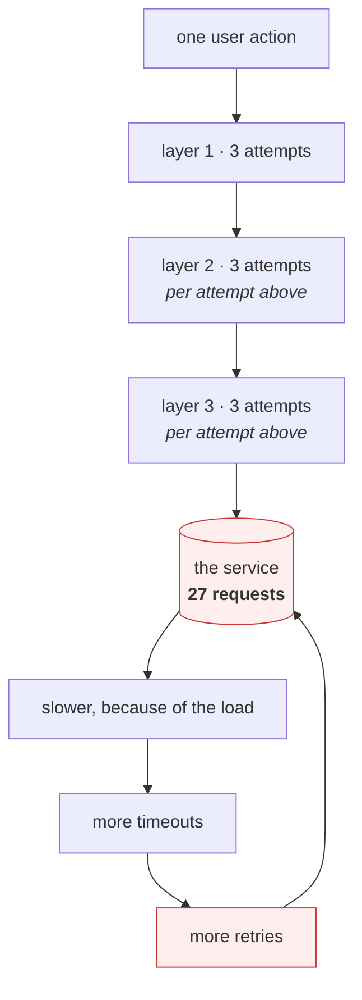

# 5.2 — Retries that turn a blip into an outage

## One-line answer

A retry is extra load applied at the exact moment a system is least able to carry it, and because retries
at every layer multiply rather than add, three layers each trying three times turns one user action into
twenty-seven requests — which is why a struggling service that would have recovered does not.

---

## The story

🎬 **The scene.** A lift in an office block is slow one morning. Someone presses the call button. Nothing
happens quickly enough, so they press it again. Then again, harder.

Three other people are waiting. They watch, and they press it too. The button now has a queue of requests
behind it, all for the same lift, all from people who are already standing there.

The lift arrives. It stops at their floor, opens, closes, and then dutifully stops at their floor again.
And again. Nobody is waiting any more — they all got in the first time — but the presses were recorded and
the lift honours every one of them. The people inside watch their own floor go by four times.

😬 **The naive fix.** A sign: *"Pressing repeatedly does not make the lift come faster."*

💥 **Why it fails.** The sign is true and it changes nothing, because pressing again is what a person does
when they do not know whether the first press registered. The uncertainty is the cause, and a sign does
not remove it. Worse, the sign describes only the mild version. **The severe version is that the extra
presses are themselves what made the lift slow**, and by the time anyone notices, the pressing and the
slowness are feeding each other.

💡 **The insight.** Repeating a request when you are unsure is a completely reasonable individual
decision, and the sum of everybody's reasonable individual decisions is a system that cannot recover.
**The fix is not to stop retrying; it is to make retrying bounded, spread out and safe to repeat.**

---

## The idea in plain language

A retry is what you do after the timeout from
[4.1](../04-timeouts/4.1-a-timeout-is-a-decision-not-a-safety-net.md) fires: you gave up waiting, and now
you decide whether to ask again. It is often right — a dropped packet, a connection reset while a server
restarted, a brief blip — and asking again fixes it invisibly.

The trouble is what a retry *is* from the other side. **It is another request, arriving at a service that
just failed to answer the last one.**

### Multiplication, not addition

This is the part that surprises people, and it is worth quoting from the Google SRE book directly,
verified against `sre.google/sre-book/addressing-cascading-failures/` on **2026-08-24**:

```text
Avoid amplifying retries by issuing retries at multiple levels: a single request at the highest
layer may produce a number of attempts as large as the product of the number of attempts at each
layer to the lowest layer. If the database can't service requests because it's overloaded, and the
backend, frontend, and JavaScript layers all issue 3 retries (4 attempts), then a single user action
may create 64 attempts (4^3) on the database.
```

**Read "product" carefully.** Three layers that each try three times is not nine attempts, and it is not
three plus three plus three. It is 3 × 3 × 3 = **twenty-seven**. Each layer is being modest. The stack is
not.

And nobody wrote it. Each layer's retry was added by a different person at a different time, each fixing
a real intermittent failure, each entirely defensible in code review. **Amplification is an emergent
property of a stack, so it does not appear in any one repository** — which is exactly why it is usually
discovered during an incident.

### The three properties a retry must have

**It must be bounded.** A fixed number of attempts, and a budget above that: the SRE book's suggestion is
*"only allow 60 retries per minute in a process, and if the retry budget is exceeded, don't retry; just
fail the request."* The budget is the part people leave out, and it is the part that matters, because a
per-request limit still lets *every* request retry during a general outage.

**It must be spread out.** Two ideas, and they are different:

- **Backoff** — wait longer between successive attempts, usually doubling: 1 s, 2 s, 4 s. This reduces
  how often *one* client asks.
- **Jitter** — randomise each wait. This stops *all* clients asking at the same instants.

The SRE book's rule combines them: *"Always use randomized exponential backoff when scheduling retries."*
Backoff without jitter still produces synchronised waves, which the lab below shows as a histogram.

📄 **Where the doubling comes from.** Not from convention, and not from this book: it is the
central argument of a 1988 paper, *Congestion Avoidance and Control*, which watched a real network
collapse to a thousandth of its throughput and argued that for senders who cannot see each other,
exponential is the only backoff shape with any hope of working. This day teaches it in full, with a
demo you run, in [`papers/congestion-avoidance-and-control.md`](../../papers/congestion-avoidance-and-control.md)
— including the thing the paper never mentions, which is **jitter**.

**Term, on first use: the *thundering herd*.** When many clients fail at the same moment, they retry at
the same moment. Backoff alone preserves that alignment — everybody waits one second, so everybody
returns one second later, together. The recovering service is hit by the whole crowd at once, fails
again, and the crowd re-forms.

**It must be safe to repeat.** From
[4.1](../04-timeouts/4.1-a-timeout-is-a-decision-not-a-safety-net.md): **a timeout tells you that you
stopped waiting, not that the operation did not happen.** RFC 9110 is explicit about the consequence,
verified against `rfc-editor.org/rfc/rfc9110` §9.2.2 on **2026-08-24**:

```text
A client SHOULD NOT automatically retry a request with a non-idempotent method unless it has some
means to know that the request semantics are actually idempotent, regardless of the method, or some
means to detect that the original request was never applied.
```

**Term, on first use: *idempotent*.** RFC 9110 §9.2.2: *"A request method is considered "idempotent" if
the intended effect on the server of multiple identical requests with that method is the same as the
effect for a single such request."* `PUT` and `DELETE` are; `POST` is not. In practice you make a `POST`
safe to repeat by attaching an **idempotency key** — a value the client generates once, which the server
uses to recognise the second copy and return the first result rather than doing the work twice.

### What to retry, and what never to

| Failure | Retry? | Why |
| --- | --- | --- |
| `ConnectTimeout`, connection refused | **yes** | Nothing was sent. Safe by construction, whatever the method. |
| `ReadTimeout` on a `GET` | **yes** | Idempotent, and reading twice costs only the read. |
| `ReadTimeout` on a `POST` | **only with an idempotency key** | The write may already have landed. |
| `503` with `Retry-After` | **yes, after the stated delay** | The server told you when. Obey it. |
| `429` | **yes, after `Retry-After`** | You are being rate limited; retrying sooner makes it worse. |
| `400`, `404`, `422` | **never** | The request is wrong. It will be exactly as wrong next time. |
| `500` on a write | **usually not** | Unknown outcome, same as a timeout. |

The two rows worth internalising are the ones where the *client* is being told what to do. RFC 9110
§10.2.3, verified on **2026-08-24**:

```text
Servers send the "Retry-After" header field to indicate how long the user agent ought to wait
before making a follow-up request.

  Retry-After = HTTP-date / delay-seconds
```

A client that ignores `Retry-After` and applies its own backoff is overriding the only participant who
actually knows how overloaded the service is. Addendum 01 makes handling it non-negotiable for every
model call path in this curriculum, because free-tier providers signal quota exhaustion with `429` and a
`Retry-After`, and a client that hammers through it gets nothing and deserves nothing.

---

## Why Kriya needs it

Addendum 01 requires **every** model call path to handle HTTP 429 with `retry-after` plus backoff and then
escalate honestly. Day 126 writes the first one against a local model and Day 130 against a free-tier
API; both are this part, applied.

Day 147 evaluates in bulk — hundreds of calls in a loop — which is the workload shape most likely to trip
a rate limit and therefore most likely to turn a retry policy into a self-inflicted outage.

Day 179's agents retry tool calls, and an agent that retries a *step* re-runs everything the step did.
**An agent loop is retry amplification with no fixed number of layers**, which is why that day's brake is
a step budget rather than an attempt count.

Day 46 is where a bad rollout has to be detected quickly, and a retry storm is one of the two things that
turns a small bad deploy into a total one — the other being the exhaustion from
[5.3](5.3-hanging-pulse-on-purpose.md).

---

## The mechanism

Count the requests. That is the entire experiment: a service that is permanently overloaded and counts
every arrival, and a client that models a stack of layers.

### The service that counts

```python
# days/day-007-networking-for-operators/lab/counter.py
"""A permanently overloaded service that counts arrivals per second and never recovers.

Usage: python counter.py <port> <seconds_to_run>
"""

import collections
import http.server
import socketserver
import sys
import time

PORT = int(sys.argv[1]) if len(sys.argv) > 1 else 8014
RUN = float(sys.argv[2]) if len(sys.argv) > 2 else 30.0

T0 = time.monotonic()
first: list[float] = []
arrivals: collections.Counter[int] = collections.Counter()


class Handler(http.server.BaseHTTPRequestHandler):
    protocol_version = "HTTP/1.1"

    def log_message(self, *args: object) -> None:
        pass

    def do_GET(self) -> None:
        now = time.monotonic()
        if not first:
            first.append(now)
        arrivals[int(now - first[0])] += 1
        body = b"overloaded\n"
        self.send_response(503)
        self.send_header("Retry-After", "1")
        self.send_header("Content-Length", str(len(body)))
        self.end_headers()
        self.wfile.write(body)


class Server(socketserver.ThreadingTCPServer):
    allow_reuse_address = True
    daemon_threads = True


with Server(("127.0.0.1", PORT), Handler) as srv:
    srv.timeout = 0.2
    while time.monotonic() - T0 < RUN:
        srv.handle_request()

total = sum(arrivals.values())
print(f"[counter] total arrivals: {total}, bucketed from the first one", flush=True)
for second in range(int(max(arrivals, default=0)) + 1):
    n = arrivals[second]
    print(f"[counter] t={second:>2}s  {n:>4}  {'#' * min(n, 60)}", flush=True)
```

**Line by line:**

- `self.send_response(503)` **always** — this service never recovers. **That is deliberate**: a service
  that recovers would let the retries look successful and hide the arithmetic. Here the only output is
  load.
- `send_header("Retry-After", "1")` — the service is telling every client exactly what RFC 9110 says it
  should. **The clients in the next section ignore it entirely**, which is the normal state of affairs
  and is the point of including it.
- `arrivals[int(now - first[0])] += 1` — buckets by whole seconds **measured from the first arrival**,
  not from server start, so the histogram is anchored on the event rather than on when you happened to
  type the command.
- `first: list[float]` used as a one-slot box — a list because it is mutated from inside the handler,
  which runs in another thread; assigning to a module-level float there would need `global`, and a list
  makes the intent ("record this once") plain.
- `daemon_threads = True` — threads do not keep the process alive, so the histogram actually prints when
  the run ends.
- `srv.timeout = 0.2` with `handle_request()` in a `while` loop rather than `serve_forever()` — this is
  what lets the server **stop on its own** and print. `serve_forever()` would never reach the summary.
- `'#' * min(n, 60)` — a bar chart in the terminal, capped so one huge bucket cannot wrap the display.
  **The shape is the finding here, not the numbers.**

### The client that models a stack

```python
# days/day-007-networking-for-operators/lab/retry_client.py
"""Model a stack of layers that each retry, with or without jitter.

Usage: python retry_client.py <url> <layers> <attempts_per_layer> <jitter|nojitter> [clients]
"""

import concurrent.futures
import random
import sys
import threading
import time

import httpx2

URL = sys.argv[1]
LAYERS = int(sys.argv[2])
ATTEMPTS = int(sys.argv[3])
JITTER = sys.argv[4] == "jitter"
CLIENTS = int(sys.argv[5]) if len(sys.argv) > 5 else 1

GATE = threading.Barrier(CLIENTS)


def backoff(attempt: int) -> float:
    base = 1.0 * (2**attempt)
    return random.uniform(0, base) if JITTER else base


def call(depth: int, client: httpx2.Client) -> None:
    for attempt in range(ATTEMPTS):
        if depth == LAYERS - 1:
            try:
                r = client.get(URL, timeout=httpx2.Timeout(3.0))
                if r.status_code < 500:
                    return
            except httpx2.HTTPError:
                pass
        else:
            call(depth + 1, client)
        if attempt < ATTEMPTS - 1:
            time.sleep(backoff(attempt))


def one_user(_: int) -> None:
    with httpx2.Client() as client:
        GATE.wait()
        call(0, client)


start = time.monotonic()
with concurrent.futures.ThreadPoolExecutor(max_workers=CLIENTS) as pool:
    list(pool.map(one_user, range(CLIENTS)))
print(
    f"[client] {CLIENTS} user action(s) | {LAYERS} layers x {ATTEMPTS} attempts "
    f"| jitter={JITTER} | finished in {time.monotonic() - start:.1f}s",
    flush=True,
)
```

**Line by line:**

- `call(depth, client)` is **recursive**, and that is the whole model: a layer either issues the request
  (if it is the deepest) or calls the layer below it — and it does that `ATTEMPTS` times. **The
  multiplication is not coded anywhere; it emerges from nesting**, which is precisely how it emerges in
  a real stack.
- `if depth == LAYERS - 1` — only the deepest layer touches the network. The layers above it retry *their
  own call*, which is the shape that produces the product.
- `base = 1.0 * (2**attempt)` — **exponential backoff**: 1 s, 2 s, 4 s. The doubling is what "exponential"
  means and nothing more.
- `random.uniform(0, base)` when jittering — **full jitter**: a uniform draw across the whole window
  rather than a small wobble around it. A narrow jitter (say ±10%) leaves the waves almost as sharp;
  spreading across the entire interval is what actually flattens them.
- `threading.Barrier(CLIENTS)` and `GATE.wait()` — **every simulated user starts at the same instant.**
  Without this the thread pool ramps up over a few hundred milliseconds and smears the herd, and the
  experiment would show a gentler picture than reality. A real herd is synchronised by a common event —
  an upstream recovering, a deploy finishing, a cache expiring — so synchronising it here is realism, not
  a trick.
- `if r.status_code < 500: return` — retry on server errors, stop on anything else. **Note what is
  missing: the `Retry-After` the server is sending.** That omission is the subject of **When it breaks**.
- `if attempt < ATTEMPTS - 1` — no sleep after the final attempt. Easy to get wrong, and getting it wrong
  adds a pointless delay to every failure.
- `with httpx2.Client() as client` per user, reused across all attempts — connection reuse, as
  [3.3](../03-tcp/3.3-time-wait-and-the-ports-you-ran-out-of.md) argued for. **Without it this experiment
  would also exhaust ephemeral ports** and you would be debugging the wrong thing.

### Run one — the baseline

```bash
cd days/day-007-networking-for-operators
uv run python lab/counter.py 8014 12 &
sleep 2
uv run python lab/retry_client.py http://127.0.0.1:8014/ 1 1 nojitter 1
wait
```

**Line by line:** one layer, one attempt, one user. **The control.** If this does not print exactly one
arrival, something else is talking to port 8014 and every later number is contaminated.

Observed on **2026-08-24**:

```text
[client] 1 user action(s) | 1 layers x 1 attempts | jitter=False | finished in 0.1s
[counter] total arrivals: 1, bucketed from the first one
```

### Run two — three layers, three attempts each

```bash
cd days/day-007-networking-for-operators
uv run python lab/counter.py 8014 45 &
sleep 2
uv run python lab/retry_client.py http://127.0.0.1:8014/ 3 3 nojitter 1
wait
```

**Line by line:** `3 3` — three layers, three attempts at each. **Still one user, pressing the button
once.** Everything that follows is the system's own doing. `45` rather than the `12` of the control run
because **the counter must outlive the client** — nine nested backoff waits at 1 s, 2 s and 4 s add up,
and a counter that stops first silently under-reports the very number the run exists to produce.

Observed on **2026-08-24**:

```text
[client] 1 user action(s) | 3 layers x 3 attempts | jitter=False | finished in 39.3s
[counter] total arrivals: 27, bucketed from the first one
[counter] t= 0s     1  #
[counter] t= 1s     1  #
[counter] t= 2s     0
[counter] t= 3s     1  #
[counter] t= 4s     1  #
[counter] t= 5s     1  #
[counter] t= 6s     0
[counter] t= 7s     1  #
[counter] t= 8s     0
[counter] t= 9s     1  #
[counter] ...        (the same one-at-a-time pattern continues, unbroken, to t=39s)
[counter] t=37s     1  #
[counter] t=38s     0
[counter] t=39s     1  #
```

**Twenty-seven.** One person, one click, twenty-seven requests at the bottom of the stack — 3³, exactly
the SRE book's arithmetic with smaller numbers. Nobody configured twenty-seven and nobody would have
approved it.

Two more things in that output are worth naming. **The load is 27× and it is also *sustained*** — spread
across forty seconds with never more than one arrival per second and never a gap longer than one, so the
service is denied any quiet moment in which to recover. And **the user waited 39.3 seconds** for a
failure that was known in the first hundred milliseconds; a stack that retries hard is also a stack that
reports failure slowly, which is the same
[5.1](5.1-the-timeout-budget-down-the-request-path.md) problem seen from a different angle.

| Layers × attempts | Requests from one user action |
| --- | --- |
| 1 × 1 | 1 |
| 1 × 3 | 3 |
| 2 × 3 | 9 |
| **3 × 3** | **27** |
| 3 × 4 (the SRE book's example) | **64** |

### Run three — the herd, and what jitter does to it

Thirty users, one layer, four attempts. First without jitter:

```bash
cd days/day-007-networking-for-operators
uv run python lab/counter.py 8014 14 &
sleep 2
uv run python lab/retry_client.py http://127.0.0.1:8014/ 1 4 nojitter 30
wait
```

**Line by line:** thirty simulated users released simultaneously by the barrier, each retrying four times
with 1 s / 2 s / 4 s backoff and **no randomisation**. This is "we added exponential backoff" as most
people implement it.

Observed on **2026-08-24**:

```text
[client] 30 user action(s) | 1 layers x 4 attempts | jitter=False | finished in 8.2s
[counter] total arrivals: 120, bucketed from the first one
[counter] t= 0s    26  ##########################
[counter] t= 1s    30  ##############################
[counter] t= 2s     4  ####
[counter] t= 3s    26  ##########################
[counter] t= 4s     4  ####
[counter] t= 5s     0
[counter] t= 6s     0
[counter] t= 7s    26  ##########################
[counter] t= 8s     4  ####
```

**Four spikes and two completely empty seconds.** The waves land at 0, 1, 3 and 7 — exactly the backoff
schedule — and each is the entire crowd arriving together. The empty seconds at `t=5` and `t=6` are the
finding: **the load was not reduced, it was stacked into moments.** A service sized for the average is
destroyed by the peak, and there is no traffic at all in between to recover during.

Now the same thing with full jitter:

```bash
cd days/day-007-networking-for-operators
uv run python lab/counter.py 8014 16 &
sleep 2
uv run python lab/retry_client.py http://127.0.0.1:8014/ 1 4 jitter 30
wait
```

**Line by line:** one word changed. **Same users, same attempt count, same backoff windows** — only the
wait within each window is now a uniform random draw instead of the window's full width.

Observed on **2026-08-24**:

```text
[client] 30 user action(s) | 1 layers x 4 attempts | jitter=True | finished in 7.2s
[counter] total arrivals: 120, bucketed from the first one
[counter] t= 0s    48  ################################################
[counter] t= 1s    24  ########################
[counter] t= 2s    18  ##################
[counter] t= 3s    14  ##############
[counter] t= 4s     8  ########
[counter] t= 5s     6  ######
[counter] t= 6s     1  #
[counter] t= 7s     1  #
```

**Compare the two shapes, and then compare the totals.**

| | no jitter | full jitter |
| --- | --- | --- |
| total arrivals | **120** | **120** |
| tallest second after the first | **30** | **24** |
| seconds with zero arrivals | **2** | **0** |
| shape | four separate waves | one decaying tail |

**The totals are identical, and that is the honest headline.** Jitter does not reduce load by a single
request. What it does is convert a sequence of walls into a curve — and the reason that matters is
queueing: a service that can absorb thirty requests per second survives the second column and falls over
in the first, at the same average rate. **The first bucket is still tall in both**, because the *initial*
burst is genuinely simultaneous and no retry policy can spread something that has not happened yet; jitter
only ever spreads the retries.

Clean up:

```bash
pkill -f 'counter.py|retry_client.py' 2>/dev/null; sleep 1; netstat -ano | grep ':8014' | grep LISTENING || echo "8014 clean"
```

**Line by line:** stop both programs and confirm the port is released
([1.4](../01-addresses-and-ports/1.4-the-port-that-was-already-in-use.md)). The `counter.py` runs here
have a deadline built in, so they stop on their own — **the `pkill` is for the run you interrupt**, which
you will, because the three-layer run takes a while to finish.



**The loop at the bottom is the part that turns a blip into an outage.** Load causes slowness, slowness
causes timeouts, timeouts cause retries, retries are load. Once it is turning, removing the original
cause does not stop it — the retries are now their own cause, and the system stays down after the thing
that broke it has been fixed. That self-sustaining state has a name in the literature, **metastable
failure**, and the only reliable exits are shedding load or turning the clients off.

---

## When it breaks

**The `Retry-After` nobody read.** The client above ignores it:

```text
HTTP/1.1 429 Too Many Requests
Retry-After: 47
Content-Type: application/json

{"error": {"message": "Rate limit reached", "type": "requests"}}
```

**What it says:** wait forty-seven seconds.
**What it actually means:** the server has told you exactly when it will be ready, and a client applying
its own 1 s / 2 s / 4 s backoff will make eleven pointless requests inside that window and still be
rate-limited at the end. **Every one of those attempts may extend the limit.**
**The smallest fix:** read the header, and sleep for what it says — `float(r.headers.get("retry-after",
default))`, with your backoff only as the fallback when the header is absent.
**Why this one is not optional here:** Addendum 01 requires it for every model call path in this
curriculum, and free-tier providers are the systems most likely to send it. A `429` handled badly is how
a free quota becomes zero requests for an afternoon.

**The retry on a write.** The duplicate from
[4.1](../04-timeouts/4.1-a-timeout-is-a-decision-not-a-safety-net.md), stated as the rule it breaks:

```text
POST /v1/charge   -> ReadTimeout after 5s
POST /v1/charge   -> 200 OK
# ledger shows two charges
```

**What it says:** one timeout and one success.
**What it actually means:** the first request **also** succeeded, at the server, after the client stopped
listening. RFC 9110 §9.2.2 names this exactly: a client should not automatically retry a non-idempotent
method *"unless it has… some means to detect that the original request was never applied."* Nothing in a
`ReadTimeout` provides that means.
**The smallest fix:** an idempotency key generated **once per logical operation and reused across every
attempt** — a key regenerated per attempt is not a key, it is a second request with extra steps.
**The rule:** retry transport failures freely, retry writes only when the server can recognise a repeat.

**Retries on a permanent error.** Wasted, and worse than wasted:

```text
[client] 3 layers x 3 attempts | finished in 39.3s
GET /v1/tickets/99999 -> 404  (x27)
```

**What it says:** twenty-seven attempts at a missing resource.
**What it actually means:** **a `404` will be a `404` next time.** So will a `400` and a `422`. Retrying
a client error cannot succeed, and during an incident it consumes the capacity that requests which
*could* succeed need.
**The smallest fix:** retry on `5xx`, `429`, and transport failures. Never on `4xx` except `429` — and
`408 Request Timeout` if you actually see one.
**The tell in a dashboard:** a `4xx` rate that is a clean multiple of your traffic. Multiples mean
machinery, not users.

**The retry budget that did not exist.** Per-request limits are not enough:

```text
# every request retries 3 times, correctly bounded
# upstream is fully down
# offered load: 3x normal, for the entire duration of the outage
```

**What it says:** retries are bounded.
**What it actually means:** bounded **per request**, which is no bound at all when every request is
failing. The moment the upstream comes back it meets three times its normal traffic, fails again, and
the outage extends itself. This is the SRE book's *"server-wide retry budget"* — *"only allow 60 retries
per minute in a process, and if the retry budget is exceeded, don't retry; just fail the request."*
**The smallest fix:** a process-wide counter, and retry only while it has room.
**Why the budget beats a smaller attempt count:** it keeps retries available for the isolated blips they
are for, and withdraws them exactly when they have stopped being a repair and started being load.

---

## In production

**What a professional writes instead of the teaching version.** Retries live in **one** place — the
client wrapper, the service mesh, the gateway — and are switched off everywhere else, because the only
way to reason about a product is to know how many terms are in it. The policy retries transport failures
and `5xx` and `429`, never other `4xx`, obeys `Retry-After` when present, uses randomised exponential
backoff when it is not, caps attempts at two or three, and sits behind a process-wide budget. **Every
retry is spent from the deadline of
[5.1](5.1-the-timeout-budget-down-the-request-path.md)**, not given a fresh clock — which usually means
there is time for one retry, not three, and discovering that is itself worth the exercise. Writes carry
an idempotency key or are not retried.

**What degrades at scale.** The feedback loop, and the fact that it survives its own cause. At low
traffic, retries are free and invisible. Past the knee of the latency curve they are the load, and the
system reaches the metastable state the diagram shows: still down after the trigger is gone, because the
retries have become self-sustaining. **The only exits are load shedding, a circuit breaker, or turning
the clients off** — and the last one is not available if the clients are somebody else's mobile app. This
is why "add a retry" is a decision about system stability and not a local robustness tweak.

**The failure that only shows with real traffic.** Amplification is invisible in every environment where
the dependency works. Each layer's retry code runs and never fires, so the product is one. It becomes 27
or 64 only when the bottom of the stack is struggling — which is to say, **the amplification arrives in
exactly the same minute as the incident it is going to make worse**, and never in the staging run where
you would have caught it. The way to find it beforehand is not testing; it is counting layers on a
whiteboard.

**The review comment a senior engineer leaves.** *"This adds three attempts inside a client that the
gateway already retries twice, so a single user request is now six at the database — and the SDK
underneath us retries too, which makes it eighteen. Take the retry out here and let the gateway own it.
If you keep it, it has to obey `Retry-After`, come out of the request's remaining budget rather than
adding to it, and sit behind a process-wide budget — otherwise the first slow afternoon we have, this
line is what takes the database down."*

**The signal you would alert on.** **The ratio of attempts to logical requests**, per dependency. In
health it is barely above 1.0; when it climbs to 3 or 27 you are looking at amplification directly, and
no other signal shows it — the extra attempts are *successful requests* at the layer that issues them
and *load* at the layer that receives them, so neither error rate nor latency moves in a way that names
the cause. Second, **retry budget exhaustion as a discrete event**, because it is the moment the system
began shedding rather than repairing, and it is the earliest honest indication that a dependency is not
having a blip. What you would **not** page on is retries themselves: a retry that succeeds is the
mechanism working, and paging on it trains people to ignore the page.

**Blast radius.** This part hands you a load multiplier. Worst case on this machine: 120 requests to a
localhost server that counts them; RAM and processor negligible, nothing persisted, ports released at
exit. Who can trigger it: you, by pointing `retry_client.py` at something. **The bound worth naming is
the one that is your responsibility rather than the tool's — never point this at a host you do not own.**
Thirty synchronised clients with four attempts each is a small denial-of-service, and against a free-tier
API it will exhaust your quota, which Addendum 01 counts as the one genuinely irreversible resource in
this plan. `127.0.0.1` in every command in this part is not an accident. In production the blast radius
of a retry policy is the *product* across every layer, which is why the containment is "one layer owns
retries" rather than "each layer is careful".

**Cost.** `0` model calls, `0` tokens, `0` CI minutes, `0` disk, `0` external network — every request is
to `127.0.0.1`. RAM: two Python processes, roughly 30 MB each. Processor: negligible; the time is spent
in `sleep`.

**The interview question.** *"You add a retry to fix an intermittent failure. What could go wrong?"* The
answer that lands starts with the multiplication: *"The main risk is that I'm not the only layer
retrying. Retries at different levels multiply rather than add, so three layers each trying three times
is twenty-seven requests at the bottom from one user action — and nobody wrote twenty-seven, it just
emerges from the stack. I've measured that: one click, twenty-seven arrivals. The second problem is
timing — exponential backoff without jitter keeps every client synchronised, so a struggling service gets
hit by the whole crowd at one-second, two-second and four-second marks with dead air in between. Jitter
doesn't reduce the load at all, the totals are identical; it turns walls into a curve, and queueing is
what cares about the difference. Third, a timeout doesn't tell me the write didn't happen, so retrying a
non-idempotent request can duplicate it — RFC 9110 is explicit that you need a way to detect the original
was never applied, and in practice that's an idempotency key generated once per operation, not per
attempt. And if the server sent `Retry-After`, my backoff is overriding the only party that knows. The
thing I'd actually insist on in review is that retries live in one layer and come out of the request's
existing deadline rather than extending it, with a process-wide budget so that during a real outage the
system stops retrying instead of tripling the load on a dependency that's already down."*

---

## Check yourself

```bash
cd days/day-007-networking-for-operators && for n in 1 2 3; do uv run python lab/counter.py 8014 45 & sleep 2; uv run python lab/retry_client.py http://127.0.0.1:8014/ "$n" 3 nojitter 1 >/dev/null 2>&1; wait; done
```

Three runs at one, two and three layers, three attempts each. **Write down all three predictions before
you read any of them.** The observed answer is `3`, `9`, `27` — a clean power of three, because each
added layer multiplies rather than contributes.

Check the last one against what you guessed. **If you wrote 9, that error is the entire part**: it is
the difference between adding and multiplying, and it is the single most common misconception about
retries — including among people who have already added one to production.

⚠️ **This takes a while and that is not a fault.** The counter runs to its own deadline rather than
stopping when the client does, so each of the three rounds occupies its full window whether or not the
requests are still arriving. The three-layer round genuinely does take most of it.

**Say out loud, without scrolling up:** *say how many requests reach the bottom when three layers each
retry three times, and why it is not nine · explain what jitter changes and what it provably does not ·
and name the one thing a timeout does not tell you that makes retrying a `POST` dangerous.*
