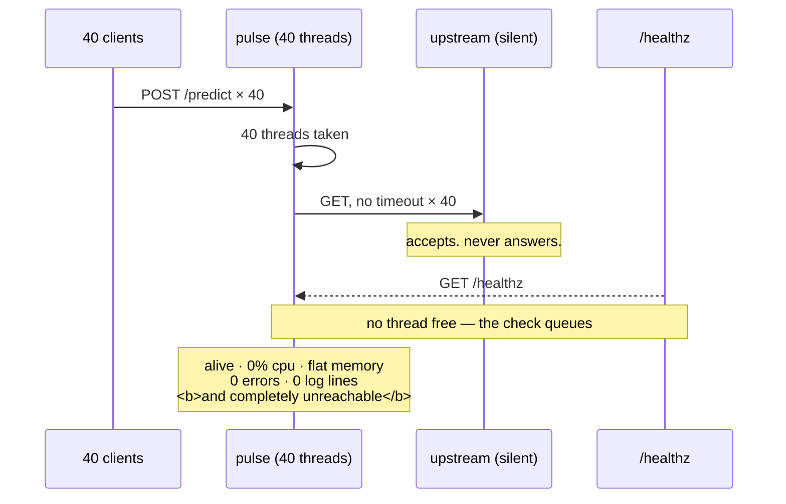

# 5.3 — Hanging `pulse` on purpose

## One-line answer

Point a copy of `pulse` at a dependency that accepts connections and never answers, leave the timeout
unset, and forty requests will take the entire service down — including `/healthz`, which stops returning
anything at all while the process sits at zero processor use and logs nothing.

---

## The story

🎬 **The scene.** A small clinic with forty consulting rooms and one doctor per room. Patients arrive at
reception, are sent to a room, and are seen.

One morning the pathology lab stops answering the phone. It does not say it is busy; the phone rings and
somebody picks it up and then there is silence on the line. Each doctor, mid-consultation, phones
pathology for a result and waits, holding the receiver, because the call connected and any second now
somebody will speak.

By eleven, forty doctors are sitting in forty rooms holding forty silent telephones.

Reception is still letting people in. The waiting room fills. Nobody is being seen, nobody is being
turned away, and if you walked through the building you would see forty calm professionals at their
desks, doing nothing at all, with no one complaining and no alarm sounding anywhere.

😬 **The naive fix.** The practice manager checks the doctors. Every one is present and healthy. She
checks the building: lights on, phones working, no queue at the door that anyone reported. She concludes
the clinic is fine.

💥 **Why it fails.** Every single thing she measured was true. The doctors *are* healthy. The phones *do*
work. The clinic is completely non-functional and **not one of her checks can see it**, because the
failure is not in any component — it is in the fact that every component is waiting on the same silent
third party, and "waiting" is not a state anybody instrumented.

💡 **The insight.** The clinic did not run out of doctors, or rooms, or electricity. It ran out of
**doctors who were not already waiting**, and that is a resource nobody had a number for. A rule saying
"hang up after thirty seconds" would have kept the clinic running at reduced capacity all morning. The
absence of that rule is what turned somebody else's outage into a total one.

---

## The idea in plain language

This part is the day's deliberate failure, and it puts the whole day into one drill.

Every idea used here has already been established. A peer can accept a connection and then say nothing,
and the connection stays perfectly healthy
([3.4](../03-tcp/3.4-the-connection-that-is-open-and-dead.md)). A client with no timeout waits forever
([4.1](../04-timeouts/4.1-a-timeout-is-a-decision-not-a-safety-net.md)). Waiting holds a worker. What
this part adds is the *count*: **how many workers, exactly, and what happens when the last one goes.**

### Where `pulse`'s workers come from

`pulse` is a FastAPI application run by uvicorn, written on
[Day 3](../../../day-003-pulse-v0/LESSON.md). Its three route functions are declared with plain `def`,
not `async def` — and that one keyword decides everything in this part.

FastAPI's documentation, verified against `fastapi.tiangolo.com/async/` on **2026-08-24**:

```text
When you declare a path operation function with normal def instead of async def, it is run in an
external threadpool that is then awaited, instead of being called directly (as it would block the
server).
```

**Term, on first use: a *threadpool* is a fixed set of worker threads that jobs are handed to.** Fixed is
the important word. When every thread is busy, the next job waits in a queue — it does not get a new
thread.

That pool is AnyIO's, and it has a number. Verified against `anyio.readthedocs.io/en/stable/threads.html`
on **2026-08-24**:

```text
The default AnyIO worker thread limiter has a value of 40, meaning that any calls to
to_thread.run_sync() without an explicit limiter argument will cause a maximum of 40 threads
to be spawned.
```

**Forty.** That is the whole capacity of `pulse` for `def` endpoints — and it is a default, so the
first step of the drill below is reading it on your own machine rather than trusting the number here.

### The arithmetic

Forty threads. Every `def` endpoint uses one for the duration of the call — **including `/healthz`**,
which is also a `def`. So:

- 39 hung requests → one thread free → `/healthz` answers → the service looks fine.
- 40 hung requests → **no thread free** → `/healthz` queues behind them → the service is gone.

There is no gradual degradation and there is no partial failure. **The health check does not get slower;
it stops existing**, one request before you would have expected any symptom at all.

**This is why the number matters and why guessing it is not good enough.** "Some concurrency limit"
does not let you predict anything. "Forty" tells you precisely how many slow requests separate a working
service from a dead one.

---

## Why Kriya needs it

Day 25 gives `pulse` a database. Day 109 gives it a model. **Both are network calls from inside a `def`
endpoint**, which is exactly the shape drilled here, so the failure this part causes on purpose is the
one those days make possible for real.

Day 41 configures the liveness and readiness probes that Kubernetes uses to decide whether `pulse` is
alive. The drill below shows `/healthz` returning nothing while the process is perfectly healthy — so
that day inherits a question it has to answer: **what should a probe do when the service is exhausted
rather than broken, and is restarting it a repair or a way to lose the queue?**

Day 73's SLO is a latency promise, and this failure produces requests with **no** latency — they never
complete, so they are never recorded ([4.1](../04-timeouts/4.1-a-timeout-is-a-decision-not-a-safety-net.md)).

Day 79 writes runbooks. The symptom table at the end of this part is the shape of one.

---

## The mechanism

Two programs and a load generator. The rule from
[Day 6, part 4.3](../../../day-006-resources-and-the-oom-killer/parts/04-the-oom-killer/4.3-oom-killing-pulse-on-purpose.md)
applies unchanged: **never edit `pulse` for a drill.** You work on a copy, in `lab/`, and delete it
afterwards. A drill that leaves the system modified is an incident you caused.

### First, read the number rather than trusting it

```bash
uv run python -c "
import asyncio
import anyio.to_thread as t
async def main():
    print('anyio default thread limiter total_tokens =', t.current_default_thread_limiter().total_tokens)
asyncio.run(main())
"
```

**Line by line:**

- `current_default_thread_limiter()` — the object AnyIO uses to cap `run_sync`, named on the page quoted
  above. **Read it rather than trusting the number in this document** (Principle 7); it is a default, and
  defaults move.
- `asyncio.run(main())` — the limiter belongs to the running async backend, so asking for it outside an
  event loop raises `anyio.NoEventLoopError`. **That is why the one-liner needs a `main`** instead of
  being a single `print`.
- `total_tokens` — a capacity limiter's count of simultaneous holders. Forty tokens, forty threads.
- **`anyio` is not a direct dependency of this project.** It arrives underneath `fastapi` and `starlette`
  ([Day 3](../../../day-003-pulse-v0/LESSON.md), §3), which is worth noticing on its own: **the number
  that decides when your service dies is a default in a library you never chose.**

Observed on **2026-08-24**:

```text
anyio default thread limiter total_tokens = 40
```

### The dependency that is up, reachable and useless

```python
# days/day-007-networking-for-operators/lab/blackhole.py
"""Accept every connection and answer none. A dependency that is up, reachable and useless.

Usage: python blackhole.py <port>
"""

import socket
import sys

PORT = int(sys.argv[1]) if len(sys.argv) > 1 else 8015

srv = socket.socket(socket.AF_INET, socket.SOCK_STREAM)
srv.setsockopt(socket.SOL_SOCKET, socket.SO_REUSEADDR, 1)
srv.bind(("127.0.0.1", PORT))
srv.listen(128)
print(f"[blackhole] 127.0.0.1:{PORT} - accepting everything, answering nothing", flush=True)

held = []
while True:
    conn, _ = srv.accept()
    held.append(conn)
    print(f"[blackhole] holding {len(held)} connection(s)", flush=True)
```

**Line by line:**

- `srv.listen(128)` — a large backlog, and `accept()` in a loop. **This is the difference from
  `silent_peer.py`** ([3.4](../03-tcp/3.4-the-connection-that-is-open-and-dead.md)), which accepts one
  connection and stops. Here every connection is genuinely accepted, so every one is `ESTABLISHED` and
  none is merely queued ([3.2](../03-tcp/3.2-the-accept-queue-and-the-backlog.md)) — the failure under
  test is an unresponsive *application*, not a full accept queue.
- `held.append(conn)` — **keeping a reference is load-bearing.** Drop it and Python's garbage collector
  closes the socket, the client gets a `FIN`, and the request fails fast instead of hanging. The bug
  would look like the drill not working.
- No `recv`, no `sendall`, no `close` — the peer that is *up* by every external measure and useless by
  the only one that matters.
- The `holding N connection(s)` line — **the instrument.** It is how you will confirm that exactly forty
  connections were made, which is the number this whole part is about.
- `SO_REUSEADDR` — so a re-run is not blocked by a lingering `TIME_WAIT`
  ([3.3](../03-tcp/3.3-time-wait-and-the-ports-you-ran-out-of.md)).

### The drill copy of `pulse`

```python
# days/day-007-networking-for-operators/lab/hangy.py
"""A drill copy of pulse whose /predict calls an upstream with no timeout. Never edit pulse itself."""

import os

import httpx2
from fastapi import FastAPI
from pydantic import BaseModel

UPSTREAM = os.environ.get("UPSTREAM", "http://127.0.0.1:8015/")
TIMEOUT = float(os.environ.get("TIMEOUT", "0")) or None

app = FastAPI(title="hangy (drill copy of pulse)")
client = httpx2.Client(timeout=httpx2.Timeout(TIMEOUT))


class Ticket(BaseModel):
    text: str


@app.get("/healthz")
def healthz() -> dict[str, str]:
    return {"status": "ok"}


@app.post("/predict")
def predict(ticket: Ticket) -> dict[str, str]:
    client.get(UPSTREAM)
    return {"label": "billing", "text": ticket.text}
```

**Line by line:**

- `def predict`, not `async def` — **matching `pulse`'s real shape** from
  [Day 3, part 2.4](../../../day-003-pulse-v0/parts/02-the-service/2.4-predict-the-contract-before-the-model.md).
  This is what puts the handler in the forty-thread pool. Were it `async def` with a blocking call inside,
  the failure would be *worse* — one blocked call would stall the entire event loop and the service would
  die at a concurrency of one.
- `def healthz` too — **the health check consumes a pool thread like everything else.** That single fact
  is the drill's finding, and it is invisible in the source.
- `float(os.environ.get("TIMEOUT", "0")) or None` — `0` means "no timeout", because `0 or None` is `None`
  and `httpx2.Timeout(None)` disables the bound. **One environment variable flips the drill between red
  and green**, so the comparison changes exactly one thing.
- `client = httpx2.Client(...)` at module level, one client reused — connection pooling, as
  [3.3](../03-tcp/3.3-time-wait-and-the-ports-you-ran-out-of.md) argued. **The default pool is larger
  than forty**, so the pool is not what limits this drill; the thread count is.
- `client.get(UPSTREAM)` with **its return value discarded and no `try`** — deliberately the naive call.
  This is the line that a review would catch and that reaches production anyway, because in every
  environment where the upstream answers it is completely fine.

### Start the drill

**Stop `pulse` itself first** if you have it running — the drill copy uses its own port, but two
uvicorns competing for your attention is how people report the wrong symptom.

```bash
cd days/day-007-networking-for-operators
uv run python lab/blackhole.py 8015 &
BH=$!
uv run uvicorn --app-dir lab hangy:app --host 127.0.0.1 --port 8010 --log-level warning &
UV=$!
sleep 4
curl -sS -m 3 -o /dev/null -w 'healthz http=%{http_code} total=%{time_total}s exit=%{exitcode}\n' http://127.0.0.1:8010/healthz
```

**Line by line:**

- `blackhole.py 8015` first — the upstream has to exist before anything calls it, or you get a connection
  refused and a fast, uninteresting failure.
- `--app-dir lab` so uvicorn can import `hangy` without the file being on the project's import path.
  **`lab/` is excluded from lint and tests by design** (`pyproject.toml`, `extend-exclude`), and it stays
  outside the package for the same reason.
- `--log-level warning` — the access log would print a line per request and bury the two that matter.
- `-w 'http=%{http_code} … exit=%{exitcode}'` — the same instrument as
  [Day 6's OOM drill](../../../day-006-resources-and-the-oom-killer/parts/04-the-oom-killer/4.3-oom-killing-pulse-on-purpose.md).
  **`http_code` and curl's own exit code are two different facts** and you need both: `http=000` with a
  non-zero exit means no HTTP response existed at all, which is a different event from a `5xx`.
- `-m 3` — a bound on the *measurement*, so the check itself cannot hang. Ironic and necessary.

The baseline, observed on **2026-08-24**:

```text
healthz http=200 total=0.026257s exit=0
```

**Twenty-six milliseconds and a `200`.** Write that number down; it is the "before" the rest of the drill
is compared against.

### Fire forty requests and check the health of the service

```bash
uv run python -c "
import concurrent.futures, time, httpx2
def hit(i):
    try:
        httpx2.post('http://127.0.0.1:8010/predict', json={'text': 'x'}, timeout=httpx2.Timeout(60.0))
    except Exception as exc:
        return type(exc).__name__
with concurrent.futures.ThreadPoolExecutor(max_workers=40) as pool:
    futures = [pool.submit(hit, i) for i in range(40)]
    time.sleep(6)
    print('40 requests are in flight and none has returned', flush=True)
" &
LOAD=$!
sleep 9
curl -sS -m 8 -o /dev/null -w 'healthz http=%{http_code} total=%{time_total}s exit=%{exitcode}\n' http://127.0.0.1:8010/healthz
```

**Line by line:**

- `max_workers=40` and `range(40)` — **exactly the pool size**, which is the point. Try 39 afterwards and
  the service survives; that comparison is the experiment, not this run alone.
- `pool.submit` rather than `pool.map` — `map` would block until everything finished, and nothing is
  going to finish. `submit` returns immediately so the script can report that the requests are *in
  flight*, which is the state being tested.
- `timeout=httpx2.Timeout(60.0)` **on the load generator** — the client giving up would release nothing
  (the server-side thread stays blocked, exactly as in
  [4.3](../04-timeouts/4.3-the-deadline-that-bounds-the-whole-call.md)), but a generous bound stops the
  script from ending early and confusing you.
- `sleep 9` before the health check — the requests must be established and blocked, not still connecting.
- `-m 8` on the health check, up from `3` — **so the failure is a measurement and not another hang.**

Observed on **2026-08-24**:

```text
40 requests are in flight and none has returned
curl: (28) Operation timed out after 8007 milliseconds with 0 bytes received
healthz http=000 total=8.007475s exit=28
```

And the upstream's own count:

```text
[blackhole] holding 39 connection(s)
[blackhole] holding 40 connection(s)
```

**Forty connections held, and `/healthz` is gone.**

`http=000` means there was no HTTP response to report a code for. `exit=28` is curl's operation-timeout
code. The health check that answered in twenty-six milliseconds a moment ago now answers not at all —
and note what did *not* happen: no `503`, no `500`, no connection refused. **The socket connected fine.**
The request is sitting in a queue behind forty threads that are each blocked on a socket read that will
never return.

### What every signal you own says at this moment

| Signal | What it reports | Is it wrong? |
| --- | --- | --- |
| process alive | **yes** | No — it is alive |
| processor use | **≈0%** | No — it is doing nothing, correctly |
| memory | **flat** | No |
| error rate | **0** | No — nothing has errored; nothing has finished |
| request latency | **unchanged** | No — an unfinished request has no duration to record |
| application log | **last line is a `200`** | No — it cannot log an event that has not happened |
| `/healthz` | **no response at all** | **This is the only one that moved** |

**Six of the seven are accurate and useless**, which is precisely the lesson of
[Day 6's OOM drill](../../../day-006-resources-and-the-oom-killer/parts/04-the-oom-killer/4.3-oom-killing-pulse-on-purpose.md)
arriving by a completely different route. There, the service died and could not report it. Here, the
service is entirely healthy and has nothing to report. **Both produce a total outage that every
conventional metric describes as a quiet afternoon.**

### Now make it green

Same drill, one environment variable.

```bash
kill "$LOAD" "$UV" 2>/dev/null
cd days/day-007-networking-for-operators
TIMEOUT=2 uv run uvicorn --app-dir lab hangy:app --host 127.0.0.1 --port 8010 --log-level error &
UV=$!
sleep 4
uv run python -c "
import collections, concurrent.futures, httpx2
def hit(i):
    try:
        r = httpx2.post('http://127.0.0.1:8010/predict', json={'text': 'x'}, timeout=httpx2.Timeout(30.0))
        return str(r.status_code)
    except Exception as exc:
        return type(exc).__name__
with concurrent.futures.ThreadPoolExecutor(max_workers=40) as pool:
    print(dict(collections.Counter(pool.map(hit, range(40)))), flush=True)
" &
sleep 3
curl -sS -m 8 -o /dev/null -w 'healthz http=%{http_code} total=%{time_total}s exit=%{exitcode}\n' http://127.0.0.1:8010/healthz
wait
```

**Line by line:**

- `TIMEOUT=2` — **the only change.** Same blackhole, same forty requests, same code.
- `pool.map` this time rather than `submit` — now the requests *do* finish, so collecting them is
  possible and the `Counter` tells you what they became.
- `sleep 3` then the health check, **while the load is still running** — the whole question is whether
  `/healthz` survives concurrent hung work, so checking after the load finishes would prove nothing.
- `--log-level error` — the timeouts raise inside the handler and uvicorn logs a traceback per request;
  at `warning` the terminal fills with forty of them.

Observed on **2026-08-24**:

```text
{'500': 40}
healthz http=200 total=0.002030s exit=0
```

**Forty errors, and a health check answering in two milliseconds.**

| | `TIMEOUT` unset | `TIMEOUT=2` |
| --- | --- | --- |
| what the forty requests did | hung indefinitely | **failed at 2 s** |
| what they returned | nothing | `500` × 40 |
| `/healthz` during the load | `http=000`, `exit=28` | **`http=200` in 0.002 s** |
| errors in your dashboard | **zero** | **forty** |
| what an operator sees | a healthy, silent, dead service | **a loud, visible, partial failure** |

**Look hard at the "errors" row before deciding which column is better.** The timeout did not fix
anything: the upstream is exactly as broken, and the forty requests fail either way. What changed is that
the failure became **visible and contained** — forty errors instead of an invisible total outage, and a
service that can still answer everything not on that code path.

That is the whole trade, stated plainly: **a timeout converts an unbounded, silent failure into a
bounded, noisy one.** It does not make the system work. It makes the system fail in a way somebody can
see and act on, and it keeps the failure inside the one path that is actually broken.

### And the traceback it produced

```text
Traceback (most recent call last):
  File ".../httpx2/_transports/default.py", line 98, in map_httpcore_exceptions
    yield
  File ".../httpx2/_transports/default.py", line 245, in handle_request
    resp = self._pool.handle_request(req)
           ^^^^^^^^^^^^^^^^^^^^^^^^^^^^^^
  File ".../httpcore2/_sync/connection_pool.py", line 242, in handle_request
    ...
httpx2.ReadTimeout: timed out
```

**Line by line:** the exception is a `ReadTimeout` and not a `ConnectTimeout`, which is
[4.2](../04-timeouts/4.2-the-four-timeouts-of-one-http-call.md)'s central claim confirmed on a real
stack: **connecting to a hung server succeeded instantly**, and the only phase that could catch this is
the read. The `httpcore2` frame is worth recognising — it is the transport layer under `httpx2`, and it
is where these tracebacks always bottom out.

Clean up:

```bash
kill "$UV" "$BH" 2>/dev/null; sleep 1; netstat -ano | grep -E ':80(10|15)' | grep LISTENING || echo "8010 and 8015 clean"
rm -f lab/hangy.py lab/blackhole.py; git status --short
```

**Line by line:** stop both, confirm the ports are released, and **delete the drill copy** — the day's
`TODO(me)` requires `git status --short` to be clean, because a drill copy of `pulse` left in the tree is
a file somebody will read as real one day. **If `kill` does not take**, use
`taskkill //F //IM python.exe` after confirming nothing else of yours is running in Python.



---

## When it breaks

**The drill that proves nothing.** The most likely way to get this wrong:

```text
healthz http=200 total=0.003s exit=0
```

**What it says:** the health check is fine during the load.
**What it actually means:** **you did not exhaust the pool.** Either fewer than forty requests were
genuinely in flight, or a timeout was set, or the load generator finished before you checked. Confirm
against the blackhole's own count — it must read `holding 40 connection(s)`. **A drill that produces the
healthy answer is a drill that measured nothing**, and the temptation to write it down as a pass is
exactly the dishonesty `docs/INCIDENTS.md` row 6 was about.

**The wrong upstream.** A fast, boring failure:

```text
httpx2.ConnectError: [Errno 111] Connection refused
```

**What it says:** the connection was refused.
**What it actually means:** `blackhole.py` is not running, or is on another port. **Nothing hangs**,
because a refused connection is an immediate, clean answer
([1.4](../01-addresses-and-ports/1.4-the-port-that-was-already-in-use.md)) — and a dependency that fails
fast is a dependency that cannot cause this outage at all. **That contrast is worth pausing on: a
completely dead upstream is much safer than a silent one.**

**`async def` and a blocking call — the same bug, an order of magnitude worse.** If you change `hangy.py`
to use `async def predict` while keeping the synchronous `client.get`:

```text
# concurrency at which the service dies:
#   def       + blocking call  ->  40   (the threadpool)
#   async def + blocking call  ->   1   (the event loop)
```

**What it says:** one request kills it.
**What it actually means:** an `async def` handler runs **on the event loop itself**, so a blocking call
inside it stops every other request in the process — including ones that touch nothing.
FastAPI's page is explicit that `def` exists to avoid this. **The smallest fix:** either keep `def`, or
use `httpx2.AsyncClient` and `await`. **Why this is worth knowing rather than avoiding:** `async def`
with a blocking client is a very common mistake, it makes performance *worse* than the plain `def` most
people are trying to improve on, and the symptom is identical to this drill at a fortieth of the load.

**The restart that looks like a fix.** The 3am reflex:

```text
$ systemctl restart pulse
$ curl -s -o /dev/null -w '%{http_code}\n' http://localhost:8000/healthz
200
```

**What it says:** fixed.
**What it actually means:** the forty threads were freed and the queue was dropped. **The upstream is
still silent**, so the pool refills at exactly the rate traffic arrives — often within seconds — and you
are back where you started, having also discarded every request that was waiting. **The smallest fix in
the moment:** stop sending traffic down the broken path (a feature flag, a fallback), not a restart.
**Why this matters for Day 41:** a liveness probe that restarts on a failing health check will do this
automatically, forever, and the restart loop will look like the cause rather than the response.

---

## In production

**What a professional writes instead of the teaching version.** Every outbound call has a timeout at
client construction, so no call site can forget. Concurrency is **explicit** — the thread pool size is
configured rather than inherited from a library default, because an unwritten forty is a capacity limit
nobody can find during an incident. `/healthz` is deliberately kept off the exhausted path: it is either
`async def`, so it never needs a pool thread, or it is served by something that cannot queue behind
application work. **And the number of in-flight requests is a metric**, because it is the only signal in
this failure that moves before the service disappears.

**What degrades at scale.** The margin vanishes. At forty threads and an upstream that answers in 50 ms,
you can serve roughly eight hundred requests per second; when it degrades to two seconds, capacity drops
to twenty per second — a fortyfold collapse from a dependency that is still working. **You do not need a
hang for this**, which is the uncomfortable part: a merely slow dependency exhausts the pool by the same
arithmetic, just more gradually, and passes every health check on the way down. Then it spreads: your
callers hang on you ([5.1](5.1-the-timeout-budget-down-the-request-path.md)), their pools fill, and if
anybody in the chain retries, [5.2](5.2-retries-that-turn-a-blip-into-an-outage.md) turns the recovery
into a second outage.

**The failure that only shows with real traffic.** Concurrency is the ingredient that is absent from every
test. One request against a hung upstream hangs one request — mildly annoying, obviously not fatal, and
the version everybody has seen. **Forty concurrent requests against the same upstream is a different
event in kind, not in degree**, and nothing in a unit test, an integration test or a manual check
produces it. The defect ships the day the code is written and detonates the first time a dependency has
a bad afternoon at a busy hour.

**The review comment a senior engineer leaves.** *"This client has no timeout and it's called from a `def`
endpoint, so we get forty of these before the whole service — health check included — stops responding
with zero errors and flat CPU. Set a timeout on the client, not at the call site. And `/healthz` should be
`async def` so it doesn't compete for the same pool: when we're exhausted I want the probe to tell me
that, not to be the first casualty of it."*

**The signal you would alert on.** **In-flight request count, and the age of the oldest in-flight
request.** Both rise before the service disappears, and both are visible when nothing else is: the error
rate is zero, latency is unchanged because nothing completes, and the logs are silent. An oldest-request
age exceeding your longest configured timeout is proof that some path is unbounded — there is no other
explanation, which makes it a rare alert that names its own cause. Second, **pool saturation as a
percentage** — threads in use over the limit — because it is the leading indicator and gives you the
minutes before exhaustion rather than the moment after. What you would **not** rely on is `/healthz`:
this drill's whole finding is that it returns `200` right up until it returns nothing at all, so it is a
detector with no warning and no gradient.

**Blast radius.** This part deliberately makes a service unreachable. Worst case on this machine: one
uvicorn on port 8010 and one blackhole on 8015, holding forty sockets and a few tens of megabytes;
processor at zero throughout. Who can trigger it: you, and only against `127.0.0.1`. What bounds it:
`hangy.py` is a **copy**, so the real `pulse` is untouched; both processes die on `kill`; and the cleanup
step deletes the copy and proves it with `git status --short`. **The production blast radius is the point
of the exercise and is much larger: an outbound call with no timeout is a standing liability that
converts any dependency's degradation into your own total outage, and the containment — one timeout at
client construction — costs a line.** Principle 13 in its plainest form: the capability to call another
service arrives with the obligation to bound the call.

**Cost.** `0` model calls, `0` tokens, `0` CI minutes, `0` disk, `0` external network — everything is on
`127.0.0.1`. RAM: uvicorn at roughly 60 MB plus a small blackhole and load generator, all returned at
exit. Processor: **effectively zero, and that is the finding** — a completely dead service that is not
working for its living.

**The interview question.** *"Your service stops responding. CPU is flat, memory is stable, there are no
errors in the logs, and the process is up. Where do you look?"* The answer that lands: *"Blocked I/O with
no timeout. If it were a crash the process would be gone, if it were a leak memory would climb, and if it
were a hot loop CPU would be pinned — flat everything with no response means the workers are alive and
waiting. I'd look at connection states first: a pile of ESTABLISHED sockets to one particular upstream is
the tell, because that's a dependency that accepted us and never answered, which is different from one
that's down. Then I'd check the concurrency limit, because that's the number that decides when 'some slow
requests' becomes 'no service' — FastAPI runs `def` endpoints in AnyIO's threadpool, which defaults to
forty, so the fortieth hung request takes the health check with it. I've done this deliberately: forty
concurrent calls to a silent upstream and `/healthz` went from twenty-six milliseconds to no HTTP
response at all, with every other signal reading normal. The fix isn't a restart — that just drops the
queue and refills in seconds while the upstream is still silent. It's a timeout on the client, and
accepting that what you get in exchange is forty visible errors instead of one invisible outage."*

---

## Check yourself

```bash
cd days/day-007-networking-for-operators && uv run python lab/blackhole.py 8015 & BH=$!; uv run uvicorn --app-dir lab hangy:app --host 127.0.0.1 --port 8010 --log-level error & UV=$!; sleep 4; uv run python -c "
import concurrent.futures, httpx2
def hit(i):
    try: httpx2.post('http://127.0.0.1:8010/predict', json={'text':'x'}, timeout=httpx2.Timeout(60.0))
    except Exception: pass
pool = concurrent.futures.ThreadPoolExecutor(max_workers=39)
[pool.submit(hit, i) for i in range(39)]
" & sleep 8; curl -sS -m 8 -o /dev/null -w 'with 39 in flight: healthz http=%{http_code} exit=%{exitcode}\n' http://127.0.0.1:8010/healthz; kill "$UV" "$BH" 2>/dev/null
```

**Thirty-nine**, not forty. One thread remains, so the health check answers — and that is the finding
worth having: **the service is one request away from a total outage and every signal you own says it is
perfectly well.** Run it again with `40` and watch the same command produce `http=000`. The difference
between a green dashboard and a dead service is a single request, and nothing gets gradually worse in
between.

**Say out loud, without scrolling up:** *name the number that decides when this failure happens and where
it comes from · list three signals that stayed green throughout and say why each was blind rather than
broken · and explain what setting a timeout actually bought, given that the upstream is just as broken
either way.*
