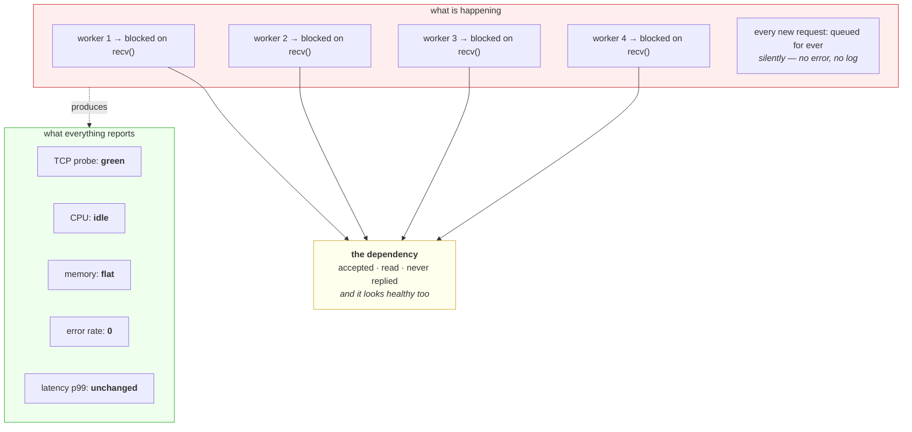

# 5.1 — Hanging `pulse` on purpose

## One-line answer

Today's headline failure: point a service with a small worker pool at a dependency that accepts and never
answers, and watch the service die while its processor sits idle, its memory sits flat, its error rate
stays at zero and a TCP port check reports it healthy.

---

## The story

🎬 **The scene.** A GP surgery with four consulting rooms and a waiting room. Patients are called through as
rooms free up.

😬 **The naive fix.** One patient needs a result from the hospital before anything can be decided. The
doctor phones, is put on hold, and waits — because the call will surely be answered in a moment, and
sending the patient away feels wrong.

💥 **Why it fails.** Nobody at the hospital picks up. The doctor stays on hold. The same thing happens in
the second room, then the third, then the fourth. **Within an hour all four rooms are occupied by doctors
holding telephones**, the waiting room is full, and nobody is being seen — including the people who needed
nothing from the hospital at all. From outside, the surgery looks open. The lights are on, the door is
unlocked, reception is taking names. **Nothing has failed and nothing is happening.**

💡 **The insight.** The rooms were never the scarce thing — **the doctors were**, and each one was spent on
an open-ended wait that nobody had agreed a limit for. A place that admits work faster than it releases its
workers will fill up completely, and it will do it silently, because *waiting* is not an error and nothing
counts it.

---

## The idea in plain language

Every part of this day arrives here.

A service has a **bounded number of things that can be doing work at once** — threads, processes, event-loop
tasks, connections in a pool. Call it the worker pool. It is small: four, sixteen, a few hundred. Not
thousands.

A request that calls a dependency **holds a worker for the whole call**. If the dependency answers in fifty
milliseconds, the worker is returned twenty times a second. If the dependency never answers, and there is
no timeout — part [4.1](../04-timeouts/4.1-a-timeout-is-a-decision-not-a-safety-net.md) — **the worker is
never returned at all.**

So the arithmetic is brutal and short:

**workers ÷ (requests per second that touch the dead dependency) = seconds until your service is gone.**

Four workers, one request per second: four seconds. Two hundred workers, forty requests per second: five
seconds. **The size of the pool buys you almost nothing**, because the failure is not that the pool is too
small — it is that nothing puts anything back.

### Why it is invisible to everything you own

**Processor:** idle. A blocked thread consumes no processor at all. Every CPU graph is flat and low.

**Memory:** flat. A few sockets and stack frames.

**Error rate:** zero. Nothing has failed. There are no exceptions, no non-2xx responses, no log lines —
the requests are still *in progress*, and they will be in progress for ever.

**Latency:** unchanged, or empty. A histogram records a request when it *finishes*. **These requests never
finish, so they are never recorded.** The latency graph is not wrong; it is describing a population that
excludes every affected request. It may even improve, because the only requests still completing are the
fast ones that do not touch the dependency.

**The health check:** depends entirely on what kind it is, which is the sharpest lesson in this part and is
measured below.

**Every one of those is a signal you would have built and trusted**, and this is Day 6's lesson arriving in
a new form: the failure is defined by the absence of evidence.

---

## Why Kriya needs it

Day 9 gives `pulse` a real dependency — a free-tier model provider over the internet, under load from
strangers, with rate limits. **It is the single most likely thing in this system to go slow**, and the
timeout you put on it is decided by this part.

Day 43's readiness probe has to distinguish this state from health, and part
[3.2](../03-the-connection/3.2-the-accept-queue-and-the-backlog.md) plus this drill are why it is an HTTP
request rather than a port check.

Day 65's latency histograms and Day 92's service level objectives both need to survive requests that never
complete, which they do not by default.

Day 87 builds load shedding and circuit breakers — the two mechanisms that exist because of exactly this
failure.

Day 84's incident lab stages this against you without warning. **Today you cause it deliberately, so that
you recognise the shape.**

---

## The mechanism

**This is the day's headline deliberate failure.** Three small files: a dependency that never answers, a
service shaped like `pulse` that calls it without a timeout, and a drill script that measures what your
signals say.

⚠️ **`lab/svc.py` is a drill copy, not `pulse`.** It is deliberately shaped like `pulse` — a `/healthz` and
a `/predict` — and it is deleted at the end of the day. Nothing under `pulse/` is touched.

### The dependency that goes quiet

```python
# days/day-007-networking-for-operators/lab/dep.py
"""A dependency that accepts, reads the request, and never answers."""

import socket
import threading
import time

PORT = 8097

server = socket.socket()
server.setsockopt(socket.SOL_SOCKET, socket.SO_REUSEADDR, 1)
server.bind(("127.0.0.1", PORT))
server.listen(64)
print(f"dependency on {PORT}: accepts, reads, never replies", flush=True)


def handle(conn: socket.socket) -> None:
    """Read the request so the caller believes it was received, then never respond."""
    try:
        conn.recv(4096)
        time.sleep(3600)
    except OSError:
        pass
    finally:
        conn.close()


while True:
    try:
        conn, _ = server.accept()
    except OSError:
        break
    threading.Thread(target=handle, args=(conn,), daemon=True).start()
```

**Line by line:**

- `conn.recv(4096)` **before** the sleep, and this is the design decision that makes the drill realistic. A
  dependency that refused the connection would produce an instant error and no interesting failure. This
  one **accepts the connection and reads the request**, so the caller has every reason to believe it was
  received and is being worked on. **That is what a wedged application actually looks like** — it is not
  down, it is stuck after accepting.
- `time.sleep(3600)` rather than an infinite loop, because a sleeping thread consumes no processor. **The
  dependency must look healthy too**: idle, responsive to new connections, nothing in its own graphs.
- `server.listen(64)` with a generous backlog so the accept queue is never the constraint — the constraint
  under study is the *caller's* worker pool, and part
  [3.2](../03-the-connection/3.2-the-accept-queue-and-the-backlog.md) already covered the other one.
- A thread per connection so the dependency can hold many stuck callers at once without refusing anybody.

### The service shaped like `pulse`

```python
# days/day-007-networking-for-operators/lab/svc.py
"""A pulse-shaped service with FOUR workers. /predict calls the dependency with NO timeout."""

import socket
from concurrent.futures import ThreadPoolExecutor

PORT, WORKERS = 8098, 4
pool = ThreadPoolExecutor(max_workers=WORKERS)

server = socket.socket()
server.setsockopt(socket.SOL_SOCKET, socket.SO_REUSEADDR, 1)
server.bind(("127.0.0.1", PORT))
server.listen(64)
print(f"service on {PORT}: {WORKERS} workers, /healthz and /predict", flush=True)


def call_dependency() -> bytes:
    """The bug, in three lines: a connection with no deadline of any kind."""
    sock = socket.create_connection(("127.0.0.1", 8097))  # NO timeout. this is the bug.
    sock.sendall(b"GET / HTTP/1.0\r\nHost: dep\r\n\r\n")
    return sock.recv(4096)


def handle(conn: socket.socket) -> None:
    """Serve /healthz without touching the dependency; serve everything else by calling it."""
    try:
        request = conn.recv(4096).decode("latin1", "replace")
        path = request.split(" ")[1] if " " in request else "/"
        if path.startswith("/healthz"):
            body = b'{"status":"ok"}'
        else:
            call_dependency()
            body = b'{"prediction":"never gets here"}'
        conn.sendall(b"HTTP/1.1 200 OK\r\nContent-Length: %d\r\n\r\n%s" % (len(body), body))
    except OSError:
        pass
    finally:
        conn.close()


while True:
    conn, _ = server.accept()
    pool.submit(handle, conn)
```

**Line by line:**

- `WORKERS = 4` is small **on purpose**, so the drill completes in seconds rather than requiring a load
  generator. A production service has more workers and exactly the same failure — the pool size changes how
  long it takes, never whether it happens.
- `socket.create_connection(("127.0.0.1", 8097))` **with no `timeout=` argument**, which from part
  [4.1](../04-timeouts/4.1-a-timeout-is-a-decision-not-a-safety-net.md) inherits the global default of
  `None`. **This one missing argument is the entire bug**, and it is the most common form it takes in real
  code: not a bad timeout, an absent one.
- `/healthz` returns without calling the dependency, which is **deliberately the well-written version**.
  Somebody thought about this: the health check does not depend on downstream services, exactly as good
  practice recommends. Watch it fail anyway.
- `pool.submit(handle, conn)` hands each accepted connection to the pool. When all four workers are busy,
  submissions **queue silently** — no error, no rejection, no log line. That silent queue is the
  application-level twin of the accept queue from part
  [3.2](../03-the-connection/3.2-the-accept-queue-and-the-backlog.md).
- `server.accept()` continues to run in the main loop regardless, so **connections keep being accepted
  while nothing is being served.** This is the detail that makes the port check lie.

### The drill

```bash
# days/day-007-networking-for-operators/lab/hang_drill.sh
set -u
BASE=http://127.0.0.1:8098

echo "=== healthz BEFORE ==="
curl -sS --max-time 3 -w ' <- http=%{http_code} t=%{time_total}s\n' "$BASE/healthz"

echo "=== fire 4 /predict requests that will never return ==="
for i in 1 2 3 4; do curl -sS --max-time 60 -o /dev/null "$BASE/predict" & done
sleep 4

echo "=== TCP connect check (what a port probe does) ==="
uv run python -c "
import socket, time
t0=time.monotonic(); s=socket.create_connection(('127.0.0.1',8098),timeout=3); s.close()
print(f'TCP connect to 8098: OK in {(time.monotonic()-t0)*1000:.1f} ms')
"

echo "=== HTTP healthz AFTER (same service, same port) ==="
curl -sS --max-time 5 -w ' <- http=%{http_code} t=%{time_total}s\n' "$BASE/healthz"; echo "curl exit=$?"

echo "=== socket census ==="
netstat -an | grep ':8098' | awk '{print $4}' | sort | uniq -c
netstat -an | grep ':8097' | awk '{print $4}' | sort | uniq -c
```

**Line by line:**

- `set -u` and no `set -e`, deliberately: **the failures are the results**, so the script must keep running
  through commands that exit non-zero. `-u` still catches a genuine mistake like an unset variable.
- The four `/predict` calls run with `&` so they are all in flight simultaneously. **Exactly `WORKERS` of
  them**, which is the smallest number that fills the pool and the clearest demonstration.
- `--max-time 60` on those four so they eventually give up and the drill can be repeated; without it they
  would hold their sockets until you killed them.
- The **TCP connect check before the HTTP one**, in that order, because the contrast between the two is the
  finding and it reads better with the misleading one first.
- The `python -c` block does exactly what a load balancer's port probe does: connect, and close. Nothing
  else.
- The socket census on **both** ports, because the story needs both halves — connections held into the
  service, and connections held out to the dependency.

```bash
cd days/day-007-networking-for-operators/lab && uv run python dep.py & uv run python svc.py & sleep 3 && ./hang_drill.sh
```

**Line by line:** start the dependency first, then the service, then wait long enough for both to bind
before the drill runs. ⚠️ **Both background processes survive the script**, so the cleanup at the end of
this part is not optional.

Observed on **2026-08-26**:

```text
=== healthz BEFORE ===
{"status":"ok"} <- http=200 t=0.056235s

=== fire 4 /predict requests that will never return ===

=== TCP connect check (what a port probe does) ===
TCP connect to 8098: OK in 0.0 ms

=== HTTP healthz AFTER (same service, same port) ===
curl: (28) Operation timed out after 5001 milliseconds with 0 bytes received
 <- http=000 t=5.001637s
curl exit=28

=== socket census ===
      8 ESTABLISHED
      1 LISTENING
      8 ESTABLISHED
      1 LISTENING
```

**Read those two health checks together, because they are the same service at the same moment.**

**The TCP connect check succeeded in 0.0 milliseconds.** Instant, no error, perfectly green. Any load
balancer using a port probe keeps this instance in rotation and keeps sending it traffic.

**The HTTP health check timed out with `http=000`.** No status code at all, because no response ever began
— the same `000` signature Day 6's OOM drill produced, and for the same underlying reason: **there is no
status code for a request that was never answered.**

The gap between those two lines is part
[3.2](../03-the-connection/3.2-the-accept-queue-and-the-backlog.md) in action. The kernel completed the
handshake and put the connection in the accept queue; the main loop accepted it and submitted it to the
pool; **the pool had no workers, so no application code ever ran.** Everything up to the application was
healthy, and the application was gone.

**And the census is the only honest signal in the whole drill.** Eight `ESTABLISHED` on the service and
eight on the dependency — four connections each, counted from both ends on loopback. **Four workers, four
connections held open to a dependency that will never answer, doing nothing, for ever.**

### The five observations

| Signal | What it said | Why it was blind |
| --- | --- | --- |
| TCP port check | **green, 0.0 ms** | answered by the kernel from the accept queue — no application code ran |
| HTTP `/healthz` | **`http=000`, timed out** | correct, and only because it needed a worker — and it was written *not* to depend on the dependency |
| Error rate | **zero** | nothing failed; the requests are still in progress |
| Latency histogram | **unchanged or improved** | a request is recorded when it finishes; these never finish |
| Processor and memory | **idle and flat** | a blocked thread costs nothing |

**Four of the five were green.** The one that was not is the one that needed a worker to answer it — which
is the accidental reason it worked, not the designed one.



### The one-argument fix

```python
sock = socket.create_connection(("127.0.0.1", 8097), timeout=2)
```

**Line by line:** `timeout=2` overrides the `None` default, so `recv()` raises after two seconds and **the
worker is returned.** Add it, re-run the drill, and the service keeps serving `/healthz` throughout while
`/predict` fails honestly. ⚠️ **A failing `/predict` is a vastly better outcome than a dead service**, and
the difference between those two is one keyword argument. The other half — deciding what `/predict` returns
when the timeout fires — is part [4.1](../04-timeouts/4.1-a-timeout-is-a-decision-not-a-safety-net.md)'s
second decision, and a 503 with a retry hint is a perfectly good answer.

### Cleanup — not optional

```bash
netstat -ano | grep -E ':8097|:8098' | awk '{print $5}' | sort -u
```

**Line by line:** `awk '{print $5}'` takes the **pid** column, which `-o` from part
[1.1](../01-the-address/1.1-an-address-and-a-port-are-two-questions.md) added. `sort -u` gives each pid
once. ⚠️ **Read the command line of each pid before killing it**, exactly as part
[1.4](../01-the-address/1.4-the-port-that-was-already-in-use.md) insisted — never kill a pid you have not
identified. Then stop them, and confirm both ports are clear. Sockets left in `TIME_WAIT` with a pid of `0`
are expected and expire by themselves in about two minutes, from part
[3.3](../03-the-connection/3.3-time-wait-and-the-ports-you-ran-out-of.md).

---

## When it breaks

**The drill "worked" and the service kept answering.** The false pass — check for this first.

```text
=== HTTP healthz AFTER ===
{"status":"ok"} <- http=200 t=0.061s
```

**What it says:** the service is fine.

**What it actually means:** the pool was not exhausted, so nothing was measured. Either fewer than
`WORKERS` requests were genuinely in flight — the `&` backgrounding failed, or the shell waited for each
one — or one of the `/predict` calls errored immediately instead of hanging, which happens if `dep.py` was
not running and the connection was **refused** rather than accepted.

**The smallest fix:** confirm the dependency is up first, and confirm the census shows exactly `WORKERS`
established connections on port 8097 before drawing any conclusion.

**Why this matters more than the drill itself:** ⚠️ **a failure experiment that quietly did not happen is
worse than no experiment**, because you now believe something you have not tested. Day 6's drill carried
the same warning about a request that was not genuinely in flight, and it is the same discipline: **verify
that the failure occurred before you record what it looked like.**

**A service that recovers and then dies again, repeatedly.** The version with a timeout and no brake.

```text
# with timeout=2 added, under sustained load:
p99 latency: 2.1 s   error rate: 61%   CPU: 3%
```

**What it says:** the timeout is working.

**What it actually means:** it is, and it is not enough on its own. Every request still waits the full two
seconds before failing, so the service spends all its capacity failing slowly. **A timeout converts an
outage into a degradation**, which is the right direction and is not the destination.

**The smallest fix:** a circuit breaker — after enough consecutive failures, stop calling the dependency
at all and fail immediately, then probe occasionally to see whether it has recovered. Day 87 builds it.

**Why the timeout is still the first thing to do:** because without it there is nothing to trip a breaker
*on*. **Bound first, then be clever.**

**`CLOSE_WAIT` piling up on the dependency.** The other end of the same story.

```text
$ netstat -an | grep ':8097' | awk '{print $4}' | sort | uniq -c
     47 CLOSE_WAIT
```

**What it says:** forty-seven sockets in `CLOSE_WAIT`.

**What it actually means:** the callers gave up and closed their side; the dependency's threads are still
sleeping and have never called `close()`. **`CLOSE_WAIT` is the unambiguous signature of an application
that has been told the connection is over and has not noticed** — unlike `TIME_WAIT` from part
[3.3](../03-the-connection/3.3-time-wait-and-the-ports-you-ran-out-of.md), which is the kernel doing its
job, `CLOSE_WAIT` accumulating is always an application bug, and each one holds a file descriptor until the
process exits.

**The smallest fix:** in this drill, stop the dependency. In real code, close connections in a `finally`,
and find whatever is blocking the thread that should have.

**The distinction worth memorising:** **many `TIME_WAIT` is usually normal; many `CLOSE_WAIT` is always a
bug.** It is one of the highest-value things a socket census can tell you, and it takes one command.

**The dependency was never slow — you were.** The mirror image.

```text
# your service: p99 30 s, workers all busy
# the dependency: p99 40 ms, CPU 4%, no errors
```

**What it says:** both sides blame each other, with evidence.

**What it actually means:** your pool is exhausted by something else entirely — a slow database call, a
lock, a synchronous file read on the event loop — and requests are queueing for a worker before the
dependency is ever contacted. **The dependency's numbers are correct and irrelevant.**

**The smallest fix:** measure the pool-acquire wait, part
[4.2](../04-timeouts/4.2-the-four-timeouts-of-one-request.md)'s fifth phase, which is the only signal that
distinguishes *waiting for a worker* from *waiting for a dependency*.

**Why it belongs here:** because the drill teaches a shape, and the shape has more than one cause. **Worker
exhaustion is the diagnosis; the dead dependency is only the most common reason for it.**

---

## In production

**What a professional writes instead of the teaching version.** Every outbound call has a deadline, and the
service has a **bounded queue** rather than an unbounded one — when there is no worker available within a
short wait, the request is rejected immediately with a 503 rather than queued for ever. That is load
shedding, and it is the difference between a service that degrades and one that disappears. They also
instrument the pool itself: workers busy, queue depth, and pool-acquire time are three cheap series that
make this entire failure visible from the first second.

**What degrades at scale.** The time to death shrinks as traffic grows, which is the opposite of the
intuition that a bigger service is more robust. Four workers at one request per second gives you four
seconds; two hundred workers at forty requests per second gives you five. **Adding capacity buys seconds,
not safety**, because the mechanism is a leak rather than a shortage. The only things that change the
outcome are a bound on the wait and a bound on the queue.

**The failure that only shows with real traffic.** The partial dependency. A dependency that hangs on
*some* requests — one tenant, one code path, one shard — leaks workers slowly rather than all at once. The
service works normally for hours and then falls over with no deploy, no traffic spike and no error rate to
correlate against, because the leak rate was two workers an hour and the pool had two hundred. **The only
signal that would have shown it is workers-busy trending upward over hours**, which nobody is watching
because it is not a threshold anybody has ever crossed.

**The review comment a senior engineer leaves.** *"This call has no timeout, so one slow response holds a
worker for ever and roughly `workers ÷ RPS` seconds of that takes the whole service down — including the
endpoints that do not touch this dependency at all. Add a deadline and decide what `/predict` returns when
it fires. Separately: our load balancer is using a TCP port check, which will stay green through the entire
outage, so please move it to `/healthz` in the same change."*

**The signal you would alert on.** **Workers busy as a fraction of the pool**, which is the single most
direct measurement of this failure and is nearly free to export. It rises smoothly towards one and gives
you warning before anything breaks, unlike every other signal in the table above. Then **queue depth** and
**pool-acquire time**, both of which should sit at approximately zero on a healthy service, so any
sustained non-zero value is meaningful without threshold guessing. Then **in-flight request count and age**
— the age of the oldest in-flight request is the one signal that sees a request which never completes,
because everything else records on completion. You would **not** rely on error rate, latency, processor or
memory, all four of which this drill proved blind. And ⚠️ you would **not** use a TCP port check as a
health check anywhere, for the reason measured above.

**Blast radius.** This drill runs two servers on loopback and opens five connections. Nothing leaves the
machine, nothing is written, and no project code is touched — `lab/svc.py` is a drill copy that is deleted
at the end of the day. **The capability worth naming is the technique rather than this instance**: a
server that accepts connections and never answers is a deliberate resource-exhaustion tool, and pointing
one at somebody else's client, or pointing many clients at a real service in this shape, is an attack
rather than an experiment. ⚠️ **Keep both ends on `127.0.0.1`.** The other bound is the one this part keeps
repeating: **both background processes survive the drill script**, they hold sockets and threads, and one
of them sleeps for an hour. Confirm with `pgrep` or `netstat -ano` that both are stopped before you finish
the day, exactly as Day 6 insisted for its allocators.

**Cost.** `0` model calls, `0` tokens, `0` CI minutes, `0` disk. **Network: nothing leaves the machine.**
RAM is negligible — two small Python processes and a handful of threads. About twenty seconds of deliberate
waiting, and roughly ten sockets held for the duration of the drill.

**The interview question.** *"A dependency stops responding — it accepts connections but never replies.
Walk me through what happens to your service and what your monitoring shows."* The answer that lands
describes the silence: *"My service dies, and almost nothing tells me. Each request that calls the
dependency holds a worker for the whole call, and with no timeout that is for ever, so the pool drains at
the rate of requests touching that dependency — workers divided by that rate is roughly how many seconds I
have. What is nasty is what the signals say. Processor is idle, because blocked threads cost nothing.
Memory is flat. Error rate is zero, because nothing has failed — the requests are still in progress. And
latency looks fine or better, because a histogram records a request when it completes and these never
complete, so the only requests being measured are the fast ones that avoided the dependency. If the health
check is a TCP port probe it stays green throughout, since the kernel completes the handshake and parks the
connection in the accept queue without any application code running. The signals that would have caught it
are workers busy as a fraction of the pool, queue depth, and the age of the oldest in-flight request — the
last one specifically because it is the only measurement that can see a request that never finishes. The
fix is a deadline on the call, then a bounded queue so overflow is rejected rather than queued, and then a
circuit breaker so we stop paying the timeout on every request once we know it is down."*

---

## Check yourself

```bash
cd days/day-007-networking-for-operators/lab && ./hang_drill.sh
```

**The two lines to put side by side are the TCP check and the HTTP check** — `OK in 0.0 ms` against
`http=000` — because they describe the same service, at the same instant, and one of them is a lie you
would have shipped. Record all five observations from the table before you read the explanation again, and
then **confirm both background processes are stopped.**

**Say out loud, without scrolling up:** *give the arithmetic that turns a pool size and a request rate into
a time-to-death, name the four signals that stayed green and say why each was blind, and name the one
measurement that can see a request which never completes.*
