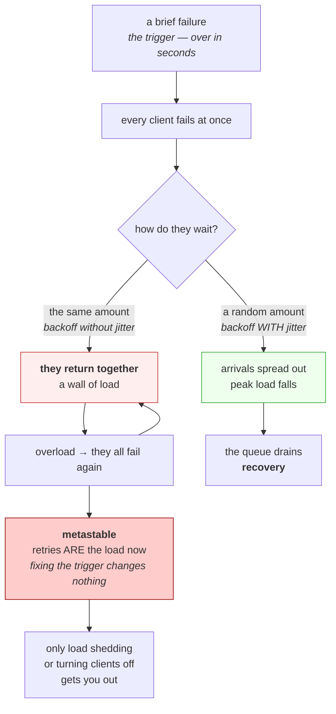

# 5.2 — Retries, backoff and the storm you caused

## One-line answer

A retry is extra load aimed at a system that has just demonstrated it cannot cope — so retries multiply
traffic exactly when there is least of it to spare, and because every client backs off by the same amount
they come back **together**, which is why a brief failure so often turns into a long one.

---

## The story

🎬 **The scene.** A block of flats loses power for about ten seconds on a winter evening. Sixty flats, all
with electric heating, all with the thermostat set to twenty degrees.

😬 **The naive fix.** Nobody does anything. The power comes back on by itself, which is exactly what should
happen.

💥 **Why it fails.** Every heater in the building had switched itself off, and every one of them switches
back on **at the same instant**, all calling for full power because every flat has cooled slightly. The
building's supply is sized for the ordinary situation where heaters cycle independently, not for sixty of
them starting together. The breaker trips. Now the power is properly off, and when somebody resets it, the
same sixty heaters start together again. **The ten-second outage is over and the building has been dark for
half an hour**, and the cause is no longer the original fault — it is everybody responding to it
identically.

💡 **The insight.** When many independent things react to one event, **the event synchronises them**, and a
system that copes easily with the same total load spread out cannot cope with it arriving at once. The
recovery becomes the outage, and it keeps happening because each attempt to recover re-creates the
conditions that caused it.

---

## The idea in plain language

Part [4.3](../04-timeouts/4.3-the-timeout-that-bounded-nothing.md) looked at retries from the caller's
side, where they multiply latency. This part looks from the receiving end, where they multiply **load**.

**Every retry is a request.** A client configured for three retries turns one user request into up to four
requests at the dependency. That is a **four-times amplification**, and it applies precisely when the
dependency is failing — which is to say, when it is already unable to serve the traffic it has.

### The three things that make it worse than it sounds

**Amplification compounds across layers.** From part 4.3: the application retries, the sidecar retries, the
ingress retries. Three at three each is twenty-seven requests reaching the backend for one at the front.

**Retries are synchronised by the failure.** All clients see the failure at roughly the same moment, and if
they all wait the same amount of time, they all come back at the same moment. **The failure is a clock that
everybody is now reading**, which is the flats' heaters exactly.

**The load stays after the cause has gone.** This is the one worth naming carefully. Once retries are the
majority of your traffic, the system stays overloaded **because of the retries**, not because of the
original trigger. Fixing the trigger changes nothing; the system holds itself down. This is called a
**metastable failure** — a stable state the system fell into and cannot leave without outside intervention,
usually shedding load or turning clients off.

### The three fixes, in order of importance

**Backoff.** Wait longer after each failure, usually doubling. This reduces total volume, and on its own it
does **not** solve synchronisation, because doubling is the same number for everybody.

**Jitter.** Randomise the wait. This is the fix for synchronisation, it is one line, and it is the one
people leave out because it looks like a detail. **It is not a detail; it is the whole of the fix for the
storm.**

**A budget.** Cap retries as a *fraction of traffic* — say, retries may be at most ten percent of requests —
rather than as a per-request count. A count guarantees amplification is worst when things are worst; a
budget makes amplification bounded no matter how bad it gets.

### And the prior question: should this be retried at all?

**Retry only what can succeed on a second attempt, and only what is safe to repeat.**

- Not `NXDOMAIN`, from part
  [2.4](../02-names/2.4-when-a-name-fails-nxdomain-servfail-and-silence.md) — it is a definitive answer.
- Not a 4xx: the request is wrong, and it will be wrong again.
- **Not a timeout on anything that writes**, because a timeout does not tell you whether the work happened
  — part [3.4](../03-the-connection/3.4-connection-refused-versus-connection-timed-out.md) — so retrying
  may do it twice. Day 88's idempotency keys exist for this.
- Yes to a connection refused, a 503, a 429 with a `Retry-After`, and a `SERVFAIL`.

---

## Why Kriya needs it

Day 9 is the day this becomes real. A free-tier model provider returns **HTTP 429** as a matter of routine,
and the addendum's rule is explicit: every model call path handles 429 with `retry-after` and backoff, then
escalates honestly. **That retry policy is written on Day 9 and designed here.**

Day 43's probes retry by design — `failureThreshold` is a retry count — and Day 46's ingress and Day 50's
mesh add layers that retry without telling you.

Day 87 builds circuit breakers and load shedding, which are the two answers to the metastable state this
part describes.

Day 84's incident lab includes an outage whose trigger has already been fixed. **Recognising a system that
is holding itself down is the entire exercise**, and it is not obvious the first time.

---

## The mechanism

The volume is easy arithmetic. The **timing** is the part that surprises people, so make it visible.

⚠️ **This is arithmetic, not a network measurement.** It computes when retries would arrive; it sends no
traffic. That is deliberate — the honest way to demonstrate a retry storm is to compute it, because the
demonstration that involves actually generating one requires a victim.

```python
# days/day-007-networking-for-operators/lab/storm.py
"""Arithmetic, not a network measurement: when do 60 retrying clients arrive?"""

import random
from collections import Counter

CLIENTS, ATTEMPTS, BASE = 60, 4, 1.0
random.seed(7)


def arrivals(jitter: bool) -> Counter:
    """Second-by-second arrival counts for CLIENTS clients each making ATTEMPTS attempts."""
    out = []
    for _ in range(CLIENTS):
        elapsed = 0.0
        for attempt in range(ATTEMPTS):
            delay = BASE * (2**attempt)
            out.append(round(elapsed + (random.uniform(0, delay) if jitter else delay)))
            elapsed += delay
    return Counter(out)


for label, jitter in (("fixed backoff", False), ("full jitter", True)):
    counts = arrivals(jitter)
    print(f"\n{label}: peak {max(counts.values())} arrivals in one second")
    for second in sorted(counts):
        if second <= 16:
            print(f"  t+{second:2d}s {'#' * counts[second]} {counts[second]}")
```

**Line by line:**

- `random.seed(7)` fixes the randomness so **the output is reproducible**. A demonstration whose numbers
  change every run cannot be compared against the one in this document, and reproducibility matters more
  here than variety.
- `delay = BASE * (2 ** attempt)` is exponential backoff: one second, two, four, eight. **This is the
  standard advice, applied correctly**, and the first half of the output shows it is not enough by itself.
- `random.uniform(0, delay)` is the jitter: instead of waiting exactly the backoff, wait a random amount
  **up to** it. Note that it can be *shorter* than the fixed version — jitter is not politeness, it is
  **decorrelation**, and clients arriving early is as useful as clients arriving late.
- `elapsed += delay` advances by the full backoff regardless, so both scenarios span the same total window
  and the only variable is *where inside it* each attempt lands.
- `Counter` and the `'#' * count` bar turn a list of numbers into a shape you can see. **The shape is the
  finding**, and a table of sixty numbers would hide it.

```bash
uv run python days/day-007-networking-for-operators/lab/storm.py
```

**Line by line:** no arguments, and no network access of any kind — this script computes and prints.

Observed on **2026-08-26**:

```text
fixed backoff: peak 60 arrivals in one second
  t+ 1s ############################################################ 60
  t+ 3s ############################################################ 60
  t+ 7s ############################################################ 60
  t+15s ############################################################ 60

full jitter: peak 38 arrivals in one second
  t+ 0s ###################################### 38
  t+ 1s ##################################### 37
  t+ 2s ############################### 31
  t+ 3s ########################## 26
  t+ 4s ############## 14
  t+ 5s ######### 9
  t+ 6s ################# 17
  t+ 7s ########### 11
  t+ 8s ########## 10
  t+ 9s ###### 6
  t+10s ####### 7
  t+11s #### 4
  t+12s ###### 6
  t+13s ############ 12
  t+14s ####### 7
  t+15s ##### 5
```

**Both halves send exactly the same number of requests: sixty clients, four attempts, two hundred and forty
in total.** The volume is identical. Only the distribution differs, and it differs completely.

**The top half is four walls.** Sixty simultaneous arrivals, four times, with total silence in between. A
dependency that could comfortably serve sixty requests spread over a second is asked for all sixty in the
same instant, four separate times. **The exponential backoff worked perfectly and changed nothing about the
shape**, because doubling one second is the same as doubling one second for everybody.

**The bottom half is a slope.** The peak falls from sixty to thirty-eight, and — more importantly — **there
are no gaps.** Load arrives continuously instead of in walls, which is what a queue can absorb. And notice
that the tail thins out on its own: by the end, arrivals are down to single figures per second.

**The line that produces that difference is `random.uniform(0, delay)`.** One call, and it is the most
commonly omitted line in retry code.



**Follow the loop on the left.** It has no exit that does not involve somebody deliberately removing load,
and it keeps running long after the original cause is gone. **That loop is why retries are dangerous
rather than merely wasteful.**

### The amplification, stated plainly

| Layers retrying | Attempts each | Requests at the backend, per user request |
| --- | --- | --- |
| 1 | 3 | 3 |
| 2 | 3 | 9 |
| 3 | 3 | **27** |
| 3 | 2 | 8 |

**The right column is the one to remember**, and the fourth row is the argument: reducing attempts from
three to two across three layers takes twenty-seven down to eight. **Small changes to a multiplier are
large changes to a product**, and the best value of all is one retrying layer rather than three.

---

## When it breaks

**The trigger was fixed and the outage continued.** The metastable state, met for real.

```text
14:02  database failover completes, database healthy
14:02  service error rate: 94%
14:20  database still healthy, still idle
14:20  service error rate: 91%
14:24  clients disabled at the load balancer
14:26  error rate: 0%
```

**What it says:** the dependency was healthy for twenty minutes while the outage continued.

**What it actually means:** retries had become the majority of traffic. Every client was retrying, the
retries kept the service saturated, and the saturation kept producing the failures that caused the retries.
**The system was the cause of its own outage**, and the original trigger had been gone for the whole time.

**The smallest fix:** shed load — reject most requests immediately so the queue drains — or turn clients
off and let them back gradually. Both are deliberate acts by a person; the system will not leave this state
by itself.

**Why it is the hardest incident to run:** every instinct says to look for what is still broken, and
nothing is. ⚠️ **A system that stays down after the cause is fixed is a signature, not a mystery**, and
recognising it in the first few minutes is worth more than any tool.

**Retries against a rate limit, making the rate limit worse.** Day 9's version.

```text
HTTP/1.1 429 Too Many Requests
Retry-After: 20
```

**What it says:** you are over your limit; come back in twenty seconds.

**What it actually means:** the server has told you exactly how long to wait. A client that ignores
`Retry-After` and applies its own one-second backoff sends twenty times more requests than asked, **every
one of which is rejected**, and on many providers those rejections count against the very quota you are
trying to preserve.

**The smallest fix:** honour `Retry-After` when it is present. It is a header with a number in it and it is
better information than any backoff algorithm you can write, because it comes from the thing doing the
limiting.

**Why it matters here specifically:** Addendum 01 requires every model call path to handle 429 with
`retry-after` and backoff. **That is not a style preference** — the free tiers this curriculum runs on are
shared, and a client that ignores the header is taking capacity from everybody else on it.

**Retried a write, and it happened twice.** The correctness failure hiding in a reliability feature.

```text
$ curl --retry 3 -X POST https://api.example.com/charge -d '{"amount": 4000}'
# ... two charges appear
```

**What it says:** one command, retried.

**What it actually means:** the first attempt reached the server and was processed; the **response** was
lost, or the client timed out before it arrived. From part
[3.4](../03-the-connection/3.4-connection-refused-versus-connection-timed-out.md): **a timeout tells you
nothing about whether the request arrived.** The retry did the work again.

**The smallest fix:** do not retry non-idempotent requests by default. Where you must, send an idempotency
key so the server can recognise the repeat — Day 88.

**The distinction worth holding:** ⚠️ `--retry` and its equivalents are safe for reads and **dangerous for
writes**, and the flag does not know the difference. A retry policy applied globally to a client that does
both is a correctness bug waiting for a slow day.

**Jitter added, storm continued.** The subtle one.

```text
peak arrivals: 58 (jitter enabled)
```

**What it says:** jitter is on and the peak barely moved.

**What it actually means:** the jitter is too small — a random fraction of a second added to a fixed
one-second wait leaves the arrivals almost as synchronised as before. **Jitter has to be on the scale of
the wait itself**, which is what `random.uniform(0, delay)` does and what a small additive fudge does not.

**The smallest fix:** randomise across the whole interval, not around it.

**Why it is worth checking rather than assuming:** "we have jitter" is frequently true and frequently
useless, and the arithmetic above is a cheap way to see which. **Run the numbers for your own settings**;
it takes one small script and no traffic.

---

## In production

**What a professional writes instead of the teaching version.** Retries with exponential backoff **and**
full jitter, honouring `Retry-After` when the server sends one, applied only to idempotent operations and
retryable outcomes, bounded by a **retry budget** expressed as a fraction of traffic rather than a count per
request, and constrained by the remaining deadline — part
[5.3](5.3-the-deadline-that-travels.md) — so no attempt is started that cannot finish in time to be useful.
And critically: **retrying at exactly one layer**, chosen deliberately, with the others configured off.

**What degrades at scale.** Amplification is a percentage of traffic, so its absolute size grows with you
while the dependency's capacity does not grow at the same moment. At small scale a retry storm is absorbed
by headroom nobody notices; at large scale it exceeds capacity by a multiple. **The threshold is crossed
silently**, because nothing about the configuration changes — the traffic does — and the first indication
is an outage that behaves differently from every previous one.

**The failure that only shows with real traffic.** Synchronisation itself. It **cannot** be reproduced with
one client, because one client cannot be synchronised with anything. Every retry policy tested by a single
developer against a single instance looks perfect, and the failure mode is a property of the *population*
rather than of the client. This is one of the clearest examples in the curriculum of a bug that lives in
the space between correct components, and it is why the mechanism above is arithmetic over sixty clients
rather than a run of one.

**The review comment a senior engineer leaves.** *"Backoff with no jitter. Every client that fails at the
same moment will retry at the same moment, so we have converted a smooth overload into four spikes and the
dependency sees the whole population at once. Use the full interval as the random range. Also cap retries
as a fraction of total requests rather than per call, so that when everything is failing we amplify by ten
percent rather than by four hundred."*

**The signal you would alert on.** **Retries as a proportion of total requests**, which is the direct
measurement of amplification and should sit at a low single-digit percentage. A rise means either a
dependency is degrading or a policy is misbehaving, and either way it is the earliest available warning —
it moves before error rates do, because the retries are succeeding at first. You would also alert on
**attempt count per logical request** from part [4.3](../04-timeouts/4.3-the-timeout-that-bounded-nothing.md),
and on **429 rate specifically**, since it is the one error that explicitly means *you are sending too
much* and it is directly actionable. You would **not** alert on retry count alone, which scales with
traffic and therefore has no meaningful threshold. ⚠️ And be careful about a dashboard that counts
*requests* without distinguishing attempts from logical requests: during a storm those two numbers diverge
by the amplification factor, and a graph that conflates them shows a traffic spike that never happened.

**Blast radius.** The script in this part sends **nothing at all** — it computes arrival times and prints a
histogram. That is a deliberate choice about the shape of the demonstration: generating a real retry storm
requires a real target, and there is no safe one. ⚠️ **The capability being taught is genuinely dangerous
in a way most of this curriculum is not.** A retry policy is a few lines of configuration, it costs nothing
while everything is healthy, and it multiplies load precisely when a dependency is least able to survive
it. Worst case: a client fleet that turns a brief blip into a self-sustaining outage which continues after
the trigger is repaired, cannot be exited by fixing anything, and requires somebody to deliberately turn
customers off. Who can trigger it: anybody editing a client's configuration, or enabling retries at a proxy
layer on behalf of every service simultaneously — which is one checkbox in most service meshes. What bounds
it: jitter, a retry budget as a fraction of traffic, one retrying layer, honouring `Retry-After`, and
**never retrying an operation that is not safe to repeat.**

**Cost.** `0` model calls, `0` tokens, `0` CI minutes, `0` disk, negligible RAM. **Network: nothing at
all** — this part sends no traffic anywhere, by design. The script runs in well under a second.

**The interview question.** *"A dependency had a brief blip. Twenty minutes later it is completely healthy
and your service is still failing. What happened?"* The answer that lands names the state: *"That is a
metastable failure, and it is almost always retries. Every client failed at the same instant, so they all
retried at the same instant — exponential backoff does not fix that, because doubling the wait is the same
number for everybody, so they arrive as a wall rather than a stream. That wall overloads the dependency,
which causes more failures, which causes more retries, and now the retries *are* the load. The original
trigger is irrelevant; the system is holding itself down, and it will not recover on its own no matter how
long I wait. The way out is to remove load deliberately — shed most requests so the queue drains, or turn
clients off and bring them back gradually. What prevents it is jitter, which is the actual fix for
synchronisation and the line people leave out, plus a retry budget expressed as a percentage of traffic
rather than a count per request, so amplification stays bounded when everything is failing. And I would
check how many layers are retrying, because three layers at three attempts each is twenty-seven requests at
the backend for one at the front, and no single layer's configuration looks unreasonable."*

---

## Check yourself

```bash
uv run python days/day-007-networking-for-operators/lab/storm.py
```

Same volume, two shapes. **The number to write down is the peak** — sixty against thirty-eight — because
the total load was identical and only the peak decides whether a dependency survives. Then change
`CLIENTS` to your own realistic number and `ATTEMPTS` to whatever your client is configured for, and look
at the top half again.

**Say out loud, without scrolling up:** *say why exponential backoff alone does not prevent a retry storm,
name the one line that does, and explain what a metastable failure is and why waiting does not end one.*
