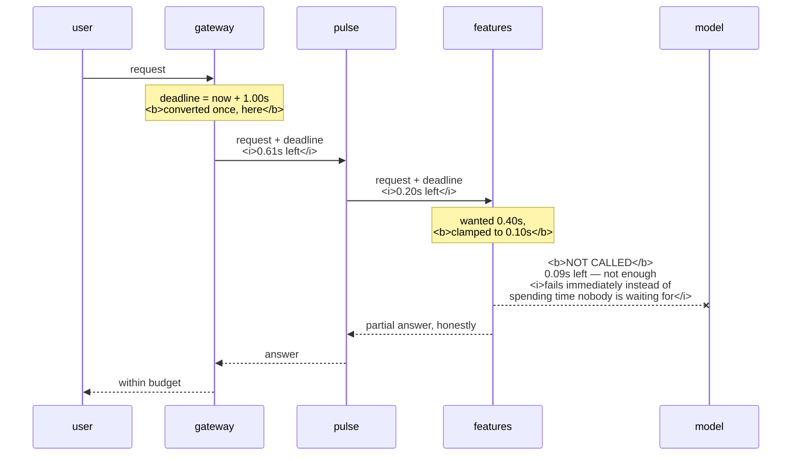

# 5.3 — The deadline that travels

## One-line answer

A timeout is a duration each service invents for itself, so a chain of four services with five-second
timeouts can take twenty seconds — a **deadline** is a point in time passed down the chain, so every hop
knows how long is genuinely left and refuses to start work whose answer nobody will still want.

---

## The story

🎬 **The scene.** A family is trying to get out of the door for a train at half past eight. One parent is
doing the school bags, one is making sandwiches, a child is looking for a shoe.

😬 **The naive fix.** Everybody is told to be quick.

💥 **Why it fails.** *Quick* means something different to each of them, and none of them knows the train
time. The sandwiches take eleven minutes because that is a reasonable time to make sandwiches. The shoe
hunt takes nine because it is genuinely lost. Each task was done at a defensible pace and **nobody was
tracking the one number that mattered**, which was the clock on the wall. They miss the train by four
minutes, holding sandwiches nobody now has time to eat.

💡 **The insight.** Telling everybody to hurry is not a plan. **Telling everybody the actual time of the
train is**, because then each person can decide for themselves whether their task still fits — and the one
who realises theirs does not can stop, which is the decision that saves the morning. The sandwiches were
not too slow; they were started when there was no longer time for them.

---

## The idea in plain language

Every timeout so far in this day has been a **duration**: five seconds, two seconds, thirty seconds. A
duration is a local number that each service invents without reference to anybody else.

A **deadline** is different. It is a *point in time* — *this answer is worthless after 09:14:22.310* — and
it is passed from caller to callee along with the request.

### Why the difference is not pedantic

Consider four services in a chain: a gateway calls `pulse`, `pulse` calls a feature store, the feature
store calls a model. Each is written by a careful person who sets a five-second timeout.

**With durations, the worst case is twenty seconds.** Each hop independently permits five, and they
compose by addition. Meanwhile the user's browser gave up at three.

**With a deadline, the worst case is whatever the first caller set.** The gateway computes *now plus three
seconds* and sends that. Each hop subtracts what it has already spent and passes on the remainder. The
model receives *you have four hundred milliseconds* and can decide whether that is enough.

### The three things a deadline lets you do that a duration cannot

**Refuse to start.** If two hundred milliseconds remain and this call typically takes eight hundred, **do
not make it.** Fail immediately, cheaply, and honestly. A duration cannot express this, because the callee
has no idea how much of the budget has already been spent.

**Bound retries correctly.** From part [4.3](../04-timeouts/4.3-the-timeout-that-bounded-nothing.md), a
retry count multiplies. A deadline does not: retry as many times as you like, but **only while the budget
lasts**, and the multiplication disappears. This is the clean answer to the composition problem, and it is
why deadlines matter more than retry policies.

**Stop work already in progress.** When the deadline passes, everything downstream can be cancelled rather
than left running. Otherwise a chain keeps computing an answer for a request that was abandoned at the
front, which is work paid for and never delivered — exactly when the system is busiest.

### The rule that follows

**Timeouts must shrink as you go down a chain, never grow.** A service whose timeout for its dependency is
longer than the deadline it was given is guaranteed to produce answers nobody is waiting for. It is a
common configuration and it is always wrong.

---

## Why Kriya needs it

Day 9 makes `pulse` a middle link: something calls `pulse`, and `pulse` calls a model. **The timeout on the
model call must be smaller than the time `pulse`'s own caller allows**, and this part is where that
constraint is stated.

Day 41 onward puts real chains in a cluster — ingress to service to service — and Day 50's mesh adds hops
you did not write.

Day 71 propagates trace context between services, and a deadline travels the same way, in a header, on the
same plumbing. **If you can propagate a trace ID you can propagate a deadline**, and the second is worth
more during an incident.

Day 87's load shedding needs to know whether a request is still worth serving, and the deadline is that
answer.

Day 92's service level objectives are stated as a time from the user's point of view. **A deadline is that
objective, made available to every component**, rather than a promise only the front door has heard of.

Day 175 onward runs agents that chain many calls, where a budget that composes is the difference between a
bounded task and an unbounded bill.

---

## The mechanism

The arithmetic first, because it is the whole argument.

| | Gateway | `pulse` | Feature store | Model | Worst case | User waited |
| --- | --- | --- | --- | --- | --- | --- |
| **Durations** | 5 s | 5 s | 5 s | 5 s | **20 s** | gave up at 3 s |
| **Deadline** | budget 3 s | 2.6 s left | 1.9 s left | 0.4 s left | **3 s** | got an answer or an honest failure |

**The right-hand column is the point.** In the first row, seventeen of the twenty seconds are spent
producing something nobody will receive.

Now the code. A deadline is a small object with two methods, and that is genuinely all it is.

```python
# days/day-007-networking-for-operators/lab/deadline.py
"""A deadline is a point in time. Each hop spends from it and passes on what is left."""

import time


class Deadline:
    """An absolute point after which an answer is no longer wanted."""

    def __init__(self, budget: float) -> None:
        self.at = time.monotonic() + budget

    def remaining(self) -> float:
        """Seconds left, never negative."""
        return max(0.0, self.at - time.monotonic())

    def expired(self) -> bool:
        return self.remaining() <= 0.0


def hop(name: str, deadline: Deadline, cost: float, reserve: float = 0.10) -> bool:
    """Do one hop's work inside whatever budget is left, or refuse to start."""
    left = deadline.remaining()
    if left <= reserve:
        print(f"  {name:<10} SKIPPED  - {left:.2f}s left, not enough to be useful")
        return False
    budget = min(cost, left - reserve)
    print(f"  {name:<10} start with {left:.2f}s  -> spends {budget:.2f}s")
    time.sleep(budget)
    return True


print("caller gave us a 1.00s budget; the chain wants 0.40s per hop\n")
deadline = Deadline(1.00)
for name in ("gateway", "pulse", "features", "model"):
    if not hop(name, deadline, 0.40):
        break
print(f"\ndone, {deadline.remaining():.2f}s left on the clock")
```

**Line by line:**

- `time.monotonic()` and **never** the wall clock. A deadline compared against a clock that can jump —
  because of a time synchronisation correction, or a daylight-saving change — will occasionally expire
  instantly or never. **Monotonic time only moves forward at one second per second**, which is the only
  property a deadline needs.
- `self.at = time.monotonic() + budget` converts a duration into a point **once, at the front door**. Every
  hop after this compares against that point rather than starting a new clock, which is precisely the
  difference this part is about.
- `max(0.0, ...)` in `remaining()` so an expired deadline reports zero rather than a negative number. A
  negative budget silently passed into a timeout parameter means *no timeout* in several libraries, which
  turns an expired deadline into an unbounded wait — **the exact opposite of the intent**, and a genuine
  bug worth defending against in three characters.
- `reserve` holds back a little of the budget so there is time to **return** the answer. A hop that spends
  every remaining millisecond computing produces a result at the exact instant the deadline passes, and the
  caller never receives it. **Reserving is what makes the last hop useful rather than merely fast.**
- `budget = min(cost, left - reserve)` is the clamp: take what you wanted, or what is available, whichever
  is smaller. **This one line is deadline propagation.** Everything else is bookkeeping.
- `if left <= reserve` is the refusal — the decision a duration cannot express, and the one that saves the
  most work.
- The output uses `->` and `-` rather than arrows and em dashes because ⚠️ **this console is cp1252 and a
  `print` containing a Unicode arrow raises `UnicodeEncodeError`**, which is a spectacularly annoying way
  for a demonstration to fail. `scripts/depth_check.py` reconfigures its own streams for this reason.

```bash
uv run python days/day-007-networking-for-operators/lab/deadline.py
```

**Line by line:** no arguments. The budget of one second and the per-hop cost of four hundred milliseconds
are in the file, so the run is reproducible and the numbers below can be compared against yours.

Observed on **2026-08-26**:

```text
caller gave us a 1.00s budget; the chain wants 0.40s per hop

  gateway    start with 1.00s  -> spends 0.40s
  pulse      start with 0.61s  -> spends 0.40s
  features   start with 0.20s  -> spends 0.10s
  model      SKIPPED  - 0.09s left, not enough to be useful

done, 0.09s left on the clock
```

**Four hops, and every one of them behaved differently.**

**The first two got what they asked for**, because there was enough budget.

**The third was clamped.** It wanted four hundred milliseconds and was given one hundred, because that was
what remained after reserving. It was not told *no*; it was told *less*. **A duration-based timeout cannot
do this at all** — it would have taken its full four hundred and pushed the total to one and a quarter
seconds.

**The fourth was refused.** Ninety milliseconds remained, which is not enough to be useful, so the call was
never made. **That is the most valuable line in the output**: work that would have been wasted was
identified as wasted *before* it was done, and the failure was returned immediately instead of four hundred
milliseconds later.

**And the total came in under budget**, with ninety milliseconds left on the clock to return an answer.



**Compare that with the duration version**, where the gateway waits five seconds for `pulse`, which waits
five for features, which waits five for the model — and the user left after three.

### Where the deadline actually travels

In HTTP it is a header. There is no single universal standard, and the two common shapes are a remaining
duration in milliseconds, or an absolute timestamp. **A remaining duration is easier and safer**, because
it needs no agreement about clocks between machines — each hop subtracts its own elapsed time and passes on
a smaller number, and nobody has to trust anybody else's idea of what time it is.

⚠️ **This is not built today.** `pulse` has no callers and no dependencies yet. It is stated here because
Day 9 adds the first dependency and Day 41 adds the first real chain, and the decision is much cheaper to
make before there is anything to change.

---

## When it breaks

**A timeout that grows down the chain.** The configuration that guarantees wasted work.

```text
gateway  → pulse:     timeout 2 s
pulse    → features:  timeout 5 s
```

**What it says:** two sensible numbers.

**What it actually means:** `pulse` will wait up to five seconds for something whose answer its own caller
stopped wanting after two. **Three of those five seconds are guaranteed waste**, every single time the
dependency is slow, and they are spent holding a worker — part
[5.1](5.1-hanging-pulse-on-purpose.md)'s scarce resource.

**The smallest fix:** each hop's timeout must be smaller than the deadline it was given, with room to spare
for returning the answer.

**Why it is so common:** the two numbers live in different repositories, owned by different teams, and
neither configuration mentions the other. ⚠️ **Nothing will ever warn you about this**; it is only visible
if somebody puts the numbers side by side, which is what the arithmetic table above is for.

**A deadline that expired and was passed on anyway.** The negative-budget bug.

```python
remaining = deadline.at - time.monotonic()  # -0.4
client.get(url, timeout=remaining)  # timeout=-0.4
```

**What it says:** a timeout of minus four hundred milliseconds.

**What it actually means:** depending on the library, that is an immediate error, an unbounded wait, or an
exception from inside the client. **The dangerous case is the unbounded wait**, because an expired deadline
has been converted into no deadline at all — precisely the opposite of the intent, at precisely the moment
the system is under stress.

**The smallest fix:** clamp at zero, and check for expiry **before** making the call rather than passing
the result of a subtraction into a parameter.

**Why the `max(0.0, ...)` in the mechanism is not defensive noise:** this is the bug it prevents, and it
costs three characters.

**Clock skew turning a deadline into nonsense.** The reason to send a duration rather than a timestamp.

```text
# caller's clock: 09:14:22 — sends deadline 09:14:25
# callee's clock: 09:14:27 (four seconds ahead)
# callee computes: remaining = -2 s, refuses every request
```

**What it says:** every request has already expired on arrival.

**What it actually means:** the two machines disagree about the time. **The deadline is correct and the
comparison is meaningless**, and the symptom is a service that refuses everything from one caller while
serving another perfectly.

**The smallest fix:** propagate *remaining milliseconds*, not an absolute timestamp. Each hop subtracts its
own measured elapsed time using its own monotonic clock, and no comparison ever crosses a machine boundary.

**The principle worth carrying:** ⚠️ **never compare timestamps taken on two different machines** unless
you have a very good reason and have thought hard about skew. It is one of the most reliable sources of
distributed-systems bugs, and it is entirely avoidable by sending durations.

**A deadline that nothing enforces.** The header that travels and does nothing.

```text
X-Request-Deadline-Ms: 400
# ... and the handler ignores it, using its own 5 s timeout
```

**What it says:** deadline propagation is implemented.

**What it actually means:** it is propagated and not **honoured**. The header travels the whole chain,
appears in every log, looks like a working system, and no timeout anywhere is derived from it. This is
worse than not having it, because it produces confident wrong conclusions during an incident.

**The smallest fix:** derive every outbound timeout from the deadline rather than from configuration, so
that ignoring it is impossible rather than merely discouraged.

**The distinction worth holding:** **propagating a value and using it are two separate pieces of work**,
and the first one is visible in traces while the second one is not. Check which you have.

---

## In production

**What a professional writes instead of the teaching version.** They use whatever their language already
provides — a cancellation context, a structured-concurrency scope, an async cancellation token — rather
than hand-rolling the class above. The class exists in this part because **building the mechanism once is
how you stop the framework being a mystery** (Principle 4); in real code you use the framework's version,
which also cancels work in flight rather than merely declining to start new work. They also make the
deadline **visible in traces**, so that "why did this fail immediately" has the answer *there were ninety
milliseconds left* attached to the span rather than requiring an investigation.

**What degrades at scale.** Chains get longer, and nobody notices when they do. A request that touched two
services when the timeouts were set touches six after two years of ordinary refactoring, and the durations
were never revisited because nothing about them broke. **Additive worst cases grow with the length of the
chain; a deadline does not.** That is the whole reason large systems converge on deadlines: it is the only
approach whose worst case does not depend on an architecture diagram that keeps changing.

**The failure that only shows with real traffic.** Wasted work under load. When everything is fast, no hop
ever runs out of budget, every deadline is honoured trivially, and the entire mechanism is dead code. **The
moment latency rises, the budget starts binding**, and a system without deadlines spends an increasing
fraction of its capacity computing answers for abandoned requests — which slows it further, which abandons
more requests. It is the same self-reinforcing shape as part
[5.2](5.2-retries-backoff-and-the-storm-you-caused.md)'s storm, and deadlines are the mechanism that breaks
it, because work for nobody is refused rather than performed.

**The review comment a senior engineer leaves.** *"Our caller gives us two seconds and we give the feature
store five. That is three seconds of guaranteed waste per slow request, each one holding a worker. Derive
this timeout from the incoming deadline instead of hardcoding it, and reserve a little to return the
answer — a result computed one millisecond after the deadline is identical to no result at all, except that
we paid for it."*

**The signal you would alert on.** **Requests abandoned before the work started**, counted separately —
the `SKIPPED` line in the mechanism above. That counter is a direct measure of how much of your traffic
arrives with no budget left, and a rise means an upstream hop is spending more than it used to. Then
**remaining budget at each hop**, as a histogram, which tells you *where* the budget is going and turns a
vague "the chain got slower" into a named service. You would alert on **deadline exceeded, split by which
hop noticed**, since the hop that notices is usually downstream of the hop that caused it and the two
together locate the problem. You would **not** alert on the deadline value itself — it is derived from the
service level objective and belongs in review. ⚠️ And note that this only works if the deadline is actually
honoured rather than merely propagated: **a metric derived from a header nobody enforces will look healthy
throughout an outage.**

**Blast radius.** This part sends nothing over any network — it sleeps and prints. **The capability it
introduces is refusal, and refusal has a real failure mode worth naming**: a deadline set too tight, or a
reserve set too large, causes a service to decline work it could comfortably have completed, and it does so
silently and successfully, because a fast honest failure looks like a well-behaved system. Worst case is a
chain that refuses a significant fraction of valid requests while every component reports itself healthy
and fast — the mirror image of part 5.1, where everything looked healthy and nothing completed. Who can
trigger it: whoever sets the front-door budget, which is one number affecting every downstream service at
once. What bounds it: deriving that budget from a measured latency distribution rather than a guess,
counting refusals as their own signal so they cannot hide inside a success rate, and reserving a small,
justified amount rather than a comfortable-sounding one.

**Cost.** `0` model calls, `0` tokens, `0` CI minutes, `0` disk, negligible RAM. **Network: nothing at
all.** The script sleeps for about one second in total.

**The interview question.** *"Four services in a chain, each with a five-second timeout. What is your worst
case, and what would you do about it?"* The answer that lands names the additive problem and the fix:
*"Twenty seconds, because durations compose by addition — each service invents its own number with no
reference to how much time has already been spent, so the chain's worst case is the sum. Meanwhile the user
gave up at three seconds, so seventeen of those twenty are spent computing an answer nobody will receive,
and every one of those seconds holds a worker that other requests need. The fix is a deadline rather than a
timeout: the front door converts its budget into a point in time once, and each hop passes on what remains,
so the chain's worst case is whatever the front door set no matter how many hops there are. It gives you
three things a duration cannot — a hop can refuse to start when there is not enough budget left to be
useful, retries stop multiplying because they run against the remaining budget rather than a count, and
work in flight can be cancelled rather than left running. In practice I would propagate remaining
milliseconds rather than an absolute timestamp, so no comparison ever crosses a machine boundary and clock
skew cannot make it nonsense. And the rule I would enforce in review is that a hop's timeout must always be
smaller than the deadline it was given — a timeout that grows going down a chain is guaranteed waste."*

---

## Check yourself

```bash
uv run python days/day-007-networking-for-operators/lab/deadline.py
```

Four hops, one budget: two served in full, one clamped, one refused. **The line to remember is `SKIPPED`**,
because it is a decision no duration-based timeout is capable of making, and it is where the saved capacity
comes from.

**Say out loud, without scrolling up:** *give the worst case for four chained services with five-second
timeouts and say why a deadline does not have that problem, name the three things a deadline lets you do
that a duration cannot, and say why you would send remaining milliseconds rather than an absolute
timestamp.*
