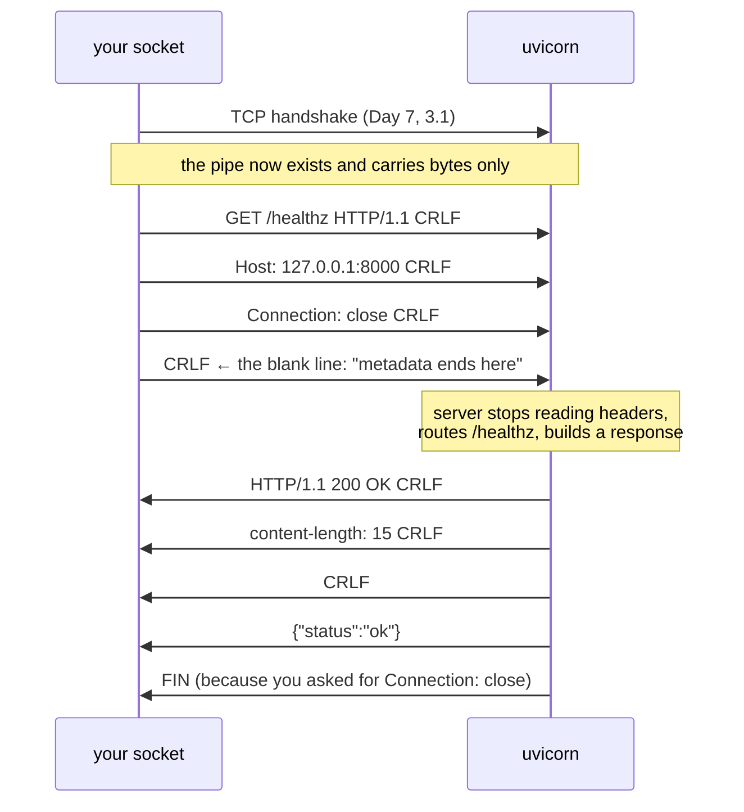

# 1.1 — A request is text with a shape

## One-line answer

An HTTP request is a few lines of plain text sent down a TCP connection in a fixed order — a start
line, some `Name: value` headers, a blank line, then optionally a body — and every framework, proxy,
load balancer and client library you will ever operate is a machine for producing and consuming
exactly that text.

---

## The story

🎬 **The scene.** A hotel with a front desk and a hundred rooms. Guests do not walk into the kitchen
to ask for breakfast. They fill in a small card and drop it in a slot:

```text
WHAT I WANT:     breakfast
FOR ROOM:        204
DELIVERED BY:    08:00
SIGNED:          the family in 204
```

The card has a shape. The first line says what you want. The lines under it are extra facts about
the request. Then there is a gap, and under the gap is anything bulky — a list of allergies, a note
for the chef.

😬 **The naive fix.** A new porter decides the cards are bureaucracy and starts taking spoken
requests instead. Faster, surely.

💥 **Why it fails.** Within a day nobody can answer *"did room 204 ask for breakfast?"* The card was
never for the porter. It was for the six other people who touch the request: the kitchen, the night
manager who takes over at three, the person doing the billing, and the guest who wants to complain.
**The shape was the thing that made the request forwardable, loggable and arguable about.**

💡 **The insight.** A fixed shape costs the sender almost nothing and buys everyone downstream the
ability to handle a request they did not receive. That is the entire reason HTTP looks the way it
does — and why you can put a cache, a load balancer and a firewall in the middle of a conversation
between two programs that have never heard of each other.

---

## The idea in plain language

On [Day 7](../../../day-007-networking-for-operators/parts/03-tcp/3.1-the-handshake-and-the-connection-states.md)
you learned that a **TCP connection** is a two-way pipe between two programs: bytes go in one end and
come out the other, in order, with nothing to say where one message stops and the next begins. TCP
has no concept of "a request". It has bytes.

**HTTP is the agreement layered on top of that pipe about where a message starts and stops, and what
the bytes inside it mean.** It is a *protocol*: a set of rules both sides follow so that neither has
to guess.

The rules are simpler than almost anyone expects. A request is:

1. **A start line** — the method, the path, and the protocol version, separated by single spaces.
2. **Zero or more header lines** — `Name: value`, one per line.
3. **A blank line** — this is the delimiter. Everything before it is metadata; everything after is
   payload.
4. **A body** — optional, and its length is announced by a header, because TCP will not tell you
   where it ends.

That is it. It is text you could type by hand, and in a moment you will.

A response has the same shape with a different first line: the protocol version, a three-digit
**status code**, and a short human-readable phrase.

### The word "resource", and why the path is not a file

The start line's second field is a **path** like `/predict`. It is tempting to read that as "a file
on a disk somewhere". It is not, and has not been for a very long time.

RFC 9110 — the current definition of HTTP semantics, verified at `https://httpwg.org/specs/rfc9110.html`
on **2026-08-25** — calls the thing at the end of a path a **resource**, and deliberately declines to
say what it is made of. `/predict` on `pulse` is a function call. `/healthz` is a question about the
process. Neither is a file. **The path is a name the server has agreed to answer to**, nothing more.

This matters operationally because it is why you can move a resource from a file, to a database
lookup, to a model inference, to a cache, without any client noticing.

### Why the blank line is the most important character in the protocol

Everything hard about HTTP framing comes from one problem: **TCP delivers a stream, and a stream has
no edges.** If a server reads 5000 bytes off a socket, it has no idea whether that is one request,
half a request, or three requests and a bit.

The blank line solves half of it: read lines until you hit an empty one, and you have the complete
metadata. The headers you just read then solve the other half, by telling you exactly how many bytes
of body follow (`Content-Length`) or by declaring that the body arrives in self-describing pieces
(`Transfer-Encoding: chunked`).

**A request with a body and no length header is unframeable**, and this is not a theoretical concern
— disagreements between two servers about how to frame the same bytes are the entire basis of a class
of attack called request smuggling, which [1.4](1.4-headers-are-the-contract.md) returns to.

---

## Why Kriya needs it

Every day from here to the end of this plan produces or consumes this text.

**Day 20** measures the four delivery metrics, and "change failure rate" is defined against status
codes you must be able to read. **Day 37** puts an ingress controller in front of `pulse` — a program
whose entire job is reading this text, rewriting some of it, and forwarding the rest. **Day 62**
builds RED metrics, and the `R` and the `E` are both counted by grouping requests by method, path and
status. **Day 130** streams tokens from a model provider, which works by leaving the response body
open and writing to it in pieces — a mechanism that is unintelligible until you have seen the framing
rules it bends.

And **Day 71** traces a request across services, where the entire propagation mechanism is *one
header* copied from the incoming request to the outgoing one. If you do not know what a header is,
distributed tracing is magic. If you do, it is a `dict`.

---

## The mechanism

You will type an HTTP request by hand. Not with `curl` — `curl` writes it for you, which is the thing
being hidden. You will open a TCP connection and type the text into it.

First, start `pulse` so there is something to talk to
([Day 3](../../../day-003-pulse-v0/parts/03-running-it/3.1-the-server-the-port-and-the-process.md)):

```bash
uv run uvicorn pulse.api:app --host 127.0.0.1 --port 8000 --log-level info
```

**Line by line:**

- `uv run` — the project's interpreter, not the system one
  ([Day 0, 1.5](../../../day-000-toolchain-skeleton-driver/parts/01-the-toolchain/1.5-the-editors-interpreter-trap.md)).
- `pulse.api:app` — module path, then a colon, then the name of the ASGI application object inside it.
  This is uvicorn's own import syntax, not Python's.
- `--host 127.0.0.1` — loopback only. Nothing outside this machine can reach it
  ([Day 7, 1.3](../../../day-007-networking-for-operators/parts/01-addresses-and-ports/1.3-binding-127-0-0-1-versus-0-0-0-0.md)).
- `--log-level info` — you want the access log line for each request, because you are about to compare
  what you typed with what the server thought you said.

Now, in a second terminal, become the client. Write this as `lab/by_hand.py`:

```python
"""Send one HTTP request as literal bytes, with no HTTP library anywhere."""

import socket

REQUEST = (
    "GET /healthz HTTP/1.1\r\n"
    "Host: 127.0.0.1:8000\r\n"
    "User-Agent: typed-by-hand/1.0\r\n"
    "Connection: close\r\n"
    "\r\n"
)

sock = socket.create_connection(("127.0.0.1", 8000), timeout=5)
sock.sendall(REQUEST.encode("ascii"))

chunks = []
while True:
    data = sock.recv(4096)
    if not data:
        break
    chunks.append(data)
sock.close()

print(b"".join(chunks).decode("ascii", errors="replace"))
```

**Line by line:**

- `import socket` — the standard library's direct access to TCP. No HTTP library is involved anywhere
  in this program; that is the whole demonstration.
- `"GET /healthz HTTP/1.1\r\n"` — the start line. **Method, space, path, space, version.** The version
  is `HTTP/1.1` because that is what the connection reuse rules in
  [2.1](../02-the-connection/2.1-keep-alive-and-the-connection-you-reuse.md) assume.
- `\r\n` and not `\n` — **carriage return then line feed.** RFC 9112 (HTTP/1.1 message syntax, verified
  at `https://httpwg.org/specs/rfc9112.html` on 2026-08-25) defines the line terminator as CRLF, and a
  server is permitted to reject a bare `\n`. Most tolerate it. Writing it correctly by hand once is how
  you stop being surprised when a strict proxy does not.
- `"Host: 127.0.0.1:8000\r\n"` — **the one header that is mandatory in HTTP/1.1.** Without it the server
  is entitled to return `400`. It exists because one address can serve many names
  ([3.4](../03-tls/3.4-sni-one-address-many-certificates.md) is the TLS version of the same problem).
- `"Connection: close\r\n"` — asks the server to close the connection after replying. **This is here
  purely so the read loop below terminates**; it is the wrong thing to do in production, and
  [2.1](../02-the-connection/2.1-keep-alive-and-the-connection-you-reuse.md) explains why.
- `"\r\n"` — **the blank line.** The single most important four bytes in the request: `\r\n\r\n` is the
  boundary between metadata and payload, and the server is reading for exactly this.
- `socket.create_connection((...), timeout=5)` — the TCP handshake from
  [Day 7, 3.1](../../../day-007-networking-for-operators/parts/03-tcp/3.1-the-handshake-and-the-connection-states.md).
  The timeout is not decoration: without it a silent peer hangs this program forever
  ([Day 7, 4.1](../../../day-007-networking-for-operators/parts/04-timeouts/4.1-a-timeout-is-a-decision-not-a-safety-net.md)).
- `sock.sendall(...)` — not `send`. `send` may write only part of the buffer and return how much;
  `sendall` loops until it is all gone. Using `send` here is a real and common bug.
- `while True: data = sock.recv(4096)` — read until the server closes. **`recv` returning `b""` is how a
  socket says "the other end is done"**, and it is the only reason this loop ends. That is precisely
  what `Connection: close` bought us.

Run it and read the output, observed on **2026-08-25**:

```text
HTTP/1.1 200 OK
date: Tue, 25 Aug 2026 09:14:02 GMT
server: uvicorn
content-length: 15
content-type: application/json

{"status":"ok"}
```

**Read it as the mirror image of what you sent.** Start line, headers, blank line, body — same four
parts, in the same order. `content-length: 15` is the framing: exactly fifteen bytes follow the blank
line, and `{"status":"ok"}` is exactly fifteen bytes long. Count them.

And in the first terminal, uvicorn's access log:

```text
INFO:     127.0.0.1:54882 - "GET /healthz HTTP/1.1" 200 OK
```

**The quoted string is your start line, echoed back verbatim.** Every access log you will ever read —
nginx, Envoy, an ingress controller, a cloud load balancer — is built around that same field, because
it is the identity of the request.



### Sending a body, and the header that makes it readable

`/predict` takes JSON. The same exercise with a payload — write this as `lab/by_hand_post.py`:

```python
"""The same hand-written request, with a body and the header that frames it."""

import socket

BODY = '{"text":"the service is up"}'
REQUEST = (
    "POST /predict HTTP/1.1\r\n"
    "Host: 127.0.0.1:8000\r\n"
    "Content-Type: application/json\r\n"
    f"Content-Length: {len(BODY.encode('utf-8'))}\r\n"
    "Connection: close\r\n"
    "\r\n" + BODY
)

sock = socket.create_connection(("127.0.0.1", 8000), timeout=5)
sock.sendall(REQUEST.encode("utf-8"))

buf = b""
while True:
    data = sock.recv(4096)
    if not data:
        break
    buf += data
sock.close()

print(buf.decode("utf-8", errors="replace"))
```

**Line by line:**

- `POST` instead of `GET` — a method that carries a body and changes state. Which methods may do what
  is [1.2](1.2-methods-safety-and-idempotency.md).
- `Content-Type: application/json` — **what the bytes mean.** Without it the server is guessing, and
  FastAPI will refuse to parse the body as JSON.
- `f"Content-Length: {len(BODY.encode('utf-8'))}"` — **how many bytes follow the blank line.** Computed
  from the *encoded* bytes, not from `len(BODY)`, because a character is not a byte the moment anything
  non-ASCII appears. Getting this wrong is the first failure below.
- `"\r\n" + BODY` — the blank line, then the payload, with nothing between them.
- `.encode("utf-8")` on the whole request rather than `ascii` — because the body may contain characters
  ASCII cannot represent, and the length header was computed in UTF-8 bytes. **The two encodings must
  agree or the framing is wrong**, which is the entire point of the failure below.

```text
HTTP/1.1 200 OK
date: Tue, 25 Aug 2026 09:15:40 GMT
server: uvicorn
content-length: 71
content-type: application/json

{"label":"neutral","score":0.5,"model_version":"stub-0","cached":false}
```

**The framing worked in both directions.** You told the server how many bytes to read and it read
exactly that many; it told you how many bytes to read and you read exactly those. Neither side ever
had to guess where the message ended, which is the only thing HTTP is really doing here.

---

## When it breaks

**You lied about the length.** Subtract one from `Content-Length` and re-run:

```text
HTTP/1.1 400 Bad Request
content-type: text/plain; charset=utf-8
connection: close
content-length: 22

Invalid HTTP request received.
```

**What it says:** the server rejected the message before any of your code ran.
**What it actually means:** the server read exactly the number of bytes you promised, then looked for
the start line of the *next* request and found the leftover `}` character. **A wrong `Content-Length`
does not truncate your request — it corrupts the next one**, which is why the server gives up on the
whole connection rather than trying to recover.
**The smallest fix:** compute the length from the encoded bytes, never from the string.
**Why this matters far beyond a hand-typed request:** if two servers in a chain disagree about the
length — one trusting `Content-Length`, the other trusting `Transfer-Encoding` — the leftover bytes
become the *beginning of an attacker-controlled request* injected into someone else's connection. That
is request smuggling, and it is why [1.4](1.4-headers-are-the-contract.md) is strict about duplicated
framing headers.

**You forgot the `Host` header.** Delete that line and re-run:

```text
HTTP/1.1 400 Bad Request
content-type: text/plain; charset=utf-8
connection: close

Invalid HTTP request received.
```

**What it says:** the same generic rejection, from a different cause.
**What it actually means:** RFC 9112 requires exactly one `Host` header in an HTTP/1.1 request. The
parser refused the message; nothing was routed, and no handler of yours ever ran.
**The smallest fix:** send `Host`. Every real client does it for you, which is why the requirement is
invisible until you write the bytes yourself.
**The operational version of this:** a health check configured with a bare IP address against a server
that routes by name gets a `404` or a `400` rather than the service, and the check has been green
against the wrong thing for weeks. Day 12's readiness probes meet this again.

**You used bare `\n` instead of `\r\n`.** With uvicorn's default `h11` parser:

```text
HTTP/1.1 400 Bad Request
content-type: text/plain; charset=utf-8
connection: close

Invalid HTTP request received.
```

**What it says:** rejected again, and again with the same message.
**What it actually means:** the line terminator is part of the grammar. Some parsers are lenient here
and some are not, and **which one you are talking to is not knowable from the outside.**
**The smallest fix:** always CRLF.
**The reason to care:** "lenient parser in front, strict parser behind" is exactly the shape that makes
two hops disagree about a message. Uniform strictness is a security property, not pedantry.

**You sent nothing and waited.** Open the connection, send no bytes, and hold it:

```text
(no output — the client sits until its own timeout fires, then raises socket.timeout)
```

**What it says:** nothing at all.
**What it actually means:** the server is blocked reading for a blank line that never comes. From its
side this is an unfinished request, not an idle connection, and it holds a slot while it waits.
**Thousands of these is the Slowloris attack**, and the defence is a header-read timeout — a bound that
is separate from every timeout you set on
[Day 7, 4.2](../../../day-007-networking-for-operators/parts/04-timeouts/4.2-the-four-timeouts-of-one-http-call.md).
**The smallest fix here:** press Ctrl-C. **The smallest fix in production:** a proxy in front with a
header timeout, which is one of the things
[5.1](../05-pulse-on-tls/5.1-where-tls-terminates-and-what-you-stop-seeing.md) buys you.

---

## In production

**What a professional writes instead of the teaching version.** Nobody hand-writes HTTP. They use a
client library, and the reason is not convenience — it is that the library gets `Content-Length`, CRLF,
`Host`, chunked framing, redirects, connection reuse and header casing right on every request, forever.
**The value of typing it once by hand is that you can now read a packet capture, a proxy config and an
access log**, and you know what your library is actually emitting when someone asks.

**What degrades at scale.** Header size. Every request carries its headers in full — HTTP/1.1 has no
compression for them — so a service that accumulates a dozen tracing, auth and routing headers may send
more bytes of metadata than payload on a small request. At high request rates that is real bandwidth
and real parsing cost, and it is the direct motivation for HTTP/2's header compression
([2.3](../02-the-connection/2.3-http2-multiplexing-and-what-it-does-not-fix.md)). Proxies also cap total
header size, commonly at eight kibibytes, and the failure when you exceed it is a `431` or a `400` from
a hop you do not control.

**The failure that only shows with real traffic.** Bodies that arrive slowly. In this part the whole
request was in one `sendall`, so the server read it in one go. Real clients on real networks send a
large body across many TCP segments spread over wall clock, and a request handler that assumed the body
was already there behaves completely differently under those conditions. This is why frameworks make
body reading `await`-able and why a body-read timeout is a distinct setting from a connect timeout.

**The review comment a senior engineer leaves.** *"This handler builds the response body as a string and
never sets `Content-Length`, so the framework falls back to chunked encoding. That is fine for browsers
and breaks the one legacy client that speaks HTTP/1.0. Either set the length or write down that we
require 1.1."*

**The signal you would alert on.** Not "requests" — **requests grouped by status class and by route**,
which is the RED metric of Day 62. From this part specifically, the signal worth having early is **the
count of `400`s**, because a `400` means the request never reached your code: it is a client or a proxy
problem, and it is invisible in any log your handler writes. A sudden `400` spike with a flat `500` rate
almost always means something in front of you changed, not something you deployed. You would **not**
alert on individual malformed requests — the public internet sends malformed requests continuously and
always will.

**Blast radius.** This part adds no capability to `pulse`. It opens loopback TCP connections and sends a
few hundred bytes. Worst case: a socket left open by pressing Ctrl-C at the wrong moment, which shows as
`CLOSE_WAIT` in `netstat`
([Day 7, 3.1](../../../day-007-networking-for-operators/parts/03-tcp/3.1-the-handshake-and-the-connection-states.md))
and is released when the process exits. Who can trigger it: you, on this machine. What bounds it:
`--host 127.0.0.1`, which makes the server unreachable from anywhere else.

**Cost.** `0` model calls, `0` tokens, `0` CI minutes, `0` disk. RAM: the one uvicorn process at roughly
60 MB, measured on [Day 3](../../../day-003-pulse-v0/LESSON.md). Network: a few hundred bytes, all of it
loopback, never leaving the machine.

**The interview question.** *"Walk me through what happens between `curl https://api.example.com/x` and
the first byte of the response."* The answer that lands starts before HTTP: *"Resolve the name to an
address, open a TCP connection to port 443, do the TLS handshake — and only then does HTTP start. The
client writes a start line, `GET /x HTTP/1.1`, then headers including `Host`, then a blank line. The
blank line is the frame boundary; the server reads until it sees it, routes on the method and path, and
writes back a status line, its own headers and a body whose length is announced by `Content-Length` or
delimited by chunked encoding. The reason I care about the framing is that it is where two hops can
disagree, and that disagreement is request smuggling."*

---

## Check yourself

```bash
uv run python -c "
import socket
s = socket.create_connection(('127.0.0.1', 8000), timeout=5)
s.sendall(b'GET /version HTTP/1.1\r\nHost: x\r\nConnection: close\r\n\r\n')
d = b''
while (c := s.recv(4096)): d += c
head, _, body = d.partition(b'\r\n\r\n')
print('--- metadata ---'); print(head.decode())
print('--- body ---'); print(body.decode())
print('body bytes:', len(body))
"
```

Split the response on `\r\n\r\n` yourself and confirm that `body bytes` equals the `content-length`
header the server sent. **If those two numbers agree, you have understood the framing**; if you can
explain what would happen if they disagreed, you have understood why it matters.

**Say out loud, without scrolling up:** *TCP gives you a stream of bytes with no message boundaries.
Name the two mechanisms HTTP/1.1 uses to tell one message from the next, say which one requires knowing
the body size in advance, and explain what a server does with the leftover bytes when a client's
declared length is wrong.*
