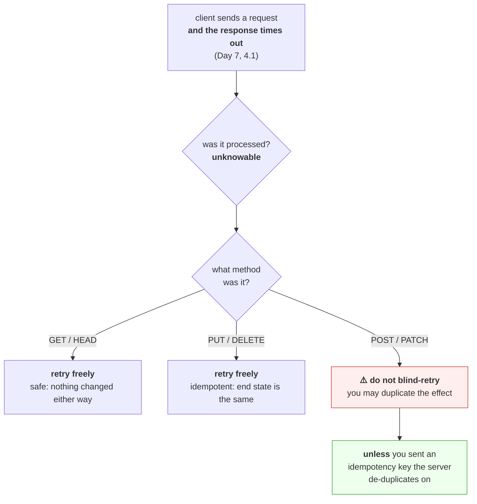

# 1.2 — Methods, safety and idempotency

## One-line answer

The method in a request's start line is a promise about consequences — **safe** means "this changes
nothing", **idempotent** means "doing it twice leaves the same state as doing it once" — and those two
words are what decide whether a retry is free, dangerous, or the reason a customer was charged three
times.

---

## The story

🎬 **The scene.** A pharmacy counter. You hand over a prescription. The pharmacist takes it, disappears
into the back, and does not come back.

You wait. Nothing. Did she fill it? Is she still looking? Did she drop it behind a shelf?

😬 **The naive fix.** You have another copy of the prescription in your bag. You hand it to the second
pharmacist, who is standing right there doing nothing.

💥 **Why it fails.** It depends entirely on what was on the paper.

If the paper said *"tell me how many tablets are left in stock"*, handing it over twice costs nothing.
Two people look at the same shelf and give you the same number.

If it said *"set this patient's repeat count to three"*, handing it over twice also costs nothing. The
count is three either way.

If it said *"add one more repeat to this patient's record"* — you have just doubled the prescription.

💡 **The insight.** **The safety of repeating an action is a property of the action, not of your
uncertainty.** You were equally unsure in all three cases. What differed was the instruction. So the
useful engineering move is to *label the instructions*, in advance, with what happens when they are
repeated — and then a machine that is unsure can decide for itself.

---

## The idea in plain language

Every HTTP request starts with a **method** — the word `GET`, `POST`, `PUT`, `DELETE`, `PATCH`, `HEAD`
or `OPTIONS` at the front of the start line you typed in
[1.1](1.1-a-request-is-text-with-a-shape.md). People often call it "the verb".

The method is not a technical detail about how the request travels. It is a **declaration of intent
that every hop in the path is allowed to act on.** A cache reads it to decide whether it may store the
response. A retrying client reads it to decide whether re-sending is safe. A proxy reads it to decide
whether the request may be replayed after a connection error. A read-only replica reads it to decide
whether it can serve the request at all.

Two words define the contract, and RFC 9110 defines both. Verified at
`https://httpwg.org/specs/rfc9110.html` on **2026-08-25**:

**Safe.** *"Request methods are considered safe when their defined semantics are intended only for
retrieving information and should not change the state of the origin server."* Reading is safe. Writing
is not.

**Idempotent.** *"A request method is idempotent if an identical request can be made once or several
times in a row with the same effect while leaving the server in the same state."* The specification
then states plainly which methods qualify: *"GET, HEAD, PUT, and DELETE are idempotent; OPTIONS and
TRACE should also be idempotent."*

Read that list again and notice the omission. **`POST` and `PATCH` are not on it.**

### The distinction people get wrong

Safe and idempotent are not the same property, and one does not imply the other in the direction people
assume.

- Everything **safe** is automatically **idempotent** — if it changes nothing, then doing it a hundred
  times also changes nothing.
- Something **idempotent** need not be safe. `DELETE /orders/42` absolutely changes state. But deleting
  an already-deleted order leaves the world in the same place, so it is idempotent.

The second bullet is where the intuition fails. People hear "idempotent" and think "harmless". It means
*"the end state does not depend on how many times you did it"* — nothing about whether the end state is
one you wanted.

### Why "idempotent" is a statement about state, not about the response

`DELETE /orders/42` twice: the first returns `204 No Content`, the second returns `404 Not Found`. Two
different responses. **It is still idempotent**, because the property is defined over the server's
state, not over what came back. Order 42 is gone in both cases.

This trips people up constantly, and it matters, because a retry that gets a different status code the
second time has not necessarily done anything wrong.

### The table you will use for the rest of your career

| Method | Safe | Idempotent | Has a body | What it means |
| --- | --- | --- | --- | --- |
| `GET` | ✅ | ✅ | no | retrieve a representation of the resource |
| `HEAD` | ✅ | ✅ | no | the same as `GET`, but return headers only |
| `OPTIONS` | ✅ | ✅ | no | what may be done to this resource |
| `PUT` | ❌ | ✅ | yes | **replace** the resource with the enclosed representation |
| `DELETE` | ❌ | ✅ | no | remove the resource |
| `POST` | ❌ | ❌ | yes | **process** the enclosed representation — the open-ended one |
| `PATCH` | ❌ | ❌ | yes | apply a partial modification |

**`PUT` versus `POST` is the row that explains the whole table.** `PUT` says *"after this request, the
resource at this URL is exactly what I sent."* Repeat it and the resource is still exactly what you
sent. `POST` says *"here is some data, do whatever this endpoint does with it"* — and "whatever it does"
might be "append a row", which is different every time.

**`PATCH` is not idempotent, and almost everyone assumes it is.** `PATCH {"status": "shipped"}` happens
to be, because it sets an absolute value. `PATCH {"increment_attempts": 1}` is not, and neither is a
JSON Patch document with an `add` operation on an array. The method does not guarantee it; **your
handler does or does not**.

---

## Why Kriya needs it

[Day 7's retry part](../../../day-007-networking-for-operators/parts/05-the-two-together/5.2-retries-that-turn-a-blip-into-an-outage.md)
ended on an unresolved edge: a timeout tells you that no response arrived, and **never** tells you
whether the request was processed. That part named idempotency as the property that makes the ambiguity
survivable and deferred the definition to here. This is the address that deferral pointed at.

**Day 19** rehearses rollback, and a rollback is a sequence of operations that must be safe to run
twice because the first attempt may have half-completed.

**Day 33** creates Kubernetes Deployments by applying YAML, and `kubectl apply` is idempotent *by
design* — that property is the entire reason declarative infrastructure works. **Day 51** (Terraform)
and **Day 57** (Argo CD) are built on the same foundation: a reconciliation loop is only possible when
"make it so" can be run continuously without accumulating damage.

**Day 175** is where it becomes dangerous. That is automated remediation — a program that takes actions
on production without a human. **An auto-remediator that issues non-idempotent actions is trap #4 from
the plan's §5.1 with the brake removed**, and the containment story starts with this vocabulary.

---

## The mechanism

Build the three cases and watch them behave differently. Write this as `lab/methods.py`:

```python
"""Three endpoints with the same shape and three different consequences on repeat."""

from fastapi import FastAPI
from pydantic import BaseModel

app = FastAPI(docs_url=None, redoc_url=None)

STATE: dict[str, int] = {"repeats": 0}
READS = {"count": 0}


class Repeats(BaseModel):
    repeats: int


@app.get("/stock")
def stock() -> dict[str, int]:
    """SAFE: reads, changes nothing an observer can see."""
    READS["count"] += 1
    return {"repeats": STATE["repeats"]}


@app.put("/repeats")
def put_repeats(payload: Repeats) -> dict[str, int]:
    """IDEMPOTENT, not safe: sets an absolute value."""
    STATE["repeats"] = payload.repeats
    return {"repeats": STATE["repeats"]}


@app.post("/repeats")
def post_repeats(payload: Repeats) -> dict[str, int]:
    """NEITHER: accumulates. Repeating this is the bug."""
    STATE["repeats"] += payload.repeats
    return {"repeats": STATE["repeats"]}
```

**Line by line:**

- `docs_url=None, redoc_url=None` — the interactive documentation routes are off, for the reason
  [Day 3, 3.3](../../../day-003-pulse-v0/parts/03-running-it/3.3-the-interactive-docs-and-why-you-turn-them-off.md)
  gives. This is a lab file, but the habit is the point.
- `STATE: dict[str, int]` — a module-level dictionary standing in for a database. It lives in the
  process, so restarting the server resets it, which makes the drill repeatable.
- `READS = {"count": 0}` — deliberately separate. **`/stock` does mutate this**, and that is the honest
  version of "safe": safe means *no state change the client is asking about*, not *no side effects at
  all*. Access logs, counters and cache warming all happen on a `GET`. What must not happen is a change
  to the resource.
- `@app.get("/stock")` versus `@app.put("/repeats")` versus `@app.post("/repeats")` — **the same path
  serves two different methods.** The method is part of the routing key, not decoration on it.
- `STATE["repeats"] = payload.repeats` in the `PUT` — assignment. The end state depends only on the
  last request received, which is exactly what makes it idempotent.
- `STATE["repeats"] += payload.repeats` in the `POST` — accumulation. **One character of difference from
  the line above, and a completely different contract.**
- `payload: Repeats` — a pydantic model, so a malformed body is rejected with `422` before your function
  runs ([Day 3, 2.4](../../../day-003-pulse-v0/parts/02-the-service/2.4-predict-the-contract-before-the-model.md)).

Start it on a spare port:

```bash
uv run uvicorn --app-dir days/day-008-http-and-tls/lab methods:app --host 127.0.0.1 --port 8021 --log-level warning
```

**Line by line:**

- `--app-dir days/.../lab` — put the lab directory on the import path without installing it. The project
  package is untouched.
- `--port 8021` — not 8000. `pulse` keeps its port; today's lab servers live in the 8020s so that a
  stray process is identifiable by port alone.
- `--log-level warning` — the access log would be noise here; you are reading the response bodies.

Now send each request three times and watch the state:

```bash
echo "--- PUT three times (idempotent) ---"
for i in 1 2 3; do
  curl -sS -X PUT http://127.0.0.1:8021/repeats \
    -H 'Content-Type: application/json' -d '{"repeats":3}'
  echo
done

echo "--- POST three times (not idempotent) ---"
curl -sS -X PUT http://127.0.0.1:8021/repeats -H 'Content-Type: application/json' -d '{"repeats":0}' > /dev/null
for i in 1 2 3; do
  curl -sS -X POST http://127.0.0.1:8021/repeats \
    -H 'Content-Type: application/json' -d '{"repeats":3}'
  echo
done
```

**Line by line:**

- `-sS` — silent, but still show errors. Without the `S`, a failure prints nothing at all and you
  conclude the server is fine.
- `-X PUT` — override the method. Without it `curl` sends `POST` whenever `-d` is present, which is a
  default that has confused a great many people.
- `-H 'Content-Type: application/json'` — required, exactly as in
  [1.1](1.1-a-request-is-text-with-a-shape.md). `curl` would otherwise send
  `application/x-www-form-urlencoded` and FastAPI would reject the body.
- The `PUT ... {"repeats":0}` line between the two loops — **resetting the state so the second
  measurement is not contaminated by the first.** A drill that does not reset is a drill that measures
  the previous drill.
- `> /dev/null` on the reset — you are not interested in its output, only its effect.

Observed on **2026-08-25**:

```text
--- PUT three times (idempotent) ---
{"repeats":3}
{"repeats":3}
{"repeats":3}
--- POST three times (not idempotent) ---
{"repeats":3}
{"repeats":6}
{"repeats":9}
```

**That is the whole lesson in six lines of output.** Identical requests, identical network conditions,
identical uncertainty on the client's side — and one column is stable while the other has tripled the
prescription.



### The escape hatch: making a `POST` idempotent yourself

You cannot change what `POST` means. You *can* make your particular endpoint de-duplicate, by having
the client send a key that identifies the *operation* rather than the *attempt*:

```python
"""A POST that is safe to retry, because the server remembers the operation."""

from fastapi import FastAPI, Header
from pydantic import BaseModel

app = FastAPI(docs_url=None, redoc_url=None)

STATE = {"repeats": 0}
SEEN: dict[str, dict[str, int]] = {}


class Repeats(BaseModel):
    repeats: int


@app.post("/repeats")
def post_repeats(
    payload: Repeats,
    idempotency_key: str | None = Header(default=None),
) -> dict[str, int]:
    if idempotency_key is not None and idempotency_key in SEEN:
        return SEEN[idempotency_key]
    STATE["repeats"] += payload.repeats
    result = {"repeats": STATE["repeats"]}
    if idempotency_key is not None:
        SEEN[idempotency_key] = result
    return result
```

**Line by line:**

- `idempotency_key: str | None = Header(default=None)` — FastAPI maps the parameter name to the header
  `idempotency-key` automatically, converting underscores to hyphens. **Header names are
  case-insensitive** (RFC 9110), so `Idempotency-Key` and `idempotency-key` are the same header.
- `default=None` — the key is optional, so old clients still work. Whether that is acceptable is a
  design decision: a payments API would make it mandatory and return `400` without it.
- `if ... in SEEN: return SEEN[...]` — **the stored response is replayed, not recomputed.** The client
  gets the same body it would have got the first time, which is what makes the retry invisible.
- `SEEN[idempotency_key] = result` — stored *after* the effect. Storing it before would mean a crash
  mid-operation leaves a key claiming success for work that never happened.
- The dictionary is unbounded, which is a bug on purpose — see *When it breaks*.

**The rule that makes this work, and the one people get wrong:** the key is generated **once per
operation**, by the client, *before* the first attempt — and every retry of that operation reuses it. A
key generated inside the retry loop is a new key each attempt and de-duplicates nothing at all. That is
the same trap named in
[Day 7, 5.2](../../../day-007-networking-for-operators/parts/05-the-two-together/5.2-retries-that-turn-a-blip-into-an-outage.md).

---

## When it breaks

**A `GET` that is not safe.** The classic, and it is still shipped regularly:

```text
$ curl -sS "http://127.0.0.1:8021/admin/delete-user?id=42"
{"deleted": 42}
```

**What it says:** it worked.
**What it actually means:** a state-changing operation is sitting behind a method that every cache,
crawler, prefetcher and browser in the world believes is safe to issue speculatively. A link checker
will delete your users. A browser's link prefetch will delete your users. **A retrying proxy will
delete your users twice.**
**The smallest fix:** make it a `DELETE` or a `POST`.
**Why this is not a hypothetical:** the canonical case is a web application whose "delete" links were
`GET`s, deployed behind a crawler that dutifully followed every link on the page. Nothing in the stack
malfunctioned; every component behaved exactly as specified.

**A retried `POST` that double-charged.** The state after the drill above, in production terms:

```text
$ curl -sS http://127.0.0.1:8021/stock
{"repeats":9}
```

**What it says:** nine, where the user asked for three.
**What it actually means:** the client timed out twice, retried twice, and every attempt was processed.
**The three responses that never arrived do not mean the three requests were not handled.**
**The smallest fix:** an idempotency key, as above.
**The diagnostic that finds it:** compare the count of requests your client *sent* with the count your
server *received*. On [Day 7, 5.2](../../../day-007-networking-for-operators/parts/05-the-two-together/5.2-retries-that-turn-a-blip-into-an-outage.md)
you built exactly that counter, and this is what it is for.

**The idempotency key that grew without bound.** Leave `SEEN` unbounded and run long enough:

```text
MemoryError
```

or, more commonly, no error at all — just an increasing resident set, and then the
[Day 6](../../../day-006-resources-and-the-oom-killer/parts/04-the-oom-killer/4.2-exit-137-and-the-message-that-is-not-in-your-log.md)
`exit 137` that never appears in your log.
**What it actually means:** you built a cache with no eviction policy. Every operation ever performed is
retained for the lifetime of the process.
**The smallest fix:** store keys with an expiry — a day is a common choice, long enough to cover any
sane retry window — in a store designed for it, not a Python dict.
**The deeper problem it exposes:** the dict is per-process. Two replicas do not share it, so a retry
routed to the other instance de-duplicates nothing. **A correct idempotency store is shared state**,
which is exactly the `pulse` state question from
[Day 2, 3.2](../../../day-002-shape-of-production-system/parts/03-state/3.2-where-pulse-state-will-live.md).

**A `PATCH` that everyone assumed was idempotent.** Two attempts of the same increment:

```text
$ curl -sS -X PATCH .../counters/7 -d '{"op":"increment","by":1}'
{"value": 8}
$ curl -sS -X PATCH .../counters/7 -d '{"op":"increment","by":1}'
{"value": 9}
```

**What it says:** the value moved twice.
**What it actually means:** `PATCH` carries no idempotency guarantee, and this particular patch document
is a relative operation. **The method told the truth; the reviewer assumed otherwise.**
**The smallest fix:** express the patch as an absolute value — `{"value": 8}` — which makes *this
endpoint* idempotent even though the method still is not.
**The general rule:** if a retry layer anywhere in your stack retries `PATCH`, you must audit every
patch document your API accepts, not just the method.

---

## In production

**What a professional writes instead of the teaching version.** They decide idempotency at the API
design stage, not at the retry stage, and they write it down in the endpoint's documentation: *"this
endpoint is idempotent on `Idempotency-Key`; keys are retained for one day."* Then the client library's
retry policy can be generic — retry idempotent methods, refuse the rest — instead of every caller
holding private knowledge about which endpoints are safe. **Payment APIs led here because the cost of
being wrong is visible on a statement**, and the pattern spread outward from them.

**What degrades at scale.** The idempotency store itself. It must be shared across replicas, survive a
restart, expire entries, and be consulted on the hot path of every write — so it is a database read and
write added to every mutating request. At high volume that store becomes a dependency with its own
availability, and *"the idempotency cache is down"* becomes a question with no good answer: fail the
write, or accept the duplicate risk. Writing down which one you choose, before the day it happens, is
the work.

**The failure that only shows with real traffic.** Concurrent retries of the same key. The client times
out, retries, and now **two requests with the same key are in flight simultaneously** — the second
arrives before the first has finished and written its record. The naive check-then-write above lets both
through. The real implementation reserves the key atomically before doing the work, and returns `409
Conflict` on a key that is already in progress. This never happens in a sequential test and happens
constantly in production.

**The review comment a senior engineer leaves.** *"The retry policy in `client.py` retries on connect
error and read timeout for every method. A read timeout on a `POST` means the request may well have been
processed, so this will duplicate writes under exactly the conditions it is meant to help with. Restrict
the retry to idempotent methods, or make the write endpoints take a key."*

**The signal you would alert on.** **Duplicate-detection hits** — the count of requests served from the
idempotency store rather than executed. A low steady rate is healthy and proves the mechanism works; a
sudden spike means clients are timing out and retrying, so it is an early symptom of an upstream slowdown
that has not yet turned into errors. You would **not** page on it — it is a dashboard signal and a
correlation aid, because by the time it moves, the latency alert has usually already fired. The one you
*would* page on is **duplicate effects detected downstream** (two charges, two rows, two emails), because
that is customer-visible and irreversible.

**Blast radius.** This part introduces a genuine capability: an endpoint that mutates state. Worst case
on this machine: an in-memory integer in a lab process reaches an unintended value, and the process is
killed. Who can trigger it: anything that can reach port 8021, which is loopback only. What bounds it:
the state is a module-level dict, so it dies with the process, and nothing here touches `pulse` or any
file on disk. **The blast radius worth naming is the general one:** a non-idempotent write endpoint
behind an automatic retry policy has no upper bound on the number of times one user action is applied.

**Cost.** `0` model calls, `0` tokens, `0` CI minutes, `0` disk. RAM: one extra uvicorn process at
roughly 60 MB, so the machine is holding two — well inside the `core` profile from Addendum 02 §4.

**The interview question.** *"Your client got a timeout on a `POST`. Do you retry?"* The answer that
lands refuses the yes/no: *"Not blindly, because a timeout tells me no response arrived and tells me
nothing about whether the request was processed. If the endpoint takes an idempotency key I retry with
the same key I used the first time — generated once per operation, not per attempt — and the server
replays the stored response. If it does not, I either make the operation idempotent, or I accept that
the safe action is to surface the ambiguity to the caller rather than to guess. And in the design
review I would push for the key, because the alternative is that every client re-derives which of our
endpoints are safe to repeat."*

---

## Check yourself

```bash
curl -sS -X PUT http://127.0.0.1:8021/repeats -H 'Content-Type: application/json' -d '{"repeats":0}' > /dev/null
for i in 1 2 3; do curl -sS -X POST http://127.0.0.1:8021/repeats -H 'Content-Type: application/json' -H 'Idempotency-Key: op-abc-123' -d '{"repeats":3}'; echo; done
```

Three identical `POST`s carrying **the same key**, against the de-duplicating version. If the output is
`{"repeats":3}` three times, the mechanism works. **Now change the key on the third request and watch it
become `{"repeats":6}`** — that is what a key generated per attempt instead of per operation does.

**Say out loud, without scrolling up:** *Define safe and idempotent without using either word in its own
definition. Say which one `DELETE` has and which it lacks. Then explain why `DELETE` returning `404` on
the second call does not violate the property.*
