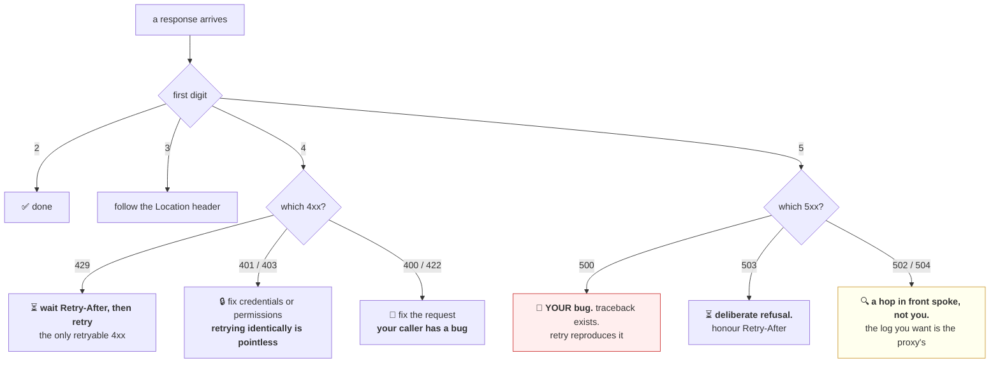

# 1.3 — The status codes an operator reads

## One-line answer

A status code is a three-digit machine-readable verdict whose **first digit says who is at fault and
whether retrying could help** — and the difference between `500`, `503` and `504` is the difference
between "my code has a bug", "I am overloaded, come back", and "somebody behind me did not answer", which
are three completely different pages at three in the morning.

---

## The story

🎬 **The scene.** A hospital triage desk on a busy evening. Every person who walks in leaves again with
one of four coloured slips.

**Green:** *seen, treated, go home.*
**Yellow:** *not here — go to the building across the road.*
**Orange:** *we cannot help you with this. You need a referral, or you filled the form in wrong, or you
are not registered here.*
**Red:** *something has gone wrong on our side. Wait, or come back later.*

😬 **The naive fix.** A tired receptionist decides the colours are a bureaucratic overhead and starts
handing everyone a plain white slip with a hand-written note.

💥 **Why it fails.** The colours were never for the receptionist. They were for the person counting slips
at the end of the shift, who can see at a glance that orange slips are normal and forty red slips in an
hour means the X-ray machine is broken. **With white slips, somebody has to read four hundred
handwritten notes to notice.** By the time they do, it is morning.

💡 **The insight.** A small, fixed, machine-readable vocabulary at the edge of a system is worth more
than an accurate free-text description, because it is the only thing that can be counted. **Counting is
what turns individual failures into a signal.**

---

## The idea in plain language

Every HTTP response begins with a status line, as you saw in
[1.1](1.1-a-request-is-text-with-a-shape.md): `HTTP/1.1 200 OK`. The number is the **status code**. The
word after it is the *reason phrase*, and it is for humans only — no client is permitted to make a
decision based on it, and many servers do not send a meaningful one.

The codes are grouped by their first digit, and **the first digit is the part that matters
operationally**, because it answers two questions at once: whose fault is this, and would trying again
help?

| Class | Name | Whose fault | Retry? |
| --- | --- | --- | --- |
| `1xx` | Informational | nobody | n/a — this is a mid-conversation note |
| `2xx` | Successful | nobody | no need |
| `3xx` | Redirection | nobody | follow the pointer instead |
| `4xx` | Client error | **the caller's** | **no** — the same request will fail identically |
| `5xx` | Server error | **yours** | **maybe** — depends which one |

**The `4xx`/`5xx` boundary is the single most important line in HTTP for an operator.** It decides who
gets paged. A wall of `4xx` means somebody is calling you wrong — an integration broke, a client shipped
a bug, someone is probing you. A wall of `5xx` means *you* broke, and it is your incident.

Which is exactly why the most damaging thing a service can do is return the wrong class. A `500` that
should have been a `400` pages you for someone else's malformed input. A `200` that should have been a
`500` means nobody gets paged at all, and [1.5](1.5-the-status-code-that-lied.md) is entirely about that
failure.

### The `4xx` codes worth knowing by heart

All definitions verified against RFC 9110 at `https://httpwg.org/specs/rfc9110.html` on **2026-08-25**,
quoted verbatim:

| Code | Name | The specification says | When you actually send it |
| --- | --- | --- | --- |
| `400` | Bad Request | *"The server cannot or will not process the request due to something that is perceived to be a client error."* | the request is malformed at the protocol level — bad framing, unparseable body |
| `401` | Unauthorized | *"The request has not been applied because it lacks valid authentication credentials for the target resource."* | **no credentials, or bad ones.** Badly named: it means unauthenticated |
| `403` | Forbidden | *"The server understood the request but refuses to authorize it."* | **credentials are fine, permission is not.** This is the real "unauthorized" |
| `404` | Not Found | *"The origin server did not find a current representation for the target resource or is not willing to disclose that one exists."* | no such resource — **or you are hiding its existence on purpose** |
| `405` | Method Not Allowed | *"The origin server knows that the request method is not allowed for the target resource."* | `POST` to a read-only path. The path exists; the verb does not |
| `408` | Request Timeout | *"The server closed the connection because the client took too long to send the request."* | the Slowloris case from [1.1](1.1-a-request-is-text-with-a-shape.md) |
| `409` | Conflict | *"The request conflicts with the current state of the target resource."* | a concurrent-update collision, or an idempotency key already in flight ([1.2](1.2-methods-safety-and-idempotency.md)) |
| `413` | Content Too Large | *"The server refuses to process a request because the message content is larger than the server is willing or able to process."* | your body limit, and it is usually a proxy that sends it, not you |
| `415` | Unsupported Media Type | *"The origin server is refusing to service the request because the message content is in a format not supported by this method on the resource."* | wrong or missing `Content-Type` |
| `422` | Unprocessable Content | *"The server understands the content type of the request entity and the syntax of the request entity is correct, but it was unable to process the contained instructions."* | **valid JSON, invalid according to your schema.** This is what FastAPI returns for a pydantic failure |
| `429` | Too Many Requests | (RFC 6585) *"The user has sent too many requests in a given amount of time."* | rate limiting — **the one `4xx` where retrying is correct** |

**`401` versus `403` is the pair everyone confuses**, and the reason is that `401` was named badly in
1997 and cannot be renamed. Read them as: `401` = *"who are you?"*, `403` = *"I know who you are, and
no."*

**`400` versus `422` is the pair that matters for `pulse`.** `400` is *"I could not parse this"*; `422`
is *"I parsed it and it is wrong"*. FastAPI draws that line for you automatically, which is why
[Day 3](../../../day-003-pulse-v0/parts/04-testing-it/4.2-making-the-test-go-red.md)'s third breakage
produced a `422` and not a `400`.

**`429` is the exception to the "do not retry a `4xx`" rule**, and it is the exception that will define
Phase 12. It is a client error — you sent too much — but the correct response is to wait and try again,
and the server usually tells you how long with a `Retry-After` header. Every free-tier model provider in
this curriculum's Addendum 01 speaks `429` fluently, and Day 125 builds the handling.

### The `5xx` codes, and the distinction that decides your page

| Code | Name | The specification says | What it means for you |
| --- | --- | --- | --- |
| `500` | Internal Server Error | *"The server encountered an unexpected condition that prevented it from fulfilling the request."* | **an unhandled exception in your code.** A bug. Retrying will reproduce it |
| `501` | Not Implemented | *"The server does not support the functionality required to fulfill the request."* | rare; you have not built this yet |
| `502` | Bad Gateway | *"The server received an invalid response from an inbound server while acting as a gateway or proxy."* | **a proxy is telling you your service replied with garbage, or died mid-response** |
| `503` | Service Unavailable | *"The server is currently unable to handle the request due to temporary overloading or maintenance of the server."* | **deliberate refusal.** You are healthy enough to say no. Retrying later is expected |
| `504` | Gateway Timeout | *"The server did not receive a timely response from an inbound server while acting as a gateway or proxy."* | **a proxy gave up waiting for you.** The timeout that fired belongs to the proxy, not the client |

**These four are not interchangeable, and treating them as "server error" loses the diagnosis.**

- `500` — *you* threw. Look in your own traceback.
- `502` — something in front of you could not understand what came back. Look at whether your process
  died mid-request, or spoke a protocol the proxy did not expect.
- `503` — *you decided to refuse*. This is the honest overload signal, and it is the code a readiness
  probe failure produces. Day 12 builds it.
- `504` — *you were too slow for someone else's deadline*. The request may still be running inside your
  process right now, which is the whole
  [Day 7, 5.1](../../../day-007-networking-for-operators/parts/05-the-two-together/5.1-the-timeout-budget-down-the-request-path.md)
  wasted-work problem.

**The one operators most often get backwards:** `502` and `504` are almost never emitted by your
application. They are emitted *about* your application, by the hop in front of it. If you are searching
your own logs for the `502`, you will not find it — **the log entry you want is the proxy's.**

---

## Why Kriya needs it

**Day 12** builds liveness and readiness probes for `pulse`, and the whole design rests on `503`: a
service that is alive but not ready must refuse with a code the platform recognises, not by crashing and
not by returning `200`.

**Day 20** defines change failure rate, and the definition is *"deploys that produced an elevated `5xx`
rate"* — which is a lie unless your `4xx`/`5xx` boundary is honest.

**Day 62** builds the RED metrics: **R**ate, **E**rrors, **D**uration. The `E` is literally a counter of
responses grouped by status code. **A service that returns `200` on failure has an errors metric that is
permanently zero**, and Day 62 cannot fix that — the damage is done at the boundary, today.

**Day 76** sets an SLO, and the availability indicator is a ratio of non-`5xx` to total. **Day 79** turns
it into a symptom-based alert.

**Day 125** meets `429` from a real provider under a real free-tier quota, with `Retry-After` in the
body, and Day 130 builds the routing and fallback around it.

**Day 189** measures an agent, whose tool calls fail in exactly these classes — and the difference
between "the tool rejected my arguments" (`4xx`, the agent should try different arguments) and "the tool
is broken" (`5xx`, the agent should stop) is the difference between a self-correcting agent and one that
loops forever.

---

## The mechanism

Make each code appear, deliberately, and read what comes back. Write this as `lab/codes.py`:

```python
"""One endpoint per interesting status code, so each can be produced on demand."""

import time

from fastapi import FastAPI, HTTPException, Response
from fastapi.responses import JSONResponse

app = FastAPI(docs_url=None, redoc_url=None)


@app.get("/ok")
def ok() -> dict[str, str]:
    return {"status": "ok"}


@app.get("/boom")
def boom() -> dict[str, str]:
    """500: an unhandled exception. Note that nothing here mentions 500."""
    raise RuntimeError("the model file is not where I expected it")


@app.get("/refuse")
def refuse() -> Response:
    """503: a deliberate, honest refusal, with the header that says when to return."""
    return JSONResponse(
        status_code=503,
        content={"detail": "not ready: model still loading"},
        headers={"Retry-After": "5"},
    )


@app.get("/slow")
def slow() -> dict[str, str]:
    """Not a status code at all — this is what a 504 is produced FROM."""
    time.sleep(30)
    return {"status": "eventually"}


@app.get("/forbidden")
def forbidden() -> dict[str, str]:
    """403 with a body. Compare with 401 below."""
    raise HTTPException(status_code=403, detail="you are known, and not permitted")


@app.get("/unauthenticated")
def unauthenticated() -> dict[str, str]:
    raise HTTPException(
        status_code=401,
        detail="who are you?",
        headers={"WWW-Authenticate": "Bearer"},
    )
```

**Line by line:**

- `raise RuntimeError(...)` in `/boom` — **notice that the number 500 appears nowhere.** An unhandled
  exception *becomes* a `500`; that is the framework's definition of the code. This is the honest way to
  produce one, and it is why you cannot "handle" your way to a lower `500` rate without fixing the bug.
- `JSONResponse(status_code=503, ...)` — the deliberate version. You are choosing the code, which is
  what makes `503` different in kind from `500`.
- `headers={"Retry-After": "5"}` — RFC 9110 defines this header as *"how long the user agent should wait
  before making a follow-up request"*, verified 2026-08-25. **A `503` without it tells the client to
  guess**, and clients guess badly, usually by retrying immediately
  ([Day 7, 5.2](../../../day-007-networking-for-operators/parts/05-the-two-together/5.2-retries-that-turn-a-blip-into-an-outage.md)).
- `time.sleep(30)` in `/slow` — a blocking sleep in a `def` (not `async def`) handler, which FastAPI runs
  in a thread pool. **This endpoint never returns a `504`**; it just takes a long time. The `504` is
  produced by whatever is in front of it and runs out of patience, which is the point being made.
- `HTTPException(status_code=403, detail=...)` — the framework's shortcut for a deliberate `4xx`. The
  `detail` becomes `{"detail": "..."}` in the body.
- `headers={"WWW-Authenticate": "Bearer"}` on the `401` — **RFC 9110 requires it.** A `401` without
  `WWW-Authenticate` is a protocol violation, and it is the single most commonly shipped one. It tells
  the client *how* to authenticate, which is the only thing that makes the code actionable.

Start it and walk the codes:

```bash
uv run uvicorn --app-dir days/day-008-http-and-tls/lab codes:app --host 127.0.0.1 --port 8022 --log-level warning &
sleep 2
for path in ok boom refuse forbidden unauthenticated missing; do
  printf '%-18s ' "/$path"
  curl -sS -o /dev/null -D - -w 'http=%{http_code}\n' "http://127.0.0.1:8022/$path" 2>/dev/null \
    | grep -iE '^(retry-after|www-authenticate|http=)' | tr '\n' ' '
  echo
done
```

**Line by line:**

- `&` at the end of the uvicorn line — background it so the same terminal can drive requests. `sleep 2`
  gives it time to bind before the first request arrives; without it the first `curl` gets connection
  refused and you misread it as a bug.
- `-o /dev/null` — discard the body; this run is about the status line and headers.
- `-D -` — dump the response headers to stdout. This is how you see `Retry-After` and
  `WWW-Authenticate`, which are the parts that make two of these codes usable.
- `-w 'http=%{http_code}\n'` — `curl`'s write-out format. `%{http_code}` is the numeric status, which is
  the only reliable machine-readable way to get it out of `curl`.
- `grep -iE '^(retry-after|www-authenticate|http=)'` — keep the three interesting lines. `-i` because
  **header names are case-insensitive and servers disagree about casing** — uvicorn sends them
  lowercased, many others do not.
- `missing` in the loop — a path that was never defined, so the framework produces the `404` itself.

Observed on **2026-08-25**:

```text
/ok                http=200
/boom              http=500
/refuse            retry-after: 5 http=503
/forbidden         http=403
/unauthenticated   www-authenticate: Bearer http=401
/missing           http=404
```

And in the server's terminal, only one of those produced anything at all:

```text
ERROR:    Exception in ASGI application
Traceback (most recent call last):
  File ".../uvicorn/protocols/http/h11_impl.py", line 403, in run_asgi
    result = await app(self.scope, self.receive, self.send)
  ...
  File "days/day-008-http-and-tls/lab/codes.py", line 18, in boom
    raise RuntimeError("the model file is not where I expected it")
RuntimeError: the model file is not where I expected it
```

**That asymmetry is the lesson.** The `503`, the `403`, the `401` and the `404` are all *decisions* — the
service knew what it was doing and said so, and there is nothing to log as an error. **The `500` is the
only one that left a traceback**, because it is the only one nobody chose.



---

## When it breaks

**Every error is a `500`.** The most common status-code defect in production:

```text
$ curl -sS -o /dev/null -w '%{http_code}\n' -X POST http://127.0.0.1:8000/predict \
    -H 'Content-Type: application/json' -d '{"txt":"typo in the field name"}'
500
```

**What it says:** the server broke.
**What it actually means, usually:** the caller sent the wrong field name, the handler did
`payload["text"]`, and a `KeyError` became a `500`. **The caller's bug is now on your error budget, in
your alerting, and on your pager.**
**The smallest fix:** validate at the boundary, which is exactly what
[Day 3, 2.4](../../../day-003-pulse-v0/parts/02-the-service/2.4-predict-the-contract-before-the-model.md)'s
pydantic models do — the correct response here is `422`.
**Why it is worth hunting:** a service whose `500` rate is dominated by client mistakes has an SLO that
measures its callers' quality rather than its own, and Day 76 will build an error budget on top of that
number.

**A `502` you cannot find in your logs.** From a proxy in front:

```text
2026-08-25T09:41:02Z [error] 1234#1234: *8891 upstream prematurely closed connection
  while reading response header from upstream, client: 10.0.4.19,
  server: api.example.com, request: "POST /predict HTTP/1.1",
  upstream: "http://10.0.7.22:8000/predict", host: "api.example.com"
```

**What it says:** the upstream closed the connection before finishing a response.
**What it actually means:** your process died mid-request — an OOM kill
([Day 6, 4.2](../../../day-006-resources-and-the-oom-killer/parts/04-the-oom-killer/4.2-exit-137-and-the-message-that-is-not-in-your-log.md)),
a segfault, or a worker restart. **Your application log has no entry, because your application was not
alive to write one.**
**The smallest fix:** find out why the process ended. The status code is a symptom of the previous
lesson, not of this one.
**The diagnostic:** correlate the proxy's `502` timestamps with process restarts. If they match, you have
your answer without reading a single line of application code.

**A `504` where the work is still running.** From the same proxy:

```text
upstream timed out (110: Connection timed out) while reading response header from upstream,
  request: "POST /predict HTTP/1.1", upstream: "http://10.0.7.22:8000/predict"
```

**What it says:** the proxy stopped waiting.
**What it actually means:** **your handler is very probably still executing.** The client is gone, the
proxy is gone, and your process is holding a thread, a database connection and a model inference for a
response nobody will read. That is the wasted work from
[Day 7, 5.1](../../../day-007-networking-for-operators/parts/05-the-two-together/5.1-the-timeout-budget-down-the-request-path.md),
seen from the other side.
**The smallest fix:** make your own timeout *shorter* than the proxy's, so you fail first and can log it.
**The signal that proves it:** your `504` count comes from the proxy while your own request duration
histogram shows the same requests completing later. Two systems, two truths, and only together do they
say what happened.

**A `503` with no `Retry-After`.** Delete the header from `/refuse` and watch a client:

```text
$ for i in 1 2 3 4 5; do curl -sS -o /dev/null -w '%{http_code} ' http://127.0.0.1:8022/refuse; done
503 503 503 503 503
```

**What it says:** five refusals in immediate succession.
**What it actually means:** the client had no information about when to come back, so it came back
instantly, five times. **A `503` that does not say when is an invitation to a retry storm** — the exact
amplification from
[Day 7, 5.2](../../../day-007-networking-for-operators/parts/05-the-two-together/5.2-retries-that-turn-a-blip-into-an-outage.md),
now triggered by the overloaded service itself.
**The smallest fix:** always send `Retry-After` with a `503` and a `429`. It is one header and it is the
difference between shedding load and amplifying it.

**A `200` that reported a failure in the body.** The worst one, and the whole subject of
[1.5](1.5-the-status-code-that-lied.md):

```text
$ curl -sS -o /dev/null -w '%{http_code}\n' http://127.0.0.1:8000/predict-legacy
200
$ curl -sS http://127.0.0.1:8000/predict-legacy
{"ok": false, "error": "model unavailable"}
```

**What it says to a human reading the body:** it failed.
**What it says to every counter, dashboard, SLO, load balancer and alert in your infrastructure:**
success.
**The smallest fix:** return the code that matches the outcome.

---

## In production

**What a professional writes instead of the teaching version.** They map exceptions to status codes once,
centrally, in an exception handler — not with a `try`/`except` in every route. A domain exception like
`ModelNotLoaded` maps to `503` with a `Retry-After`; `ValidationFailed` maps to `422`; anything unmapped
becomes a `500` **and is logged with a traceback**, because an unmapped exception is by definition a
surprise. The rule they enforce in review: *"a `500` is a bug we have not found yet, so the `500` rate is
the size of our unknown-bug surface."*

**What degrades at scale.** Cardinality of the status label. Counting responses by status code is cheap —
there are a few dozen codes. Counting them by *code and path* is fine if paths are templated (`/orders/{id}`)
and catastrophic if they are not (`/orders/8817263`), because each distinct path becomes a separate time
series. This is trap #2 from the plan's §5.1, and Day 65 is where it bites; the decision that prevents it
is made today, in how you name your routes.

**The failure that only shows with real traffic.** Codes emitted by hops you do not own. In a local test
your service is the only thing that answers, so every code you see is one you wrote. In production a load
balancer, a service mesh sidecar, an ingress controller and a CDN can all synthesise responses — `502`,
`503`, `504`, `413`, `429` — **without your process being involved at all.** The first time this happens
you will search your code for a string that is not in it. The habit that saves you: when a code is
unexplained, ask *which component emitted this* before asking *why*.

**The review comment a senior engineer leaves.** *"`/predict` returns `500` when the model is still
loading. That is a bug we will page on, and it is not a bug — the service is starting normally. Return
`503` with a `Retry-After`, so the load balancer takes it out of rotation instead of the on-call engineer
being woken up."*

**The signal you would alert on.** **The `5xx` ratio**, not the `5xx` count — because a count alarms on
traffic growth and a ratio alarms on health. Split it: `500` (your bugs) is one alert with a low
threshold, because a handful of unhandled exceptions is genuinely abnormal; `503` is a *different* alert
with a much higher threshold, because deliberate load shedding is the system working. **You would not
alert on `4xx` at all** in most services, because clients send bad requests continuously — with two
exceptions worth building later: a sudden `401` spike (credentials expired somewhere, or an attack), and
a sudden `404` spike on a path that used to work (something removed a route a client still uses).

**Blast radius.** This part adds no capability to `pulse`; the lab service only returns codes. Worst case
on this machine: `/slow` holds a thread pool slot for a long spell, and enough concurrent calls to it
exhaust the pool — which is precisely the
[Day 7, 5.3](../../../day-007-networking-for-operators/parts/05-the-two-together/5.3-hanging-pulse-on-purpose.md)
drill, reproduced accidentally. Who can trigger it: anything that can reach port 8022, loopback only.
What bounds it: `sleep 30` is finite, so the pool recovers on its own; killing the process is immediate.

**Cost.** `0` model calls, `0` tokens, `0` CI minutes, `0` disk. RAM: one uvicorn process at roughly
60 MB. Stop the lab server when the section is done — three background uvicorns is how a machine with
four cores starts feeling slow.

**The interview question.** *"What is the difference between a `502` and a `504`?"* The answer that lands
names the emitter first: *"Both come from a proxy in front of the service, not from the service itself.
A `502` means the upstream answered with something the proxy could not use — often because the process
died mid-response, so my first check is whether it restarted. A `504` means the upstream did not answer
in time, and the important consequence is that the work is probably still running: the client is gone but
the handler is holding a thread and a connection. That is why I want my own timeout tighter than the
proxy's, so I fail first and get a log line I own."*

---

## Check yourself

```bash
for path in ok boom refuse forbidden unauthenticated missing; do
  printf '%-18s http=%s\n' "/$path" "$(curl -sS -o /dev/null -w '%{http_code}' http://127.0.0.1:8022/$path)"
done
```

Six paths, six codes, and only one of them wrote a traceback in the server's terminal. **Point at the one
that did and say why the other five did not** — that distinction is the whole difference between a
decision and a defect.

**Say out loud, without scrolling up:** *Your dashboard shows a spike in `502`s. Say which component
emitted them, why grepping your application log for "502" will find nothing, and name the two most likely
causes.*
