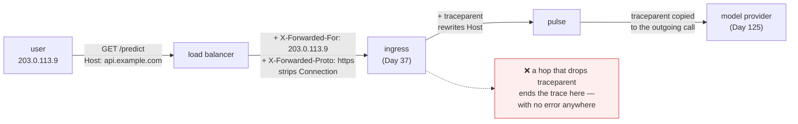

# 1.4 — Headers are the contract

## One-line answer

Headers are the negotiation layer of HTTP — case-insensitive `Name: value` pairs that decide framing,
content type, caching, identity, tracing and routing — and because every hop in the path may read,
rewrite, add or drop them, **a header is a contract between components that have never met.**

---

## The story

🎬 **The scene.** A parcel travelling from a workshop in one country to a house in another. The box
itself never changes. What changes is the paper stuck to the outside.

The workshop writes the address and *"FRAGILE — GLASS"*. The courier adds a barcode. Customs adds a
declaration form and a stamp. The airline adds a route tag. The local depot adds a delivery-attempt
sticker. By the time the box reaches the door, there are nine pieces of paper on it, written by six
organisations, none of whom spoke to each other.

😬 **The naive fix.** A new depot manager finds the box covered in clutter and peels off everything that
is not the address. Cleaner. Easier to read.

💥 **Why it fails.** The *"FRAGILE"* label was how the loader knew not to stack anything on it. The
customs stamp was the only proof that duty had been paid. The route tag was how the box got on the right
van. **None of those were addressed to the depot manager**, and none of them were his to remove — he was
a hop in a chain, and his job was to add his sticker and pass the rest along.

💡 **The insight.** In a system with many hops, **metadata is not for the hop that reads it — it is for
some hop further down that you cannot see.** So the default behaviour at any intermediary must be *pass
it through*, and dropping a header must be a deliberate, documented act. Every distributed-tracing
outage in history is this story.

---

## The idea in plain language

A header is a line of the form `Name: value` between the start line and the blank line of an HTTP
message ([1.1](1.1-a-request-is-text-with-a-shape.md)). That is the entire syntax.

What makes them interesting is that **there is no fixed list.** A handful are defined by RFC 9110 and
have precise meanings. Thousands more are invented by frameworks, proxies, clouds, tracing systems and
individual teams, and they travel the same way.

Four properties are worth internalising because each one causes a real class of bug:

**1. Names are case-insensitive.** RFC 9110 defines field names as case-insensitive, verified at
`https://httpwg.org/specs/rfc9110.html` on **2026-08-25**. `Content-Type`, `content-type` and
`CONTENT-TYPE` are the same header. **HTTP/2 goes further and requires all names to be lowercase on the
wire**, which is why a service that reads `request.headers["Content-Type"]` from a raw dictionary works
over HTTP/1.1 and breaks over HTTP/2. Every competent framework gives you a case-insensitive mapping;
knowing *why* it is case-insensitive is what stops you from bypassing it.

**2. Values are text, and the framing ones are dangerous.** `Content-Length` and `Transfer-Encoding` do
not describe the message — **they define where it ends.** A message carrying both, or carrying two
different `Content-Length` values, is ambiguous, and two hops resolving that ambiguity differently is
request smuggling. RFC 9112 requires a server to reject such a message.

**3. Order is preserved, and repeats are legal.** A header may appear more than once, and for most
headers that means "a list". `Set-Cookie` is the notorious one: it *must* be repeated rather than
comma-joined, and any code that flattens headers into a `dict[str, str]` silently drops all but one
cookie.

**4. They are per-hop or end-to-end, and the distinction is invisible.** `Connection`, `Keep-Alive`,
`Transfer-Encoding` and `Upgrade` describe *this* TCP connection and must not be forwarded. `Authorization`,
`Content-Type` and your tracing headers are meant for the far end. **Nothing in the syntax tells you
which is which** — a proxy has to know, and a proxy that forwards `Connection: close` breaks the pooling
that [2.1](../02-the-connection/2.1-keep-alive-and-the-connection-you-reuse.md) depends on.

### The headers you will actually operate

| Header | Direction | What it does | Where it bites |
| --- | --- | --- | --- |
| `Host` | request | which name this request is for | mandatory in 1.1; routing depends on it ([1.1](1.1-a-request-is-text-with-a-shape.md)) |
| `Content-Type` | both | what the bytes mean | wrong value → `415`; missing → the server guesses |
| `Content-Length` | both | how many body bytes follow | wrong value → corrupted framing |
| `Transfer-Encoding: chunked` | both | body arrives in self-describing pieces | streaming responses (Day 130) |
| `Accept` | request | what the client can handle | content negotiation; rarely used well |
| `Authorization` | request | credentials | **never log this** ([Day 9, 4.2](../../../day-009-configuration-and-secrets/parts/04-secrets/4.2-where-a-secret-actually-leaks.md)) |
| `Retry-After` | response | when to come back | required with a good `503`/`429` ([1.3](1.3-the-status-codes-an-operator-reads.md)) |
| `Cache-Control` | both | who may store this and for how long | a wrong value caches a private response publicly |
| `ETag` / `If-None-Match` | both | a version tag and a conditional request | `304 Not Modified` — a response with no body |
| `X-Forwarded-For` | request | the original client address, added by a proxy | **spoofable** unless the proxy is trusted ([5.1](../05-pulse-on-tls/5.1-where-tls-terminates-and-what-you-stop-seeing.md)) |
| `X-Forwarded-Proto` | request | whether the *original* request was HTTPS | redirect loops when it is wrong |
| `traceparent` | request | the W3C trace context | Day 71 — drop it and the trace ends |
| `User-Agent` | request | who is calling | the only identity most callers volunteer |

**The `X-` prefix is a historical mistake.** It was meant to mark "experimental", and RFC 6648 formally
deprecated the convention in 2012 because everything experimental became permanent. `X-Forwarded-For`
survives because it is universal, not because it is well designed — the standardised replacement is
`Forwarded`, and almost nobody uses it.

### Why a header can be a security boundary

`X-Forwarded-For` is the sharpest example, and it is worth understanding before Day 39's network policy.

A proxy in front of your service appends the client's address to `X-Forwarded-For` so your service can
log who called. Reasonable. But **the header is just text a client can send**, so a client that sends
`X-Forwarded-For: 10.0.0.1` on its own has now told you it is somebody else — unless your service refuses
to believe the header from anyone but the proxy.

That is why uvicorn's proxy handling is not on by default for arbitrary sources. Verified against
uvicorn's settings documentation on **2026-08-25**: `--proxy-headers` is enabled by default *but is
restricted to `--forwarded-allow-ips`*, which itself defaults to `127.0.0.1`. **The default is safe
because the trust list is tiny**, and the dangerous configuration — `--forwarded-allow-ips '*'` — is a
thing you have to type on purpose.

---

## Why Kriya needs it

**Day 37** puts an ingress controller in front of `pulse`, which rewrites `Host`, adds
`X-Forwarded-*` and strips hop-by-hop headers. Every routing rule you write there is a statement about
headers.

**Day 71** propagates a trace across services using the `traceparent` header, and **the single most
common cause of a broken trace is a hop that did not forward it.** That day is unlearnable without this
one.

**Day 67** structures logs and Day 70 adds a correlation identifier — which travels as a header, is read
from the request, and is attached to every log line the request produces.

**Day 118** and **Day 137** cache model responses, and the cache key is derived from headers as well as
the path. `Cache-Control: private` versus `public` is the difference between a cache that helps and a
cache that serves one user's answer to another.

**Day 125** reads `Retry-After` from a real provider's `429`, and **Day 216** threat-models the boundary,
where "which headers do we trust from whom" is the first question asked.

---

## The mechanism

Look at what is actually on the wire, in both directions. Start with what your own client sends without
being asked:

```bash
uv run python - <<'PY'
import socket, threading

def echo_server(port):
    srv = socket.socket()
    srv.setsockopt(socket.SOL_SOCKET, socket.SO_REUSEADDR, 1)
    srv.bind(("127.0.0.1", port))
    srv.listen(1)
    conn, _ = srv.accept()
    data = conn.recv(65535)
    print(data.decode("ascii", errors="replace"))
    conn.sendall(b"HTTP/1.1 204 No Content\r\nContent-Length: 0\r\n\r\n")
    conn.close()
    srv.close()

threading.Thread(target=echo_server, args=(8023,), daemon=False).start()
PY
```

**Line by line:**

- `socket.socket()` with no arguments — defaults to IPv4 TCP, which is what
  [Day 7, 1.2](../../../day-007-networking-for-operators/parts/01-addresses-and-ports/1.2-the-socket-and-the-four-tuple.md)
  described.
- `setsockopt(..., SO_REUSEADDR, 1)` — lets the port be re-bound while old sockets sit in `TIME_WAIT`, so
  re-running this does not hit cause three from
  [Day 7, 1.4](../../../day-007-networking-for-operators/parts/01-addresses-and-ports/1.4-the-port-that-was-already-in-use.md).
- `srv.listen(1)` — a backlog of one is plenty; this server handles exactly one connection and exits.
- `conn.recv(65535)` — read once. **This is not a correct HTTP server** — it does not loop until the
  blank line — but it is enough to print what arrived, which is the whole purpose.
- `b"HTTP/1.1 204 No Content\r\nContent-Length: 0\r\n\r\n"` — the smallest legal response. `204` means
  "success, and there is deliberately no body", so the client stops reading immediately.
- `daemon=False` — the thread outlives the main script, so the process waits for a connection rather than
  exiting instantly.

Now point `curl` at it, in another terminal:

```bash
curl -sS http://127.0.0.1:8023/anything
```

**Line by line:** one request, no flags that add headers. **You are about to see everything `curl` sends
when you tell it to send nothing.**

The listening terminal prints:

```text
GET /anything HTTP/1.1
Host: 127.0.0.1:8023
User-Agent: curl/8.16.0
Accept: */*
```

**Three headers you did not write.** `Host` because HTTP/1.1 requires it. `User-Agent` because `curl`
identifies itself. `Accept: */*` because the client is declaring it will take any content type. **This is
the baseline** — every HTTP client you ever use is adding headers on your behalf, and knowing which ones
is the difference between reading a packet capture and guessing at it.

### Reading and echoing headers from a service

Write `lab/headers.py`:

```python
"""Echo back what arrived, so you can see exactly what each hop added."""

from fastapi import FastAPI, Request
from fastapi.responses import JSONResponse

app = FastAPI(docs_url=None, redoc_url=None)

REDACT = {"authorization", "cookie", "proxy-authorization", "x-api-key"}


@app.get("/echo")
async def echo(request: Request) -> JSONResponse:
    seen = {
        name: ("<redacted>" if name.lower() in REDACT else value)
        for name, value in request.headers.items()
    }
    return JSONResponse(
        content={"client": request.client.host if request.client else None, "headers": seen},
        headers={"Cache-Control": "no-store", "X-Kriya-Day": "8"},
    )
```

**Line by line:**

- `request.headers` — Starlette's case-insensitive mapping. **Iterating it yields names already
  lowercased**, which is why the redaction check below is reliable.
- `REDACT = {...}` — a denylist of headers that must never be echoed or logged. **This is the first
  appearance of a rule that Day 9 makes structural**: a secret that reaches a log has leaked, and an echo
  endpoint is a log with an audience.
- `name.lower() in REDACT` — belt and braces. The mapping already lowercases, but a change of framework
  or a hand-built dictionary would not, and this line costs nothing.
- `request.client.host if request.client else None` — **the address of the immediately previous hop**,
  which is the proxy's address rather than the user's whenever a proxy is present. Guarded with `if
  request.client` because it is `None` for some transports, and an unguarded attribute access here is a
  `500` waiting for the day you run behind something unusual.
- `headers={"Cache-Control": "no-store", ...}` — the response declares that nothing may cache it. **An
  endpoint that reflects request headers must never be cacheable**, or a shared cache could serve one
  caller's headers to another. This single header is the containment for the capability this endpoint
  adds.
- `X-Kriya-Day` — a custom header, to prove that inventing one requires no permission and no
  registration. That freedom is why the ecosystem has thousands of them.

Run it and send a header of your own:

```bash
uv run uvicorn --app-dir days/day-008-http-and-tls/lab headers:app --host 127.0.0.1 --port 8024 --log-level warning &
sleep 2
curl -sS -D - http://127.0.0.1:8024/echo \
  -H 'traceparent: 00-4bf92f3577b34da6a3ce929d0e0e4736-00f067aa0ba902b7-01' \
  -H 'Authorization: Bearer sk-do-not-print-me' \
  -H 'X-Forwarded-For: 203.0.113.9'
```

**Line by line:**

- `-D -` — dump response headers, so you see `X-Kriya-Day` and `Cache-Control` come back.
- `traceparent: 00-...-01` — a real W3C Trace Context value. The format is `version-traceid-spanid-flags`,
  verified against `https://www.w3.org/TR/trace-context/` on **2026-08-25**. Day 71 generates these; today
  it is a string you are watching survive a hop.
- `Authorization: Bearer ...` — **deliberately a secret-shaped value**, to prove the redaction fires.
- `X-Forwarded-For: 203.0.113.9` — an address from the documentation range (RFC 5737), claiming to be
  someone else. **You are spoofing a header**, and the point is how easy it was.

Observed on **2026-08-25**:

```text
HTTP/1.1 200 OK
date: Tue, 25 Aug 2026 09:52:11 GMT
server: uvicorn
cache-control: no-store
x-kriya-day: 8
content-length: 331
content-type: application/json

{"client":"127.0.0.1","headers":{"host":"127.0.0.1:8024","user-agent":"curl/8.16.0",
"accept":"*/*","traceparent":"00-4bf92f3577b34da6a3ce929d0e0e4736-00f067aa0ba902b7-01",
"authorization":"<redacted>","x-forwarded-for":"203.0.113.9"}}
```

**Three things to notice, in order of importance.**

The `authorization` value never appeared. The redaction worked, and this is the only reason this endpoint
is safe to have written.

**`client` says `127.0.0.1` while `x-forwarded-for` says `203.0.113.9`.** Both are in the response. One is
an observed fact from the TCP connection; the other is a claim in text. **Your logging must know which is
which**, and a service that logs the header as "the client address" is logging whatever the client felt
like typing.

And every name came back lowercased, even the ones you sent capitalised. That is the case-insensitivity
from the idea section, made visible.



---

## When it breaks

**Two `Content-Length` values.** Send them by hand:

```text
$ printf 'POST /x HTTP/1.1\r\nHost: h\r\nContent-Length: 5\r\nContent-Length: 6\r\n\r\nhello\r\n' | ...
HTTP/1.1 400 Bad Request
connection: close

Invalid HTTP request received.
```

**What it says:** rejected at the parser.
**What it actually means:** RFC 9112 requires this. The message has two contradictory statements about
where it ends, and **a server that picked one would be choosing which of two possible requests to
process.**
**The smallest fix:** send one.
**Why the rejection is the feature:** the alternative — a lenient front proxy taking the first value and a
strict backend taking the second — leaves the extra byte in the connection buffer as the start of a
smuggled request. Strictness here is not pedantry; it is the mitigation.

**Headers flattened into a `dict`, and the cookies vanished.** A response carrying three:

```text
$ curl -sS -D - http://127.0.0.1:8024/multi | grep -ci '^set-cookie'
3
$ uv run python -c "import httpx2; r = httpx2.get('http://127.0.0.1:8024/multi'); print(len(dict(r.headers)['set-cookie'].split(',')))"
1
```

**What it says:** three on the wire, one after `dict()`.
**What it actually means:** converting a multi-value header mapping into a plain dictionary keeps one
value per key. **`Set-Cookie` is the header that must never be comma-joined**, because cookie values may
themselves contain commas — so joining and re-splitting is lossy in both directions.
**The smallest fix:** use the library's multi-value accessor (`response.headers.get_list("set-cookie")` in
httpx2, verified at `https://www.python-httpx.org/` on 2026-08-25) and never `dict(headers)`.
**Where you will hit it:** any code that copies headers from one request to another — which is every
proxy, every retry wrapper and every tracing middleware you will write.

**A trusted `X-Forwarded-For` that was not.** Run uvicorn with the trust list opened up:

```text
$ uv run uvicorn ... --forwarded-allow-ips '*'
$ curl -sS -H 'X-Forwarded-For: 10.0.0.1' http://127.0.0.1:8024/echo | head -c 60
{"client":"10.0.0.1","headers":{...
```

**What it says:** `client` is now the address the caller claimed.
**What it actually means:** you told uvicorn to trust forwarded headers from **anyone**, so a header
anybody can type has become the value your logs, your rate limiter and your audit trail record. **Every
IP-based control in the system is now bypassable with one `curl` flag.**
**The smallest fix:** set `--forwarded-allow-ips` to the actual addresses of your proxies, never `*`.
**The verification:** uvicorn's settings documentation, checked **2026-08-25**, states the default is
`127.0.0.1` and that `'*'` means trust all sources. **The safe default exists; `*` is a decision.**

**A trace that stops at one service.** The symptom in a tracing UI, and there is no error text at all:

```text
Trace 4bf92f35...  spans: 1  services: 1  duration: 412ms
  └─ api-gateway  GET /predict  412ms
     (no child spans)
```

**What it says:** the request took 412 ms and did one thing.
**What it actually means:** the gateway called `pulse`, which called a model provider, and **neither
appears** — because a hop in the middle did not forward `traceparent`, so the downstream services each
started a brand-new trace nobody is looking at.
**The smallest fix:** find the hop that drops it. In a proxy, that is usually an allowlist of forwarded
headers that nobody updated when tracing was added.
**Why it is so hard to spot:** nothing fails. Every request succeeds, every latency is normal, and the
only symptom is an absence — which no alert fires on. Day 71 addresses it by asserting on span count in a
test rather than by watching a dashboard.

---

## In production

**What a professional writes instead of the teaching version.** They keep an explicit, reviewed list of
headers the edge trusts, the edge strips, and the edge must forward — and it lives in the ingress
configuration next to the routing rules, not in tribal memory. The three categories: **strip** (anything
`X-Forwarded-*` arriving from outside, because a client must never be able to set it), **add** (the real
forwarded values, the request id, the trace context), and **forward untouched** (`Authorization`,
`traceparent`, `Content-Type`). Anything not on a list is a question for review.

**What degrades at scale.** Total header size, and the number of hops that append to it. Each proxy adds
its own, and `X-Forwarded-For` in particular *grows* — it is a comma-separated chain, one address per hop.
A deep service mesh can push a request past an eight-kibibyte header limit somewhere in the middle, and
the resulting `431` or `400` comes from a component nobody remembers configuring. HTTP/2's header
compression ([2.3](../02-the-connection/2.3-http2-multiplexing-and-what-it-does-not-fix.md)) reduces the
bytes on the wire but does **not** raise the limit, which is enforced on the decompressed size.

**The failure that only shows with real traffic.** Header injection through a value you did not sanitise.
If any part of a response header is built from user input and that input contains a CRLF, the attacker has
added a header of their own — or an entire second response. Modern frameworks reject control characters in
header values for exactly this reason; **Starlette raises rather than emitting them**, and that rejection
is a feature, not a bug in your code.

**The review comment a senior engineer leaves.** *"This middleware copies `dict(request.headers)` onto the
outgoing call. That drops repeated headers, forwards `Connection` and `Host` — which are hop-by-hop and
must not be forwarded — and passes `Authorization` on to a third-party API that has no business seeing it.
Use an explicit allowlist of the three headers we actually mean to propagate."*

**The signal you would alert on.** **The count of requests arriving with an `X-Forwarded-*` header from
outside the trusted proxy range** — because that is either a misconfiguration or somebody probing your
trust boundary, and both are worth knowing about immediately. From the tracing side, the useful signal is
**the ratio of incoming requests carrying a `traceparent` to those without**: a sudden drop means an
upstream stopped propagating, and it is the only early warning that your tracing has quietly become
useless. You would **not** alert on individual unknown headers — the internet sends nonsense continuously
— and you would not alert on header size until you have a `431` rate to look at.

**Blast radius.** This part adds a real capability: `/echo` reflects request headers back to the caller. If
that endpoint ever ran anywhere reachable, **it would hand an attacker every header any proxy added**,
including internal routing and identity headers — which is a genuine information disclosure. It is bounded
here three ways: the denylist redacts credential headers, `Cache-Control: no-store` stops a shared cache
from serving one caller's headers to another, and it binds to `127.0.0.1` on a lab port. Who can trigger
it: anything on this machine. **The rule to carry forward: an echo endpoint is a debugging tool, and a
debugging tool that ships is a vulnerability.** Delete it at the end of the day.

**Cost.** `0` model calls, `0` tokens, `0` CI minutes, `0` disk. RAM: one uvicorn process at roughly 60 MB.
Network: a few kilobytes, loopback only.

**The interview question.** *"Your traces show one span per request instead of the full path. Where do you
look?"* The answer that lands is procedural: *"A missing span is a header that was not propagated, so I
work from the outside in. I send a request with a known `traceparent` and echo it back at each hop — at
the edge, at the ingress, at the service — and find the first hop where it disappears. Nine times out of
ten it is a proxy with an allowlist of forwarded headers that predates the tracing rollout. The thing I
would change afterwards is the test: assert on span count in the integration suite, because this failure
produces no errors and no latency change, so nothing alerts on it."*

---

## Check yourself

```bash
curl -sS http://127.0.0.1:8024/echo -H 'X-Forwarded-For: 198.51.100.7' -H 'Authorization: Bearer secret' \
  | uv run python -c "import json,sys; d=json.load(sys.stdin); print('tcp peer :', d['client']); print('claimed  :', d['headers'].get('x-forwarded-for')); print('auth     :', d['headers'].get('authorization'))"
```

Three lines: the address TCP observed, the address the caller *claimed*, and the credential that was
redacted before it could be printed. **If the first two differ and the third says `<redacted>`, you have
seen the two things this part exists to teach.**

**Say out loud, without scrolling up:** *Name three headers a proxy must not forward, and say what
property they share. Then say why `X-Forwarded-For` is safe to log but unsafe to authorise on, and what
single configuration setting decides which of those two it is.*
