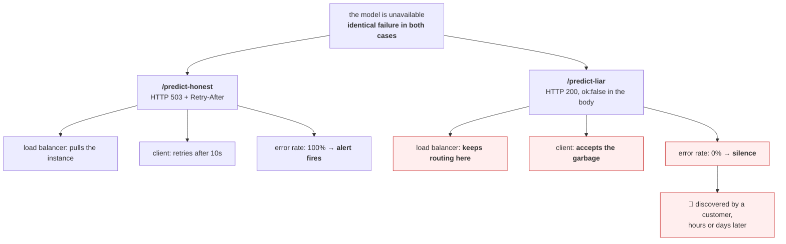

# 1.5 — The status code that lied

## One-line answer

A service that reports failure in the response body while returning `200` is invisible to every load
balancer, retry policy, dashboard, SLO and alert you will ever build — **it does not degrade your
observability, it deletes it** — and the fix costs one line and must be made at the boundary, because
nothing downstream can recover the information.

---

## The story

🎬 **The scene.** A factory floor with a row of machines, each with a lamp on top. Green means running.
The lamps feed a board in the manager's office: twelve green lamps, all shift, every shift.

One machine has a fault. The operator knows — it has been stamping crooked parts since Tuesday. He wrote
it on a sticky note and put it on the machine.

😬 **The naive fix.** Nobody changes the lamp, because the machine is *running*. It has power. It moves.
The lamp is telling the truth about the thing it measures.

💥 **Why it fails.** The board in the office does not show sticky notes. It shows lamps. So the shift
report says twelve green, the maintenance schedule says nothing is due, the quality figures come in from
a different system a fortnight later, and by then eleven thousand crooked parts have shipped. **Every
person in the chain acted correctly on the information they had.**

💡 **The insight.** **A signal that cannot go red is not a signal.** The lamp was never wrong about
"powered" — it was answering a question nobody was asking. The failure is not that somebody lied; it is
that the honest answer had nowhere to go, so it went on a sticky note where no machine could count it.

---

## The idea in plain language

[Day 3, 5.2](../../../day-003-pulse-v0/parts/05-failure/5.2-the-health-check-that-lies.md) already made
this argument about one endpoint: a `/healthz` that returns `200` whenever the process is running tells
you the process is running, and nothing else.

This part generalises it to every response your service sends, because the same defect has a second
form that is far more common and much harder to see. It looks like this:

```json
{"ok": false, "error": "model unavailable"}
```

...returned with `HTTP/1.1 200 OK`.

**A human reading that body sees a failure. Every machine in the path sees a success.** And the machines
are the ones counting.

### Why it happens, because it is never stupidity

Nobody sets out to hide failures. Three entirely reasonable roads lead here:

**The envelope habit.** Many APIs wrap every response in `{"ok": ..., "data": ..., "error": ...}` because
it makes client code uniform. The status code then feels redundant — the envelope already says what
happened — so it stops being maintained. **The envelope is fine; abandoning the status code is not.**

**The client that could not cope.** A front-end throws an exception on a non-`2xx`, so somebody makes the
API return `200` with an error field to keep the user interface working. The fix was in the wrong layer,
and it removed the information for everyone else.

**The catch-all that swallowed.** A `try`/`except` around a handler, added to stop a noisy log, returns a
default value on failure. **The exception is caught, the log line is gone, the response is a `200`, and
the metric was never wrong because it was never told.** This one is Principle 10 — *fail honestly and
loudly* — violated by a two-line diff that looked like tidying up.

### What is actually lost

Six systems read your status code, and none of them read your body:

| System | What it does with the code | What a lying `200` does to it |
| --- | --- | --- |
| load balancer / ingress | removes an unhealthy backend from rotation | keeps sending traffic to a broken instance |
| client retry policy | retries `5xx`, gives up on `4xx` ([1.2](1.2-methods-safety-and-idempotency.md)) | never retries — the caller gets garbage once and moves on |
| RED metrics (Day 62) | counts the `E` in Rate/Errors/Duration | **error rate is permanently zero** |
| SLO and error budget (Day 76) | availability = non-`5xx` ÷ total | **100% availability during a full outage** |
| symptom-based alerting (Day 79) | pages on error ratio | **nothing pages, ever** |
| trace and span status (Day 71) | marks the span as errored | the trace shows a healthy path |

**Read the middle rows again.** This is not "the dashboard is slightly off". Your availability number,
your error budget, your alert and your page are all derived from the same field, so one defect at the
boundary takes out the entire observability chain — and it takes it out *silently*, presenting as
excellent health.

That is why this cannot be fixed downstream. Day 62 cannot count an error it was never told about. Day 76
cannot budget against a number that is structurally zero. **The information is destroyed at the moment
the response is written**, and the only place to fix it is here.

---

## Why Kriya needs it

**Day 12** builds readiness probes. A probe is a status code and nothing else — the platform never reads
your body — so a service that expresses health only in JSON cannot be orchestrated.

**Day 62** builds the errors metric, **Day 76** the SLO, **Day 79** the alert. All three take the status
code as their input. This part is the day those three become possible or impossible.

**Day 121** monitors a model in production, and *"the model returned a fallback prediction"* is exactly
the kind of failure that hides inside a `200` — the response has the right shape, the right fields, and a
value produced by a code path nobody meant to run. **Trap #3 from the plan's §5.1** — the model that is
fine offline — has this as one of its mechanisms.

**Day 189** measures an agent. An agent that receives `200` for a failed tool call has no way to know the
call failed, and will confidently build on the result. **Day 194** puts brakes on an agent that acts, and
every brake in that design reads a status code.

---

## The mechanism

Build the lie and measure exactly what it costs. Write this as `lab/liar.py`:

```python
"""Two endpoints with the same failure and two different status codes."""

import os

from fastapi import FastAPI
from fastapi.responses import JSONResponse

app = FastAPI(docs_url=None, redoc_url=None)

# Flip this to make the dependency "fail". Nothing else changes.
BROKEN = os.environ.get("BROKEN", "0") == "1"


def classify(text: str) -> dict[str, object]:
    if BROKEN:
        raise RuntimeError("model unavailable: weights file missing")
    return {"label": "neutral", "score": 0.5}


@app.post("/predict-honest")
async def predict_honest(payload: dict) -> JSONResponse:
    try:
        return JSONResponse(status_code=200, content=classify(payload.get("text", "")))
    except RuntimeError as exc:
        return JSONResponse(
            status_code=503,
            content={"detail": str(exc)},
            headers={"Retry-After": "10"},
        )


@app.post("/predict-liar")
async def predict_liar(payload: dict) -> JSONResponse:
    try:
        return JSONResponse(status_code=200, content={"ok": True, **classify(payload.get("text", ""))})
    except RuntimeError as exc:
        return JSONResponse(status_code=200, content={"ok": False, "error": str(exc)})
```

**Line by line:**

- `BROKEN = os.environ.get("BROKEN", "0") == "1"` — the fault is a switch, so the two endpoints can be
  compared under identical conditions. Reading configuration from the environment like this is the
  subject of [Day 9, 1.2](../../../day-009-configuration-and-secrets/parts/01-configuration/1.2-why-the-environment-and-not-a-file.md);
  the `== "1"` is there because **an environment variable is always a string**, and `bool("0")` is `True`
   — a trap that day names explicitly.
- `raise RuntimeError(...)` inside `classify` — **one failure, shared by both endpoints.** The difference
  under test is purely how it is reported.
- `status_code=503` with `Retry-After` in the honest version — a deliberate refusal, exactly as in
  [1.3](1.3-the-status-codes-an-operator-reads.md). `503` and not `500` because the service is working
  correctly and the *dependency* is missing; there is no bug to fix in this process.
- `except RuntimeError as exc` and not `except Exception` — narrow, so an unexpected error still becomes
  a `500` with a traceback. **A broad `except` here would be the third road into this failure**, catching
  bugs it was never meant to catch.
- `status_code=200, content={"ok": False, ...}` in the liar — **the entire defect, in one line.** Note
  that it is not careless: it has an error field, a message, and a boolean flag. It is *well-intentioned*
  and completely destructive.

Start it broken and measure both:

```bash
BROKEN=1 uv run uvicorn --app-dir days/day-008-http-and-tls/lab liar:app --host 127.0.0.1 --port 8025 --log-level warning &
sleep 2
for ep in predict-honest predict-liar; do
  printf '%-16s ' "/$ep"
  curl -sS -o /tmp/body.json -w 'http=%{http_code}  ' -X POST "http://127.0.0.1:8025/$ep" \
    -H 'Content-Type: application/json' -d '{"text":"anything"}'
  cat /tmp/body.json; echo
done
```

**Line by line:**

- `BROKEN=1` prefixed to the command — sets the variable for that process only, not for your shell. The
  distinction matters and [Day 9, 1.2](../../../day-009-configuration-and-secrets/parts/01-configuration/1.2-why-the-environment-and-not-a-file.md)
  is where it is explained properly.
- `-o /tmp/body.json` then `cat` — capture the body separately from the status, so you can print the two
  side by side. **Seeing them on one line is the entire demonstration.**
- `-w 'http=%{http_code}  '` — two trailing spaces so the body that follows is readable.

Observed on **2026-08-25**:

```text
/predict-honest  http=503  {"detail":"model unavailable: weights file missing"}
/predict-liar    http=200  {"ok":false,"error":"model unavailable: weights file missing"}
```

**The two bodies say the same thing. The two status codes do not.** Now count them the way every
monitoring system does — by status code, ignoring the body:

```bash
echo "--- 20 requests to each, counted the way a dashboard counts ---"
for ep in predict-honest predict-liar; do
  printf '%-16s ' "/$ep"
  for i in $(seq 1 20); do
    curl -sS -o /dev/null -w '%{http_code}\n' -X POST "http://127.0.0.1:8025/$ep" \
      -H 'Content-Type: application/json' -d '{"text":"x"}'
  done | sort | uniq -c | tr '\n' ' '
  echo
done
```

**Line by line:**

- `for i in $(seq 1 20)` — twenty requests, enough that a rate is meaningful and small enough to finish
  promptly.
- `-o /dev/null -w '%{http_code}\n'` — **print only the status code.** This is a deliberately faithful
  imitation of what a metrics exporter does: it never opens the body.
- `sort | uniq -c` — the classic counting idiom: group identical lines and prefix each with its count.
  **This is a histogram of status codes**, which is precisely the `E` in Day 62's RED metrics.
- `tr '\n' ' '` — flatten to one line so the two endpoints line up for comparison.

```text
--- 20 requests to each, counted the way a dashboard counts ---
/predict-honest      20 503
/predict-liar        20 200
```

**Twenty failures. One of them is countable.**

Now compute the number Day 76 will build an error budget from — availability as the non-`5xx` ratio:

| Endpoint | Requests | Successful responses (by code) | Availability as measured | Availability in reality |
| --- | --- | --- | --- | --- |
| `/predict-honest` | 20 | 0 | **0%** | 0% |
| `/predict-liar` | 20 | 20 | **100%** | 0% |

**That bottom-right cell is the whole part.** During a total outage of the model, the lying endpoint
reports perfect availability — not degraded, not noisy, *perfect* — which means the SLO is met, the error
budget is untouched, and no alert has any reason to fire.



### The retry consequence, which is the one people miss

The client side is where the damage compounds. Point a retrying client at each:

```bash
uv run python - <<'PY'
import httpx2

transport = httpx2.HTTPTransport(retries=3)
with httpx2.Client(transport=transport, timeout=5.0) as client:
    for ep in ("predict-honest", "predict-liar"):
        r = client.post(f"http://127.0.0.1:8025/{ep}", json={"text": "x"})
        print(f"{ep:16} status={r.status_code}  raise_for_status ->", end=" ")
        try:
            r.raise_for_status()
            print("no exception — the caller proceeds")
        except httpx2.HTTPStatusError as exc:
            print(f"{type(exc).__name__}")
PY
```

**Line by line:**

- `httpx2` — the client pinned on [Day 3](../../../day-003-pulse-v0/LESSON.md); `import httpx` fails,
  which is the naming trap Day 7's checklist called out.
- `HTTPTransport(retries=3)` — httpx2's retry setting, verified at `https://www.python-httpx.org/` on
  **2026-08-25**. Worth knowing precisely: **it retries connection failures, not status codes**, which is
  why neither endpoint is retried here and why status-based retry needs explicit code.
- `r.raise_for_status()` — the standard way client code turns a bad status into an exception. **This is
  the single line of client code that the lying endpoint defeats.**
- `except httpx2.HTTPStatusError` — the specific exception class, not a bare `except`.

```text
predict-honest   status=503  raise_for_status -> HTTPStatusError
predict-liar     status=200  raise_for_status -> no exception — the caller proceeds
```

**The caller of the lying endpoint now holds a dictionary with no `label` key** and will fail somewhere
else entirely — in its own code, with its own traceback, blaming itself. That is how one service's
dishonest status code becomes another team's incident.

---

## When it breaks

**The honest version, breaking correctly.** This is what you *want* to see:

```text
$ curl -sS -D - -X POST http://127.0.0.1:8025/predict-honest -H 'Content-Type: application/json' -d '{"text":"x"}'
HTTP/1.1 503 Service Unavailable
retry-after: 10
content-type: application/json

{"detail":"model unavailable: weights file missing"}
```

**What it says:** unavailable, come back in ten seconds.
**What it actually means:** the service is working correctly and is telling the truth about a dependency.
**Why there is no fix needed:** this is the gate going red on purpose (Principle 11). A day where nothing
can go red has proved nothing.

**The lying version, breaking invisibly.** The same failure:

```text
$ curl -sS -D - -X POST http://127.0.0.1:8025/predict-liar -H 'Content-Type: application/json' -d '{"text":"x"}'
HTTP/1.1 200 OK
content-type: application/json

{"ok":false,"error":"model unavailable: weights file missing"}
```

**What it says:** `200 OK`.
**What it actually means:** nothing is OK. And note there is **no error text anywhere in this section
worth pasting into a search box**, because *nothing produced an error*. That absence is the diagnostic
signature: the failure mode of a lying status code is that it has no failure mode.
**The smallest fix:** `status_code=503`. One line, one number.
**How you would ever find it:** by comparing a business metric with a technical one. Predictions served
stays flat while `label` distribution collapses to a single value, or downstream error rates rise while
yours stay at zero. **When your error rate is zero and somebody else's is not, suspect yourself.**

**The catch-all that created it.** The two-line diff that starts this:

```text
-    return classify(payload["text"])
+    try:
+        return classify(payload["text"])
+    except Exception:
+        return {"ok": False}
```

**What it says in review:** *"handle errors gracefully"*.
**What it actually did:** removed the traceback, removed the `500`, removed the alert, and converted every
future bug in `classify` into a silent wrong answer. **`except Exception` with no re-raise is the single
most expensive line in this part**, and `CLAUDE.md`'s anti-pattern list names it for this reason.
**The smallest fix:** catch the specific exception you can actually handle, map it to a status code that
matches, and let everything else surface.

**The health check that agreed with the lie.** The compounding case, and it is the reason
[Day 3, 5.2](../../../day-003-pulse-v0/parts/05-failure/5.2-the-health-check-that-lies.md) exists:

```text
$ curl -sS -o /dev/null -w 'healthz=%{http_code}\n' http://127.0.0.1:8025/healthz
healthz=200
```

**What it says:** healthy.
**What it actually means:** the process is running. The model is not loaded. **Both the health check and
the request path are returning `200` for a service that cannot do its job**, so the platform has no
signal, the dashboard has no signal, and the only remaining detector is a human.
**The smallest fix:** make readiness depend on the dependency, which is Day 12's work.

---

## In production

**What a professional writes instead of the teaching version.** They map failures to status codes **once,
in a central exception handler**, and treat the mapping as an API contract that is reviewed like any
other. Domain exceptions carry their own code: `DependencyUnavailable` → `503` with `Retry-After`,
`InvalidInput` → `422`, `NotFound` → `404`, and **anything unmapped becomes a `500` with a full
traceback**, deliberately, because an unmapped exception is a surprise and surprises must be loud. The
rule they state in review: *"if the caller cannot tell success from failure by the status code alone, the
endpoint is not finished."*

**What degrades at scale.** Partial success. A batch endpoint that processes a hundred items and fails on
three has a genuinely hard problem: `200` is wrong, `500` is wrong, and there is no code for "mostly". The
grown-up answers are `207 Multi-Status` (from WebDAV, widely understood by nobody), or — better —
splitting the operation so each item has its own status, or returning `202 Accepted` with a job resource
the caller polls. **What is never acceptable is `200` with the failures buried in the body**, because the
error rate then depends on payload size rather than on health.

**The failure that only shows with real traffic.** The graceful-degradation fallback. A service that
returns a cached or default prediction when the model is unavailable is doing something legitimate — and
if it returns `200` with no other signal, **the difference between "served by the model" and "served by
the fallback" is invisible.** The professional version returns `200` (the response *is* usable) but adds a
header or field naming the source, and **exports a separate counter for fallback-served requests** with
an alert on its ratio. Day 121 builds precisely this for `pulse`, and it only works if the distinction is
recorded at the boundary today.

**The review comment a senior engineer leaves.** *"This returns `200` with `ok: false`. Our SLO is the
non-`5xx` ratio, so this endpoint can be down for a day at 100% measured availability. Return `503` with
`Retry-After` and let the load balancer do its job. If the front-end cannot handle a non-`200`, fix the
front-end — that is one team's problem instead of everybody's."*

**The signal you would alert on.** The `5xx` ratio, as in [1.3](1.3-the-status-codes-an-operator-reads.md)
— **but this part adds the one that catches a liar.** Alert on a **business-outcome metric that must move
with traffic**: predictions with a real label, orders created, tokens generated. When technical
availability says 100% and the business metric has collapsed, the status code is lying, and that
divergence is the only automated detector for this class of defect. Day 121 calls the general version of
this a *groundedness* or *outcome* monitor; the cheap version is one counter and one ratio, and it is
worth having from the first week.

**Blast radius.** This part adds no capability to `pulse` — the lab service is a copy, and `pulse` is not
modified today. The blast radius worth naming is the one being demonstrated: **an endpoint that returns
`200` on failure has no bound at all on how long a total outage can run undetected.** Worst case: until a
customer complains. Who can trigger it: any developer, with a two-line diff that reads like an
improvement. What bounds it: a review rule, a test that asserts the status code on the failure path, and
the outcome metric above. **Notice that all three of those are process controls, not technical ones** —
there is no runtime mechanism that catches this, which is exactly why it survives in real systems.

**Cost.** `0` model calls, `0` tokens, `0` CI minutes, `0` disk. RAM: one uvicorn process at roughly
60 MB. Stop it when you are done — you now have several lab servers running, and the machine has four
cores (Addendum 02 §3).

**The interview question.** *"Your availability dashboard shows 99.99% and a customer says the product has
been broken all morning. What is your first hypothesis?"* The answer that lands goes straight here: *"That
the failure is returning a `2xx`. Availability is almost always computed from status codes, so an endpoint
that reports errors in the body is invisible to it — and the tell is that the technical metric is not just
good but perfect while a business metric has collapsed. So I would compare requests served against
outcomes produced, find the endpoint where those diverge, and look at its error path. The fix is one line
at the boundary; the thing I would add afterwards is a test that asserts the status code on the failure
path, because that is the only place this can be caught before it ships."*

---

## Check yourself

```bash
for ep in predict-honest predict-liar; do
  printf '%-16s ' "/$ep"
  for i in $(seq 1 10); do curl -sS -o /dev/null -w '%{http_code}\n' -X POST "http://127.0.0.1:8025/$ep" -H 'Content-Type: application/json' -d '{"text":"x"}'; done \
    | sort | uniq -c | tr '\n' ' '
  echo
done
```

Ten identical failures against each endpoint, counted the way a metrics exporter counts. **Write down the
availability each column implies, then say which of those two numbers your SLO would have used.**

**Say out loud, without scrolling up:** *An endpoint returns `200` with `{"ok": false}` on failure. Name
four systems that are now blind, say why the fix cannot be made in the metrics layer, and name the one
signal that would still have caught it.*
