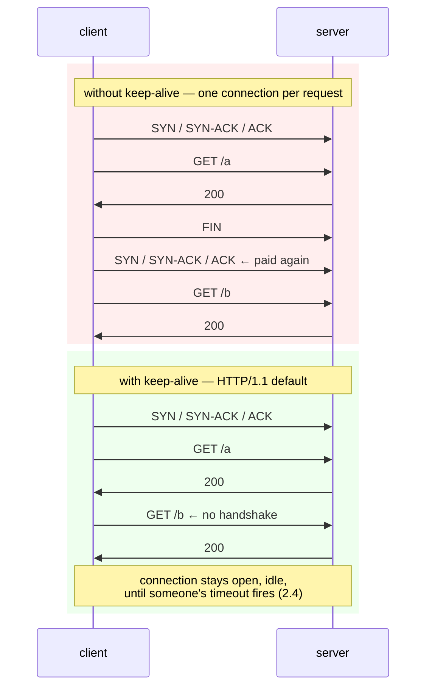

# 2.1 — Keep-alive and the connection you reuse

## One-line answer

HTTP/1.1 keeps the TCP connection open after a response so the next request can skip the handshake — a
default that turns a three-step setup cost into a one-off — and the consequence is that **your service's
connections are long-lived objects with their own lifecycle, their own limits and their own failure
modes**, which is the source of most of the confusing HTTP problems you will ever debug.

---

## The story

🎬 **The scene.** A locksmith's shop with a heavy security door. Before anyone comes in, there is a
ritual: buzz, the locksmith checks the camera, buzzes back, you push the door, it clicks shut behind you.

A courier arrives with a parcel. Ritual. Hands it over. Leaves. Door clicks shut.

Twelve seconds later, the same courier arrives with the second parcel from the same van. Ritual again.

😬 **The naive fix.** The courier gets faster at the ritual. Presses the buzzer harder.

💥 **Why it fails.** The ritual has a fixed cost that has nothing to do with how quickly anybody moves.
The camera check takes as long as it takes. With forty parcels in the van, the shop spends more of the
morning buzzing people in than handling parcels — and neither party is doing anything wrong.

💡 **The insight.** The locksmith props the door open while the courier unloads. **The security check was
never per-parcel; it was per-person**, and treating it as per-parcel was an accident of the way the door
worked. The moment you notice that, you also inherit a new question that did not exist before: *how long
do you leave the door propped, and what happens if the courier wanders off while it is open?*

---

## The idea in plain language

On [Day 7](../../../day-007-networking-for-operators/parts/03-tcp/3.1-the-handshake-and-the-connection-states.md)
you traced the **TCP three-way handshake**: the client sends `SYN`, the server replies `SYN-ACK`, the
client sends `ACK`. Only then can data flow. That exchange costs one full round trip across the network
before a single useful byte moves.

The original HTTP worked like the locksmith's door: one connection per request. Handshake, request,
response, close. For a page with forty images that is forty handshakes.

**HTTP/1.1 changed the default.** RFC 9112, verified at `https://httpwg.org/specs/rfc9112.html` on
**2026-08-25**, specifies that HTTP/1.1 connections are **persistent by default**: after a response, the
connection stays open, and the next request goes straight down it. This is called **keep-alive**, and it
is why the `Connection: close` header in [1.1](1.1-a-request-is-text-with-a-shape.md) needed to be sent
explicitly — you were *opting out* of the default so that the read loop would terminate.

The saving is one round trip per request, which sounds small until you multiply it. Across the internet a
round trip is commonly tens of milliseconds; on the same machine it is microseconds. **On a service doing
thousands of requests per second to a database or another service, the handshake cost is the difference
between a healthy system and one that is spending its life shaking hands.**

### Three things you inherit along with the saving

**A connection is now stateful in a way it was not before.** It has an age, an idle time, a request
count, and a peer that may or may not still be there. All of those are things you can now get wrong.

**Both ends have an opinion about when to close.** The server has an idle timeout; so does the client;
so does every proxy in between. **The shortest one wins, and nobody is told what the others are.** That
disagreement is the entire subject of [2.4](2.4-the-idle-timeout-race-and-the-phantom-502.md).

**Each open connection costs the server a slot.** A file descriptor, a buffer, and — depending on the
server's architecture — possibly a worker. Persistent connections trade *setup cost* for *concurrent
resource consumption*, and a server with a small connection limit and generous keep-alive can be
saturated by clients who are doing nothing at all.

### The header that controls it, and the one that does not

`Connection: keep-alive` is the header everyone remembers, and in HTTP/1.1 **it is unnecessary** — it is
the default. The header that does something is `Connection: close`, which requests termination after the
current response.

`Keep-Alive: timeout=5, max=1000` is an *informational* header some servers send, hinting at how long
they will hold the connection and how many requests they will serve on it. It is advisory. Nothing
enforces it, and many servers do not send it at all — which is why you cannot discover a peer's idle
timeout by asking.

**Both headers are hop-by-hop** ([1.4](1.4-headers-are-the-contract.md)): they describe *this* TCP
connection, so a proxy must consume them rather than forward them. A proxy that forwards
`Connection: close` propagates a client's decision about its own connection into somebody else's, and
destroys pooling downstream.

**HTTP/2 removes the header entirely.** Connections are always persistent there, and
[2.3](2.3-http2-multiplexing-and-what-it-does-not-fix.md) explains why the concept had to change shape.

---

## Why Kriya needs it

**Day 7's DNS part** ([2.2](../../../day-007-networking-for-operators/parts/02-dns/2.2-records-ttl-and-the-cache-you-do-not-control.md))
ended on the observation that a pooled connection never re-resolves a name, so DNS-based failover does not
move it. That is a direct consequence of this part: **connection reuse is what makes a pool a DNS cache
with no expiry.**

**Day 24** builds `pulse`'s Dockerfile and **Day 34** puts a Service in front of it, where every request
arrives through a proxy holding persistent connections. **Day 42** sets replica counts, and connection
distribution across replicas is decided by *when connections were opened*, not by request volume — which
is why a scaled-up deployment can leave the new pods idle.

**Day 44** adds an autoscaler, whose whole premise is that load follows requests; persistent connections
break that assumption in a specific and important way.

**Day 111** measures serving latency, where the handshake is either in your number or not. **Day 125**
calls a hosted model provider over the internet, where a round trip is expensive and TLS makes the setup
cost far worse than TCP alone ([3.2](../03-tls/3.2-the-handshake-and-what-it-costs.md)) — so reuse stops
being an optimisation and becomes the difference between a usable latency and an unusable one.

---

## The mechanism

Measure it. Two clients, same requests, one difference.

First, watch the connections themselves. Start `pulse` and send two requests on one connection by hand,
extending [1.1](1.1-a-request-is-text-with-a-shape.md)'s program — write `lab/two_on_one.py`:

```python
"""Two HTTP requests down one TCP connection, with nothing between them."""

import socket
import time

REQ = "GET /healthz HTTP/1.1\r\nHost: 127.0.0.1:8000\r\n\r\n"

sock = socket.create_connection(("127.0.0.1", 8000), timeout=5)
print("local port:", sock.getsockname()[1])

for n in (1, 2):
    start = time.monotonic()
    sock.sendall(REQ.encode("ascii"))
    data = sock.recv(4096)
    elapsed = (time.monotonic() - start) * 1000
    first_line = data.split(b"\r\n", 1)[0].decode()
    print(f"request {n}: {first_line}  ({elapsed:.2f} ms)  local port still {sock.getsockname()[1]}")

sock.close()
```

**Line by line:**

- `REQ` has **no `Connection: close`** — that is the entire change from
  [1.1](1.1-a-request-is-text-with-a-shape.md). The default is persistent, so the server will hold the
  connection open after answering.
- `sock.getsockname()[1]` — the **local (ephemeral) port**, which is the part of the four-tuple that
  identifies this connection
  ([Day 7, 1.2](../../../day-007-networking-for-operators/parts/01-addresses-and-ports/1.2-the-socket-and-the-four-tuple.md)).
  Printing it before and after proves no new connection was made.
- `for n in (1, 2)` — two requests, same socket, no reconnect between them.
- `time.monotonic()` — a clock that cannot go backwards, unlike `time.time()`. For measuring an interval
  this is the correct choice and `time.time()` is a bug waiting for a clock adjustment; the distinction
  was made on [Day 7, 4.3](../../../day-007-networking-for-operators/parts/04-timeouts/4.3-the-deadline-that-bounds-the-whole-call.md).
- `sock.recv(4096)` once per request — **this works only because the responses are small and arrive
  whole.** A real client parses `Content-Length` and reads exactly that many bytes, because on a
  persistent connection **there is no close to tell you the response ended** — which is precisely why
  framing ([1.1](1.1-a-request-is-text-with-a-shape.md)) becomes non-negotiable here.

Observed on **2026-08-25**:

```text
local port: 54912
request 1: HTTP/1.1 200 OK  (1.84 ms)  local port still 54912
request 2: HTTP/1.1 200 OK  (0.41 ms)  local port still 54912
```

**One port, two requests.** The second was roughly four times faster on loopback, where a handshake is
nearly free — across a real network the ratio is far more dramatic, because the saved round trip is tens
of milliseconds rather than a fraction of one.

### Measuring the saving properly, with a client that pools

`curl` reuses connections within a single invocation but not across them, which makes the comparison easy:

```bash
echo "--- ten separate curl processes: ten handshakes ---"
time (for i in $(seq 1 10); do curl -sS -o /dev/null http://127.0.0.1:8000/healthz; done)

echo "--- one curl process, ten URLs: one handshake ---"
time curl -sS -o /dev/null $(for i in $(seq 1 10); do printf 'http://127.0.0.1:8000/healthz '; done)
```

**Line by line:**

- `time (...)` around the loop — the shell's builtin timer over the whole subshell, so process startup is
  included. **That is deliberate**: the point is that the first form pays every cost ten times.
- The second form passes ten URLs to **one** `curl`, which opens one connection and reuses it. `curl`
  prints `Re-using existing connection` under `-v`, which is worth seeing once.
- `-o /dev/null` in both — the bodies are irrelevant; the cost being measured is setup.

```text
--- ten separate curl processes: ten handshakes ---
real    0m0.512s
--- one curl process, ten URLs: one handshake ---
real    0m0.071s
```

**Most of that gap is process startup rather than TCP** on loopback — which is an honest caveat and the
reason the next measurement matters more.

### The measurement that isolates the handshake

Ask `curl` to report the phase timings directly:

```bash
for mode in "close" "keep-alive"; do
  printf '%-11s ' "$mode"
  if [ "$mode" = "close" ]; then
    curl -sS -o /dev/null -H 'Connection: close' \
      -w 'connect=%{time_connect}s  total=%{time_total}s\n' http://127.0.0.1:8000/healthz
  else
    curl -sS -o /dev/null \
      -w 'connect=%{time_connect}s  total=%{time_total}s\n' \
      http://127.0.0.1:8000/healthz http://127.0.0.1:8000/healthz | tail -1
  fi
done
```

**Line by line:**

- `%{time_connect}` — `curl`'s write-out variable for the moment the TCP connection completed, measured
  from the start of the request. **On a reused connection this is `0`**, because no connection was made.
- `%{time_total}` — the whole request. Comparing the two numbers shows how much of a request is setup.
- `| tail -1` on the keep-alive case — the second of the two requests, which is the one that reused.
- `-H 'Connection: close'` — force the opt-out, so the first case genuinely re-handshakes.

```text
close       connect=0.000512s  total=0.002901s
keep-alive  connect=0.000000s  total=0.000664s
```

**`connect=0.000000s` is the proof.** No handshake happened on the second request, and the total fell to
under a quarter — on loopback, where the handshake is nearly free. Across a network with a round trip of
tens of milliseconds, that `time_connect` becomes the dominant term.



### Seeing the connection linger

The connection does not close when the request finishes. Prove it:

```bash
curl -sS -o /dev/null http://127.0.0.1:8000/healthz &
sleep 1
netstat -ano | grep ':8000' | grep -i established | head -3
sleep 6
echo "--- after uvicorn's --timeout-keep-alive (default 5) ---"
netstat -ano | grep ':8000' | grep -i established | head -3 || echo "(none — the server closed it)"
```

**Line by line:**

- `netstat -ano` — the same connection census as
  [Day 7, 3.1](../../../day-007-networking-for-operators/parts/03-tcp/3.1-the-handshake-and-the-connection-states.md).
  `-a` all sockets, `-n` numeric (do not resolve names, which would be slow and misleading), `-o` show
  the owning process id.
- `sleep 6` then look again — uvicorn's `--timeout-keep-alive` defaults to **5** seconds, verified against
  uvicorn's settings documentation on **2026-08-25**, so six is comfortably past it.
- The `|| echo` fallback — `grep` exits non-zero when it matches nothing, so this prints a readable line
  instead of silence. **A blank result and a failed command look identical otherwise**, and mistaking one
  for the other is how a check quietly stops checking.

```text
  TCP    127.0.0.1:8000   127.0.0.1:55021   ESTABLISHED   48210
--- after uvicorn's --timeout-keep-alive (default 5) ---
(none — the server closed it)
```

**The connection outlived the request by five seconds and then went away on its own.** That gap is where
[2.4](2.4-the-idle-timeout-race-and-the-phantom-502.md) lives.

---

## When it breaks

**A client that hangs after a successful response.** Remove `Connection: close` from
[1.1](1.1-a-request-is-text-with-a-shape.md)'s read loop and run it:

```text
HTTP/1.1 200 OK
date: Tue, 25 Aug 2026 10:02:44 GMT
server: uvicorn
content-length: 15
content-type: application/json

{"status":"ok"}
Traceback (most recent call last):
  File "lab/by_hand.py", line 18, in <module>
    data = sock.recv(4096)
TimeoutError: timed out
```

**What it says:** the response arrived in full, and then the client timed out.
**What it actually means:** the loop was reading until the connection closed, and **the server has no
intention of closing it.** The response is complete; the client just does not know that, because it was
using "connection closed" as its end-of-message marker.
**The smallest fix:** parse `Content-Length` and read exactly that many bytes.
**The general lesson:** persistent connections make framing mandatory. The lazy client worked only
because `Connection: close` was doing the framing for it.

**Ports exhausted on a busy client.** The other direction, from
[Day 7, 3.3](../../../day-007-networking-for-operators/parts/03-tcp/3.3-time-wait-and-the-ports-you-ran-out-of.md):

```text
OSError: [WinError 10048] Only one usage of each socket address (protocol/network address/port)
is normally permitted
```

or on Linux:

```text
OSError: [Errno 99] Cannot assign requested address
```

**What it says:** no local port is available.
**What it actually means:** a client opening a fresh connection per request leaves each one in `TIME_WAIT`
for a couple of minutes after closing, and the ephemeral port range is finite. **Divide the range by the
`TIME_WAIT` duration and you have a hard ceiling on connections per second** — the arithmetic Day 7 asked
you to write into `docs/PACKAGES.md`.
**The smallest fix:** reuse connections. This is the case where keep-alive is not an optimisation but the
only way the workload is possible at all.

**A load balancer that stopped balancing.** No error text — the symptom is a graph:

```text
pod-a  1,204 req/s
pod-b  1,198 req/s
pod-c      0 req/s   ← added twenty minutes ago
```

**What it says:** the new replica is receiving nothing.
**What it actually means:** the clients hold persistent connections opened *before* pod-c existed, and a
connection-level load balancer distributes **connections**, not requests. No client has any reason to open
a new one, so pod-c waits forever.
**The smallest fix:** bound connection lifetime — a maximum age or a maximum request count per connection,
after which the client or server closes and the next connection is balanced afresh.
**Where you meet it in this plan:** Day 34's Service and Day 42's replica scaling. **Scaling up does not
redistribute existing connections**, and that surprise is worth having now rather than then.

**A proxy that forwarded a hop-by-hop header.** The subtle one:

```text
$ curl -sS -D - http://proxy/api/healthz | grep -i '^connection'
connection: close
```

**What it says:** the proxy is telling you to close.
**What it actually means:** a backend sent `Connection: close` and the proxy passed it on instead of
consuming it. **Pooling is now disabled between the client and the proxy** because of a decision the
backend made about a completely different connection.
**The smallest fix:** the proxy must strip hop-by-hop headers ([1.4](1.4-headers-are-the-contract.md)).
**The symptom you would actually notice first:** latency rises across the board by roughly one round trip
per request, with no error anywhere — the most annoying kind of regression there is.

---

## In production

**What a professional writes instead of the teaching version.** They never construct a client per request.
A single pooled client is created once at start-up and reused for the process's lifetime — `httpx2.Client`
as a module-level or lifespan-managed object, not a `with` block inside a handler. **And they bound the
connection's life:** a maximum age, so connections rotate and rebalance and pick up DNS changes; and idle
timeouts set *shorter* on the client than on the server, for the reason
[2.4](2.4-the-idle-timeout-race-and-the-phantom-502.md) gives.

**What degrades at scale.** File descriptors and memory. Every persistent connection holds a descriptor
and read/write buffers on both ends. With a thousand clients each holding ten idle connections, a server
carries ten thousand open sockets doing nothing — and the default process descriptor limit on many systems
is one thousand and twenty-four. **The failure is `EMFILE: too many open files`**, and it presents as
`accept()` failing while the service looks entirely healthy from the inside. This is the resource cost
that keep-alive trades for, and it is why servers have an idle timeout at all.

**The failure that only shows with real traffic.** Uneven load distribution after a deploy or a scale-up,
exactly as in the graph above. In a test, connections are created fresh and land evenly. In production
they are long-lived, so the distribution reflects history rather than the present. **The general rule:
anything that balances connections rather than requests will drift**, and the correction is always a bound
on connection lifetime.

**The review comment a senior engineer leaves.** *"`get_client()` constructs a new `httpx2.Client` on every
call, so we handshake per request and leave a socket in `TIME_WAIT` each time. Build it once in the
lifespan handler and inject it. While you are there, set `max_connections` — the default pool is not
sized for our concurrency, and an unbounded one hides the problem instead of fixing it."*

**The signal you would alert on.** **Open connection count on the server**, and — more diagnostic —
**connection *establishment* rate**. The count tells you whether you are approaching a descriptor limit; the
establishment rate tells you whether pooling is working, because a healthy pooled client establishes very
few connections relative to its request rate. **A sudden rise in new connections per second with a flat
request rate means pooling broke**, and that is worth a dashboard panel and a warning, though not a page.
The thing you *would* page on is descriptor exhaustion, because the service stops accepting anything at
all. You would **not** alert on individual connections closing — that is normal and constant.

**Blast radius.** This part adds no capability to `pulse`. It opens loopback connections and holds them
briefly. Worst case on this machine: a handful of sockets left in `ESTABLISHED` or `TIME_WAIT` until the
process exits or the timeout fires — visible with `netstat`, harmless, and self-clearing. Who can trigger
it: you. What bounds it: uvicorn's `--timeout-keep-alive` default of 5 seconds, which closes idle
connections without anyone asking it to.

**Cost.** `0` model calls, `0` tokens, `0` CI minutes, `0` disk. RAM: `pulse` at roughly 60 MB, plus a
few kibibytes of socket buffers per connection. Network: loopback only.

**The interview question.** *"Why is a new HTTP client per request a problem?"* The answer that lands has
three parts, not one: *"You pay a TCP handshake — and a TLS handshake, which is worse — on every call, so
you add a round trip or two to every request. You leave a socket in `TIME_WAIT` on each close, and since
the ephemeral port range is finite, that puts a hard ceiling on your requests per second that has nothing
to do with your code. And you lose the pool's bounds: a shared client caps concurrency against a
downstream, so it is also your backpressure. The fix is one pooled client for the process lifetime — with
a maximum connection age, because otherwise the connections never move when DNS changes or when you scale
up."*

---

## Check yourself

```bash
curl -sS -o /dev/null -w 'first : connect=%{time_connect}s total=%{time_total}s\n' \
  http://127.0.0.1:8000/healthz http://127.0.0.1:8000/healthz \
  -w 'second: connect=%{time_connect}s total=%{time_total}s\n'
netstat -ano | grep ':8000' | grep -i established | wc -l
```

Two requests in one `curl`, then a count of the connections still open a moment later. **`time_connect`
must be zero on the second request** — if it is not, something opted out of keep-alive, and finding out
what is the exercise.

**Say out loud, without scrolling up:** *Keep-alive saves a round trip per request. Name the resource it
spends instead, name the failure that resource exhaustion produces, and explain why a newly added replica
can receive no traffic at all even though it is healthy and registered.*
