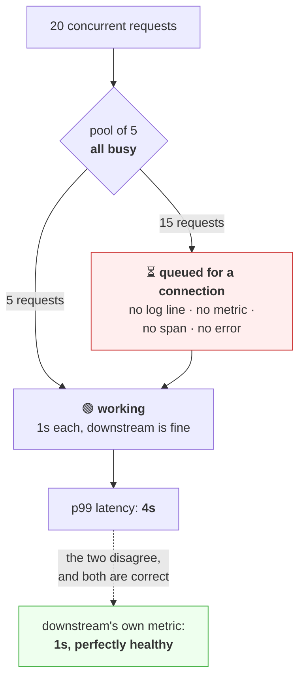

# 2.2 — The connection pool and its limits

## One-line answer

A connection pool is a bounded set of reusable connections shared by every caller in a process, and its
size limit is **not a performance setting — it is a queue** — so a request that finds the pool full does
not fail, it *waits*, and that invisible wait is where a downstream slowdown becomes your outage.

---

## The story

🎬 **The scene.** A café with four coffee machines and one barista rota. Orders come in at the counter and
go on a rail. A barista takes the next ticket, makes the drink, puts the machine back on the rail.

At breakfast it is smooth. Tickets arrive, machines are free, drinks come out.

Then one machine starts running slow — a blocked filter. It still works. It just takes four times as long.

😬 **The naive fix.** Nobody notices, because nothing is broken. The drinks still come out. Customers wait
a little longer.

💥 **Why it fails.** With one machine tied up four times longer, three machines serve the same arrival
rate. Then two. The rail of tickets grows. And here is the part that catches everyone: **the customers at
the back of the queue are not waiting for a slow machine — they are waiting for a machine at all.** Their
drink takes thirty seconds to make and forty minutes to start. From the café's own point of view every
drink is being made at normal speed.

💡 **The insight.** **A bounded shared resource turns a slowdown in one place into a queue for everyone**,
including people who never wanted the slow thing. And the queue is invisible to anyone measuring how long
the work takes, because the waiting happens before the work starts. If you want to see it, you have to
measure the wait — and almost nobody does.

---

## The idea in plain language

[2.1](2.1-keep-alive-and-the-connection-you-reuse.md) established that a connection can outlive a request.
A **connection pool** is what a client library does with that fact: it keeps a set of open connections and
hands one to whichever piece of code needs to make a request, taking it back afterwards.

The pool has a **maximum size**. When every connection is busy and a new request arrives, the pool does
one of three things depending on the library:

1. **Wait** for a connection to be returned — the common default.
2. **Open a new connection anyway**, if a separate "maximum" is higher than the "keep-alive" count.
3. **Fail immediately** with a pool-exhausted error — rarer, and much easier to debug.

**The first behaviour is the one that hurts**, because waiting is silent. Your metrics say the downstream
call took its normal duration. Your logs say the request succeeded. And your users are seeing a latency
that is dominated by time spent in a queue that nothing in your system reports on.

### Why a pool is bounded at all

It is tempting to ask why the pool does not just grow. Three reasons, and each is a real failure you can
cause:

**The downstream has limits too.** A database with a hundred connection slots, a service with a fixed
worker count, an API with a concurrency quota. **An unbounded pool moves your queue onto somebody else's
machine**, where it is their incident instead of yours — and it usually takes them down harder, because
they were sized for a sane client.

**Your own resources are finite.** Each connection is a file descriptor and buffers on both ends
([2.1](2.1-keep-alive-and-the-connection-you-reuse.md)). Unbounded growth ends at `EMFILE: too many open
files`, which breaks *everything* in the process, not just the call that grew.

**The bound is your backpressure.** This is the one people miss. **A full pool is a signal that you are
asking for more than the downstream can give**, and a system with no bound has deleted its only way to
notice. Day 47's disruption budgets and Day 80's alerting both rest on the idea that a system must be able
to say "no more"; a pool limit is the cheapest possible version of that.

### The numbers you actually set

httpx2 exposes them as `httpx2.Limits`, verified at `https://www.python-httpx.org/advanced/resource-limits/`
on **2026-08-25**:

| Setting | What it bounds | What happens at the edge |
| --- | --- | --- |
| `max_connections` | total connections, busy or idle | new requests **wait** |
| `max_keepalive_connections` | how many idle ones are kept | extras are closed rather than pooled |
| `keepalive_expiry` | how long an idle connection is kept | closed after this, in seconds |

**`max_connections` is the queue depth control** and `max_keepalive_connections` is the reuse control.
Setting the second below the first means bursts open connections that are then thrown away rather than
returned — you get the concurrency without the reuse, which is occasionally what you want and usually a
mistake.

---

## Why Kriya needs it

**Day 7's hang drill**
([5.3](../../../day-007-networking-for-operators/parts/05-the-two-together/5.3-hanging-pulse-on-purpose.md))
took `pulse` down with forty requests to a silent dependency, and the number forty came from a bounded
thread pool. **This part is the same mechanism on the client side**, and the two together are why a single
slow dependency can consume a service that is itself perfectly healthy.

**Day 21** brings Postgres, whose connection pool is the canonical example — and whose exhaustion is the
most common database incident there is.

**Day 42** sets requests and limits, and **Day 44** adds an autoscaler that scales on CPU. **A service
queueing on a full pool has low CPU**, so the autoscaler sees an idle service and refuses to scale it,
during an outage. That is worth knowing before you configure it.

**Day 125** calls a hosted model provider under a free-tier quota (Addendum 01), where the pool bound and
the provider's rate limit interact directly: too large a pool converts a queue into a wall of `429`s.
**Day 130** builds routing and fallback around exactly that, and **Day 141** does it again for a vector
store.

---

## The mechanism

Build a slow dependency, point a bounded client at it, and measure the two numbers separately: how long
the *call* took, and how long the *request* took.

First, the slow dependency. Write `lab/slowdep.py`:

```python
"""A dependency that is up, correct, and slow. Not broken — just slow."""

import asyncio
import os

from fastapi import FastAPI

app = FastAPI(docs_url=None, redoc_url=None)
DELAY = float(os.environ.get("DELAY", "1.0"))


@app.get("/thing")
async def thing() -> dict[str, float]:
    await asyncio.sleep(DELAY)
    return {"delay": DELAY}
```

**Line by line:**

- `async def` with `await asyncio.sleep(DELAY)` — **an asynchronous sleep, so this server can hold
  thousands of these concurrently.** That is deliberate: the bottleneck under test must be the *client's*
  pool, not the server's capacity. A blocking `time.sleep` in a `def` handler would have made this a
  server-side thread-pool experiment instead, which is
  [Day 7, 5.3](../../../day-007-networking-for-operators/parts/05-the-two-together/5.3-hanging-pulse-on-purpose.md)'s
  drill, not this one.
- `float(os.environ.get("DELAY", "1.0"))` — the delay is configurable so you can vary it. `float(...)`
  because environment variables are strings, always ([Day 9, 2.1](../../../day-009-configuration-and-secrets/parts/02-typed-settings/2.1-a-string-is-not-a-boolean.md)).

Now the client. Write `lab/pool.py`:

```python
"""Twenty concurrent requests through a pool of five, timing the wait separately."""

import asyncio
import os
import time

import httpx2

MAX_CONNECTIONS = int(os.environ.get("MAX_CONNECTIONS", "5"))
CONCURRENCY = int(os.environ.get("CONCURRENCY", "20"))
URL = "http://127.0.0.1:8026/thing"


async def one(client: httpx2.AsyncClient, index: int, t_zero: float) -> tuple[float, float]:
    submitted = time.monotonic()
    response = await client.get(URL)
    finished = time.monotonic()
    response.raise_for_status()
    return submitted - t_zero, finished - submitted


async def main() -> None:
    limits = httpx2.Limits(
        max_connections=MAX_CONNECTIONS,
        max_keepalive_connections=MAX_CONNECTIONS,
    )
    async with httpx2.AsyncClient(limits=limits, timeout=30.0) as client:
        t_zero = time.monotonic()
        results = await asyncio.gather(
            *(one(client, i, t_zero) for i in range(CONCURRENCY))
        )
    total = max(s + d for s, d in results)
    print(f"pool={MAX_CONNECTIONS}  concurrency={CONCURRENCY}")
    print(f"  slowest single call (as the client library sees it): {max(d for _, d in results):.2f}s")
    print(f"  slowest end-to-end (as a user sees it):              {total:.2f}s")
    print(f"  time spent waiting for a connection, worst case:     {total - max(d for _, d in results):.2f}s")


asyncio.run(main())
```

**Line by line:**

- `httpx2.Limits(max_connections=..., max_keepalive_connections=...)` — the pool bound, set equal so every
  connection is also reusable. Verified against httpx2's resource-limits documentation on **2026-08-25**.
- `httpx2.AsyncClient` rather than `Client` — asynchronous, so twenty requests really are in flight at
  once rather than being serialised by threads. **With the synchronous client this experiment measures
  something else.**
- `timeout=30.0` — generous on purpose. **A short timeout would hide the queue by turning it into
  errors**, which is a real mitigation and the wrong thing for a measurement.
- `submitted - t_zero` — how long after the batch started this call was *handed to the client*. Every one
  of the twenty is submitted at essentially the same instant, so this is near zero for all of them.
- `finished - submitted` — the call's duration **as the client library measures it**, which includes the
  wait for a pool slot. This is the crucial subtlety: httpx2's own timing starts when you call it.
- `max(s + d for s, d in results)` — the last moment any request finished, measured from the start of the
  batch. **This is the number a user experiences**, and it is the one no library reports.
- `asyncio.gather(*(...))` — launch all of them and wait for all. The unpacking star matters: `gather`
  takes awaitables as separate arguments, not a list.
- `response.raise_for_status()` — deliberately *after* the timing, so a failure does not silently skew the
  numbers by aborting early.

Run the dependency and the client:

```bash
DELAY=1.0 uv run uvicorn --app-dir days/day-008-http-and-tls/lab slowdep:app --host 127.0.0.1 --port 8026 --log-level warning &
sleep 2
for pool in 20 5 2; do
  MAX_CONNECTIONS=$pool CONCURRENCY=20 uv run python days/day-008-http-and-tls/lab/pool.py
  echo
done
```

**Line by line:**

- `DELAY=1.0` — each call takes one second on the server. Round numbers make the arithmetic legible.
- `for pool in 20 5 2` — three pool sizes against **identical** load. Twenty means no queueing at all;
  five and two force it.
- `MAX_CONNECTIONS=$pool CONCURRENCY=20` — both set per-process, so the shell is not polluted between
  runs.

Observed on **2026-08-25**:

```text
pool=20  concurrency=20
  slowest single call (as the client library sees it): 1.02s
  slowest end-to-end (as a user sees it):              1.02s
  time spent waiting for a connection, worst case:     0.00s

pool=5  concurrency=20
  slowest single call (as the client library sees it): 4.03s
  slowest end-to-end (as a user sees it):              4.03s
  time spent waiting for a connection, worst case:     0.00s

pool=2  concurrency=20
  slowest single call (as the client library sees it): 10.04s
  slowest end-to-end (as a user sees it):              10.04s
  time spent waiting for a connection, worst case:     0.00s
```

**Read the middle column carefully, because it is the finding.**

The server's work took one second in every run. It never got slower. But the client library reports the
slowest call as four seconds with a pool of five, and ten seconds with a pool of two — **because the
library's clock starts when you call it, and the wait for a connection happens inside that window.**

The arithmetic is exact: twenty requests through a pool of five, each taking one second, is four waves.
Through a pool of two, ten waves. **The queue is a multiplier on latency and it is perfectly
predictable** — `ceil(concurrency ÷ pool) × call_duration`.

And the third line reads zero in every run, which is the trap: this program cannot separate the wait from
the work, **because httpx2 does not expose the moment a connection was acquired.** That is not a defect in
the measurement; it is the honest state of most client libraries, and it is why the queue is invisible in
production.



### Making the dependency slower without touching the pool

The same effect arrives from the other direction — this is what actually happens in production:

```bash
for delay in 0.1 0.5 2.0; do
  pkill -f "slowdep:app" 2>/dev/null; sleep 1
  DELAY=$delay uv run uvicorn --app-dir days/day-008-http-and-tls/lab slowdep:app --host 127.0.0.1 --port 8026 --log-level warning &
  sleep 2
  printf 'downstream delay=%ss  ' "$delay"
  MAX_CONNECTIONS=5 CONCURRENCY=20 uv run python days/day-008-http-and-tls/lab/pool.py | grep 'end-to-end'
done
pkill -f "slowdep:app" 2>/dev/null
```

**Line by line:**

- `pkill -f "slowdep:app"` before each run — kill the previous server, because `DELAY` is read at import
  and a running process will not pick up a new value. **Forgetting this measures the previous run three
  times**, which is a genuinely common way to produce confident nonsense.
- `sleep 1` after the kill and `sleep 2` after the start — the port must be released and re-bound.
  Without them you meet `address already in use`
  ([Day 7, 1.4](../../../day-007-networking-for-operators/parts/01-addresses-and-ports/1.4-the-port-that-was-already-in-use.md)).
- `grep 'end-to-end'` — only the user-visible number matters for this comparison.

```text
downstream delay=0.1s    slowest end-to-end (as a user sees it):  0.41s
downstream delay=0.5s    slowest end-to-end (as a user sees it):  2.03s
downstream delay=2.0s    slowest end-to-end (as a user sees it):  8.05s
```

**The downstream got four times slower and your p99 got four times worse — but so did every request that
was merely queued behind it.** This is the amplification: a bounded pool converts a linear slowdown
downstream into the same linear slowdown for *all* of your traffic, including requests that would
otherwise have been served instantly.

---

## When it breaks

**Pool timeout, when the wait is bounded.** Set a short timeout and re-run with a pool of two:

```text
httpx2.PoolTimeout
Traceback (most recent call last):
  File "lab/pool.py", line 17, in one
    response = await client.get(URL)
  ...
httpx2.PoolTimeout
```

**What it says:** `PoolTimeout`, which is a distinct exception class from `ConnectTimeout` and
`ReadTimeout`.
**What it actually means:** **the request never reached the network.** It waited for a free connection and
gave up. The downstream service has no idea this request existed, so nothing in its logs, metrics or
traces will show it.
**The smallest fix:** raise `max_connections`, or reduce concurrency, or make the downstream faster — and
which one is right depends on where the real constraint is.
**Why this error is a gift:** it is the *good* outcome. A `PoolTimeout` is the queue becoming visible.
Without a pool timeout the same condition is an unexplained latency rise, and
[Day 7, 4.2](../../../day-007-networking-for-operators/parts/04-timeouts/4.2-the-four-timeouts-of-one-http-call.md)'s
four timeouts are exactly this distinction — pool wait is a fifth phase that part did not have the
vocabulary for yet.

**File descriptors exhausted, when the pool is unbounded.** Set `max_connections=None` and drive it hard:

```text
OSError: [Errno 24] Too many open files
```

or on Windows:

```text
OSError: [WinError 10055] An operation on a socket could not be performed because the system
lacked sufficient buffer space or because a queue was full
```

**What it says:** the process cannot open another socket.
**What it actually means:** you removed the bound, so the queue moved from your pool to your kernel — and
the kernel's rejection breaks **every** connection the process wants to make, including the ones to your
database and your logging endpoint.
**The smallest fix:** bound the pool.
**The reason it is worse than it looks:** a bounded pool degrades one code path. Descriptor exhaustion
degrades the whole process, and the errors it produces point at whatever happened to ask for a socket next
— which is almost never the code that caused it.

**The downstream that rejected you instead of queueing.** With a large pool against a rate-limited API:

```text
HTTP/1.1 429 Too Many Requests
retry-after: 20
content-type: application/json

{"error":{"message":"Rate limit reached for requests","type":"requests","code":"rate_limit_exceeded"}}
```

**What it says:** too many requests.
**What it actually means:** your pool bound was larger than the downstream's concurrency allowance, so
instead of queueing locally you flooded them and were refused.
**The smallest fix:** set `max_connections` at or below the downstream's documented concurrency. **A pool
size is a negotiated number, not a local preference** — and this is exactly the constraint Addendum 01
imposes on every free-tier model provider in this curriculum.
**The trap to avoid:** retrying the `429` from all connections at once, which is
[Day 7, 5.2](../../../day-007-networking-for-operators/parts/05-the-two-together/5.2-retries-that-turn-a-blip-into-an-outage.md)'s
retry storm with a rate limiter as the trigger.

**A pool that was never shared.** The silent version, and by far the most common:

```text
$ netstat -ano | grep ':8026' | grep -ci established
847
```

**What it says:** eight hundred connections to one dependency.
**What it actually means:** somebody constructed the client inside the request handler, so **every request
built its own pool of one and none of them were reused.** All the limits were set correctly and all of
them applied to a pool that existed for a single call.
**The smallest fix:** build the client once, at start-up.
**How to be sure:** connection *establishment* rate versus request rate
([2.1](2.1-keep-alive-and-the-connection-you-reuse.md)). If they are equal, you have no pool at all,
whatever the configuration says.

---

## In production

**What a professional writes instead of the teaching version.** They size the pool from the downstream's
capacity, not from their own concurrency, and they write the reasoning down next to the number: *"pool of
sixteen because the database allows a hundred and we run six replicas."* They set a **pool timeout** so
queueing surfaces as an error rather than as latency, and they set it *shorter* than the request's overall
deadline so the failure is attributable. And they hold **one client per downstream**, not one shared
client for everything — because a shared pool means a slow dependency queues requests destined for a fast
one, which is the café's rail with two kinds of drink on it.

**What degrades at scale.** The multiplication across replicas. A pool of twenty looks modest until the
deployment scales to fifty pods and the downstream sees a thousand connections from one service. **Pool
size must be reasoned about as `pool × replicas`**, and an autoscaler that changes the replica count is
silently changing your pool size — a coupling that Day 44 makes real and that surprises people every time.

**The failure that only shows with real traffic.** The queue that is invisible to every observability tool
you own. Your span for the downstream call starts when the library is invoked, which is *after* the wait —
or, in some instrumentations, before, which puts the wait inside the span and makes the downstream look
slow when it is not. **Either way the trace lies**, in opposite directions, and neither version has a
"waiting for connection" field. The professional response is to export **pool utilisation** — connections
in use divided by the maximum — as a gauge, because it is the only direct evidence of the queue.

**The review comment a senior engineer leaves.** *"This client has no `limits` set, so we get httpx2's
defaults against a database that allows a hundred connections and a deployment that runs six replicas. Set
`max_connections` explicitly and write down the arithmetic. Add a `pool` timeout too — right now a
downstream slowdown shows up as our p99 with no error and no attribution, and we will spend a day looking
at the wrong service."*

**The signal you would alert on.** **Pool utilisation** as a ratio, warning at sustained high usage and
paging only when combined with a rising error rate — because a full pool with everything succeeding is a
correctly sized pool doing its job. The genuinely valuable derived signal is **pool timeouts per second**,
which is unambiguous: it means requests are failing before they reach the network, and it is the earliest
possible detection of a downstream slowdown. You would **not** alert on connection count alone, which
varies with traffic and says nothing about health.

**Blast radius.** This part introduces a real capability: a client that can open many concurrent
connections to a dependency. **Worst case: a load generator you point at something that is not yours.**
Bounded here three ways — the URL is `127.0.0.1`, the concurrency is twenty, and the dependency is a lab
process you started and can kill. Who can trigger it: you. **The rule to carry forward: a bounded pool is
a promise you make to a downstream about the maximum load you will offer**, and removing the bound breaks
that promise silently.

**Cost.** `0` model calls, `0` tokens, `0` CI minutes, `0` disk. RAM: two uvicorn processes plus a Python
client, roughly 130 MB in total. **CPU is the constraint here, not memory** — four cores (Addendum 02 §3),
and you have several lab servers up. Kill the ones from section 1 before running this.

**The interview question.** *"Your p99 latency doubled but the downstream service's own latency is
unchanged. What is going on?"* The answer that lands names the queue: *"Almost certainly queueing on a
bounded resource on my side — a connection pool or a thread pool. The downstream is measuring the work; I
am measuring the wait plus the work, and the wait is not in anybody's span. The arithmetic is
concurrency over pool size, times the call duration, so a modest downstream slowdown multiplies across
every queued request. I would confirm it with pool utilisation — if that is pinned at the maximum, that is
the answer — and the fix is either a bigger pool, if the downstream can take it, or a pool timeout so the
condition surfaces as an error I can attribute instead of as latency I cannot."*

---

## Check yourself

```bash
for pool in 20 5 2; do
  printf 'pool=%-3s ' "$pool"
  MAX_CONNECTIONS=$pool CONCURRENCY=20 uv run python days/day-008-http-and-tls/lab/pool.py | grep 'end-to-end'
done
```

Three pool sizes, identical load, identical downstream. **Predict all three numbers before running it** —
`ceil(20 ÷ pool) × delay` — and if your prediction matches, you have understood that the pool is a queue
rather than a speed control.

**Say out loud, without scrolling up:** *A downstream service slows from 100 ms to 400 ms. Your pool is
five and your concurrency is twenty. State the p99 your users will see, name the two places that latency
is spent, and say which of those two appears in your traces.*
