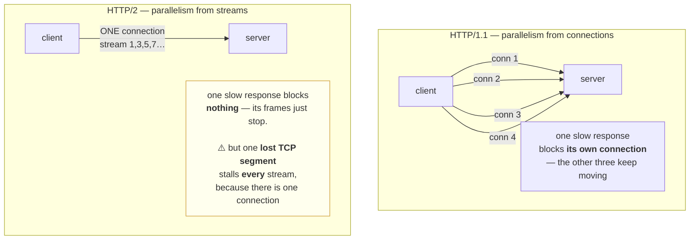

# 2.3 — HTTP/2 multiplexing and what it does not fix

## One-line answer

HTTP/2 puts many independent request/response **streams** inside one TCP connection, which removes the
protocol's own head-of-line blocking and the need for a pool of parallel connections — but **it does not
remove TCP's head-of-line blocking**, and it replaces "how many connections may I open" with "how many
streams will you allow me", which is a limit set by the *server* and invisible in your configuration.

---

## The story

🎬 **The scene.** A single-track railway line between two towns. One train at a time, in one direction.
Freight, passengers, mail — all of it queues for the track.

The mail train is short and fast. The freight train is enormous. If the freight goes first, everything
behind it waits, including a doctor on the passenger service.

😬 **The naive fix.** Build four more single tracks. Now five things can move at once.

💥 **Why it fails.** It works, and it is ruinously expensive, and it does not actually solve the problem —
it just makes it five times less likely. Put six trains on and somebody is still stuck behind the freight.
And each new track needs its own signalling, its own maintenance and its own crew.

💡 **The insight.** Replace the trains with a conveyor. Cut every consignment into small boxes, label each
box with which consignment it belongs to, and send boxes down one track continuously in whatever order
suits. The mail's boxes and the freight's boxes interleave. Nobody waits for anybody's *whole* load.

And then — the part that matters — **notice what is still true.** There is still one track. If a landslide
blocks it, everything stops. Interleaving fixed the queueing *you* created; it did nothing about the
ground the track is built on.

---

## The idea in plain language

In HTTP/1.1, a connection carries **one request at a time**. You send a request, you wait for the
response, then you may send the next. That is why
[2.2](2.2-the-connection-pool-and-its-limits.md)'s pool exists at all: parallelism comes from opening
several connections, because one connection cannot do two things at once.

This gives HTTP/1.1 a specific defect called **head-of-line blocking**: a slow response holds the
connection, and every request queued behind it waits — even though those requests have nothing to do with
the slow one. The café rail from [2.2](2.2-the-connection-pool-and-its-limits.md), inside a single
connection.

**HTTP/2 changes the shape of the connection.** RFC 9113, verified at
`https://www.rfc-editor.org/rfc/rfc9113.html` on **2026-08-25**, replaces the text protocol with a binary
**framing layer**. Everything is a *frame* — a small labelled packet — and every frame carries a **stream
identifier**. A stream is one request and its response. Many streams share one connection, and their
frames interleave freely.

The consequences, in order of how much they matter to an operator:

**One connection instead of six.** The pool shrinks to a single connection per host. Handshakes, memory,
descriptors and — with TLS — session setup all collapse to one.

**No protocol-level head-of-line blocking.** A slow response occupies its own stream and nothing else.
Request twelve can complete while request three is still running.

**Header compression.** HPACK (RFC 7541) maintains a shared table of previously-seen header fields, so
repeated headers cost a few bytes instead of a few hundred. On a service with a dozen tracing, auth and
routing headers ([1.4](../01-the-message/1.4-headers-are-the-contract.md)) this is the difference between
metadata dominating a small request and not.

**Server push.** Deprecated and effectively dead. Chrome removed support; it solved a problem caches
already solved. Mentioned only so you recognise it when you meet it in old documentation.

### What it emphatically does not fix

**TCP head-of-line blocking is still there, and it got worse.**

TCP guarantees in-order delivery. If one segment is lost, the kernel holds every subsequent segment until
the missing one is retransmitted — because the application must not see byte 5000 before byte 4000. With
HTTP/1.1 and six connections, a loss on one connection stalls one connection; the other five keep moving.
**With HTTP/2 and one connection, a single lost segment stalls every stream on it.**

So on a clean network HTTP/2 is strictly better. On a lossy one it can be *worse* than HTTP/1.1, and this
is not a small effect — it is the entire reason HTTP/3 exists, moving the transport to QUIC over UDP where
streams really are independent.

**The concurrency limit did not disappear; it moved.** HTTP/2 has a setting called
`SETTINGS_MAX_CONCURRENT_STREAMS`, sent by each peer in a `SETTINGS` frame at connection start. The
default when unspecified is unlimited, but **every real server sets it**, commonly at one hundred.
Exceeding it means your requests queue in the client — the same queue as
[2.2](2.2-the-connection-pool-and-its-limits.md), with a number you did not choose and cannot see in your
own configuration.

**A connection is now a bigger blast radius.** One connection carrying a hundred in-flight requests means
that killing it kills a hundred requests. A `GOAWAY` frame during a deploy, an idle timeout firing, a
proxy restarting — each is now a hundred-request event rather than a one-request event.

### How a connection becomes HTTP/2 at all

Two mechanisms, and the distinction matters operationally:

**Over TLS: ALPN.** During the TLS handshake ([3.2](../03-tls/3.2-the-handshake-and-what-it-costs.md)) the
client lists the protocols it speaks — `h2`, `http/1.1` — and the server picks one. This costs no extra
round trip because it rides inside a handshake that was happening anyway. **In practice, HTTP/2 on the
public internet means HTTPS**, not because the specification requires it but because every browser does.

**Without TLS: prior knowledge.** The client simply starts speaking HTTP/2, assuming the server does too.
This is called `h2c`, and it is what service-to-service traffic inside a cluster usually uses. It fails
badly against an HTTP/1.1 server, because there is no negotiation to fall back on.

---

## Why Kriya needs it

**Day 37** puts an ingress controller in front of `pulse`, and the ingress speaks HTTP/2 to browsers while
speaking HTTP/1.1 to your service — a **protocol translation at the edge** that is invisible until
something depends on it.

**Day 34's Service** and **Day 42's replicas** meet the load-balancing consequence, which is the sharpest
one in this whole part: **a connection-level load balancer cannot balance HTTP/2**, because there is only
one connection carrying everything. All of one client's traffic pins to one backend. This is the single
most common HTTP/2 surprise in Kubernetes, and Day 42's uneven pod utilisation is where you will see it.

**Day 110** compares serving patterns, and gRPC — which Day 111 and Day 199's MCP transports both touch —
is built directly on HTTP/2 streams. Everything in this part is a gRPC prerequisite.

**Day 130** streams tokens from a model provider, where a long-lived response stream shares a connection
with everything else. **Day 202** deploys MCP servers, whose Streamable HTTP transport is a long-lived
HTTP response — and its behaviour under an idle timeout
([2.4](2.4-the-idle-timeout-race-and-the-phantom-502.md)) is decided by these mechanics.

---

## The mechanism

You will do three things: watch the negotiation, count the connections, and see the blocking that HTTP/2
removes.

First, prove that HTTP/1.1 has head-of-line blocking on a single connection. Reuse
[2.2](2.2-the-connection-pool-and-its-limits.md)'s slow dependency and force a pool of one:

```bash
DELAY=1.0 uv run uvicorn --app-dir days/day-008-http-and-tls/lab slowdep:app --host 127.0.0.1 --port 8026 --log-level warning &
sleep 2
MAX_CONNECTIONS=1 CONCURRENCY=5 uv run python days/day-008-http-and-tls/lab/pool.py
```

**Line by line:**

- `MAX_CONNECTIONS=1` — one connection, so HTTP/1.1's one-request-at-a-time rule is fully exposed.
- `CONCURRENCY=5` — five requests offered simultaneously against that single connection.
- The prediction from [2.2](2.2-the-connection-pool-and-its-limits.md)'s arithmetic: `ceil(5 ÷ 1) × 1s`,
  so five seconds.

```text
pool=1  concurrency=5
  slowest single call (as the client library sees it): 5.02s
  slowest end-to-end (as a user sees it):              5.02s
```

**Five seconds for work that took one.** That is head-of-line blocking on one connection, and it is why
HTTP/1.1 clients open several.

### Watching the negotiation happen

`curl` reports the protocol it ended up speaking:

```bash
curl -sS -o /dev/null -w 'version=%{http_version}  alpn-negotiated\n' https://www.rfc-editor.org/rfc/rfc9113.html
curl -sS -o /dev/null -w 'version=%{http_version}  (plain HTTP, no ALPN available)\n' http://127.0.0.1:8000/healthz
```

**Line by line:**

- `%{http_version}` — `curl`'s write-out variable reporting the negotiated version: `1.1`, `2`, or `3`.
- The first URL is HTTPS to a public host, so ALPN happens inside the TLS handshake.
- The second is plain HTTP to `pulse`, where **there is no ALPN at all** — no TLS means no place to
  negotiate — so the only route to HTTP/2 would be prior knowledge, which uvicorn's default handler does
  not offer.

```text
version=2  alpn-negotiated
version=1.1  (plain HTTP, no ALPN available)
```

**That is the practical rule in one comparison:** on the public internet, HTTP/2 rides on TLS; on plain
HTTP it does not happen by accident.

### Counting connections, which is the part that surprises people

```bash
uv run python - <<'PY'
import asyncio
import httpx2

URL = "https://www.rfc-editor.org/rfc/rfc9113.html"

async def run(http2: bool) -> None:
    async with httpx2.AsyncClient(http2=http2, timeout=30.0) as client:
        responses = await asyncio.gather(*(client.head(URL) for _ in range(8)))
    versions = {r.http_version for r in responses}
    print(f"http2={http2!s:5}  requests=8  negotiated={sorted(versions)}")

asyncio.run(run(False))
asyncio.run(run(True))
PY
```

**Line by line:**

- `httpx2.AsyncClient(http2=True)` — httpx2 requires HTTP/2 to be enabled explicitly and requires the
  `h2` package to be installed, verified at `https://www.python-httpx.org/http2/` on **2026-08-25**. **It
  is off by default**, which is worth knowing: a client you believed was using HTTP/2 very often is not.
- `client.head(...)` — `HEAD` rather than `GET`, so the eight requests do not download the body eight
  times. It is safe and idempotent ([1.2](../01-the-message/1.2-methods-safety-and-idempotency.md)),
  which is exactly why it is the right method for a probe.
- `r.http_version` — the negotiated version as the client saw it, per response.
- Two separate `asyncio.run` calls — each gets a fresh event loop and a fresh client, so the second run
  cannot benefit from the first's connections.

```text
http2=False  requests=8  negotiated=['HTTP/1.1']
http2=True   requests=8  negotiated=['HTTP/2']
```

**Eight requests, and in the second case one connection carried all of them.** The pool did not shrink
because you configured it smaller — it shrank because the protocol no longer needs parallel connections to
get parallelism.



### The limit you did not set

Ask a server what it will allow:

```bash
uv run python - <<'PY'
import httpx2

with httpx2.Client(http2=True, timeout=15.0) as client:
    r = client.head("https://www.rfc-editor.org/rfc/rfc9113.html")
    print("negotiated:", r.http_version)
    print("note: SETTINGS_MAX_CONCURRENT_STREAMS is exchanged in a SETTINGS frame")
    print("      at connection start, and httpx2 does not surface it in the public API.")
    print("      Read it with:  curl --http2 -v <url> 2>&1 | grep -i 'MAX_CONCURRENT'")
PY
```

**Line by line:**

- The point of this block is the *absence*: **httpx2 gives you no way to read the server's stream limit**,
  and neither do most clients. The limit is real, it bounds your concurrency, and it is not in your
  configuration file.
- `curl --http2 -v` with a `grep` is the practical way to see it, because `curl` logs the `SETTINGS` frame
  it received in verbose mode.
- This is the honest state of the tooling on **2026-08-25**, not a gap in the exercise.

```text
negotiated: HTTP/2
note: SETTINGS_MAX_CONCURRENT_STREAMS is exchanged in a SETTINGS frame
      at connection start, and httpx2 does not surface it in the public API.
      Read it with:  curl --http2 -v <url> 2>&1 | grep -i 'MAX_CONCURRENT'
```

**That is the operational lesson of this section.** In HTTP/1.1 your concurrency limit is a number you
set. In HTTP/2 it is a number the *server* sets, sent once at connection start, and your client silently
queues against it.

### Serving HTTP/2 from uvicorn

Verified against uvicorn's settings documentation on **2026-08-25**: the `--http` option selects the
protocol handler, with values `'auto'`, `'h11'`, `'httptools'`, `'zttp'`, `'zttp1'`, `'zttp2'` and a
default of `'auto'`. The documentation describes the **`zttp` variants as experimental**, supporting
HTTP/1.1 and HTTP/2 negotiation via ALPN or prior knowledge.

```bash
uv run uvicorn pulse.api:app --host 127.0.0.1 --port 8000 --http zttp --log-level info
```

**Line by line:**

- `--http zttp` — the negotiating handler. **Marked experimental in the official documentation, so this
  is a thing to know about rather than a thing to depend on**, and `pulse` keeps the default until
  something requires otherwise.
- Without TLS there is no ALPN, so a client must use prior knowledge to get HTTP/2 here — which is why
  the `curl` above still reported `1.1` against the default handler.
- **The production answer is almost always different anyway:** HTTP/2 is terminated at the edge by a
  proxy (Day 37), which speaks HTTP/1.1 to the application. That is not a compromise; it is the normal
  architecture, and [5.1](../05-pulse-on-tls/5.1-where-tls-terminates-and-what-you-stop-seeing.md)
  explains why.

---

## When it breaks

**A client asked for HTTP/2 and the package is missing.** The first thing you meet:

```text
ImportError: Using http2=True, but the 'h2' package is not installed. Make sure to install httpx
using `pip install httpx[http2]`.
```

**What it says:** HTTP/2 support is an optional extra.
**What it actually means:** the framing layer is a separate implementation, not part of the core client.
**The smallest fix:** install the extra — and, under Principle 7, look up the version live and add a dated
row to `docs/PACKAGES.md` before pinning it. `TODO(curl -s https://pypi.org/pypi/h2/json | python -c "import sys,json;print(json.load(sys.stdin)['info']['version'])")`.
**Worth noting:** this is a lab curiosity today. `pulse` adds no dependency on Day 8.

**Prior-knowledge HTTP/2 against an HTTP/1.1 server.** No negotiation, no fallback:

```text
curl: (16) Error in the HTTP2 framing layer
```

**What it says:** the framing layer failed.
**What it actually means:** the client sent the HTTP/2 connection preface — a fixed byte string beginning
`PRI * HTTP/2.0` — and the server, an HTTP/1.1 parser, read it as a malformed request line.
**The smallest fix:** use ALPN over TLS, or configure the server for `h2c` explicitly.
**Where you will actually meet it:** service-to-service calls in a cluster, where somebody enabled HTTP/2
on the client because "it is faster" and the receiving service does not speak it. **There is no
negotiation to save you**, which is the practical difference between `h2` and `h2c`.

**All the traffic went to one pod.** The Kubernetes classic, and it produces no error at all:

```text
NAME                     CPU(cores)   MEMORY(bytes)
pulse-7d9c4b8f6-2xk9v    892m         410Mi
pulse-7d9c4b8f6-fq7mt    3m           98Mi
pulse-7d9c4b8f6-p4nzl    2m           97Mi
```

**What it says:** one pod is working and two are idle.
**What it actually means:** the client opened **one** HTTP/2 connection, a Service load-balances
connections rather than requests, and every stream on that connection therefore lands on one pod. Scaling
up adds pods that will never be used.
**The smallest fix:** a proxy that understands HTTP/2 and balances per-request — which is what a service
mesh or an HTTP/2-aware ingress does — or a maximum connection age on the client so connections rotate.
**Why this is the important one:** it is the direct cost of the thing HTTP/2 improved. Fewer connections
is better for setup cost and worse for anything that balances by counting connections.

**One connection died and a hundred requests went with it.** The blast-radius consequence:

```text
httpx2.RemoteProtocolError: <ConnectionTerminated error_code:0, last_stream_id:199, additional_data:None>
```

**What it says:** the peer sent a `GOAWAY` frame with error code `0` — a *graceful* shutdown.
**What it actually means:** the server is going away politely, telling you the highest stream id it will
finish. Everything above that id is your problem. **A correct client retries those on a fresh connection**;
a naive one surfaces a hundred errors from one event.
**The smallest fix:** ensure the client handles `GOAWAY` by reconnecting and retrying idempotent streams —
and note the qualifier, because [1.2](../01-the-message/1.2-methods-safety-and-idempotency.md) applies
here exactly as it does everywhere else.
**When this happens routinely:** every deploy. A rolling update sends `GOAWAY` from each pod as it drains,
which is precisely the graceful shutdown from
[Day 4, 4.1](../../../day-004-linux-for-operators-i/parts/04-the-service-died/4.1-graceful-shutdown-for-pulse.md)
seen from the client's side.

---

## In production

**What a professional writes instead of the teaching version.** They terminate HTTP/2 at the edge and
speak HTTP/1.1 internally, unless something specific — gRPC, streaming, a very chatty internal path —
justifies otherwise. The reason is not conservatism: it is that **HTTP/1.1 internally keeps
per-request load balancing working with the simplest possible infrastructure**, and per-request balancing
is worth more inside a cluster than a saved handshake. When they do run HTTP/2 end to end, they add a
proxy that balances per-request and they set a maximum connection age so connections rotate across
backends.

**What degrades at scale.** The stream limit and the connection's blast radius, together. A hundred
concurrent streams on one connection sounds like plenty until a burst arrives, and the queueing is
invisible ([2.2](2.2-the-connection-pool-and-its-limits.md)). Meanwhile every connection-level event —
`GOAWAY`, idle timeout, a proxy restart, a network blip — is amplified by however many streams were in
flight. **Fewer, bigger connections means fewer, bigger failures.**

**The failure that only shows with real traffic.** TCP head-of-line blocking on a lossy path. In a
datacentre, packet loss is near zero and HTTP/2 is a clear win. Over mobile networks or a congested
transit link, a single lost segment stalls every stream on the connection — so the tail latency of an
HTTP/2 client can be *worse* than an HTTP/1.1 client with six connections, under exactly the conditions
that are hardest to reproduce in a test. **This is not a bug to fix; it is the trade-off, and HTTP/3 is
the industry's answer to it.**

**The review comment a senior engineer leaves.** *"Enabling HTTP/2 on this internal client means our
Service stops balancing — all the traffic from each replica will pin to one backend pod, and the
autoscaler will see one hot pod and two idle ones. If we want HTTP/2 here we need an L7 proxy in the path;
otherwise leave it on 1.1 and keep the pool."*

**The signal you would alert on.** **Requests per backend, as a distribution rather than a total** —
because the HTTP/2 balancing failure shows up as skew and nothing else. A ratio of maximum to median
requests per pod, alerted when it exceeds a threshold, catches it; a total request rate never will. The
second worth having is **`GOAWAY` frames received per second on the client**, which should be near zero
outside deploys — a steady rate means something upstream is cycling connections and you are paying for it
in retries. You would **not** alert on protocol version, which is a configuration fact rather than a time
series.

**Blast radius.** This part adds no capability to `pulse` and changes no `pulse` code. It makes a small
number of `HEAD` requests to a public documentation host — **the only part of Day 8 that leaves the
machine**, and deliberately to a specification server rather than anything commercial. Worst case: a few
requests to a public site, well under any conceivable rate limit. Who can trigger it: you. What bounds it:
eight requests, `HEAD` only, no body downloaded.

**Cost.** `0` model calls, `0` tokens, `0` CI minutes, `0` disk. RAM: unchanged. **Network: roughly a
dozen HTTPS requests to `rfc-editor.org`, `HEAD` only** — a few kilobytes in total. If you would rather
not leave the machine at all, [5.2](../05-pulse-on-tls/5.2-serving-pulse-over-tls-on-purpose.md) gives you
a local TLS endpoint and the same experiment runs against it.

**The interview question.** *"We turned on HTTP/2 and one pod is now doing all the work. Why?"* The answer
that lands is causal, not a list of facts: *"Because HTTP/2 needs only one connection, and a Kubernetes
Service balances connections, not requests. Every stream from that client lands on whichever pod the one
connection reached. It is the direct cost of the thing HTTP/2 improved — we removed the connections that
the load balancer was using to distribute work. The fixes are an L7 proxy that balances per stream, or a
maximum connection age so the client reconnects periodically and re-lands somewhere else. And it is worth
saying that the same property is why HTTP/2 hurts on a lossy network: one connection means one lost
segment stalls everything, which is what HTTP/3 exists to solve."*

---

## Check yourself

```bash
curl -sS -o /dev/null -w 'public https : version=%{http_version}\n' https://www.rfc-editor.org/rfc/rfc9113.html
curl -sS -o /dev/null -w 'local  http  : version=%{http_version}\n' http://127.0.0.1:8000/healthz
```

Two requests, two protocol versions, and the difference is entirely whether TLS was present to carry the
ALPN negotiation. **Say which of the two could ever become HTTP/2 without changing the client, and why.**

**Say out loud, without scrolling up:** *Name the head-of-line blocking HTTP/2 removes and the one it does
not. Then explain why a service that switched to HTTP/2 might see worse tail latency on a mobile network
and better tail latency inside a datacentre.*
