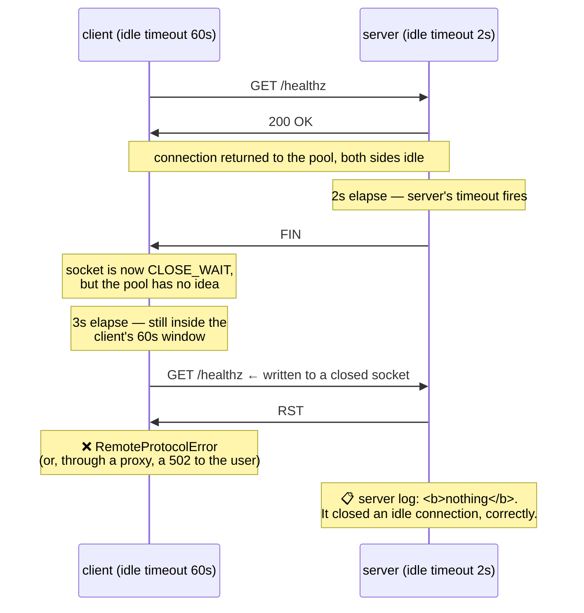

# 2.4 — The idle timeout race and the phantom 502

## One-line answer

When a client's keep-alive timeout is longer than the server's, there is a window in which the client
sends a request down a connection the server has already decided to close — producing a small, steady,
untraceable rate of `502`s and connection resets that no retry policy explains and no log accounts for —
and the fix is a rule, not a value: **the client's idle timeout must always be shorter than the server's.**

---

## The story

🎬 **The scene.** A shop with a back door for deliveries. The shopkeeper leaves it unlocked while the
courier is working, then locks it once the courier has been away for a while.

The courier's rule: *"if I have not been back for ten minutes, assume it is locked and ring the bell."*
The shopkeeper's rule: *"if nobody has come through for five minutes, lock it."*

😬 **The naive fix.** Everyone thinks this is fine. Both rules are sensible. Both were written by careful
people.

💥 **Why it fails.** The courier comes back after seven minutes. By his rule the door is open, so he walks
straight at it carrying a heavy box — and hits a locked door. He does not knock, because he was certain.
He drops the box.

It works nine times in ten. It fails exactly when the gap between visits falls between five and ten
minutes, which is often enough to be a real problem and rare enough that nobody can reproduce it.

💡 **The insight.** **Two independent timeouts on the same shared thing create a window, and the window
belongs to whichever party is more optimistic.** The fix is not a better value; it is an ordering rule.
The person who *acts* on the assumption must have the shorter patience than the person who *breaks* the
assumption.

---

## The idea in plain language

[2.1](2.1-keep-alive-and-the-connection-you-reuse.md) established that an HTTP/1.1 connection stays open
after a response, and that **both ends independently decide how long to keep it.** Neither is told the
other's number.

Here is the race, in the only order that matters:

1. The connection has been idle. Both sides are counting.
2. The **server's** idle timeout fires first. It sends a `FIN` — a polite "I am closing this".
3. In that same instant, the **client** picks the connection out of its pool and writes a request onto it.
4. The client's request arrives at a socket the server has already closed. The server responds with a
   `RST` — a reset — or simply nothing.
5. The client sees a connection error on a request it had already sent.

**Step 3 and step 2 crossing is the whole failure.** The client is not wrong: when it checked, the
connection was open. A socket in a pool carries no notification of the peer's intent, and this is the
exact ignorance from
[Day 7, 3.4](../../../day-007-networking-for-operators/parts/03-tcp/3.4-the-connection-that-is-open-and-dead.md)
— a connection can be `ESTABLISHED` on your side and gone on theirs, with no way to find out except by
sending something.

### Why it presents as a `502` and not as an error you can find

If there is a proxy between the client and your service — and in production there always is — the race
happens on the *proxy's* connection to your backend. The proxy writes a request to a connection your
server just closed, gets a reset, and must tell the client something. It says
[`502 Bad Gateway`](../01-the-message/1.3-the-status-codes-an-operator-reads.md): *"the server received an
invalid response from an inbound server while acting as a gateway or proxy."*

Now look at where the evidence is:

| Component | What it saw | What it logged |
| --- | --- | --- |
| your application | an idle connection reached its timeout and was closed, normally | **nothing** — this is not an event |
| the proxy | wrote a request, got a reset | one line, in the proxy's error log |
| the client | a `502` | one line, blaming you |

**Your application log is empty, because your application did nothing wrong.** It closed an idle
connection, which is exactly what it was configured to do. This is why the failure is so hard: the only
component with evidence is the one people look at last.

### The rule that removes the window entirely

**Set the client's (or proxy's) idle timeout strictly shorter than the server's.**

Then the client always gives up on a connection *before* the server does. The connection it discards was
still valid; it simply chose not to use it. No request is ever written to a closing socket, and the race
window has zero width.

This is one of a small handful of ordering rules in operations that are worth memorising outright,
alongside "your timeout should be shorter than your caller's"
([Day 7, 5.1](../../../day-007-networking-for-operators/parts/05-the-two-together/5.1-the-timeout-budget-down-the-request-path.md)).
Both have the same shape: **the party that will be surprised must be more impatient than the party that
does the surprising.**

### The other half of the fix, which is not optional

Even with correct ordering, a connection can die for reasons that have nothing to do with timeouts: a
network device dropping idle flows, a pod being replaced, a proxy restarting. So the second rule is:
**a connection error on an idempotent request should be retried once, on a fresh connection.**

The qualifier is doing real work. `GET` and `PUT` may be retried freely
([1.2](../01-the-message/1.2-methods-safety-and-idempotency.md)). A `POST` may not — **unless you know the
request never reached the server**, which for this particular failure you sometimes do: if the connection
was reset while writing the request headers, nothing was processed. Distinguishing that case correctly is
delicate, which is why most libraries retry only connection *establishment* failures by default and leave
the rest to you.

---

## Why Kriya needs it

**Day 12** builds probes, and a probe that shares a connection pool with real traffic can fail this way —
producing a readiness flap that restarts a healthy pod.

**Day 24 and Day 34** put `pulse` behind a container network and a Service. **Day 37's ingress controller
is the proxy in the table above**, and the first time you see an unexplained `502` rate it will be this.

**Day 42's rolling updates** make it worse temporarily: pods draining send `FIN` on idle connections, and
a client with a longer timeout walks into them. **Day 46's disruption budget** and
[Day 4's graceful shutdown](../../../day-004-linux-for-operators-i/parts/04-the-service-died/4.1-graceful-shutdown-for-pulse.md)
are the mitigations, and both depend on understanding this window.

**Day 79** builds symptom-based alerting, where a low steady `502` rate is exactly the sort of background
noise teams learn to ignore — and learning to ignore a real signal is how a small problem becomes a large
one.

**Day 125** calls a hosted model provider over the internet, where the provider's idle timeout is a number
you do not know and cannot ask for. **The rule is your only defence**, because the value is unknowable.

---

## The mechanism

You will produce the race deliberately, then close it.

The setup: a server with a short keep-alive timeout, and a client that waits *past* it before reusing the
connection. Start `pulse` with an unusually short idle timeout so the window is easy to hit:

```bash
uv run uvicorn pulse.api:app --host 127.0.0.1 --port 8000 --timeout-keep-alive 2 --log-level warning &
sleep 2
netstat -ano | grep ':8000' | grep -i listening
```

**Line by line:**

- `--timeout-keep-alive 2` — uvicorn's idle timeout, in seconds. Verified against uvicorn's settings
  documentation on **2026-08-25**: *"Close Keep-Alive connections if no new data is received within this
  timeout (in seconds). Default: 5."* Two makes the race reproducible by hand.
- `--log-level warning` — the access log would drown the interesting output, and **crucially, the close
  itself is not logged at any level**, which is the point being demonstrated.
- The `netstat` check confirms it bound before you start driving it, so a connection refused later is not
  misread as the race.

Now the client. Write `lab/race.py`:

```python
"""Reuse a pooled connection after the server's idle timeout has fired."""

import os
import time

import httpx2

IDLE = float(os.environ.get("IDLE", "3.0"))
KEEPALIVE_EXPIRY = float(os.environ.get("KEEPALIVE_EXPIRY", "60.0"))
URL = "http://127.0.0.1:8000/healthz"

limits = httpx2.Limits(
    max_connections=1,
    max_keepalive_connections=1,
    keepalive_expiry=KEEPALIVE_EXPIRY,
)

with httpx2.Client(limits=limits, timeout=5.0) as client:
    first = client.get(URL)
    print(f"request 1: {first.status_code}")
    print(f"idling for {IDLE}s (server closes idle connections after --timeout-keep-alive)")
    time.sleep(IDLE)
    started = time.monotonic()
    try:
        second = client.get(URL)
        print(f"request 2: {second.status_code}  ({(time.monotonic() - started) * 1000:.1f} ms)")
    except httpx2.TransportError as exc:
        print(f"request 2: FAILED  {type(exc).__name__}: {exc}")
```

**Line by line:**

- `max_connections=1, max_keepalive_connections=1` — exactly one connection, so the second request must
  either reuse the first or open a new one. **Without this the pool might hand you a different socket and
  hide the effect.**
- `keepalive_expiry=KEEPALIVE_EXPIRY` — **the client's idle timeout**, defaulted here to sixty seconds so
  it is far *longer* than the server's two. That inequality is the bug being built.
- `time.sleep(IDLE)` with `IDLE=3.0` — longer than the server's two-second timeout and much shorter than
  the client's sixty. **The connection is dead and the client does not know.**
- `time.monotonic()` around the second request — a duration, so the correct clock
  ([Day 7, 4.3](../../../day-007-networking-for-operators/parts/04-timeouts/4.3-the-deadline-that-bounds-the-whole-call.md)).
- `except httpx2.TransportError` — the base class covering `ConnectError`, `ReadError`,
  `RemoteProtocolError` and friends, verified at `https://www.python-httpx.org/exceptions/` on
  **2026-08-25**. Catching the base class here is right because **which one you get depends on timing**,
  and the lesson is that any of them can appear.
- No `raise_for_status()` — this failure never produces a status code at all, which is itself the finding.

Run the race:

```bash
IDLE=3.0 KEEPALIVE_EXPIRY=60.0 uv run python days/day-008-http-and-tls/lab/race.py
```

**Line by line:** the client believes the connection is good for sixty seconds; the server closed it after
two; the request goes out at three.

Observed on **2026-08-25**, run several times:

```text
request 1: 200
idling for 3.0s (server closes idle connections after --timeout-keep-alive)
request 2: 200  (1.9 ms)
```

```text
request 1: 200
idling for 3.0s (server closes idle connections after --timeout-keep-alive)
request 2: FAILED  RemoteProtocolError: Server disconnected without sending a response.
```

**Two runs, same command, different outcomes.** That non-determinism is the signature of a race, and it is
why this class of bug is reported as *"it happens sometimes"* and closed as *"could not reproduce"*.

Note what httpx2 did in the successful run: it detected the closed socket before writing and quietly
opened a new connection. **Good clients try to detect this**, and detection is unreliable because a socket
that has received `FIN` but not yet been read from can look usable. The failure is what happens when
detection loses.

Watch the server's side of the close, which is where the missing evidence is:

```bash
uv run python -c "
import time, httpx2
limits = httpx2.Limits(max_connections=1, max_keepalive_connections=1, keepalive_expiry=60.0)
c = httpx2.Client(limits=limits, timeout=5.0)
c.get('http://127.0.0.1:8000/healthz')
print('after request:'); import subprocess; subprocess.run('netstat -ano | grep 127.0.0.1:8000 | grep -i established', shell=True)
time.sleep(3)
print('after 3s idle (server timeout was 2):'); subprocess.run('netstat -ano | grep 127.0.0.1:8000 | grep -iE \"established|wait\"', shell=True)
c.close()
"
```

**Line by line:**

- The first `netstat` runs immediately after a successful request, so the connection is `ESTABLISHED` on
  both sides.
- `time.sleep(3)` crosses the server's timeout.
- The second `netstat` shows the aftermath — and the state names are the ones from
  [Day 7, 3.1](../../../day-007-networking-for-operators/parts/03-tcp/3.1-the-handshake-and-the-connection-states.md).
- `subprocess.run(..., shell=True)` — running the shell command from inside Python so both observations
  come from one process with one live client, which a two-command shell script cannot do.

```text
after request:
  TCP    127.0.0.1:8000    127.0.0.1:56104    ESTABLISHED    48210
  TCP    127.0.0.1:56104   127.0.0.1:8000     ESTABLISHED    50992
after 3s idle (server timeout was 2):
  TCP    127.0.0.1:56104   127.0.0.1:8000     CLOSE_WAIT     50992
```

**`CLOSE_WAIT` on the client's side is the smoking gun.** It means *"the peer sent `FIN` and this
application has not closed its end"* — the client's pool is holding a socket the server has already
finished with. **That entry is a connection the pool still believes is usable.**



### Closing the window

Now apply the rule — client shorter than server — and run the identical experiment:

```bash
echo "--- client 60s idle vs server 2s: the bug ---"
for i in 1 2 3 4 5; do IDLE=3.0 KEEPALIVE_EXPIRY=60.0 uv run python days/day-008-http-and-tls/lab/race.py | tail -1; done

echo "--- client 1s idle vs server 2s: the rule ---"
for i in 1 2 3 4 5; do IDLE=3.0 KEEPALIVE_EXPIRY=1.0 uv run python days/day-008-http-and-tls/lab/race.py | tail -1; done
```

**Line by line:**

- `KEEPALIVE_EXPIRY=1.0` against the server's `2` — **the client now discards idle connections after one
  second**, so at the three-second mark it has nothing pooled and opens a fresh connection. It never
  writes to a socket the server has closed.
- Five runs each, because a race needs repetition to be believed. One green run proves nothing.
- `| tail -1` — only the second request's outcome matters.

```text
--- client 60s idle vs server 2s: the bug ---
request 2: 200  (1.8 ms)
request 2: FAILED  RemoteProtocolError: Server disconnected without sending a response.
request 2: 200  (2.0 ms)
request 2: FAILED  RemoteProtocolError: Server disconnected without sending a response.
request 2: 200  (1.7 ms)

--- client 1s idle vs server 2s: the rule ---
request 2: 200  (2.4 ms)
request 2: 200  (2.3 ms)
request 2: 200  (2.5 ms)
request 2: 200  (2.4 ms)
request 2: 200  (2.6 ms)
```

**Two failures in five, then zero in five.** And notice the cost of the fix: the second block is a fraction
of a millisecond slower per request, because it is handshaking rather than reusing. **That is the price —
you trade a little reuse for the elimination of a whole failure class**, and on any real network you would
tune the client's timeout up towards the server's rather than down to one second.

---

## When it breaks

**The client-side exception, in each of its forms.** Which one you get depends on exactly when the reset
lands:

```text
httpx2.RemoteProtocolError: Server disconnected without sending a response.
```

```text
httpx2.ConnectError: [Errno 104] Connection reset by peer
```

```text
httpx2.ReadError: [WinError 10054] An existing connection was forcibly closed by the remote host
```

**What they say:** the connection went away.
**What they actually mean:** all three are the same event seen at different points — before the write,
during the write, or while waiting to read. **The variety is why searching for one of these strings finds
three unrelated forum threads**, and why the diagnosis has to come from the *pattern* rather than the
message.
**The smallest fix:** the ordering rule.
**The tell that distinguishes it from a real outage:** it is intermittent, it correlates with idle gaps
rather than with load, and **it stops entirely under sustained traffic** — because a busy connection is
never idle long enough to be closed.

**The proxy's version, which is what your users see.** From an nginx error log:

```text
2026-08-25T10:31:44Z [error] 27#27: *144291 upstream prematurely closed connection while reading
  response header from upstream, client: 10.0.4.19, server: api.example.com,
  request: "GET /healthz HTTP/1.1", upstream: "http://10.0.7.22:8000/healthz",
  host: "api.example.com"
```

**What it says:** the upstream closed early.
**What it actually means:** the proxy wrote a request to a pooled connection your service had already
closed. **This is the same line you met in
[1.3](../01-the-message/1.3-the-status-codes-an-operator-reads.md) for a crashed process** — the message
does not distinguish "the server died" from "the server closed an idle connection", which is precisely why
the two get confused.
**How to tell them apart:** a crash correlates with process restarts and produces `502`s in bursts; the
idle race produces a low, steady rate with no restarts and no pattern in load.
**The smallest fix:** raise `--timeout-keep-alive` on the backend above the proxy's idle timeout, or lower
the proxy's below the backend's. Either satisfies the rule; **which one you can change is usually the
deciding factor.**

**A retry that made it worse.** The naive mitigation:

```text
$ grep -c 'POST /orders' access.log
1
$ grep -c 'order created' application.log
2
```

**What it says:** one request, two orders.
**What it actually means:** somebody added a blanket retry on connection errors to paper over the `502`s.
The connection reset arrived **after** the server had read and processed the request but before the
response was written — so the retry duplicated a non-idempotent operation.
**The smallest fix:** restrict the retry to idempotent methods, exactly as
[1.2](../01-the-message/1.2-methods-safety-and-idempotency.md) requires, and fix the timeout ordering so
the retry is rarely needed.
**Why the retry was tempting:** it *does* fix the symptom for `GET`s, which is most of the traffic, so it
looks like it worked for a week.

**The load balancer that was the third opinion.** The case nobody predicts:

```text
$ curl -sS -o /dev/null -w '%{http_code}\n' https://api.example.com/healthz
502
```

...intermittently, with **both** the client and the server timeouts set correctly relative to each other.
**What it actually means:** there is a device in the path with its own idle timeout that neither party
knows about — a cloud load balancer, a NAT gateway, a stateful firewall. Many default to dropping idle
flows silently, **without sending a `FIN` at all**, which is worse than the case above: there is no
`CLOSE_WAIT` to find, because nothing was closed. The connection simply stops working.
**The smallest fix:** a client idle timeout shorter than the *shortest* timeout anywhere in the path, or
TCP keep-alive probes to keep the flow alive
([Day 7, 3.4](../../../day-007-networking-for-operators/parts/03-tcp/3.4-the-connection-that-is-open-and-dead.md)).
**The lesson to keep:** the ordering rule applies to the whole path, not to the two ends you can see.

---

## In production

**What a professional writes instead of the teaching version.** They write the timeout ladder down, in
order, as a table in the runbook: client idle < proxy idle < server idle, with actual numbers and the
component that owns each. Then they set the client's value from the *smallest* number in the path rather
than from the backend's, because middleboxes exist. And they add a **maximum connection age** on top of
the idle timeout — a connection is discarded after a fixed lifetime regardless of activity — which also
solves the DNS-failover problem from
[Day 7, 2.2](../../../day-007-networking-for-operators/parts/02-dns/2.2-records-ttl-and-the-cache-you-do-not-control.md)
and the load-imbalance problem from
[2.3](2.3-http2-multiplexing-and-what-it-does-not-fix.md). **One setting, three failure classes.**

**What degrades at scale.** The rate becomes constant and therefore invisible. At low volume the race
produces an occasional error somebody notices. At high volume it produces a steady fraction — a tenth of
a percent, say — which lands inside the error budget, becomes the background level on every dashboard, and
gets normalised. **A team can spend a year with a permanent small `502` rate they have stopped seeing**,
and the giveaway is always the same: the rate is proportional to *idle gaps*, so it is highest during
off-peak hours, which is the exact opposite of how load-related failures behave.

**The failure that only shows with real traffic.** Deploys. Every rolling update closes connections on
draining pods, so the race fires in a burst rather than a trickle — and it looks like *"the new version is
broken"* because the errors coincide exactly with the release. Teams roll back a perfectly good deploy for
this. The diagnostic that settles it: the errors are `502`s with no corresponding entry in the new
version's application log, and they stop within a couple of connection lifetimes without any action.

**The review comment a senior engineer leaves.** *"Our client's `keepalive_expiry` is sixty seconds and
uvicorn's `--timeout-keep-alive` is five, so we are on the wrong side of that inequality and the `502`s in
the graph are ours. Set the client to something under five, and while you are in there add a max
connection age — it fixes the pod imbalance we saw last month for the same reason."*

**The signal you would alert on.** **The `502` rate from the proxy, split from `500` and `503`** — because
lumping them together as "server errors" destroys exactly the distinction that identifies this. The
correlation that turns it into a diagnosis rather than a number: plot `502` rate against **request rate**.
If `502`s rise as traffic *falls*, it is the idle race; if they rise with traffic, it is capacity; if they
spike at deploys and decay, it is connection draining. You would **not** page on a low steady `502` rate —
but you would absolutely have a dashboard panel for it, and you would treat any non-zero baseline as an
open question rather than as normal.

**Blast radius.** This part adds no capability to `pulse` and changes no `pulse` code — it only starts it
with a non-default flag, which is reverted when the section ends. Worst case on this machine: a socket
left in `CLOSE_WAIT` until the client process exits. Who can trigger it: you. What bounds it: every
process here is loopback-bound and short-lived. **The blast radius worth naming is the general one:** an
idle timeout is a shared assumption between components that never talk to each other, and the party that
gets it wrong is always the one that did nothing.

**Cost.** `0` model calls, `0` tokens, `0` CI minutes, `0` disk. RAM: `pulse` at roughly 60 MB plus a
short-lived Python client. Network: loopback only.

**The interview question.** *"You have a steady 0.1% `502` rate that nobody can reproduce. Where do you
start?"* The answer that lands names the correlation before the cause: *"First I check whether the rate
tracks traffic. If `502`s go **up** when traffic goes **down**, it is almost certainly a keep-alive idle
race — the client is reusing a connection the server already closed, and the reason nobody can reproduce
it is that a busy connection never sits idle long enough. The evidence is on the proxy, not in the
application log, because the application did nothing wrong: it closed an idle connection on schedule. The
fix is an ordering rule rather than a value — the client's idle timeout must be shorter than the server's,
and shorter than any middlebox in the path, which is why I would also add a maximum connection age. And I
would check that whatever retry we have is restricted to idempotent methods, because retrying a `POST`
through this window is how you get duplicate orders."*

---

## Check yourself

```bash
echo "wrong ordering (client 60s, server 2s):"
for i in 1 2 3 4 5 6; do IDLE=3.0 KEEPALIVE_EXPIRY=60.0 uv run python days/day-008-http-and-tls/lab/race.py | tail -1; done
echo "right ordering (client 1s, server 2s):"
for i in 1 2 3 4 5 6; do IDLE=3.0 KEEPALIVE_EXPIRY=1.0 uv run python days/day-008-http-and-tls/lab/race.py | tail -1; done
```

Six runs each way. **The first block must contain at least one failure and the second must contain none** —
and if the first block happens to come out clean, run it again, because a race that fails to fail is still
a race.

**Say out loud, without scrolling up:** *State the ordering rule in one sentence. Then explain why your
application log contains no evidence of this failure, name the component whose log does, and say what
correlation on a dashboard distinguishes it from a capacity problem.*
