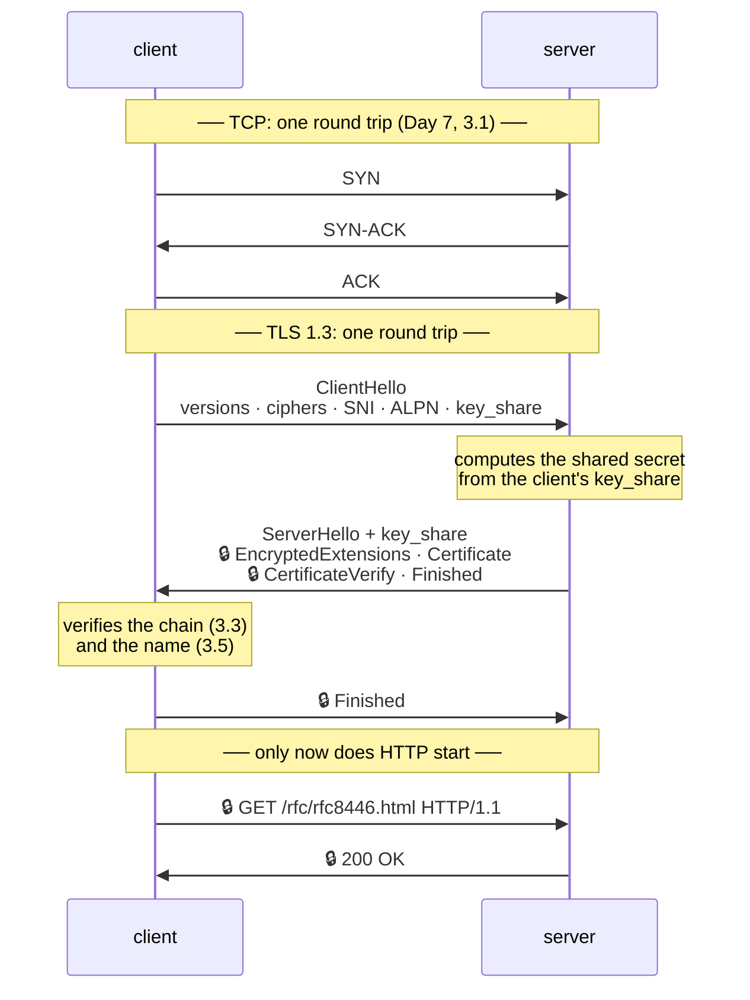

# 3.2 — The handshake and what it costs

## One-line answer

Before a single byte of HTTP moves, TLS runs a handshake that costs **one extra network round trip on top
of TCP's** — three phases: agree on keys, agree on parameters, prove identity — and because that cost is
paid per *connection* rather than per request, the connection reuse from
[2.1](../02-the-connection/2.1-keep-alive-and-the-connection-you-reuse.md) stops being an optimisation and
becomes the difference between a usable and an unusable latency.

---

## The story

🎬 **The scene.** A stranger arrives at a village post office to collect a parcel. Before anything can
happen there is a procedure, and it always takes the same shape.

She states which language she speaks and what identification she is carrying. The clerk picks one from her
list, produces his own credentials, and hands over a numbered token. They agree on a code word for the rest
of the visit. Only then does the parcel come out from the back.

😬 **The naive fix.** The next villager in the queue watches the whole performance and mutters that the
clerk should just hand over parcels.

💥 **Why it fails.** The procedure is what makes everything after it fast and safe. Skip it and the clerk
has no idea who is standing there. **The procedure is not overhead; it is the thing that permits the
shortcut later.**

But the mutterer is not entirely wrong either. The procedure takes the same length of time whether you
collect one parcel or forty — so a courier collecting forty parcels, one visit each, spends the whole
morning identifying himself.

💡 **The insight.** **A fixed setup cost is invisible when amortised and ruinous when repeated.** The
correct response is never "remove the check". It is "do it once and keep the token" — which is exactly
what session resumption and connection reuse are, and why the interesting operational question about TLS
is not *how much does it cost* but *how many times are you paying it*.

---

## The idea in plain language

[3.1](3.1-what-tls-actually-promises.md) said TLS makes three promises. The handshake is where they are
established, and RFC 8446 organises it into three phases. Verified at
`https://www.rfc-editor.org/rfc/rfc8446.html` on **2026-08-25**, quoted verbatim:

**Key Exchange.** *"Establish shared keying material and select the cryptographic parameters. Everything
after this phase is encrypted."*

**Server Parameters.** *"Establish other handshake parameters (whether the client is authenticated,
application-layer protocol support, etc.)."*

**Authentication.** *"Authenticate the server (and, optionally, the client) and provide key confirmation
and handshake integrity."*

Notice the sentence at the end of phase one: **everything after it is encrypted.** That is a TLS 1.3
improvement and it is the reason the certificate itself is no longer visible on the wire — in TLS 1.2 it
was sent in the clear, which leaked which site you were visiting even when the content was hidden.

Notice also the second phase's parenthetical: *"application-layer protocol support"*. **That is ALPN**, the
mechanism [2.3](../02-the-connection/2.3-http2-multiplexing-and-what-it-does-not-fix.md) described for
negotiating HTTP/2 — and it rides inside a handshake that was happening anyway, which is why it costs no
extra round trip.

### The messages, and where the round trip goes

A full TLS 1.3 handshake is **one round trip**, commonly written as `1-RTT`:

1. **Client → Server: `ClientHello`.** The versions and cipher suites it supports, the server name it wants
   (SNI — [3.4](3.4-sni-one-address-many-certificates.md)), the ALPN protocols it speaks, and — the clever
   part — a `key_share`: a guess at the key-exchange parameters, sent optimistically so the server can
   compute the shared secret immediately.
2. **Server → Client: `ServerHello`** with its own `key_share`, then, **already encrypted**:
   `EncryptedExtensions`, `Certificate`, `CertificateVerify` (a signature proving it holds the private key
   for that certificate), and `Finished`.
3. **Client → Server: `Finished`**, and application data may now flow.

That is one full round trip before HTTP starts — **on top of TCP's own round trip**
([Day 7, 3.1](../../../day-007-networking-for-operators/parts/03-tcp/3.1-the-handshake-and-the-connection-states.md)).
So a fresh HTTPS connection costs two round trips before the first request byte moves.

**TLS 1.2 cost two round trips**, so 1.3 halved it. That is the single biggest practical difference
between the versions, and it is why "are we on 1.3" is a latency question and not only a security one.

### The two shortcuts, and the trap in the second one

**Session resumption.** After a successful handshake the server may issue a *pre-shared key* ticket. A
later connection presenting that ticket skips the certificate exchange, keeping the round trip but
removing the expensive signature verification.

**0-RTT.** With a ticket, the client may send application data **in its very first flight**, before the
handshake completes. Zero round trips. It sounds free and it is not. RFC 8446 §2.3, verified 2026-08-25,
warns: *"This data is not forward secret, as it is encrypted solely under keys derived using the offered
PSK"* and *"There are no guarantees of non-replay between connections."*

**Read the second warning as an operator.** No replay guarantee means an attacker who captures your 0-RTT
data can send it again, and the server will process it again. **So 0-RTT data must be restricted to safe,
idempotent requests** ([1.2](../01-the-message/1.2-methods-safety-and-idempotency.md)) — a `GET` is
acceptable, a `POST` that charges a card is not. The vocabulary from section 1 is what makes this rule
statable, which is why it is in section 1.

### What the cost actually consists of

Two different costs, and confusing them leads to the wrong fix:

**Latency** — the round trip. Dominated by distance, not by processing. Nothing you buy makes the speed of
light shorter, so the only remedy is *fewer handshakes*: reuse connections, resume sessions, terminate
closer to the user.

**CPU** — the asymmetric cryptography, mostly the signature verification and the key exchange. Real but
modest on modern hardware, and paid per handshake rather than per byte. **Symmetric encryption of the
actual data is cheap**; it is the setup that costs.

**On a local network the CPU cost dominates and the latency cost nearly vanishes. Across the internet it
is entirely the reverse.** Which one you are looking at determines whether "add more replicas" or "reuse
connections" is the right answer.

---

## Why Kriya needs it

**Day 111** measures serving latency for `pulse`, and a benchmark that opens a new connection per request
measures handshakes rather than your service. **That is one of the most common ways to produce a
confidently wrong performance number.**

**Day 125** calls a hosted model provider across the internet, where a round trip is tens of milliseconds
and a fresh connection costs two of them. **Day 130** builds routing and fallback across several providers
— and a fallback that opens a cold connection to a second provider pays the full setup cost at exactly the
moment the system is already in trouble.

**Day 137** caches, **Day 141** runs a vector store, **Day 202** deploys MCP servers over HTTP: every one
of them is a client-server pair whose connection strategy determines whether TLS setup is amortised or
repeated.

**Day 40** terminates TLS at an ingress, which is where handshake CPU actually lands in a real deployment
— concentrated at the edge rather than spread across pods, which is a capacity-planning fact.

---

## The mechanism

Measure each phase separately. `curl` exposes the timing breakdown directly, which is the cleanest
instrument you have.

```bash
FMT='  dns=%{time_namelookup}s  tcp=%{time_connect}s  tls=%{time_appconnect}s  firstbyte=%{time_starttransfer}s  total=%{time_total}s\n'
echo "cold connection to a public host:"
curl -sS -o /dev/null -w "$FMT" https://www.rfc-editor.org/rfc/rfc8446.html
echo "same host again, new process — DNS is warm, TLS is not:"
curl -sS -o /dev/null -w "$FMT" https://www.rfc-editor.org/rfc/rfc8446.html
echo "two requests in ONE process — the second reuses everything:"
curl -sS -o /dev/null -w "$FMT" https://www.rfc-editor.org/rfc/rfc8446.html https://www.rfc-editor.org/rfc/rfc9110.html | tail -1
```

**Line by line:**

- `%{time_namelookup}` — cumulative seconds until DNS resolution finished
  ([Day 7, 2.1](../../../day-007-networking-for-operators/parts/02-dns/2.1-what-resolution-actually-does.md)).
- `%{time_connect}` — until the **TCP** handshake completed. Subtract the previous value to get TCP's own
  cost.
- `%{time_appconnect}` — until the **TLS** handshake completed. **`appconnect` minus `connect` is the TLS
  cost in isolation**, and that subtraction is the whole measurement.
- `%{time_starttransfer}` — until the first response byte. Minus `appconnect`, this is the server thinking.
- **All of these are cumulative from the start of the request**, not durations. Reading them as durations
  is the classic mistake and makes TLS look free.
- The third command passes two URLs to one `curl`, so the second request reuses the connection
  ([2.1](../02-the-connection/2.1-keep-alive-and-the-connection-you-reuse.md)); `tail -1` selects it.

Observed on **2026-08-25**:

```text
cold connection to a public host:
  dns=0.184201s  tcp=0.412884s  tls=0.688109s  firstbyte=0.911447s  total=0.913260s
same host again, new process — DNS is warm, TLS is not:
  dns=0.000042s  tcp=0.228331s  tls=0.501902s  firstbyte=0.724615s  total=0.726002s
two requests in ONE process — the second reuses everything:
  dns=0.000031s  tcp=0.000000s  tls=0.000000s  firstbyte=0.221884s  total=0.223109s
```

**Do the subtractions, because the raw numbers hide the finding:**

| Phase | Cold | Warm DNS | Reused connection |
| --- | --- | --- | --- |
| DNS | 184 ms | ~0 | ~0 |
| TCP handshake | 229 ms | 228 ms | **0** |
| **TLS handshake** | **275 ms** | **274 ms** | **0** |
| server + transfer | 223 ms | 223 ms | 222 ms |
| **total** | **913 ms** | **726 ms** | **223 ms** |

**TLS cost 275 ms — more than the server took to produce the whole response.** And on the reused
connection both handshakes are exactly zero, which takes the request from nine hundred milliseconds to two
hundred. **Three quarters of the first request was setup.**

That is the number to carry into Day 125. A model provider call that would take a second of inference is
paying another two-thirds of a second in setup **every time you fail to reuse the connection.**



### Isolating the CPU half

Latency dominated the measurement above because the server is far away. Run it against loopback, where
distance is nil and only computation remains:

```bash
uv run python - <<'PY'
import ssl
import time
import socket

HOST, PORT = "www.rfc-editor.org", 443
context = ssl.create_default_context()

durations = []
for _ in range(5):
    start = time.monotonic()
    raw = socket.create_connection((HOST, PORT), timeout=10)
    tls = context.wrap_socket(raw, server_hostname=HOST)
    durations.append((time.monotonic() - start) * 1000)
    print(f"  handshake {len(durations)}: {durations[-1]:6.1f} ms   resumed={tls.session_reused}")
    tls.close()

print(f"first: {durations[0]:.1f} ms   median of the rest: {sorted(durations[1:])[len(durations[1:]) // 2]:.1f} ms")
PY
```

**Line by line:**

- Five separate connections, each fully torn down, so every iteration pays a real handshake.
- `tls.session_reused` — a boolean the `ssl` module exposes, documented at
  `https://docs.python.org/3/library/ssl.html` and checked **2026-08-25**. **It reports whether the
  handshake resumed a previous session** rather than doing the full exchange.
- **Python's default `SSLContext` does not persist session tickets across separate `wrap_socket` calls
  the way a browser does**, so expect `False` here — which is itself the lesson: resumption is something
  a client library must deliberately implement, and many do not.
- `time.monotonic()` — a duration measurement, so the monotonic clock
  ([Day 7, 4.3](../../../day-007-networking-for-operators/parts/04-timeouts/4.3-the-deadline-that-bounds-the-whole-call.md)).
- Median of the tail rather than the mean — one outlier from a scheduling hiccup would dominate a mean of
  four samples.

```text
  handshake 1:  271.4 ms   resumed=False
  handshake 2:  268.9 ms   resumed=False
  handshake 3:  274.2 ms   resumed=False
  handshake 4:  269.7 ms   resumed=False
  handshake 5:  272.0 ms   resumed=False
first: 271.4 ms   median of the rest: 271.0 ms

```

**Every handshake cost the same, and none of them resumed.** That flat line is the honest picture of a
naive client: it pays the full price on every connection, forever, and no amount of running it more often
makes it cheaper.

### The comparison that makes the case

Finally, the whole point, in one measurement — plain HTTP against HTTPS to the same kind of endpoint:

```bash
echo "plain HTTP to pulse (no TLS):"
curl -sS -o /dev/null -H 'Connection: close' \
  -w '  tcp=%{time_connect}s  tls=%{time_appconnect}s  total=%{time_total}s\n' \
  http://127.0.0.1:8000/healthz
echo "HTTPS to a public host (TLS):"
curl -sS -o /dev/null -H 'Connection: close' \
  -w '  tcp=%{time_connect}s  tls=%{time_appconnect}s  total=%{time_total}s\n' \
  https://www.rfc-editor.org/rfc/rfc8446.html
```

**Line by line:**

- `-H 'Connection: close'` on both — force a fresh connection each time, so the setup cost is included
  rather than amortised. **Without this the comparison is meaningless.**
- `time_appconnect` on the plain HTTP request reads `0` because **there is no TLS phase at all** — that
  zero is the direct measure of what TLS adds.

```text
plain HTTP to pulse (no TLS):
  tcp=0.000488s  tls=0.000000s  total=0.002741s
HTTPS to a public host (TLS):
  tcp=0.228104s  tls=0.502233s  total=0.731885s
```

**These are not comparable systems** — one is loopback and one is across a continent — and saying so is
part of reading the number honestly. **The comparable figure is the `tls` minus `tcp` gap: 274 ms of pure
TLS setup**, and that gap would be roughly the same for any server at that distance, including one of
yours. [5.2](../05-pulse-on-tls/5.2-serving-pulse-over-tls-on-purpose.md) gives you a local HTTPS endpoint
so you can measure the CPU half without the distance.

---

## When it breaks

**No shared cipher suite.** Two peers that cannot agree:

```text
ssl.SSLError: [SSL: NO_SHARED_CIPHER] no shared cipher (_ssl.c:1010)
```

**What it says:** no cipher in common.
**What it actually means:** the client offered only modern suites and the server offers only old ones, or
the reverse — typically an old appliance or a very new client policy. **The handshake failed in phase one,
so no certificate was ever exchanged** and none of the certificate diagnostics will tell you anything.
**The smallest fix:** update the older side. Widening your own accepted suites to accommodate it is the
tempting fix and it weakens every other connection you make.
**How to see what each side offers:** `openssl s_client -connect host:443 -tls1_2` and friends, which
attempt a specific version and report what happened.

**Protocol version mismatch.** Related but distinct:

```text
ssl.SSLError: [SSL: UNSUPPORTED_PROTOCOL] unsupported protocol (_ssl.c:1010)
```

**What it says:** the version is not supported.
**What it actually means:** the server offered TLS 1.0 or 1.1, which modern OpenSSL builds refuse
outright. **This is a deliberate policy decision in your library, not a bug**, and it appears the day a
distribution upgrades OpenSSL.
**The smallest fix:** upgrade the server. There is no responsible way to re-enable those versions.
**Where it will happen to you:** an internal service nobody has touched in years, discovered by a routine
base-image update — which is a Day 30 (image churn) and Day 232 (day-2 operations) event.

**A handshake that hung.** No error, just silence:

```text
socket.timeout: _ssl.c:1112: The handshake operation timed out
```

**What it says:** the handshake did not finish.
**What it actually means:** the TCP connection succeeded and the TLS exchange stalled — commonly a
middlebox that permits the connection and drops the handshake, or a server whose TLS is misconfigured such
that it accepts and never replies.
**The smallest fix:** a timeout on the socket **before** `wrap_socket`, which is why every example in this
part passes `timeout=` to `create_connection`. **Without it this hangs forever**, which is
[Day 7, 4.1](../../../day-007-networking-for-operators/parts/04-timeouts/4.1-a-timeout-is-a-decision-not-a-safety-net.md)
exactly.
**The subtlety worth knowing:** `httpx2`'s `connect` timeout covers the TCP connect **and** the TLS
handshake, so a generous connect timeout is quietly also a generous handshake timeout.

**A benchmark that measured handshakes.** No error text at all — just a wrong number:

```text
$ ab -n 1000 -c 10 https://api.example.com/healthz
Requests per second:    41.22 [#/sec] (mean)
Time per request:       242.601 [ms] (mean)
```

**What it says:** the service handles forty-one requests per second.
**What it actually means:** the tool opened a fresh connection per request, so **each measurement includes
a full TCP and TLS handshake.** The service is very probably an order of magnitude faster than this.
**The smallest fix:** use a load generator that reuses connections, and say explicitly in the report which
mode you used.
**Why it matters beyond the number:** a capacity plan built on this figure over-provisions massively, and
a latency SLO built on it is unachievable by construction. **Day 111 is where this bites**, and the
protection is to always report `time_appconnect` alongside the total.

---

## In production

**What a professional writes instead of the teaching version.** They never handshake per request. One
pooled client per downstream, held for the process lifetime, with a maximum connection age
([2.4](../02-the-connection/2.4-the-idle-timeout-race-and-the-phantom-502.md)) — and they know that the
age setting is a direct trade between handshake cost and connection freshness. At the edge they terminate
TLS at a proxy that keeps a warm pool to the backends, so the expensive public handshake happens once per
client rather than once per hop.

**What degrades at scale.** Handshake CPU at the termination point. Symmetric encryption of the data is
cheap; the asymmetric operations in the handshake are not, and they land entirely on whichever component
terminates TLS. **A service under a connection storm — a fleet of clients all reconnecting after a network
event — can be brought down by handshake CPU while its request handling is idle.** That is a genuinely
confusing incident: high CPU, low request rate, and the flame graph points at cryptography rather than at
your code. The mitigations are session resumption, connection limits, and terminating on hardware sized
for it.

**The failure that only shows with real traffic.** The thundering herd after a restart. Every client
reconnects at once, every reconnection is a cold handshake, and the setup cost that was amortised across
hours arrives in one second. **This is why a rolling restart is gentler than a simultaneous one**, and why
Day 46's disruption budget exists. It never appears in a test because tests do not have thousands of warm
connections to lose.

**The review comment a senior engineer leaves.** *"The load test opens a connection per request, so the
p99 in this report is mostly TLS setup. Re-run it with keep-alive and report both numbers — the cold one
tells us what a new client experiences and the warm one tells us what the service can actually do. Right
now we are about to size the cluster off the wrong one."*

**The signal you would alert on.** **TLS handshakes per second at the termination point**, which should
be small relative to request rate — a spike means clients are reconnecting, and it is the earliest
possible warning of a connection storm. Pair it with **handshake failure rate**
([3.1](3.1-what-tls-actually-promises.md)), because failures produce no HTTP status code and are therefore
invisible to every request-based metric you own. You would **not** alert on handshake *duration* — it is
dominated by client distance, which you do not control and which varies legitimately across your user
base.

**Blast radius.** This part adds no capability to `pulse`. It opens a handful of TLS connections to a
public specification host. Worst case: five handshakes in a loop against a documentation server, which is
well below any rate limit and involves no request bodies. Who can trigger it: you. What bounds it: the
loop count is five, the timeouts are ten seconds, and every connection is closed explicitly.

**Cost.** `0` model calls, `0` tokens, `0` CI minutes, `0` disk, negligible RAM. **Network: roughly ten
HTTPS connections to `rfc-editor.org`, a few hundred kilobytes including two RFC pages.** CPU: five
handshakes' worth of asymmetric cryptography, which on four cores (Addendum 02 §3) is imperceptible.

**The interview question.** *"How much does HTTPS cost you?"* The answer that lands separates the two
costs immediately: *"Latency and CPU, and they behave completely differently. The latency is one extra
round trip on top of TCP's, so across the internet it is tens to hundreds of milliseconds and it is
dominated by distance — I measured 274 milliseconds of pure TLS setup on a transatlantic connection, which
was more than the server took to produce the response. The CPU is the asymmetric cryptography in the
handshake, paid per connection, and it lands entirely on whatever terminates TLS. What matters
operationally is that both are per-connection, not per-request, so the real question is how many
handshakes you are doing. A pooled client amortises it to nothing; a client constructed per request pays
it forever. And the failure mode to watch for is a connection storm, where handshake CPU takes down a
service whose request handling is completely idle."*

---

## Check yourself

```bash
FMT='tcp=%{time_connect}s tls=%{time_appconnect}s total=%{time_total}s\n'
printf 'cold : '; curl -sS -o /dev/null -H 'Connection: close' -w "$FMT" https://www.rfc-editor.org/rfc/rfc8446.html
printf 'warm : '; curl -sS -o /dev/null -w "$FMT" https://www.rfc-editor.org/rfc/rfc8446.html https://www.rfc-editor.org/rfc/rfc9110.html | tail -1
```

Two lines. **Subtract `tcp` from `tls` on the cold line — that is what TLS cost you — and confirm that both
are exactly zero on the warm one.** Then say what fraction of the cold request was setup rather than work.

**Say out loud, without scrolling up:** *Name the three phases of a TLS 1.3 handshake and say how many
round trips it adds on top of TCP. Then explain why 0-RTT data must be restricted to idempotent requests,
and why a load test that opens a connection per request produces a number you should not plan capacity
from.*
