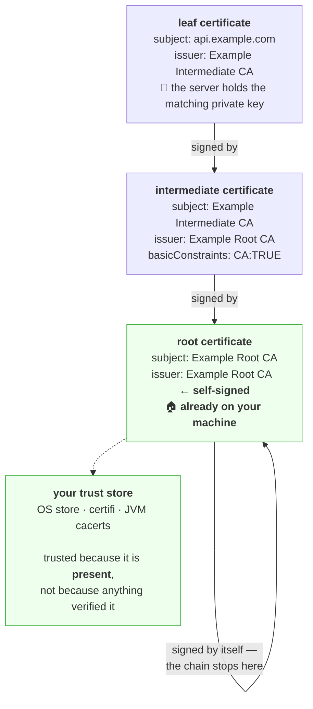

# 3.3 — The certificate and the chain of trust

## One-line answer

A certificate is a signed statement binding a public key to a name, and it is worthless on its own —
what makes it mean anything is a **chain**: this certificate was signed by an intermediate, which was
signed by a root, and **the root is already on your machine**, put there by your operating system or your
Python installation long before you made this connection.

---

## The story

🎬 **The scene.** A woman turns up at a bank to withdraw a large sum and produces a laminated card that
says *"This is Aisha Rahman"* with her photograph on it.

The clerk turns it over. On the back: *"Issued by the Bramfield Passport Office"*, with a signature.

The clerk does not know Bramfield Passport Office. So she looks at the accompanying sheet: *"Bramfield
Passport Office is authorised to issue identity cards"*, signed by the National Records Authority.

😬 **The naive fix.** A trainee says the card is fine — it has a photograph and a signature, and it looks
official.

💥 **Why it fails.** Anyone can print a laminated card. Anyone can sign it. The card proves nothing about
identity; **it only relays a claim from whoever signed it**, and the claim is worth exactly as much as
your reason to trust that signer. A card signed by "The Bramfield Passport Office" is meaningless unless
you can establish that the Bramfield Passport Office exists and is entitled to make such statements.

💡 **The insight.** The clerk trusts the card because of a chain that ends somewhere she trusts *without
being told to* — the National Records Authority, whose seal she was trained to recognise on her first day
and which is not itself vouched for by anybody. **Every trust system bottoms out in something you accept
axiomatically**, and knowing what that thing is, and who put it there, is the entire security question.

---

## The idea in plain language

A **certificate** is a small file containing, at minimum:

- a **subject** — the name or names this certificate is for,
- a **public key** — half of a key pair; the other half, the private key, never leaves the server,
- an **issuer** — who signed this,
- a **validity period** — `notBefore` and `notAfter`
  ([4.1](../04-certificates-in-time/4.1-expiry-is-a-date-not-a-warning.md)),
- **extensions** — including the list of hostnames it covers,
- and a **signature** over all of the above, made with the *issuer's* private key.

The format is X.509, defined by RFC 5280. Verified at `https://www.rfc-editor.org/rfc/rfc5280.html` on
**2026-08-25**, the validity field is *"Validity ::= SEQUENCE { notBefore Time, notAfter Time }"* and the
certificate is valid *"from notBefore through notAfter, inclusive."*

**The signature is the entire mechanism.** It says: *whoever holds the issuer's private key asserts that
this public key belongs to this name.* Verifying it requires the issuer's public key — which arrives in
the issuer's own certificate, which was signed by *its* issuer, and so on.

### The chain, and where it stops



**The root is self-signed**, which sounds like a joke and is the point. Its signature proves nothing. It is
trusted because **it is already installed on your machine** — in the operating system's certificate store,
or in Python's case usually in the `certifi` package's bundled file.

So the honest statement of what happens when your browser shows a padlock is: *"a company whose root
certificate ships with my operating system has asserted, through one or more intermediates, that this
public key belongs to this name."* **Not "this site is safe."** Not "this site is who it says it is,
independently verified by me." A chain of assertions ending at a file somebody put on your computer.

### Three properties of the chain worth knowing

**The server must send the intermediates.** Your trust store has roots, not intermediates. The server is
responsible for sending its leaf *and* the intermediates that connect it to a root. **A server that sends
only its leaf works in browsers — which cache intermediates from previous sites — and fails in `curl`,
Python and Java**, which do not. That asymmetry is the single most confusing certificate bug there is, and
it is the third failure in *When it breaks*.

**Intermediates exist to protect the root.** A root's private key is kept offline, in a safe, used a
handful of times a decade. Intermediates do the daily signing. If an intermediate is compromised it can be
revoked without invalidating every certificate the root ever vouched for.

**`basicConstraints: CA:TRUE` is what makes a certificate able to sign others.** RFC 5280's
`basicConstraints` extension carries a `cA` boolean, and a certificate without it set must not be accepted
as an issuer. **This is not a formality**: the absence of that check in early browsers meant anyone with a
valid certificate for any domain could sign a certificate for any other domain.

### The name, and the field that is not the name

Historically the hostname lived in the subject's **Common Name** (`CN`). It no longer does, and this is a
real change rather than a style preference.

RFC 9525 — *Service Identity in TLS*, verified at `https://www.rfc-editor.org/rfc/rfc9525.html` on
**2026-08-25** — states: *"The Common Name RDN MUST NOT be used to identify a service because it is not
strongly typed (it is essentially free-form text) and therefore suffers from ambiguities in
interpretation."* Clients must *"Only check DNS domain names via the subjectAltName extension designed for
that purpose: dNSName."*

**So the field that matters is `subjectAltName`, usually written SAN.** A certificate whose hostname
appears only in the `CN` is rejected by every current client, and this is the cause of a whole family of
"but the certificate has the right name in it" bugs. `CN` is still present and still shown by tools, which
is exactly why people keep looking at the wrong field.

---

## Why Kriya needs it

**Day 40** puts `pulse` behind an ingress with a TLS certificate, and every failure that day is a chain
failure. **Day 58** manages certificates with a controller, whose whole job is issuing and renewing links
in this chain.

**Day 29** hardens container images, where a minimal base image may **not include a trust store at all** —
so an application that worked on your laptop cannot verify any certificate in the container. That is one
of the most common "it works locally" container bugs, and it is a missing root, not a code change.

**Day 125** calls a hosted model provider over HTTPS, and the connection is only meaningful because a
chain ends at a root in `certifi`. **Day 205** authenticates MCP servers, where mutual TLS makes the
*client* present a certificate too — the same mechanism, pointed the other way.

**Day 216** threat-models the system, and *"who can issue a certificate our clients will accept"* is one
of the sharpest questions there. **Day 218** covers supply chain, where the trust store is a dependency
you did not know you had.

---

## The mechanism

Pull a real chain apart. `openssl` is the instrument, and it ships with Git for Windows — verified locally
on **2026-08-25** as `OpenSSL 3.5.6 7 Apr 2026`, recorded in `docs/PACKAGES.md`.

```bash
openssl s_client -connect www.rfc-editor.org:443 -servername www.rfc-editor.org -showcerts </dev/null 2>/dev/null \
  | grep -E '^( [0-9] s:| [0-9] i:|Verify return code)'
```

**Line by line:**

- `s_client` — OpenSSL's TLS client. It does the handshake and prints everything it learned.
- `-connect host:443` — where to connect. Verified against `openssl s_client -help` on **2026-08-25**.
- `-servername www.rfc-editor.org` — **sets the SNI extension in the ClientHello**
  ([3.4](3.4-sni-one-address-many-certificates.md)). Omit it against a shared host and you get the wrong
  certificate, which is a confusing way to start a debugging session.
- `-showcerts` — print every certificate the server sent, not just the leaf. **This is how you find out
  whether the intermediates are there.**
- `</dev/null` — `s_client` stays open for interactive input by default; feeding it nothing makes it exit
  after the handshake instead of hanging.
- `2>/dev/null` — the connection log goes to stderr and is noise here.
- `grep -E '^( [0-9] s:| [0-9] i:|Verify return code)'` — `s:` is the subject and `i:` the issuer of each
  certificate in the chain, numbered from zero. **Reading those pairs top to bottom is reading the
  chain.**

Observed on **2026-08-25**:

```text
 0 s:CN=rfc-editor.org
   i:C=US, O=Let's Encrypt, CN=R13
 1 s:C=US, O=Let's Encrypt, CN=R13
   i:C=US, O=Internet Security Research Group, CN=ISRG Root X1
Verify return code: 0 (ok)
```

**Read the pattern: certificate 0's issuer is certificate 1's subject.** That is the link. Certificate 1's
issuer, `ISRG Root X1`, is not in the list — **because the server does not send the root; your machine
already has it.** And `Verify return code: 0 (ok)` is OpenSSL confirming it found that root locally and
the chain checks out.

### Reading one certificate's fields

Extract the leaf and look inside it:

```bash
openssl s_client -connect www.rfc-editor.org:443 -servername www.rfc-editor.org </dev/null 2>/dev/null \
  | openssl x509 -noout -subject -issuer -dates -ext subjectAltName,basicConstraints,keyUsage
```

**Line by line:**

- The first command's stdout includes the leaf certificate in PEM form, which the second command reads
  from stdin. **A pipe rather than a temporary file**, so nothing is left on disk.
- `x509` — the certificate-inspection subcommand.
- `-noout` — do not re-print the certificate itself, only what was asked for. Without it you get the whole
  base64 blob as well.
- `-subject -issuer -dates` — the three identity fields. `-dates` prints both `notBefore` and `notAfter`,
  verified against `openssl x509 -help` on **2026-08-25**.
- `-ext subjectAltName,basicConstraints,keyUsage` — print exactly these extensions. **`subjectAltName` is
  the field that actually decides hostname matching**, per RFC 9525; the other two say what the
  certificate is allowed to be used for.

```text
subject=CN=rfc-editor.org
issuer=C=US, O=Let's Encrypt, CN=R13
notBefore=Jul 14 08:22:41 2026 GMT
notAfter=Oct 12 08:22:40 2026 GMT
X509v3 Subject Alternative Name:
    DNS:rfc-editor.org, DNS:www.rfc-editor.org
X509v3 Basic Constraints: critical
    CA:FALSE
X509v3 Key Usage: critical
    Digital Signature, Key Encipherment
```

**Four things to read here, in order of how often they cause an incident.**

`DNS:rfc-editor.org, DNS:www.rfc-editor.org` — **two names, and both are needed.** A certificate for
`rfc-editor.org` alone would fail for `www.rfc-editor.org`, because the match is exact.

`CA:FALSE` — this certificate may **not** sign others. That is what makes it a leaf.

`notAfter=Oct 12 ...` — the expiry, which is [4.1](../04-certificates-in-time/4.1-expiry-is-a-date-not-a-warning.md)'s
whole subject.

And `critical` on two extensions — **a client that does not understand a critical extension must reject
the certificate**, which is how the format evolves safely.

### Finding your own trust store

The root that validated all of the above is a file on your disk. Find it:

```bash
uv run python -c "
import ssl
paths = ssl.get_default_verify_paths()
print('openssl cafile :', paths.openssl_cafile)
print('openssl capath :', paths.openssl_capath)
ctx = ssl.create_default_context()
stats = ctx.cert_store_stats()
print('certificates loaded into a default context:', stats)
"
```

**Line by line:**

- `ssl.get_default_verify_paths()` — where the `ssl` module looks for roots, documented at
  `https://docs.python.org/3/library/ssl.html` and checked **2026-08-25**.
- `ctx.cert_store_stats()` — a dictionary reporting how many certificates, CRLs and X.509 objects the
  context holds. **The `x509_ca` count is the number of certificate authorities your Python trusts**, and
  seeing that number is the point of this command.
- Note this is **Python's** view. `curl`, your browser, the JVM and a container image each have their own,
  and they routinely disagree — which is why "it works in the browser" is not evidence about your service.

```text
openssl cafile : None
openssl capath : None
certificates loaded into a default context: {'x509': 0, 'x509_ca': 0, 'crl': 0}
```

**On Windows those counts are frequently zero**, because Python uses the operating system's certificate
store through a different mechanism rather than a PEM file. **A zero here does not mean verification is
broken** — the connections above succeeded — and mistaking it for a fault is a genuine trap. Confirm with
the thing that matters:

```bash
uv run python -c "
import httpx2
r = httpx2.get('https://www.rfc-editor.org/rfc/rfc5280.html')
print('verification succeeded, status:', r.status_code)
import certifi
print('certifi bundle used by httpx2:', certifi.where())
"
```

**Line by line:**

- The successful request **is** the verification test — httpx2 verifies by default
  ([3.5](3.5-verification-and-the-flag-that-turns-it-off.md)).
- `certifi.where()` — the path to the CA bundle httpx2 uses. `certifi` is a curated copy of Mozilla's root
  list, shipped as a Python package, and **it is a dependency that updates on its own schedule** rather
  than with your operating system.

```text
verification succeeded, status: 200
certifi bundle used by httpx2: C:\...\.venv\Lib\site-packages\certifi\cacert.pem
```

**That file is your root of trust.** Open it and you will find a few hundred certificates from
organisations you have never heard of, any one of which could issue a certificate your code would accept.
**That is the honest shape of the public web's trust model**, and it is worth having looked at once.

---

## When it breaks

**A self-signed certificate.** The one you will meet first, in
[5.2](../05-pulse-on-tls/5.2-serving-pulse-over-tls-on-purpose.md):

```text
httpx2.ConnectError: [SSL: CERTIFICATE_VERIFY_FAILED] certificate verify failed:
self-signed certificate (_ssl.c:1010)
```

**What it says:** self-signed.
**What it actually means:** the chain has one link and it ends nowhere. The certificate's issuer is itself,
and that issuer is not in your trust store, so **there is no path to anything you trust.**
**The smallest fix, for a local certificate you made yourself:** add your own CA to the client's trust
store — not `verify=False`
([3.5](3.5-verification-and-the-flag-that-turns-it-off.md)).
**The distinction that matters:** a self-signed certificate is not "less secure" in itself. It is
*unverifiable by a stranger*, and the fix is to make your machine not a stranger.

**An unknown issuer.** Nearly identical text, entirely different cause:

```text
ssl.SSLCertVerificationError: [SSL: CERTIFICATE_VERIFY_FAILED] certificate verify failed:
unable to get local issuer certificate (_ssl.c:1010)
```

**What it says:** cannot find the issuer locally.
**What it actually means, and there are two possibilities that look identical:** either the server did not
send its intermediates, or your trust store is missing the root. **Distinguishing them is the diagnostic
skill.**
**How to tell:** run the `-showcerts` command above. **If only one certificate comes back, the server is
at fault**; if the chain is complete, your trust store is.
**The smallest fix:** for the server case, configure it to serve the full chain — most tools produce a
`fullchain.pem` for exactly this and people deploy `cert.pem` by mistake. For the trust-store case,
install the root, or update `certifi`.

**Works in the browser, fails in `curl`.** The asymmetry mentioned above:

```text
$ curl -sS https://internal.example.com/health
curl: (60) SSL certificate problem: unable to get local issuer certificate
```

...while the same URL shows a padlock in a browser.
**What it actually means:** **the server is not sending its intermediate**, and the browser has one cached
from a previous site that used the same issuer. `curl` caches nothing.
**The smallest fix:** serve the full chain. **Never** the workaround this error tempts people into, which
is `curl -k`.
**Why this is worth recognising instantly:** "it works in my browser" is offered as evidence in almost
every certificate incident, and in this failure mode it is evidence of nothing at all.

**A certificate with the name only in `CN`.** The modern rejection:

```text
ssl.SSLCertVerificationError: [SSL: CERTIFICATE_VERIFY_FAILED] certificate verify failed:
Hostname mismatch, certificate is not valid for 'api.internal'. (_ssl.c:1010)
```

...while `openssl x509 -subject` clearly shows `subject=CN=api.internal`.
**What it says:** the hostname does not match.
**What it actually means:** the client checked `subjectAltName` and found either nothing or a different
name. **`CN` is not consulted**, per RFC 9525, so a certificate that "obviously has the right name" is
correctly rejected.
**The smallest fix:** reissue with `-addext "subjectAltName=DNS:api.internal"`, which
[5.2](../05-pulse-on-tls/5.2-serving-pulse-over-tls-on-purpose.md) does.
**The tell:** `openssl x509 -ext subjectAltName` printing nothing at all. That absence is the whole bug,
and it is invisible unless you ask for that specific extension.

**A container with no trust store at all.** The Day 29 preview:

```text
ssl.SSLCertVerificationError: [SSL: CERTIFICATE_VERIFY_FAILED] certificate verify failed:
unable to get local issuer certificate (_ssl.c:1010)
```

— for **every** HTTPS destination, including well-known public ones, from inside a minimal image.
**What it actually means:** the base image has no `ca-certificates` package, so the trust store is empty.
Nothing can be verified because there is nothing to verify against.
**The smallest fix:** install `ca-certificates` in the image, or use a base image that includes it.
**Why it is worth previewing here:** the error text is identical to the two cases above, and the cause is
in a completely different place. **The same string, three causes** — which is exactly why the `-showcerts`
diagnostic matters more than the message.

---

## In production

**What a professional writes instead of the teaching version.** They never handle certificate files in
application code. Certificates are issued by automation
([4.2](../04-certificates-in-time/4.2-renewal-and-the-automation-that-must-not-fail.md)), mounted into the
proxy that terminates TLS, and the application speaks plain HTTP behind it. What they *do* own is an
**inventory**: every certificate in the system, its expiry, its SANs, and what renews it. A system whose
answer to *"how many certificates do we have"* is a shrug has an outage scheduled for a date nobody knows.

**What degrades at scale.** Chain length and trust-store divergence. Each extra intermediate adds bytes to
every handshake and one more verification step. More importantly, **every runtime has its own trust
store** — the OS, `certifi`, the JVM, the container image, the language runtime in a serverless
environment — and they drift apart. A new root introduced by a certificate authority is trusted by your
browser months before it reaches a container image somebody pinned. **The failure is always partial: some
clients work and some do not**, which reads like a network problem and is not.

**The failure that only shows with real traffic.** Client diversity. Your tests use one client with one
trust store. Production has browsers, mobile applications with pinned certificates, old devices with
expired roots, and internal services with a custom CA. **A chain change — a new intermediate, a root
rotation — breaks a subset of them**, and the subset is defined by client age rather than by anything in
your system. This is why certificate changes are rolled out with the old chain still valid, and why
certificate pinning is a decision people regret.

**The review comment a senior engineer leaves.** *"The deployment mounts `cert.pem`, which is the leaf
only. Browsers will be fine because they cache intermediates, and our Python and Go clients will fail with
`unable to get local issuer certificate`. Mount `fullchain.pem`. And add a check to the smoke test that
runs `openssl s_client -showcerts` and asserts the chain length, because this exact mistake is invisible
until a non-browser client tries."*

**The signal you would alert on.** **Certificate expiry, as days remaining**, which
[4.1](../04-certificates-in-time/4.1-expiry-is-a-date-not-a-warning.md) covers properly — it is the single
highest-value certificate alert there is. From this part specifically: **chain completeness, checked
actively rather than passively.** A synthetic probe from a client with a *clean* trust store — no cached
intermediates — that fails when the chain is incomplete. You cannot detect this from server-side metrics,
because the server thinks it is fine; **it has to be an outside-in check.** You would **not** alert on
trust-store contents, which change with routine package updates.

**Blast radius.** This part adds no capability to `pulse`. It makes outbound TLS connections to a public
specification host and reads certificate metadata. **Nothing is written to disk and no trust store is
modified.** Worst case: a handful of handshakes against a documentation server. Who can trigger it: you.
What bounds it: read-only inspection commands, and `</dev/null` so `s_client` cannot sit holding a
connection open.

**Cost.** `0` model calls, `0` tokens, `0` CI minutes, `0` disk, negligible RAM. **Network: a few TLS
handshakes and one page fetch, a few hundred kilobytes.** `openssl` is already installed with Git for
Windows — no package is added today.

**The interview question.** *"Your service works in a browser but your Python client says `unable to get
local issuer certificate`. What is wrong?"* The answer that lands names the asymmetry: *"Almost certainly
the server is serving the leaf certificate without its intermediates. Browsers cache intermediates from
other sites that used the same issuer, so they can complete the chain themselves; `curl`, Python and Go do
not, so they fail. I would confirm with `openssl s_client -showcerts` — if only one certificate comes back,
that is the answer — and the fix is to deploy the full chain rather than just the leaf. The other
possibility is a missing root in the client's trust store, which is common inside minimal container images
that ship without `ca-certificates`, and the same `-showcerts` output distinguishes the two immediately."*

---

## Check yourself

```bash
openssl s_client -connect www.rfc-editor.org:443 -servername www.rfc-editor.org -showcerts </dev/null 2>/dev/null | grep -cE '^-----BEGIN CERTIFICATE-----'
openssl s_client -connect www.rfc-editor.org:443 -servername www.rfc-editor.org </dev/null 2>/dev/null | openssl x509 -noout -ext subjectAltName
```

A count of how many certificates the server sent, and the list of names the leaf actually covers. **The
count must be at least two — the leaf and one intermediate — and the root must not be among them.** Say
why the server does not send the root, and where it comes from instead.

**Say out loud, without scrolling up:** *Explain what a certificate signature actually proves, and why a
self-signed root at the top of the chain is not circular reasoning. Then say which certificate field a
modern client uses to match a hostname, and which field it deliberately ignores.*
