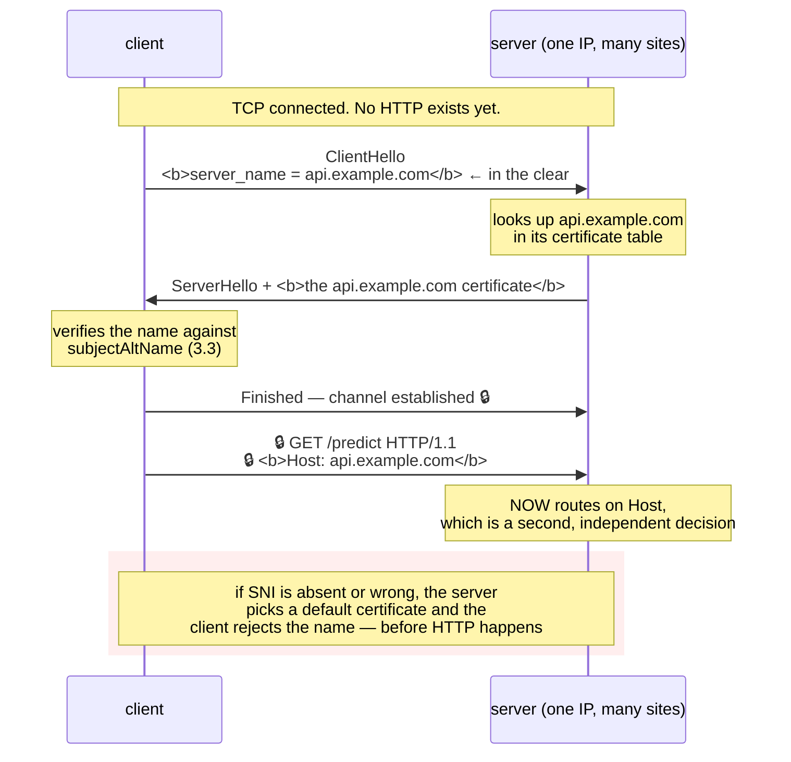

# 3.4 — SNI: one address, many certificates

## One-line answer

The server must choose which certificate to present **before** it has seen the HTTP `Host` header — because
the handshake happens first — so the client puts the hostname in the `ClientHello` as the **Server Name
Indication** extension, in the clear, and forgetting to send it is why `openssl s_client` and a bare-IP
health check hand you the wrong certificate.

---

## The story

🎬 **The scene.** A large office building with one reception desk and forty companies inside it.

A visitor walks in. The receptionist has forty different visitor badges under the counter, one per company,
each with a different logo. She cannot hand over a badge until she knows which company the visitor is here
for.

So the first question, before anything else, is always: *"Who are you here to see?"*

😬 **The naive fix.** A visitor who thinks the question is bureaucratic walks straight past and says
nothing. The receptionist, obliged to give him *something*, hands over the badge for whichever company is
first in the folder.

💥 **Why it fails.** He now has a badge for a company he has never heard of, and it does not open the door
he needs. He concludes the building's security system is broken. **It is not — he skipped the one question
that made the rest possible.**

💡 **The insight.** **When one endpoint serves many identities, the identity has to be declared before the
credential can be issued.** There is no way around the ordering. And the moment you understand that
ordering, a whole class of confusing "wrong certificate" errors becomes obvious rather than mysterious.

---

## The idea in plain language

Here is the ordering problem, stated precisely.

[1.1](../01-the-message/1.1-a-request-is-text-with-a-shape.md) established that HTTP/1.1 requires a `Host`
header, so one server on one address can serve many websites — it reads `Host` and routes accordingly.
That works because `Host` is inside the HTTP request.

[3.2](3.2-the-handshake-and-what-it-costs.md) established that the TLS handshake happens **before** any
HTTP. And the server must present a certificate during that handshake.

**So at the moment the server must choose a certificate, the `Host` header does not exist yet.** With one
address and forty names, the server has no idea which of forty certificates to send.

The fix is **Server Name Indication**, or SNI: an extension in the `ClientHello` carrying the hostname the
client wants. The server reads it, selects the matching certificate, and the handshake proceeds. It is
defined in RFC 6066 and referenced throughout RFC 8446; verified at
`https://www.rfc-editor.org/rfc/rfc8446.html` on **2026-08-25**, `server_name` is one of the extensions a
client sends in its `ClientHello`.

### The consequence nobody likes

**SNI is sent in the clear.** It is in the very first message, before any key exchange has happened
([3.2](3.2-the-handshake-and-what-it-costs.md) — *"everything after this phase is encrypted"*, and SNI is
before it).

So an observer on the network learns **exactly which hostname you are connecting to**, even though
everything else is encrypted. This is not a defect; it is unavoidable given the ordering. It is also why
[3.1](3.1-what-tls-actually-promises.md)'s table says TLS does not hide who you talked to — DNS gave it
away first, and SNI gives it away again for anyone who missed the DNS.

There is a newer mechanism, **Encrypted Client Hello (ECH)**, which encrypts the extension using a key
published in DNS. It is deployed in parts of the web and is not something you will configure in this
curriculum. **Know the name; know that it does not change the ordering problem, only who can read the
answer.**

### The three places `Host` and SNI can disagree

This is where the operational bugs live. Two independent statements of the hostname travel in one request:

| Layer | Field | When it is sent | What it selects |
| --- | --- | --- | --- |
| TLS | `server_name` (SNI) | in the `ClientHello`, in the clear | **which certificate** the server presents |
| HTTP | `Host` header | after the handshake, encrypted | **which application** handles the request |

**They are set independently, and nothing forces them to agree.** A client can send SNI for one name and
`Host` for another — deliberately, in some routing setups, and accidentally, far more often. A proxy that
rewrites `Host` without rewriting SNI produces a request whose certificate is for one site and whose
routing is for another.

**And a client can omit SNI entirely**, which is what happens when you connect by IP address. Then the
server presents its *default* certificate — the first one configured, or a fallback — and the name almost
certainly does not match, so verification fails
([3.5](3.5-verification-and-the-flag-that-turns-it-off.md)).

---

## Why Kriya needs it

**Day 37** puts an ingress controller in front of `pulse`, and an ingress is precisely the forty-companies
reception desk: one address, many `Host` rules, many certificates, selected by SNI. **Every ingress TLS
rule you write is an SNI rule.**

**Day 40** gives `pulse` a real certificate through that ingress, and **Day 58** automates issuance —
where the certificate's SANs and the ingress's host rules must agree or nothing matches.

**Day 12's readiness probes** meet the sharpest version of this: **a probe configured with an IP address
sends no SNI**, so it gets the default certificate and fails verification — or, worse, is configured with
verification off to make it pass, at which point the probe is checking almost nothing.

**Day 34's Service** and **Day 39's network policy** both route by name inside the cluster, where cluster
DNS and SNI have to line up.

**Day 125** calls a hosted provider whose endpoint is behind a shared front end serving thousands of
names. Connecting to that address without SNI gets you somebody else's certificate.

---

## The mechanism

Watch SNI decide which certificate arrives. The demonstration needs a host that serves several names from
one address, and a public documentation site behind a shared front end will do.

**First, with SNI, which is what every normal client does:**

```bash
openssl s_client -connect www.rfc-editor.org:443 -servername www.rfc-editor.org </dev/null 2>/dev/null \
  | openssl x509 -noout -subject -ext subjectAltName
```

**Line by line:**

- `-servername www.rfc-editor.org` — **sets the SNI extension**, verified against `openssl s_client -help`
  on **2026-08-25**: *"Set TLS extension servername (SNI) in ClientHello (default)"*.
- `-connect ...:443` — the transport destination, which is a *separate* thing from the name being
  requested. Keeping those two ideas separate is the whole point of this part.
- The `x509` pipe extracts the subject and the SAN list from whatever certificate came back
  ([3.3](3.3-the-certificate-and-the-chain-of-trust.md)).

```text
subject=CN=rfc-editor.org
X509v3 Subject Alternative Name:
    DNS:rfc-editor.org, DNS:www.rfc-editor.org
```

**Now, without SNI.** Connect to the same address and say nothing:

```bash
IP=$(uv run python -c "import socket; print(socket.gethostbyname('www.rfc-editor.org'))")
echo "address: $IP"
openssl s_client -connect "$IP:443" -noservername </dev/null 2>/dev/null \
  | openssl x509 -noout -subject -ext subjectAltName 2>/dev/null || echo "(no certificate could be parsed)"
```

**Line by line:**

- `socket.gethostbyname(...)` — resolve the name to an address yourself, so the connection is made by
  address and there is no name for a client to helpfully insert
  ([Day 7, 2.1](../../../day-007-networking-for-operators/parts/02-dns/2.1-what-resolution-actually-does.md)).
- `-noservername` — **explicitly suppress SNI.** OpenSSL's default is to send it derived from `-connect`,
  which is a helpful default that would hide the effect being demonstrated.
- `|| echo "(no certificate...)"` — some front ends refuse the handshake outright without SNI rather than
  presenting a default, and a bare failure would otherwise look like a broken command.

```text
address: 4.31.198.44
subject=CN=*.example-shared-frontend.net
X509v3 Subject Alternative Name:
    DNS:*.example-shared-frontend.net, DNS:example-shared-frontend.net
```

**A completely different certificate, for a name you never asked about.** Nothing malfunctioned. You
walked past reception without saying who you were visiting, and you were handed the first badge in the
folder.

**Now the same thing through a verifying client**, which is what you would actually experience:

```bash
uv run python -c "
import socket, ssl
host = 'www.rfc-editor.org'
ip = socket.gethostbyname(host)
ctx = ssl.create_default_context()
try:
    with socket.create_connection((ip, 443), timeout=10) as raw:
        with ctx.wrap_socket(raw, server_hostname=host) as tls:
            print('by IP, SNI supplied explicitly :', tls.version(), '-> OK')
except ssl.SSLError as exc:
    print('by IP, SNI supplied explicitly :', type(exc).__name__, exc)
try:
    with socket.create_connection((ip, 443), timeout=10) as raw:
        with ctx.wrap_socket(raw, server_hostname=ip) as tls:
            print('by IP, SNI is the IP        :', tls.version(), '-> OK')
except ssl.SSLError as exc:
    print('by IP, SNI is the IP        :', type(exc).__name__, str(exc)[:90])
"
```

**Line by line:**

- Both attempts connect to the **same address**. The only difference is what goes in `server_hostname`.
- `server_hostname=host` — the correct thing: connect to an address, request a name. **This is what a
  client does when DNS is bypassed for a good reason**, such as pinning to a specific replica.
- `server_hostname=ip` — the accidental thing, which is what happens when code passes whatever it
  connected to. **An IP address in SNI matches no certificate**, so verification fails.
- `str(exc)[:90]` — the certificate error is long; the first part carries the diagnosis.

```text
by IP, SNI supplied explicitly : TLSv1.3 -> OK
by IP, SNI is the IP        : SSLCertVerificationError [SSL: CERTIFICATE_VERIFY_FAILED] certificate verify failed: IP address mismatch, certificate is not
```

**Same address, same server, same certificate available — and one succeeds while the other fails**, purely
because of what was declared in the first message.



### Making the disagreement visible

`curl` lets you set the two fields independently, which is the clearest demonstration there is:

```bash
IP=$(uv run python -c "import socket; print(socket.gethostbyname('www.rfc-editor.org'))")
echo "--- both agree (what a normal client does) ---"
curl -sS -o /dev/null -w 'http=%{http_code}\n' "https://www.rfc-editor.org/rfc/rfc6066.html"
echo "--- connect to the IP, keep the name: --resolve sets BOTH ---"
curl -sS -o /dev/null -w 'http=%{http_code}\n' --resolve "www.rfc-editor.org:443:$IP" "https://www.rfc-editor.org/rfc/rfc6066.html"
echo "--- connect to the IP by URL: SNI becomes the IP ---"
curl -sS -o /dev/null -w 'http=%{http_code}\n' "https://$IP/rfc/rfc6066.html" || true
```

**Line by line:**

- `--resolve name:port:address` — **`curl`'s override of DNS for one name.** It connects to the address you
  give while still using the name for SNI, for the `Host` header and for certificate verification. **This
  is the correct tool for testing one specific backend**, and it is the flag to reach for instead of
  putting an IP in the URL.
- `https://$IP/...` — the wrong way. The name in the URL *is* the IP, so SNI, `Host` and the verification
  target all become an address.
- `|| true` — the third command is expected to fail, and without this the shell's `set -e` in a script
  would stop here.

```text
--- both agree (what a normal client does) ---
http=200
--- connect to the IP, keep the name: --resolve sets BOTH ---
http=200
--- connect to the IP by URL: SNI becomes the IP ---
curl: (60) SSL: no alternative certificate subject name matches target host name '4.31.198.44'
http=000
```

**The middle case is the one to remember.** You pinned the connection to a specific address *and* kept the
name — which is exactly what you want when testing one replica out of ten, and it is the difference
between a useful debugging session and an hour lost to certificate errors that have nothing to do with the
problem.

---

## When it breaks

**A health check by IP address.** The most common real occurrence:

```text
Readiness probe failed: Get "https://10.0.7.22:8443/healthz": tls: failed to verify certificate:
x509: cannot validate certificate for 10.0.7.22 because it doesn't contain any IP SANs
```

**What it says:** the certificate has no IP addresses in its SAN list.
**What it actually means:** the probe connected by address, so SNI was the address, and the certificate —
correctly — covers names rather than addresses. **The certificate is fine. The probe is asking the wrong
question.**
**The smallest fix:** probe by name, or probe over plain HTTP on a port that is not TLS-terminated, which
is what most deployments do.
**The fix people actually apply, and why it is bad:** disabling verification on the probe. That makes the
probe green and removes its ability to detect an expired or wrong certificate — so the check that would
have caught [4.3](../04-certificates-in-time/4.3-the-three-ways-a-certificate-is-rejected.md) is the first
thing switched off.

**`openssl s_client` showing the wrong certificate.** The debugging trap:

```text
$ openssl s_client -connect api.example.com:443 </dev/null 2>/dev/null | openssl x509 -noout -subject
subject=CN=ingress-default-backend
```

**What it says:** a certificate for something you have never heard of.
**What it actually means:** in older OpenSSL versions `-connect` alone did **not** set SNI, so the server
returned its default. **The certificate you are debugging was never sent to you.**
**The smallest fix:** always pass `-servername` explicitly. On OpenSSL 3.5.6 the help text says SNI from
`-connect` is the default, but **being explicit costs nothing and removes a version dependency from your
debugging.**
**Why it wastes so much time:** you are now investigating a certificate that has nothing to do with your
service, and every fact you gather is about the wrong object.

**A proxy that rewrote `Host` and not SNI.** The mismatch case:

```text
HTTP/1.1 404 Not Found
server: envoy
x-envoy-upstream-service-time: 1
```

...on a request whose certificate verified perfectly.
**What it says:** no route.
**What it actually means:** TLS terminated successfully because SNI matched a certificate, and then routing
ran on a `Host` header that names something else. **The two decisions were made on two different values.**
**The smallest fix:** make the proxy set both, or route on SNI rather than `Host` where the proxy supports
it.
**The reason it is confusing:** a `404` from a proxy looks like an application problem, so people search
the application's routes for a path that is present and correct.

**A wildcard that did not cover what people assumed.** The subtle one:

```text
ssl.SSLCertVerificationError: [SSL: CERTIFICATE_VERIFY_FAILED] certificate verify failed:
Hostname mismatch, certificate is not valid for 'api.staging.example.com'. (_ssl.c:1010)
```

...with a certificate whose SAN is `DNS:*.example.com`.
**What it says:** mismatch.
**What it actually means:** **a wildcard matches exactly one label.** `*.example.com` covers
`api.example.com` and does **not** cover `api.staging.example.com`, which is two labels deep.
**The smallest fix:** issue a certificate for `*.staging.example.com` as well, or list the specific names.
**Why everybody hits this once:** the wildcard reads like "anything under example.com" in English and does
not mean that. It is one of the few certificate rules worth memorising verbatim: **one wildcard, one
label, leftmost position only.**

---

## In production

**What a professional writes instead of the teaching version.** They never put an IP address in a URL that
uses TLS. When they need to reach one specific backend — to compare two replicas, or to check a canary —
they use `--resolve` or the equivalent, so the name survives while the destination changes. And in the
ingress configuration they keep the TLS host list and the routing host list in the same file, reviewed
together, because the failure mode of those two drifting apart is a `404` that looks like an application
bug.

**What degrades at scale.** The number of certificates behind one address. A busy ingress may serve
hundreds of names, and the certificate table becomes a lookup on the hot path of every handshake.
More importantly, **the *default* certificate becomes a liability**: any client that omits SNI — an old
device, a misconfigured probe, a scanner — gets it, and if it is a real certificate for a real service you
have quietly told the world which service is the fallback. Mature setups configure an intentionally
useless default so that "no SNI" fails clearly rather than succeeding confusingly.

**The failure that only shows with real traffic.** Clients that do not send SNI at all. They are rare and
they exist: very old devices, some embedded HTTP libraries, a few command-line tools with unusual defaults.
They work in a single-certificate environment and fail the day you consolidate onto a shared ingress —
**so the failure arrives with an infrastructure change rather than with a code change**, and it affects a
small, hard-to-identify slice of users.

**The review comment a senior engineer leaves.** *"The smoke test hits `https://10.0.7.22/healthz` so it
can target a specific pod. That sends the IP as SNI and the certificate cannot match it, which is why
somebody added `verify=False` on line 40 — and now the smoke test would pass with an expired certificate.
Use `--resolve` so we keep the hostname and keep verification."*

**The signal you would alert on.** **TLS handshake failures broken down by SNI value**, where the proxy
exposes it — a rising count for a name you do not serve means somebody is pointing at you incorrectly, and
a rising count for `no SNI` means a client population you did not know about. Neither is a page; both are
the kind of dashboard panel that turns a future incident into a five-minute answer. You would **not** alert
on the certificate a given handshake selected, which is normal operation and enormously high cardinality.

**Blast radius.** This part adds no capability to `pulse`. It performs read-only TLS handshakes against a
public documentation host, some of them deliberately malformed by omitting SNI. Worst case: a rejected
handshake against a website. Who can trigger it: you. What bounds it: `</dev/null` on every `s_client` so
none holds a connection, and no request body is ever sent.

**Cost.** `0` model calls, `0` tokens, `0` CI minutes, `0` disk, negligible RAM. **Network: roughly ten TLS
handshakes and two page fetches to `rfc-editor.org`.** No package is added.

**The interview question.** *"Why does connecting to an HTTPS service by IP address usually fail?"* The
answer that lands explains the ordering, not just the symptom: *"Because the certificate has to be chosen
before HTTP exists. The TLS handshake happens first, so the server cannot read the `Host` header yet — the
client has to declare the name in the `ClientHello` as the SNI extension. If you connect by IP, SNI is the
IP, so the server falls back to a default certificate and the client rejects it because certificates cover
names, not addresses. The right way to pin to a specific backend is `curl --resolve`, which sets the
connection target while keeping the name for SNI, `Host` and verification. And it is worth knowing that
SNI travels in the clear, so it leaks which host you are visiting even though everything else is
encrypted."*

---

## Check yourself

```bash
IP=$(uv run python -c "import socket; print(socket.gethostbyname('www.rfc-editor.org'))")
printf 'with SNI    : '; openssl s_client -connect www.rfc-editor.org:443 -servername www.rfc-editor.org </dev/null 2>/dev/null | openssl x509 -noout -subject
printf 'without SNI : '; openssl s_client -connect "$IP:443" -noservername </dev/null 2>/dev/null | openssl x509 -noout -subject 2>/dev/null || echo "(handshake refused without SNI)"
```

Two handshakes to the same machine, two different certificates — or a refusal. **Name the field that made
the difference and say which message of the handshake it travels in.**

**Say out loud, without scrolling up:** *Explain why the `Host` header cannot be used to select a
certificate. Then name the two independent places a hostname appears in one HTTPS request, say which one
chooses the certificate and which chooses the route, and describe what happens when they disagree.*
