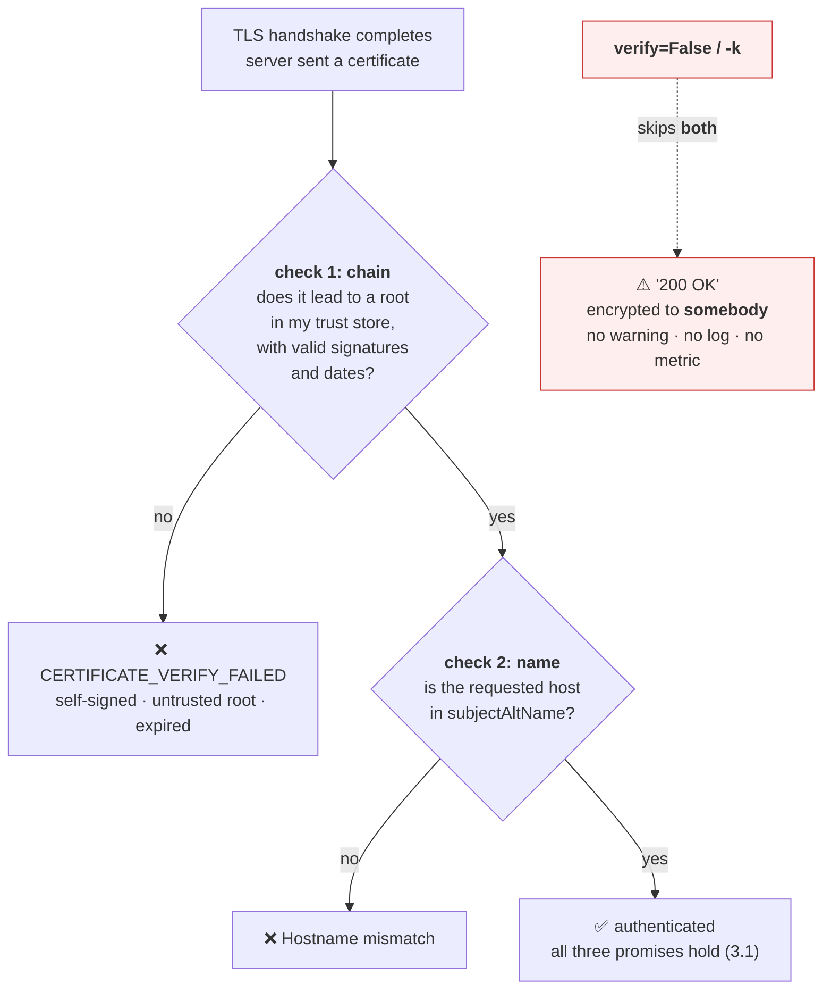

# 3.5 — Verification, and the flag that turns it off

## One-line answer

Verification is two separate checks — **is the chain valid** and **does the name match** — and every client
offers a single flag that disables both, which keeps the encryption and throws away the authentication,
leaving you with a private channel to whoever intercepted you and **no error message of any kind** to say
so.

---

## The story

🎬 **The scene.** A hotel corridor at two in the morning. A man knocks and says he is from maintenance,
there is a leak, he needs to check the bathroom.

The guest asks for identification. He pats his pockets and says he left the badge downstairs.

😬 **The naive fix.** She lets him in. He looks the part, it is a hotel, and standing in a corridor arguing
at two in the morning is unpleasant.

💥 **Why it fails.** Everything that follows is *exactly as smooth as it would have been if he were real*.
He goes into the bathroom. He comes out. He says it is fine. He leaves. Nothing bad appears to happen, and
nothing about the encounter distinguishes the case where he was maintenance from the case where he was
not.

**She will never find out.** Not because she was unlucky, but because the check she skipped was the only
mechanism that would ever have told her.

💡 **The insight.** **A skipped identity check does not produce a warning; it produces a normal-looking
outcome.** That is what makes it so easy to skip and so hard to notice afterwards. The absence of a
consequence is not evidence that there was no consequence — it is evidence that you removed the thing that
would have reported one.

---

## The idea in plain language

When a client verifies a server's certificate, it performs **two independent checks**, and conflating them
is the source of most confusion:

**Check one — chain validity.** Does this certificate lead, through valid signatures, to a root in my
trust store? Is every certificate in that path within its validity period? Is each issuer permitted to
issue ([3.3](3.3-the-certificate-and-the-chain-of-trust.md))? This asks *"is this a real certificate?"*

**Check two — name matching.** Does the name I asked for appear in this certificate's `subjectAltName`?
This asks *"is this certificate for the server I meant to reach?"*

**Both are required, and each is useless alone.** A perfectly valid certificate for `evil.example` proves
someone owns `evil.example`; it says nothing about whether you have reached `api.example.com`. And a
certificate with the right name that chains to nothing is a piece of paper anybody could have printed.

Python's `ssl` module exposes them as two settings, documented at
`https://docs.python.org/3/library/ssl.html` and verified **2026-08-25**:

| Setting | Controls | Default in `create_default_context()` |
| --- | --- | --- |
| `verify_mode` | chain validity | `CERT_REQUIRED` |
| `check_hostname` | name matching | `True` |

The documentation is explicit that `CERT_REQUIRED` alone is not enough: in client mode *"this mode is not
sufficient to verify a certificate as it does not match hostnames"* and `check_hostname` *"must be enabled
to verify certificate authenticity"*. **Two settings, both needed**, which is exactly the two checks above.

### The flag

Every client wraps both checks behind one convenience:

| Client | The flag | What it disables |
| --- | --- | --- |
| `curl` | `-k` / `--insecure` | both checks |
| httpx2 / requests | `verify=False` | both checks |
| Python `ssl` | `check_hostname = False` then `verify_mode = CERT_NONE` | one each, in that order |
| `openssl s_client` | verification is off unless you ask for it | both, by default |
| Node.js | `NODE_TLS_REJECT_UNAUTHORIZED=0` | both, **process-wide** |

**Note the ordering requirement in the Python row.** Setting `verify_mode = CERT_NONE` while
`check_hostname` is still `True` raises `ValueError` — the library refuses the incoherent combination.
That refusal is a small piece of good design worth noticing: **it will not let you ask for a check it
cannot perform.**

And note the Node.js row, which is the worst of them: an environment variable that disables verification
for **every** connection the process makes, including ones you did not write.

### Why the flag is so hard to resist

It always appears at a specific moment. Something does not work. The error mentions certificates. There is
a flag that makes the error go away and the feature ship. **Nobody sets out to disable security; they set
out to unblock themselves at five o'clock.**

And it works — immediately, completely, and with no visible downside. The request succeeds. The tests
pass. The pull request is small.

**What was actually traded away:**

- Any attacker who can position themselves in the path can present their own certificate and read and
  modify everything ([3.1](3.1-what-tls-actually-promises.md)'s authentication promise, deleted).
- The expired certificate in [4.3](../04-certificates-in-time/4.3-the-three-ways-a-certificate-is-rejected.md)
  will not be detected — by this client, ever.
- A misrouted connection to the wrong service will succeed silently.
- **And there is no signal at all.** No log line, no metric, no exception. The system reports perfect
  health forever.

That last point is what makes this different from an ordinary bug. **A disabled check has the same
observable behaviour as a passing check**, so it survives code review, testing, staging and years of
production without anything ever drawing attention to it.

### What to do instead, in each of the three real situations

The flag is almost never the right answer, and there is a specific correct answer for each case that
produces it:

**"It is a self-signed certificate on my own machine."** Add *your* CA to the client's trust store. Not
the world's trust store — the client's, for this connection.
[5.2](../05-pulse-on-tls/5.2-serving-pulse-over-tls-on-purpose.md) does exactly this.

**"It is an internal service with a private CA."** Distribute the internal root to your services'
trust stores. This is a solved operational problem and it is what a private CA is *for*.

**"It is a temporary certificate problem in production."** Fix the certificate. The flag turns a loud,
correct, one-hour outage into a silent, permanent security hole — and it will not be removed, because
nothing will ever remind anyone that it is there.

---

## Why Kriya needs it

**Day 12's probes**, **Day 40's ingress** and **Day 58's certificate automation** all produce certificate
errors while you are getting them right. Each is a moment where the flag is available and wrong.

**Day 17** builds a CI gate, and *"grep the repository for `verify=False`"* is one of the cheapest,
highest-value checks that gate can carry.

**Day 29** hardens containers, where a minimal image's empty trust store produces exactly the error that
tempts this flag — and where the correct fix is a package, not a flag.

**Day 125** calls a hosted model provider with an API key in the `Authorization` header. **Disabling
verification on that path means sending your credential to whoever answers.** It is the single worst place
in this entire curriculum to have this flag set.

**Day 216** threat-models the system and **Day 219** covers auditability, where "we verify TLS on all
outbound connections" is a control you either can or cannot evidence.

---

## The mechanism

You will watch the two checks fail independently, then watch the flag remove both at once.

Start by seeing each check fail on its own. **Check two — name matching — fails while the chain is
perfectly valid:**

```bash
uv run python -c "
import httpx2
try:
    httpx2.get('https://wrong.host.badssl.com/', timeout=15)
except httpx2.ConnectError as exc:
    print('name check   :', str(exc)[:120])
"
```

**Line by line:**

- `wrong.host.badssl.com` — a public test endpoint whose certificate is **valid and correctly chained**
  but issued for a different name. It exists precisely to exercise this check.
- `except httpx2.ConnectError` — httpx2 wraps certificate failures in `ConnectError`, because the
  connection never reached a usable state. **There is no HTTP status code here**, which is why a
  status-code-based monitor cannot see a TLS failure ([3.2](3.2-the-handshake-and-what-it-costs.md)).
- `str(exc)[:120]` — the message is long and the diagnosis is at the front.

```text
name check   : [SSL: CERTIFICATE_VERIFY_FAILED] certificate verify failed: Hostname mismatch, certificate is not valid for 'wrong.host.b
```

**Now check one — chain validity — failing while the name is correct:**

```bash
uv run python -c "
import httpx2
for url in ('https://self-signed.badssl.com/', 'https://untrusted-root.badssl.com/'):
    try:
        httpx2.get(url, timeout=15)
        print(f'{url:42} UNEXPECTEDLY SUCCEEDED')
    except httpx2.ConnectError as exc:
        detail = str(exc).split('certificate verify failed:')[-1].strip()
        print(f'{url:42} {detail[:60]}')
"
```

**Line by line:**

- Two endpoints, two different chain failures: one self-signed (no chain at all), one signed by a root
  nobody trusts (a chain that leads nowhere you accept).
- `str(exc).split('certificate verify failed:')[-1]` — pull out the specific reason, which is the part that
  distinguishes the two cases. **The prefix is identical; only the tail differs**, which is the point made
  in [3.3](3.3-the-certificate-and-the-chain-of-trust.md).
- Printing `UNEXPECTEDLY SUCCEEDED` if no exception fires — **a test that cannot fail is not a test**, and
  an assertion that silently never runs is worse than none.

```text
https://self-signed.badssl.com/            self-signed certificate
https://untrusted-root.badssl.com/         self-signed certificate in certificate chain
```

**Two distinct messages for two distinct causes**, and both are the *chain* check, not the name check.

### The flag, doing what it does

```bash
uv run python -c "
import httpx2

targets = [
    ('wrong.host.badssl.com',   'valid chain, wrong name'),
    ('self-signed.badssl.com',  'right name, no chain'),
    ('untrusted-root.badssl.com','right name, untrusted chain'),
    ('expired.badssl.com',      'right name, expired chain'),
]
for host, description in targets:
    url = f'https://{host}/'
    try:
        verified = httpx2.get(url, timeout=15).status_code
    except httpx2.ConnectError:
        verified = 'REFUSED'
    unverified = httpx2.get(url, timeout=15, verify=False).status_code
    print(f'{description:30}  verify=True: {str(verified):8}  verify=False: {unverified}')
"
```

**Line by line:**

- Four endpoints covering every way verification can fail, each labelled with which of the two checks it
  breaks.
- The **same URL** requested twice, differing only in `verify`. That symmetry is the entire experiment.
- `verify=False` — httpx2's flag, verified at `https://www.python-httpx.org/advanced/ssl/` on
  **2026-08-25**: *"`verify=False`: Disables SSL verification entirely."* Note the word **entirely** — one
  flag, both checks.
- No `try` around the `verify=False` call, because **it is not expected to fail**, and that is the finding.

```text
valid chain, wrong name         verify=True: REFUSED   verify=False: 200
right name, no chain            verify=True: REFUSED   verify=False: 200
right name, untrusted chain     verify=True: REFUSED   verify=False: 200
right name, expired chain       verify=True: REFUSED   verify=False: 200
```

**Four different failures, four identical successes.** The flag does not handle these cases — it stops
asking. And every one of those `200`s is a completely normal response that will flow into your
application, your metrics and your logs looking exactly like a correct one.

Confirm the silence directly — that there is no warning anywhere:

```bash
uv run python -W all -c "
import logging, httpx2
logging.basicConfig(level=logging.DEBUG)
r = httpx2.get('https://expired.badssl.com/', timeout=15, verify=False)
print('status:', r.status_code)
print('peer certificate available to the application:', r.extensions.get('network_stream') is not None)
" 2>&1 | grep -iE 'warn|insecure|verify|status:' | head
```

**Line by line:**

- `-W all` — show **every** Python warning, including ones normally suppressed. If a warning existed, this
  would surface it.
- `logging.basicConfig(level=logging.DEBUG)` — the most verbose logging the library offers.
- `grep -iE 'warn|insecure|verify'` — hunting specifically for any mention.
- **The expected result is that the grep finds nothing but the status line.** That absence is the lesson,
  and it is why this is a `production`-level part rather than a footnote.

```text
status: 200
```

**No warning. No log line. Nothing.** A connection to a server with a certificate that expired years ago,
reported as a clean `200`.



### The correct alternative, previewed

The flag's job — *"trust this specific certificate"* — has a right answer, and it is barely more work:

```python
"""Trust one specific CA for one specific client, instead of trusting everything."""

import ssl

import httpx2

context = ssl.create_default_context(cafile="days/day-008-http-and-tls/lab/ca/ca.pem")
client = httpx2.Client(verify=context, timeout=10.0)
```

**Line by line:**

- `ssl.create_default_context(cafile=...)` — **the same secure defaults**, with one extra root added.
  `check_hostname` is still `True` and `verify_mode` is still `CERT_REQUIRED`; the only change is *which*
  roots are acceptable.
- `httpx2.Client(verify=context)` — passing an `SSLContext` rather than a boolean, which is the documented
  way to customise verification, checked at `https://www.python-httpx.org/advanced/ssl/` on **2026-08-25**.
- The file path points at a CA you have not created yet;
  [5.2](../05-pulse-on-tls/5.2-serving-pulse-over-tls-on-purpose.md) creates it. **This block will not run
  until then**, and it is here so that the alternative appears in the same document as the flag rather
  than two parts later.
- **What this preserves that the flag destroys:** an expired certificate from your own CA still fails, a
  wrong hostname still fails, and a certificate from any *other* issuer still fails. You narrowed trust;
  you did not remove it.

---

## When it breaks

**The error that starts it all.** Every instance of this flag begins here:

```text
httpx2.ConnectError: [SSL: CERTIFICATE_VERIFY_FAILED] certificate verify failed:
unable to get local issuer certificate (_ssl.c:1010)
```

**What it says:** the issuer is not known locally.
**What it actually means:** one of three things, and you must find out which
([3.3](3.3-the-certificate-and-the-chain-of-trust.md)) — a missing intermediate on the server, a missing
root in your store, or a genuinely untrusted certificate.
**The smallest fix depends entirely on which**, and the flag is the only response that works for all three
without telling you anything. **That universality is exactly what makes it dangerous.**
**The right first move:** `openssl s_client -showcerts`, before touching any client code.

**The flag, found in review, with a comment explaining it.** The archaeological case:

```text
$ grep -rn "verify=False\|verify_mode = ssl.CERT_NONE\|--insecure\|-k " --include=*.py --include=*.sh .
./pulse/clients.py:41:        verify=False,  # TODO: remove once staging cert is fixed (2024-11-08)
```

**What it says:** a temporary workaround with a date on it.
**What it actually means:** the staging certificate was fixed long ago and this line outlived it, because
**nothing ever failed to remind anyone.** The comment is the strongest evidence available that the author
knew it was wrong.
**The smallest fix:** delete the line and see what breaks. Usually nothing does.
**The control that prevents the next one:** that `grep`, as a CI check — Day 17. **A rule enforced by a
machine survives; a rule in a code review does not.**

**Verification disabled globally, by an environment variable.** The worst form:

```text
Warning: Setting the NODE_TLS_REJECT_UNAUTHORIZED environment variable to '0' makes TLS
connections and HTTPS requests insecure by disabling certificate verification.
```

**What it says:** an explicit warning, which is more than Python gives you.
**What it actually means:** **every** TLS connection in the process is unverified — not the one that had a
problem, all of them. Including any credential-bearing call to a third party.
**The smallest fix:** remove the variable and scope the trust change to the one client that needs it.
**Why this is worth showing in a Python curriculum:** the same pattern exists in Python as
`SSL_CERT_FILE` pointed at a permissive bundle, and in `curl` as `--insecure` inside a `.curlrc`. **A
process-wide setting is invisible at the call site**, which is the property that makes it dangerous.

**The check that could not fail.** The self-inflicted version, and it is the one to fear:

```text
$ curl -sk -o /dev/null -w 'health=%{http_code}\n' https://api.example.com/healthz
health=200
```

...against a service whose certificate expired six days ago.
**What it says:** healthy.
**What it actually means:** `-k` disabled verification, so **the health check cannot detect a certificate
problem** — which is one of the specific things a health check over TLS exists to catch. Every browser is
showing an interstitial warning and the monitoring is green.
**The smallest fix:** remove `-k` from the check and fix whatever it then reveals.
**The connection to Principle 11:** a gate that cannot go red is not a gate. `-k` is the single most common
way an HTTPS check is quietly converted into one that always passes, and
[4.1](../04-certificates-in-time/4.1-expiry-is-a-date-not-a-warning.md) builds the check that would have
caught it.

---

## In production

**What a professional writes instead of the teaching version.** They narrow trust rather than removing it:
a specific CA bundle for a specific client, configured once, with the internal root distributed by the same
mechanism that distributes everything else. When a certificate problem blocks them, they fix the
certificate — and if that genuinely cannot happen in time, the exception is **time-boxed by something
mechanical**, such as a test that fails after a fixed date, rather than by a `TODO` comment.

**What degrades at scale.** Discoverability. One `verify=False` in a small service is findable. Across
forty repositories, several languages, a handful of shell scripts and a Helm values file, the same setting
takes five different spellings and cannot be grepped for reliably. **The only scalable control is an
outside-in one:** a scanner that connects to your own endpoints from a clean trust store and asserts that
verification succeeds, so a client that skips the check is irrelevant to the finding.

**The failure that only shows with real traffic.** It never shows. That is the whole property. A disabled
verification produces no failures, no latency change, no error rate and no log line — **it produces
exactly the same telemetry as a correct configuration**, and the only difference appears on the day
somebody is actually in the path, at which point you will not find out from your monitoring either. **This
is the one item in this entire day where "we would have noticed" is definitively false**, and it is worth
saying plainly.

**The review comment a senior engineer leaves.** *"`verify=False` on the provider client means we send our
API key to whatever answers on that address. If the problem is our internal CA, add the root to the trust
store — that is three lines and it keeps expiry and hostname checking working. If the problem is a broken
certificate on their side, that is an incident with them, not a flag on our side."*

**The signal you would alert on.** You cannot alert on this from inside the client — there is nothing to
observe. **The signal has to be built:** a synthetic check that connects to each of your TLS endpoints
**with verification on, from a clean trust store**, and alerts on failure. That probe is the only thing
that turns a silent certificate problem into a page, and it also covers expiry
([4.1](../04-certificates-in-time/4.1-expiry-is-a-date-not-a-warning.md)) and chain completeness
([3.3](3.3-the-certificate-and-the-chain-of-trust.md)) for free. The second control is a **CI check** that
greps for the flag's spellings — not a signal, but the cheapest prevention there is. You would **not**
alert on TLS errors from application clients, because a client with the flag set produces none.

**Blast radius.** This part deliberately makes unverified TLS connections — a genuine capability, and the
one this whole document argues against. **Worst case: you send something sensitive to a server whose
identity you did not check.** It is bounded here in three specific ways, and they are the reason this is
safe to run: the targets are public endpoints that exist for exactly this purpose, **no request carries a
body, a credential or a header of any kind**, and every `verify=False` lives in a throwaway command rather
than in any file that could be imported. **`pulse` is not modified today and no `verify=False` is written
into any file in this repository.** Who can trigger it: you, by copying one of these commands somewhere it
does not belong — which is precisely the mistake being taught.

**Cost.** `0` model calls, `0` tokens, `0` CI minutes, `0` disk, negligible RAM. **Network: roughly a dozen
HTTPS requests to `badssl.com`, a public test service, with no bodies.** If you prefer not to reach a
third-party host at all, [4.3](../04-certificates-in-time/4.3-the-three-ways-a-certificate-is-rejected.md)
reproduces every one of these failures against certificates you generate yourself, entirely offline.

**The interview question.** *"When is it acceptable to disable TLS verification?"* The answer that lands
refuses the premise and then gives the real answers: *"Effectively never, and the reason is that it fails
silently — a disabled check produces exactly the same telemetry as a passing one, so there is no signal
that would ever tell you it is there. The three situations that produce the temptation each have a
specific correct answer: for a self-signed certificate on my own machine, add my CA to that client's trust
store; for an internal private CA, distribute the internal root; for a broken certificate in production,
fix the certificate, because the flag converts a loud hour-long outage into a permanent hole nobody will
remove. The one thing I would put in CI is a grep for the flag across every language we use, and the one
thing I would put in monitoring is an outside-in probe that verifies properly — because a client with
verification off cannot report anything useful about its own connection."*

---

## Check yourself

```bash
uv run python -c "
import httpx2
for host in ('expired', 'wrong.host', 'self-signed', 'untrusted-root'):
    url = f'https://{host}.badssl.com/'
    try:
        s = httpx2.get(url, timeout=15).status_code
    except httpx2.ConnectError:
        s = 'REFUSED'
    print(f'{host:16} verify=True: {str(s):8} verify=False: {httpx2.get(url, timeout=15, verify=False).status_code}')
"
```

Four distinct certificate defects, correctly refused in one column and uniformly accepted in the other.
**Say what each of the four would mean if it happened to a real service of yours, and which of them a
client with `verify=False` would ever tell you about.**

**Say out loud, without scrolling up:** *Name the two checks that verification performs and give an example
of a certificate that passes one and fails the other. Then explain why disabling verification is worse
than an ordinary bug, in terms of what your monitoring would show.*
